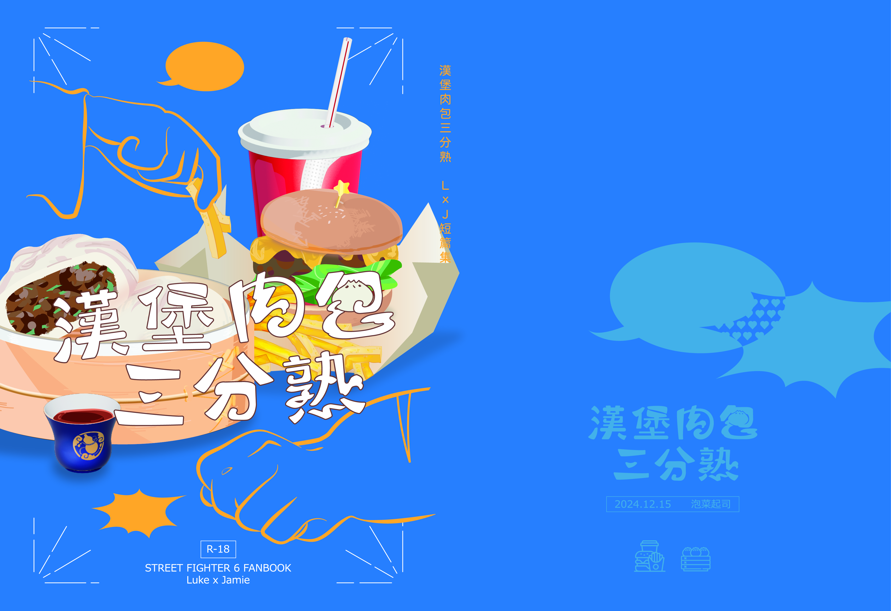

>- 個人偏好而使用了「盧克」這個譯名。
>- 還有異色組CP。

## 書籍資訊
- 實體書限定兩篇成人向文<弱點>和<酸苦惡作劇>，及一般向六篇<洋芋片>、<夜晚的冰淇淋>、<美味請趁熱品嚐>、<冰箱防腐>、<成雙成對>、<吉人天相>
- 實體書於[楓林館](https://fanhouse.waca.ec/product/detail/2111077)上架。
- 電子書預計年內上架。

## 漢堡肉包三分熟

　　格鬥家偶爾也會覺得格鬥家真是麻煩的生物。

　　盧克被踢得渾身疼，有人的腿腳跟野貓一樣不安分一直往他痛點踢，躺著喘都還會嗆到，他落得一身狼狽，但聽到不遠處的醉嗝頓時火大到彈起身。

　　「不管輸贏還是要我善後，哪有你這樣的對手！」

　　「嘖。」傑米原本想要就這樣睡下去卻被盧克這大嗓門喊得開始頭疼，「你是有多委屈？傑米哥在這洗耳恭聽。」

　　悶濕的夏季難得吹涼風，早睡早起精神爽，漫步街頭時看對眼，當然就是要拳腳交流一下……傑米怎知一局五戰三勝根本滿足不了那精力過剩的肌肉腦袋，早上三局過去他都把葫蘆喝空了，盧克還是不死心要霸占他的下午時間，他自己也是被挑釁了受不了跑回去灌滿葫蘆傻傻來赴約。

　　傑米慶幸自己贏了剛剛的對局，不然更氣。

　　「好了，別在這邊睡。」盧克嫌棄地把人拉起來，一手穿過傑米下腹一手扣好膝窩揹穩上路。

　　「我想吐……」消防員搬運法對他滿肚子醉武湯壓力太大。

　　「哈！就多撐一下唄。」大咧咧地「啪」的一掌打在傑米屁股蛋上，盧克知道傑米似乎抽動了一下不敢回頭看，自己疲勞時難免會手滑，「反正已經一身灰，想吐就吐我身上不用客氣。」

　　算好如果路上遇到有人找碴他也會硬著頭皮處理，突如其來的雷陣雨多少幫了點忙，讓他可以一路順順地溜回自己住處。

　　踢掉鞋子走在家裡地板的感覺令人放鬆，盧克原本想把愛床先讓給傑米，這是筋疲力盡的他所能拿出最大的待客之道──

　　「不要……髒。」傑米只看一眼就扭過頭去。

　　轉念一想還是扔出窗好了。

　　一不做二不休，不過盧克還沒無情到這地步，只是把傑米扔床上，傑米卻反手一撐又彈回去，酒勁還未全退順勢帶了一個點辰把沒防備的他放倒在地。

　　傑米軟趴趴地側躺在盧克旁邊，「叫你去洗澡啊，呆子。」

　　「擦乾就好了，你想洗就去啊，我是晨浴派。」後知後覺理解過來剛才是在說他們現在衣服髒。

　　傑米現在累得不想發脾氣，要不是葫蘆已經喝空了，他非常想再大灌一口。

　　「等會你也給我去洗，不然就搶你的床睡。」傑米說完三兩下脫光自己衣服扔給盧克，他眼睛都快睜不開了，沒仔細看洗衣機放哪裡。

　　依他們交情平常只有偶爾叨擾還不至於過夜，怎麼就不找地方放人反而把傑米一路揹回來了，他自己也一頭霧水。

　　盧克的工作需要偶爾出差，起初傑米以為從軍過的人家裡不是極端邋遢就是整潔得像預售屋，其實他在這裡鬼混過一個下午也沒有覺得坐不住，顯眼的模型公仔、海報和自組RGB電競設備都是些青少年秘密小窩的標準配備，屋主稚嫩天真的那面都留在這小小天地裡。

　　還是少數室內會脫鞋的，傑米很中意這點。

　　「真是的。」忘記原本想抱怨什麼，傑米繼續專心沖澡，不大不小的浴室裡他只摸得到兩個瓶子。

　　除了浴室清潔劑外，一個寫著超強效五合一洗劑，能洗全身還包衛浴清潔，瓶子就是常見放在超市角落大特價的橘藍配色，天殺的這組配色成天在那辣他眼睛。

　　「開什麼玩笑！」

　　「怎麼沖個澡也能大呼小叫？」盧克只有裝塑膠浴室門，想到門遲早被暴躁的傑米一腳踹沒了可能得換鋁門。

　　「要用這種東西洗澡你乾脆用小蘇打抹全身算了，難怪這顆頭跟乾草球一樣！」就算房間很有自己個性，這種粗心的生活方式叫傑米難以忍受。

　　盧克噴口氣把瀏海吹一邊，從容地拿起超強效五合一擠了一大坨在傑米的濕髮上慢慢抹開，看傑米那啞口無言的模樣，大概是被他待客的誠意打動了。

　　「要好好乳化啊！去你的肌肉腦袋！」

　　傑米清理養護的功夫跟他拳腳一樣俐落，根本讓盧克差不上嘴，比起不愛洗澡的大型犬，要搞定不會跳起來咬人的大塊頭簡直輕而易舉，他可是在拯救一頭被摧殘多年的毛囊。

　　他們兩個平常一見面免不了吵吵鬧鬧，想不到就算在同個空間裡也能如此安靜。

　　「這麼點頭髮不用吹那麼仔細……」

　　「囉嗦，今天是誰贏？你是大哥還我是大哥？」

　　「好──好，傑米大哥。」

　　盧克想說算了，反正他可以看電視打發時間，偶爾有人伺候也挺好的，平常都只是隨便擦擦，買了吹風機都沒在用，不知道用低溫風吹頭的感覺還不錯。他之前狠下心新買的有機棉拳擊內褲都被傑米拆去穿，有這點享受應該也不為過。

　　「舒服！」乾草球現在摸起來很順手，傑米覺得痛快多了，忍不住多摸幾把，「可別再糟蹋這麼好的頭髮了。」

　　「那些女孩還真沒白叫你帥哥。」盧克從軍多年，出來教課還是和糙漢子們混一起比較多，生活也只顧好自己日常吃喝拉撒。

　　「歪理。」換傑米自己吹頭，他盥洗一向很花時間，「我也只說過你是肌肉腦袋沒說過醜吧？罵人醜是人身攻擊，可別被人罵了還傻傻當沒事，就是有些混蛋喜歡傷人不知分寸。」

　　「肌肉腦袋」居然不是人身攻擊嗎？盧克還在訝異他們認知落差的同時想到……自己該不會被稱讚了？去酒吧玩樂的女人都不會錯過跟傑米打招呼的機會，那個傑米是認真誇他好看？

　　傑米看著天氣預報時有些心不在焉，「夏季風暴啊。」現在才注意到穿插在豪大雨聲中雷鳴。

　　「難怪突然熱得要命又下雨。」

　　「你的工作……」　

　　「如果有災情的話可能會有支援請求吧。」救援的事情盧克絕對是義不容辭，畢竟人禍可避天災無情。

　　傑米輕聲回應後就安靜了下來，放著半濕的頭髮去玄關打幾通電話。

　　「唐人街那邊？」盧克拿著吹風機開低溫，傑米自己就把頭湊過來。

　　「嗯，淹水的話日子可就難受了。」傑米時常巡邏街道，可想而知那些沒處理掉的雜物堆放和老舊水管一定會惹麻煩。「還有跟婆婆說一聲，免得她老人家擔心。」

　　剛才盧克聽不太懂他在講什麼，語速溫和平緩，仔細地叮囑、傳達和道謝，幾通電話下來都是這步調反反覆覆的。他們太常互相叫囂，完全讓他忘了傑米是好人家出身的小公子，那副為別人協調事情的模樣一時間比新聞還讓他入迷。

　　會看人臉色，也會顧慮別人的感覺……

　　「你幹嘛穿我恐怖遊戲的Ｔ恤！」

　　「會怕幹嘛留著！」

　　卻偏偏愛跟他唱反調。

　　「一看就知道這件穿最少次。」

　　在喪屍圖案的對比下，發牢騷的傑米看起來像隻張牙舞爪的小貓。

　　「聯名Ｔ恤就是留著做紀念懂不懂。」原本只是簡單盥洗一下就好弄得像大工程似的，盧克真的是累到四肢癱軟。

　　盧克往床上大字躺，傑米感覺自己屁股一時間彈離床墊幾公分，打架時那個他踢不動的體重像在嘲諷他腿功很差一樣，想起來就火大，看在大塊頭得睡加大床墊的份上忍住出腳的衝動。

　　「我買新的給你。反正你的尺寸我穿起來太啷只能當睡衣。」

　　「沒事沒事，不是介意你穿我衣服。」在街頭打架之外的時候一直互相客套這點讓盧克很不自在，他們用拳頭打得那麼火熱了，關係應該也有三分熟才對。

　　他的床有一邊靠牆，看傑米想睡外側他自己就主動往裡面挪，驕傲的貓咪佔地為王時也是這德行，更叫他哭笑不得的是就是他自己把人家帶回來的，所幸現在睡意的催促強過拌嘴的衝動。

　　街頭喧囂和陰謀的腳步也被風雨平等地壟罩。

　　習慣以格鬥交流的人不會去在意自己和對方的沉默，受傷了喊痛不會治癒，難過了說難過也不會變堅強，格鬥家大概都是會把沉默放在夜裡的生物。

　　震耳欲聾的轟鳴將兒時的盧克帶到現在，無法扭轉的事實還是能讓成年的他渾身僵硬後頸發涼。

　　出於禮儀和對過去人們的敬意，他絕不會把當時的感受注入拳頭裡面，但這些記憶難免會在沉默的時候悄悄騷動著。

　　一身冷汗之外脖子感覺到輕微的拉扯，原本打算睜開的眼睛心虛地閉緊閉好。

　　盧克有想過傑米像貓，哪知道他真的是夜貓子。

　　傑米將盧克父親的軍牌拿在手裡，不離身的飾品總有某些意義，他注意了很久，只是無關他們打架的事感覺就不方便多問。

　　指尖撫過名字停在沙利文的姓氏上，傑米就算平常在盧克面前愛胡鬧也明白這是什麼意思。軍牌放在手心掂掂，感受一位格鬥家精神支柱的重量，頓時間他心情有些複雜，這是他還打不破的牆也是還在經歷的檻，獨立是怎麼回事，榮耀又是怎麼回事，他自己追求的自在會不會其實是與之相悖的東西？

　　自己的功夫和吃過的苦頭是不會說謊的，大概也是因為這軍牌他才能持續聽到自己內在的迴響。

　　傑米安安靜靜地把軍牌安放回主人胸口，他幫忙抹掉了盧克上額角和頸窩的汗。

　　也只有這樣沉默的時候他才有餘力關心別人堆滿辛酸的谷壑。

　　頂著一張威風凜凜的臉，卻老做著最幼稚的事──

　　啪！

　　「嗨呀，有蚊子。」

　　那一掌拍得盧克差點從床上蹦起來。

　　有蚊子的話他自己就聽得到，傑米會故意這樣說八成已經發現他在裝睡。他是真的愛睏卻也不知道能幹嘛。他們湊在一起並沒有想揭開對方沉默背後的隱密，但格鬥家都是不甘平凡，只曝露自己的陽光樂觀，某天拉長的陰影就會覆到對方身上，用太多生活瑣碎事遮掩又擔心兩人關係會因此變得無趣而漸行漸遠──

　　盧克粗臂繞過傑米脖子把人扣在自己懷裡。

　　「睡覺，嗯？」

　　傑米的腳老是往他痛點踹，眼睛還往他最在乎的地方看。

　　「睡著了。」傑米說完，一陣溫熱的觸感猝不及防埋進他後腦嚇得他差點伸指甲抓盧克的手。

　　盧克大大地吸氣吐氣，廉價的洗劑味道沒有蓋過傑米身上獨特的氣味，他在清涼的青草氣息裡安睡，兩人的體溫差他們都睡著時找到了和諧，平靜安穩地包覆他們的夢。

　　被感性所困擾的夜晚他們依然睡得很好，好到有傑米比盧克早起很久，已經拿了洗好的衣服離開，包含他新拆封的內褲。

　　還好這只是普通的朋友過夜，洗漱時就看到他的超強效五合一洗劑被扔進垃圾桶裡，換成一大罐黑呼呼的東西，要是他真有個女伴這樣無情對他，大概會頹廢一陣子才能振作。不過他的冰箱多了一些瓶裝水，是好喝的牌子，精神一下就好起來了。

　　天氣預報說會持續下雨好些天，所幸雨勢並沒有預想中大。

　　「傑米大哥！」「大哥早！」

　　唐人街居民看到傑米都匯忙中抽空招呼，雖然傑米不會感到不耐煩仍走得比平常快一些，拎著兩個大塑膠袋在忙碌的人群間穿梭，碰到博蘇和徒弟找來又放不下，血氣方剛的臭小子們已經摩拳擦掌準備圍上去開幹。

　　「怎麼，早起的鳥兒有架打？」

　　「我記憶中聽到的俚語不是這樣……」博蘇十分配合地給反應，「我們只是一起來唐人街買東西。」

　　他們今天沒有排課，可以的話也想找盧克切磋，如果師父時間允許能親自賜教當然最好，練習品質也好過被無腦圍攻。

　　「用這身體？別傻了。」傑米有所懷疑，在這之前他嘴快已經讓徒弟誤以為他是在嫌棄博蘇，便順手丟了一個水瓶給博蘇，「都有中暑症狀了不是嗎？不要連身體管理都學你們傻瓜教官。在口裡含一下再吞，慢慢喝。」

　　博蘇困惑但心懷感激地收下，飲料才剛碰到舌尖，不熟悉的苦味瞬間讓他頭皮發麻。

　　徒弟眼尖發現師父的塑膠袋裡有大包裝的冷凍肉包，準備的飲料份量也不像是自己要喝的。

　　「那是涼茶嗎！」

　　「難道傑米大哥親手做的！」

　　黃箱小弟們聽到這邊的聊天忍不住滑鏟插入、花式空翻引起傑米注意。

　　「大哥大哥，我咳嗽兩天了喉嚨還是好痛啊。」

　　「有病快去看醫生，哥看起來會治病嗎！」頂多抓來痛打一頓教人越挫越勇。

　　「傑米哥，我、我最近臉一直冒痘痘……」

　　「那就別成天頭套紙箱！」

　　徒弟按住博蘇的嘴，不管是涼茶很苦還是想笑最好不要把人家的愛心吐出來，這時候收不住嘴以後就別想再體會同樣的溫情。

　　「傑米！」最揮霍人家體貼的傢伙在十米開外大咧咧地邊喊邊小跑過來，「與其換掉我的洗劑你還不如還我一條內褲啊──」唐人街街頭居民都聽得清清楚楚。

　　「老子稀罕你的內褲！」傑米帶著強力推掌的醉疾步毫不留情往盧克身上招呼。

　　現在連巷尾居民都搞懂了是誰拿誰的內褲。

　　徒弟想起師父推薦過幾款呵護皮膚的草本全身沐浴乳，對沒時間洗澡的人來說很方便。

　　雨後的大都會市氣溫攝氏二十七度、濕度百分之七十八，短暫的清寧不斷被刮擦又被抹平，擦出火花的拳頭足以蒸乾周圍濕氣。

　　很遺憾他們的拳頭無法回答昨夜裡產生的種種好奇，不過他們都相信繼續打下去總會有種未曾體驗過的真相銘刻進身體裡。

## 更好的命運

　　「那邊那位小兄弟方便占用一點時間嗎？」

　　有別於平時人潮繁多的唐人街，盧克左看右看都沒瞧到其他人，那聲可疑的呼喚不禁讓他想起最近正在玩的恐怖遊戲。

　　如果多走點路來買個包子當點心就要被妖魔鬼怪纏上，當然是裝作不知道為妙。

　　「等一下等一下！嚇到你了先跟你道個歉。」戴墨鏡的老大哥煙管一伸過去勾後領就把盧克勾了回來，「我是做這個的，別見怪。」煙管又敲敲擱在板凳旁邊的寫著「看相」的牌子，確定盧克聽進去了才慢悠悠地點煙。

　　「你給人占卜的？」

　　「是也不是。」對方摸摸鬍鬚，明明是自己把人叫來的卻一臉像是盧克給他添麻煩一樣。

　　看相先生一身素色短袍，唐人街常見的亞洲人臉孔在外人看來都差不多，盧克也說不出個好感惡感，只知道對方意圖含糊，咬字腔調重的英文也不太流利。

　　「我到唐人街也沒幾天，還在看哪裡有招人幹活，不過我也只有這本事。」他又敲敲自己的招牌，這次多了幾分無奈。

　　「這裡人很熱情，不會有問題的，我想就算被找麻煩也會有人幫你，這點我很確定。」盧克揉了揉自己後腦勺，他對算命占卜沒什麼好回憶還是先敬謝不敏。

　　「哦──略有耳聞。」看相先生興致一來，拎起左袖開始掐指數數。

　　「所以這裡應該沒我的事了，拜拜。」

　　「特種部隊也有教看天氣看方位之類的不是嗎？求生八要領之類？這看相也只是類似的事情。」

　　「嘿！」盧克下意識提高嗓音威嚇。能從體格看出從軍經驗就罷了，牽涉軍機就是另外一回事。

　　「我在唐人街繞了一大圈，就你看起來最不一樣。」看相先生扳著臉點頭碎唸，他看著盧克卻又不像是在看本人，「我對別人的過去沒啥好說的，軍人的事、就那樣吧。」

　　「是打算等一下扔給我一個難搞的命運嗎？其實背後有種種陰謀的那種。」

　　「你這是漫畫看太多了？」看相先生也知道二次元的流行不管在哪都勢不可擋。

　　原本「過去」兩字有些惹惱了盧克，不過對方沒有什麼惡意，他覺得自己應該只是不湊巧遇見一個神經質的怪人。

　　「一二三四……五、六？」看相先生換右手數數，「好吧，希望明天就能解決食宿問題。」

　　「還真的只是佔用我時間？」盧克拳頭又硬了。

　　「一開始就說了。」看相先生想起自己在來的路上買了Ｃ社漫畫泳裝特刊，至少有忙中抽空追上夏天的尾巴，「你想做買賣也可以啊。」

　　撇除那些玄了又玄的嘮叨，一開始說清楚自己沒錢吃飯的話，盧克就會乾脆直接給包子打發。

　　收下兩顆包子的看相先生卻回給盧克零錢，價格正確無誤。

　　「你、是個很幸運的人，我中意你身上『沉重的東西』。」看相先生搖手指的姿勢讓盧克想起某人，不知不覺就順著對方的意繼續聽下去，「心的感覺不對啊，做什麼都不對勁，會想用沉重的東西把焦躁壓下去很正常，不過想馴服心恐怕沒那麼容易。」

　　他伸出右手翻掌讓盧克看這隻手的正反面，一枚小東西轉眼出現在他指間。

　　「偶爾你會覺得自己很怪吧？當你內在渴望自由時，在乎的人卻是在尋找歸屬。」

　　盧克認為自己眼界不夠才難以對過去種種釋懷，在對抗恐怖份子時軍紀能減少他內心的壓力。儘管他承認了自己的不成熟後離開部隊，眼光依舊是看向遠處，有意無意地忽略內在微小的聲音──

　　刻著自己名字的軍牌在眼前晃，他差點因為突如其來的惡寒失去力氣。

　　軍牌眨眼間變成一枚古錢，盧克不禁懷疑剛才是不是腦子不正常看到了幻覺。

　　「若要談買賣，我會想買下那份『沉重』。」看相先生將古錢遞到盧克眼前。至於要不要收下這枚古錢他說隨心就好。

　　『盧克·沙利文！』

　　天外飛來一隻鞋砸了盧克的後腦，漂亮地落到他手上，鞋子跟聲音主人一樣任性。

　　冷不防地一隻腳就掠過盧克側臉踢向看相先生，看相先生也反應得快，踢了腳柱把長凳橫在身前擋，雖然剛好接下那一踢，板面還是挨不住流醉拳裂開來。

　　「嘖，板凳拳？」傑米後悔應該先喝幾口醉武湯把人跟長凳一起踢爛。

　　「幹嘛隨便攻擊無辜的人！」盧克拿著落單的鞋往傑米頭上敲。

　　「還不是因為有個蠢蛋在我地盤跟來路不明的傢伙鬼混！」

　　「也比突然被你踹好太多！」用非常規飛行武器根本不講武德，有種發個波給他瞧瞧。

　　「要拿我的鞋拿到什麼時候，是多愛不釋手！」

　　「不會自己拿走嗎！難道你是要人捧著的腳才肯穿鞋的小公主？看那腳那麼不安份還是沒收的好！」盧克不覺得自己跟笨沾得上邊，但就是想不通眼前這人對唐人街居民好、對其他格鬥家好，偏偏就對他特別粗魯又沒耐心。

　　如果他真的腦筋轉不過來，那也一定是老被罵肌肉腦袋的關係，說來說去還是傑米的錯。

　　說要動手傑米一向有求必應，所以盧克還是吃了一頓月牙叉砲。

　　傑米撿回被捏皺的鞋子，免不了要幹一架心情特別不美麗，他打算把這來路不明的人留給後面氣喘吁吁跟上的徒弟。

　　然而徒弟沒辦法像師父一樣翻身兩圈就躍下樓，剛學的架勢還擺不穩只好先用當初跟盧克學的基礎架勢。

　　「回頭加練！」正好給傑米一個揍盧克的理由。

　　盧克扳著手指熱身，「傑米你這傢伙今天啊──」打架的基礎就是觀察對手，他在鬆鬆肩膀時愣了愣，變成奇怪的歪頭姿勢，「……你臉色好差？」

　　「還不都是你！」

　　傑米一個箭步過來就上肘擊，第二下踢過來後盧克冷靜地打斷攻勢。

　　「我偶爾來唐人街逛有什麼關係？還要你同意不成！」他墊完肚子還可以散步去公園，回家再買披薩回家當晚餐。

　　傑米嘬了一口醉武湯抹嘴，血氣上臉蓋過了不小心被盧克看見的蒼白，「上次不是才給你冷凍包子嗎！」

　　「我不知道怎麼加熱啊！」他家又沒廚房！

　　「哈啊？」對應閃光拳只要慢一拍就躲不成，儘管傑米盡力承受，重心還沒回來就被盧克的DDT抓到往地上重摔一把。

　　傑米起身打斷盧克的快拳連擊，灌注怒氣的腿勁把人踢得腳抓不住地，出招後倏地重心下墜，幻醉舞的旋踢讓來不及起身的盧克又多挨幾腳。

　　傑米被這個肌肉腦袋氣到失笑，差點浪費一口醉武湯，「偶爾還是會有摸不著底細的傢伙混進唐人街，你這麼傻塊頭這麼大，簡直像在求人家剝你皮。」他就在地人，想找什麼好吃好玩的，在紅虎門那喊他一聲又沒那麼難。

　　「這跟塊頭又沒關係！」盧克起身踢傑米下段，他沒有看漏傑米想拉開距離的意圖，拳頭也因為體格優勢穩穩打在傑米臉上。「不過那個看相的確實很奇怪。」

　　「笑死人了，你信這套？」傑米順勢放低重心雙手撐地，爆廻的連續踢擊傳來舒暢的打擊感，「我婆婆也會啊，說我福薄，不好好練功以後就會比喜歡的人矮又弱，自己丟臉了，命也會變薄。」

　　想著婆婆就不知不覺間分了心，腳就這麼被盧克抓到，兩個人一時間都愣到忘記出力。

　　傑米當然不想讓盧克有機會抓到大腿摔他，雙方在奇怪的大車輪轉圈圈中拉鋸著，不知不覺傑米就順著離心力坐到盧克肩上。

　　「看現在有誰比你高，是不是要開心點？」

　　「胡鬧。」傑米都搞不懂盧克是認真吵架還是他們只是各說各話，葫蘆停到嘴邊時搖了搖，決定反手掰開盧克的嘴往死裡灌。

　　「好難喝──」盧克嗜吃速食的舌頭受不了那股辛辣的濃烈草臭味。

　　「反正那算命的話你別聽進心裡就是了。」大補物的醉武湯被盧克吐了不少，葫蘆裡剩下的也不夠傑米喝滿一口，「別把你的運氣讓給別人。」

　　別把罪惡感讓給別人。

　　別把自己的掙扎讓給別人。

　　別把內心的怨懟讓給別人。

　　小傑米覺得婆婆教的真的好難，即便是現在的大傑米頂多摸到了一點邊。

　　他明白自己仍有得失心，大師境界才有能力處理心境修行上的無形阻礙，那不是條好走的路，一個人走更難。

　　「喏。」傑米言盡於此，解釋多了會讓婆婆教他的東西變得膚淺，他只是對盧克伸出善意的手──

　　盧克沒頭沒腦地把拳頭上在傑米手上。

　　「你是狗嗎！」

　　「可是我不記得有欠你錢啊？」

　　「手機！手機借我──」

　　他們碰面次數太頻繁以至於忘記交換聯絡方式的必要性。

　　「誒。」盧克看到傑米主動找自己做些什麼都覺得很新鮮，硬要湊上去瞧一瞧，「你剛才、是不是、叫了我的全名？」他終於可以擺脫肌肉腦袋這個損人的稱呼了？

　　「連幻聽都出現了，知道隨便接近陌生人有多危險了吧。」

　　「你……擔心我有危險？」盧克不會吹噓參過軍這件事有多厲害，世上沒有完美的人性，好戰友的價值不言自明。

　　「我是怕你給我惹麻煩！」傑米還很煩盧克靠他肩膀休息。

　　盧克心情很好才沒有窮追猛打，反正死鴨子嘴硬的人都是一個樣，他忘了先前煩心的事情，一股腦盯著傑米，除了聯絡方式外還給他找了微波包子的方法，他住處的公共區和公司都有微波爐，水不夠的話微波什麼都會爆炸，最簡單的馬克杯微波法兩分鐘就可以讓他吃到熱騰騰的包子。

　　儘管醉武湯效力未退去，傑米仍可以清醒地打字，明明氣血循環一路從臉紅到脖子甚至肩膀，盧克往傑米領口裡面瞥時和本人視線撞個正著。

　　放鬆過頭的傑米沒有給太多盧克反應，只注意到自己打錯了一些字又退回去刪掉，他們之間只有手機鍵盤的機械氣泡音。

　　細微的眨眼聲撓得盧克心癢癢，傑米也沒有抗拒他額角貼著額角，任憑他攝取自己現在微涼的體溫。

　　盧克輕輕收緊了臂彎，嘴唇觸碰傑米的額頭與眉尾。彼此本來就是路上湊巧打架相識，他知道這份偶然給他的不只是「一點點」的關注，把過剩的喜悅留在了傑米的唇間，一下兩下蜻蜓點水的輕啄，藥草味的波瀾卻也拍得他腦袋有些暈暈乎乎。

　　回過神發現自己被傑米面無表情地盯著看，眼睛眨啊眨的，盧克一時間也不知道該說什麼，傑米猛地豎起一根手指才讓他緊張起來。

　　要命，八成又是要衝著他的臉點辰！

　　緊閉眼睛等著挨揍，那隻手反而是從後壓下他腦袋。

　　沒想到薄薄兩塊肉被人輕啃一下就卸了防備，舌頭互相在隱密的唇齒間緩緩推擠，經歷矯正過的齒列只是給盧克比平常多自信開口，傑米卻似乎能從中窺探到些許私密，仰頭輕點盧克敏感的上顎。

　　湧上的唾液氾濫嘴角，喉嚨又渴又燥，傑米還使勁拉住他，不許他從這場災難中臨陣脫逃──

　　不許丟下他一個人。

　　剛才的留戀以熱辣的方式封緘吻中，兩人下顎和領口皆一片濕濡。

　　盧克的雙手從頭到尾都是不知所措的。

　　『──當你內在渴望自由時，在乎的人卻是在尋找歸屬。』

　　有一瞬間、他退縮了。

　　「味道好怪。」接吻中除了醉武湯又混了更多難以言喻的味道讓傑米忍不住吐舌頭，「好了，今天的勝負怎麼算？」

　　「是你先停下手的，當、當然是我贏。」

　　「好傢伙，竟然趁火打劫。」傑米的葫蘆確實已經空空如也發揮不出全部本領。

　　傑米依然有些悶，因為盧克不像他一樣有氣感。

　　不知道先前他有多害怕。

　　習武之人不得不謹慎提防自己的執念，不論盧克當時是聽到了什麼、想到什麼，傑米只能在樓上眼睜睜看著盧克身周的氣失色扭曲。

　　用不受拘束的熱拳與格鬥家較量才是他知道的盧克本色，倘若盧克有必須執著的過去，傑米似乎也沒有立場可以阻止，到時要做出去留捨得選擇的反而是他自己。

　　就算他決定不會再為同樣的事受傷了，難免還是會覺得痛。

　　「走吧，晚餐請你吃燒臘清口。」

　　反過來說，其實他是想把盧克放在身邊？

　　只有他得為此鑽牛角尖實在不公平，但人也不能在餓肚子時想重要的事情，管他剛才有多少路人在注意他們，他就是要先大吃一頓再說。

　　迷迷糊糊過了一天，盧克還是沒有太多實感，不過燒臘很好吃。

　　沒想到自己不想吐露委屈一時的彆扭，那種想找人撒嬌的幼稚還在心裡。

　　盧克·沙利文依舊是盧克·沙利文真是太好了。

　　雖然自顧自地認定勁敵，不過沒有看走眼真是太好了，他認真這麼覺得。

　　他自以為傑米同樣也會有亞洲人的內斂，親吻卻十分狂野直率，如果真有女人可以承受得住，傑米的日常依舊只有解決別人麻煩和格鬥這幾件事令人匪夷所思。

　　今天盧克還是隨心所欲照自己喜好亂逛，意外地在酒樓瞧見熟悉的身影哼著老歌擦桌子。

　　「你還真的找到工作了！」

　　「托福托福。」看相先生一點也不奇怪自己這時間怎麼會剛好擦靠窗的桌子，窗戶還湊巧開著。多虧昨天的包子他才沒有被打到爬不起來，既然以前從來沒想過學個廚藝，索性就來拜師了。

　　他張開雙臂炫耀，不過盧克的反應沒預期的熱烈。

　　「這次要不要來點豆沙包啊，咱們的點心也一定合小兄弟胃口。」

　　「不，那個、」

　　「好咧，兩個，馬上來。」看相先生把擦桌巾甩上肩。

　　「兩個太少了啦……」雖然都是看相先生在自說自話，可這是真的低估了他的食量。

　　「請你的──不過小心，甜頭要是上癮了、」看相先生遞上包好的紙袋，「命運真要讓你享用大魚大肉的時候你還會自我懷疑呢。」

　　盧克後頸一陣雞皮疙瘩，他還扭頭過去看背後，只有在樓頂百無聊賴俯瞰眾生的傑米勾勾手指叫他上樓。熱鬧不已的唐人街能打發時間的辦法多的是，偏偏傑米對搶盧克的點心感興趣，他跟大哥們在一起的時候也是這樣，跟感情好的傢伙搶著吃格外美味。

　　那些占卜看相人的嘴真是讓盧克怕極了。

##季風

　　紅虎門附近向來是唐人街人流最盛的地點，幾步路就有公車站牌還是美食一級戰區，接近門口的彩虹酒樓樓頂平坦空曠，是觀察整條街道活力的風水寶地。

　　原本一幫混混習慣在這密謀壞事，誰知有個更惹不得的傢伙不管先來後到的禮儀直接把他們踹飛霸占這個地方。

　　「喔？」傑米拎著早餐的菠蘿包和港式奶茶上樓，和意外出現的客人大眼瞪小眼。

　　其他人都沒他早起，這個先來的傢伙也不是多不待人見，但傑米一時說不出個所以然。

　　「早……安？」他放低了視線小聲打招呼。

　　對方眨眨眼歪歪頭倏地衝往隔壁棟，傑米忍不住追上去瞧個究竟。

　　黃箱小弟們三三兩兩在樓梯間道早安，大家今天瓦楞紙的狀態都好到不行，大概是天氣也好，連早餐都多吃一份。

　　「早晨呀──細佬們！」

　　他們眼中的晴空萬里卻壟罩一層陰影，彷彿颱風般天外飛來的無影腳掃蕩平靜的日常。

　　……

　　「你們三個平常不都待在上面嗎？」

　　「啊、你好……」

　　盧克勉強能從肌肉量認出眼前的黃箱族是那幾個平常跟著傑米混的，不知道為什麼他們今天在好好饅頭對面的雜貨堆撿廢料、搭簡單的作業台做五金活。

　　「還沒過中午就這麼難受啊？」看慣的箱子莫名變成亞Ｏ遜網購紙箱，倒放的LOGO看著像是一副哭喪臉。　　　

　　「沒有啊，好的呢！哈哈。」

　　「我們在上面弄會很吵，這附近又多是賣吃的就被趕到這，沒事兒，手腳麻利點就行了。」

　　「傑米哥不在，他去水族店了。」

　　盧克以為是傑米不在他們樂得一身輕鬆，不過他從紅虎門過來時就有注意到居民變得開朗許多，跟他不太熟的還會拉住他聊個兩三句。

　　……上面到底有什麼呢？

　　硬要說的話，盧克認為傑米在的時候還比較安靜，就算女孩們壓抑著興奮，他還沒走上去就能聽到她們拍照和討論的聲音。

　　「盧克，這邊這邊。」金伯莉小聲地喊他過來。

　　盧克加入他們霸占某人特等席的行列，視線順著欄杆往左看過去──

　　「原來是燕子在築巢。」隔壁棟屋簷的泥巢裡探出一隻燕子，忙著從歸來的伴侶嘴裡啣過材料補窩，巢下臨時墊著紙箱接鳥糞和施工髒亂的痕跡。

　　「我以為你也是被傑米那個神經的傢伙吵得受不了才過來看？」對金伯莉來說，大學的雀鳥不算少見，不過還是煩死人的鴿子比較橫行霸道。

　　「嗯？我本來就常走這邊，吃飯運動都順路。」

　　金伯莉聽了只能笑笑保留懷疑。

　　「傑米一早就在女生群組裡嚷嚷，現在的小鬼頭都不會興奮成這樣。看在以後會有好多可愛燕子寶寶的份上就不跟他計較。」

　　一旁兩人不約而同想，要是春麗聽到這話肯定要打麗芬屁股了。

　　「怎麼會是女生群組？」盧克問。

　　「你別聽麗芬亂講，那是我們倆的聯絡窗。」紅虎門街口就對著治安不太好的路段，金伯莉偶爾會跟傑米互相打聽狀況，麗芬加進來湊熱鬧後人越加越多，跟女孩子的聊天窗沒兩樣。

　　楊桃他們鋸完材料姍姍來遲，「這附近人多嘈雜連鴿子都不想來呢。」

　　傑米已經跟屋主溝通過可以簡單改造，三人興致高昂地空翻搭梯，上捲尺丈量、上強力泡棉，三兩下做好牢固的棲木，巢下釘角鋼搭一個木片就能方便他們隨時清理。

　　「秀。」金伯莉和麗芬無聊到開始滑手機。

　　「哼嗯……該不會是要養起來取燕窩。」盧克被派赴亞洲地區時略有耳聞，但他不會總是有幹勁嚐試風評古怪的東西。

　　「那是金絲燕和雨燕的唾液才能做燕窩，這一窩只是普通家燕，巢都是泥土跟雜草而已。」麗芬忙著把照片傳給春麗，不只姐姐的道服有繡燕子，現在還有栩栩如生的可以看。「反正燕子做窩喜事多多呀！」

　　「人類多的地方燕子的天敵比較少，越多燕子願意在這生小鳥多吃害蟲，表示唐人街真是好地方嘛。」

　　到秋天時周圍的花木會開得很好，風景變得宜人美麗大家都會開心，他們是真的這麼想。

　　盧克現在真的相信箱子後面的人在笑。

　　「有種運氣都站在自己這邊的感覺……」

　　還毛骨悚然地一齊轉向他。

　　「要是在這裡打倒你的話我們離出師也不遠了！」

　　人也是可以憑一點好運壯膽。

　　盧克橫起自豪的壯臂，第一個黃箱小弟就自己撞上臂勾自滅了。

　　手臂後收，輕刺拳正巧揍上人家肋骨也不是他願意的。拳幅快速收勢後，剩下的倒楣蛋硬生生吃下最後這記重砲拳──基本上盧克從頭到尾只移動一步，至少有記得給人家箱子留下體面的邊角。

　　盧克深吸口氣，「全體稍息！立正──預備伏地挺身！目標一百下！」

　　操練口號大聲得三人雞皮疙瘩不止，輸家只能拖著虛軟的身體端正好頭上紙箱硬著頭皮做。

　　「哈哈哈！你們腿腳不錯，現在多練練手臂吧。一！二！氣勢很好！身體強健出招才有氣勢，陪你們複習基礎中的基礎！」盧克誠心推薦直接報名他的課，要他教到出師程度的收費可不便宜，「不過輸了就這麼輕易示弱聽話好像也不太好吧？堅持自我包含也在你們所謂心性的修行裡不是嗎？」

　　『全都給你講就好了！』

　　三人理所當然又被這位現役格鬥技教官痛扁一頓。

　　「唉，記不住教訓。」幾句話就被盧克煽動，看得金伯莉想去打麻將解頭疼。

　　「全體稍息！立正──預備平板支撐！目標一小時！」他的學生腦袋都很機靈，學不乖的雖然教起來很費勁卻很好玩，「哈，東南西北四條街，打聽打聽誰是爹。」在這一代混久了也跟人學了幾句。

　　「誰叫誰爹啊！」

　　盧克已經提防過周圍動靜還是被傑米從後冷不防踢了膝窩。

　　「別淨學些亂七八糟的東西。」

　　「那你花時間教我啊。」其實那一下沒有任何殺傷力，傑米是肉眼可見的心情很好。

　　傑米沒有答應也沒有拒絕，哼一聲別過頭去。

　　「一個人出門好詐……」

　　「小孩子才要做大姐的課題，看看這裡誰是小鬼？」

　　麗芬能在網路上橫行無阻，不過在春麗的修練面前還是得繃緊皮。

　　「有什麼好買的也可以帶我去啊，說不定我以後也用得著，我跟姐姐說你藏好東西不告訴我！」

　　用得著個鬼。傑米不介意麗芬在那得意自己嘴上功夫了得，乾脆地把買到的小盒丟給她。

　　不透光的盒子很輕，裡頭東西搖搖晃晃的，拿在手裡的重量感不穩定又見外盒有扎氣孔讓她頓感不妙。

　　「有──蟲──啊啊啊啊！」

　　哪怕是飼料用的乾淨麵包蟲，視覺上還是忍不了密集的蟲子們萬頭攢動的畫面。

　　要是麗芬平時出拳速度有她扔盒那麼快，春麗也會備感欣慰。

　　傑米和金伯莉屏息看著麵包蟲群砸在盧克帽子上，無辜的黃箱三人也被天女散花般噴散周圍的蟲子波及。

　　『蟲子呀啊啊──』

　　「一群呆子！別像猴子一樣亂叫亂跳，通通不許動！」傑米拎起角鋼就往地上敲，正在抓蟲子的猴子們雖然還抖個不停至少稍微安靜了，「衣服脫下來！叫你們跳才給老子跳，踩死一隻打斷你們一根骨頭！」

　　「笨、笨蛋！別在女孩子面前脫衣服啊！」若不是要幫麗芬遮掩一下，金伯莉早拿漆罐把他們全噴到看不出原型。

　　「要是爬進我耳朵裡怎麼辦！」

　　「你就別亂動啊肌肉腦袋！啊啊你看都掉到衣服裡了！」

　　只抓幾隻倒好，盧克頭髮卡了一把讓傑米看了都不忍心，又一次想搶了人家箱子過來幫忙撥。

　　誰想得到一個給小鄰居的喬遷禮會這麼折騰大家，他們都不知道今天午餐該吃什麼了，傑米只好掏腰包請大家吃波動披薩。

　　「以後不管鮮度了，還是買乾燥的省事。」傑米拉著披薩起司含糊不清地碎唸。

　　「你的重點是那個？」盧克邊吃邊撓著自己胸口，雖然已經清乾淨了還是覺得有哪裡癢癢的。「都不知道你這麼喜歡鳥？」

　　「你也聽他們說了，這附近除了公園很難看到野生動物。」傑米指著天空汗顏，「有相撲用頭槌空運外送，老鷹也會怕吧。」他和金伯莉巡邏時都偶爾要互相確認彼此是不是神智正常。

　　沒有空汙問題卻影響到了周圍動物生態，他們都很想知道市長怎麼課江戶紋的稅。

　　「不過剛才那麼吵也沒把牠們嚇走呢。」

　　「家燕很親近人類生活，在霓虹招牌附近也能築巢。有句話說『燕子不落無福地』，大概是街上氣氛變平和了牠們才在這安家。」

　　母燕看到巢旁邊有活跳跳的大餐就自己先吃了一點，留飯給伴侶回家吃。

　　「完整的話好像還有另一句？」

　　「『燕子不進苦寒門』？那是幾百年前的情況啦，現代樓房堅固，能遮風避雨的寧靜地方很容易就能見到。」傑米若有所思地搖晃腦袋，他以前住家附近、公園、整街唐樓和雀仔街，鳥兒們總是整整齊齊的窩在一塊，繁殖期結束後一起離巢。

　　小時候即便是在籠內安睡的小鳥也會讓他忍不住多看幾眼。

　　「我以前那個家、沒有燕子來築巢。」

　　傑米恍然大悟。

　　身體的空洞在回響，舊時的記憶穿過邊緣。

　　觸碰會想撕開那層痂，沾上淚水傷口會腐爛，不要做出任何反應就是最好的反應，即使成長中會有些茫然也不後悔這麼做。

　　盧克只是瞥了一眼就懂了。

　　他捂著嘴嚥下披薩，把剩下最後一片披薩推給傑米。

　　「噗哈！」傑米不輕不重地捶了可愛的好吃鬼一拳再推回去，「都說別人請客就是最好的調味料，本大爺的就不是嗎？給不給我面子？」他靈機一動，眼神閃到盧克領口。

　　「這玩笑不有趣！」盧克是真以為還有蟲在身上。

　　傑米笑嘻嘻地抱歉一邊把披薩推給他。

　　明明那麼喜歡還客氣，再推託一次傑米都準備親自動手把披薩塞進那張嘴了。

　　盧克才張口領子就被被傑米揪過去看燕子在空中漂亮地畫弧歸巢。沒有去意識自己粗魯地勒了他一把，在小動物比在人前露出更多情緒，真是小孩子氣，盧克心裡抱怨但算不上什麼埋怨。

　　他們來來回回打過那麼多次，傑米猜盧克的視力應該沒差到哪去。

　　亞洲品種的家燕腹部較白，這兩隻腹部有些褐色交雜。燕子們吃飯時剪刀尾高高翹，陽光稍微照到羽毛就能看見透著金屬色澤的藍。

　　傑米瞥了一眼陪他大驚小怪的盧克，他那雙眼睛正認真看著燕子們的方向。想了想把原本到嘴邊的話又吞了回去，悄悄用指骨搔弄那張側臉，在盧克的疤痕附近停停蹭蹭。

　　「我記得亞洲料理好像也不少用蟲入菜的吧，你這麼想吃換我請你啊！」盧克扣緊了傑米脖子。還敢模仿蟲爬他臉，等等他就拿傑米整個人來擦自己的油嘴巴。

　　「哈哈哈，不鬧你、不鬧你了！」不久前伸出手指時都還會看到盧克抗拒閉眼，以為他又要點辰點下去，現在倒是越來越難上鉤。

　　格鬥向來都是一個巴掌打不響的事。

　　被揍得皮膚紅腫熱辣連身體都抗拒主人的意志，折磨人的勝負心和疼痛都還能讓他們樂在其中，卻在允許觸碰癒合不了的深沉傷疤時變成傑米不明白的意思。

　　──這個人真是可愛。

　　傑米很難不這麼想，要不就是盧克心胸寬廣或是對人有絕對信心，他也不會好奇得想往裡頭看。

　　那雙笑彎彎的眼像是從天空扯下的裂縫，傑米注意到不知何時起自己就常駐在那。

　　『他們都是騙子！』

　　尾椎骨處傳來的幻痛，明顯是被自己過去的記憶痛毆了一拳。傑米現在很能體會李氏兄弟氣他把過剩精力用錯地方的心情。

　　「這話我只說一次，街上哪裡都好，不要老往這邊樓頂跑。」傑米灌了一大口醉武湯隱去原本心搏混亂的節奏。

　　「為什麼？」

　　交手次數數不勝數，傑米怎麼會不知道盧克有種野性的聰明。

　　「裝傻。」傑米手掌扣住盧克半張臉，在他手後面的嘴大概在偷笑，「撒嬌很可愛，多來一點或許本大爺真會心軟。」

　　盧克只是簡單挺胸傾身，惡獸般的危險氣息逐漸溢出傑米指縫。

　　既然被踩了尾巴，當然已經在考慮是否要讓獵物就範。

　　「本大爺的地盤當然是我說的算。」傑米起身準備離開，「這幾天別來找我。」

　　離不開的天堂亦是地獄。

　　只有一點點真心實意的溫情他還看不上，因為對方是盧克他可以大度原諒，他知道的盧克正直得讓他頭疼，並不會狡猾這點在相處時讓他覺得自在。

　　沒有多少東西能在極致的強大前保持偽裝，修練的動力讓他離開了原生地也離開了最喜歡的婆婆，他很滿意做出選擇的自己，不然他也應付不了盧克格鬥技巧背後的兇暴本質。

　　醉仙在自己選的地獄也逍遙吧。

　　──咱們地獄見了，盧。

　　忙著啣春泥的燕子隨風而去時，他心境有前所未有的變化。

　　傑米吐著舌頭的表情夾著張揚笑意，用和剛剛一樣的同隻手捂住自己的嘴，吞了盧克殘留的心意當下酒菜。

　　「耐心、耐心……」盧克能讀簡單的唇語，在近乎煽情的挑撥前，他花了很大的勁壓抑衝動。

　　意志力上的博弈沒有贏，但好像也不算輸。

　　他也得去找強大的格鬥家磨練自己了。

## 曝露沉默 上

> 盧克ｘ10傑米

　　「嘿，你是來找我玩的嗎？」

　　盧克聽見有人在耳邊說話但懶得睜開眼，他覺得自己才剛躺下來，整週的疲勞根本沒恢復一星半點，直到鼻子被毛毛的東西撓癢癢，一個大噴嚏差點讓他從躺著的地方滾下去。

　　「別鬧，打噴嚏一個不小心也是會弄受傷的。」

　　「如果你鼻子裝了炸藥，怎麼想第一個被波及的都是我吧？」銀色髮辮被修長的手指捲著玩後被輕巧地甩到後腦。

　　破壞時間感的灰藍天空氣勢壓頂令盧克不自在，目能所及之處皆是一片迷霧，風起時濃霧將僅剩的霓虹招牌光給吞沒。盧克不禁懷疑自己記憶中的唐人街模樣，一旁放肆生長的爬牆虎與鏽蝕像是準備要驅趕外人似地埋伏他身後。

　　「你……是誰？」最關鍵的是這個地方的主人，盧克一直以為他在跟熟人對話。

　　「真的假的，一個噴嚏真讓你頭殼壞去？」聲音主人從剛剛開始就背對著盧克說話。

　　「傑米·肖？」

　　「還連名帶姓叫啊，喂。」傑米即使背對著盧克仍能精準點到他額頭，指節敲下去聲音響得嚇人卻不怎麼疼。「真是的，過來我看看，你以為人傻了是誰頭疼？」

　　傑米的臉湊過來，一樣是那副熟悉盧克的面孔，刀鋒般銳利的眉眼卻感覺比平時冷冽。

　　「眼神清亮、面色蒼白、皮膚變細……哈！只是美容覺睡太久而已。」

　　「你好像和平常不太一樣？」

　　「本大爺一直都這樣啊。」

　　在昏暗天色下傑米銀瀑般的長髮特別明亮，面容卻有些模糊不清，內心意圖被藏在深刻的五官陰影後面。

　　盧克起身後傑米終於搶到位子躺下，胡桃木板凳上還殘留著盧克的體溫暖背，在微涼的天氣裡感覺格外舒服。

　　「你很開心。」

　　「人是互相的，是你開心才這麼覺得唄。」傑米沒有喝半口醉武湯，人還有點懶洋洋地翹起腳沒在管姿勢端正，但依然耐心回覆雞毛蒜皮的問題。

　　「那你現在感覺呢？」

　　「你答應要陪我玩，還挺開心的。」

　　「我好像沒這麼說吧？一點都沒聽說你要玩什麼。」

　　「有啊……有啊，你說了。」傑米語氣輕飄飄的，在此情此景裡只聽得見風聲與傑米的話，像在催眠也像在融解盧克腦內的質疑。

　　傑米睜開一隻眼，伸出沒握緊的拳頭搖了搖，雖然盧克想他們倆平常打架打習慣了，湊在一起特意玩猜拳還是很滑稽。

　　盧克第一把輸了，被傑米捏一下鼻頭沒有覺得哪裡好玩，他還是堅持到了在第二把捏回去。

　　觸感……還不錯？

　　傑米看出有個肌肉腦袋在亂想東西，伸手再一把，反正三戰兩勝已經是慣例。

　　「嘻嘻，過來過來。」勝利的傑米勾勾手指要盧克低下頭。

　　盧克已經閉上眼準備要挨最痛的那一下，近到傑米溫熱的吐息噴在自己臉上，最珍惜的軍牌也滑出了衣領──

　　「喂！」盧克敏感察覺到脖子少了對他至關重要的重量，他只接住了斷開的鍊子。

　　麥色手指隨性地把玩甩弄，軍牌像玩具一樣在指間滾動。

　　「既然輸給本大爺，就拿走你最重要的東西。」傑米手掌一張，軍牌順順地滑進袖口。

　　「我可還沒輸！」這已經超過幼稚的範疇，至少在這傲慢的傢伙知道有些界線碰不得、臭嘴裡吐出道歉字眼前盧克都不打算認輸。

　　「就是要這樣才公平！」有鬥志打起來才有意思。傑米猛地踢椅腿，將板凳踹到旁邊的那一腳吹散了周遭的散漫氣氛。

　　少了試探牽制，兩人在快速拉近距離後起跳，不留餘力的砲金捶被連空腿掃下失了先機，傑米也游刃有餘地小嘬一口。

　　盧克現在還能抓準傑米的節奏，在極限的專注中發揮組合技的最大功效，流氓踢反擊到了流醉拳打過來的第一手，他的刺拳穩穩打中傑米上腹，打擊穿過骨與骨、肉與肉，手臂裡堆積的熱量彷彿也能燙傷自己。

　　他不想有冷卻時間，抓到傑米的脖子和手肘翻過來摧毀身體重心，鎖喉後就順著兩個人的體重直落擊地。

　　「怎麼三兩下就不行了！」剛才的打擊手感相當紮實，加上高危險度的DDT，盧克看到傑米倒下不動換他心裡有些動搖，「……沒事吧？」

　　因為心慌貿然接近錯過了傑米的起步動作。僅憑靠腰力和離心力就在起身時踹得他一個踉蹌。

　　盧克摸了摸發疼的地方靠近下腹，對傑米的不正經困惑大於上火。

　　被傑米快速近身，他本能地感覺到要被抓手肘，但在古怪的氛圍下身體反直覺地往前，像是被什麼追趕似地，出拳越來越重，殘留在拳頭上的溫度令他焦慮得呼吸不過來，沒有意識到自己把傑米推到護欄邊。

　　傑米騰空的半身已經跨越了欄杆──

　　從傑米袖口滑出來的東西反光讓他心臟隱隱刺痛。

　　心底卻沒由來地擅自鬆懈，他關鍵的那幾秒催不動自己的腳步。

　　他都做了什麼？

　　盧克衝到護欄前時傑米便迅速翻身上來，慵懶地踩著欄杆走幾步，還大喝一口醉武湯給盧克看。

　　他的鞋掉了一隻，不過腳趾也因此能找到邊邊角角使力。

　　「你不想認真打就別打了！」盧克不耐煩地吼出來。

　　傑米才不管盧克是不是轉身想走，直接往他背後飛踢。

　　「沒認真的是你才對！」

　　解開長辮和濕濡的上衣任長髮散開，把夜色帶到盧克面前的月白撕裂他腦內模糊的時間感。

　　「因為你很有趣我才想跟你玩，儘管用你最強的拳頭放馬過來！」

　　思緒被傑米拽到比長夜還深的地方。

　　傑米踢掉剩下那隻鞋，他們倆一樣都裸足接地。

　　一起站定腳步深長地吐息。

　　他們同時身體前傾邁出自己的最大步幅，然而盧克用他們的對打習慣誤判傑米會斜傾身體。

　　他的打點偏移了，傑米的拳重重打在他正臉，力氣之大讓他整個人跌坐地上。

　　傑米抹了抹自己嘴角的皮肉傷，「看吧。本大爺的拳頭可是真心實意的，你呢？」

　　盧克繃緊下背起身，無視自己滿鼻腔的鏽味，他一旦從起跑者姿勢邁步出去便無人可擋。

　　白茫的意識裡聽見血肉潰爛音，似乎也有了碎骨聲的幻聽。

　　當與自己眼角餘光瞥見拳套染血，他趕緊回過神阻止自己。

　　「為什麼停了，以為我會還手嗎？」

　　雖然盧克從頭到尾都沒有聽到哀嚎，如果是平常打架就算互罵個幾句也不為過，他開始思考傑米的呼吸有變短促嗎？講話濕糊是因為嘴裡有血嗎？

　　他是不是有失控造成致命傷？

　　每當盧克集中思考時都會被自己的心跳聲蓋過去。

　　「有武器的話會更簡單吧。」傑米彷彿看穿一切，對糾纏著盧克的東西嗤笑，「難道有人喊住手的時候你沒停過？」

　　在紀律的束縛下可以對抗以暴制暴的循環，當時盧克深信穿上制服就是紀念父親最好的方式。

　　成功的軍事行動多次阻止重大陰謀，可他只是從同袍和腳邊的屍體理解了子彈不長眼，而法外之徒仍在追求更可怕的武器，正邪一盛一衰像是無法被推翻的真理，不斷重複同樣的事只會讓他失去自己的想法。

　　軍人思維沒那麼容易改掉，但他也察覺自己已經原地踏步好些時間。

　　他腦內的轟鳴從沒停下過。

　　盧克想趕快停止這種帶有異常情緒的對打，傑米卻挺起上身抓住他的袖子崩掉他的架勢，一見膝蓋著地就雙腳扣腰，盧克以為把傑米的手甩到下滑卻被更用力抓住手腕。

　　傑米抬腳壓制他的上臂，另一腳掃腿，上下優勢頓時被翻轉過來。

　　「你怎麼會──」比起功夫似乎更接近蜘蛛防禦，他很小心不要因為穿著失誤，但傑米手法並不按牌理出牌，明明是自己擅長的綜合格鬥領域，等察覺到時他已經沒時間拆招。

　　「打個架會變得這麼無趣都是你的錯。」

　　「好冷！」

　　「啊。」

　　傑米不明所以地往盧克身上倒醉武湯，酒精揮發皮膚難免覺得冷，盧克想甩下發酒瘋的傑米，衣服卻被傑米手滑撕出幾個洞。

　　「給你的賠罪──哈哈哈！」傑米一不做二不休，倒頭就拿葫蘆往盧克嘴裡灌，說著不用客氣一面拍掉盧克掙扎的手。

　　傑米懶懶地拱背舒展肩膀，平平都是臭男人，練家子的身體曲線在盧克看來就是像貓科動物那樣柔韌，趴伏在自己胸上那張無害的臉，下一秒張口就咬上來，拿他唇瓣磨牙。

　　盧克警覺地不讓這野獸撬開自己的口，下腹間肉與肉的推搡讓他感覺到身體有某些部分準備背叛自己，而傑米推抹他濕膩膩的前胸刺青，數不清的叛變因子滲透進皮膚，罪魁禍首更明目張膽地在他的禁區周圍遊走。

　　「混、混……蛋……」醉武湯的藥性衝腦令盧克使不上力。

　　線條剛硬分明、自豪的鍛鍊成果應該是他最強的壁壘，他的皮肉卻因為醉武湯在渴望搶奪傑米體溫。

　　「這裡可是容不下讓人快樂和舒服以外的事情，沒要你壓抑著殺意，我怎麼就變成混蛋了？」傑米將黏著皮膚的濕髮撥到後腦，低啞嗓音像含著一團火。「本大爺可是很喜歡疼痛的。」

　　左胸肌被傑米強硬托起，壓迫心臟、防線被推倒的興奮造成大腦錯亂讓傑米毫無阻礙地侵入了他的破綻，連同剛才話語的熱量順著醉武湯的痕跡在他喉嚨炸開。

　　所有稀稀水水的東西在口中被激烈翻拌，起泡成團、細長涎絲到兩張嘴分開仍牽扯不清直到垂黏皮膚，傑米吸吮他鎖骨間成窪的雜液，被傑米舌頭撫過的脈搏在發疼。

　　舔去他鼻血又親吻右眼傷疤後留下的笑容和月亮一樣冷靜且瘋狂。

　　「唉！兩個大男人混一塊臭死了。」

　　盧克摸不著頭緒傑米到底哪來這麼多抱怨，還一屁股往他下腹用力坐，前面胡亂掙扎時他褲子已經被傑米踢掉一半。

　　平常打打鬧鬧的好兄弟正在掏他的真兄弟。

　　「無心打架原來是這麼一回事。」傑米彈盧克褲頭的鬆緊帶反彈打在軟蛋上。

　　盧克印象自己被揍的聲音都沒那麼響，也很少像現在這樣緊繃得渾身冒汗。

　　把夜生活放蕩用在他身上，他抓狂一次應該也不為過。

　　「誰知道你這傢伙是悶聲色狼，都是狗我很容易搞混啊。」

　　「誰是──」盧克正想反駁傑米拇指就插進他的嘴，他下顎被扣著只能發出可憐的嗚嗚咽咽。　　

　　粗糙的手繭避開所有要緊地方挑釁發腫的部位，盧克感覺到自己碰到了傑米尾椎更下面一點的地方，而傑米正兩指撐開他穴口的皺褶，一點微風頓時間像冰錐貫穿下半身般令他顫慄。

　　「知道我要做什麼嗎？」

　　盧克緊咬傑米手指，傑米非但不想放開還繼續往喉嚨深處挖。

　　「我會凌辱你。」傑米側著頭，流瀉的銀瀑纏繞在發燙的肉竿上，「『清算』一些東西，就算你求饒也不會住手。」

　　盧克伸手扶住傑米的腰時，發現自己有些沉寂的情緒敏感了起來。

　　原本想緊緊抱上去卻放棄似地攤平身體，「你想怎麼做我都沒關係，至少我還有身體很壯這優點……」說完傑米面無表情地湊近他的臉，他知道自己惹火了傑米。

　　「你以為這是兩情相悅嗎？少臭美了。」傑米手指點點自己左耳的耳洞。

　　盧克意識到傑米從護欄邊掉下去時以為是父親的軍牌跟著飛了出去，這麼一來現在軍牌自然還在傑米手裡。

　　他見著軍牌從傑米袖口掉出來，滑過那剛剛還在刺激他雄性尊嚴的漂亮手指。

　　明明軍牌掉在臉上也不怎麼痛，但他不知為何反射性地咬住軍牌。

　　傑米笑了，就是看準了他的反應，不計勃起物的大小拉過來就坐上去──該死的又是直接坐上去！

　　跟他的預想完全相反，他確確實實穿過了結實臀部的最中芯，那一層薄薄狗屁黏膜根本不夠緩衝，要是他大叫大概會把軍牌吞下肚，他聽上面熟悉的聲音浪蕩喘息，身體又自顧自地亢奮，不管什麼猛莖陷入這天殺的死循環都會變成絞成香腸絞肉，他咬軍牌太用力感覺牙齒也快被自己咬崩了，裡面都是他矯正的心血，要是真的斷了他一定找律師要告下去！

　　不管外面傳傑米有多少風流韻事、勾搭過怎樣的絕色，這檔事明明一個巴掌打不響，卻只是一個勁的單方面讓他興奮又搞得他們兩敗俱傷……傑米這傢伙不只是騙子還是個瘋子。

　　「……你洩了。」

　　主啊，他自己也爛透了。

　　因為精液緩和了那恐怖的痛楚，傑米夾緊盧克的腰腿蹭，嘗試索取更多噴騰，殘留的疼痛溫熱身體連白濁都有一絲繾綣的溫度。

　　盧克想扶穩傑米卻被抓住右手手掌，眼睜睜看著自己親手造就的青紫瘀青在款款浪漾的腹部上擺動令他心癢難耐。

　　「說起變態程度你還真超乎我的想像……」你丟我撿的遊戲已經告了一個段落，傑米把軍牌收回自己手裡，「我們倆可是差了快一個量級，你有那麼不擅長地面技嗎？」

　　說完便把自己放倒在盧克胸口，頸部交錯像情人一樣胸貼胸急促喘息。

　　在盧克暈到意識抽離前劇烈的疼痛擊碎了他所有的安逸，一時間的過度呼吸讓他有接近瀕死的感覺。

　　盧克大拇指被傑米扳脫臼，痛得他無意識咬住傑米頸窩。

　　「你不可能允許自己用技術差當藉口，裝傻代表你真的很享受──從頭到尾你只是把我當發號施令滿足自己的工具。」

　　豆大的汗珠和生理淚完全暴露盧克當下的羞恥感，除了手指，下面也在腫痛。

　　「壞狗狗。」摸到頸窩一大口咬痕微量出血，傑米不為所動地把自己的右手掌靠近盧克耳朵──

　　零距離的骨頭脆響震懾得他腰椎一陣酥麻。

　　同樣都是拇指脫臼，他們倆現在都沒法用慣用手握拳。

　　「笑得好噁心呀。」傑米說。

　　盧克知道自己興奮得脹大了幾分，克制不住嘴角垂涎和臉頰發燙。

　　「不過大概也就只有我喜歡你這麼壞了。」

　　被傑米微涼的手撫摸後，所有的焦躁往四肢末梢沉澱變成肌膚纏綿的慾求。沒有被傑米手肘阻擋，他抬腿翻了個身，毫無阻礙地調換上下位。

　　比朋友還了解自己內心的迷霧，比敵人還了解自身弱點，他們一身狼狽樣就是這不知所謂的情誼的最好體現。

　　俯瞰著傑米身上的傷口時，盧克有難以啟齒的滿足感，難為情地用唇舌撫慰那些傷口，想像如果他真是隻狗，他也覺得自己聽到耳邊那快樂的咯咯笑聲會猛搖尾巴。

　　身體在憤怒與焦慮時會呈現相似的反應，他總是會被傑米的出其不意刺激。

　　「這不是做得很好嘛。」傑米把軍牌戴回盧克脖子上。

　　迷路的心搏偏轉到了其他同頻的悸動。

　　同樣的東西卻像是有不同的重量，這層束縛感才是他心安所在，不過呼吸變得比之前順暢許多。

　　「我是活人。」傑米指了指盧克劇烈起伏胸膛，「可不想等入土了才被放在這裡。」

　　難怪自己會惹人嫌，盧克邊想一面把臉埋進傑米頸窩。

　　某些時候難免自我意識過剩，既有破壞衝動也會過度躊躇，兩種感受互相牽制變成了無趣的人，不能使勁全力大鬧一場一點也不好玩。

　　真想問傑米剛剛的防禦哪學的，練霹靂舞的肌肉也能這樣應用？還有剛才的重拳打得真好，他下次絕對不會再中招。

　　盧克想說的話有好多好多，卻一句都沒能提到嘴邊。

　　從沒看過傑米這樣子苦笑，他心裡的不對勁讓眼前的傑米困擾了。

　　「給你九十九秒。」傑米壓下盧克脖子，身體纏繞把硬物埋得更深他才能不移開視線，「你真的很努力了，可惜我手邊沒什麼東西可以獎勵。」

　　他們十指摩娑，小心翼翼地避開彼此痛處，盧克撐住靠近自己耳邊的傑米，頭髮推平的部分被傑米來來回回摸了好幾下，舒服得想往傑米懷裡鑽。

　　「雖然你不會記得，等會那個字我這輩子只說這一次，到死你也別想撬開這張嘴說第二遍──」

　　『汪。』

　　一個字，像是嘆息和絕對的命令。

　　盧克額頭抵著傑米心口，傷手輕而易舉抬起傑米的右大腿，他因為這雙腿吃過許多苦頭，那麼多次主動伸過來挑撥，乍看之下還有餘裕，他們腿根附近體液早已成灘，掌摑濕黏的臀部，垂滴手心的流蜜緊緊吸住他的手。

　　龐大熱量頂開狹隘甬道的桎梏，直抵深處最柔軟的那一塊。傑米抵抗不了蠻力的拖拽，散亂的銀髮在地面慢慢舒直。

　　沒有人會期望街頭打架有任何獎勵，幼稚賭氣本身對盧克來說是奢侈的，更別提還要找一個比他更不像話的傻瓜陪他，那傻瓜還給他掠奪一切的權利，麥色胸膛曝露無防備的紅蕾任他放縱慾望，把被傑米壓抑在嘴角的哼鳴，逼出甜蜜的飲泣。

　　當然，去他的九十九秒，至少要三局九戰才像話。

　　反正他會不惜全力碾碎所有哭喘以外的字句。

　　自身的兇性無法被眷養，他只是為了生存壓抑衝動維持理智。

　　野獸理解美味從何而來後也變得能忍耐飢餓。

　　傑米已經意識迷離，恍惚中感覺盧克將自己抱起，珍惜地放在胸口肩靠肩，大手把濕膩的頭髮順到耳後，臉頰頓時清爽許多。

　　「我想過如果表明心意你一定會跑掉。」平衡崩壞的本質也是破壞，盧克有種奇怪的直覺，一旦傑米從他的生活消失，他們的關係就會成為平行線。

　　「笨蛋盧克。」傑米苦笑，這個身板寬厚得跟熊一樣，他兩手騰空亂撲一陣才找好位子拍拍盧克，「腦袋長肌肉的傻瓜。」

　　即使是牢騷在盧克耳裡也像悅耳的浪漫小調。

　　「謝謝你在我心裡落地。」

　　明白了眼前的傑米不完全是他的傑米，至少他會記住自己不會再同過往那樣空虛無助，在埋葬真實的感受前，他還有機會嘗試各種可能性。

## 曝露沉默 中

> 08盧克ｘ傑米

　　傑米把自己手指拉近又遠離測距，視力是沒有毛病但他腦子好像出了問題。

　　他的葫蘆還是滿的，卻不記得自己是怎麼躺在這個陌生的地方，不過這個地方太過安靜空曠，他佔了好幾個位子居然沒被人說話。

　　「你不走嗎？出口在那裡。」

　　傑米看到靠近自己的椅背長出金毛和藍色鴨舌帽。

　　「這裡是哪裡？」說完順著小手指的方向看過去，昏暗燈光下隱約看見一個稜稜角角的龐然大物，「八角鐵籠？好懷念呀，我真佩服自己竟然能在這地方睡得不省人事。」

　　「你以前看過呀？」耐不住好奇的小金毛露出自己的稚氣臉蛋，藍眸子水潤又清亮。

　　「MMA、摔角和拳擊比賽都看過。」傑米初來乍到美國，訝異這裡對格鬥技的開放態度，他以前戴只鴨舌帽就往賽場和街頭竄，一口氣大量吸收知識的感覺令年少的他欲罷不能，「倒是以你小鬼的年紀直接來看現場不會太早了？」

　　「大哥哥你是選手嗎？」

　　「不是選手，我是學功夫的。」

　　「那不是電影裡才看得到的？功夫厲害嗎？」

　　「厲害！」事實就是要大聲說。傑米一個鯉魚打挺靠到少年旁邊，出於好玩壓下他的鴨舌帽，「不過這根本不是你想聽的，亂套話小心人家找你麻煩。」

　　「表演跟打倒敵人不一樣啊。」

　　「所有格鬥技都是武術(Martial Arts)，戰鬥的藝術講白點就是使用暴力的技藝，重複練習就能達到技藝的上限，功夫也是武術，不過有更多像是要憑自己心領神會的東西？同樣的一招一式每個人突破極限後的收穫各自不同。」

　　少年噘得像海馬那樣的小嘴讓傑米情不自禁使壞，手往後伸勾到下腹就把那小小身體翻到椅子上倒立。

　　「世界上有人會用一根指頭倒立呢。」有他扶著當然不會有事，而後雙手臂勾把人翻了一圈穩穩落座，「也有把頭鍛鍊成跟鐵塊一樣硬的傢伙，你覺得學這些功夫是為什麼？」

　　「為什麼？」

　　「我怎麼知道。」因為被他繞暈朝他揮拳的小手逗笑了傑米，不枉他費心捉弄，「我師父沒有把醉拳當格鬥技教我，天天都要幹雜活，還要先把書唸好，不然基礎拳經讀不懂，也不知道在講什麼歌訣的意境，山裡的修行很辛苦……但我希望自己到死都還能打醉拳呢。」

　　傑米以掌接拳，旋轉手腕毫不費力將拳頭推回去，誰都沒有受傷。

　　「以前覺得無聊的端杯訓練現在可以一做就入迷好幾個時辰。」

　　李陰說世界很大，要走出增長見識。

　　傑米卻看到世界正在縮小，人們被科技拉近距離，所有強者的目光頻繁交錯，他是相信自己的修練才能身在其中不被壓垮。

　　「拳頭再硬技術再強也打不著碰不到的東西呢。」傑米心虛地摸摸後頸，他知道自己老改不掉這個習慣。

　　強大既是物理事實也是感受。

　　想到年幼時拼命逞強的自己還是很難為情。

　　就算能打趴所有不順眼的傢伙，可是打不倒自己都看不順眼的自己又能如何？

　　「我這種身形都能打倒大我一圈的傢伙，你這麼個小不點想練格鬥技變強，大概得先從蝦行和甩腰那些開始吧？哪天路上遇到了打聲招呼就幫你看看訓練得如何。」

　　「我可是會把你打倒喔？」

　　「口氣這麼大！」傑米把少年反戴的帽檐扭過來。想裝大人就沒資格指控他幼稚賭氣，「不能讓本大爺心服口服的話我可是會死纏爛打的。」

　　換少年歪頭，「……這麼好？」

　　「哪裡好？是不是在亂想什麼？」他對自己的魅力有自信，被小孩子喜歡倒是有點難得。「陪你聊天還打我的壞主意，哼。」

　　明明是他好心先叫睡著的傑米在先，少年想。

　　「大哥哥。」稍微示好叫得甜一點，結果傑米扭過頭去、腳翹上前座椅背，「跟我一起出去吧。」

　　傑米想想自己還真幸運，到現在都還沒有人來趕他們，也該趕緊動身不要打擾清場的工作人員。

　　如果是深夜場，他可能已經錯過末班車，那孩子比起跟家人更像是單獨來的，耽誤到人家的回家時間他心裡有些過意不去。

　　傑米摸索自己的羽絨外套口袋找錢包時，場地照明突然全開，他下意識抬手遮擋刺眼眩光。

　　有人在八角鐵籠擂台中央，傑米自然而然地被熟悉的身影吸引過去。

　　「喂──肌肉腦袋。」當然，他也知道盧克會跟他唱反調。

　　鐵籠加上基座大概兩米四，傑米看鐵籠入口不在自己這一側就逕自踩網躍進去。

　　「你進來了呢。」盧克抱胸，咬緊牙根似笑非笑地說著。

　　「因為你老是不聽人說話。」傑米本能感覺眼前的盧克有些古怪。

　　他習慣觀察盧克的氣場活動，和常人並無太大不同，打架時對變得銳利，放鬆下來就變厚厚成一團棉花糖，很普通地會隨情緒起伏變得混亂，但也不會像現在這樣……全然地純粹無垢。

　　他看不出盧克現在在想什麼，就像本人現在的打扮，鮮明的色彩中襯托著難以無視的混濁感。

　　才說盧克不聽人話，盧克就把鞋子踢了擺出戰鬥架勢。

　　「真是沒勁……」傑米嘟嚷。

　　一來盧克連吵架的勁都沒有，二來是沒有比那一覽無遺的殺意洩漏更讓他不爽的東西。

　　盈盈笑臉背後都是肉眼可見的破壞衝動，既不把他當朋友也不是較量的對手。

　　在這個盧克眼裡他只是一個迫不及待摧毀的東西。

　　「來愉快地互相廝殺吧。」盧克說著，嘴角笑意越深。

　　但那種衝動和他所有痛揍過的人有些自己也說不上來的微妙差別，得靠拳頭交流才能越辨越白。

　　傑米不習慣鐵籠的壓抑氛圍，只是普通地站著觀察盧克行動。

　　盧克右手左腳同時行動，怪力上限未知的手來到傑米鼻前，不是以拳頭重擊而是張開大掌遮擋他的視線。沒有鞋子能更容易煞住慣性施展趾力回身，即使像盧克這樣的高大體型也能靈活甩出右上段腿鞭。

　　大量實戰經驗累積下來的破壞力讓衝撞聲聽起來像鐵鎚碎石。

　　傑米百無聊賴地把頭歪回來，接著與猛烈的連續交叉拳擊對拳，在出拳力度最巔峰時傑米旋身用自己的體重壓下盧克肩膀，背剪手扣打頭與腰卸力，第三下的臂擊輕易把盧克擊飛靠網。

　　他靠小小的預判稀釋了衝擊，不過盧克竟然一上來就縮緊趾骨要踢碎他腦袋和頸椎令他啞口無言。

　　殺意是不理智的執迷，本就是人性不可否認的一部分，用在極具暴力的人身上說是天災也不為過，人類造物理當由自身承擔，傑米也還在修行抵抗之外的反擊方法，將殺意引到身周，讓它穿透身體順著吐納消散。

　　他沒有用出什麼武術絕學，只是被動地移動身體與返還殺氣。

　　不靠醉武湯保持毫髮無傷，盧克的亢奮依舊不減，抖抖腿用力拍了一下地板起身──

　　傑米曾經中意那雙眼正對不是傑米·肖的東西執迷。

　　在八角鐵籠裡的格鬥選手一般都會繞著場地周旋確保伸展手腳的空間。

　　哪怕傑米再冷靜，有人突然不要命地直線衝撞過來是會被嚇到，惡獸光憑眼神就能令獵物不能動彈。

　　下勾拳瞄準他的下顎打過來，到身體騰空的時候傑米還是無法正常思考。

　　不過他知道盧克察覺到了那一拳手感不對，一點都不留給他喘息空隙又準備熱乎乎的拳頭要招待他。

　　傑米抓住鐵絲網，在不同的面上使力，不同於平時軌道的天晴腳直接踢中盧克右臉。

　　「能從不同平面攻擊，真不愧是你。」盧克扳了扳下顎吐一口血，不論有沒有骨折他都戀戀不捨地多摸一會發腫的皮肉傷，「你現在這樣子真好看。」

　　傑米回到場中央，左臉顴骨處撕裂傷的滲血沿路滴落，他有提前看到盧克腰部下沉才賭對沒有傷到骨頭，可是腫起來多少會影響視線。

　　雖然是從格鬥手套換成軍用手套，不知道那拳頭是握得多緊才能用指骨撕裂他臉皮。

　　傑米手邊只有醉武湯能勉強消毒，他原本打算自己也來一口，盧克卻迫不及待讓他把所有醉武湯用在療傷。

　　盧克右勾拳對準了他鳩尾，傑米後閃拉開距離時盡全力留意後招。

　　八角鐵籠對他的身段來說依舊太狹窄，後退距離不盡理想，他預測到盧克的踢擊卻因為直覺大感不對而改防禦架勢繃緊肌肉，真正受到衝擊後他乾嘔一陣，慶幸直覺還站在自己這邊。

　　那記踢擊不是用腳背，而是用上腳趾的三日月蹴。

　　有護住肝區已算是不幸中的大幸，盧克早就知道醉拳有許多地躺底功，要是傑米選擇了下腰閃躲很難說會發生什麼恐怖的事。

　　作為格鬥家，傑米也思考過武術原始的模樣，是否人類是先學會了使用武器才想出用技術武裝肉體的武術，盧克那樣特化打擊、熱冰器般爆發性驚人的無情拳腳才是成為強者方法的正解。

　　……而醉拳的技擊能帶他走多遠？

　　遙想一個習武的小少年顛顛地跑去找師父婆婆，說他端杯已經端煩了。

　　婆婆笑說那去練站樁呀，站煩了再端杯站就不無聊了，一舉兩得。

　　那徒弟覺得練習沒打半下拳根本沒辦法打倒任何人，所以婆婆好奇他在這深山裡要打倒誰，是深山裡那隻有大長疤的熊呢還是她。

　　徒弟自然是回答不出來的，因為兩手同時端杯手太痠，他才想如果打拳至少會累得比較甘願些，兩手不握緊的拳頭根本沒有攻擊性可言。明明他誠實說出自己的想法，師父婆婆卻笑得十分開懷，嬌小身體駝著背而朗朗笑聲像看破紅塵的仙人。

　　『傻孩子，如果端杯的手都握緊拳頭……』

　　師父放慢聲音說的那番話令徒弟困惑，然而那也是他開始著迷的起點。

　　傑米把葫蘆橫在身前開蓋像在昭示什麼，盧克沒要等傑米出招先碎步上前。

　　盧克見葫蘆被拋到上空，視線不自覺被隔在他與傑米間的紅繩吸引，這是再明顯不過的誘導，他還是會勇往直前，直到有更大的聲響蓋過自己腦中的轟鳴。

　　奪取對手呼吸的中段直拳朝鳩尾穴打來，傑米只收下了一點痛楚讓剩下的穿透身體。

　　綜合格鬥是講究邏輯與攻擊效率的格鬥技，傑米覺得肌肉腦袋並非喊得全無道理。

　　接下來發生的事情就算是盧克深刻身體的戰鬥直覺也沒辦法反應──

　　傑米接了中段直拳後旋身逼近他下懷，靈動的褐眼珠朝他瞧過來時，判斷傑米又是要用背剪手摔投，出拳手與左手打橫彎曲打算拆招，傑米卻反常地一腳踩上他大腿。

　　身體準備挨膝擊繃緊起來，而傑米利用他身體架好的點在他身上移動，迴旋坐上他的肩膀，雙腳固定他脖子再下旋，用全身體重折了他不動如山的上半身。

　　脖子的斜方肌練得再好，盧克仍屈服於危機本能撐好傑米雙腳。

　　剛才的根本不是背剪手，把幻醉舞的出力點用在人身上這麼荒謬的事他們打架時一次也沒發生過。

　　空中掉下葫蘆敲了盧克腦袋，傑米的腳尖正提著綁繩，喝著天降甘霖拿盧克的狼狽樣配酒。

　　膝蓋歪得太多，等盧克直起身準備摔傑米時反被解摔推開，但醉意上來的傑米旋身一圈就躺下。

　　乍看之下像棄權，葫蘆仍直挺挺地立在他屈膝抬起的腳上。

　　明知其中有詐，盧克也只能下段踢擊試探，不然一直這麼下去會被傑米牽著鼻子走。

　　葫蘆滾到傑米腳尖被踢出去的同時，他也夾緊身體地蹦起身閃過了盧克的腳。

　　盧克沒反應過來自己接手葫蘆是怎麼回事時就見傑米的拳頭迎面打過來，兩人拳頭相抵之前，傑米鬆手翻轉手型以掌接拳。

　　肉眼不能明辨之處，盧克並不是拳頭打在手掌上，而是用力撞上了傑米手根骨受創。

　　傑米接著只做了一件再簡單不過的事──向前踏出一步。

　　以腳前掌為重心，好好踩實碾轉步。

　　拳擊的威力加上傑米自全身從極度放鬆到緊繃累積起來的勁道加倍推回盧克手臂，拉扯經脈反折關節，彷彿扯下手臂般的痛楚讓盧克也無法咬緊牙根叫了出聲。

　　傑米輕飄飄地托掌把快被盧克丟下的葫蘆捅到他嘴裡，人拉到自己懷裡踢了他膝窩一腳，紅繩束住要拿開葫蘆的手，用力一扯傾倒得更快更多，熱藥的洩洪直衝盧克鼻腔與大腦。

　　「給我多──喝──一──點！」

　　傳說酒是讓人最接近神的物質，以此敬天地敬日月敬鬼神敬朋友亦敬敵人。

　　對影成三人是他嚮往的修練境界，除去塵世喧囂獨自逍遙。

　　但他的人間就在這裡。

　　如果端杯的手都握緊拳頭，豈不就錯過最珍貴的共飲樂趣。

　　誰知道是什麼狗屎事情把好好一個人折騰成這樣！肌肉笨蛋不說出口就不干他的事！那麼愛面子他就裝不知道，反正不稀罕他的擔心嘛，呸！知不知道他自己平常也是忙得要命，有種來唐人街多混幾天就知道有多少破爛事！對自豪自己的肌肉不是嗎！學生多不就很行嘛！

　　那麼你的坎坷，我的苦惱──

　　最好他娘的張大嘴通通給老子吞下去！

　　「噗咳！」

　　強灌牛飲讓盧克空腹喝醉武湯喝到上火流鼻血，平常傑米自己都還有多含一下再吞。

　　傑米牽住盧克的手轉身使勁甩把盧克脫臼的地方喬回去，原本緊緊糾纏兩人的紅繩也隨鬆手滑落。

　　接住軟趴趴的肌肉笨蛋，體重差距害他膝蓋也沉了下去。

　　執念是雙面刃，他不是第一次在盧克身上見過這種強烈的執念。

　　「我們回家睡覺吧，盧。」他拍拍盧克發紅發燙的背安撫，「餓了的話還能給你做退火的甜湯。」

　　傑米不敢更進一步想，自己又是有什麼執念不惜用出那種半吊子醉拳也要讓盧克鎮定下來。

　　因為盧克抓著他的指尖越收越緊，他的肩膀顫振不止。

　　「你落地了呢，小仙人。」

　　傑米抬腳把人踹開保持距離，盧克卻倏地從他視線中消失，等捕捉到盧克的前傾衝勢時已經是踢擊和後退兩難抉擇的情況。

　　突如其來重擊的當頭一落打崩了傑米的防禦。

　　他只想著不要被盧克抓到腳，沒預料到那恐怖的反射神經能用極低的前傾做出前翻飛羚踢。

　　晃蕩的視野還未穩下來，傑米上腹部又扎實地吃了一拳，身體禁不住打擊前屈。

　　「哈啊……呃、哈啊哈──」身體使不上力，傑米除了自己的喘哮聽不見其他聲音。

　　那拳衝擊到了胃部後方的神經叢，他想伸展軀幹減壓但身體不聽使喚地蜷起來，肌肉混亂的放電導致橫隔膜痙攣。

　　……他沒辦法呼吸……

　　眼淚與唾液倒灌，這份窒息感彷彿永不消亡的鬼魂在體內迴盪，瘋狂撕扯他的痛處。

　　他們這是沒有鳴鐘的對局，盧克沒有因此停手，拉起傑米的肩就往鐵絲網扔。

　　傑米連勾住鐵絲網支撐自己的力氣都沒有，只能任憑身體下滑。

　　盧克將傑米的一隻手扣在網上，另一隻拉上自己肩膀，鼻頭沿著隨頸脈噴散的麝香而上，他頭腦也因此逐漸清醒。

　　虛弱的喘息吸引著惡獸。

　　「我的了……」

　　覆住整片唇的兇猛親吻吞噬傑米身上過剩的恐慌與支配心跳。

　　「終於是我的了。」盧克嘴角張揚，銳利癲狂得彷彿也能傷到自己。

　　碎了的光刺傷傑米眼睛，哪裡都找不著他的晴空藍，意識慢慢陷入黑暗。

　　在既不像睡去也不完全清醒的曖昧感覺間，下腹一陣溫熱弄得他不能舒服躺著，不輕不重的疼痛感刺激到他從未碰過的地方，背部受傷促使炎症和發癢從軀幹擴散開來，他夾緊身體找到毛茸茸的東西紓解四肢末梢的癢……

　　但他需要那個不斷安撫他的濕軟觸感進到深處。

　　不管是叛逆放浪或是只能抱緊自己入眠的孩提時期，那裡仍是盡是疼痛的記憶。

　　它被不知從何而來的觸碰驚動，明明用從傷口流下來的血也無法阻止它繼續乾枯龜裂，粗糙的觸感卻用暖陽溫度融化了某些苦澀，讓它不再折磨這副身體真正沉睡下去。

　　「唔……」傑米覺得身體沉得沒辦法翻身，縮緊脖子想躲開刺眼的光，一臉扎進毛茸茸的東西裡。

　　盧克流口水的傻臉枕在他胸口上，傑米想著等等起來臉上八成會有拉鍊印子，一定要用力笑他。

　　或許盧克先這樣睡著也好，因為當他抬頭時依舊只有熱得命的照明，以及割裂光線的鐵絲網。

　　他以為自己可以影響盧克，至少別待在這詭異的地方，現在看來他自己根本是跳入獸籠的餌料。

　　懷裡的野獸正好醒來，被生理淚濕潤的眼眨呀眨的，抱緊獵物時臉頰擠出一層肉呼呼的頰肉，即使體格驚人仍讓傑米有小動物在撒嬌的錯覺。

　　「不是說互相廝殺嗎？我還活蹦亂跳的喔？」

　　「呆子，誰會弄壞自己的寶物，傻了嗎？」盧克埋首傑米胸口，傑米心臟隔著衣服都能感覺到盧克的鬧彆扭。

　　傑米不解，他的醉武湯沒有酒精啊？難道是熬湯時不小心把燒雞用的紹興酒加進去了？

　　「你可是把我揍得皮開肉綻、骨頭都要散了。」

　　「還好吧？我剛剛都檢查過了……是這裡嗎？」盧克不假思索地挑開傑米羽絨衣領釦子，他不慣用左手做細緻的事乾脆地牙咬拉鍊把它拉開。

　　被粗重鼻息掠過的皮膚擅自立起疙瘩拉近他們的距離，傑米意識到的異樣好像不只如此，但盧克只是認真地給他鎖骨觸診，他單方面難為情就會顯得奇怪。

　　「看你也沒哀一聲，應該是沒有問題。」盧克堅持回到原位，臉頰貼著肌膚，耳畔挨著心跳，「是你先打到一半就一臉嚴肅不跟我說話，生氣一下也不為過吧？我才是差點被傑米掐死的那一個。」

　　傑米嘗試挺起上半身卻有東西驚動到他敏感的神經，身體反射性縮緊下腹，現在才注意到腿以下都涼颼颼的。

　　「你暈過去的時候勃起了。」

　　傑米抬起一隻手在想要毒啞這王八還是自戳鼓膜。

　　「你當時看起來難受得要死。」盧克說。

　　赤橙的瞳彷彿火焰，傑米想從中找到親和的亮度反而被燙到，如果這不是錯覺，那自己的身體怎麼還沒有退紅？

　　「幫你擦槍的時候你可是死死地按著這個腦袋，帽子還被你扔旁邊去，都給你深喉嚨了還說搞錯地方，這不太有夜生活玩家的風度啊？無盡的索求更多更深──」盧克輕叩傑米腹肚，沒有任何玄機的小動作令傑米無法動彈。

　　大腦盡可能翻出所有人生經驗合理化體內亂竄的刺激感，卻沒有一件對得上現在的感受，傑米還不經意地發現自己的腰懸空了幾秒。

　　「看你擺腰的方式變得那麼下流就知道我沒弄錯。」當趴伏在傑米兩腿間看著意識迷離的傑米對他如此赤裸純粹，想完成傑米願望的衝動不斷敲打他的心臟。

　　掰開了肉瓣就埋頭在他的口活，本以為身體會因為他們不圓滑的關係抗拒，以及同性相斥，然而節骨分明的乾淨指尖輪流撫摸他後頸弧線，背脊適度的酥麻讓他在吞嚥口水同時也把那團慾望吞下去，分神鬆懈一會，轉眼間就被傑米雙腿絞住喉嚨。

　　傑米自豪的腿腳功夫對勝利和慾望同樣貪婪，不過繾綣的舌頭終究還是讓這副身體中了蜜意濃稠的毒，明顯沒有得到全然滿足仍弓起身對必然的分離哭泣著擁抱著。

　　「順便說我有用你壺底最後一點醉武湯清口，是不是做得很好啊？」盧克旋轉手腕的時候能感覺到傑米身體還很僵硬。

　　那些無所謂，反正裡面已經夠柔軟了。

　　「還好前液出來得夠多。」盧克抽出水滑的五指，渾濁稠膩的水泡音在搓磨傑米理智的一角，傑米腹肌上半乾的求歡痕跡順著稜線緩緩流下。

　　身體在屏息中憶起先前才體會過的，而盧克比他更著迷於這股窒息快感。

　　放開傑米是為了用不容易受傷的姿勢加強禁錮，傑米抬腳又瑟縮的羞澀樣子一直在刺激盧克。

　　傑米想抓盧克肩膀施力抽出下半身，對於這種典型的掙脫方式，盧克直接扣下了他手臂和腰輕易調換了兩人上下位，趁傑米想起身順勢鑽過臂彎破綻，把人按在地上佔據後背一氣呵成。

　　平常不見盧克使用柔術不表示他不會，更何況他還有教練資格，只是寢技不太適合無規則的街頭打架，畢竟有些固執的笨蛋不懂其中對關節的實際破壞力。

　　前翻掙脫的確是不錯的解法，不過傑米腰還使不上力，前頭也只有鐵絲網等著他。

　　「我應該值得一點誇獎吧，好嗎？好嗎？」盧克纏上傑米抓著鐵絲網的左手。

　　耳邊的是溫聲細語，但不容傑米拒絕的兇器早已抵在腿根處，離失控只有一線之差。

　　「為什麼……」傑米不敢問得太詳細，連句子都說不完整。

　　「嗯？我們第一次見面後我就知道了。」盧克前傾身體湊近傑米對答案。乍看之下傑米以為某些他們絕口不提的事是成年人的默契，沒有想過有可能是盧克默許他一個人在那的自作聰明，「我不介意被你利用──畢竟你是會為這點小事掉眼淚的人。」

　　他右手拇指摩挲著傑米的淚痕，還有更多滾滾淚珠碰到指尖碎開。

　　「拜託……」傑米有所回應盧克才能自制。

　　傑米瞧了瞧擱在他側臉的手，牙齒咬上軍用手套小口小口啃開腕帶，笨拙地脫下手套的同時身後盧克順勢一送將血脈怒張的巨肉挺進他體內慢慢進退，提起他下沉的腰，碾壓已經品嘗過撫慰的每吋內壁褶皺，即使傑米用力吐氣，麻藥入腦般的快樂已經停不下來。

　　「我要聽、你的聲音。」

　　「嗚唔……」

　　盧克指尖放入傑米嘴裡避免他咬嘴唇，胸肌隔衣摩擦，渴愛的肌膚便急切地隨著衝撞律動貼緊盧克下腹起伏有致肌理，寂寞的深窪被體溫填滿變得柔軟。

　　纏繞些許傑米唾液的指尖滑過漂亮的肩窩和鎖骨上窩，傑米的放鬆讓盧克順利推入更深，忍不住落吻傑米後頸，縫隙洩漏的淫穢水聲把在體內撒野的野獸滋養得更加粗壯。那隻手貪婪地在兩片麥色間摸索穎果，傑米的呻吟在蒸騰汗水中迴響蓋過停下這荒謬交歡的念頭。

　　被盧克手掌拍撫肚腹和戲弄，沉甸甸的重量在傑米甬道內輕晃，他非己所願地在心裡刻下了那東西形狀。

　　盧克恰到好處地在罪惡感升起時輕吻傑米敏感的後頸與耳骨，模糊了他對強迫與溫柔的認知，扶著需要依靠的肩，神不知鬼不覺地撥開抓著鐵絲網的雙手，順勢而下抓住手腕。

　　「啊、啊啊嗯呃！」

　　裂股的疼痛貫穿傑米尾椎，滅頂的快感攀上背脊，力道之大他的三股辮都被甩下背，傑米在一面白茫前感覺到自己視線失衡傾斜，但盧克將他拉起沒有放任倒下，下半身肉與肉拍打撞擊把細碎的悶哼裡碾出更多悲鳴，連齒間綿密牽絲的津涎也關不住。

　　「加油讓我盡興點。」盧克愉快地苦笑。

　　「等、一下……」傑米軟綿綿地靠在盧克身上，他感覺到盧克的手正往下摸索，掠過腰臀最後停在膝彎，「不要、不要……這樣對我……」

　　盧克有些無辜地親親傑米額角，小心翼翼揉開傑米後腦的三股辮，手法輕重適度地按摩頭皮幫傑米放鬆。

　　但他還未射一回，道歉什麼的只能留之後了，他知道傑米很疼他。

　　另一邊膝窩被猝不及防提起，傑米本能地抓緊身後盧克的衣服，以他現在的力氣實在太過艱難，身體隨著盧克起身下沉，腸肉吃痛地吞吐，兩人一同粗喘對抗失神的感覺，肉塊激烈的抽插推擠，無聲的尖叫與歡愛中的蠻橫沖刷理智，碾碎喜愛事物的興奮感總是能很好地取悅盧克非人性的那一面。

　　傑米的濁液自分開的大腿滴落，與被漫長射精撐到滿溢出來的熱沫匯流。

　　他在歪斜的視野瞥見站在鐵絲網前的少年，那雙眼睛他在這唯一見到的晴空藍。

　　是錯愕還是失望？他不敢想像那孩子是用什麼樣的心情靠過來看。

　　被盧克放下來後傑米側臉埋進自己的散髮，但心軟捱不住盧克索要擁抱，即使傑米一度很害怕，盧克羞澀的啄吻讓傑米想抱著盧克深吻，同時也很想哭。

　　「沒事。」盧克拉過傑米的右手，像知道一切似的，把剛才傑米摸過那孩子的手緊貼自己的傷疤。「你沒有任何錯。」

　　想哭，是因為他很在乎這個人到無法正確認知現況的對錯。

　　盧克撿回掉在附近的鴨舌帽給傑米戴好，「交給我吧。」壓下帽檐到遮住視線後，盧克傾身再一次進入。

　　傑米隱約能在黑暗中感覺到盧克想做什麼，撫摸頭髮的手法依舊溫柔，抬起他大腿的手卻顫抖不止，他看不到那副咧嘴笑容，以及盧克在盯著鐵絲網外的兇惡目光。

　　像要把人揉進體內、逼得傑米泣不成聲的衝撞……每一步侵占都是為了撕碎某人天真，若敢愛敢恨就是野蠻，那網外的傢伙最好有本事把他這一輩子困死在這，現在傑米已經落到他手上，很快傑米就會忘記他們現在關係裡的虛偽東西，他會親手破壞那可笑又錯弱不堪的平衡。

　　盧克撈起在快感中崩潰哭叫的傑米，他們都接受了這一身淫污順應本能願望抱緊彼此深吻，帽檐下的真心實意容不下其他東西。

　　盧克心滿意足地善後，不時戳戳橫在懷裡的睡臉。

　　「喂，你這傢伙未免太肆意妄為了吧？」

　　本來不該有其他進出手段的八角鐵籠突然有了入口，而網片門鎖周圍被怪力擰成了一團麻花。

　　「你活該！」盧克吐舌且禮數周到地附上中指，剛快活完就拿苦差事突襲他，想也知道是誰比較卑鄙。

　　同樣的面孔，同樣都是盧克，白髮的傢伙對內和對傑米時的面目簡直天差地別，正因為是自己才特別難抑怒火。

　　盧克煩躁地拍扁格鬥手套的緩衝材。

　　反正已經決定要痛扁自己，他可不想讓自己吃苦頭的時候有手下留情的餘地。

## 曝露沉默　下

　　盧克抬手摸索床頭櫃想要找自己手機，卻在迷迷糊糊中掃下一堆雜物。沒有任何東西喚醒他，可是他想找回一點現實感。

　　「凌晨兩點半，別開玩笑了……」

　　為了適應下週出差提早睡覺調整生理時鐘，睡眠品質一團亂或許是因為最近沒有發洩精力才被奇怪的夢干擾，夢裡還有理智和本能大幹一架諸如此類莫名其妙的事情，隱約記得是有點意思的對打可惜沒清楚記下來。

　　他已經半個月沒有見到傑米了。

　　上次分開後他收到傑米傳來「我出門一會」的訊息就不知所蹤，兩週時間不長不短，唐人街的居民都不怎麼擔心，而金伯莉和傑米早約定好人有事不在夜晚巡邏就互相照看，自然不見人惹事生非。

　　他體感這十四天很漫長，如果加上他出差根本像度日如年。

　　腦子轉了一圈發現怎麼把自己睡不好和傑米扯上關係。

　　盧克試著喚回睡意，好巧不巧手機鈴聲大響，受藍光折磨後真的不用睡了。

　　『喂，我是傑米。你不會是在熬夜打遊戲吧？再兩分鐘到你家，記得幫我開門。』

　　這是在做夢，盧克現在覺得有沒有闔眼好像都沒差。

　　儘管他和傑米交換了聯絡方式，實際上會在電話裡說的事屈指可數，乍聽之下好像不夠朋友，但他們真的算不上是朋友，他跟從軍時的弟兄還比較有話好說。

　　『喂，我是傑米。人已經在樓下了！你有接起來應該是聽到了吧？』

　　嗶一聲後掛掉，臉上有點癢抓一抓。

　　是軍紀慣性嗎？還是東西文化差異才讓他沒辦法保持平常心？他偶爾會覺得傑米能察覺自己沒說出口的想法，索性一見面就把情緒洩漏出來，一舉一動都很沒大人的樣子，相對的傑米也跟他半斤八兩。

　　『喂！我是傑米。故意不開的話上去就先揍你一頓！』

　　盧克聽過類似的電話都市傳說，總覺得心裡有點毛毛的，怕等會可能會變成嚇人的夢，還是先把窗簾拉起來為上。

　　他住處的窗台寬度只夠鴿子撒野，當他看到玻璃上清楚的掌印時脖子瞬間發涼，本就昏暗的路燈光線也被密密麻麻的線割裂。

　　「混帳東西，你根本就醒著啊啊啊啊！」

　　「啊啊啊啊！」

　　電話明明有打通卻遲遲等不到盧克開門，傑米覺得情況不對勁只好走外面逃生梯，窗戶和樓梯距離不算遠，冒險探頭就看到了臉頰帶血的盧克，兩個大男人的慘叫在夜裡響透半邊天，盧克在鄰居來投訴前趕快放傑米進來。

　　「嚇死我了，怎麼會弄成這樣？在廁所跌倒了嗎？」盧克家的繃帶紗布正好沒了，傑米很乾脆地掏旅行袋裡的醫療包出來用。

　　「當我幾歲？」

　　「刮到廁所磁磚和閃到腰是很恐怖的，沙利文爺爺。」

　　「有這樣跟人打招呼的嗎？要死也是被你給蠢死，爬窗多危險。」

　　傑米咯咯笑著用棉花棒幫盧克吸乾傷口附近的生理食鹽水，暫時用星星OK繃給他應急。

　　這樣真好。

　　盧克邊想著，先前腦海裡各種轉不過來的念頭又開始活躍起來。

　　「該不會是天氣變化的關係？我還是去藥局買些敷料好了。」

　　「不、不不，不用，這個時間才不會有藥局開門。」

　　「那你能睡得安心嗎？我是擔心還會紅腫滲液。」

　　麻煩解決者的習慣使然，為了別人的事就行動得特別快。前面才說傑米蠢，盧克覺得自己只會拉住傑米的手發愣看起來更傻。

　　「正好睡不著。」盧克穿上便服和薄外套，「訓練中心那應該還有備用的，稍微濫用職權好了。」偶爾也會有這種時候，或許打打沙包動動身體就會有睡意。

　　「好耶，咱們走！」

　　「你只是想湊熱鬧吧，平常下手有在在乎的嗎？」

　　「被發現啦？」畢竟親手造成的傷和舊傷裂開還是有差，說是關心有點太厚臉皮，傑米乾脆不說。

　　若真論關心，他應該旅行途中聯絡一下盧克才對，哪怕問問土產之類也好，反正是他自己心情彆扭，就算被盧克說薄情他也知道這是他自找的。

　　「這樣跑去鎖起來的地點拿東西不也挺像你在玩的遊戲？搞不好中間還有一堆支線任務。」

　　「別烏鴉嘴！」盧克抬起不算小的小拳拳捶了傑米肩膀。

　　「哈哈哈怕什麼，我們兩個一起還怕喪屍嗎？本大爺會拼上性命保護你的。」

　　盧克有些意外喪屍世界的傑米對自己還算溫柔，「少做夢了，管好自己就好。」

　　「說起來我昨天好像做了跟你打架的怪夢。」

　　「這麼說我也是……我夢見你把我當狗！」

　　那是眾所周知的事沒什麼好大驚小怪，傑米表情出賣自己想法的時候就感覺到了背後怒意壓頂，哥倆好在流浪貓狗都不會出沒的深夜追趕跑跳碰一路到目的地。感應扣嗶一下，跟攝影機好好打過招呼留存記錄便可以放行，算是公司給盧克的一點福利，讓他適當發洩也可以避免損失更多沙包。

　　「應該沒問題了。」

　　他們都是習慣受傷的人，不過有傑米幫忙處理死角感覺也不錯。盧克知道在夢境裡被當成狗只是無關緊要的事，反而像是這樣被由上而下的俯視，心跳好像有意無意掃到那飛揚的紅色眼尾。

　　「怎樣傑米，那要來打一場嗎？難得有地墊喔。」他們有默契就能開幹，一路打鬧也夠暖身了。

　　「別啊，我可不想養成習慣。」睡前都要打一下才睡得香，輸了還會糾結睡不著什麼的最好先不要。「我想學解一些格鬥技的招式，可以嗎？」

　　「看在你那麼有心的份上叫一聲教官就行了。」教學是盧克的本行，在競敵前他也不會自砸招牌。

　　不同於常服的傑米，只簡單紮個馬尾套Oversize的深藍外套，慵懶氛圍柔化了平常的銳利感覺。

　　傑米脫到剩一件汗衫，「沙利文教官──」

　　盧克後頸一陣雞皮疙瘩，他在想傑米是不是平時作息日夜顛倒關係脾氣才差那麼多，夜晚的傑米說會保護他，還會乖乖叫他教官，不禁有傑米這陣子消失是不是被調包了的可怕聯想。

　　詳細問過後聽到傑米想解裸絞也讓他一個頭兩個大，還是寢技版本。

　　「……難道你要參加比賽？」

　　「沒有啊？」

　　「我想街頭規則是不會有人用寢技的……被上了完美的裸絞我會建議直接投降。」他們打架只是圖個痛快，跟用降伏技讓人痛苦是兩回事，若真遇上了盧克建議牙口好就直接咬下去或攻擊皮膚。

　　「這樣啊，那針對背後的那種呢？」

　　看過傑米用手機畫的示意圖後，盧克勉強辨識得出地面版本的人體背包。

　　「有人找碴的話你把名字交代一下？」他保證不把人打死，想必業界也有把他盧克教官的好脾氣傳開來。

　　「你到底行不行啊？」挑三揀四到讓傑米懷疑起教官的敬業程度。

　　「那你先趴……不，我用人體蜘蛛上去，轉過去手打平，站好站好。」

　　傑米乖乖照做，不過一如其他盧克的好學生，馬上腳軟把人摔了。

　　「兩百磅的肌肉太重了吧！」

　　「誰會全身都是肌肉！」盧克一聽就知道傑米又在拐彎說他肌肉腦袋。「重心會亂飄的習慣早點改掉啦。」

　　「我沒有！」

　　「你有。」盧克勾勾手指要傑米踢腿，他直接了當地抓出了腳踝，「腿鞭主要是靠離心力對吧？也就是說除非放低重心，對手離中心越近就沒那麼有殺傷力，在猶豫發揮威力還是距離優勢時重心會亂飄，好好發揮軀幹結實的優勢知道嗎？肌肉很重要的好不好。」

　　傑米看看自己抬起的腳，保持距離朝盧克旋踢了兩次，對新發現的高興程度跟一口醉武湯下肚差不多。

　　「用別人的頭髮測試腿風威力也只有你幹得出來。」撇除瑜伽高僧這樣的極端案例，那樣不用手輔助的站立一字馬普通人還真做不來，盧克也不得不感嘆功夫系高手們的身體韌性。

　　「快接著來啊！」好學的傑米躍躍欲試。

　　他們又回到人體蜘蛛，這回順利地完成趴下的姿勢。

　　接下來怎麼辦？

　　傑米現在確信身體裡有種揮之不去的尷尬感覺，由於盧克兩腳扣不住他的腰，改成膝蓋牽制這點也很像他在夢裡體驗到的，下背緊貼著盧克腹肌，薄薄衣物在跪伏體勢下，他們露出的四肢肌膚相貼程度比想像中緊密。

　　兩個禮拜的冷靜散心換來更多的失常似乎沒有划算到哪去。

　　「太陽公公出來了傑米！」

　　傑米第一次想大聲謝謝盧克的大嗓門。

　　盧克等不到傑米行動還以為是睡著。他腳沒有按標準的從裏側穿過胯下牽制，照傑米畫的未完成姿勢應該很好解，但要是維持整夜他遲早會發瘋。

　　「把我搖下來！或使勁前翻！」

　　傑米憋一口氣挺腰撞了盧克下腹，倒是把人撞到自己下來了。

　　兩人趴在地墊邊笑邊發抖，事故傷害一切盡在不言中，五分鐘後盧克先受不了起來。

　　「過來重來啦！膝蓋彎好，身體前傾把腿打直。」盧克想他們倆湊在一起總是搞出些滑稽事，賭上教官的名譽怎樣也要教把人教會。這回就不弄人體蜘蛛，直接從沒解成的地方擺好原本的姿勢。「啊，前面應該先跟你說的……歡迎回來。」

　　「不要害我又笑出來！」傑米這次拎了包就往歐洲跑，他不只是想強過盧克，也想比現在的自己強，親身驗證了天下無不是高手這句話果然沒錯。

　　對他的胡鬧回得那麼真誠、被從背後抱住聽體貼話他也是會動心的。

　　「真是！謝謝你啦──」傑米挺腰間快速繃緊全身肌肉，順利把盧克翻了過去。

　　「我是怎麼被彈開的？」盧克以為自己應該是順勢滑下去，剛才有一瞬間兩腳被彈飛起來才被傑米翻過去。

　　「勁力呀，我用了下盤的肌肉。」傑米學盧克勾勾手指要他手過來搭肩，「你對機械舞(Popping)有印象的話，應該知道身體有肌肉的地方都可以靠快速脫力和緊繃震動。」Popping技巧之於全街舞舞種都相當實用，他坐著示範用肩膀肌肉做震點，儘管盧克沒有想到放開，感受到震動時還是不自覺鬆手，「如果用在拳頭，在打擊到同時發勁會比大幅度的停留接觸打起來更痛。」

　　盧克架了沙包來打看看，從凹陷來看減少多餘的揮打動作確實有差別。他以為這是什麼獨門功夫，經傑米解釋過後更貼近他理解的人體科學。

　　「你也是個好老師耶。」

　　「我還沒出師，可不能在人前那樣叫我。」傑米嘿嘿笑著，至少盧克沒有吝嗇誇獎，「多出一點招式啊，我還想試。」　　

　　與其說是在格鬥技巧上互相指點，他們都有種懷念的感覺，像是放寒暑假時跟朋友在秘密基地裡寫作業，為了拉長的快樂時間，特別認真對待無趣且必要的瑣碎事。遺憾這些都沒有發生在兩人無交會的童年，不過長大成人的他們對鍛鍊已經能樂在其中。

　　「肌肉腦袋，你不會是想睡在這吧？」

　　「那就帶我回家，麻煩解決者……」打摔投反覆用上全身肌肉好幾輪後，盧克終於感覺到睏意。

　　傑米還在校調生理時差，只比盧克稍微有精神一點點，既然都把麻煩解決者都搬出來了，傑米也不可能放著不管。

　　「走吧，沙利文爺爺，該上床了。」

　　「受不了你這張嘴。」

　　傑米成功給了盧克一點動力起身，兩個肩搭肩趕在太陽出來前回盧克住處，從洗漱到扔床上一點掙扎也沒有，這麼個大塊頭任他上下其手，照顧有愛睏呆的盧克幾乎快變成傑米的新嗜好。

　　「嗯……你留下……」

　　如果是被抓衣角，傑米還有辦法金蟬脫殼，偏偏盧克一出手就是裏外褲頭一把抓。

　　「那、我去洗個澡再睡。」

　　「沒……關係……你直接睡……」晨浴派就是這點好，盧克睡眼惺忪地挪位子出來、得意地比個大拇指，他已經沒力氣多話了就指望傑米能自己會意。

　　傑米認為自己已經夠不拘小節，盧克卻又比他更大咧咧，他就是拿盧克沒辦法。

　　小心翼翼脫衣疊衣拖延時間，盧克面無表情地抱胸側身面向他，他像隻怕生的野貓還在試探這潔白的床到底安不安全，一時大意就被張牙舞爪的棉被妖怪猝不及防吃掉，最後吸溜一口把落在棉被外的腳踝也吞了個乾淨還不忘呸掉拖鞋。

　　「……謝啦。」傑米憋笑盡量不吵到盧克。

　　盧克迷迷糊糊的聽不懂傑米在謝啥，最好不是他房間裡有什麼看不見的東西，這下他就真的不敢睜開眼只能抱緊傑米睡了。

　　整張臉埋進傑米後腦，他在傑米的拍撫下入睡，深沉得不知道傑米淺眠幾小時後悄悄起床外出。

　　被薄霧籠罩的灣岸公園在日下閃閃發光，晨型人沿岸慢跑沐浴柔和的天賜晨光，鴿群在人們聚齊挑選最佳的乞食位子，而貪玩的野貓也來趕鴿子活動身體，體會這樣的情景對夜貓子傑米來說是有點久以前的事。

　　金伯莉喝著熱呼呼的美式咖啡，忍者的銳利目光正盯著視野裡最格格不入的東西。

　　「傑米·肖，你真的很笨耶。」

　　「好端端的幹嘛突然罵人？」傑米在伴手禮瓜分宴默默收回幾粒膠囊咖啡，反正他知道還可以給誰喝。

　　有個忍者收了無香的皮膚保養組還不夠，直接把點心禮盒翻個底朝天來個攻其不備，她兩週夜巡沒有功勞也有苦勞，乾脆靠自己拿辛苦費，搶脆餅的手法連鴿子看了都目瞪口呆不敢貿然衝上去搶食。

　　「傑米·肖很注重時尚吧？還在花都買了新衣服。」

　　「當然喜歡！」

　　傑米只帶輕便行囊出國，在當地買的衣服就身上這件深藍外套伴他整趟旅程。

　　「在歐洲買了件這裡也濫大街的必備單品MA1[^1]是吧？」

　　「剛好試到了喜歡的版型而已！」

　　「哼嗯，內裡還是亮橘色的。」

　　忍者直覺什麼的去餵鴿子吧！傑米把搶回的份塞進盒裡，要是被捏的稀碎可就不適合寄去給過去常照顧他的哥哥姐姐們。

　　「因為穿起來很安心──」

　　「閉嘴。」

　　「你喜歡──」

　　「不許說！」傑米要金伯莉先暫停一下，「你會後悔的，金。」

　　「只是覺得你跟盧克太要好了，如果真是我想的那樣也是順理成章吧？除非你沒有那個想法。」金伯莉叼著脆餅，感受核果和咖啡香氣在嘴裡融合，但傑米的沉默頓時間讓一切變得食之無味，「我說、盧克在某些交友市場可是很受歡迎喔？」

　　「誰在乎那個，盧又不是東西。」

　　連親暱的稱呼都有？金伯莉前面大吃巧克力的時候牙齒都沒現在這麼疼。

　　她會說這才不是喜歡，喜歡是更輕巧飄然的感覺，她難以想像傑米到底是下多大決心選擇卸除所有偏見把對方視作獨立的人去付出心意。

　　傑米耳根充紅讓她看得都想哭了。

　　「來，繼續調侃我呀。」

　　「你這樣不好辦啊。」

　　「感情關係本來就是如此，在乎得越多的那一邊就會被牽著走然後交換立場、兩人間反反覆覆同樣的事情而已。」

　　傑米想起被師父婆婆發現他在套路裡加進霹靂舞要素時婆婆的嘆息。

　　他沒有藉口，只是跟婆婆一樣什麼都不說，也沒在婆婆面前再做第二遍，因為他真的很感激婆婆願意教他武術。

　　他也記得陰哥在廚房洗菜備料時說他太浪費自己身邊的資源，怎樣都比一無所有強。

　　接著陰哥馬上就被慧梅姐姐拽去角落罵，兩人和平常不一樣的罵聲讓他差點喘不過氣來，陽哥就走過來把貓咪塞到他懷裡要他去外面玩，晚點盯他的馬步。

　　他非常愛他們，知道自己的痛苦無足輕重。

　　即使腦子明白愛是一種錯覺，他的感受卻依舊卑微赤裸和容易受傷，不想再渴望被人掛心。

　　「我是不相信人做得到完全無情，我們流派又不用斷七情，要嘛會隨時間淡下去或者被甩我也不覺得有遺憾，這是我自找的，到時就能把全副心思專注在修行上。」

　　金伯莉這時才明白過來，傑米跟她一樣都是傳人。

　　他們有傳承技藝的使命，她跟同門和師父關係密切，對此並不著急，而傑米是隔代傳承，就算師父婆婆沒給壓力，他的情理原則讓他把這件事牢牢放在心上。

　　「那盧克怎麼辦？」

　　「本大爺都自願被牽著走了少在那囉哩叭嗦，不爽就自己來跟我打一架。」以上狀況都成立的前提可能他們早已經吵不起來。

　　金伯莉不相信盧克會有傑米的顧慮，應該是當前還尊重傑米的感受，如果是對傑米欲擒故縱她一定要加倍撻伐這兩人，玩這種小情侶把戲玩到旁邊的人都跟著緊張。

　　「你這渣男。」至少她有傑米是有自覺的口頭證據。

　　「就叫你別問你還問！掏心掏肺說了那麼多還劈頭就給我一句渣男，我又沒有做壞事幹嘛這樣挖苦我──」

　　「這是真哭還假？你別那麼大聲！附近還有人拿攝影機，你想被人家拍下來變迷因嗎？」金伯莉拉不動傑米的臂彎，不過她確實覺得自己有點嘴快，「好了啦，肚子餓不餓？攤車出來了喔，姐姐請客要不要吃點什麼！」

　　「我要吉拿棒、起司蝴蝶餅和瑪奇朵。」

　　「直接點餐了啊！」

　　傑米以為金伯莉是在說笑，不過人拎了錢包就飛衝到攤車前。他本來以為沒有事能動搖厚臉皮拜入武神流門下的金伯莉，似乎還顧及他面子，認真地跟拿攝影機的外國觀光客打招呼。

　　金伯莉也點了自己的份，跟傑米一起攤在長椅上細嚼慢啃，轉眼就被鴿子包圍。

　　「居然自稱姐姐。」嚴格來說他們年紀差不了多少。

　　「乖，吃你的蝴蝶餅。」金伯莉只是順勢哄人，可沒打算洩漏忍者的最高機密。「還真是會利用別人寵你，就算你跟盧克說了我也不覺得他會有多少優勢。」

　　「受寵已經是過去式囉。」

　　「不許說是過去式！再講就自己付你那份！」

　　傑米有些錯愕地撓撓後頸，想想金伯莉也是對他照顧有加，他並沒有把她當外人。

　　「謝謝……」

　　「這樣多好。」金伯莉滿意了，「那你要去盧克那裡嗎？雖然你只是家裡需要重新裝潢和換掉暴走的家電，他好像還是很在意你不吭一聲就直接飛出國。」

　　傑米眼神心虛地飄到旁邊，「……我昨晚就睡他家。」

　　「我說傑米·肖，現在不跟我打一架你就咬緊牙根準備挨揍吧！」

　　「金，拿攝影機的觀光客還在！你抓狂的樣子可是會被傳上Footube喔？」傑米狼吞虎嚥啃光吉拿棒，用碎屑吸引鴿子做掩護開溜，都是維護街上秩序的同行卻打擾到大家美好的早晨那多不好意思。

　　他看夠了山裡的日出日落，現在迎接早晨的方式已經就變得不太尋常。

　　傑米一打開盧克家門就見盧克濕淋淋的站在浴室門口，視線自然而然被顯眼的星星刺青吸引，沒注意到蓋頭毛巾下快要瀕臨極限的煩悶。

　　「你不是回去了嗎？」

　　「只是去給金伴手禮。」傑米舉著鼓鼓的牛皮紙袋，他叨擾盧克一夜還不至於那麼薄情，「我放著，人回去？」

　　盧克醒來時旁邊位子已經冷了，也不見傑米的行囊，當下他氣得想揍人，卻又不清楚為何這麼火大。

　　「不用。」眼前那份免費的早餐也不是他想要的東西。

　　傑米被盧克含糊的語境搞混了，放下早餐久久不能開口……這人沒想過先穿上衣服再來說話嗎？知道他有起床氣的時候應該當即離開才對。

　　「我住處……裝潢還差一點弄完。有本大爺當同居人的話沒什麼比這更榮幸吧？」傑米想如果哪天可以跟自己對打一定要往自己臉上來一拳。

　　盧克以為聽錯，反直覺地捏捏鼻樑上不存在的眼鏡，再看看傑米鼓鼓囊囊的旅行袋，幹勁滿到拉鍊拉不到底。

　　「沒問題喔。」

　　傑米察覺盧克眼神沒在笑，「其實只剩不重要的地方，起居倒是沒什麼問題……」

　　「哈哈哈，我說沒問題你是哪個字聽不懂？有點客人的樣子吧。」害他虛驚一場，但盧克又覺得奇怪，多一個大爺要照顧好像沒有值得高興的地方，且他話才講完傑米就把家裡冰箱內部塞得看不見縫隙，拿不到吃慣的早餐麥片。

　　傑米給他準備的三明治不是PB&J，比較像多了厚厚雞蛋沙拉的BLT，一口兩口下肚，手指上的殘渣也不留。不得不說傑米真的很會打亂他的節奏，如果店家有其他麵包的選擇會更對他的胃口。

　　「哪裡的店啊？」

　　「附近。」傑米回道。

　　盧克一頭霧水地把紙袋翻來翻去，還有附蘋果和香蕉。

　　「出門一趟有好好放鬆嗎？」

　　「認識了一些格鬥好手，但還是想大都會市。」傑米被金伯莉一鬧也是累得不輕。

　　傑米賭賭自己的品味，買了畫報風錫盒、古地圖、咖啡豆和衣物一類的紀念品讓盧克選，他挑來挑去卻最喜歡印滿密密麻麻威尼斯面具的金色Ｔ恤，證實了他們之間美感的差距是傑米暫時推不倒的牆。

　　「皮手套我最近正好用得到，謝了。」

　　傑米承認這個倒是挑得好，要符合盧克手掌尺寸的一般紀念品商店根本買不到。

　　「是要出差？」

　　「下週一開始，短期的。」今天星期五，也就是說他正好有三天時間可以調整身體狀態。

　　「我來的真不是時候。」

　　「別那麼說，保持長時間清醒很無聊的。」

　　盧克毫不猶豫把遊戲主機搬出來，正好有幾片恐怖遊戲需要推進度，而傑米有了看戲的默契馬上著手佈置，桌子食物保證他們嘴不會閒下來，坐下前還不忘幫盧克關窗簾。

　　「調時差要清淡飲食……」盧克額角浮筋和遊戲的血色標題一樣懾人。

　　「沒問題──」兩大杯可樂上桌和爆米花，傑米還拿盧克家容量最大的可林杯，爆米花是奶油味的，這樣就沒有理由為了甜鹹互踢對方小腿。「你就別太激動掀了桌子，能用槍械的恐怖遊戲沒道理怕成這樣。」

　　「有彈藥壓力啊。」或許是爆米花太好吃，盧克遊戲開始後也相當放鬆。

　　當讓他感到舒適的東西都恰到好處地來到身邊，他似乎也沒辦法維持最低限的緊張感，和喪屍的追逐玩得像FPS那樣遊刃有餘。眼角餘光瞥向傑米時，傑米看他張開嘴以為是要補給就鏟了一巴掌的爆米花塞進去，像倉鼠頰囊一樣的容納量讓傑米有點激動。

　　「之前你說你做了我們倆打架怪夢是怎樣的夢？輸給我了？」

　　「夢話等你睡覺再說吧。」傑米摸著橫隔膜附近確認一閃而過的疼痛是錯覺。

　　盧克哼了一聲，「好好，是你大贏特贏，打就打有什麼好怪的？」

　　「忘光了，只記得一點感覺。」傑米盯著盧克胸口，正確來說是收在衣服內的軍牌，他記得自己被厚重的麝香包圍，被水氣模糊的銀色平面垂掛在眼前，映出連他都不知道的自我。

　　「……下流。」盧克裝模作樣地拉緊衣領。

　　傑米差點失手把爆米花碗灌盧克頭上。

　　「回去前面房間啦，剛才講話錯過道具了！」現在報應來了，要被喪屍狗追整圈才有機會去撿東西，「你不是說、夢到我把你當成狗嗎？」

　　盧克後頸冒細汗，後悔自己幹嘛沒事大嘴巴，他不覺得自己的夢韻味很差勁，不如說他想看得更仔細點，醒來後腦袋卻一片白茫。

　　畢竟人常說夢跟現實往往相反，以為傑米要在那得意壞他興致，卻見電視光閃爍隱約照出傑米通紅的耳根。

　　不禁懷疑難道太美味的可樂會使人出現幻覺。

　　「那、本大爺、應該有好好照顧乖狗狗吧？」聊他倆無關日常的夢讓傑米實在耍帥不起來。「話說在前頭，我可受不了自己對動物太壞！」

　　──壞狗狗。

　　盧克想起露出犬齒的笑容在輕聲細語，耳朵彷彿被那張溫暖的嘴含化，發怒也只會被溫柔以對，直到皮膚每處乾涸的裂痕都被深情蜜意馴服得貼貼。

　　「不對，我在夢裡又不是真的狗。」他們好像還有心平氣和地聊天，而他相當不滿暢談的時間太過短暫，明明本人就在眼前卻無法自然而然地說話只會東扯西扯。

　　這不是很奇怪嗎？

　　「可樂也是附近買的？」

　　「味道很怪嗎？」

　　盧克知道當傑米用問句回他時如果眼神在飄移，有很高機率是在心虛。

　　「比平常的好喝，也不會太甜，我一定知道附近到底是哪家店瞞著我藏好貨。」

　　傑米噘嘴，「有中藥材就做得出來，又不是石油或可可果有個源頭，難道你以為會有可樂噴泉之類……」他看了一眼盧克僵硬的模樣，藍眼睛錯愕地滴溜滴溜轉，心想完了，這裡還有個相信聖誕老公公的成年人，死也不可以在這裡笑出來。

　　「你做的啊？」

　　傑米安靜地把爆米花塞進盧克的嘴，一面在咀嚼間思考該怎麼組織自己的話，既然一個字都擠不出嘴乾脆用手指比，雖然只是家常配方，漢堡、炸雞跟披薩什麼的，盧克想得到的他大概都做得出來，既然崇拜的李氏兄弟廚藝了得，他當然想更全面地學習他們。

　　「今天是聖誕節嗎？外面下雪了？」

　　「只有兩個人的聖誕節太寒酸了吧，那我豈不是每天都在過你腦中的聖誕節？」他們同時喝著自己的可樂喘口氣，儘管是自製糖漿加氣泡水泡開，濃烈的碳酸感讓人忍不住打嗝。

　　「我怎麼會這麼幸運？」

　　「哪那麼誇張，我又不是專業廚師。」

　　「我到現在都還覺得飽飽的。」盧克相當確定自己的食量至少有現在的兩倍，正餐以外的還是用另一個胃裝，「有句話是說相親相愛地粗茶淡飯，勝過美酒佳餚卻仇視彼此。」

　　每個人嚥下食物帶來伸展五指和握緊拳頭的動力，都是為了過好自己的日子該有多好。

　　他現在的飽腹與滿足好像來得理所當然，卻不是每天都能體會，特別是過去某幾段日子裡他身體裡只裝著一堆對現況的不滿，而現在成天被心地柔軟的朋友們包圍，幸運得來不易並非他言過其實。

　　他們並沒有討論過宗教，既然傑米不喜歡人家長篇廢話，這時候如果他一個勁在講就是他不解風情了。

　　若被遊戲中的喪屍追殺會讓盧克理智凍結，傑米無聲的眼淚應該就是會令他心跳停止的東西，不比利器傷人卻能奪人大半心神。

　　傑米已經盯著遊戲畫面出神，沒有意識到暫停鍵已經按下去。

　　傑米在回想以前師父婆婆要他揹著大鍋一起上山的事，師父沿路撿一些野葫蘆，還有一顆精挑細選、型好響籽的老葫蘆，去皮後獨給那顆老葫蘆掏籽去瓤，要他去稍作鍛鍊時也在掏，他們在山上露宿幾夜訓練和曬葫蘆煮葫蘆，回去後她仍親自地打理每一步繁瑣的工序，皺紋深刻的雙手不厭其煩地給葫蘆擦漆擦得發亮。

　　他沒碰過也知道那新做的酒葫蘆一定是個寶貝。

　　半個多月後酒葫蘆完工，父親也正好來通知要帶他去美國，那個擅自擺弄他的男人會這樣自作主張也沒什麼好奇怪。

　　臨行前婆婆為他紮髮繫繩，將繫著同樣紅繩的酒葫蘆交到他手上。

　　酒葫蘆皮質厚實漂亮，外形端正可自立，提拎手感輕巧稱手，難以想像原本是顆和雜草共生的野葫蘆。

　　原來他才是婆婆的寶貝。

　　經這一遭後他把握了僅剩的機會去昇龍軒道別，不管怎麼說他都會成為麻煩解決者，以後他變得夠強他們就沒話說了。使喚他做事勉強他忽略苦惱、被摸頭一類的事他都記上了，，反正維持黑社會平衡的李氏兄弟大概不會把一個乳臭未乾小孩的氣話放在心上。

　　陰哥聽完撇撇嘴，直接抓起小臉蛋當麵糰搓，討厭被他們摸頭那用搓的總行了，陰哥的想法就是那麼簡單。

　　當麻煩解決者的條件說簡單也不簡單，他們都認同要夠強夠能打，陽哥補充最後一點：麻煩解決者是不單幹的，自己遇到困難時絕對要找其他麻煩解決者幫忙，不管距離有多遠，大家一定要一塊想辦法。

　　不知道送行要說什麼比較窩心，兄弟倆都覺得自己不如慧梅和少梅做的超大便當，還是只會摸頭。

　　傑米記得自己抱著陽哥的腿哭了，陽哥就拉陰哥衣襬過來給他擤鼻涕才讓他沒有哭腫眼睛。

　　……他真的非常愛他們。

　　但有一點他想不通。

　　回神時盧克剛坐下來，他都沒注意到盧克離開座位去冰箱拿什麼，往紙桶裡挖了一湯匙甜膩膩的東西擱他眼前等他張嘴。

　　傑米喉嚨被辣得開不了口，他搶過湯匙來挖一勺回敬盧克，如果本人知情就不會跟他一樣被辣到臉紅。

　　「香草冰淇淋加什麼塔巴斯科……雖然常叫你肌肉腦袋，但不要那麼早放棄當人類好嗎？」叩叩叩，幸好裡面還是實心的。

　　「剛才沒開燈，以為瓶子裡是你的可樂糖漿。」

　　「加糖漿感覺好像很好吃？」　

　　「對吧？」

　　不得不說冰淇淋不愧是美國居家必備療癒食物，只要不是因為過敏，跟它一起下肚的難受感覺似乎都變得不那麼傷身。

　　很快地，恐怖遊戲被午間新聞取而代之，漫不經心地聽著他們一點都不在乎的名人八卦，不知不覺間傑米已經靠在盧克的臂彎裡順著沙發弧度下滑，兩人橫七豎八的躺臥成一團。

　　傑米想不通的是，如果痛苦會想起所有的委屈……

　　那盧克讓他想起最珍惜回憶的感覺又算什麼？

　　佈著大小傷痕的手輕輕地按摩傑米額角，沒有阻止他的傷感沿著眼角傾洩，任細碎聲響迴盪、浸透他們的皮膚。

　　真是個情感豐沛的人，盧克收緊臂彎時不禁想著自己最初只看到傑米的直腸子性格。

　　或許自己父親也是這樣的人吧？盧克從未忘記父親安靜威嚴的一面，他曾天真地以為父親是無所不能的大人，沒有動真格的父子吵架，他不只一次想過自己從軍的理由背後只是想更了解父親，好彌補情感上的遺憾。

　　父親直到最後都那麼堅強，真的是自己最好的榜樣……

　　明明軍隊和人生經驗都不及父親一半，他卻開始有倦意了。

　　盧克靜悄悄地把傑米頭髮解開抱到床上，調整時差累壞了他們倆。

　　「嘿，帥不起來了吧？」哭到睡著未免太孩子氣也太讓人羨慕，他能看著這張睡臉看一下午。

　　他知道沒有這份被傑米打動的心就會自由，不會貪圖一時的舒適快意可以走去遠方。

　　然而除了自由就一無所有。

　　兩人情誼是他幸運得到的，如果老天反悔想收回的話就別怪他這次會反抗到底。

　　酣然入夢的傑米鬆懈得連自己頸脈被利齒抵住都沒有察覺，只是下意識地對落在臉頰的輕盈重量回以微笑。

[^1]:MA1飛行外套，防風防水容易搭配的時尚單品，鮮豔的亮面內裡可用於遇難求救。

## 喜歡的東西就是要包起來

　　──肚子空下來，給你弄了好吃的。

　　盧克肚子還在排隊買午餐的時候收到傑米莫名其妙的簡訊，他因此少點了一份午餐，漢堡和可樂配這幾個字嚼了老半天。那個一跟唐人街事扯上邊就風風火火的傢伙，突然間連英文的表達都隨便了起來。

　　他們要在哪裡會合？是午餐還是晚餐時間找他？八分飽也是有空著行不行？好吃東西可不可以不要是野菇全席？要買了什麼高檔食材讓他分帳吧，不然他會過意不去。如果是傑米親手做的……親手做的就另當別論。

　　他乖乖等待和忍耐、惦記著好吃的，幾個小時過去都沒等到傑米，顯然傑米不是指午餐時間。他實在是坐不住只好去路上找幾個人打架把肚子徹底空下來，然後回家當個待餵食的沙發馬鈴薯，大不了去超市買個熟食解決晚餐。

　　「喲！不會餓到動彈不得了吧？」

　　自從傑米知道他家地址後他家的鎖如同虛設，明明雙手空不出來可以用身體撞門鈴，卻老是等不及應門自己一腳把門蹬開。

　　熱騰騰的小麥香氣令盧克根深蒂固的麥食習慣被觸動得渾身打顫。

　　「哈哈哈，真是有精神呢！」傑米對著盧克打鼓的肚子說。

　　餐盒堆滿他客廳桌子，傑米給他們拿了兩個盤子。

　　「在跟我開玩笑吧，全都是餃子，今天唐人街有節日嗎？」還是各國餃子，開盒跟抽轉蛋一樣。

　　「餃子節啊。」不是什麼國訂的節日，只是大家換季清冰箱時也在想怎麼撈一票時跑出來的點子。

　　盧克嫌棄傑米沒叫他去逛很不夠意思，但傑米表示通常這種時候現場狀況十分火爆，堪比宗教戰爭。才說完傑米就看到盧克把一塊三角形的炸餃子像吃零食一樣丟進嘴，他和傑米要了雙筷子和配餃子的酸辣湯，沒有想過什麼搭配的問題。

　　果然吃飯還是舒適自在最好，傑米慶幸自己的考量沒有錯。

　　他以前常損盧克是典型美國舌頭，吃東西只圖方便不懂美味，稍微有交情後才發覺自己想錯了。

　　「你格鬥技有特別練手指嗎？」

　　「沒、沒有耶。」小小的烤餃子塞在盧克一邊臉頰，咬下去噴出來的起士醬燙得他捂嘴討冰水。

　　那就是組裝機器跟DIY的手藝才有了那雙巧手，拿筷子方式是傑米打交道的美國人裡最靈活好看的，他們拿Footube配晚餐也不會有什麼激動反應弄得到處都是。每當發現盧克有一點點纖細的地方、會在他面前放鬆讓他莫名有些優越感。

　　既然盧克喜歡新鮮體驗和異國料理，他就全給他拿來，不必理會別人眼光，他們怎麼舒服怎麼來。

　　「怎麼了，你也要水嗎？」盧克聽到傑米噎到就遞上了自己的水。

　　「這是甜的！」

　　「包子和餡餅不也有甜的嗎？」

　　「不一樣不一樣，這是藍莓奶油餡又不是豆沙……」傑米不是習慣吃水果入菜那一派。

　　盧克確定可以獨吞一堆莓果餡的餃子心裡有些小雀躍，他還有多餘的胃可以裝甜食。

　　盧克興致勃勃地試了個半透明的，被蝦子的鮮甜驚艷到，大都會市位置臨海他也有口福。

　　「……真那麼好吃啊？」傑米看盧克喜歡就果斷把水晶蝦餃全讓給他。

　　盧克把空盒子給傑米看，有水晶蝦餃做今天的收尾讓他很滿足。傑米進門時他就注意到傑米手上跟衣領都有麵粉，身上還比平常多幾分海潮味，只要不多嘴不對答案，這份餘韻就能保留久一點。

　　不過傑米沒察覺到自己臉上的高興表露無遺，就邊哼個小調邊給他們泡了飯後消化的茶，他裝傻裝得都有些難為情了。

　　從他們第一次打架開始，聊完請喝酒就真的找了最好的店請他、不會撇下和他口頭上的約架和吃飯、不爽的地方也都會明白說，除了不夠坦率之外，傑米的言行一致已經是少見的美德。

　　「有吃飽嗎？」傑米聽到打嗝的瞬間煞住想去拍盧克肚皮的手，「現在想想把喜歡的東西包起來大概是人類的天性吧。」

　　他在唐人街落腳前也不知道餃子有這麼多種，與其說是分享異國料理的活動更像家常菜大會，端出自家料理時自豪地大聲嚷嚷一下也很正常，長年下來這種吵架場合只要沒有菜刀亂飛、廚師們有空地單挑就不需要他出馬阻止，他也難得有空確認自己手藝有沒有生疏。

　　「我也會做餃子喔。」盧克懶懶地說。

　　「真的？披薩餃？不對，是單純包蔬菜雞肉？濃湯餃子？」　　

　　傑米認真思考美式餃子是什麼東西，盧克就厚臉皮地賴在他身上，兩個剛吃飽的身體暖洋洋的，沒有體溫差大時接觸的尷尬。傑米拍拍肩上慵懶的腦袋瓜繼續推理盧克的家鄉味，並沒察覺自己就是那塊要被包起來的最鮮甜肉餡。

　　用鹹苦的歡愉把這皮膚塗抹得油亮油亮，往肉裡灌滿精華的同時把聲音蹂躪得稀碎。美味的東西要趁熱吃，這的確是他冒著燙口風險也迫不及待吞之入腹的多汁美味──他會一口吞掉不讓任何人知道。

## 滔滔不絕

> Outfit3實裝

　　紅色常讓盧克有不好的聯想，不管是血或噴濺的蕃茄醬都會刺激到他的焦慮──唯獨那個臭屁驕傲的身影會攪亂他的心。

　　這天下課後盧克想在波動披薩簡單墊個肚子就回家，天冷多走幾步路到唐人街吃點熱菜暖身也是不錯的主意，他還是遵循本能選擇簡便的平民美味，而且傑米不在那邊的時候總有些提不起勁，說是家務事要回香港一趟。

　　他們平時都不會輕易觸碰家人話題，卻在彼此第一次打架後輕易傾吐出來。

　　大家都有不容易的地方，普通人都會掛心對方吧？盧克邊想著，感覺披薩的小麥氣息沒以前香。　　

　　湊熱鬧的鴿子們鼓翅紛飛、腳步聲逼近，盧克都還未意識到有東西殺來終結他的嘆息。

　　來自後背的衝擊把他彎下來要咬披薩的背都給撞直了，靈魂臘腸沒有拋下蕃茄醬，順著離心力拉扯了一大片戲劇性地雙雙墜地。

　　「哪來混帳東──西……」

　　大概是心裡知道是哪個混蛋敢這麼對他就不自覺地大聲，側過臉看到本人的剎那他全身都緊繃了起來。

　　傑米搭著肩他的肩、長辮順勢滑落，他倆剛才一起俯瞰了那不幸的事故現場。

　　鮮紅占據盧克大片視野，周圍如此明亮，顯得那雙眼深邃得像是能吸收光線，眼珠子靈動一轉，視線裡張揚的鋒芒直戳他鬆懈的每一處。

　　「才幾天不見就那麼冷淡，真是無情的傢伙。」傑米上氣不接下氣用盡全力招呼盧克一句。

　　「因為有人招搖到讓我啞口無言啊。」

　　他看傑米比比手勢輕巧地付錢外帶大盒披薩，交代老闆不用現在做，他們過一會再拿，到現在還喘不過來的傑米保持風度地回以一個微笑。

　　盧克看不到自己發牢騷的表情是多麼愉快，一看就知道傑米這一身並不普通，特意不像平常打招呼故意不出聲、想嚇他的小心思他全看在眼裡。雖然他不懂仙鳥雲遊石林山水的旨趣，整體裁縫的高級感一眼可辨、平常明亮的色彩變得肅穆莊嚴，不過那些莊重感都壓不住傑米小動作裡透露的興奮。

　　盧克很篤定傑米是一路跑過來的，至於為什麼，他心裡早有答案。

　　他花了好大的勁才壓住狂跳的心臟，巴不得不要那麼早揭穿。

　　原本只想著擺脫死氣沉沉氣氛找回一些刺激感，傑米卻總能給他帶來更多。

　　「這可是正式的武袍喔！」

　　兼具禮服美感的武袍對年輕的功夫高手來說莫大殊榮，全新的不穿誰知道年後穿還合不合身。

　　「沿路被人誇很爽是吧？」重要的話到嘴邊時盧克趕緊吞回去，握緊拳頭比較適合現在的氣氛。

　　「爽！不過還差一點，就差一點。」當然就差用勝利點綴現在的喜悅。

　　勁敵相見沒道理不切磋一番，這是屬於他們的儀式感，即便街頭格鬥是大都會市司空見慣的風景，飄揚的紅黑成為這幅風景中鮮烈墨彩，原本雙方還旗鼓相當，卻一下被遒勁有力的拳腳節奏帶走，但他們來往速度之快，所有輕重攻擊彷彿噴漆藝術般在空氣中衝撞噴灑出光彩。

　　自由城市理所當然會被叛逆、不拘束的瀟灑吸引。

　　兩人不曾想過曾經生存與護身的手段會變成旁觀者都不由得技癢又羨慕的情景。

　　他們也覺得自己瘋了，明明討厭被人指教，可是對方竟然讓自己在交手過程中愛上挫折與疼痛，這些改變足夠痛打對方一頓，或許打上個一整天，唉，三局六勝也好。

　　「我贏了—我贏了—看看是誰有免錢的美味披薩！」痛快地打完架後盧克橫抱他的老飯友和戰利品回家，空不出手只好用腳踢開大門，哼著不成調的小曲鬧傑米才能不在意心中的感嘆，畢竟血肉之軀也有吃喝拉撒的需求。

　　若他不把人抱好，到手的披薩就會被晃成一團麵糊。

　　一路被追攔他也懶得解釋，他的勁敵和他的披薩，都那麼明顯了還要硬搶就別怪他回頭修理。

　　「是你先被打趴的。」

　　「我們是同時揍倒對方，知道自由落體定律嗎？」

　　「你身板……啊，去你的。」傑米打算用空氣阻力反駁，想到盧克的背寬就知道自己被那肌肉腦袋反將一軍。

　　傑米放下披薩洗漱後搖搖晃晃地佔據熟悉的破沙發，明明他也會掛心唐人街與老家，可是哪裡都沒有這些能讓他放鬆的感覺。

　　至少可以確定他可以穿著這身衣服翹腳啃披薩也不會被人嘮叨沒規矩。

　　盧克理解了為什麼他在唐人街吃飯時傑米老喜歡盯著他瞧。

　　他喜歡好吃的肉包、傑米也會惦記他手裡的薯條諸如之類，生活習慣不同卻一點也不矛盾，喜歡的就是喜歡，那些似而不同的地方在他眼裡出奇地可愛。

　　雖然沙發是盧克的，傑米還是不滿盧克不招呼就一屁股擠進來。盧克指尖抹掉他臉上蕃茄醬時又瞬間啞火。

　　「那是重要的衣服吧？別弄髒了。」

　　傑米拍拍盧克大腿，盧克以為傑米是空了更大的空間可以讓他盤腳面對面坐，誰知道下一秒整個人就壓在他胸口。

　　「這一身布料到手工都很講究，武袍就是要耐折騰啊。」看在盧克還沒拿披薩，傑米允許他放膽摸，陷在腰間的溫度很誠實地往他屁股肉那邊去了，鬧得他哭笑不得。

　　在湊近咬耳朵間，盧克得知了這套衣服不是普通的絲綢，是能加韌性和便利清理的特殊蠶絲，他不敢相信自己在毫不知情的情況下大展拳腳，要是傷了一點三個月薪水也賠不完。

　　「就說這是武袍了，誰稀罕你放水。」拿出自己最好的行頭和心態又不是拿來當裝飾，「剛見面時你本來是不是想跟本大爺說什麼？」

　　盧克心虛了、扁嘴了，想忘掉卻又被他給挖出來，樂趣就是為了留到這種時候。

　　傑米興致勃勃動手解第一顆盤扣。雖然剛才沒打贏，他可不打算在其他地方也輸給盧克。

　　他的從容頓時間僵硬了起來，嘴角肌肉抽搐忍住咒罵的衝動。

　　為了痛快打上一架他把指甲都剪乾淨了，現在沒指甲把堅固的扣眼摳開。

　　去他的，犯蠢比打輸更不能忍！

　　「唔？」冰涼的東西碰到嘴唇嚇了盧克一跳。

　　「婆婆要我戴著的平安扣，照理來說是貼膚戴最好，啊──好像還有什麼一大堆規矩。」這枚平安扣已經開過光，不知道婆婆是哪弄來這麼特別的黃加綠翡翠，種水透亮還像極了他中意的太極圖，小小一枚跟他的手工縫製的武袍一樣價值不斐。

　　「好冰……」盧克呼吸穿透平安扣的圓孔發出嗶嗶聲。

　　「傻瓜，這些可是我也不常見的好東西，要多碰碰。」傑米嘗試轉移盧克的注意力。

　　反正在盧克眼裡大概都歸幸運符一類，那麼他就分一點點幸運給盧克，免得看到這筋肉腦袋在他視線外軟趴趴的提不起勁，到現在也悶悶的不給點反應。

　　「贏了就舒舒服服躺下，真有你的。」

　　被傑米剝掉上衣時盧克不自覺地緊縮肩膀，意識到後就馬上把人按回自己胸口。絲綢的透膚感讓兩片胸膛幾乎赤裸緊貼，乳尖廝磨卻又有股電流遊走的觸感直接燒紅他們耳朵。

　　「怕你會錯意，我不是、只想要自己舒服。」如果傑米想找他打一架他可以意會過來，在這之外的他想要有餘裕照顧傑米的感受。「偶爾換邊又有何不可？」

　　「笨蛋，我可是裡裡外外都做了萬全準備才來找你。」傑米愉快地笑出聲，「照你那麼說要是我心血來潮，你是準備每天都把你白嫩嫩屁股洗乾淨嗎？」

　　只有他們的時候傑米講話真是口無遮攔，但盧克就是中意他這點。

　　「我又不是受苦，就是、跟你做真的很舒服啊……」

　　傑米慢條斯理地揉散髮辮，迷迷糊糊地去撈髮尾解開繩結。盧克看著金手鐲從手腕滑到手臂，一手指尖漫無目的地順著他的胸口刺青來回撫摸。傑米仍舊自信卻有些慌張，某些東西似乎因為升溫變得柔軟起來。

　　盧克不客氣地翻身忽略沙發腿的悲鳴，他先確認了傑米臉上的淤傷有沒有讓傑米疼，再進一步去碰了盤扣──

　　天殺的他手指也挑不開這些該死的細緻玩意，他骨子裡愛搞破壞不代表他也喜歡破壞氣氛！

　　傑米是看著盧克迎面撞向自己，他很肯定至少擦到了鼻頭才吻上了唇。盧克啃咬了幾下唇肉，傑米以為是盧克沒吃多少東西餓著了，這部分他多少脫不了關係，不過盧克環抱他的肩接著一下就扒光他的褲子，顯然是另一個地方胃口大開。

　　這身衣袍儲滿了兩人份的體溫，底下涼颼颼的感覺明顯得讓他有些坐立難安。

　　「我很想你。」盧克管不著黏稠唾絲掛在嘴角，彼時知道傑米特意想給他看華麗的新衣，他只覺得傑米回來了真好、請他披薩還給他看新奇的東西，他滿腦子都還是同個念頭──傑米在這真好。

　　以朋友的角度來看他大概是個很無趣的人吧。

　　「喔、喔……」傑米眼神亂飄，找不著他剛才隨手一放的葫蘆反過來摸摸盧克寬闊的背安定自己心神。

　　寬到兩手環不住，理所當然空氣阻力比較大，輸這一點也是輸，盧克又讓他多記了一些瑣碎的雞毛事情。

　　盧克起身前成功咬開了一顆盤扣，「當然也很想念你哭濕我枕頭的樣子。」早料到傑米會想揍他就提早扣住了傑米的雙手，讓出了給傑米伸腳的空間踢他，他手正好能穿過膝蓋把人抓牢，正好瞥見衣服下跟他一樣的興奮程度。

　　只有簡單幾個字確實不足以表達他這些天的喪氣感。

　　盧克側過臉親吻光滑的大腿，厚臉皮地讓傑米聽個清楚。

　　長著厚繭的指關節輕叩傑米緊繃的下腹。

　　那些濃烈的感受他會好好放進傑米身體裡。

## 汪喵指南

　　「那傢伙真的很讓人頭疼。」

　　金伯莉對自己的智商和情商有信心，不過這個毫無邏輯、任性為大的城市總是提醒她，她還是太嫩了。以為自己可以不用顧慮別人眼光開心購物，忘記只要前腳踏進唐人街，後面自動會有小尾巴跟著。

　　「真的是、很頭疼啊。」金伯莉嘆氣。

　　「對吧！明明連口頭約定都沒有，找不到我那傢伙還會反過來大發雷霆，簡直不可理喻。」

　　她跟傑米太熟，唐人街有什麼好吃好玩的，傑米絕對不會虧待她，不過就是要耐著性子聽傑米隨口一提他和老冤家故事。

　　金伯莉委婉勸傑米吃點甜的轉換心情，傑米轉頭就給他們點了楊枝甘露和二沙三糊[^2]。兩碗熱呼呼的甜糖水上桌，金伯莉摸到湯碗燙手的溫度大感不妙……傑米大概會拉著她講上一段時間。畢竟傑米是好人家的少爺，她只能口頭勸他大方要適可而止。

　　「你們都是現代人吧？手機說一聲很難嗎？」

　　「這個嘛，有的時候就會忍不住無視或晚幾秒接……」

　　傑米覺得最近待在唐人街壓力很大，每天天還矇矇亮，睜眼就是去處理暴徒還有給居民諮詢日常大小事。他還是熱愛打架，尤其喜歡和盧克打，久而久之只要盧克一出現在唐人街就會佔走他全副精神。

　　現在傑米遇到混混們來找自己還會要對方換地點約架，不然盧克一來就會搶他工作然後一堆指教伺候。

　　能讓他能放心講話的朋友不多，金還是他和盧克的共同朋友，他認為金在人際關係方面應該比他有一套。

　　「我的天，真是黏得可怕……」

　　「二沙三糊嗎？」

　　當然不是，金伯莉心裡吐槽。豆類和穀物的搭配總有股家鄉味，滋味比她想像中還好。倒是這兩個有架打就會容不下別人的笨蛋，其實日子也沒輕鬆到哪去。

　　金伯莉被燙了一口，調羹落到地上。她彎腰去撿的時候與其他客人的貴賓狗對上眼，以為小型犬容易受驚嚇，狗狗卻沒有衝動吠叫亂舔，只是乖巧地用頭把調羹往她方向頂。

　　「好──可──愛──」心花怒放的金伯莉徵得主人同意才把狗狗從頭到腳誇了個遍。

　　「都不知道你喜歡狗狗。」

　　「有認真想過訓練一隻忍犬呢！多一個能幹的夥伴多好。」金伯莉已經是名正言順的名忍者，所有欲望都有合理的考量，絕對不是忍者宅的一廂情願。「你不喜歡狗嗎？」

　　「有不太好的回憶……談不上喜歡討厭。」

　　傑米對狗的認識和一般人差不多，不過以前在街頭鬼混的親身經歷告訴他狗是很會看人臉色的動物，一旦被野狗認定是可以拿捏的低階或弱小人類，管你是不是在牠們地盤內，只要有些動靜被注意到就會被攻擊，成人都承受不住大狗的撲咬拖拉，更別提他那未發育的小身板。

　　黑道身邊的受過精良訓練猛犬也是偏執慕強，執行任務時不會有同情孩子的選項。

　　貓咪雖然我行我素，但他窩在昇龍軒的時候的確是跟貓貓們過的，陽哥的貓和附近流浪貓都沒有把他當成外人。

　　金伯莉一直覺得比起紈褲富少，傑米更多是有種天真小少爺的氣質，不想要被偏見影響自己的眼光，希望能看清事物的本質。

　　她之前還覺得奇怪自己怎麼和這麼個怪傢伙搭上線。

　　「原來是不擅長跟狗相處啊。」

　　「就是這麼一回事。」傑米摸摸貴賓狗，對主人養得好也誇讚了一番，畢竟好不好相處的最根本原因還是出在人跟環境。

　　他仔細一想，盧克身上似乎有種犬科動物氛圍，還是他最不擅長的大型犬。

　　「想養忍犬得從犬種到狗狗的教育下功夫研究，我也知道這不容易。」

　　「真不愧是高材生。」拉布拉多、黃金獵犬、德牧、羅威納，各種與盧克相似的犬種印象跑過傑米腦袋，他突然對狗狗的話題有了興趣想聽金多講一點。

　　過幾天，傑米傍晚在唐人街幫劈板的練女士處理一起糾紛。不管他打爛多少次那些薄薄的紙箱，這種隨處可得的東西莫名能幫人壯膽，他就得把人揍到套紙箱都遮不住僥倖心態的程度。

　　「唐人街一天到晚都很熱鬧呢，也算我一份吧。」

　　厚實寬大的背影擅自插在他跟黃箱族中間的情景已經屢見不鮮，唐人街是他的地盤，不管是暗巷還是大庭廣眾，盧克總是會循著麻煩的味道過來，活像是當他沒在管事，連事主原委都沒聽半個字就死死擋著不讓他出面。

　　準備往那顆金閃閃後腦敲下去前，傑米仔細回想自己和金聊了什麼。

　　『如果狗狗會貼著人繞圈、介入在繞圈的對象和別人間，那主人可就麻煩大了。牠覺得自己有主導權和仲裁的必要，最糟的話表示狗狗可能已經起了佔有慾，獨佔對象做出不符合自己期望的舉動可能還會發狠糾正。』

　　傑米拍桌，『那我還不餵他一套拳！』他有沒喝藥湯點辰的手感會跑掉的壞毛病，不過比起戳瞎眼睛，痛打幾下算是便宜的了。

　　『呆子，別虐待動物啊！』

　　傑米沉住氣收拳無視盧克，逕自回到屬於他的位子。

　　黃箱族一看到盧克那大塊頭被傑米推到後面，膽子又大了起來，「所、以、說！既然要讓那些冇用嘅新人練手，隨便攞啲廢木板就得喇，劈冇破開都浪費一個好好嘅板材！」

　　「喂、傑米！」

　　「練女士系從正當管道攞得，你哋大可跟人家買啊。」

　　瞥見對方在招呼更多同伴撐場面，盧克想喝止卻一直被傑米無言地擠開。他還來不及翻譯語速過快的粵語，一聽到黃箱族提高音量就忍不住擺出戰鬥架勢。

　　傑米感覺到身後的焦慮，差不多快攔不住的時候給黃箱族和練女士交代幾句，說完一反常態扭頭走開。

　　起糾紛的兩幫人聽到傑米說誰先動手就打斷哪邊的腿而不敢亂動。

　　盧克一頭霧水地追著傑米進格鬥飯店小包廂，「外、外面放著不管可以嗎？火氣那麼大，隨時打起來也不奇怪吧？」

　　一團混亂中傑米把菜單扔到盧克手裡，看到肌肉腦袋擺著正經八百的表情，鼻子卻正一抽一抽地聞香，他原本不爽的心情頓時也緩了過來。

　　傑米一語不發的狀態讓盧克急了，想著乾脆自己去把那堆紙箱頭扔出唐人街資源回收，傑米又飛快地擋在他面前穩住他肩膀長吁一口氣──

　　「你才下課沒多久吧？先吃，幫我點菜，亂點就等著挨揍。」

　　聽到具體的需求，盧克好像明白了什麼但腦子跟不上已經轉身出門的傑米。

　　正如金說的，不要太過關注寵愛，適當無視和放鬆反而有助狗狗重新思考。果不其然交代完事情後盧克真的沒有再跟過來。傑米扳扳指節熱身，久違能幹正事讓他幹勁十足。

　　盧克在包廂內看不到外面的情況，他觀察服務生和客人已經習慣唐人街不請自來的麻煩，大家都專注在自己的事情上，彷彿外頭風平浪靜還不夠他們提起看熱鬧的興致。

　　儘管包廂有美女茶藝師招待，品茗時他仍有些心不在焉，這焦心難耐也才不過半小時的事。

　　傑米果真如約回來找他，大手大腳進到包廂後反常地安靜，前幾秒進門時還亢奮著，現在卻有一些模糊不清的情緒跌宕。

　　「是、還沒上菜嗎？」傑米左看看右看看，沒料到自己相熟的茶藝師在教盧克握杯時手還勾上了盧克指尖。

　　「我只給自己點了茶點，你的雲吞麵我請他們晚點上。」盧克怕多做多錯，唯一確定的是傑米幾乎可以三餐都吃雲吞麵。

　　傑米被這人弄得哭笑不得，迫不及待跟他擠位子而不是坐對面。

　　他最喜歡調笑的那副憨呆臉蛋嚐起來像是拿鐵咖啡滑膩的第一口味道，親自用了舌頭確認盧克的嘴還沒有攝取任何甜點，盧克慌張摟他腰的反應的確給他一種甜甜的錯覺。

　　茶藝師識相告退後傑米才真正鬆了口氣。

　　「這家店的師傅可不常給人侍茶，你很行嘛。」他請師傅指點還會被拒絕，誰叫他學藝很快。

　　「這是包廂座吧，跟行不行有關係嗎？」

　　在傑米看來盧克冷靜很多，乖乖在店裡等他還忍他小小的發牢騷，剛才的情況盧克想吹噓一下也實屬正常，是他自己先沉不住氣被小情緒牽著走。

　　「我去給你叫吃的，肉多一點、我們分幾盤小菜？」傑米想了一想，得讓盧克記住好好等待會有獎勵才是完美的收尾，「這頓我請你就別客氣了，吃飽了才有力氣比劃嘛。」

　　傑米記著盧克喜歡試新東西給人家點了海南雞飯，老對手當了一天他用心灌注寵愛的狗狗，特地拜託店家雞腿要燜入味點。

　　他當然知道盧克是人，盧克的正直不會因為他個人隨興而為的好意變質。

　　有時候這一點點的無趣可能才是維持長遠關係的要訣。

　　哪個人過日子不是圖一個吃飽喝足，盧克對日常小事沒有太多執著，反而是傑米會在公眾場合親暱讓他腦袋輕飄飄一整天，包廂可能隨時有人來收拾，傑米也滿不在乎地賴在他肩側放鬆。

　　傑米修理一頓鬧事的黃箱族們才肯好好坐下協商，練女士告訴他們買板材的好門路後便沒理由再糾纏，盧克慶幸自己沒有為小事動氣，人們的糾紛和他常接手的公共危害並不適合用同樣方法處理，職業病緣故隱約有個念頭覺得對沒能親身保護傑米感到遺憾。

　　他不禁懷疑想在格鬥以外的地方讓傑米能舒暢笑鬧是不是很怪。

　　幾天後盧克約拉希德上線一起玩。納夏爾網路逐漸發達和網速是兩回事，他也體諒拉希德就難得一起架私人伺服器玩工藝生存遊戲蓋蓋東西解悶。

　　「哇──可以摸貓，年度最棒遊戲！」

　　拉希德撞怪就跑得飛快，遇到貓咪就走不動，如果在現實盧克早往他屁股來一腳。這裡的狗也可以摸，怎麼能摸貓就是年度最佳遊戲了？

　　「哎呀，沙漠民族喜歡貓是刻在基因裡的本能嘛，阿紮姆也同意貓咪生活的每一刻都對優雅舒適有極高的要求，絕對是最佳主人典範。」

　　「貓奴這個詞可不是說著玩的，在我看來就是一些任性的小毛球。」盧克用虛擬手手投餵一些食物至少還有熱情地喵喵回應，現實的貓多半填飽肚子後就不再奉陪。

　　拉希德猜盧克多半跟軍犬玩慣了，那些社會化的狗狗已經有安定的環境，自然知道怎麼跟人相處比較舒服。

　　「在狗看來人類和他們是不一樣的東西，學習過後就能適應，至於貓貓呢──」

　　「用語都隨便起來了啊。」盧克好奇阿紮姆怎麼沒在旁邊盯拉希德日常禮儀。

　　「別打斷我嘛。」拉希德不是想揣測朋友的過往，只是好奇盧克對貓的反覆無常和淡泊會不會有一點點改觀，「……在貓貓看來人類只是比較大的貓而已，一隻貓甩了你就像一個人不想理你一樣意思。」

　　盧克頓時覺得傑米喊他肌肉腦袋的聲音在幻聽裡大聲作響。

　　他與傑米的出身經歷截然不同，相處起來卻沒有太大距離感。磨平偏見的稜角是和諧的基礎，不過也就意味著在傑米看來自己與別人沒什麼不同。

　　拉希德感受到旁邊有明目張膽的觀察視線，他知道這不是壞事就隨盧克去，如果盧克讀懂貓貓的行為而被擄獲豈不是很有意思。

　　盧克只是把新認知的事情放在心裡，離開遊戲後白天一如往常繼續教課。

　　訓練中心的基礎課程對任何市民開放，反而是高手得排隊候教。

　　菜鳥和強者的差異包括盧克在內的工作人員一眼便知，只要不找麻煩他們都是睜隻眼閉隻眼。

　　盧克眼角餘光瞄到看台上搖搖晃晃的鮮黃身影故意壓低氣息輕飄飄地打量四周，唐人街的麻煩解決者把訓練中心當自己家一樣放鬆地攤直雙腿坐著。

　　如果順著平時習慣，盧克會想直接把人喊下來打個幾回熱鬧一下。

　　貓咪的狩獵天性習慣安靜地巡視環境和在高處觀察。盧克假設那隻大黑貓不希望暴露自己的位置，他在指導學生之餘低調揮手招呼，反而是傑米看到了直接扭頭不理。

　　接近中午時盧克還瞥得到長髮辮掛在看台邊緣晃，一到他休息時間就已經沒了影。他特地上樓確認卻發現傑米在原本的位子留了個紙袋。

　　紙袋上畫著五角星，還黏著唐人街隨處都有賣的便宜葫蘆小吊飾。

　　這是傑米自己的午餐？或者說是留給他的？他一直都有在注意傑米的一舉一動並沒有看到傑米離開，紙袋裡的食物卻還燙著。他似乎沒見過傑米用無人機外送，但他認為妄想傑米全程為他煨著保溫又有些自我意識過剩。

　　裡面有三個大包子和一個壽桃，他吃了一個包子後順手把小葫蘆收進自己的口袋裡。

　　管他拉希德說貓咪的「送禮物」是因為牠們認為對方不會狩獵會餓死才那麼做。

　　眼前可是起司醬滿溢的披薩包子，就算是自作多情他也要強制沒收進自己的胃袋。

　　盧克所坐的位子可以環視訓練中心，在傑米的視角裡肯定也是把人們往來看得一清二楚，意外知道了原來習慣的訓練中心也有令人放鬆的地方，偶爾一次安靜平穩地度過午休時間。

　　自從盧克習慣教官這一稱呼以來，沒有確實算過大都會市有多少他的學生，他不厭其煩地重複體驗初學者的心情，只有用拳頭決定勝負才能使自己與過去大不同這一事實深刻進腦袋。

　　以心傳心的概念之於他還是有些模糊，他注重理論與務實，生活仍然搖擺，不見得比專注修行的「那個人」來的穩定。

　　盧克並不樂見私人手機在授課時間大聲作響，事關學生用自己教的格鬥技去招惹本地最大幫派的話，他也不可能置之不理。

　　當他找到人時事情已經解決，可想而知兩個結業沒多久的學生不太可能剛求救就突然靠自己擺平幫派。在現場見到傑米的影子直接證實了他的預測，趕緊先把人逮住以免傑米不吭一聲溜走。

　　狂暴齒輪的氣焰現已不如從前，找幫派份子試身手始終都是很不明智的行為。盧克不只一次處理過有這種念頭的學生，這次令他不滿的是學生們一看見傑米就擺出不滿的表情撇過頭去。

　　以他對傑米的了解還會不知道是怎麼一回事嗎？

　　「認識自身實力是格鬥家的本份！技術不分善惡，但沒命了連變強也談不上。」

　　巴克勒公司制定嚴謹的授課契約保證他不會承受課程外負擔，遇到相同情況還介入調解是他自己的意思，不過能做的頂多是以格鬥家前輩身分給予一點口頭建議，畢竟也有曾經的學生最後選擇混幫派。

　　「在這之前你們是不是還有什麼話該說？」盧克拉緊傑米，他肌肉都繃得冒粗筋了才勉強壓制傑米的掙脫力道。

　　「……感謝你出手相助。」

　　把解決麻煩的感謝當必要報酬不是傑米認為的麻煩解決者，不過簡短幾個字至少讓他心裡的委屈少了點。

　　「幸好沒有出事，謝謝你啊。」本來想在第一時間誇獎傑米，但比起漂亮話，感謝似乎是他當下最容易說出口的，「你自己還好嗎？」

　　「你竟然以為這種雜魚傷得了本大爺？」傑米扭頭順便甩盧克一臉髮辮。

　　說是生氣盧克也絲毫不覺得有被討厭，他現在要是用觸碰戀人的方式摸上去大概免不了一頓揍。

　　盧克還是把傑米的脖子勾過來，他就揉揉剃寸的部份過過手癮。

　　「你很厲害，總要讓他們知道也有人聲援麻煩解決者。」

　　「行了行了，沒事快回去上你的課！」不管盧克是有意無意，傑米都沒法無視在脖頸遊走的熱氣慢慢往耳邊移，差點不受控制用仙姑肘敲下去，「公司那邊……」

　　「有經驗，我們會處理好。」盧克捕捉到傑米放鬆的嘆氣，離開前留下的鬼臉可愛得沒有威脅性。

　　傑米不再多做評價直接回了唐人街也好，不然他想笑傑米天真的衝動馬上會露出馬腳。

　　大都會市的幫派能拿他怎麼辦？烏鴉團的魯德拉打不贏他，魯德拉本質也沒有壞得會讓人心生畏懼；達姆德夠聰明的話就知道不該招惹有傭兵業務的保全公司；包含黃箱族這樣實力還拿不上檯面的幫派之所以還能立足，是因為他們是還堪用的魚餌，他打聽到的軍警方面意見略同，雖然大家都不樂意再聽到一點影羅的風吹草動，還是先小心養著有備無患。

　　他的人身安全本就有所保障，像傑米這般獨來獨往的情況比他更危險。

　　當初聽到有人周旋在幫派間還對黃箱族出手，坐立不安的他就先一步去打探。

　　還好那個人是傑米，幸運的是給他遇到了傑米。

　　壞也壞在傑米對氛圍的高敏感度，和貓一樣執拗，他也因此要隨時注意自己有沒有無意識地對傑米輕慢。

　　要是能把人放在自己身邊事情當然會簡單許多，盧克感嘆還得回去上課存退休金。今天回家打算買點好吃的安撫自己，雖說養不起這金貴的少爺，他至少盡可能對傑米好一點。

　　盧克拎著兩人份的晚餐回家已經成為習慣。到他們分開前他都不清楚傑米是不是在生氣，他努力說服自己不要老期待傑米跑來蹭床、一開門就會有溫暖的歡迎。

　　傑米會攤開四肢百無聊賴地躺在他那張翻倒過飲料的沙發上、只是為了等他回家什麼的──

　　「自己愛練肌肉就算了，你是想累死學生嗎？」

　　……也未免太治癒了。

　　「要是我去喝酒了你要怎麼辦？」

　　「就恭喜你從笨蛋升級成渾蛋。」

　　「我還想著晚餐買太多要找個人一起吃，怎麼我就變渾蛋了？」盧克把想放縱飲食的慾望折衷買了蔬菜天婦羅餐盒。

　　傑米從盒裡夾到大朵炸香菇忍不住笑出聲，「配胡椒鹽就差不多了，你可千萬別擠一把美乃滋和蕃茄醬上去。」

　　「囉嗦。」盧克就是吃得下才特地挑炸過的，不然他就也給傑米那盒挑一堆炸魚而不是炸蝦。

　　傑米像得了便宜的小貓喜孜孜地把戰利品叼在嘴上，吧嚓吧嚓的酥脆聲響在齒間跳躍，所有美味都被傑米舌頭仔細地捲進去肚裡，玩心大發捨不得太快吐掉的蝦尾被他啣在唇間擺弄，盧克心不在電視上的籃球聯賽，無法從傑米的一舉一動移開目光。

　　有個問題傑米難以跟金伯莉開口，他利用小動物在旁邊的時機婉轉地換個方式問，殊不知盧克在拉希德那也做了一樣的事情。

　　他們從過夜經驗觀察到彼此的淺眠和惡夢困擾，過剩的精力使得身體和大腦難以放鬆這點人和動物並沒有太大差別，解決方法相差無幾……

　　靠運動，而且非常大量的運動。

　　「對了、我有買點東西……放進去了。」傑米心不在焉地說。

　　「說清楚點？」

　　為了要讓細緻鍛練過的格鬥家身體累到癱軟堆積乳酸，那麼在睡前大量運動就行了。

　　「先聲明，我之前沒有這樣做過！」

　　「我想、凡事都有第一次？」盧克被傑米胡亂比劃時的緊張感傳染。

　　買什麼東西？放到他電視櫃裡？傑米人都已經在沙發角落縮成球，盧克擠破頭想自己是不是要有所表示。

　　「我買了運動遊戲的遊戲片……」傑米憑印象去位在街口的黃金影音找，他有確認過盧克的遊戲主機類型和網路評價才買下來。

　　傑米覺得自己的彆扭如果被嘲諷兩句也不奇怪，痛苦是他的經典人生教材，闔家歡樂和寓教於樂對他來說只是個含糊的概念。

　　老對手的不知所措讓盧克眉毛不由得笑得彎彎，他拿來看運動派對類確實是最近受歡迎的遊戲，沒機會跟人面對面一起玩他自然沒有放在心裡。

　　「遊戲啊，開起來玩就是了！」這人真是讓他擔心，換作平時大可說只是想借他遊戲機玩，或者想用遊戲分高下，「放心不會讓你輸太多的。」

　　「口氣太大了吧？等等就讓你濕到換一條褲子！」

　　「哇，下流──」盧克擋下往他肝臟打來的軟乎乎貓拳。

　　上一個在同樣地方那麼認真顧慮他的人可是到了自己伸手不及的地方。

　　他們在螢幕裡變成幼稚沒有稜角的可愛角色，總是不喜歡被人指手畫腳的兩人在遊戲音效的指示下乖乖做遊玩前調整的情景連他們自己都覺得不可思議。他們老是嫌街頭不夠大展拳腳，遊戲裡只要打得有來有往就對追逐小球沒什麼怨言。

　　盧克是標準的遊戲玩家，打套路打一擊必殺，有時候就是會在瞎亂玩的傑米這裡栽跟斗，還輸掉了明天早餐。要是真的運動比賽他根本不可能輸到哪──

　　「還滿好玩的嘛，接下來要線上多人玩嗎？」

　　「好啊，一起去輸得屁滾尿流。」盧克放棄阻止躍躍欲試的傑米，拿根棒子敲到他的頭就得意成什麼樣、喝水也要蹦跳個幾步。

　　「笨蛋！哪有人先滅自己威風。」

　　兩人忘了他們打架的初衷，組隊打賽撞到肩膀的次數足夠成為他們打整個禮拜的好藉口，都自認為自己運動神經不差，但就區區一個闔家歡樂的遊戲被他們玩到快把沙發和桌子都給掀了底朝天。

　　「輸多贏少啊！」遊戲玩家跟格鬥家還是各有所長，傑米猛揮亂揮只是白浪費自己力氣。

　　「少囉嗦，你至少還有免費的早餐。」盧克隱約察覺有外掛只是不想破壞傑米興致。他已經記下了ID，等等他就親自來教這人什麼叫運動家精神。

　　傑米坐在地板調整氣息時盧克也坐到旁邊，他把沙發拉回原位沒有趁亂作怪了，還是被盧克用礦泉水瓶貼臉偷襲，冷水和汗水混在一塊的濕黏在慢慢削弱活力，盧克只是給了他更多理由繼續捏那大屁股。

　　盧克正在回報官方有作弊行為，手把打字不容易，傑米卻邊喝水邊用頭撞他，加上剛才前前後後捏屁股的份足夠揍傑米一遍。

　　「幹嘛啦？灑出來看我不修理你。」解開頭髮應該是要散熱，傑米挨著他手臂只是徒增熱量。

　　貓是因為臉上的氣味腺才會有蹭蹭貼貼的習慣，傑米把汗往他身上抹也沒有任何用處。

　　還是說有用嗎？

　　盧克確認了一下傑米減弱力道後像在輕蹭，快要瞇起來的黑眼珠一抬，它仍然明亮又充滿好奇，彷彿傑米覺得待在他身邊十分舒適安全。

　　趕快扒掉衣服、拖進浴室洗掉一身汗味，盧克卻沒有選擇這最迫切的選項。

　　臂彎把人勾過來，肥大的肌肉擠著傑米臉頰肉，他禮尚往來把半身酸臭了抹回去，得意地看著傑米睜圓的眼睛，還來不及反應過來他就被傑米掀得四腳朝天。

　　盧克腦袋著地仍高舉著搖桿，緊繃的肌肉遭受濕滑柔軟的親吻攻勢徹底淪陷，搖桿砸到了自己額頭，不過後面有溫柔的呼氣吹走疼痛。

　　他以為身體流汗已經降溫，傑米靈巧的舌頭、那小小的肉塊卻能不斷深掘挖出他體內更多熱度。

　　「傑米……傑米、傑……等一下！」

　　傑米抬頭無辜地「嗯」了一聲。

　　「……腫起來了。」盧克抬起頭仍被傑米緊追不放。

　　胸肌隔著濕透的衣服摩擦推擠，乳尖乳暈摩擦讓盧克有了胸膛隨時會起火的錯覺，他都數不清自己心臟停了幾秒。

　　傑米認真打量盧克的嘴唇，紅腫還不至於，倒是有些乾燥的細紋還未被潤透。

　　嘴唇又被傑米輕啃了幾口，盧克都不知道自己唇肉那麼好吃。

　　「是下面腫了……」

　　鑒於身高差距，小巧的臀部時輕時重地摩擦，他下腹已經快成為火災重災區。傑米彷彿沒聽見似的，舌尖挑開他的齒關把他舌頭捲過去。

　　跟習慣吃速食的自己不同，盧克見過傑米吃雞腿啃雞爪，每一口都嘬得有滋有味，他現在就像傑米口中美食，理智被一點一點剝離，唾液湧上滋潤本能衝動，他乖順地張開牙齒避免咬傷他們倆，放任傑米榨取自己的精華。

　　「肌肉腦袋、大隻仔。」

　　英語一次，粵語又一次。

　　那張破嘴總是能把他氣得火冒三丈、青筋暴起，讓他想回罵幾句然後大幹一架。

　　──盧克。

　　「盧克、盧克、盧克……盧、克……」

　　一樣是火冒三丈和青筋暴起，清透柔軟的聲音把盧克卡在嗓子裡的回應燒啞了，指尖的力道全發洩在渾圓趁手的臀肉上，被傑米酥軟語尾含化的名字放肆在他胸膛內回響──

　　盧克·沙利文你今天要學怎麼寵貓咪寶貝的，別那麼禽獸一被撒嬌就只想著自己享受！

　　「肉食系裝什麼草食系？」傑米說。盧克那麼好玩他還能不多逗一下嗎？

　　「要是今晚就是不想做你要怎麼辦？」

　　「本大爺自娛自樂，叫整晚給你聽。」

　　「那我還要睡嗎！」張口發個牢騷馬上被雙唇堵嘴，平常都沒有那麼好的事！

　　人在全身不施力的放鬆狀態會特別重，傑米也是深知這個道理才讓他沒法拱腰把人頂開。他想挺胸就被傑米按回地面；伸手繞肩上下翻轉，錯過了起身時機馬上就被拉下脖子猛親一口，傑米輕輕勾開他的腿就把他們重新歸位；憋著一口氣閉嘴再嘗試還是屈服於表面的舔吻，乖乖躺回沙發和矮桌中的狹間任傑米玩弄。

　　他想找原因，哪怕是傑米想要玩他的屁股讓他知道一下也好，腦袋又被傑米親得發昏覺得理由不太重要。

　　人的體溫之奇妙，只要哪裡感受到超過恆溫的平均值就感覺身體像在燃燒。人人都知道拆彈的風險，他自離開特種部隊輾轉在幾家保全公司就職，都還沒有真正讓自己在這一塊涉險過。傑米的體溫滲透進來，累積的能量遲早會有一場爆炸把他刺青星星全部點亮。

　　傑米輕輕散開的頭髮像貓尾巴不斷拍掃他的心頭。

　　如果緩慢眨眼是貓咪訴說信任的方式，他被傑米戲耍的時間裡收到的都不止十次。

　　傑米只要有一點縫隙就能輕易抽身，不過盧克抱住他時的低聲嗚咽讓他乖乖就範、甘願被扣在這不鬆不緊的溫暖牢柵裡。

　　「今天要慢慢來，要很慢很慢……」

　　「呆子，怕疼怎麼跟你滾床單？再說本大爺喜歡──」

　　「我……不管！跟那沒關係。」不管嘴巴上怎麼說要對傑米好都會被挑毛病，實際做了才知道，「不可以只是我單方面……」傑米動手比動口還勤快，從下面相互擦槍的觸感盧克就知道自己還是少說廢話為好。

　　與其說不怕，傑米覺得自己偏向是不怎麼在意疼痛，就算尾椎被龐然大物輾壓、所有反射物上都映著自己在盧克身下打開雙腿的模樣也不會影響他享受溫存的片刻，真正可怕的是──盧克的溫柔。

　　一旦對身體的觸感有了依戀，他就會無時無刻都想貼緊，在寬闊的背上、肌肉間最緊密的谷壑間大片大片地留下自己的痕跡，快感把淚汗都榨乾的話，他會變成一灘爛肉融化在盧克懷裡，如果被涼薄人情凍透的地方溫暖了起來，就會不自覺傾吐自己最不堪的一面，那份會讓他變得沒用的溫柔就是如此可怕。

　　才不管盧克會不會被影響，他就是不想看到英挺的眉毛因為他的破爛事低低下垂，天不怕地不怕的麻煩解決者就怕那張狗狗臉在快樂的時候有所顧慮。

　　他們這一晚團在加大雙人床上的正中心，如願一覺到天明。

　　貓最懂人身上溫暖的地方在哪裡。盧克隱隱約約感覺到傑米拖著他和棉被靠近窗邊，從不看別人臉色的傑米在看窗面初雪的時候特別小心翼翼，怕冷不敢探頭出去，想頂開他的手臂往懷裡鑽卻又怕把自己吵醒。

　　「都住這好幾年了，下雪很新鮮嗎？」盧克用棉被裹出一個新鮮安分的傑米捲，一邊把暖氣再調高一點。

　　傑米安靜地點點頭，目不轉睛地盯著黏上窗外的雪花片，也不避一下直射全臉的陽光。

　　「起來，一起去買早餐。」盧克丟了件自己的防風夾克給傑米。

　　既然那麼喜歡就一起去公園晃晃，大不了累了直接把人揹回來也不礙事。

　　灣岸公園的海風凍得刺骨，傑米鼻頭一下就紅透。他並不是覺得雪特別好看，只是意識到自己的生活跟以前果真截然不同心生感慨，氣氛讓他想回顧過去，卻又揀不出幾個特別的故事跟身邊人說，而且盧克正忙著掏草叢，背影看著像正在挖寶藏的大型犬，還會喜孜孜地把新發現拿給他看。

　　「對黑貓有忌諱嗎？」盧克問。

　　「我無所謂，而且這隻看花色是小踏雪，踏雪送福反而是好寓意。」

　　「真可愛！」

　　盧克確實心裡數落過貓咪，不過貓咪主動親近翻肚時仍會可惜自己手上沒有食物回報。

　　那雙滴溜大眼對自己想要的東西有絕對把握，見白爪爪扒拉著盧克沒有抵抗，牠就更放肆索取溫暖。

　　傑米蹲下半瞇眼盯著這隻白襪黑貓，冷不防哈氣一聲把牠氣跑。

　　「哈哈哈，原諒這人脾氣不太好。」盧克跟貓咪揮手拜拜。黑貓驕傲地豎著尾巴尋找能呵護自己的下一家，「你們那麼像幹嘛不好好相處？」

　　傑米手肘戳了盧克肋骨一下，後知後覺想到盧克前面那番話直接一腳踹下去，踹得他摸不著頭緒，還要追在後面哄，不然等等吃飯不給他錢包面子。

　　「那誰給你膽子當第二次天選之人！」

　　傑米自言自語，荒謬得自己都忍不住笑出來。

　　幾天後，金伯莉收到傑米的出遊邀約，最近傑米的訊息結尾添加了顏文字讓她看得很頭大。

　　忍者也需要養身歇息，她原本想著不是要緊事就找機會溜了，待麻煩解決者牽著一群活潑的大型犬出現，忍者之心再堅忍不拔也熬不過狗狗們熱情的口水攻勢──這才是她夢想中忍者巨星該享受到的待遇！

　　與其讓高材生埋頭研究適合的忍犬，傑米想不如實際一起玩就知道合不合得來，只不過這些狗狗雖然親人，就是每天三小時以上起跳的運動量讓主人們吃不消。

　　而遠在納夏爾的拉希德也收到了盧克的國際快遞。不知道盧克是用什麼門路弄到熱門手遊的整套限量版貓咪公仔，一個個都有他朋友們的影子，對於四處旅行不適合養伴侶寵物的他來說是最棒的禮物。翻了翻他們的小群組回覆收到東西，順便看看大家近況照片，他真有點不甘寂寞想飛一趟大都會市了。

[^2]:港式糖水基本款，二沙為綠豆沙和紅豆沙、三糊為芝麻糊、杏仁糊和合桃糊。

## 最差勁的知己

> 教官生賀

　　『說好盧克生日要給他一個大驚喜後你們倆這整個月都毫無音信，如果突發狀況取消在所難免，不過你再跟我說一次盧克是發生什麼事？』

　　拉希德一直都跟傑米說帶盧克去酒吧泡妞找豔遇很多餘，後來盧克也臨時收到公司指示出差，歸期不明確。早有預感行程可能有變，他有哥們聚在一起吃喝敘舊就過癮了，可惜事情沒那麼簡單。

　　「他……失憶了。」

　　『不好意思這邊風太大──』

　　「我說那個蠢蛋失憶了！大腦肌肉偏偏在這個時候不管用！」

　　『那個、大腦其實沒有肌……』

　　「我知道！」

　　拉希德至少確定傑米還有一些理智。　　

　　「記憶退到最難搞的青少年時期，醫生判斷這是藥物影響的暫時性症狀，好吃好睡大腦充分休息就能恢復，後面的我沒聽完。」

　　重要的事要聽完啊……拉希德遠在納夏爾聽得都很難受了，盧克身邊的人應該不會比自己好。

　　『我能問問原因嗎？』

　　「被恐怖組織審訊。」

　　『硫噴妥鈉？』

　　「成分不清楚，是長時間失眠後被打鎮靜劑。」

　　這是抑制大腦說謊機制的常見手法，就算世界上有喝下去就見效吐真劑也不可能會在民間。傑米已經不像小鬼時候那麼天真，但他這麼大個人了現在也沒什麼拿得出手的辦法。

　　『我想公司應該有好好把他送回家休養？』

　　傑米把手機拿過肩膀給拉希德看看是誰在打擾他罰三個小弟扎馬步，又是做鬼臉又在旁邊模仿動作嘲諷。

　　最重要的傷病照護輪不到他關心，他在門後聽完概況就把看病的點心和漫畫丟下離開，不清楚盧克怎麼會追上來，還有那三個笨蛋沒事搶盧克手機是在鬧什麼，欺負一個小孩心智的傷患還打不過人家……想了想好像跟平常沒兩樣。

　　『比想像中有精神啊，我想這是好跡象。』失眠臉色固然好不到哪去，肌肉掉了些整個人看起來都小一圈，拉希德覺得盧克會無意識追著傑米跑這點始終如一讓他莫名安心，『那傢伙有你看著一定恢復得很快。』

　　「為什麼我要照顧那肌肉腦袋？」傑米反駁。

　　『喔？你耐得住性子先顧好自己也很棒呢。』如果真有巴克勒那邊負擔不起的部分，拉希德才打算插手，但怎麼想都是麻煩解決者會比他先坐不住，『憑你的手藝要把他養回來輕而易舉吧。』

　　「白痴，哪來的刻板印象。」

　　『你終於有苦瓜臉以外的表情了。』比起把飛大都會市的機票改早，逗傑米反而不容易，『對現在的盧克像這樣最好，他都把你的脾氣忘光光了，你明明很在乎卻滿嘴嫌棄會讓他混亂的，小心別傷到你們倆。』

　　「我還是喜歡我們當兄弟，可不想再多一個老媽子。」傑米靠著欄杆嘆了口氣，「……謝了，拉希德。」

　　好好的生日結果壽星的狀況最讓人難受，拉希德要傑米有麻煩事隨時打給他。

　　「喂，喂！你的小弟好沒用哪。」

　　傑米強繃著眉毛不為所動，凡事先聽過原委再揍人也不遲，「不是小弟，他們就喜歡當跟屁蟲，看在平常還算乖的份上才沒當爛水果扔出去！你呢，我是不是該把你丟下去？」

　　「有話好說。」

　　換做平常的盧克根本不會舉手投降，大家有話好說是用拳頭說。

　　「我以為他們是知道我手機密碼才搶的，剛剛漏接好幾通電話來不及打回去。」

　　那是因為盧克不知道哪根筋不對擅自離開醫院，他確實也是腦子出問題，傑米想罵也罵不下去。

　　「哪裡來的就回哪裡去！」

　　「那你要跟我一起回去嗎？」

　　「為什麼？少擺出一副『我就怕被罵』的表情，一開始就別亂跑啊！」傑米白眼快翻到後腦勺。

　　「醫生問診的時候你不是也在嗎？」盧克沒能聽懂診斷和大家在同情什麼，他只希望吃副藥睡個覺就能治好痠痛。只有在門後瞬間飄走的髮辮引起他的好奇，以為自己有漂亮姐姐關心，雖然猜錯好像也沒有錯很多。

　　「你看錯了，我們不認識。」說完傑米就想起拉希德的話頓時間渾身刺痛。

　　「兄弟你生日是在春天還秋天？」

　　「……秋天。問這幹嘛？」

　　盧克在大都會市無親無故，受傷被一堆生面孔關心他也做不出什麼反應，不如就猜猜看未來的自己有什麼重要的東西。手機上指紋在一、三、零附近特別多，開頭十跟十一之間慢慢猜摸出個什麼就是他賺到。

　　「蠢死了，朋友也不會拿對方生日當手機──」說到一半傑米就知道罵到自己了，不能往盧克得意的表情夯一拳，只好踹了三個笨蛋發洩。他們明明也不知道人家手機密碼就去搶到底是多精力過剩才自找麻煩。

　　黃箱族本就是弱小的底層幫派，弱者慕強的性子一時半會改不過來，不過他們也常在傑米身後看到本人沒注意到的小細節。

　　卑鄙的美國佬總是找傑米大哥麻煩，光明磊落的臉皮子底下一堆小動作。傑米不像他們在道上混懶得遮臉，可是這個連朋友都稱不上的美國佬擅自存大哥的照片誰知道想拿去幹嘛，去他的還敢在夕陽下含情脈脈聊天然後摟著大哥去吃飯……卑鄙、實在是卑鄙又猥瑣。

　　儘管被傑米揍得滿頭包他們還是死盯著盧克，以免解鎖手機的時候暴露以前骯髒的意圖。

　　「1011跟1013也不行，那麼103……」盧克心裡卻有一絲不確定，剛才已經聽到傑米親口承認他們相熟，如果他真用傑米的生日當手機密碼，會覺得五味雜陳的應該是現在自己才對。

　　霎間，手機鈴聲大響打斷了最後的輸入步驟。

　　「又來了……」

　　「笨蛋，別再掛電話！」麻煩解決者就是要能對自己狠下心才能插手別人的破爛事，傑米當機立斷決定收了眼前的特大號燙手山芋。

　　沒准假擅離可是大事，他趕緊先把人拖回醫院確認否能回家休養，款款包袱辦出院手續跟索取可以領保險金的證明也不能落下。

　　在傑米的想像裡，盧克的青少年時期應該跟本人一樣身周永遠都充斥著熱鬧的氣氛，或者靠反抗大人來自我膨脹感保護自己。

　　他在給盧克打點休養時期的日用品，盧克肚子打鼓了也沒喊他一聲讓他心裡悶悶的，用請客理由要盧克拿幾個肉包子墊肚子也會推託半天。

　　盧克出遠門會找人託管鑰匙，這也是麻煩解決者可以承接的，除了圖方便老是增加他的工作之外沒有什麼引人遐想的地方。

　　「歡迎回到你的狗窩。」傑米說。

　　盧克不確定自己有辦法把這裡稱之為家，熟悉的年代感海報掛在牆上，模型沒有落灰塵，電腦和遊戲機一應俱全。

　　「哇塞，電腦和電視螢幕都好薄喔。」

　　「時間旅行電影學來的台詞？」不管大人還小孩，傑米老被盧克弄得哭笑不得。「要小睡滾床上去。」出任務傷筋骨的人沒資格在沙發軟爛，傑米接手照顧工作就鐵了心給盧克一個口令一個動作。

　　盧克現在沒心情看過期的漫畫週刊，手機也還是沒解鎖，他本該擔心自己接下來要怎麼辦，但是有認識自己的人在家裡忙裡忙外反而覺得安心。

　　他一個人打理生活大小事貪快難免有些疏漏，寢具都塞進投幣洗衣機隨意洗烘，不會像現在在太陽的味道的包裹中迷迷糊糊睡了一下午。

　　他在晚飯時間被傑米挖起來，對療養飲食不期不待的他在看到漢堡瞬間以為自己還在作夢，薯條和可樂固然是不可能，聞到蔬菜雞湯的味道後食慾完全地被打開。

　　「其實我們兩個有血緣關係吧？」

　　「敢再耍小聰明就沒得吃。」傑米越來越鬱悶，沒想到盧克有一天會這樣看他臉色、反覆試探他。

　　「……抱歉。」

　　傑米只是覺得有點煩但不至於生氣，「別擔心裡面食材，放心大口吃然後好好休息。」他相信彼此的精神負擔能靠時間緩和。

　　盧克知道傑米的脾氣之後也確實沒再花心思話語試探，乖乖把晚餐吃得一乾二淨，現階段已算是康復期病人的模範表現，傑米沒要他收拾也會來幫忙，兩人就各據流理台一角若有所思。

　　「你會留下來過夜嗎？」

　　喜歡先發制人是盧克透過格鬥刻在骨子裡的本能，他從傑米的淡然意識到這不是一個好對話後想作罷，難堪得想放下手上東西逃跑，傑米反而先抓住了他。

　　「會啊，不然怎麼知道你是不是乖孩子。」

　　盧克隱約察覺到自己的現狀得摒除療養外的一切，傑米肯跟他開玩笑安撫了這一整天的不平靜，他快樂得像睡前得到零食的小狗。

　　急匆匆打理乾淨，在傑米洗好澡前把枕頭和棉被拍得鬆軟，打直身體躺到裏側位置。

　　關燈後他們之間的緊繃感都消散於黑暗中，月色照出傑米小心翼翼拉開棉被上床的動作。

　　「閉上眼很快就會睡著了。」

　　盧克想在黑暗中確認什麼一直在等眼睛適應，他的身體還記得洗髮精味道和床墊壓陷的重量，傑米的存在感令他自然而然閉上眼，布料摩娑聲輕輕地靠近耳邊，儘管今天一天明明睡了很多，在失去意識前仍反射性地打個大呵欠。

　　「……晚安，傑米。」　

　　記憶被抹得再平整乾淨，落在髮絲間的指尖溫度分毫不差地烙出他深層心理中尚未遺忘的情感輪廓。

　　被呵護的特殊待遇才不過一天，盧克就被傑米扔去訓練中心沒有陪他，從動動身體或打籃球找回熟悉的感覺，合理得他沒有反駁的餘地，大家們圍上來跟他說了很多，就是看到學生和沙包總覺得拳頭癢但不能動手令人鬱悶。萬幸他對自己所選的職場沒有任何不滿，就是失憶一事傳開處處受人關照反而有些不太適應。

　　傑米幫他跟春麗的駭客養女約時間解鎖手機，只不過破解速度快得都來不及知道密碼是什麼。

　　回家後他著迷地按電子相簿的時序往回翻，從軍時期不全然是最難受的、和父親相依為命的童年依然是支撐自己的動力卻也並非唯一，不存在現在記憶的無數臉孔反覆出現，圍繞著自己敞開心笑鬧，顯然他有足夠理由不會輕易被沉重的現實擊倒。

　　傑米在他的相簿裡是什麼模樣？

　　鼻青臉腫狼狽躺著的、指著他鼻頭得意笑著的、一起喝酒紅著臉的。

　　恣意得像是不容許「無聊」侵蝕他們相處的時間。

　　盧克真心認為他們是感情不錯的朋友、好哥們──就是這點讓他心裡有揮之不去的喪氣感。

　　孩子的記憶與大人的心智在撕扯，他沒辦法把手機裡的內容全看完，尤其是對話紀錄，一旦知道了他就無法被觸動，重要的碎片可能會就此沉睡不醒。

　　「喂，低頭族。」

　　盧克用奇怪的姿勢接住不小心滑出去的手機，「放屁，你明明也常滑手機。」

　　傑米咯咯笑著遞上他們的晚餐，他一天出去找可以給盧克打發時間的玩意忙壞了，就隨意地弄了中式速食餐盒。他其實是想跟盧克看影集來著，又捨不得動到他們暫停的儲存點，索性轉了新聞頻道放著當背景。

　　差點忘了盧克不知道除了影集和遊戲外還有什麼亂七八糟的訂閱服務，收入不少但花錢比他大手大腳，月付年付扣一扣恐怕數目可觀。

　　他真的很想為盧克做些打算……

　　「這個餐盒是你自己做的吧？」盧克見到傑米握拳都把手中免洗筷握斷了趕緊護住自己腦袋，「好吃得根本不像速食的味道，也沒有冷凍蔬菜和香菇丁嘛！」

　　就是傑米這個不協調的反應令他在意。

　　「矇到的，因為袋子和盒子商標不一樣。」

　　傑米嘆了口氣，「觀察力和賭運還是一樣厲害。」不忘賞了一隻紅燒蝦給盧克。

　　盧克今天和很多人說上話，同情他的仍舊佔多數，以前長官說他果然是軍人料子，從敬禮就能看出小習慣都還深刻在肌肉裡，只有傑米……

　　只有傑米對他非常生氣。

　　對話的字裡行間總有一股逼近爆發的滾燙氣息。

　　他其實想看著傑米爆發，但他還需要把傑米留在自己身邊。

　　萬幸今天傑米也在他家過夜，在所有煎熬中只有這件事能讓他放開緊繃的神經。

　　不過傑米看不慣盧克的小聰明，但他仍沒有完全從失憶風波裡抽身，只是變得像家事小精靈一樣厚臉皮地出現在盧克家，天亮在盧克睜開眼前就消失，他們之間的相處僅有吃飯和過夜。

　　「誰想得到怕又愛玩這點是從小就養成的？」

　　「特效很逼真啊，恐怖死了！你看雞皮疙瘩都起來了，不覺得立體音響很厲害嗎！」

　　愛玩的心傑米想擋自然擋不了，他擔心盧克的遊戲存檔被動到自然會在旁邊監督，說巧不巧在多數一機一存檔的遊戲裡唯獨恐怖遊戲類可以複數存檔。

　　他已經被訓練到可以當活體攻略，重頭來過都記得哪裡撿道具和控制彈藥的細節，難得他可以接手搖桿自己來，盧克往他臂彎鑽只能用奇怪姿勢操控也稍微玩出了一點興趣。

　　「乖乖，喪屍跳出來咬人就站哥後面，因為哥有好大──一把火箭筒，砰一下清潔溜溜。」

　　聽到傑米收拾喪屍就像他熟練料理晚餐一樣，盧克一時間想怕都怕不起來。既然傑米答應把肩背讓出來，他當然是心懷感激地靠上去。

　　「我還是不太相信我們是認識不到一年的朋友。」

　　「相信我，我們連朋友都不是呢，拉希德跟你交情還比較好。」要不是專心打遊戲，傑米現在就能乾掉一罐啤酒，看盧克一臉沒聽懂，他現在喝一手也沒問題，「拉希德可是打算把新買的設備全搬來，給你拍個生日影片留念。」

　　去酒吧熱鬧的提議被拉希德駁回，反而隨口提的吃辣挑戰被採用，幾個哥們模仿脫口秀節目邊吃辣雞翅邊聊，還在苦惱史高維爾指標怎麼拿捏，是不是五十萬左右大概墨西哥魔鬼椒的比較好，不然哪怕是適應了納夏爾風土的拉希德也會扛不住，一間單身公寓的廁所可承受不了那麼多。

　　「聽起真有趣！啊……被我搞砸了。」

　　傑米單手搖控殺喪屍還能空出一隻手給盧克摸頭安撫。蛋糕訂單還卡著、他們也要等拉希德飛過來，沒有什麼太早太晚的問題。他索性暫停了遊戲放下搖桿，他知道自己有對盧克的誤解視而不見毛病。

　　「我不會對你生氣也不會有怨言。」傑米斬釘截鐵地說。

　　「大家看見我都會忍不出開個借錢沒還得玩笑，或是拼命講自己的事試著讓我想起他們，我知道我們對上眼的時候……你對我大為火光。」若傑米只是單純生氣，他就不會有那麼大的壓力。

　　傑米的憤怒喚起他的罪惡感，他一直不太確定背後是否和「背叛」有關。

　　「那你怎麼知道我做這些真的是為了你好？」

　　他背叛傑米到什麼程度以至於連想道歉都會覺得愧疚？

　　好像不緊緊環住傑米，下一次傑米離開就再也不會回來。

　　兩個人能就這樣閉上眼，擠在狹窄的沙發上慢慢睡下去軟化他們關係的刺該有多好，希望明天睜開眼又能若無其事地吃飯聊天。

　　「我就是不知道啊……」

　　這真不像是盧克的回答。傑米能聽到頸窩邊盧克的嗚咽，一次次地磨蹭把體溫揉進自己微涼的身體。儘管頻繁在唐人街和盧克家來回已經疲憊不堪，他還是能憑著專業態度把這個大麻煩揹到床上。

　　盧克的記憶停留在父親過世後最寂寞不知所措的時間點，要盡早自立除了逼自己鍛鍊別無選擇，共感讓他能努力不要對盧克發脾氣──但前提是撒嬌小狗不要露出大野狼的居心，感傷的時候下半身還自顧自亢奮起來。

　　「你很討厭我。」傑米對生理現象不以為意，踢掉鞋子就蹦上床，「說這其實是在報復也不為過。」

　　盧克不知道難為情的感覺從何而來，當傑米湊近時他僵在原位，但沒有抗拒雙腳交纏，眼睜睜看著傑米的膝蓋把他兩腿頂開個縫隙，放肆地推摩他腫脹的衝動。

　　傑米似笑非笑地把盧克脖子攬過來，「聊聊煩惱心裡會舒服點，那是朋友會幹的事，只不過你這被虐狂都是專門來討打，從來都不是來找我舒服的。」距離近得他自己也無處可逃。

　　「我真做了讓你這麼生氣的事？」盧克心裡有疑問的同時順從本能地扣緊傑米的腰。

　　「嗯，簡直不可原諒。」本就深色的眼瞳現在黯淡得容不下一點光。

　　盧克想低頭反思就撞進了傑米敞開的胸懷．傑米指尖在他後頸迂迴，從他骨與肉間摸索出他們最相契合的欲望裹在掌心裡把玩，任憑耳邊傑米的心跳與自己沉重的呼吸在腦中轟然作響。

　　他抵抗不了傑米所謂的「報復」，眼見著傑米跨坐上來都沒意識到自己能輕而以舉推開傑米。

　　傑米的頭髮散開了一點，儘管隱隱約約掩蓋了他的尖銳氣息，兩胸緊貼時被刺穿的錯覺頓時間迫他收緊肩膀與下腹。

　　「真是青澀。」他只是輕輕摩擦盧克的腳背，整個人就被盧克夾緊在懷中，盧克生怕他多動一下事態就會難以收拾，「到底是你以為我會貪你那幾斤屁股肉，還是怕自己會樂在其中無法自拔？」

　　「我覺得脹得很痛，或許你真的會……」

　　傑米彈了一下他額頭，聲音響亮卻不怎麼疼，熟悉得覺得有更多熱意衝腦。

　　「你這傢伙回家就當沙發馬鈴薯，我才不想知道你裡面痔瘡有多大。」

　　盧克濕滑的舌頭服貼傑米胸溝打斷傑米繼續猖狂，他已經不知道自己為什麼喜歡上抓揉一身久經鍛鍊的肌肉，而傑米喘著粗氣、享受地撫摸他頭髮剃寸的部分。

　　他們之間總是隔著些什麼，在開口前勢必有一個人會吃拳頭，一起坐下時就要有大量的酒肉才能把不必要說出口的話吞進肚子裡，偶爾是拉希德在旁邊幫他們斟酌輕重。

　　「你每次要長時間出差前都會帶著敷衍的狗屎笑容來找我，好像沒人懂自己理想情操似的憋了一肚子悶氣，嘴也臭得吐不出一句好話。」

　　拳頭打得比平常都狠還要死撐著面子說這是暖身運動，但傑米還是被盧克打到肋骨挫傷，後腦和背部扎扎實實地撞上冰冷水泥牆。

　　盧克贏了也就只是佇足在他面前抹抹鼻血，也不炫耀一下贏了有多開心，好像他們以前打的那些架都不值一提。

　　什麼都不談就轉身離開。

　　他從不要求盧克示弱但需要盧克開口，事實就是肌肉腦袋固執得不留給他任何餘地。

　　那他要如何幫盧克？

　　他靠建立關係來認識自己的定位，盧克則是在多次離別中確立的道路，他們對世界的認知天差地別……所以他現在還不會丟下盧克。

　　「……傑米？」

　　「我會纏著你，反覆咀嚼以前相處過的記憶直到索然無味，這就是最大的報復。」

　　盧克感覺傑米嘴裡的每一個字滲透他皮膚，將血灼燒成滾燙的岩漿，他的腦子被傑米的慍怒熱出了幻覺。他在幻覺裡對傑米出拳，像是被什麼追趕似的越揮越快，直到傑米靠著磚牆一屁股坐到地上垂著腦袋不再反擊。

　　所有心煩意亂平靜下來的時候，他趕緊查看傑米的傷勢，在集合時間前他把傑米揹去看診再請一頓飯都還綽綽有餘。身體瘀青顯然是打得有些狠了，所幸手腳只有輕微破皮，只是傑米一直迴避直視他，直到手指尖快要碰到傑米臉頰──

　　『……給我滾越遠越好！』

　　那句話帶給他的恐慌佔據了他的心思好久好久，遺憾的是，他第一件想起的也是這件事。

　　「喂，你這是流鼻血了嗎？」傑米摸索床頭燈的時候，盧克迷迷糊糊地抹了一把把自己的臉和枕頭都沾上。「現在去緊急救護中心，走不動的話我馬上打電話。」

　　「等一下……」

　　「還不都是你先傷到腦袋，等你個頭！」

　　「我頭、沒有受傷！」

　　傑米覺得自己像在跟大型犬拔河，汗衫都已經被拉到沒彈性還是不肯下床，盧克一個側身就把他摔回床上。

　　「我沒事。」原本流鼻血應該放著流五分鐘觀察，盧克直接抽了一張衛生紙擤掉就像個沒事人一樣，「我只是想摸摸你。」

　　「別躺著！」

　　盧克翻了個身兩手撐床跨在傑米上頭，比肌膚相貼的壓迫感更甚。

　　「摸就摸哪那麼多廢話，冷靜下來就滾去醫生那報到。」

　　當時他覺得聽到了傑米的哭聲，傑米沒有給他機會確認就趕他走。每當遇上出差，有些話在行前招呼就變得特別彆扭難說出口，尤其在在意的人面前已經到了燙嘴的程度。

　　他不會放棄這條路，身邊的人因此對他疏離淡漠也情有可原。傑米的遮掩早就打亂他們關係的天秤，可他還是笨拙得說不出他在乎老對手本身遠超過打架勝利的意氣風發，也更喜歡整夜偎在一起打發無聊。

　　「肌肉腦袋，你是不是……」觸碰手法突然不同前面只顧著揉捏，傑米想問盧克是不是已經恢復記憶問不出口，想著自己肩膀和腰被掐得動彈不得。

　　「還缺了點什麼。」盧克不覺得自己說了違心話。

　　傑米想撐起上半身很快就下沉，被拖進了迫他全盤交出自己的氛圍中，傻瓜才會信盧克不會把他啃得骨頭都不剩。

　　「你擔心我才會讓我開心過頭好嗎？」藍眼睛舒服地瞇起來，彷彿他夢寐以求的東西都在這裡了。

　　去他的，自己就是那個傻瓜！傑米想擁住盧克的念頭才剛冒芽，霎間從嘴裡宣洩出來的東西被堵了回去，哽在喉嚨的那口氣硬生生擠出幾滴生理淚，僵硬的腿腳被盧克架在肩上，推拉間肌肉反覆緊繃放鬆，搖擺不定的視野晃得他腦袋一片空白。

　　盧克那時想摸摸傑米的臉頰後友好地親吻。

　　可能是額頭，也許他其實滿心都在惦記傑米的嘴唇。

　　盧克抹開堆積在傑米鎖骨處的汗水，傑米失速的喘息讓兩人的津汗灌進了這個不平靜的波瀾加速邊界潰堤。

　　他只是單純地想跟傑米說，他會很快回來，傑米精力過盛就先去蒐集辣醬，難得生日幾個哥們就一起辣到屁股開花無所謂，別無聊得把唐人街給掀了。

　　如果傑米因為他不在而感到寂寞，他或許會有一點點高興。

　　盧克接受傑米在他面前放肆恣意，傑米對他的怒火和掛心都是他的東西，他不敢想像傑米擅自丟掉的話自己會有多氣憤，而現在能親手讓傑米飛揚的眼妝擰成一團是有多愉快一切不言自明。

　　他絕對不想忘記這個夜晚和被傑米體溫暖醒的早晨。

　　盧克不想下床，乾脆撥電話的時候把傑米裹起來盡量不吵到他。

　　『哈囉哈囉？我沒想到你會自己打給我，是想起了你的雙排好夥伴嗎？』

　　「我記得因為納夏爾的網路延遲我們都在玩蓋房子吧？」

　　拉希德聽了喜出望外，『沒什麼比你好好回來更好了，朋友！我就知道傑米一定能行。』

　　盧克心虛地把傑米睡臉擱在自己胸口，「他跟你聊了多少？」

　　「我不太懂怎麼照顧人，他是跟阿紮姆請教比較多啦。」拉希德直覺背後有不適合直問的事情，到底是多大的刺激治好了記憶倒退，直到一聲哆嗦打破這尷尬的寂靜。

　　「什麼事都沒發生，拉希德，什麼都沒有。」在盧克還有印象為止，他只記得那些點到為止的肌膚之親。

　　抓痕和一些紅腫的痕跡多了點，他倆平常就是這樣！

　　『好，好……你經歷了太多還是休息優先，至於你是如何恢復記憶的謎團就留到錄影時吃辣雞翅邊拷問吧。還有──生日快樂！』掛電話前拉希德還是祝他生日快樂，他不想不識相繼續打擾。

　　盧克覺得奇怪，怎麼越親近的人越不是什麼正經朋友。

　　三天兩頭就要打一架到現在能同床裸睡了，傑米睡覺還會流口水。

　　盧克看呆了沒堤防，棉被裡竄出冒著粗筋的手，一把精準掐到盧克的鼻頭，要是平常就得吃一整套拳。

　　「生日快樂，肌肉腦袋。」見盧克遲遲沒有回應，傑米擔心是自己有錯誤的期待便默默縮回被裡。

　　盧克被傑米的反應弄得心頭癢癢，論稱職朋友他可能才是最差勁的那一個，因為勝負必有輸贏、年歲增長必有得失，他已經得到夠多還打算早安吻要再多親上個兩三口才滿意。

