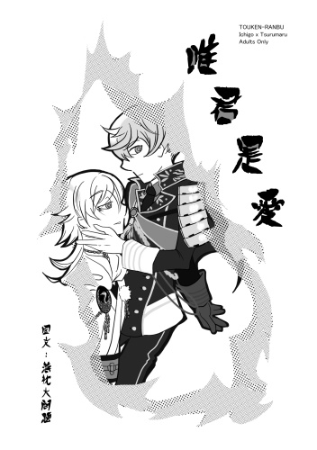
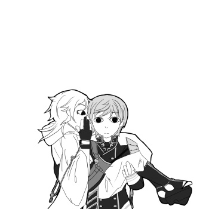
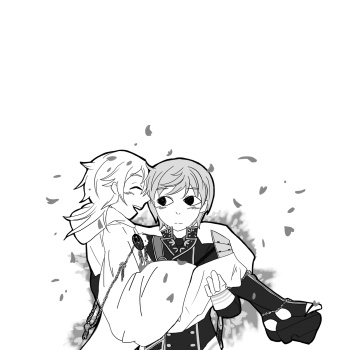

<figure>

</figure>

## 01
　　  
　　一點也不像鶴啊。

　　戰旗折枝、骸鴉食屍，一期一振瞭望硝煙蔽天的桶狹間時不禁想怎麼會有刀如此大言不慚將染血之軀比作仙禽，或許是大家都準備收隊一期也鬆懈下了來，一片空白的心緒才會被那身影佔住，儘管沒有特別用意一期一振的目光仍停留在鶴丸國永身上。

　　「鶴丸殿下？」戰鬥結束後看到同伴俯身半跪哪怕是傲骨的千年刀一期也為他擔憂，「傷到哪裡了嗎？」只是他不會出手攙扶，始終對戰刀保持這份敬意，同樣情形之於一期他也會希望別的刀也能這麼對自己。

　　鶴丸挪了一腳直起身，體態如芍藥莖般柔軟直上。

　　「這可是敵人的血喔。」平時再怎麼不知分寸鶴丸也不會把攸關生死之事看作兒戲。

　　「我手上的也是。」一期掀開了鶴丸的帽兜，底下髮膚滴血不染反而吸收著一期手套上的傷血，他感覺鶴丸戰刀特質的部分仍在蠢動。

　　「走走走，回去了，晚飯前應該還可以到廚房撈點吃的。」

　　鶴丸轉眼恢復了笑臉迎人的模樣若無其事地與傷員們戲鬧，他跟一期一樣善於隱藏心之陰，可是與戰鬥時截然不同的率性是一期所沒有的，這大概就是一期在意他的原因。

　　準備跟上鶴丸腳步的剎那一期捕捉到了細碎聲響以為是殘黨差點拔刀。

　　「蛇？」

　　無足的爬蟲類在鶴丸剛才所站的位置蜷伏爬行貌似很中意那充滿血氣的小土窪，牠的舌頭跟身上紅液艷得刺眼，一時間叫人血肉難辨。

　　  
## 02

　　  
　　「拜託放過我啦！」

　　「御手杵殿下怎麼了嗎？」和平的本丸也有不平靜的時候，因為短期內沒有出陣需求一期也來管一下閒事。

　　笑面青江斜著頸子露出妖瞳和吐舌，「他說本丸鬧鬼。」青江對流言真假無感，不管怎麼說他都斬過幽靈，反而是現在不肯配合工作的御手杵比鬼怪更棘手，從御手杵死抱著柱子的情形他和一期都認為可能砍了柱子比較乾脆。

　　「本丸有主上靈力庇護，境內可是很清淨的。」

　　「聽到沒，模範答案在此。」

　　「唔呃……這我當然知道可是我就是看到了啊！」

　　一期習慣照顧弟弟們了同樣方法用在御手杵身上也有效，一壺溫茶與點心便卸下了他的心防，御手杵擔心的不是大家相不相信而是沒人肯聽他說，似乎刀劍男士和人類都有這樣的隱慮。

　　「你們也都知道吧，那個愛惡作劇的老爺爺不是常在庭院挖坑？」關鍵字：惡作劇和老爺爺，鶴丸國永確實給本丸同伴留下了難以顛覆的深刻印象，頭痛的是每次胡鬧完鶴丸都會藉故耍賴不收拾，這時候就需要像御手杵這樣的大朋友來幫忙，現在，總是幫忙善後的大朋友有話要說：「我真的快受不了了。」

　　「真是辛苦您了。」

　　「不不不，其實一點不辛苦！」有人肯聽自己說話太高興突然變成了吐苦水，御手杵發覺自己離題趕緊拉回來，「一開始那個坑裡面會有爬蟲類、蟲子和牠們的屍體之類的，當下我沒有想那麼多，可是反反覆覆多次之後我發覺老爺爺挖的坑都好深吶，蟲子到底是怎麼跑進去的？為什麼我每次都會在裡面看到這些？」

　　咔沙咔沙，埋啊埋，滑溜的蜈蚣與蛆蟲在鏟子上爬行。

　　咔沙咔沙，埋啊埋，蒼蠅在耳邊嗡嗡作響。

　　御手杵感覺這已經不是單純的作業，漸漸地理性也被那股氛圍掩埋而手上拿的好像不是鐵鏟而是其他東西。

　　咔沙咔沙，咔沙咔沙。

　　然後他想起來了，這個味道是──

　　「坑裡面有屍體的味道，我最後一次去填坑還剷到了人的指頭。」露出泥土的一節斷指嚇壞了御手杵，畢竟這不是常態，深怕審神者操多餘的心他就把東西埋了回去，眼不見為淨。

　　本丸有屍體這件事兩人還是很難相信，頂多告誡一下相同情形再出現就得上報。

　　「屍體是有了可這不算靈異現象吧？」青江說。

　　「我看過白色的身影發出怪笑飛出城牆、晚上的時候經過池子附近則是聽到有人被火燒的慘叫聲……噁啊！一想起來我就渾身發毛。」

　　「御手杵殿下為何能明確形容聲音的感覺呢？」這回一期有些後知後覺，看到御手杵搔著臉頰沉默不言才驚覺自己失禮了。

　　「我沒關係啦，一期才是不要介懷好嗎？」失去上一個本體的御手杵歷經幾番波折後現今憑依在複製品上他依然跟一期一樣記得燒身之苦。

　　燃燒的天空下哀鴻遍野，目能所及的有形物無差別地為天罰之火所燒熔，儘管本體有機會更換但那氣味與悲鳴已經深深地烙進了他們的靈魂中。

　　  
## 03

　　  
　　因為在意起了御手杵所說的話一期接下了他不願意做的工作。

　　剷土聲咔沙咔沙響了整個上午搔刮一期聽覺深處，他把超過兩米深的執念想得太簡單，另一方面也進而得知鶴丸那纖瘦外表還隱藏了不少東西。

　　假設鶴丸為了追求一個小小的驚嚇而持續這麼長又煩悶枯燥的事情似乎有些本末倒置了。

　　一期執起鏟子再往下剷，敲到硬物時一期心頭緊揪了一下，他大略能分辨剷到石頭土塊的手感，這個物體的大小稍為使力它可能就又會消失在土堆中。

　　小心翼翼地把鏟子提起便見到土黃的尖端突出土堆，當散土滑下鏟子那東西露出了原形，一期驚詫得無法作聲。

　　烈火吞噬人類的情景歷歷在目，同時一期隱約記起了無法被高溫焚燒殆盡的殘骸其輪廓。

　　一排人類的顎齒隨鏟子傾斜微微滑動著。

　　「鶴丸殿下，您這樣站在我身後不出聲可是很危險的。」他沒有被嚇住且一直很在意身後人的一舉一動。

　　「哎呀，被發現啦。」來不及把雙手放下的鶴丸在打什麼壞主意當下全被一期看透，「抱歉麻煩你幫我收拾呢，我現在正要出門不如給你帶點禮物賠罪吧。」

　　「您在說什麼呢？」對一期來說鶴丸的打哈哈實在很難笑，他觀察著眼前的鶴丸到底要裝傻到什麼時候。

　　「想不到沒關係，你想到的話再告訴我吧。」無意間觸碰到了一期的陰暗面，就算是鶴丸也會被那股陰鬱壓得喘不過氣來。

　　「我一點都聽不懂您在說什麼啊。」一期拿鏟子擋下了想開溜的鶴丸，「他城的鶴丸國永來這裡是有何貴事？」鬧鬼事件的線索就在這裡一期不可能會輕易放過，其他本丸的鶴丸可以好玩來他們本丸到處悠轉但剛剛一期挖到的東西確實是人類的骸骨無誤，倘若這是外來者的帶來玩笑可就有些太過了。

　　不走運撞上目前顯世刀裡最大宗的粟田口派，鶴丸有點後悔把手縮回，如果先前把一期推下去或許就不會露餡，在別人的地盤裡他沒有同伴，掙扎也僅僅是困獸之鬥，有鑑於逃不出一期的掌心以及這個本丸的鶴丸狀況他也有其他考量，只是不太確定鶴丸的秘密被一期挖掘出來到底是好是壞。

　　  
## 04

　　  
　　萬籟靜寂的夜裡容易意識到心臟在體內有節奏性的鮮明鼓動，活著的實感並不全是舒服，誰知有刀劍男士會因此無法入眠──漸而憔悴。

　　「鶴丸殿下。」手中火光在鶴丸臉龐映出了深刻陰影，白天時難以查覺鶴丸有什麼異狀，一期也是聽了諸多說法才正視了這一真相，「您為何拿著炭爐回房？」

　　「寒性體質很擾人啊。」鶴丸沒有將擅自入房的一期趕出去，頂多是感覺有點困擾，「我想『我』的大概口風不是很緊，他是跟你說了多少？」

　　「什麼都沒說。」一期中午見到的鶴丸沒有透露任何事情，鶴丸只對一期說要是他真的在意就在這時間親眼來確認所以他才在這裡。

　　害鶴丸秘密被發現的基本上是鶴丸自己，把最麻煩的工作丟給他的也是自己，可真謂自作孽不可活，假如事情辦完鶴丸還有力氣他定會用力自嘲一番。

　　沒辦法理解鐵棒跟炭爐有什麼關聯的一期看著鶴丸從壁櫥裡搬出大塊石板，這不是輕鬆的活但他拒絕一期幫忙，而後聽到鋃鐺作響的鎖鍊聲也不是他的禮裝裝飾。

　　褪下寢卷坐上石板，鶴丸掀開榻榻米，將鐵鎖的兩端分別纏在地板下的環扣與自己手腕，剩下只等炭爐中的鐵棒加熱完畢一切就準備就緒。

　　在鶴丸的舉止中一期隱隱有些感覺，只是這實在太過沉重他無法轉化為言語，他當然希望自己的推測不會成真，如果可以他甚至不想聽到鶴丸親口述說後續會如何。

　　赤身的狀態下明顯能看出鶴丸與人類武者大相徑庭的體格，嚴苛地追求細身與優美造得此名物，所幸平安時代病態的浮華之意沒有埋沒鶴丸的戰刀本質。

　　「看到這三道棟了吧。」扭身一轉，鶴丸將厚重禮裝下鮮為人知的部分呈於一期眼前。

　　三道棟是為持有者抵擋攻擊時所留下的，可說是鶴丸國永最值得驕傲的戰勳，它們跟一期背後的大片燒痕同理會永遠存在於人身，都是審神者無法修復的本體傷跡，假使這一部分重傷仍須要加上人為醫療才能慢慢恢復。

　　由於鶴丸平常巧妙地遮掩一期覺得是初次見到鶴丸身上的傷，舊痂與新痕在白肌上反覆疊加，如皚皚雪原中一片滄桑之地，彷彿能把它與任何戰火燎原的時光作聯想。

　　鶴丸說這三道棟中暗藏不淨之物。

　　起初只是一些飛蠅在傷口邊徘徊，鶴丸知道人身難照料，自行處理的話總是會有些疏漏，抱著神體去給審神者粉錘敲幾下就會舒爽些。有時候摸到衣服內有蟲子爬行也被他當成偶然，無視了徵兆好幾回直到感覺下半身無法使力疼得渾身打顫他才試著切開傷口挖出異物，有時是指甲、看到令人作噁的黑髮當下將其燒卻滅跡、最令他痛不欲生的碎骨頭已經在他心裡拼出了完整的形體。

　　所有不祥的碎片拼湊在一起時他終於意識到了自己是詛咒之身的事實。

　　這樣的情況日復一日持續半年之久，身心飽受折磨的鶴丸決定對上隱瞞轉而向外尋求協助。

　　這要求聽起來很過分，當時他急尋一位口風緊又有解決之道的審神者，寬容以待但不可過問太深，幸運的是千萬萬個陣營裡真給他找到了這麼一個。

　　雖然對方每次都不忘苦口婆心幾句，鶴丸總算是從其他國的審神者那得到應急藥品並試出了抑制現象的手段：燒烙傷口，藉此有效地讓它癒合並增厚皮質，這三道傷外的則交由審神者維護即可，鶴丸的自尊心讓他無法在戰鬥時放水，只好用神體蹭點輕傷去給審神者一起維護就不易看出他的異狀，這就是他掩飾手法的全貌。

　　只是那位審神者也有不能退讓的條件，對方要求鶴丸一定要將此事告知身邊一兩位親近的刀劍男士否則他會通知鶴丸的審神者。

　　聽到這裡一期覺得奇怪，所謂鶴丸親近的一兩位刀劍男士並不存在於這個房間內。

　　「我沒辦法一直勉強光忠和廣光啊。」理所當然鶴丸對伊達刀的信任排在首位可是他們都有溫柔心地。

　　不惜拿無銘墓石墊底防火等種種見不得光的行徑，以及無分日夜只要有需求就會脫得一絲不掛乞求別人來傷害他，他們看不下去名物鶴丸國永慘不忍睹的模樣鶴丸就勸他們暫時放手，如此簡單，他也考慮過不要再讓可愛的後生晚輩們承受這般驚嚇。

　　「這個本丸的任何刀都不可能放著您不管，難道您沒想過找石切丸殿下商量？三条一派──」

　　「唯獨三条派！」鶴丸的音量壓過了一期，「唯獨三条派哪怕是撕爛我的嘴我也不會跟他們說，你也別想自作主張。」就像一期只把自己的溫柔獻給家人，鶴丸珍惜的東西所剩無幾但也不能說完全沒有，被戳到了痛處他對一期口氣是嚴厲了些，最後語調依然流露著溫柔，「你想幫我的話就綁住我的嘴，為了跟你說話我才沒先綁起來，然後，就請你離開我的房間。」一期到處打探秘密發現了鶴丸國永的瑕疵，鶴丸仍盡其所能保持風度。

　　「做到這地步為的是什麼？面子嗎？」

　　  
　　「容身之處。」鶴丸笑道。

　　  
　　光是念著這個本丸與同伴們鶴丸就不覺得這算受罪，他是本該死去卻沒死成的付喪神，從來不敢低估自己被瘴氣汙染的可能性，在這個黃泉之隙給所有人帶來威脅之前他就做好了覺悟，現在他只是任性地想待在大家身邊。

　　鶴丸把封口的毛巾遞給了一期，他是收下了，不過下一步卻是讓自己跟鶴丸一樣坦誠相對，弄濕毛巾纏在自己手上，並解開鶴丸的鐵鍊將那瘦弱身子攬進懷中。

　　「您威脅了那二位吧。」烙鐵近在鶴丸眼前，一期也靠得同樣近，「您期望我能理解，是的，我猜如果他們洩漏鶴丸殿下的秘密您大概會自請刀解。」談話中鶴丸只笑了一次而一期一次也沒有，「想打發我的話請找一個更好的理由。」

　　機會難得，鶴丸用力地打量了跟他共處三百年的室友一番，不苟言笑的天下一振為人正直得不可思議又有些傻氣害鶴丸燃起了其他念頭──

　　「我暫時想不到。」

　　害他想要再任性一回。

　　鶴丸枕在一期頸窩，闔眼感覺一期微涼的手掌正順著他腰線探向傷口，無趣的木頭表情下一舉一動都頗得鶴丸歡心，以待會兒將發生的事情看來這似乎是不錯的開始。

　　  
## 05

　　  
　　燒身是何種感受一期不曾和任何同伴談過，至少可以確定他不會拿自己的傷與鶴丸正在受的苦做比較。

　　每當開始燒烙傷口時鶴丸都會告訴自己這次一定能挺住，烙鐵碰上去的第一下鶴丸緊咬著雙唇，即使出血也沒關係，他想藉著痛來分散注意力以免抓傷一期，假如毛巾沒有被一期拿走他應該能撐得更久，鶴丸想不出一期在打什麼主意覺得心有不快所以他跟一期賭氣了一下，途中拚命要推開他。

　　抵抗不到半分鐘疼痛顛覆了理智，儘管刀劍男士在戰場武勇仍無法抗拒人軀的本能反應，聲聲哀鳴非也鶴丸所願。呼吸著焦糊味的氣管也被那熱度所灼燒，必須在燒烙之熱使得皮肉略有黏性時拿開，撕扯大力地牽動傷口痛得無已復加但長痛不如短痛。

　　一期專注在鶴丸身上微焦的傷口只管抱緊他不讓他脫身，慶幸的是一期有足夠的狠勁一鼓作氣完成這件事。

　　「好了。」

　　原本鶴丸以為一期會因為過去創傷辦不到，當他打量平整的傷口時不敢置信一期處理得如此漂亮，再看看跟他一樣大汗淋漓的一期肩背滿是他抓咬的痕跡，紅黃青紫深深淺淺絢爛如煙火。

　　「辛苦你了。」

　　「我不是為了聽鶴丸殿下客套才幫忙的。」一期向鶴丸索藥，照另一個鶴丸的往來情況應該是給鶴丸帶了創傷藥之類的東西，他堅持也要把燒烙的後續處理做好。

　　「好吧，那……辛苦我了。」以現在的疲倦程度鶴丸沾到榻榻米就能睡死，可是濕黏的勿忘草色髮絲底下是張難得一見的好表情，不多看幾眼就這樣昏過去實在可惜。

　　肌與肌緊貼、汗珠分合，鶴丸艱難地伸長頸子在一期的眉梢上留下令他難忘的觸感。

　　「您對他們二位也會這麼做嗎？」一期並不覺得高興反而眉頭更加深鎖。

　　「我已經忘記了。」

　　「為什麼您就是不明白您可以不用承受這些無妄之苦呢？」一期很清楚這只是把自己的想法加諸在鶴丸身上，話語再怎麼堅毅，心意已決的鶴丸怎樣都會想辦法敷衍過去。

　　「如果有輕鬆的辦法我也不會煩惱至此不是嗎？」

　　正是這般四兩撥千金的態度讓一期焦慮不已。

　　「您剛才一滴淚都沒留。」經事風霜人惜古刀，刀劍成人心堅比鋼，他們都小心翼翼地使用身軀不希望人類的軟弱附著上神體，一期一直凝視著鶴丸心防的縫隙，連他都不知道自己內心對此有所期待，等著它剝落好看清人類評價之外的真實攤在陽光下。

　　吻上一期的唇，鶴丸輕吮涎液潤喉聲音才從嘶啞越漸清晰。

　　「想看我掉眼淚的話你就自己試試看吧，斷腸也好剝膚也罷，把這身體裡裡外外弄得亂七八糟，讓我像赤子哭啼、處女破瓜，力竭嘶聲不能自已。」

　　鶴丸仰臥展肢，暗示一期依兩人現在的處境他可以自由發揮。

　　「那麼一期一振謹遵您意。」一期俯身親吻鶴丸鎖骨，舌尖沿上刻劃頸脈，「把這身體裡裡外外弄得亂七八糟。」濕濡的手指在菊門外打轉而後兩指撐開後穴。

　　見鶴丸弓身顫震的情景一期嘴角呆板的一線也有了不同的變化。

　　「讓您如赤子哭啼、處女破瓜，力竭嘶聲不能自已。」

　　同一句話由一期來說感覺截然不同，懾人心魄的語調縈繞鶴丸耳畔時他已然冷卻的體溫再度復燃。

　　  
## 06

　　  
　　順其自然，應該對還未發生的事情聽而任之，作為道具的他們很習慣這樣的事情。

　　在那一刻一期是有選擇的餘地，但他選擇的不是溝通或離去而是榨取，充血的硬挺一遍又一遍地蹂躪這身軀，粗暴得像野獸交配卻沒有繁衍需求，非逞慾的交合夾雜暴力與關愛，矛盾由裡而外困擾著他們。

　　第一次高潮鶴丸眼眶微潤，勉強把所有可恥的聲音吞回喉嚨；第二次，更多白稠灑上一期的腹部，意識在邊緣搖搖欲墜又被一期拽起來，之前的都還只是淺入淺出，坐到了一期的腿上後肉楔從腿根一路輾壓壁肉至頂，痛楚堪比一期剛把它放入自己身體時或者更甚。

　　「一期啊，你……呃！應該……很討厭我吧……」說話能保持清醒，若鶴丸想對一期說什麼最想問的大概就是這件事，兩人沒有了距離一期仍把自己表情藏在鶴丸背後。

　　「您太聰明了，自以為是的聰明。」一期掌住鶴丸下顎讓他靠自己更近一點好聽清楚，「可以對一切裝作看不到、聽不見、沒說過。」如此虛無縹緲，使宛如幻術手法欺騙了所有人和鶴丸自身，一期抓不住也幫不上忙所以他才說鶴丸需要靠哭泣斟酌情感的重量。

　　鶴丸想稱讚一期觀察入微卻因此分神放鬆了緊繃的肌肉，使得粗而堅的陽物趁勢往深處寸寸推進，敏感處被舒服地搔刮，鶴丸的下腹又再次蓄積了精液，一時間鶴丸還搞不懂那些疼痛都沒有迫使他流淚，為何剛剛那一下會讓身體變得燥熱難耐，不過斗大的淚珠與汗水混在一起一期也就錯過了這個瞬間。

　　兩人最後都精疲力盡一事無成，連懊悔的力氣都蕩然無存。

　　雙腳交纏、赤裸地在火堆前相依，他們對彼此的心意也只剩這麼一點可取的東西。

　　「一期。」那聲之後一期視界中的明暗反轉，比火光更刺眼的金芒在暗中盯著他，「你該離開了。」鶴丸在一期不注意的時候拿到了神體，刀刃所指告訴一期這不是請求。

　　一期一振此時一陣愕然──對於自己。

　　為了拒絕而假裝順從，他又著了一次鶴丸的道，但他審視鶴丸將刀架在自己頸上的情景時並非全是沮喪。

　　那水潤的銀白髮梢上有他們倆的體腥，濕透了的腿間白汁垂滴而那是他一手所造，濃厚氣息快速地侵吞著一期，佇立於前的即是總是吸引著他目光的鶴丸國永，他的燒痕隨鶴丸眼底流金湧動陣陣刺痛著，這份被挑起的情感澎湃至極時一期反而趨於一種平靜狀態，現在一期心中所有的不明確感都變得清晰了起來。

　　「鶴丸殿下，您的眼睛。」就算可以聽音辨位鶴丸的刀卻沒有跟著一期移動，「是不是詛咒發作了？」一期注意到鶴丸的視線已經失焦而他披著寢卷想掩飾的東西也只有那些傷，「承您所問，您確實愛胡鬧和捉弄大家，耍小聰明常做些讓人擔心的事……儘管如此我也絕對沒有討厭您的理由。」

　　鬆開鶴丸緊繃的指尖時一期已經想得很清楚了，刃生在世必然有所背負，刀劍能守護他人卻無法平撫傷痛，凝視著那些無法抹滅的痕跡時它們也對觀者訴說著某些訊息，喜樂與遺憾、等待著某人與之共鳴。

　　「您一定很害怕吧。」

　　鶴丸已經不知道揮舞此刀的意義何在，難道是為了傷害這個緊擁著自己的男人？

　　「別那麼執著我了，所謂彼岸可是又冷又無聊得要命的地方。」心裡懷抱著那具屍骸，而那具屍骸也離不開自己，讓所有人引以為戒的範本只要他一個便足矣。

　　明明痛得五臟六腑都要被絞出來鶴丸卻頭一次有如釋負重的感覺，大部分知覺都被疼痛所麻痺他還是察覺得到那些把自己輕放床舖的細心舉動。

　　胸口騷動不已，鶴丸迷迷糊糊地伸手尋找那分散痛楚的來源環上了一期的頭。

　　「最可怕的莫過於無意義地死去，所以您寧可自我了斷。」被髮梢搔弄的單薄胸板顫抖不止，一期將側邊頭髮紮至耳後繼續舔吻鶴丸乳珠，看它顫顫巍巍地挺立，「絕不會讓你做這麼悲傷的事，凡是鶴丸國永想捨棄的──」一期吻著微泛水光的蒼白唇谷辨聽鶴丸嗓音有別方才，唇合唇分間暗啞的喘息越漸情迷意蕩。

　　　　  
　　「就由我一期一振全收下。」

　　  
　　雙腳被抬上了一期的肩膀，鶴丸腰肢懸空但沒有壓迫到患部，在微傾的角度下一期再次推撥緊窄的甬道。

　　鶴丸腦內很快地比較了前後情形，答案是天差地別，找不出這次是多了什麼東西讓他筋骨酥軟、皮膚敏感，迎合一期的節奏時身體還會隨著抽插起伏顫跳。背後才被烙鐵燒過，鶴丸感覺體內也被放了一根烙鐵，模糊視線中都見到了白肌被燒成緋紅色。

　　異物感在鶴丸皮下爬行沿脊攀上擠壓經脈急切地想竄出剛燒烙的軟處令他痛苦萬分，身下律動如浪濤，陣陣快慰愉悅官感並沖散肉體的苦痛，滑膩的碰撞在結合處搗出的浪蕩水聲響徹房間。鶴丸掙扎著，懸空的腳又踢又打，不可明狀的感覺期望著一期用先前的狠勁馴服他體內的狂躁。

　　「要來了！」靠最後一點力氣挺起半身，浮載浮沉的意識要鶴丸緊抓著最後一絲希望，「一、一期──」

　　「我在。」他在一期懷中變得荒淫陶醉，一舉手一投足卻又純稚得令人憐愛不已。

　　「夠了……夠了一期！」鶴丸拱起身子使一期腫脹的性器離自己慾望的頂端更近些，「別再有所保留了！」兩種痛楚的拉扯之下鶴丸終於眼淚潰堤、淚如雨下。

　　貫穿它、填滿它、全力侵犯、被狠狠地傷害鶴丸也無所謂，因為眼前這個男人是一期一振吉光，刨開了自己脆弱不堪的虛偽假面並觸弄那快要繃斷的心弦，裂弦之鳴彷彿白刃顫聲迴蕩耳畔，鶴丸想起了忘卻半個月之久的事──這身軀中獨一無二而那些陪葬品永遠不會有的雋永之意，以及刀劍無法為之而刀劍男士所能為的，對面傳的的熾熱體溫大概就是想告訴他這些，對於執著於他不肯輕易鬆手的人鶴丸也決定遵循原初本能順應詛咒帶來的命運。

　　  
　　此時此刻鶴丸國永讓自己完全為一期一振所有。

　　  
　　以吻封緘，一期的欲求與敬愛落在雪肌各處，得到了鶴丸的允諾後他沒把握能自持。掰開鶴丸的兩腿用力挺進，濕綿軟肉一抽一抽地渴求著，強勢地要把一期與他的精種悉數留在裡頭，那一下絞緊讓彼此都沒有餘裕細細感受相依存的溫柔。

　　短暫失去了視力看不到這個男人最為性感的時刻，鶴丸迫切地想聽溫文爾雅的一期喘著粗氣嘶聲低吼。

　　一期也有了燒痕裡的業障在躁動的錯覺，他希望鶴丸用他引以為豪的鋒利撕裂它，假如當下他們一同被所有不淨侵蝕他們也不會變得一無所有，倒不如說這將會是他們千載難逢的新高峰。

　　「要被撕碎了……快滿出來了！」

　　鶴丸的前後都已經到了極限，最深處歷經無數次兇狠頂撞的那一點終究沉淪肉體感受到的歡愉，密接處發泡的黏絲橫流下腹時他腦中閃過一抹絢麗奇景，為百彩千色簇擁的明星落入宵暗，周圍花火激起，聲若轟雷、快感如電馳，白芒也好暗闇也罷，倒臥其中鶴丸只覺得心神久違地安舒酣暢感覺不到身後皮開肉綻。

　　莖身漫浸在溫潤愛液中痛楚為之融化，銀光晃漾眼下慾情猶在，一期忍不住在暈厥的鶴丸體內再解放一回才退出，意識到欲求不滿的自己造成那些淫亂的痕跡一期才有了難為情的感覺。

　　「羽毛？」一期抬手一瞧滑落指縫間的純白，溫馥濃郁的香味洗淨了一切。

　　滿溢出鶴丸傷口的是和他們一樣同為獻上之物的白椿「千羽鶴」。

　　五瓣便能言此情，呈現在一期面前的卻是或百或千，雪瓣舖疊鶴丸身後猶如舒羽的仙鶴，安穩地睡臥在一期臂彎。

　　「您會好起來的，鶴丸殿下。」

　　落椿捨命，凜意蕩春，被動搖玉鋼心已經無法滿足於遠遠欣賞而是想要將其納為己有。

　　在為鶴丸處理千羽鶴造成的撕裂傷時一期想，會耽溺其中的應該是自己，他是粟田口吉光之作無法擁有天下或是太閤大人的胸襟，若有必要他會跟鶴丸一起墮入地獄，只要在鶴丸身邊的話六道十界哪裡他都可以待得很舒服。

　　  
## 07

　　  
　　「鶴丸殿下？」每當準備歸城鶴丸都會離開同伴自處一會兒，而一期則是習慣性地搜索著鶴丸的身影，「沒事吧？難道是傷口又──」看到鶴丸俯身半跪，這次一期急不可耐地上前查看。

　　「不是……」鶴丸面有難色地開口，「騎馬太久腰軟了屁股又疼，都是你那晚太有幹勁了。」千羽鶴散盡後彷彿也帶走了詛咒，不再有不淨的東西從他的傷口冒出來只是他把復原的後遺症全算到一期頭上。

　　「我的錯？」

　　「沒錯，你可得負責送我回去。」

　　人不要臉天下無敵可是鶴丸的舉止比前陣子直率許多，這種笨拙的撒嬌方式一期也欣然接受。鶴丸見有專人為自己服務就增加了一點要求，伸手討吃討喝，揹的會痛只好拜託一期改用橫抱的，有人把他伺候得那麼周道就算被同伴取笑他也無所謂了。

　　「還有哪裡疼嗎？」

　　詛咒已經沒有復發的跡象一期待鶴丸卻依舊體貼，同伴間戰鬥之外的義務與責任全由心定，其實事後一期還是將事情全盤告訴了審神者，保住棲身之所的代價鶴丸只是挨全本丸同伴的罵一期認為這相當划算，一期為他做的他是不勝感激，至少鶴丸確信沒了詛咒他也永遠沒辦法成為一期這樣的正人君子。

　　作為回報，鶴丸發誓當一期的磨難來臨之時他對一期也絕對不離不棄。

　　他們越界只有那次，對一期從不甚了解變成了好奇，不管鶴丸再怎麼胡鬧一期對他和以往一樣都是那副不冷不熱的表情，鶴丸不至於把那一夜的事當作把柄或笑話他，可是生理心理都被熾熱激情洗禮後的現在一期還無動於衷鶴丸感覺跟射後不理一樣糟糕。

　　鶴丸重新想了一下或許自私的是自己，一廂情願地以為一次肉體交合他們之間有萌生些同伴以上的緊密關係，他自嘲自己的幼稚，另一方面同意更早之前曾經一閃而過、無法否認的情愫，這份心情口舌靈巧的鶴丸都難以言表也只敢小聲地告訴一期，他深信思緒敏捷的一期應該可以會意……　　

<figure>

　　
</figure>　　
　　

　　**「回去以後再來做舒服的事情吧。」**

<figure>

　　
</figure>　　
　　
　　(完)

>- 礙於排版這本是沒有後記的XD"  
>- 鶴丸考察有一筆資料自己也很在意，大概在源平合戰期間鶴丸貌似差點被燒掉然後埋在塵土下，因為是良冶國永的名作所以還是被人找到了。  
>- 蠻幸運有龍膽以外的東西可以寫，看到某首花語詩寫白椿的內容就是在說唯你是愛（字體關係改成了唯君）不管是不是指千羽鶴只是想以此為標題，椿花本身跟豐臣秀吉就有些淵源所以寫一期哥的時候偶爾會提  
>- 培養出這品種的椿園在昭和57年把它獻上給皇室，白瓣黃蕾，看起來很優雅，還有另外一個品種叫"月照"的品種照片看起來跟千羽鶴有點像
