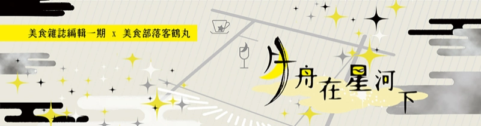

>美食雜誌編輯一期 x 美食部落客鶴丸

## 書籍資訊
- 實體書限定加筆番外<<第九品 推動心舟的星河特調>>
- 和凌迴的圖文合同本的小說部分。
- 實體書已絕版，無電子書。

## 第一品／愛恨交加的百花拼盤

　　萬事萬物一切皆有基礎，據說達文西打基礎的雞蛋手稿能疊至天花板，穩固的基礎造就了這位繪畫大師，簡單的基礎同時也是最困難的，之於料理方面，一位廚師的手藝也能從蛋料理可見一斑，能應用在煎煮炒炸蒸生吃，口感和氣味是點綴料理的重要形容詞，好讓挑惕的舌嚥下美好的重要基本語言。

　　「月舟」酒館的老闆三日月在透明的廚房揮灑天然顏料般的金黃蛋汁，屏氣凝神地專注在他的不鏽鋼畫布，聽到悅耳滋生時轉動手腕撩鍋翻面，軟綿的觸感與鍋面碰撞聲彷彿樂章的最後一個完美音符落定。

　　「請慢用。」三日月自豪地為常客呈上他的得意作品。

　　鶴丸將筆電擱在一旁，舉筷仔細端詳剛出爐的煎蛋捲，「色美、氣相、軟硬剛好我喜歡。」對個家庭料理說太多評論很不公平，他點到為止就好，「喔？還加了一點創意？」

　　兩塊煎蛋捲一黃一白，白的顯然是蛋白蛋黃翻轉的特殊做法，鶴丸筷子將兩塊夾開，裡頭藏著兩輪黃白弦月流出可口的溫熱蛋液。

　　「這是特製的月滴煎蛋捲。」三日月微笑時他的月瞳也流露著優美的弧線。

　　「不用因為我是美食部落客就特別招待啦，畢竟關鍵是在吃了之後。」鶴丸把黃皮白芯的煎蛋捲抵在唇前時，濃稠蛋液滴落盤中成為另類典雅裝飾，擠出熟悉又溫暖芬芳，已然黏膩的手指急切托著月滴，不浪費分毫地放入自己身體，「你的料理果然還是一樣那麼『獨特』。」

　　他放下筷子起身離席一會兒，工讀生俱利伽羅指出洗手間的位置示意已經打掃完，他和工讀生擦身而過時用力按了一下工讀生的肩膀，工讀生懂他現在的感覺，還貼心地遞上了一條毛巾。

　　夜深時店內能清楚聽到門外的紛擾，一樓黃銅鈴響起收束一切雜音，接著兩個腳步聲噠噠地下樓，地下一樓天花板邊緣紅圍巾的主人腦袋探出來瞧了幾眼，不可置信地環顧鏤空天花板垂下的藤花瀑布，水塘造景的中央一架豎琴靜靜地擱於下方，周遭木質桌椅適當地給店內添增活力並明確指引客人入座。

　　「我的天啊……這間店太美了。」吧台懸吊著月亮形狀的鵝黃小燈添加氣氛，座椅比想像中舒適能久坐。清光瞥了一眼被擱著的煎蛋捲，它們在這樣的氛圍裡看起來很美味。

　　「除了我們之外只有兩個客人耶。」安定意興闌珊地打量四周，筆電的主人大概在洗手間，另外只有一個抹茶綠披巾的客人在包廂角落喝茶看書，「小狐丸老闆真的確定我們吃得起嗎？」

　　「我好像聽到了舍弟的名字。」親自為兩位新客人遞上毛巾與冰水，三日月一絲不苟的服務精神稍微讓客人們卸下了心防。

　　「好厲害，你們三条美容集團事業做這麼大還自己出來開店。」

　　「興趣而已，客人過獎了。」三日月美容手藝相當了得，還靠當自家公司的模特兒存了不少錢，直接買下店面沒有任何店租壓力，自己當老闆很自在，只有全心全意為客人服務最花心力，「兩位在舍弟的美容院工作嗎？」

　　「我們都是學徒，我跟小狐丸老闆學美髮。」安定說。

　　「我則是在岩融師傅手下學美甲。」清光食指在空中畫圈秀一下自己手上的得意作，「這傢伙洗頭時好像跟客人的頭有仇似的，到現在還沒有固定客人，小狐丸老闆才說要慰勞一下看會不會好轉。」

　　「你為什麼老是這麼說！處理個指甲片大的東西有什麼好得意的──」都已經努力工作了安定當然不滿自己為什麼要被同期給數落，他只願承認自己是慢熱型的。

　　敲桌的那一下兩個玻璃杯哐啷一聲，三日月不由自主地注意到了安定的手，還有清光也跟他一樣在看同個地方。

　　「是是，我多嘴，反正沒有累積指名客人的話小狐丸老闆也會有其他打算。」清光嘴上仍是不停地嘲諷，剛剛一閃而過的擔心彷彿是假的。

　　三日月神不知鬼不覺地清出桌面奉上暖手巾，還給兩杯水添了大冰塊，清脆響聲令兩人回神，「需要點什麼嗎？」

　　「請問有菜單嗎？」清光問。

　　「沒有，不過請不用顧慮敝店，顧慮自己胃口即可，我會盡量滿足客人的需求。」三日月從不在店裡擺菜單，只要客人敢開口他就敢拿，再奢華的單品價格也不會超過五千日圓，這就是三日月的經營方針。

　　「既然是慰勞自己的話還是生魚片拼盤好吧？」安定光是看著三日月身後的全套調理設備就開始期待，在他的手筆下會有什麼樣的高級料理。

　　「那個好，每次小狐丸老闆請我們吃稻荷壽司也吃膩了，就奢侈一下吧。」雖說大豆是田園之肉，清光跟安定一樣果斷從山珍投向海錯。

　　剛要從洗手間出來的鶴丸饒有興趣地在暗處觀察新客人們與三日月的互動，「對耶，生魚片主要講究刀工和鮮度……」他喃喃自語了一陣，決定再多看一會兒。

　　「久等了。」

　　不稍一會兒，三日月呈上兩碟生魚片全席，深褐的備前燒圓皿上魚肉顏色按深紅至白排列，在白肉魚處灑上一點金箔，彷彿看到血椿開瓣的興奮感流竄全身。

　　「在老闆兄弟的手下做事真是太好了。」安定長這麼大都不曾受過如此高級的招待，儘管常被清光說自己的美學意識不怎麼樣，不過眼前的料理真如藝術品般高貴典雅。

　　「每一樣東西都好講究……」注意到餐具的時候清光發現連個筷架和毛巾碟都是手工製的瓷器。

　　「客人喜歡就好，那都是我自己的作品，不是什麼名貴的東西。」

　　『自己做的！』兩人忍不住齊聲驚呼。

　　燒窯是三日月假日的休閒，走訪六古窯用當地的水土燒窯餐廳的器具，有時候可以給客人當禮物，隨季節更換店內感覺都很讓他樂在其中。

　　「集團的少爺果然跟常人不一樣啊。」

　　「沒人家厲害當然會讚嘆不完啦，我就不客氣先用囉。」清光搶先當品嚐美食的第一人，迫不及待將最外圈有著緋紅的厚脂鮪魚生魚片放入口，還在躲在暗處的鶴丸看得心驚膽跳。

　　果不其然，清光的咀嚼慢了下來，他不確定地再多嚼三口，眼神焦急四處探看，發覺沒有東西可以幫他解除尷尬時急得生理淚在眼眶打轉，捂嘴勉強把食物吞下後拼命張口吸氣好像剛剛差點溺死似的。

　　「真的是承蒙老闆好意，我想我們還是先喝酒好了。」說完，清光把他跟安定的盤子推旁邊卻被安定阻止。

　　「我都快餓死了哪等得了！」

　　「我說……喝酒！」現在換清光壓著安定的手不讓他動筷，「老闆請上配魚肉的清酒！」支開了三日月，清光仍不放棄奪盤。

　　「喂喂喂，不用吵成這樣！」

　　鶴丸按耐不住想出面調解，他跟清光都小瞧了美髮師的臂力，安定揮個手臂就輕鬆把兩人甩開，筷子抄起五片魚肉往嘴裡塞。

　　安定鼓著一邊臉頰咀嚼。

　　魚？

　　他試著用舌頭尋找魚肉的味道，但口腔裡只有股怪味，黏黏膩膩的團塊感堵在喉嚨裡。

　　「安定！」在打算求救的那一瞬間安定先撐不住暈了過去，清光及時接住了垂直後倒的他。

　　「讓開！」鶴丸見狀趕到他們身邊，幫安定暢通呼吸確認有無其他異狀，情況大致和他想的差不多。

　　「我來叫救護車！」

　　「沒事的，跟我來！」鶴丸揹起安定上樓要清光先不要打電話，雖然可以想像三日月回來時沒看見客人會覺得滿頭霧水不過他也習慣了。

　　＊

　　石切丸光看到手機顯示鶴丸的號碼就猜到是怎麼回事，趕緊從住家下樓到診所開門，不敢輕忽安定有什麼狀況，石切丸好好幫安定仔細診斷一番。

　　「真的沒問題嗎？」清光想問的問題有點多，綜合起來只說得出口這幾個字。鶴丸沒帶他們去醫院已經夠怪了，沒想到竟然還是跑來一間「醫美診所」，清光根本不知道能不能放心把食物中毒的安定交給醫美診所的醫生。

　　「沒事，不用洗胃，他的症狀是營養不良造成的。」石切丸除了一般診斷還再三給安定把脈，確認沒問題就讓他安靜躺一會兒。

　　「營、營養不良……不是食物中毒？」其實清光心裡也不是沒底，他們倆總是在美容院忙到很晚，安定一覺得疲憊三餐就隨便解決，雖然他們住在一起，清光也放任這樣的情況很久了。

　　「三日月給他們吃了什麼？」石切丸問鶴丸。

　　「生魚片。」

　　「啊……難怪有股很濃的魚油味。」與其說是魚腥味更像是營養食品的味道，清光很意外石切丸可以那麼明確形容他吃到的怪味。「愚弟給你們添麻煩了，他手藝雖然拿不上檯面，不過我可以保證他絕對不會拿出過期的食物。」

　　清光手指騰空指著石切丸那邊，一直猶豫要不要重複說剛剛的關鍵字。

　　「他是三日月的兄弟，排行老三。」不然鶴丸也想不到有誰願意幫三日月善後。

　　「如果在愚弟的店吃壞肚子的話儘管來找我吧，不會跟你們收費的。」石切丸寫好處方和養生建議給清光，他要他們坐一下等他去把藥裝起來。

　　「石切丸先生，能開口服的消炎藥給我嗎？」清光伸出自己紅腫流血的舌頭，因為三日月的生魚片入口即化他不小心咬到自己。

　　「沒問題，請稍坐等等吧。」石切丸想到了其他的事情，於是在開門前止步，「等等也開一些藥膏給你和你朋友吧，下班回家讓手泡一下熱水之後擦，算是給弟弟員工的特別服務。」

　　兩人都是火候不夠的學徒，年輕肌膚在美容用品的化學劑中打滾，清光還算知道怎麼保養自己的手，但是做事不顧慮前後的安定就不同，手又癢又痛且放不下面子求助，最後變得像個破抹布一樣。

　　他們才不是破抹布，遲早要出人頭地去掌握那些大人物的腦袋和指尖。

　　想是這麼想，他們幹勁比別人強好幾倍，個性相對浮躁容易跟人爭執，清光不禁感慨了起來：「這該不會是小狐丸老闆的處罰吧？」

　　「絕對不是喔。」三条兄弟人都不壞，而且鶴丸也認識小狐丸，「三日月的料理確實是前所未有的難吃，不過很不可思議，吃過『月舟』的東西後總是會找到再踏足那裡的理由呢。」

　　「……是這樣嗎？」

　　「別看我這樣，我好歹也是個小有名氣的美食部落客，真心不騙。」鶴丸跟清光強調三日月那兒的藏酒包羅萬象，而且很多都是稀世珍品。

　　清光就想有在哪裡看過鶴丸，只是剛剛情況太緊張沒有去指認，還認為鶴丸說自己說小有名氣太謙虛了，鶴丸國永的美食部落格的追蹤人數已經高達日本總人口十分之一，自己的文章絕不會有廣告，只有工商影片才有，遍足各地食宿玩樂的內容率性又豐富，他的部落格才那麼受歡迎。

　　充足休息過後安定終於恢復到能起身走路，事情算是告個段落，他們在路口別過，清光和安定步履躝跚地走在回家路上，感覺比加班還狼狽。

　　「喂，醜八怪。」

　　「我現在能一腳把你踹到車道上，勸你別亂說話。」

　　「我什麼東西都沒吃到，回去做點什麼吃吧。」安定半張臉埋在圍巾裡，聲音小得清光差點沒聽清，「營養不良什麼的，我實在受不了。」

　　「你老是嫌棄我的手藝現在又給我變卦，真是……全都給你說好了。」他曾努力煮了一桌，看到安定連碰都不碰之後發誓再也不為安定下廚，只可惜他耳根子軟很難堅持到底，「冰箱只有一點剩菜，大半夜的要我去哪買食材？」

　　「用剩菜也可以啊，沒關係。」

　　「我想想，蛋炒飯和蔬菜羅宋湯應該是不成問題。」考慮到石切丸說不要讓安定的胃造成負擔得先從清淡飲食開始，「要是吃剩我可不饒你。」

　　「怎樣都不會比那個生魚片難吃吧。」想到那道料理時安定隱約覺得腸胃在抽筋，亟欲想抹去那股生吞活魚的噁心感，「放心，我會全吃光的。」

　　清光別有意味地哼了一聲，轉向走去便利商店給他們各買一個熱呼呼的肉包子，它是冬天最容易尋得平民的美食。

　　「回家路還久呢，先吃這個撐一會兒。」轉頭看安定已經吃完了他自己的份，清光不相信還戳了幾下他的臉頰確認，然後再把自己一半的肉包子分他，「等你身體好一點我再請你喝一杯吧，鶴丸先生有跟我介紹一家店的酒很不錯。」

　　＊

　　深夜十點，酒館「月舟」樓上的咖啡店店招牌一明一滅如其店名「星河」，靜謐中使人心靈找到珍貴的自處時間。

　　眼罩青年為最後一位滯留的熟客送上一支特別的波本威士忌，這瓶酒不屬於咖啡店，意外是來自一位熟知如何品味當下的風雅人士。

　　「三日月的手藝明明爛得毀天滅地，到底是有什麼打動人心的魔力？」不，應該是妖力才對，小狐丸如此斷言。

　　「你直接問他不就行了，好歹也是兄弟啊。」眼罩青年笑道，「對你們店兩個員工也是，何必這麼拐彎抹角？擔心員工可是老闆的特權呢。」

　　「誰擔心了？」高腳杯和薄的玻璃酒杯，小狐丸選用後者豪飲，周末夜誰說不能一人狂歡，「那是小鬼們糟蹋我的稻荷壽司的報應。」

　　「是是。」燭台切很清楚小狐丸在說反話，否則就不會在他要把多的杯子還回「月舟」時特意放一萬日圓在托盤上，代兩個員工付清飯錢。  
　　  
　　小狐丸獨自喝著悶酒，思忖自己在員工們的眼裡是不是好的老闆，他要求不多，只要評價別比三日月低就好，對於清光和安定他只能用這種方式把個性他們尖銳的地方磨平。

　　享受著三日月招牌威士忌帶來的微醺感，他手機這時突然收到了一則簡訊：

　　『酒錢的部分不夠付喔　☽』

　　「別潑我冷水啊混蛋！」還用什麼月亮的符號當簽名！

　　小狐丸自顧自對著手機發火的傻樣被準備下去店裡的鶴丸瞧見，他一下想通了整件事的來龍去脈，雖然今天沒有吃到任何好料，不過品嚐了有一則佳話也頗為滿足。

　　「我回來了——」鶴丸在這裡待久了很習慣這樣的事，熟悉到知道「月舟」的樓梯有幾階，閉著眼都不會踩空。

　　回到店裡，鶴丸期待三日月會倒杯三十年份以上的好酒招待他，看到原本座位旁邊有另一人在看他筆電時他差點衝上去罵人，冷靜想了一下對方沒那麼好對付，便把怒氣抑制下來若無其事坐回原位。

　　「大名鼎鼎的美食雜誌編輯居然有偷窺人家文章的壞習慣啊。」

　　「如果筆電有設螢幕保護程式、待機、密碼或是文章不要有任何錯字的話，我想我就不會一直去想筆電的主人為何這麼冒失了。」粟田口一期面不改色地說這些話，等著鶴丸氣急敗壞地把筆電從他手中搶走。  
　  
　　「我不是你的部下，不需要你指教。」要是他們不熟的話鶴丸可能真會揍人，不過他可是很禮貌地把筆電拿回來，還賭氣把一期的公事包扔得老遠，「這間店的第一手報導是我的。」

　　「那鶴丸先生得努力點才有可能呢。」

　　一期對自家的出版社很有自信，他的資源比鶴丸豐富得多，雜誌是以多人之力集大成之作，評價與銷售系統也比網路心得文持久可靠，而且他們雜誌還有一期這個寫出長紅報導的王牌，他的舌頭連料理人也要敬畏幾分。

　　撇開料理不說，「月舟」店裡有許多細節噱頭十足，經營了一年半也該要有點起色，他們都了解「月舟」的魅力，只需要等三日月請一位好廚師或者手藝提升就能寫一篇轟動的報導，結果好的話便有機會得到三条集團的青睞獲得贊助。

　　「假高尚。」

　　美食雜誌跟電視節目一樣，報導的餐廳都是靠人情和利益關係吹捧出來的，花錢就是高級的觀念何來客觀。

　　「不負責任。」

　　一期對部落客的評價就是如此，只在乎自己的主張又不為自己筆下的東西負責。

　　「請不要為了敝店的事情傷了和氣，鶴丸和一期都是我很重要的朋友呢。」三日月給他們上酒時吧台桌子明顯震了一下，「這樣吧，我請你們吃生魚片，還得把鶴丸剛剛的煎蛋捲再熱過才行，絕對不可以浪費食物喔。」

　　『你最沒資格說別人！』

　　始終沒有共識的兩人在意外之處反而有默契。

　　人們攘往熙來的大街上看到一塊星河圖案的招牌後沿著樓梯往下便是名為「月舟」的酒館，有美酒與燈光相伴，如夢似幻的籐花瀑布搖曳為人撫去都市叢林帶來疲勞，老闆總是對客人說不用顧慮他，顧慮自己胃口即可，無壓力地點菜之後到在上菜前可在舒適氛圍盡情放鬆。  
　　老闆對自己的理念深信不疑，料理有讓人傾吐真心的力量，不管怎樣的料理都有其價值，相信客人的舌頭一定能他那些味道獨特的料理中找到心靈的慰藉。

## 第二品／謳歌喜悅的月舟搖籃曲

　　人氣咖啡店「星河」設立於商務區，旁邊的小巷內有條只有熟客才知道的秘密小路，看到閃爍柔和微光的「月舟」招牌後打開木門搖響黃銅鈴再往下走一點，迎面而來的藤瀑美景代店主招呼客人入座。

　　「午安，鶴。」老闆三日月和工讀生一同在吧台邊問候他們的好客人。

　　「今天怎麼會有砂糖的味道？」作為知名美食部落客，酸甜苦辣鹹鶴丸一概來者不拒，這股香甜有初春的味道，也讓他突然間有寫甜點介紹文的衝動。正好他今天有帶了伴手禮，想說偶爾也得招待一下朋友們，還有給三日月當學習料理技術的教材。

　　鶴丸坐定後銅鈴再響，木門敞開，耳裡全是他熟悉的沉穩腳步聲。

　　「豆沙的甜香真是令人醉心。」一期閉眼沉浸在這股舒心的氛圍一會兒，睜眼看見鶴丸時堆積在嘴邊的笑意瞬間僵硬，「午安……鶴丸先生。」

　　「呃啊……居然是一期。」

　　「那反應真是失禮，您親民的形象去哪了？」

　　「我還是很親民的好不好，都叫了你的名字。」鶴丸很糾結，他不想因為跟一期唱反調掃興，「難得帶好東西來，讓我心情好一點我會考慮跟你分享喔。」

　　「那也是我想說的話呢。」一期的老位子就在鶴丸旁邊，放下了公事包外他還將神秘包裹放在吧台上。

　　「啊，三日月先生您有客人了，我們這樣您會不會不方便……」著和式內務服的男子從廚房出來，擔心給三日月造成困擾。

　　「他們的話不要緊的，都是熟人。」

　　一期定睛一看那捲翹的紫髮，這人換上西裝的話神似某個他認識的人。  

　　「請問您是小說部門的歌仙先生？」歌仙跟一期在同個出版社做編輯工作，經手的小說銷量佳，大家都認定他是小說部門的第一把交椅，一期對這樣的優秀人物印象深刻。

　　「您是、雜誌部門的一期一振先生……」意識到是公司的同事後幾秒歌仙臉色頓時刷白，他現在穿得很輕便又隨性地在瀏海綁蝴蝶結，怕是風雅之士的形象失色了幾分。  

　　一期倒是大方允諾不會做讓歌仙為難的事他算是鬆了口氣，一期是為人正直的正派人士，這位年輕是有才的編輯，不需要把其他人當踏腳石來突顯自己。

　　鶴丸見證了他們的巧遇，然後眼角餘光瞥見兩撮青色髮尾搖搖晃晃地出廚房，牆壁和吧台的高度剛好會擋住，好奇的鶴丸伸長了脖子想看三日月是藏了什麼稀奇的生物。

　　不用鶴丸翻過去瞧，他自己走到了吧台前抓著桌邊踮腳探出小腦袋，猛盯著鶴丸跟一期的包裹看。

　　「是我們家的味道。」

　　「你們家……啊！你是左文字家的小夜嘛！」鶴丸的大嗓門嚇得小夜一驚一乍的，像小動物一樣慌慌張張躲到歌仙背後。

　　左文字和菓子是這一帶赫赫有名的日式點心舖，每日手工現作的點心數量非常有限，卻也沒有被網路經營的浪潮打倒，穩穩地佇立在同一塊地百年之久，彷彿沙漠中的綠洲，以古意氣息給都會人帶來不一樣的生機。

　　然而長談過後才知道今天有求於三日月的其實是左文字三兄弟的么弟小夜。

　　「我我我──我一直都是忠實顧客呢！」

　　「想解嘴饞的時候總是會想到你們家的和菓子。」

　　一期的幾個弟弟和小夜是同學，也算是頗有交情，不過並沒有影響評價的公正性，他跟鶴丸一樣採訪了一次左文字和菓子之後就回不去了。

　　「我也記得、鶴丸先生和一期先生……謝謝兩位對小店的關照。」小夜禮貌問候，兩人笑盈盈地回應他才沒剛才緊張。

　　「可是為什麼小夜君會借用這裡的廚房呢？」一期問。

　　「我想研究……和菓子。」

　　一期跟鶴丸愣了一下，他們才去過小夜他們店舖，兩位溺愛弟弟的兄長應該很樂意在休息時間教授小夜自家的和菓子技術才對。

　　「那跟你有什麼關係？」鶴丸看得出小夜有話沒說，但歌仙很明顯是比較樂在其中的那一個，還大費周章向公司請假準備一套作務和服跟小夜一起做和菓子。

　　「我、我是他們鄰居！因為聽了小夜的煩惱才想幫忙，正好熟人介紹了三日月先生的店給我，就跟小夜來這裡研究。」歌仙感覺到了質疑的眼光，氣勢洶洶地叉手抱胸，「身為文人雅士，對濃縮大和之美的和菓子製作親力親為有什麼問題嗎！」

　　「沒啊，沒有問題。」所以說，光是你有幹勁也沒有解決小夜的煩惱啊。可是鶴丸覺得頂撞歌仙會很麻煩還是乖乖閉嘴。

　　「那個、我可以看兩位哥哥買的和菓子嗎？」

　　「可以唷，這本來就是要請大家吃的。」明明是小夜家的店買來的，鶴丸像現寶一樣揭開他的紙盒。

　　即使過了這麼久的時間依然感受到一股不可思議的水果香迎面撲來，身心皆飄飄然，九個不同的和菓子排列成一隻蝴蝶，羽翅線條的躍動感牽動心拍，分分秒秒都能觀察到不盡相同的美令它栩栩如生，讓人難以相信小小點心盒中藏著繽紛的四季感。

　　「是宗三的得意作，『四季蝶』啊。」光是賣相鶴丸就能寫上半章篇幅，宗三的和菓子壓低砂糖甜添加十足的水果味，恰恰正中女性客群的喜好，「這種甜度我可以吃很多個，配喜歡的飲料都不會有什麼違和感，那種不必拘謹的感覺很舒服。」

　　小夜用力點頭，聽到哥哥的手藝大受讚賞像是自己被稱讚一樣。  

　　「我則是推薦江雪先生的作品。」

　　一期之所以用布包裹，是為了在卸開的時候給大家享受濃郁的驚喜，花香在容器裡蘊釀多時而後衝出，盡情絢爛一回後收斂，讓大家透過嗅覺體會到了煙花綻放般的景緻。

　　盒中只有松竹梅這三類型和菓子，質地皆樸素的單色，壓線和點綴的工卻不俗。  

　　「和菓子最早是用於重要場合，飽含歷史和禮節的意義，是和菓子師傅們尊重它的傳統，人們才如此重視這道點心。」一期相信小夜已經能從盤上的一品理解哥哥的用心，不過他的話就是有人摀著耳朵不聽。

　　「點心就點心，囉哩八唆的，歷史傳統能吃嗎？」鶴丸受不了吃個東西還要被人說教，食物再好吃都會變得沒味道了。

　　「創新過頭就本末倒置了。」費了點勁才把鶴丸的手拿開，一期不會讓鶴丸每次都這樣敷衍，「要是只在意味道那就跟其他點心沒兩樣了，和菓子的意義就是品嚐招待者之心啊！」

　　「可是啊，宗三先生的和菓子要全品項一起買才算完整，如果沒有分著吃就得久放了。」對於和菓子歌仙也有很多想法，儘管自己偏好江雪的正統和菓子，實際上宗三的手藝一點也不遜色。

　　「通常買江雪哥哥和菓子的好像都是熟客……」兩種注重的細節和客群都不一樣，現在小夜真不知道自己該學哪種比較好，「可是看到有人為了哥哥的和菓子吵起來還是第一次，會讓哥哥的和菓子名譽受損……只能趕快把和菓子學好復仇了。」

　　「復、復仇？」歌仙不太確定照這情況教下去會不會有問題。

　　無關緊要的小爭執和迷茫的心情飄盪在店裡，門鈴響起時三日月將不安的客人們交給俱利伽羅照顧，走出櫃台親自去接客。

　　「歡迎光臨『月舟』。」

　　「喔？老闆你這兒今天好像比較熱鬧。」清光想說來碰碰運氣，想不到三日月白天也有開店，據上次經驗最意外的客人變多。本來就已經很漂亮的藤花瀑布在白天看又更美，上頭細水灑落，被水珠依附的花彷彿寶石般閃閃發光。

　　「你看你看，那個人也在耶。」樓梯旁的小包廂裡，安定又看到披著抹茶綠披巾的客人，有人這麼捧場讓他深深覺得不可思議。

　　「呵呵，是熱鬧過頭了，給你們安排個安靜的位置吧。」

　　「沒關係，我們只是來付……上次生魚片的餐錢。」說來不好意思，清光自己是過了一段時間才想起來，安定則是壓根兒忘得一乾二淨。

　　「不用擔心，已經付過了。」三日月微微欠身露出招牌笑容，對任何好客人他都是這樣以禮相待。

　　「欸？付過了？我應該沒記錯啊……」路上去提款機領了萬元大鈔、錢包都拿好了清光卻還是搞不清楚狀況，三日月也沒詳細說明。

　　「鶴丸──先生──」安定沒有多想，看到熟人就小跑步過去。

　　「喲，壞肚子的，還有清光。」

　　「我是大和守安定！」

　　「鶴丸先生，上次受你照顧了。」話才剛說完，清光和安定轉眼就被鶴丸夾在臂勾下。

　　「來來來，你們來評評理──這兩盒和菓子！」

　　「怎麼那麼亂來……啊，這不是左文字和菓子？真好啊，可以拿一個嗎？」鶴丸二話不說塞個兩人各一個讓清光樂得要命。

　　「怎麼，是很有名的店啊？」安定只知道免費的高級點心沒有不好吃的道理，

　　「我買過我買過！吃過很多次好不好！你吃的比我多我還沒跟你計較呢！」因為很重要清光要強調兩遍。

　　「請問一下你通常都怎麼選購呢？」清光也是忠實顧客，一期認為他的意見有參考價值。

　　「要怎麼說，正式場合或給長輩送禮我都買江雪先生的，這麼正統的和菓子比較不會被挑剔。」

　　一期瞥了鶴丸一眼得意微笑。

　　「不過我朋友大多喜歡宗三先生那種，吃到好吃的會想拍照跟人分享啊，也是對店家的支持。］

　　鶴丸對一期做鬼臉吐舌。

　　「自己吃的話就是看心情買。」清光有個不挑食的大胃口室友就是有這種好處，可以讓他放膽嘗試沒吃過的新鮮東西又不浪費。

　　『是配什麼飲料！』鶴丸和一期同時湊到清光眼前非得要確認個清楚。

　　「可爾必思啦──管我喝什麼！」他又沒有要吃給別人看，反正自己吃的時候喝什麼他高興就好。

　　三日月覺得有點困擾，明明這裡是放鬆的地方卻沒能讓大家好好靜下來，不過俱利伽羅來問他廚房裡的糯米糰該如何處理時他突然靈光一閃。糾結歸糾結，每個人都記得三日月才是酒館的主人，他最有權說話不能不給他面子。

　　「各位，我有個提議。」三日月十指互點笑得滿面春風，「來辦和菓子品評會吧。」

　　聽到大家的疑問聲，三日月不慌不忙地解釋店裡還有很多上好色的糯米糰，不用完也是浪費，不如一起做和菓子然後互相評鑑對方的作品，或許小夜也能從中得到建議。

　　「三日月先生好像在做很有趣的事呢，我也可以參加嗎？」不是在場者的聲音在酒館裡迴盪，「這裡這裡。」

　　順著聲音看向藤花瀑布，一顆黑抹抹人頭倒掛在藤花瀑布上方鏤空的天花板邊緣，為了揮手打招呼差點弄掉了澆水壺，不敢相信那花竟然是樓上的人在照料，而且對方一直在上面默默聽著這邊的對話。

　　三日月的廚房有條跟樓上相連的樓梯，他便是從那個地方下來。

　　比在場所有人還高大，一身黑色背心套裝的他戴著右眼一只眼罩，輪廓筆挺、氣質凜凜，和三日月並肩而站時兩名美男子的氣場教人難以轉移目光。

　　「我是燭台切光忠，請大家多多指教。」他的露齒一笑卻親切得像鄰家大哥哥。

　　「燭台切是樓上『星河』咖啡店的店長。」三日月簡單地為大家介紹。

　　「基本上『星河』的老闆也是三日月，當初設計店面時兩間店故意做成互通的，樓上算是休息室所以只有相關人士才能進來，請不用在意。」

　　「可、可是『星河』是這一帶超人氣的店面耶，我們剛剛經過的時候外頭還大排長龍！」人氣咖啡店的菜色和服務在哪都是滿分評價，總是會推出撓人心肝的季節限定料理，沒想到兩間店都是同一個經營者，清光簡直不敢相信自己的耳朵。

　　「鶴丸先生也知道嗎？」安定問。

　　「知道啊，我跟燭台切是老朋友了，一期則是寫報導的時候認識的。」鶴丸說完一期也點點頭，在場不清楚這件事的大概就他們兩個跟歌仙、小夜而已。

　　聽說了要辦和菓子品評會，燭台切也開始手癢。

　　「不過三日月先生提供那麼多材料，我們應該要負擔點責任。」一開始應該就要算好的，想到讓三日月多費心歌仙覺得有點不好意思。

　　「沒關係啊，這些我不打算收……」

　　「您這樣不行啊三日月先生！您難道沒有打算長久經營嗎！」一期真的很尊敬三日月對人的心意，可是三日月實在沒有什麼商人自覺。

　　「就是說啊！不然要怎麼付小伽羅薪水！」

　　「月舟」的經營方針的確很有問題，但還不至於貧困到付不了工讀生薪水，最近有加過薪的俱利伽羅有幫三日月平反一下。

　　「哎呀……那麼一個人收一百日圓好了。」三日月收的參加費依舊是佛心來著，他只是希望大家不用顧慮他，顧慮自己的胃口就好了，「一人一品，一品做九個，請大家放輕鬆地做吧。」

　　「絕對要做一個讓你吃驚到下巴掉下來的。」鶴丸捲起袖子，他要讓一期見識一下美食部落客可不是只會空口說白說。

　　「求之不得。」

　　和菓子的製作很隨興地開始了，歌仙打算休息一會兒，他要小夜好好去觀摩。小夜到處看看大家的調色和造型似乎沒有共同點，他們只做自己想做的而且喜好一眼就明，可是每個人都靜靜地做和菓子，意外看到了大家沉穩的一面。

　　另一方面三日月和燭台切正哼著歌，雙手起落像長了翅膀一樣，而且麵糰真的在他們手裡飛舞，感覺他們在跟食材玩遊戲般，不知怎地只是看著也會心情愉快。

　　一個多小時後緊張的品評會準備開始，三日月還去搬了長板木椅出來添增氣氛。第一組端上來的是清光和安定的組合，兩人主題都用花，盤上一半排得整齊規矩的櫻花和菓子，一半活像是大自然蹦出來的，形狀沒有一個相同也看不出是什麼花。

　　「呼──」

　　「你呼什麼啦！你從頭到尾都沒有提起幹勁啊！」清光實在氣不過，安定的麵糰是他幫忙調色的，盤子的顏色也是他搭的，怎麼搞得好像安定做了很多工一樣。

　　「雖然是很基本款的五瓣櫻，可是一眼就能看出製作的用心。」不一定要從和菓子的外觀去評斷，一期最開始就說了和菓子是要品味招待者之心，擺盤和特意調的漸層色很美，看得出清光試著用美甲的功夫多添幾筆壓線把它細緻修飾一番。

　　「清光的和菓子真的很可愛，算是一飽眼福了，安定做的味道也很不錯喔。」在品評料理方面鶴丸絕對不會說謊的，看其他人表情也知道大家也跟他意見相同。

　　「那個長得像壓壞的桃子的東西會好吃嗎！」

　　「這是花苞。」安定抓了一顆往清光嘴裡塞。

　　清光一臉複雜地細細咀嚼，「是不差啦……」安定是捏的不好看，可是他有放了一小塊甘栗進去，味道跟他做的依然不一樣。

　　「好好吃。」這是小夜自己也做得出的味道，只是不斷煩惱之下什麼也沒做成，他反而很敬佩他們在這麼短時間就做出了一品，再熟練一點的話這絕對可以放在店裡賣的。

　　「接下來就輪到我，要帥氣地上菜囉！」燭台切非要等大家坐好才神秘兮兮地把罩著不銹鋼鍋蓋的和菓子端上桌，揭開蓋子下面還有另一樣半圓物體罩住和菓子，「這是高高掛在和菓子王國的太陽公公，在它白白圓圓的身體的牛奶香氣下，哎呀──」他拿出一罐容器將草綠色的熱醬汁從圓體前面底端慢慢往上澆，圓體因為醬汁熱度開始融解，「發現一座香香甜甜的森林，現在大家有看到什麼嗎？」

　　「松、松鼠？」小夜從圓殼的縫隙中看到小動物的影子。

　　待圓殼敞開一半他們便看到和菓子做的動物們團團聚在一塊兒，九隻和菓子動物都粉粉嫩嫩的。

　　「太驚人了，全都是用現有的麵糰做的？」歌仙有些調色失敗的暗色麵糰燭台切巧妙地做成了棉羊、熊和烏龜。  

　　「三毛貓跟柴犬也太可愛了！花紋做得好細膩。」實在不忍心吃掉這麼可愛的東西，清光一時間真想不到燭台切那雙大掌會有如此精緻巧妙的技法。

　　「刺蝟的刺都根根分明……」連安定都拋棄了食物只是食物的想法好好用眼睛品味。

　　「小雞和兔子的蓬鬆感也很棒，真不愧是燭台切。」技法大膽且手藝高超，還用趣味的說書方式表現自己的作品，三日月的「星河」要是沒有燭台切這樣的人才他就頭痛了。

　　「這是最近西點流行的技法呢，把主要點心用巧克力殼罩住再以熱醬汁融化外殼，原來還可以這樣應用，啊啊、這一定會是一篇很棒的專題報導！」

　　「真是抱歉呢一期，畢竟這不是商品我沒辦法授權給你寫報導。」原本就只是希望大家開心才花那麼多心力，實際上以成本來說並不適合做成商品，燭台切也擔心被業界人士非議。

　　「嘿嘿，我就沒差了。」鶴丸湊到燭台切那，在看和菓子動物看到忘我的俱利伽羅旁自拍好幾張，當然還要拍一張全部動物的完整特寫，「推特發文就寫『強者我朋友做的動物好朋友，想像得到這是和菓子嗎？』」

　　「那倒沒關係，等等我也發一份，鶴丸幫我轉一下。」

　　「怎麼這樣……」雖然一期沒法寫報導，至少可以吃個和菓子安慰一下自己。

　　「燭台切先生、」捧著松鼠和菓子的小夜比起吃掉更想珍藏它，「燭台切先生的和菓子讓我很感動……」小夜非常明白自己火候不夠卻一點也不覺得沮喪，他很高興體會到和菓子另類的魅力，燭台切的「招待者之心」非常動人。

　　「真的嗎？小夜喜歡我也好高興呢！」管理「星河」和設計菜單的時候燭台切一直保持這樣的心情，大家都喜歡的話他會做得更好，「松鼠有用柿子色素和果肉喔，小夜務必吃吃看。」

　　幾乎所有小夜喜歡的元素都揉合在一起，反而更想知道它是什麼味道，小夜吃的時候心跳很快，在嘴裡擴散的美味妙不可言，不過燭台切眼裡吃到好吃東西嘴角不自覺上揚的表情勝過一切評價。

　　「不過真不可思議，以為巧克力的味道會跟和菓子混在一起，怎麼會這麼對味？」清光選了喜歡的三花貓試味道，怎麼吃都不會把它誤認為是西點。

　　「我懂了，是抹茶醬吧，和菓子本來就跟抹茶很對味。試吃了下白巧克力殼也沒有用太多糖分干擾，創意十足同時沒有偏離正統，風雅又絕妙呢！」歌仙完全服了，如果這時候再給他碗抹茶就真的十全十美了。

　　「真美味，果然還是配抹茶吧？麻煩老闆了」同時有人說出歌仙的心聲並吃掉了烏龜的和菓子，歌仙因為被讀心嚇了一跳。

　　「是那個坐包廂的客人耶！」安定手指著突然加入的客人，清光趕緊把他不禮貌的手指壓下去。

　　「說的也是，沒有抹茶真的讓人渾身不對勁呢。」三日月跟俱利伽羅趕緊去廚房準備。

　　清光和安定覺得很困惑，原來九份和菓子是把這人也算上了，可是就算他跟三日月很熟，這樣白吃白喝居然沒有人有意見。

　　「這位是鶯丸先生，因為每次來都會碰到大家自然就熟了。」一期代鶯丸介紹，雖然職業和身分沒有一個人能詳盡地說明，不過大家覺得鶯丸人還不錯。

　　「該不會是股東之類的？」清光問。

　　「不是喔，這傢伙是普通的常客。」鶴丸把叼在嘴上的小雞和菓子一口吞下，「他只來這裡看書和喝茶，從來沒點過任何料理呢。」

　　『那不就是奧客嗎！』兩人在心裡用力吐槽。

　　「哈哈哈，鶯丸先生有給我們很多批茶的建議喔。」燭台切的「星河」也是倚賴鶯丸挑茶的眼光茶飲品項才能熱賣。

　　大家小聊了一下等著用抹茶緩解甜味中場休息。桌上還有四品不具名的和菓子在排隊等待著，全部人在同一時間拿了裹著毛豆泥的醬油糰子來吃。

　　「歌仙，怎麼了嗎？」小夜吃得正高興的時候看到歌仙露出了複雜的表情。

　　「嗯……不能說這糰子不是和菓子，只是跟我們的主題有點不太一樣，沒想到這個時機吃它剛剛好，也都弄成了適合吃的一口大小。」

　　「不用猜也知道這是伽羅坊做的，誰叫他最喜歡毛豆餅了。」

　　「咦？那一位嗎！」想壓抑聲音還是洩漏了一點。歌仙對俱利伽羅很沒轍，跟他說太多話他會不耐煩，說太少又聽不懂就愛理不理的，原本還想跟三日月抱怨工讀生的事情。

　　「小伽羅是很貼心的孩子啊。」

　　「沒有要跟誰要好的意思，隨你們說。」俱利伽羅一樣是那種冷冰冰的態度卻一邊幫大家添茶，「小夜，把茶碗給我吧。」

　　「唔嗯……謝謝。」小夜看某個和菓子看得出神。

　　毛豆糰子旁邊的有三個同樣式的和菓子作品，主體是白鶴與古代平民男子，他們的動作裡還有點故事，好像是白鶴先把紙門砸在男子頭上，頭都穿破了紙門，然後還牠拿布匹丟他，布匹的小和菓子散在場景各角落。

　　這和菓子做工精細，鶴和人的姿體語言都活靈活現，但小夜在想這個和菓子在傳達什麼東西想到腦子快被燒穿，不敢相信世界上還有這種他無法理解的和菓子存在。

　　「小夜你看這個和菓子的諷刺意味多深奧！這是『白鶴報恩』啊，不覺得那隻鶴就像在說『人類！看什麼看！說了那麼多還偷看！』，白鶴的脾氣直率一點這大概就會是不一樣的故事了。」鶴丸滔滔不絕地說著，他對「白鶴報恩」和菓子每一處的細節瞭若指掌，「來！讚美它吧！」

　　「讚美個頭啊！鶴丸先生你知不知道吃這種寫實過頭的和菓子有多不舒服！」不管是吃鶴還是吃人一期都下不了口，就算它味道很好也一樣。

　　「而且這個和菓子的寓意一點也不風雅！」原本品評會的用意是切磋學習，現在歌仙希望小夜不要被鶴丸帶壞就要感謝老天了。  

　　「哈哈哈，原來是『白鶴復仇』啊。」三日月笑道。

　　「說得好啊三日月，所以你可以吃人喔。」鶴丸當真拆了人頭叫三日月張嘴吃，詭異的餵食畫面怵目驚心。

　　「復仇……原來這也表現得出來，我懂了。」

　　「不不不，小夜不用懂沒關係……」老是把老天爺給他的巧手用在奇怪的事情上面，這就是燭台切知道的鶴丸，對做任何手工活的人來說是個活生生的負面教材。

　　「如果那個是鶴丸先生做的，那這個又是什麼？」清光盯著隔壁盤上的和菓子，與其說是和菓子它卻跟鶴丸做的一樣寫實、魔性，只是該怎麼說，它寫實的方向很古怪，「綠綠扁扁的橢圓、中間很多一點一點的顏色……」

　　「草履蟲！」以前流行古生物風潮時安定見識過不少，對這類東西都沒什麼好印象，安定也沒顧慮做的人就在旁邊。

　　「……草、草履蟲？」製作者的一期聽到評論心肝小小揪了一下。做的時候有太多想法，加上手指沒鶴丸靈巧最後就變成他自己也不會形容的東西。

　　「不用擔心，草履蟲也不錯吃啦。」鶴丸神不知鬼不覺地把一期認為的失敗作給吃掉了，反正都是同個麵糰捏出來的，味道能差到哪裡去。

　　「您、您吃下去了嗎？」一期還是想要鶴丸忘記這個屈辱的東西揪著他的衣領猛搖，別人說什麼都無所謂，就這個美食部落客最好一個字都別說。

　　「剛剛在那裡放話，結果兩人和菓子的形色都不及格！」

　　「歌仙，別對他們那麼嚴格嘛。」三日月吃過人頭現在也吃了草履蟲，只要是用心做的和菓子他都會心懷感激地食用它們。

　　「那兩人可是美食雜誌編輯跟部落客，至少要有點料理的基本素養啊。」抱怨完後歌仙也秉持著品嚐者的素養把他們倆的和菓子吃掉了。

　　燭台切和俱利伽羅驚恐萬分地看著最後一樣不銹鋼鍋蓋罩著的和菓子，和其他知情人眼神像是見到什麼魑魅魍魎般戒慎恐懼。

　　鍋蓋的縫隙下彷彿看到了不可思議的微光，澄澈透明的渾圓和菓子裡頭裝著在牛奶色銀河上漂流的優美金黃月舟，在靜謐的透明世界中呼吸著砂糖星辰的甜味，小小世界隨外界的觸動搖曳，彷彿心靈也感覺到不可思議的悸動。  

　　『好……好美！』眾人同時讚嘆，他們也想不出更好的詞了。鶴丸跟一期還擔心手機也沒辦法拍下現場實際感受到的美感。

　　「喔喔──何其風雅啊！」外觀上歌仙給它跟燭台切同樣超高評價。

　　「這是水信玄餅的應用吧？」畢竟是美食雜誌編輯，一期冷靜下來分析有稍許解明了它的神秘。

　　「銀河是白木耳、船跟我們一樣的生菓子，最後星星是金平糖，加上黃豆粉後還會有一點朦朧美呢。」喜孜孜地拿了自己的份後鶴丸突然意識到這可能是誰做的又開始猶豫。

　　「眼見……不為憑！」俱利伽羅拿著的盤子一直發出喀答喀答的聲響。

　　美麗的花總是帶刺，美麗的和菓子說不定也會藏著意想不到的食安陷阱，做好心理準備的人默契表示，為了保持公平每個人拿好自己的盤子，大家一起同時吃──

　　一口嚥下的瞬間大概想像得到自己臉上泛起了何種色彩，宛如美夢的和菓子之下他們彷彿看到了乾枯沙漠，沙還是砂糖做的，沒有綠洲可以協調這個無垠的甜味煉獄，一腳踏進便是被砂糖流沙溺斃在幽暗深淵，一切苦楚盡在無言中。

　　好像看到了自己死於糖尿病的幻覺，清光戰戰兢兢地檢察自己四肢末梢有無發黑跡象。  

　　對安定來講沒有什麼比看著自己的空茶碗還絕望，他需要抹茶這個救命甘露。

　　「……好甜！」小夜有從幾個人那得到保命建言，只是淺嚐外面薄薄一層表皮依然被甜到頭皮發麻頭髮炸花。

　　「和菓子甜是當然的啊。」三日月貼心地遞上抹茶給小夜。

　　「好沉重……我從來沒有嚐過如此沉重的甜味！」歌仙握著叉子的手爆出幾條青筋，「『甜』本該給人帶來愉悅的味覺寶藏，它活像在告訴品味它的人是堆積砂糖金字塔的糖磚搬運奴隸，這股甜蜜的負荷讓人沒有辦法美妙歌唱只有痛苦呻……吟……」

　　九十度倒地一點也不誇張，安定體驗過了、清光則是第二次親眼目睹。燭台切見狀趕緊進廚房沖茶，藉機跟上的鶯丸依舊躲過了此劫。

　　「喂……要不要叫石切丸醫生啊！」清光有預感自己會習慣這邊的事。

　　「我想只是對三日月先生的和菓子衝擊太大而已……吃點正常的東西就行了。」在「月舟」打滾這麼久一期也長了點經驗。

　　「這味道太誇張了！存心想殺了我們嗎！」鶴丸把托盤直往三日月腦門敲沒在客氣。

　　「為什麼呢？」儘管小夜不氣餒在試一口他還是沒辦法吃得比別人多，「為什麼大家這麼確信這個和菓子的味道是屬於三日月先生？大家勉強自己吃也沒有怪罪製作者。」

　　如果說生氣的話，鶴丸倒是有不少怨言，一期轉頭看鶴丸還在「教育」三日月。

　　「三日月先生的眼光很高，打造這間店都用實在的材料，食材挑新鮮跟最好、服務要做到客人能笑著走出門，他對自己的要求非常高，這樣的精神體現在料理上則是有點太超過了……對於三日月先生的招待者之心我無法說任何殘酷的評語。」一期再試了一口月舟和菓子，還是很難適應這病態的甜味，「其實我有十幾個弟弟，總是興奮拿著親手做的東西讓我看看，通常看到他們臉上期待和自信時，我就已經知道他們做了多少努力，以兄長的角度來說我們一定會珍惜他們這份成長的熱情。」

　　「將全部心意展現在製作和菓子的功夫上……哥哥們也會高興嗎？」隱隱約約地，小夜想起了哥哥們的和菓子不會全是同樣味道，但他就是很喜歡那些和菓子。

　　「這樣如此強烈的遺憾感確實是三日月先生常做的事，雖然很難相信，會來往這裡的人通常都對三日月先生的料理抱有一絲期待。」說完，俱利伽羅不知為何憑空嚐到了不屬於和菓子的鐵鏽味，自己沒有意識到原因，只見一期和小夜驚慌失措地看著他。

　　燭台切出了廚房拉高分貝驚叫：「小伽羅你怎麼流鼻血了！」

　　「月舟」的和菓子品評會在一陣騷亂中落幕，小夜似乎找到點綴他和菓子的重要之物。

　　＊

　　兩個禮拜後鶴丸再走進「月舟」時走路像用跳的、說話跟唱的一樣，手上拎著的點心盒像他舞伴。老位子旁邊已經有先來的客人，兩人同樣在來之前都買了左文字和菓子。

　　「眼光不錯嘛。」鶴丸稱讚一下一期。他學乖了，不想為了小事壞了今天大好心情。

　　「不是眼光，我是靠舌頭工作的。」

　　「兩位今天是吹什麼風啊？又同時買了左文字和菓子。」既然是和菓子，三日月想自然就上茶了。

　　「小夜正式開始跟江雪和宗三學製作和菓子啦。」

　　一期微笑，打開自己的點心盒來應證鶴丸說的。

　　從色彩與花蝶感覺到了早春氣息，三隻粉嫩的大中小鳥兒澎著羽毛靜靜地膩在一塊兒，小鳥對遠方昂首期盼，率性純真的眼神有著許多故事。  
　　  
　　「這和菓子的雛形是小夜做的，在兩位兄長的指導下改良後就正式成為商品了。」一期在店裡看到的小夜很有精神，走到哥哥們那樣的境界有很多事要做，沒太多時間招呼客套，匠人氣質明顯嶄露頭角，「還有給大家的感謝函，每個人都有一封。」

　　「想必小夜已經豁然開朗了，甚好甚好。」三日月想著要怎麼把小夜的感謝函表框做紀念。

　　「是啊，到時候就會有越來越多題材可以寫呢。」鶴丸拿分享盤裝給三日月一隻小鳥和一個柿子和菓子。

　　「等、等等……我這盒沒有柿子！」要是完整成品有柿子而一期的雜誌沒有就糗了。

　　「出版社還要等一段時間才有報導，相較之下我的文章比較早上傳、曝光率也高，當然有額外的小禮物。」好好地品味了一期的吃驚後鶴丸也裝了一個給他，「開玩笑的，這是小夜後來練習多做的要我拿過來給你們。」

　　當然還有俱利伽羅和鶯丸也有份，鶴丸對樓上「星河」的燭台切隔空喊話要他下來，剩下的之後他會拿去給美容院的兩個小夥子。

　　三日月在廚房看那封小夜給自己的感謝函：

　　『──三日月先生，這次的品評會很愉快，十分感謝，期待下一次能再舉辦，我也很想再嚐一次三日月先生的和菓子。』

　　他回想著上次的熱鬧情景，哼歌料理時思忖辦快樂和菓子品評會所需的一切事宜，並在腦海裡設計新的和菓子。  
　　
## 第三品／吐露真心的試煉咖哩

　　三日月同時經營「月舟」酒館和「星河」咖啡店，基本上兩家店共用食材與部分餐具，雖然燭台切主要打理「星河」，他只在特定時段下來料理和話家常，大部分時候都是由「月舟」的工讀生在幫三日月善後。

　　俱利伽羅總是看著三日月和客人們互動不參與──

　　「吶──伽羅坊在學校應該很受歡迎吧？」

　　或是默默地被客人騷擾。

　　「我聞到了喔，巧克力的味道。」鶴丸壞笑。帶著一身刺激的甜味像是剛做好巧克力一樣，就算俱利伽羅在他眼前酷酷地擦杯子也掩飾不了，「印象中伽羅坊情人節收了很多巧克力，現在在做三倍回禮？」

　　「俱利同學在學校真的很受歡迎呢。」一期眼裡的俱利伽羅不用說太多也會慢慢了解他的事，其實俱利伽羅工作認真又擅長照顧人，還有兼差給他弟弟們做家教，乍看之下酷酷的卻意外受孩子和同學歡迎，一期也分析過以「月舟」的情況應該聘不到更好的工讀生。

　　剛剛在做白色情人節的回禮是事實，俱利伽羅沒有刻意隱瞞但也不想說，一期的弟弟們就罷了，最難受的莫過他在情人節收了鶴丸的巧克力布丁，鶴丸記憶力太優秀又對這點小事又有無窮耐心。

　　咚！一只玻璃杯重重放在鶴丸眼前，騰起又落在奶泡上的巧克力碎片一點也沒有被打亂，補上香蕉切片和薄荷就是一杯美味的巧克力奶昔。

　　「拿去，你的三倍回禮。」，由於鶴丸太囉嗦俱利伽羅就一次付清。  

　　「怎麼這樣──不夠三倍啊！」鶴丸想說不吃白不吃，而且也不是三日月做的，「嗯？好喝耶。」

　　「手藝進步了？」有三日月這樣的老闆手藝要進步一點也不難，一期只確定要讓挑嘴的知名部落客讚賞又是另一回事。

　　「你喝、你喝看看。」鶴丸杯子推一期要他自己試。

　　甜得很合他們胃口，原以為會膩口卻帶有點清爽橙肉，燕麥還增加了飽足感，隨興的搭配卻有自己的風格，他們不約而同地想三日月以後會不會給俱利伽羅升職。

　　「月舟」的日常就是沒什麼客人來了解這邊的好，變化不大且固定客人就三人，通常都是這間店的消息經由熟人輾轉相傳，偶爾就會傳到意外的人耳中。

　　「這間店的菜色……說實在的會要人命的，藏酒倒是無人能比啊，哈哈哈！今天老子要喝個痛快。」

　　「明天還有重要的案子，別給我宿醉誤事！」

　　「呼呼，這樣會被所長狠狠訓斥一番吧，日本號你也是同道中人嗎？可是別給所長造成困擾啊。」

　　黃銅鈴被搖響，俱利伽羅豎耳靜聽皮鞋在樓梯地板發出的喀噠聲、多人交談，他會花了幾秒試想一下會是怎麼樣的人，至少在接待前有所準備。

　　只有這一次鶴丸和一期看到俱利伽羅在三位客人還未踏進前露出了驚慌神色，看到來者時，一期驚愕地發現鶴丸也面帶相同表情。

　　是三個再尋常不過的上班族，其中一位常來喝酒還跟他們拼酒一期有印象，所以身旁兩人警惕的是其他人。

　　「廣光！」

　　偏偏認出俱利伽羅的是裡面看起來最刻薄的，嗓門之大一期自己也嚇了一跳，氣勢逼人的腳步一靠近不知怎地鶴丸就躲到他背後。  

　　「這是怎麼一回事？最好老實交代你為什麼會在這種地方。」

　　男人邁步到吧台前放下公事包、拉椅子、拍桌，每個舉動都無比粗暴，而且聽聲音應該還有稍微克制力道。

　　「沒什麼好說的。」俱利伽羅對暴躁的客人不以為意，比照平時從吧台內遞上濕毛巾。

　　彼此都無話可說，現場氣氛僵得讓人快窒息。

　　「喂喂，兩位小哥，難道那個工讀生就是長谷部的姪子嗎？我之前都不知道啊。」

　　「日本號先生……所以那位是您律師事務所的同事？」一期有聽日本號提過一點，可是同樣是好酒之人話題還是多在酒上面打轉，沒有預料到會碰上俱利伽羅的叔叔，也不清楚他們的關係並不和睦，「莫非鶴丸先生一開始就知道了……」

　　「嗯嗯──我只知道他們是叔姪，可是不知道長谷部跟日本號是同事。」

　　「現在補齊資訊也遲了，不過鶴丸先生您似乎還知道長谷部先生發火的原因？」一期好奇問。因為吵嘴總是游刃有餘的鶴丸居然也會有想閃避的時候。

　　「那個長谷部可是個家管嚴呢，而且伽羅坊的高中是不允許學生打工的。」說完就被長谷部的殺人眼神怒瞪，鶴丸決定今晚要在吧台裡面避難。

　　「什麼──這、這怎麼不早說呢！」這下不只俱利伽羅，一期想三日月恐怕也會被俱利伽羅的叔叔究責。

　　「原來如此，原來是你們幾個聯合起來搞鬼……」長谷部要下來前看到樓上的店名覺得有種既視感，意識到幫忙隱瞞俱利伽羅打工的不只鶴丸，「燭台切光忠──我知道你在上面！給我滾下來！」

　　燭台切的澆水壺失手掉到下面池子裡，不管怎樣都露餡也只好硬著頭皮下來，老闆的三日月親自召喚他都還沒那麼慌張匆忙。

　　「長谷部……冷靜點。」

　　「你還有資格說！廣光來這邊打工八成就是你這傢伙的餿主意！他被停學的話你要負責嗎！」長谷部的連珠炮還未有緩和跡象，燭台切就已經被轟得暈頭轉向。

　　「客人、客人，」三日月聽到喧嘩也端水走出了廚房，「還有其他客人在，為了保持良好的用餐環境還有勞您幫忙，請諒解。」順便告誡鶴丸不能隨便進到吧台，好客人應該乖乖待在外面位子。

　　剛好被三日月點到，鶯丸就意思意思從小包廂探出來向新客人打招呼，畢竟長谷部還是會顧慮場合自然就收斂了些。

　　「您就是這家店店長吧，事出突然，請您立刻把俱利伽羅廣光解僱。」

　　「我們的工讀生冒犯客人了嗎？」從老闆角度看來俱利伽羅的工作表現相當優秀，所以三日月認真感到不解，明白他個性的都知道三日月沒有進入狀況。

　　「十分抱歉，我應該先報上名的。」

　　「咱們在同個律師事務所工作呢。」長谷部遞上名片後白西裝同伴也拿出自己的，「敝人龜甲貞宗是事務所的秘書，各位先前見過的這一位日本號，擅長刑事案件和不動產案件。」

　　「酒鬼，沒想到你這麼厲害？」除了世界真小之外鶴丸也體會到人不可貌相這事。

　　「所以說啦，請我喝幾杯好處多多。」

　　龜甲貞宗眼神轉移到長谷部，淡薄笑意裡有些不友善的味道，「長谷部則是擅長是金融領域、民法和家事事件，現在看起來他連自己的家務事都應付不過來，讓老闆您見笑了。」

　　「阿龜，少說幾個字不會死的。」

　　「我說的是事實嘛。」

　　日本號知道自己這德性很難勸善，對付龜甲貞宗這類型還是需要更高竿的傢伙，「鶴丸兄弟，長谷部現在爆炸沒有人可以倖免，快幫我拆彈。」

　　「那有什麼問題。」鶴丸打斷三日月研究那三張閃亮名片的燙金，點了酒心巧克力給龜甲，三日月通常把這道小點心當名片一樣通常是免費招待的。他的拆彈訣竅就是把易燃物給引爆。

　　「什麼什麼！巧克力當然好啊，好高興喔。」龜甲沒見識過「月舟」的特殊之處所以不疑有他，到手的小點心直往嘴裡放，含到融化後舌舔唇上餘香。

　　沒有任何痛苦掙扎讓其他人直呼不可思議，而且龜甲還能露出愉快笑容，深陷的嘴角堆滿微醺。

　　「呼呼呼，一開始就上來這麼奇特的東西嗎？剛吃下去還覺得味道有點淡薄無力，後勁卻強得直衝鼻頭……」龜甲乍看之下臉色正常，瞳底卻有漩渦在打轉，鶴丸在近距離下目睹他的理智被漩渦吞噬，「隨著糖衣融化，奇妙的味道在嘴裡起落有致，髮膚感受到的刺激像被電鞭揮打的鞭笞感，不過這樣撓人心頭的歡迎方式我很喜歡喔，你還會讓我嚐到其他滋味嗎──」

　　鶴丸只是想拆彈怎知道餵個巧克力把人家搞得像嗑藥，被龜甲逼到吧台退無可退，他覺得下一個被吃掉的是自己。

　　「貞宗先生！貞宗先生您靠太近了！」一期試著介入中間阻止，鶴丸很少會如此倉皇，見著他偏白的膚色失去血色令一期感覺情況不對勁，不過龜甲眼裡根本沒有一期，是長谷部給他腰腹一拳才幫兩人脫險，「沒事吧？」

　　「第一次見到貨真價實的變態有點嚇到了。」而且自己還是讓變態曝露本性的推手，鶴丸自己也很害怕。

　　「能開玩笑的話表示看來您真的沒事呢。」

　　「我現在手上還有這個三日月特製的自爆巧克力，你覺得我會做什麼？」他保證只要一期吃一小口之後就沒辦法再挖苦他。

　　「快把這傢伙帶走！」手上疼痛長谷部甩一甩就忘了它，最重要的還是叫日本號處理一下這個游走在法律邊緣的變態，他得用全副精神處理棘手的家務事。

　　鶴丸和燭台切深知他們談也沒得談，叔姪個性一樣倔強，最後一定會變成瞪眼大賽，誰眼睛充血就輸，他們哥倆一個有輕微乾眼症一個只有一隻眼肯定包辦最後兩名，也對解決問題有幫助，只能靠三寸不爛之舌盡量拖延，必要的話燭台切會用剛剛長谷部的做法讓兩人冷靜，他這邊主要還是先跟想辦法撬開俱利伽羅帶刺的栗子心。

　　「請問長谷部先生這邊可以交給我嗎？」家人間的矛盾一期也有點經驗，他希望自己能幫得上忙。

　　「呃嗯、你們是第一次見面，我想長谷部可能不太會兇你。」

　　三日月覺得有點奇怪他這老闆怎麼好像被排除在外於是把鶴丸拉回來。

　　「鶴啊，可以告訴我事情的始末？」因為俱利伽羅沒提、三日月也不問，日子過得太自在三日月反而錯過不少資訊，最擔心的還是俱利伽羅並不信任他這老闆。

　　「月舟」一開始沒有計畫聘工讀生，俱利伽羅這不善言辭的資優生是燭台切帶過來的，他希望自己可以在這裡工作，有最信任的部下做擔保加上本身態度誠懇，三日月二話不說就答應了，也就沒探究他打工的理由。  

　　「你知道伽羅坊是讀私立高中嗎？還是偏差值很高的那種升學高中。」鶴丸他們從小玩到大親得像兄弟，現在也住在附近，雖然某些原因俱利伽羅跟一直長谷部相安無事地住在一起，但是作息總是交錯反而關係沒那麼親密。

　　「確實俱利伽羅那孩子在沒客人的時候都在用功念書呢。」

　　「你的店一直沒客人，他沒事做當然只能念書啊。」加上鶴丸又是知情的常客，他一點也不介意俱利伽羅在洗碗盤的時候背英文單字。

　　「所以俱利伽羅是想要早點經濟獨立嗎？」

　　鶴丸神秘兮兮地要三日月湊近點，兩人靠著吧台拉長身子講悄悄話，「伽羅坊啊，很尊敬長谷部。」那個答案很接近了，鶴丸還是覺得有差。

　　最初長谷部就說了會全力支援俱利伽羅的學業，只要他專心讀書就好，可是俱利伽羅佩服長谷部的穩重和專業，要追上尊敬的叔叔光是在課業上下功夫遠遠還不夠。

　　長谷部重視工作勝過自己的生活品質，只有在燭台切的監督下會稍微改善一點，俱利伽羅半工半讀一方面是為了以後可以照顧他。

　　「你也知道的，伽羅坊要說到那個死腦筋的長谷部理解很難，不如實際行動再說。」關於校規的風險他們也心知肚明，所以鶴丸跟燭台切才建議到隱蔽的「月舟」工作而不是「星河」，「我很久沒這樣拜託人了，但是拜託，三日月，拜託你幫幫忙。」

　　「我想我可以寫個以實習為由寫擔保信跟學校解釋……」

　　「不是──不是啦！」當然，三日月肯用三条集團的名義擔保鶴丸也覺得很好，「是他們叔姪的關係，畢竟長谷部發現這件事，彼此的信任已經降到冰點了，現在是得想辦法讓長谷部認同伽羅坊的決心。」

　　鶴丸見識過三日月用他的料理創造奇蹟，心裡期待著同樣事情也會發生在他們叔姪身上。

　　「認同俱利伽羅的決心啊……」三日月不想袖手旁觀，更不能辜負客人的信任，這份心意正好讓他靈光乍現，「好，我知道了，正好現在也有適合的材料。」

　　「月舟」老闆給予保證還動了真格就像打了一記強心劑，鶴丸認為比起料理這種令顧客安心的氣度比什麼都來得重要。

　　「鶴丸先生……」

　　「這群人老是胡搞瞎攪，你可得小心別被捲進去了。」長谷部疲憊地靠著高腳旋轉椅轉半圈，看一期若有所思於是友善提醒。

　　「沒事的，應該說不適當地胡鬧一下他們反而靜不下來呢，謝謝您的關心。」要說這對叔姪有什麼相似處的話一期會說大概是那刀子口豆腐心的地方，「長谷部先生，我想情緒都是一時的，『不滿』──卻是長時間累積才會有的。」

　　長谷部聽得出一期的意思，只是他一時間還是沒辦法接受姪子的做法。

　　「你是這邊的常客吧？應該也聽過他的口頭禪就那幾句──」沒有打算跟誰要好、隨便、他要一個人待著，客人在店裡只是幾個小時，但身為親人的長谷部天天都在聽俱利伽羅說這些拒人之外的話，不親不是一天兩天的事，長谷部沒法對從那張撲克臉看出他的心思這點也很頭疼，「我沒辦法給他什麼東西，但是社會的險惡不是那種心態就可以順利度過，至少他得明白這點，人，不可能一輩子都拒絕他人的。」

　　「呵呵。」

　　「有什麼好笑的？」

　　「抱歉，我不是在取笑您的煩惱。」一期關愛的微笑一直掛在嘴邊，「您真是很好理解的人，俱利同學這樣成熟的孩子一定能懂的。」他們都率直不掩飾，其實只要把話說開事情就會變得很容易，跟他自己比起來的話……

　　『徒有念頭真的傳達得到嗎？』

　　一期的叔叔最近這麼跟自己談過，由於他工作繁忙平時拜託叔叔照顧十三個弟弟，乖巧的弟弟們體諒他工作養家，幾乎不會發生讓他操心的事，一期覺得這樣就好了，只是叔叔那番話令他開始質疑自己，好像那些可愛的笑容背後是否有什麼他不知道的煩惱，感覺自己不懂弟弟們的真正心緒。

　　「那些道理每個人都懂，對伽羅同學來說卻會阻礙到他真正想做的事，這話可能會讓您不愉快但我還是得說……長谷部先生您沒有用自己的話語去說服他。」

　　「什麼跟什麼，能說的我早就說了。」據理力爭是長谷部的工作，他一直靠這方式生活到現在，不知道除此之外表達自己的方法。

　　「不好意思久等了，現在為您上菜。」三日月剛走出廚房就受到所有人關注，散發著濃厚辛香料味的料理上桌，見著因高溫造成的蒸騰水氣大家也不禁額頭發汗。

　　「……是雞肉咖哩。」俱利伽羅見過三日月的咖哩也記得它的味道。

　　「三日月先生該不會……啊啊──這樣會惹長谷部生氣啊！」那咖哩並不是普通的咖哩，燭台切不懂三日月拿出這道菜的用意。

　　「這是做什麼？我並沒有點菜。」如果是鶴丸他們試圖收買，長谷部就更不可能改變心意。

　　「是本店招待客人的，碰巧手邊材料有剩就順手做了。」

　　「你說──這是用剩餘的材料做的？」長谷部的口氣越來越不耐煩。出了客人意願之外的東西還正大光明告知是剩菜湊合出來的料理。

　　「因為這是本店的『員工餐』。」面對氣在頭上的客人三日月依舊不改從容態度。

　　「原來你們也會在這吃飯？」一期忍不住問俱利伽羅和燭台切。

　　「很難拒絕三日月先生的請求啊……」扣除掉手藝部分三日月就是個無可挑剔的老闆，不過老天是公平的，燭台切也改變不了現實。

　　「員工餐乃一店之格，同時這道員工餐也是俱利伽羅的面試考題，必須吃完我所做的咖哩，由於他漂亮通過我才聘請他，絕無私心。」見長谷部眼神時不時注意著咖哩上，三日月算是幫助他們跨出了一步，「有位好客人告訴了我重要的事，身為俱利伽羅的老闆應該讓您知道他的決心，於是向您呈上這道咖哩。」

　　吃不吃是長谷部的選擇，但吃了就能更接近俱利伽羅的想法一點。

　　「請不用顧慮敝店，顧慮自己胃口即可。」俱利伽羅效仿三日月平常那樣對長谷部說，一抬手一頭足都沒有長谷部所說的叛逆氣息，他在這學到設身處地為客人著想便是「月舟」的精神。

　　「不過是咖哩而已。」

　　長谷部舀了一匙咖哩後送入口，除了三日月之外的人皆拉長了驚嘆聲，鶯丸也探出包廂讚嘆這位勇者。

　　員工餐咖哩不是用咖哩塊，三日月用道地做法悉心調配香料烹飪而成，薑黃和黑胡椒辣得理所當然，長谷部不以為意多嚼了幾口，茴香籽跟荳蔻等沁心的香氣並沒有讓他感覺不適。

　　一般初嚐三日月料理的人都是咀嚼速度會慢慢下降，長谷部似乎馬上察覺了異狀瞬即停下，胃裡好像有團火球在燒，毛孔舒開流汗的當下很暢快，身體不知怎地卻變得難受了起來，彷彿躺在苦行針床，針的數量突然減少導致疼痛集中在特定幾處。

　　碰地一聲，長谷部兩手撐握在桌面，他仍緊握手上湯匙不放。

　　「哼！憑這種程度就想撂倒我真是笑死人！」一抹堆凝下顎的汗，他又以猛烈的態勢吃起來了。

　　反正同個味道吃久了就會習慣，長谷部是這麼想的，用暴食的吃法麻痺自己，不過三日月的雞腿肉和皮都是另外調味，馬鈴薯是先前醃了一個鐘頭的，每個配菜都強烈味道，無論合著吃還是分開吃味道永遠不會單調，各各濃厚重的口味輪番擊打長谷部的頑固。

　　「我認同了。」咖哩還剩一半時長谷部開口。

　　「什麼？」因為長谷部的話異常清楚俱利伽羅懷疑自己是不是聽錯。

　　「既然已經下定決心，要是半途而廢絕對不饒你！」

　　「是。」俱利伽羅收起臉上擔憂的愁容，在最後堅定地回答長谷部。

　　「很好。」

　　在最後長谷部也露出久違的微笑，俱利伽羅從小就對那表情印象深刻，覺得那樣溫柔的叔叔會給人勇氣跨過難關。

　　臉上的汗水早已模糊了長谷部視線，湯匙落下、白眼一翻意識就飛到九霄雲外之後就壯烈倒下，他只知道很慶幸能在身體不支前聽到回答。

　　「長谷部──真是的逞強什麼嘛！」燭台切向三日月報備一聲後趕緊揹長谷部去找石切丸。

　　「你今天也早點下班吧。」俱利伽羅只是面無表情，看見親人身體有恙心裡還是會感到不忍，三日月同意讓他回去好好照顧長谷部。  

　　雖然俱利伽羅從頭到尾都很平靜，在離開前俱利伽羅慎重地跟他們道聲謝，他們看他已經豁然開朗心情也很好，最有感覺的莫過於鶴丸。

　　「好久沒看到伽羅坊這麼高興了。」鶴丸順手扔了個小盒給一期，「多虧你讓長谷部冷靜下來，他發脾氣時我們的話都聽不進去呢。」

　　「應該的，『月舟』很需要俱利同學這樣的好孩子啊。話說回來，難道不是鶴丸先生常鬧長谷部先生人家才聽不進去嗎？」叔姪如此相似，很明顯長谷部那種正經人也是鶴丸最喜歡捉弄的類型。

　　「可惡──不該給你巧克力的，收回來！我要收回來！」

　　「喔？又是巧克力？」一期仔細看這裱褙盒還頗精緻，皮紙包裝又精心打上緞帶，打開的時候一期真以為裡頭有東西在發光，原來是金箔粉，可是金箔粉在巧克力上畫著鶴丸紋的圖案，還放了一小束薰衣草添香氣情況就有些古怪了。

　　「別人給的白色情人節回禮，不錯吧？大概是因為我說至少巧克力要看得出是送誰的才有誠意啊，不愧是三倍，挺大手筆的嘛。」

　　「您到底送了什麼給別人啊！」

　　「什麼……就、情人節會送的東西嘛。」鶴丸對一期的問題閃爍其詞，玩自己手指玩到快打結，「有必要這麼吃驚嗎？我是覺得一個人獨享不好才拿出來的耶。」

　　依鶴丸的個性應該是到處送了義理巧克力然後等白色情人節收割，像然俱利伽羅就做了巧克力奶昔給他。

　　一期吃驚的是這個回禮不太尋常……莫非鶴丸送出的一大堆巧克力中有本命巧克力嗎？

　　「三日月，幫我開瓶波特酒大家一起乾杯吧。」有好事和好東西，現在就差好酒讓一切畫下完美句點，「真是謝謝你了三日月，光忠也會這麼說的。」鶴丸把這件事記在心上，要朝一日三日月手藝進步的時候他絕對讓大家知道這一佳話。

　　自己的料理幫助了身邊的人三日月心裡也覺得踏實，他看到俱利伽羅有幾本司法考試用書露出書包縫隙，他有點羨慕被俱利伽羅深深尊敬的長谷部，如今叔姪的矛盾解開未來司法界大概會多一株優秀的苗子。

　　他們一起分享這些巧克力，保溫做得好巧克力的風味自然不差，一期吃過好的巧克力是入口即化的，因為可可脂的熔點與體溫相近，會有如絲綢般的口感。

　　聽到喀嚓聲的時候一期回頭，看到鶴丸正在確認剛剛拍下的照片。

　　「拍到編輯大人臉紅的樣子囉，真是可愛。」

　　「絕對是巧克力的關係。」

　　也有人說味道濃郁的巧克力味道彷彿舌吻般妖嬈且誘人醉心，而鶴丸雙頰也是刷上一層淡雅的粉紅。不知是哪裡著魔，一期也拿出手機對著鶴丸按下快門。

## 第四品／回歸初心的大意志味噌湯

　　料理的語源乃照料處理之意，也就是整頓事物的道理，藉著烹調思考生活的三日月對料理從來沒有厭膩過，以個人來說，最滿足的便是他細心照料的店能給客人帶來安心感，是成就也是目標，他時時提醒著自己必須日益精進。

　　「三日月──今天一定要收了你身上的汙穢！」

　　就眾人所知，「月舟」需要改進的問題並不是靠三日月自身意志就能解決。

　　這真是一個極富夏天氣息的話題，鶴丸在老位子嚼著冰塊時這麼想。他現在需要的是爆米花去配三条準備上演的家族年度大戲，不知道接下來石切丸會給他演哪一齣；一期手勢擱在半空一副欲言又止的模樣，可惜目前他真的差不上嘴，最後只有轉過去叫旁邊的鶴丸咬冰塊別那麼大聲就作罷，一期旁邊的長谷部對鶴丸咬冰塊也有同樣意見。

　　「等等，不覺得石切丸先生後面的人有點眼熟嗎？」突然間一期注意到石切丸身邊的兩名披白巾的紺青色套裝男子，瀏海遮半眼的仁兄正對他們微笑。

　　「經你這麼一說……」鶴丸注意的是另一位闔著眼看起來個性比較沉穩的，跟頭髮一起拖地的念珠如此明顯的特徵一期居然不感興趣。

　　手機在手，「月舟」WiFi密碼都有，搜尋不花零六秒，兩人一起對答案──

　　「占卜師『笑面青江』，果然是電視節目常出現的名人！」笑面青江的占卜特輯本來就很受歡迎，連興趣大不同的弟弟們偶爾轉台轉到都會停下來看一會兒。

　　「這傢伙的占卜文章也常出現在分類排行榜上，難怪我會有印象。」而且鶴丸用青江的運勢解析給自己測了一下，今天是「大凶」哪，會有飛來橫禍。

　　雖然收了人家名片，另外一人的名字他們倆舌頭還是都打結唸不出來。

　　「是『數珠丸恆次』。」客人困擾時三日月便以清澈動聽的日語解答，小地方的服務他也很重視，「恆次平時主要是贊助佛教事業，跟我們家算是老相識了。」

　　「那只是為了追尋佛道的修行罷了。」數珠丸恆次笑道。

　　俱利伽羅出台帶座位和上水，附送一個不耐煩深沉嘆息，「今天又是什麼事呢？」

　　「這孩子居然對老闆的兄弟一樣口氣這麼不客氣……」出於擔心長谷部午休會抽空來探望一下姪子，要是遇上麻煩也隨時做好打官司的準備。

　　來者是客，基本的招待俱利伽羅照做，不過石切丸對三日月有大動作已經不是一次兩次，三条兄弟家庭會議排場大、兄弟吵架規模大，在一起總是會有大事件他叔叔長谷部對此一無所知。

　　「石切丸先生！」燭台切從樓上聽到聲音便趕緊下來，「習慣三日月先生的料理後腸胃都變強壯了，最近應該比較少去叨擾啊？」

　　「一期的弟弟鯰尾昨晚來這裡用餐後送醫了，聽說沒有生命危險，醫院那邊會多觀察一陣子。」因為顧慮到一期本來石切丸很不想說，由於還是想說服三日月他決定做對一期抱歉的事。

　　「……什……什麼！不可能啊──我完全沒聽說！」一期滑開手機看訊息，就算滑到手指抽筋依然沒有從海量的工作通知裡撈到一條弟弟們的消息。

　　「昨天又在截稿修羅場了吧？我想他們可能是請鳴狐幫忙了。」從一期的黑眼圈和兩天同樣的衣服鶴丸就知道是怎麼回事，「你啊，努力過頭了，小傢伙們還有人照顧，你先顧好自己就行比較好。」

　　乾澀充紅的眼球現在流不出半滴淚，就算沒被人數落一期也會責備自己，把稿子交給印刷廠後應該直接回家的，疲憊的腦袋想到一回去就必須面對家務，怯弱的他卻先走到了能讓自己放鬆的地方，而鶴丸只是用年長者的從容簡單安慰他已是十分感激。

　　「之前就很想問了，你們這裡的食安管理真的沒有問題嗎？」長谷部不管試幾次幾乎最後都是失去記憶收場，認真懷疑這裡是不是暗藏生化武器。

　　「『月舟』和『星河』使用相同貨源，食材倉庫還設在這裡呢！新人教育甚至是三日月先生手把手帶的。」燭台切肯定是站在三日月這邊，畢竟兩家店的聲譽息息相關，「我記得石切丸先生好幾次把三日月先生的料理送去研究所化驗都沒問題不是嗎？」

　　「所以才不可思議啊。」石切丸說。

　　燭台切驚覺自己幫倒忙把話題導回石切丸想要的方向。

　　衛生方面已經全無疑慮，可是凡三日月一手料理的東西都會給人身心造成衝擊。石切丸還有神主這個副業，幫弟弟做過好幾回祈禱「月舟」依舊不斷發生意外。

　　「於是就要借用專業的手腕了。」青江微笑又綻開更多。

　　「我們兩人擁有靈能力亦是修行之身。」數珠在主人手中微動之際，店內的氛圍也開始有些微變化，「倘若真有不淨之物纏上三日月殿下，我們必將使這一切導回正軌。」

　　「如果祈禱祝福比喻為『加法』，那麼今天就要試試『減法』來解決問題喔，也就是所謂的『驅魔』。」說話的時候青江眼神看似注視著三日月又像是看像其他地方，「氣場如此光明強大的人到底會有什麼樣的『魔』，我可是非常──感興趣呢。」

　　「青江，拜託你別用那種可疑的音調講話。」石切丸才找幫手處理他令人操心的弟弟，可不想還要操心自己找來的人。

　　「店的情況再糟我也撐得住，內場工作根本不算什麼，假如有人對三日月先生動歪腦筋的話就是另外一回事了。」老闆人太老實是這家店的優點兼缺點，俱利伽羅可不想要看到三日月被奇怪迷信蠱惑。

　　「這倒不用擔心，有好好地跟石切丸完收費了，也是不是什大金額，因為是用身體支付呢。」

　　「別說那種會讓人誤會的話！只是答應休假一天陪你出門而已！」不論再怎麼解釋，石切丸仍覺得大家的視線刺痛地扎他全身。

　　「哼嗯，三日月好好的哪要什麼驅魔！只是料理手腕還有待進步而已，誰都會經歷過這樣的階段。」鶴丸不相信驅魔有一部分是在賭氣，每個人只看到三日月的問題不在乎什麼對他真正有益，「三日月的進步很慢沒錯也不全然沒有！要如何做出讓客人滿意的料理可是傷透這傢伙的腦筋你們知道嗎？」

　　他以前還是不成材的上班族，部落格沒有亮眼的東西自然沒有人氣，三日月鼓勵他放手去做這一切才有所改變。

　　有一天讓知名部落客的鶴丸幫他寫一篇「月舟」的文章是三日月先跟他約定的。要是驅魔那麼簡單就能解決，那三日月一直以來為店裡的付出到底算什麼？

　　「我當然知道三日月堅持親自打點這間店的料理，不過鶴丸啊……你不是三日月料理的最大受害者嗎？」常常消費和幫忙試吃，石切丸的紀錄裡鶴丸是最常找他報到的第一名患者，現在這麼為三日月說話反倒會讓人懷疑他是不是被荼毒到腦筋不清楚的地步。

　　「不然就用數字的暴力來決定，至少『月舟』和『星河』是兩店一心沒錯吧光忠？」

　　「欸？該怎麼說，我很怕怪力亂神的東西啊……寧可信其有吧。」燭台切不敢拿自己性命跟看不見的幽靈鬼怪賭，畢竟生命誠可貴，如果被笑他就隨人去。

　　「不要緊，『月舟』的老顧客跟店也是命運共同體──鶯丸！你怎麼說？」鶴丸叫的人不在大家視線範圍內，不知情者真會困惑一陣才想到角落包廂有人。

　　「我想驅邪多半沒用，不如大家一起喝茶平平靜靜地度過這美好午時如何？」鶯丸都有聽著，他原本也有很多話要說，既然已經要用多數決那麼只好隨他們意思。

　　「鶯丸先生根本沒有消費過啊……」不過俱利伽羅的話被鶴丸及時賭回嘴，這個時候能一票是一票。

　　「我也算是客人，加上跟你們幾個的孽緣應該有權投票吧？」長谷部最初也質疑青江和數珠丸所謂的靈能力，「其實驅魔也沒什麼損失不是嗎？」眼下三日月的店就他們這些客人，本來就不會妨礙生意，真的問心無愧的話嘗試一下也無所謂，有效就當作是賺到。

　　「照石切丸先生的辦法或許比較妥當。」一期察覺到自己的苦笑背後有古怪的情感在作祟，「等三日月的手藝變好之後為寫撰寫『月舟』的專題文章不才是我們的初衷嗎？」相對地達成這個目的之後一切就會結束了，早點從那些料理中解脫甚是好事，他突然覺得推遲這麼久也不曾提供改善計畫的自己好像哪裡不太對勁。

　　最令鶴丸驚訝的莫過是一期的發言，他以為理性的一期會跟他站同一邊，這樣起碼他們會有一次意見完全一致時候。

　　「三日月為什麼你重頭到尾一句話都沒說！」票數也不偏向這邊，鶴丸為三日月心急到不知如何是好，只要有三日月最關鍵的一句話他就能繼續維護三日月到底。

　　「我打算接受石切丸的提議。」三日月一臉無辜，月眸繞著眼眶滴溜打轉，煩惱著亦微笑著，「『月舟』有這麼好的員工以及像鶴這樣溫柔體貼的客人，我想自己大概是世界上最幸運的酒館老闆了，為大家的解決疑慮是我的職責所在。」

　　「三日月……」

　　「哈哈哈，我得努力點才能盡早讓鶴寫出好文章啊。」

　　知道自己的心嚮往什麼，以自己的步調地一點一點靠近夢想，三日月的信念從來沒有迷失過。

　　「各位，我得去探望鯰尾……先失陪了。」把隨身物品掃進公事包一期便告辭。

　　好耀眼的人。一期想，驅魔什麼的果然是無稽之談，反正不管結果如何他也無所謂了。

　　＊

　　青江的驅魔做法自成一流，驅魔之前先請三日月食用促進血循的藥草汁然後簡單以水淨身，旁觀者也被招待花草茶一類的飲品，這部分只是遵照尋常的醫食做法給身體去去晦氣幫助本人安定身心，整個過程並沒有想像中那樣充滿肅殺之氣。

　　「接下來就要動真格了。」青江揭開他們的長型行李箱，裡面慎重地安放兩把日本刀，其鋒芒之凜冽無人敢去質疑刀的真偽。

　　閒雜人等退一旁，石切丸佈好結界後退下，留三日月獨自站在吧台前，兩人同時齊唸咒，青江繞著三日月，刀舞翩然而起。沒見過這樣的場面三日月也不知該用什麼表情面對，視線游移到數珠丸的數珠上，見著一顆顆數珠穿過的指縫，聚精會神的時候咒語更加深入他聽覺深處，腦袋莫名發暈。

　　「伽羅坊，要不要調一下空調，怎麼覺得有點冷？」寒性體質的鶴丸對冷很敏感，怪的是他剛才明明才喝了暖身的花草茶，現在卻感覺冷到骨頭都在打顫。

　　「因為要照顧藤花，三日月先生空調都設定恆溫。」

　　「樓上『星河』那房間也一樣這麼設……定……」燭台切不明白自己為什麼補了這句，頓時也感受到鶴丸所說的寒意，但那是一股惡寒。

　　異常狀況隨著誦咒聲加劇，先是櫃子裡面的酒與餐具喀噠顫動，以三日月為中心蔓延，整間店的物品劇烈搖動，如果是湊巧地震就罷了，不過沒有人的手機響起地震警示，讓人分不清眼前的情景到底是真實發生，還是那股懾人的壓力使他們心神狂顛。

　　青江的眼神捕捉到了什麼，對著三日月前額揮刀──卻是被一股不知名的力量彈開。

　　「青江，換手！」數珠丸一聲令下與青江換位。

　　恍惚狀態的三日月眼中月瞳迷迷濛濛，能察覺他周遭被奇妙的氣場圍繞，看過去他身邊景色是模糊的，接著如火焰般洶湧的靛藍光暈明顯得連鶴丸他們這樣沒靈能的人也看得見。

　　數珠丸太刀舞空與三日月的氣場相交，緊張感猶如在戰場上白刃相交。

　　「莫再糾纏三日月殿下，這份不祥就由我們來導正！」咒語的音調變得高亢彷彿也給了數珠丸力量將它逼退。

　　那東西不示弱震裂所有玻璃製品干擾驅魔，鄰近酒櫃的四人趕緊散開才倖免於難，可是鶴丸卻走到了搖晃不定的吊燈下，視界變得刺眼暈眩的時候已經太遲，一陣天旋地轉之後一股鈍痛感從後腦湧上，不是被燈泡砸到或被電線所傷，只是腦袋撞到地板而已，他很確信自己沒來得及閃開──

　　「一……一期？你不是回去了？傻瓜！」

　　一期用全身護住鶴丸，就算危險過去鶴丸也沒能輕鬆從他身下掙脫出來，他緊閉著眼希望這一切盡快結束不敢鬆懈。

　　三日月感覺得到，別人的批評或任性他總是能不厭其煩地包容，唯獨他寶貝的客人出事，心不可能平靜得下來，無法置之不理的心情動搖了氣場的銳度。

　　「就是現在！」石切丸緊縮結界把那團妖異的氣場掐緊好讓兩人給它最後一擊。

　　雙白刃交錯揮下將靛藍氣團一分為二，被斬開的陰霧有力重新匯集前他們誦咒將其收進數珠之中封印，事後把封印在數珠內的氣淨化一番還諸天地就算真正告個段落。

　　石切丸他們三個都累壞了，三日月腳也沒跛一下，假如三日月本身的力量用於他處一定也有非凡成就，現在石切丸更確定他滿腦子只想做好這家店的老闆。

　　「月舟」的損失情況或許可以跟保險公司談談，長谷部和燭台切都這樣建議三日月，還沒吩咐下去俱利伽羅已經開始收拾環境，有必要的話燭台切會請店裡的國廣三兄弟下來幫忙。

　　經過如此劇烈的驅魔過程後三日月茫然地看著一片狼藉的店面，直到聽見樓上的黃銅鈴聲再度打直腰桿迎接客人。

　　「歡迎光臨『月舟』。」

　　「這個老闆未免也太沒神經了……」長谷部說完三日月已經不在原地，人回來時抱著醫藥箱。店已經亂成一團，依然努力整理事情的優先順序還想面面俱到，長谷部想這人要維持那笑容應該也需要很大的勇氣。

　　所幸來客皆是熟人，熟悉的面孔有稍微舒緩三日月的不安。

　　「這、這裡發生什麼事了？被搶劫了嗎？」左文字家的二哥順路過來，出門前小夜有稍微跟他提過這間店很驚人，想不到會見到這般衝擊景象。

　　「雖然早知道三日月先生遲早會拿出什麼爆炸性料理，沒想到這麼有殺傷力啊。」滿地碎玻璃藥研也難下樓梯，就在上面跟大家打聲招呼，「一期哥果然在這，還有──鶴丸哥。」

　　藥研有意無意地拉長語調一期才意識到自己抱著什麼。

　　「剛才不是嚷著要去看弟弟？幹嘛還跑回來！」鶴丸悶到想揍人，但沒把握不揍到一期的傷口於是又收手。

　　「大概是不放心就坐在樓梯那邊看了。」鶯丸常窩著的包廂也有大片玻璃，還好有出來跟大家湊熱鬧才沒什麼大礙，只是多嘴被一期白了一眼。

　　「別怪一期啊鶴，沒有他的話鶴會傷得更嚴重。」燈架的鋼條穩穩地插在地板上，光想像那樣的畫面都令他難受，「因為我的事情給大家添了這麼多麻煩真的是萬分抱歉，實在不知道該怎麼補償大家才好。」

　　「三日月先生請別那麼想，除了客人或工作的關係之外我們也是朋友吧？」到了門口的時候一期轉念想，鶴丸和其他人也是這麼看三日月這個人，他們的交情並不侷限在那麼狹隘的定義裡關係才如此長久。

　　「是啊。」被這麼一說三日月也發覺自己不小心忽視了最重要的事情，聽到一期這麼說有豁然開朗的感覺。

　　「對吧，這種時候當然就是要挺朋友嘛！」鶴丸對他們露齒而笑。三日月這邊還有其他人照顧，現在就換他給一期療傷，一期對他同樣重要當然也要挺一期，「對了，藥研你是有事找一期吧？」

　　「來跟一期哥說一聲鯰尾哥沒事，記住這回教訓他下次吃東西前應該就會注意了。」

　　兄弟們都知道哥哥的辛苦了好幾天，藥研順道去左文字和菓子買點慰勞品，而宗三也想為小夜的事好好道謝就一道來「月舟」。

　　「藥研，鯰尾不是吃三日月的料理才送醫的嗎？」石切丸聽來聽去覺得有點不太對勁，該不會是自己搞錯了什麼。

　　「鯰尾哥會吃壞肚子是因為飯前沒洗手的關係啦。」他有好好跟骨喰確認過，鯰尾在學校裡蒐集些「天然材料」給欺負弟弟的後輩做社會教育，但是鯰尾的衛生習慣也沒有好好改過來所以自己也遭殃。

　　居然是這種芝麻綠豆大的小事搞出這場騷動，現場有一個律師可以告幫忙告人，不過三日月一定不會這麼對自己的兄弟，這逸聞大概就留給美食部落客和美食雜誌編輯去紀錄。

　　「三日月，去做料理吧！」鶴丸說至少還有一個辦法可以證明大家沒有白忙一場，「等等，簡單好消化的就好，剛剛太緊張我腸胃不太舒服啊……」

　　「呵呵，好的，那麼請各位稍待一會兒。」

　　三日月進了廚房沒有叫上俱利伽羅，猜不太出來他會做什麼東西，總之他們也只能等待，所幸「月舟」環境清靜，在忙碌之餘懶散地伸展四肢很舒服，儘管所有貴重的玻璃製品破碎，這裡還有賞心悅目的藤花與他們作伴。

　　「做好了。」

　　不出五分鐘三日月就步出廚房，懶腰伸到一半的人差點抽筋。

　　「怎麼可能這麼快！不會是隨便做吧！」長谷部不太下廚也多少知道怎麼煮菜，他不相信怎麼有人現做十幾人份的料理。

　　「隨意但是我從不隨便的。」三日月苦笑道，「來來來，鍋燒味噌湯剛做好的時候最好了。」其實真的沒什麼玄機，只要在乾燒鍋子的時候把等份的味噌用水拌開加料，然後丟下去眨眼間就完成。

　　「夏天喝味噌湯，果然是三日月殿下的風格。」人在夏天的胃是寒的，身體向外散熱體內就會變寒，反而要吃熱的東西較養生，這是數珠丸修行時學到的道理。

　　「赤味噌……」有白味噌和俱利伽羅喜歡的赤味噌，那是故鄉的味道，三日月一如往常有顧慮到自己員工。

　　「我們也有？」三日月招待藥研他們這些常客宗三可以理解，很意外三日月也準備了他的份，只有加蔥的味噌湯味道很香，樸素，卻有種令人懷念的感覺。

　　鶯丸就還是老樣子，燭台切幫他清好了包廂就窩進裡面迴避三日月的料理。

　　「那麼大家都同一時間一起喝，不要作弊喔！」搭上了「月舟」這艘船有一起共患難的夥伴心裡總是會比較踏實點。鶴丸請所有人舉碗向這位被大家所愛的老闆致敬，然後將味噌湯一飲而盡──

　　＊

　　「沒想到又是同樣結果……」兩天後他們在醫院醒來，一期跟鶴丸穿著病袍並肩坐在樹蔭下的長椅感慨。

　　「那味噌湯到底有什麼巫術？我根本沒記住它的味道就昏死了。」全部事情只發生在那入口的一瞬間，查不出原因也沒有人洗胃，連醫生都直呼不可思議，「附在三日月身上的該不會是好東西吧？幫他壓抑這種神秘能力，我們之前明明都還能好好吃出味道耶。」

　　「就繼續維持它的神秘吧。」難得一期這次沒有覺得哪裡不舒服，醒來的時候倒是神清氣爽、思緒也很清晰，剛好把加班的疲勞一掃而空，「還好藥研沒有真的喝，不然就要再多一個人了。」

　　「雖然說好一起喝的，看在他幫忙搬大家的份上就算了。」這次他們的醫生也倒了，鶯丸就幫他們叫救護車，藥研和三日月一起把大家搬上樓，「第一次體驗的宗三應該會覺得很倒楣吧？」

　　「我剛剛有去探望，小夜和江雪先生也來了。」一期聽小夜說宗三本來就有點心事，江雪才讓他在營業時間出來走走，現在三兄弟正和樂融融地設計新的和菓子，「我想長谷部先生才會生氣吧？」

　　「他會習慣的，現在像沒事人一樣跟光忠在病房教伽羅坊念書。」三個都是討厭讓自己閒下來的人，鶴丸看他們忙得很充實。

　　兩人不約而同地想──那他們自己呢？怎麼好像沒什麼變化。

　　「鶴丸先生要去哪裡？」看到鶴丸起身卻又鬼鬼祟祟地觀察四周，一期覺得鶴丸應該是有什麼鬼點子。

　　「醫院的伙食太糟糕了，得想辦法給自己加菜。」他可是美食部落客，得保持舌頭敏銳和定期更新啊，「炒麵？」

　　「泡菜燒肉蓋飯，加一顆生雞蛋。」

　　「你是天才！你也會有一份的。」胃的決定有時比腦袋更準確，至少鶴丸相信這點，「謝謝你。」

　　「不會，幸好你不介意美食雜誌編輯的提供建議。」

　　「對……不對，我是說──那個時候的事。」知道一期在樓梯上沒回去當下他覺得一期很優柔寡斷，但他認為是自己眼殘不懂得看人，「你有把你的份內事做好，還幫了三日月跟我……你比自己想得還好，沒辦法相信自己的話那就相信我的保證吧。」

　　鶴丸說完手刀跑離原處，邊小跳步邊哼歌像是要去尋寶的孩子一樣興奮。

　　在這個人眼裡彷彿一切都如此美好單純，一期不禁這麼想。

　　而後看到一個長白髮的男人捧著花束走到鶴丸身邊搭話，相互寒暄之後熱烈地聊開，鶴丸臉上洋溢喜出望外的喜悅之情。

　　「午安。」

　　聽到數珠丸打招呼一期的魂瞬間回彈，趕緊讓位給吊著點滴的病人，只是一期不懂數珠丸怎麼會突然過來跟自己說話。

　　「這樣的事數珠丸先生是頭一遭吧？」

　　「事實上感覺出乎意料地好，儘管身在黑暗卻有股令人安心的溫度包覆全身，萬事萬物化作一光粒匯集成川流過指尖，或許當時意識回到了比母胎更遙遠的時空，對我來說是難能可貴的體驗──那碗味噌湯的意義已經遠超過探求料理的美味了，不是嗎？」

　　「……有這樣的事？」數珠丸的一番話讓一期發覺到以前沒想過的事情，進食的意義每個人都不盡相同，只是普遍認知的美食先決條件都是「美味」和「營養」，儘管一期仍懷疑他們喝的不是同個人做的味噌湯。

　　「石切丸殿下說了，他很羨慕自由自在的三日月殿下，這份自由是屬於三日月殿下的寶物，於是決定從干預轉為從旁支持。」至於數珠丸的青江師弟，他跟石切丸睡同個病房，很高興得到了比預定酬勞還多的相處時光，所以他在享受額外報酬的時候數珠丸自己就出來找個地方清靜。

　　「這樣啊，他們兄弟關係也變好了……」一期開始有點分心看旁邊。

　　他想起來了，跟鶴丸說話的人是三条家的么子小狐丸，回神的時候方才那花束已經到了鶴丸的手中，原本捂著半張臉的鶴丸指尖沾上些許水光。

　　「何需在意他人呢，一期殿下。」  

　　「您是指什麼？」長睫下的眼弧和微笑靠一期很近。

　　「想必那是很奇妙的感覺吧，彷彿微電流疾走於頸椎，會將拂面微風視為撫慰，落花觸肌生溫。心之所向如此顯明，何需在意他人有所得和自己有所失。」

　　「我、我周遭氣場是這麼表現的嗎？」一期對空氣揮手試圖把自己看不見的東西驅散。

　　「非也，此乃心理學導出的結論。」故弄玄虛的方式不見得所有人都能理解，而身體語言就是另外一回事了。

　　數珠丸聽說醫院有蓮池想去那處看看，離開前他再告訴一期，不見得全因為情緒牽動，寧靜專注的時刻亦能聽得見胸中的怦然。  

## 第六品／連結親情的兄弟蛋包飯

　　三日月一直認為「月舟」最熱鬧的時候不是座無虛席或大家把酒言歡，而是這裡充滿純真的童言童語，他的店不會有什麼聲色娛樂，只是基於有提供酒精飲料才定位為酒館，「月舟」整間店相當於他的分身，他迎接各種人，藉由料理付出愛與被愛，當孩子們在此盡情暢快嬉鬧時他們能給予「月舟」的活力也會讓他感到充實。

　　「小狐丸！下來跟我們玩啦。」後藤再高也要抬著脖子跟藤瀑上面的人說話。

　　「才不要，別沒大沒小的，快去寫功課啊。」小狐丸就是不下去，不用比誰嘴巴厲害，那群小毛頭遲早會因為脖子痠痛不再打擾他觀察「月舟」的日常。

　　「作業早──就做完了。」他們只是請俱利伽羅幫他們看作業，厚一手指著他的弟弟博多，都已經拿出手機在學習股票。

　　「現在的小鬼實在難以理解，還是粟田口家的比較怪？」不，在場異於常人不只粟田口兄弟，小狐丸的視角還看得到鶴丸正在用手機拍戴眼鏡看功課的俱利伽羅。

　　「你在看什麼？」俱利伽羅摘下眼睛，直覺告訴自己鶴丸絕對不是在滑手機。

　　「跟好哥們一起欣賞稀有的眼鏡伽羅坊。」聽說只要轉推有五十以上光忠就會招待他一杯咖啡。

　　不久，三日月正好從送餐道端出咖啡，「鶴，你的星河特調來了。」

　　而後俱利伽羅跟三日月報備一聲，說要上樓去辦點事應該不會花太久時間。小狐丸相信俱利伽羅說的，因為他只是上來把光忠的手機恢復原廠設定，沒刪掉他的推特帳號已經算是大發慈悲。

　　「小狐丸，上次的巧克力還有嗎？給我給我。」包丁察覺到了小狐丸的不悅也沒有退縮的意思，「鳴狐叔叔也很喜歡的樣子，我們明明可以幫小狐丸說些好話呢。」

　　弱點，一下就被這些小孩子掌握住了，他確實跟鳴狐處得很好，但總是沒辦法再更進一步地理解對方好惡，唯一確定的就是對鳴狐這些的小姪子可不能怠慢，叔叔就在他後面隔壁間工作呢，比起告狀，要是本人親臨現場看到他欺負小姪子們就跳進黃河也洗不清。

　　「一群精明的小鬼頭，拿去拿去。」

　　小狐丸手伸進西裝口袋一抓就是一把，藤瀑上下著甜蜜的巧克力雨孩子們很開心還拉長了衣襬來接，包丁差點掉到水池裡，反射性地拉住信濃圍巾才沒變成落湯雞，所幸哥哥能包容這個弟弟嗜甜的壞毛病。

　　「大、大家，三日月先生又給了我們好多。」五虎退所指的「好多」是滿滿一個沙拉盆且堆成小山形狀的點心，裡頭混了俱利伽羅做的，能吃之外還很適合拿他們拿來玩大冒險遊戲。

　　儘管知道三日月的手藝如何，孩子們仍毫不猶豫地轉向令小狐丸震驚，高級巧克力魅力竟然比不上三日月的手工點心，三日月還得意洋洋地對他比個V手勢。

　　三日月最喜歡的熟客只差一期就到齊了，算算時間也差不多，他聽著下樓的腳步聲，保持愉快心情等鈴響──

　　「咦？大家怎麼都在這裡？」一期開門見弟弟們聚在這裡，就算有俱利伽羅幫忙看功課他們兄弟也常錯過。

　　「鳴狐叔叔今天會工作得比較晚。」鯰尾嚥下餅乾以後繼續說：「反正明天放假不用早起，大家就一起來等叔叔啊。」轉頭回去想再拿一塊同樣的卻被骨喰搶先。

　　「這邊是酒館，小心不要給三日月先生添麻煩，好嗎？」一期知道現在這時段「星河」是客滿的所以弟弟們才待在這等，未成年來這裡還是有些問題。秋田拿巧克力和糖果給一期，他謝謝弟弟的貼心，亦不忘叮嚀飯前盡量少吃甜食，「你們還沒吃吧？我們去附近餐館吃一頓回來接鳴狐時間應該剛好。」

　　「不需要唷。」透過橘色的糖果紙，亂看到一期的眼睛瞇了一下，「請三日月先生做給我們吃就好啦。」

　　「三日月先生做……嗎？」很明顯「月舟」的料理還沒能到讓人飽餐一頓的程度，一期對這晚餐充滿各式各樣的疑慮，不知餐後的災難漩渦到底會把多少人捲進來。

　　「都一樣是吃外食，三日月先生特意考慮我們喜好做的飯不是更好嗎？」平野直言說出所有兄弟一直以來的感覺。

　　明知能吃到美味的食物他們還是會做其他選擇，兄弟眾多確實較不會覺得孤單，相對地十三人都有相同感受時那份寂寞感會擴大得難以填補，一期一直都知道，他心中的內疚也從來沒少過。

　　「那麼一期在這裡做給你們吃不就行了？」鶴丸認為自己說了個好主意，好到大家表情愕然、用無神的雙眼看著他。

　　一期一個甩手把糖果丟進那笑得誇張的嘴，瞬即讓這傻鳥安靜下來，顯然只有三日月親手做的糖才能這樣即時見效，一方面慶幸沒有留著自己吃，接著一期就把面色發青的鶴丸拖進三日月的廚房灌水。

　　「你可知道我剛剛俯瞰到地球的全貌了嗎！」因為一顆糖果靈魂出竅到同溫層附近，再高一點鶴丸大概就回不來了。

　　「大概是因為那作品叫宇宙糖？」三日月無辜地說。

　　鶴丸把一期手上的水杯拿過來一飲而盡，「幹嘛不說話啦？難不成編輯大人討厭下廚嗎？啊，還是說根本不會做菜？沒關係的，對料理的見解跟實行本來就可以分開看，我沒那麼死腦筋不會批判你什麼……」

　　「我會做菜。」一期的語氣有些猶疑難以啟口，「但是我……怕火。」準確來說無法直視火焰，感受到灼燒感便會陷入恐慌，使用電磁爐煮東西是他的極限。

　　他們以前住的社區曾經發生火災，祝融燒到家裡半毀，他和兩個大弟身上還有當時的燒傷，就算帶著心理創傷一期也曾嘗試料理，卻因為緊張和沒注意火燒掉廚房好幾回，恐慌的症狀就越來越嚴重。

　　「在這樣的狀態下還做上美食編輯，真虧你有辦法忍耐。」喜愛美食是他們的共同點，準確地說那是人類天性吧。鶴丸想像一期在編撰雜誌時，想起自己曾經可以好好料理如今無法為之時是什麼樣的感覺，換作是自己肯定會覺得很不是滋味。

　　「那麼多人分工應該就不要緊？」

　　「是這樣沒錯……」

　　「那麼就在這裡做吧。」最後三日月採用鶴丸的提議，兩個願望一次滿足果然還是在他店裡做菜最快，他可不能讓小客人們餓著等到鳴狐下班。

　　「是啊，三日月廚房的消防設備可是一流的！」

　　「因為這是特別訂製的系統廚房？」打算寫專題報導的時候一期就有進來探勘過這裡的精良設備，有很好的電子監控和針對火源的應變滅火裝置。

　　「不是，是因為伽羅坊，再大的火都會繞過他。」缺點就是俱利伽羅每次開火常常開不起來，不然他早就去「星河」的廚房幫忙，「再說還有我跟三日月嘛，我們會幫你看著，有意外狀況至少有人照應。」

　　「……不知道該怎麼說才好，十分感謝兩位。」這也是一期遲早要面對的課題，很難得能從自家人以外的人那得到鼓勵確實會給他一點勇氣。

　　「燙傷的話幫你呼呼還是可以的啦！」

　　有時一期真不曉得鶴丸國永是成熟還是幼稚，不過身旁有他這樣樂天的人也不壞就是了。

　　「一期哥要再挑戰做菜了嗎？」

　　「可千萬別燒了三日月先生的廚房啊。」

　　骨喰頭探進廚房門邊，藥研從他腦袋下鑽出來。他們都很清楚一期的苦惱，常常想盡各種辦法支援親愛的哥哥，畢竟他們真的很想再吃到哥哥溫暖的料理。

　　「弟弟們那裡還有俱利哥做家教可以拖點時間，一期哥就慢慢來吧。」

　　「一直學習我想大家會挺不住。」弟弟們也是有乖巧的，不過骨喰確信鯰尾會第一個做不住，「沒關係，到時候我來表演才藝就行，一期哥拜託大家了。」

　　「等、等一下！骨喰的才藝表演是怎樣的表演？」那個總是面無表情的骨喰要怎麼逗弟弟們開心鶴丸實在沒法想像。

　　「我也很好奇。」

　　鶴丸和三日月想跟出去看的時候雙雙被一期拖到廚房深處，至少一定要讓他們遠離門邊。說好要一起幫忙的，結果這麼快就被轉移注意力。

　　這次的料理必定會有很多問題，就一個一個來解決，在準備材料之前，首先應該在於一期想做什麼樣的料理給弟弟們，若是三四人還說得過去，大家庭人多嘴也多，沒辦法統一上菜一起享用熱騰騰的飯菜真的是傷透料理人的腦筋。

　　「披薩怎麼樣？烤一大塊出來大家可以分著吃啊，就可以把握時間持續烤下一塊。」三日月他這裡也有空運過來的義大利窯烤爐，不用白不用。

　　「我在家已經做過很多次烤箱料理跟微波料理了，咖哩和火鍋也是……」因為鳴狐有時也有忙不過來的時候，他總得要自己解決，只是把半成的料理鋪在盒裡再加熱是怕火的他最常用的方法，這不用特意他來做也行。

　　「簡單來說就是要用煎炒炸一類的東西嘛，你心裡應該有個底吧？」鶴丸問。

　　「蛋包飯……」粟田口兄弟的口味沒有完全一模一樣的，如果要說的話，就是米飯和雞蛋他們都難以抗拒。

　　「你傻啦？我們怎麼可能同時做十幾人份的蛋包飯，那得去『星河』借廚師才行。」

　　去借廚師的話那就還是走回老路，一期的弟弟們也不是傻，但是他們無意識流露出包容哥哥缺陷的溫柔常常令兄代親職的一期內心刺痛不已，彷彿自己給予他們的成長所需永遠不夠。

　　「好了好了，烹調部分我來給你們想辦法，總之先從配料開始吧，我還得去蒸飯呢。」由於一期和鶴丸討論一直無法拿定主意，三日月已先默默地把材料放上桌，之前就說了他不能讓一期的弟弟們等太久。

　　「大家的喜好你都記得？」看著一期分類的手法，鶴丸猜除了挑戰料理同時出爐外，一期貌似還打算將每個蛋包飯配合弟弟們的喜好來做。

　　「當然，畢竟他們是親愛的弟弟啊。」如果「月舟」一如往常那樣運作，只要有一點那樣的可能性，一期絕對選擇用盡所有心思去做。

　　他切葉菜和根莖類的刀工實際上不遜於三日月，生菜幾乎可以直接擺盤上桌，按顏色分類還能排程壯觀的蔬果彩虹，鶴丸幫忙洗水果時一期又處理完了海鮮類，全部都有仔細除鱗挑腸和去腥，跟看著餐廳廚師做菜沒兩樣，作業中鶴丸沒有去鬧專心的一期，各自做好自己能做的事，所以備料跟肉品解凍的過程也都順暢無阻。

　　緊接著厚肉擱在砧板，他倆一起舉刀作勢切丁和切片，只是一期拿的是大菜刀而鶴丸的是有塑膠握把的小小刀。

　　「都這個時候請別開玩笑了，鶴丸先生。」

　　鶴丸扁嘴無言，默默地用他的小小刀把火腿切丁給一期看，展示百元商店刀有磨過刀刃還是很堪用，一點也不會妨礙他做事，他才想拜託一期別把刀尖朝著他這邊。

　　「人總會有一兩件不擅長的事情，我以前害怕刀子的毛病也還在啊。」只有鶴丸身邊的人才知道他對刀刃有心理陰影，因為是一期才稍微透露一點。就他所知道的一期極富同情心，想得到聽完他說自己的事後一期想拿下他的刀，不過他就是不讓，「但是我不認為我雞婆的個性不好就是了。」

　　「請別太勉強自己。」假如鶴丸不說一期真不會發現他額角在冒汗。

　　「你才是吧。」最困難的用火問題還沒來他可擔心一期了，說不定他刀沒拿好削掉一小塊皮肉就可以讓這一切停下，之所以沒做是因為他依舊想試著相信一期和三日月，「話說三日月去哪了？」

　　划水划到不見影，好不容易等到他回來，他們不是先注意到腳步聲，而是一連串金屬音鏗鏘鏗鏘響，他倆回頭看時下顎肌肉已拉開到最緊繃的程度。

　　「那是、我所想的東西嗎？」

　　「如果連你都搞錯的話那大概是我們都失智了。」鶴丸把發痠的下顎收回去，「還以為你回拿什麼出來……三日月！你那可是『鯛魚燒烤盤』啊──」

　　還是一次可以烤八隻的大型烤盤，一隻鯛魚燒模型是普通小販烤盤的兩倍大，而且三日月有兩個這種烤盤，想也知道這八成又是他心血來潮去特別訂做的廚具。更讓鶴丸吃驚的是這一個烤盤的重量鶴丸得兩手握才拿得起，三日月和一期卻若無其事地一手一個跟拿球棒一樣輕鬆。

　　「鯛魚燒的美味總是會讓人想多吃一點。」三日月有個主意，這個烤盤和他的披薩窯烤爐似乎能幫上一點忙，他剛想到的手法稍微有點複雜，所以他要兩人也一起到外面的小庭園來看，「窯烤爐的火是從下面燒，避免直視火應該能減輕一期的壓力。」

　　菜跟肉和蛋包皮分開烤要花三次工，易熟的蛋包皮把爐火熄掉用餘熱烤就不會焦掉，這是三日月的理論，實際情形如何要試了才知道。

　　飯是三日月煮的，鶴丸很擔心這部分就先去檢查，一期這一段獨自面對窯烤爐的時間變得漫長。

　　「這樣子做也太傻了。」一期理智地回頭想這些事的前後因果大部分都是他的心態造成，期望一個怪怪的蛋包飯能解決一切真不是他該做的事，「但也不能找藉口什麼都不做……」

　　美食雜誌編輯啊，用鯛魚燒烤盤做出來的東西真的能叫蛋包飯嗎？

　　這個問題總是會讓他分心，在意到把那些焦慮拋諸腦後，他現在反而在困擾高溫已經傳到了握柄處，自己沒法拿穩加熱後的鯛魚燒烤盤。

　　「幹嘛，你想用熾熱的視線把它烤熟嗎？」鶴丸感覺到被冷森的視線扎著，於是趕快放下兩個大鍋脫掉隔熱手套給一期，「哈哈哈，開玩笑的，既然目前為止還算順利放輕鬆點也無妨啊。」

　　「說得倒容易。」簡單幾著步驟就能把蔬菜也弄熟一期卻需要掙扎很久，烤盤散發的熱量令他難受，畢竟料理理論和實際做有差，太久沒有用火他不確定怎麼把握菜熟的時間，或許剛剛的肉有沒熟的。

　　一期已經沉浸在煩惱沒把胡鬧鶴丸當一回事，相對地鶴丸也沒放心上，竹籤到處戳確定東西有沒有烤好，自作主張把他認為不熟的再丟回去跟菜一起烤。家常菜不用做到跟餐廳一樣無所謂，食材有處理好和合胃口最重要。

　　「有些早就熟了，等等還要跟飯一起放，要是烤焦怎麼辦！」

　　「怪我就好啦。」推卸責任超容易，而且鶴丸對自己的厚臉皮很有自信，「要是三日月買個營業用烤爐或微波爐就好囉，用什麼窯烤爐啊。」他跟一期湊在一塊兒看火，八月末的熱度加上爐火，盯久了穿薄長袖的他開始頻繁抹汗。

　　收回烤爐看菜應該是有烤熟，一期接著把蛋汁液調味後放進去烤，這一步的火候最重要，否則他就會烤出十三隻黑鯛魚出來。他聽到滋滋聲覺得差不多該做些什麼的時候鶴丸的袖子就貼到他臉上──

　　「做、做什麼？您這是在做什麼！」

　　「我才要說你在閃什麼！過來！」因為鶴丸手指抓著袖口擦一期，不小心的話會變成一拳揍上去，他平常只是說說的沒有想要付諸行動。

　　「是在討債嗎！」

　　「乖──過來鶴丸哥哥這裡，哥哥給你糖吃。」

　　鶴丸立馬改口氣哄他，一期反而覺得這個常發癲的人才需要照顧，不過鶴丸真的只是想給他擦汗，順手把快融化的巧克力扔進他嘴裡，鶴丸哥哥就是說到做到。

　　一期也辛苦了，這慰問的話對他可能是多餘的，鶴丸能理解一期在承受的不只是對火的恐懼，他們這樣無雙親撫養的大家庭生活稍有不甚兄弟們便會被強制拆散，儘管限在還能住再同個屋簷下，心先四分五裂的話也離那樣的情況不遠了。

　　所以鶴丸會忍住，有個好的起頭很不容易，他不能對一期的決定插手。

　　「又是巧克力……」不可思議地，一期還覺得巧克力的味道有點熟悉。

　　甜的東西能平靜心神是有根據的，現在他感受到了效果，較能冷靜審視窯烤爐，加蓋嚴密火不會燒出來，對流熱亦沒法燒到他。搖曳火光加深他們五官陰影，將喜怒哀樂背後的深沉情緒勾勒出來，一期以為已經看厭鶴丸側臉，在注視別處時卻又希望他能看向這裡一會兒。若問為何，一期只是感覺那張深刻表情有很多話要說，至於他期待聽鶴丸說什麼自己也不清楚。

　　火，原來不只會燒卻，還會留下令人匪夷所思的灰，火，眼下做得最好的事，大概就是將兩個不常有焦急的影子緊密相連。

　　「差不多可以把所有東西都加在一起了吧？」

　　三日月沒聲沒息的，不知道何時走到他們後面，可是一期和鶴丸都不想知道他在後面站了多久。

　　「鯛魚皮烤得微焦呢。」鶴丸代一期保證沒問題，三日月回豎起拇指讚賞一下。

　　「蛋包跟飯中再放一點蛋汁，這樣應該能做出半熟的蛋液。」三日月想到之前月滴蛋捲的做法，等一期把烤盤整理好再放進去烤，他便踩風箱讓火燒到最大，大到火舌溢出不小心喚醒一期創傷，鶴丸見狀趕緊過去扶穩他手別讓兩個烤盤落下，不忘鞋跟踹一下三日月提醒這個粗神經的別做太過火。

　　十五秒內把火熄掉，剩下就交給餘熱去解決。

　　「這樣對心臟很不好啊……」鶴丸猜俱利伽羅的心肺能力大概就是這樣變強的。

　　「不好，確實不好。」整隻手都是燙的，各種方面來說一期感覺熱到骨頭裡去了。

　　「好了，我去叫俱利伽羅來幫忙。」

　　＊

　　粟田口兄弟們驚愕地看著俱利伽羅兩手端八盤料理，金黃色的鯛魚在前他們愣得跟木魚一樣，一條條魚還用蕃茄醬好好寫上所有人的名字。

　　而後大家齊聲爆笑一陣。

　　「哈哈哈！這到底是鯛魚燒還是什麼東西啊？」鯰尾捧腹大笑。他自己那一條嘴巴居然加了兩條海苔向他名字致意。

　　「唔呶呶，如果是十三條真的鯛魚可就值錢了的說。」

　　「聽說鯛魚會從雌性轉為雄性，不知道是不是真的。」藥研對鯛魚可有興趣了，尤其這條剖開裡面還有他喜歡的香草味道。

　　「沒人想在吃飯的時候知道這件事啦。」聽了博多和藥研的話，亂現在的食慾變得有點複雜，整體來說味道很誘人，只是有點難相信這是哥哥親手做的。

　　「感覺一期哥要做也是做普通的蛋包飯嘛。」厚直接說出了亂的心聲，他和幾個人一樣不知道從哪開始吃比較好。

　　你一句我一句地討論這道古怪料理時骨喰舉著自己的空盤給一期看，「能再來一份嗎？」儘管他的話語和表情沒像兄弟們那樣豐富，行動力卻不輸人。

　　「只是外觀變成鯛魚燒而已，但是真的非常好吃！」前田等平野嚥下最後一口，把他們的空盤子也呈上去，笑道「再來一份」，不管外觀如何它一樣是能放心吃的料理，是哥哥為他們親手做的。

　　「甜甜的……很想多吃一點。」

　　顧慮比較小的弟弟們的喜好，一期就用了本身帶有甜味的百合根和蜂蜜，雖然五虎退是細嚼慢嚥，看弟弟珍惜地吃著自己的料理也沒什麼不好。

　　「像太陽一樣暖呼的。」

　　「信濃哥別在暖手了，會冷掉喔。」飯裡面的碎梅肉是秋田喜歡的味道，這會讓他想起大家一起出門遊玩之類的快樂事情，不能說是完美重現，但確實讓記憶裡某些懷念的暖意甦醒，「最喜歡一期哥做的東西了。」

　　好好做一餐給弟弟們是很久以前的事，同樣地一期幾乎忘了被誇獎的感覺。

　　「『我也最喜歡看你們吃得津津有味的樣子』。」鶴丸靠在耳邊悄聲講，害一期一陣雞皮疙瘩，「你看你，笑得跟傻瓜一樣。」說完把一條寫著一期名字的鯛魚燒蛋包飯和一把黃玫瑰花束塞給一期，溫馨小物永遠不嫌多。

　　「這是我的？」正因為上頭有自己的名字他才覺得不敢相信，三日月和俱利伽羅甚至鶯丸都有一份，不過這一個確確實實署名了要給他。

　　「光吃東西的話那只是叫填飽肚子而已，小傢伙們想要的是『一起吃飯』吧。」花香一飄，鶴丸連打了三個大噴嚏，還好沒有波及到晚餐，「抱歉，花太多我真的會過敏，你整束丟到我臉上我就有理由反擊了。」鶴丸記得小狐丸就是常沒事找事丟他一臉花，等著看他什麼時候腦漿會流出來。

　　一期確實喜歡跟鶴丸唱反調，所以他拿了衛生紙擦掉鶴丸鼻水。

　　這些似而不同的蛋包飯每個都具自己的特色，還因此多了交換品嚐的樂趣，作為食物給予活力之外仍有其他人接受它們的獨特，彷彿被理解與被愛著，就像他們兄弟一樣，。

　　鶴丸太喜歡這個鯛魚燒蛋包飯，於是多做了「星河」朋友們的份，樓上光忠幫鶴丸轉推完，送餐道的蛋包飯剛好送上來，他拿去跟員工們分享時也將大家的笑容留影回傳給鶴丸，當然，鶴丸也沒有忘記某個老在藤花棚盯著他們瞧的寂寞傢伙。

　　「這傢伙真的很愛管閒事。」小狐丸一面發牢騷一面收下了鯛魚燒蛋包飯和湯匙。

　　「是啊，愛管別人肚子的閒事，不過鶴丸的廚藝其實很棒的，剛開店人不夠的時候還拜託他來廚房幫忙呢。」

　　「我知道啊，如果鶴丸搞怪的頻率跟他塞在飯裡的豆皮份量一樣多就好了。」他只在心裡跟鶴丸說謝謝招待，到時候也會還他一個空盤子致意。平常都在樓上喝酒看戲，「月舟」難得發生一點好事他會說大概是三日月在哪裡救過小動物積了一點陰德所致，一樣否認這些是三日月的傑作。

　　每次心裡偷說三日月壞話小狐丸手機就會收到簡訊，小狐丸看是個來路不明的號碼，卻是有禮地寫著有事想請教，他人就在藤瀑下面。

　　一期雙手一直舉著不放，好像小狐丸是什麼電波塔一樣，靠近點信號越強越有機會回應。

　　「別隨便把我的號碼給其他人啊！」總是有辦法讓他生氣八成是三日月的超能力。小狐丸不解地看一期含著湯匙在下面高舉手機的奇怪姿勢再看看訊息的附圖，一期是在問小狐丸之前是不是給過鶴丸灑金箔粉的巧克力。

　　小狐丸回傳一張情人節他們三五好友聚餐的照片，他從鶴丸那收到的不是義理巧克力而是義理稻荷壽司，喝醉的兩人好玩學狐狸的動作，以及他們清醒後的私訊截圖──

　　『要是說出去就扒了你自豪的毛皮喔^^』

　　就算小狐丸再怎麼喜歡稻荷壽司，鶴丸也不會原諒自己變成佳節的氣氛破壞者，最後妥協的條件是小狐丸會回送他白色情人節的禮物，拜託別鶴丸別再補送什麼奇奇怪怪的食物，假如鶴丸去委託三日月製作那會要了他的命。

　　「我幹嘛跟他解釋這些？怪哉。」小狐丸無奈地對手機自言自語，反倒下面「月舟」沒人像他一樣拉長苦瓜臉。綿密交織的紫藤映襯一抹櫻色，瓣瓣象徵依戀的花瓣垂墜，見到真正的幸福當前也會退讓幾分，「算了，順從野性直覺總是不會錯。」

　　一期鬆了口氣，吃著巧克力，他回頭看看鶴丸推特的新訊息寫著「粟田口家特製蛋包飯，為了它今天做粟田口家的弟弟」，那條推特短時間轉推破千，數字持續上升中，一期自己也是按轉推和收藏的其中一人。

　　他總是寫著關於其他餐飲店或精緻的料理，長久以來都不覺得自己沒有光輝成就也為人創造一點小小幸福，「月舟」會推動像他這樣的人轉念，彷彿能弭平波瀾的小舟，盡力載著所有人安穩地擺渡過一日。

## 第七品／祝福愛永不消融的漂浮

　　高朋滿座。

　　這是「月舟」最不可能出現的情景，如今「星河」的人流跑去「月舟」，門口大排長龍需要擺等候位、預約電話接到手軟，來者期待去者滿足，這些新客人嘴不離美食、藤花與俊美的老闆，嚇壞了他們這些常客和員工。

　　鶯丸對此反應倒是還好，只是得麻煩燭台切從「星河」領他下樓，看看他的包廂是否有空。

　　「這不是鶴丸嗎？」比起他這沒有消費的客人，按理來講鶴丸這樣的熟客三日月應該會讓他從正門進出無阻，害他以為踢到一袋洋菇，因為鶴丸消沉的模樣感覺真的會吸引菇類寄生。

　　俱利伽羅來往內外場，端了盤烤蜜漬薯片餵鶴丸免得鶴丸被自己的陰溼氣息悶到長霉，鶴丸不吃他也不會回去工作，請堀川先幫他頂一下。

　　「多貼心啊，小伽羅這麼照顧鶴丸。」好像看著小朋友照顧寵物，而鶯丸看燭台切像是溺愛孩子的媽。

　　「可以跟我說說這是怎麼回事嗎？」鶯丸總是聽著鶴丸的笑鬧，鶴丸不是鶴丸的話他也會寂寞的。

　　燭台切沒有親眼看見當時情形，所有消息都是經過好幾手才到他耳裡，即便他直接聽那天在場的人說還是覺得難以置信。

　　但是有個東西看到了。

　　它一直佇立在「月舟」採光最好的地方，客人們欣賞它，它也注視著這裡的一切，花葉搖擺撥弄水鏡，池面同心圓紋晃漾將它記憶的時序回溯一個禮拜之前，恍若昨日般，那日它靜靜地展枝曬暖陽，隨水面碎波與主宰此地的雙弦月微幅擺盪──

　　「請專注地看著懷錶，豎耳傾聽這個聲音，從肩膀開始慢慢放鬆……眼皮也變得沉重，沒關係，三日月先生可以在這裡舒適入睡……」

　　三日月坐在店內中央座，點頭聽從對面秀麗的少年物吉給他的指示。月瞳反覆追逐著左右晃的懷錶，全副神經灌注在指針與規律的滴答聲，確實讓三日月喚起些許睏意，原本放在腿上的手臂垂墜時表示他已連上了無夢之境。

　　「三日月先生，下次醒來的時候請試著做出好吃的料理看看。」似乎有效果出現，物吉趕緊想如何加深暗示卻聽到三日月在小聲嘀咕什麼。

　　「『好吃的料理』……是什麼意思……」

　　意識明晰才會夢囈，催眠時很少有這樣的情況，三日月仍保持著意識表示物吉這次的催眠實驗又失敗只能苦笑以對。

　　「經您一說，好吃這種主觀感覺很難用言語界定呢……我想作為參考的話就像是一期先生雜誌裡報導的名店那樣，同個菜品可以滿足所有人的味蕾，或者是擁有獨門食譜吧？至少我是這麼覺得。」催眠失敗後物吉不經意地跟三日月聊了起來，三日月回話都有氣無力了所以都是他一個勁在講。

　　「連數珠丸他們那麼硬底子的靈能力都拿三日月沒法子了，我想催眠不太有機會啦。」

　　被鶴丸夾在腋下的後藤想替他朋友說些什麼，可是迫於不利形勢他只能先位自己的生命安全著想。

　　「不過催眠是比較科學根據，」一期給鶴丸的腰部一記手刀救下他弟弟，「與其去探究三日月先生的料理為何會變成那樣，用暗示讓三日月先生進入別的狀態嘗試或許就能一步步找出原因也說不定。」

　　「如果是真的我就要開始擬稿囉。」關於「月舟」的資料鶴丸積了相當的量，一期雖然比他慢在這駐點，但他可一點也沒小瞧專業人士的實力。

　　「有件事我之前就一直在考慮了，關於『月舟』的專題報導……我想拜託鶴丸先生來當客座作家撰寫食記。」

　　「哈哈哈，你這樣說可真是嚇到我了。」鶴丸一如往常不正經地敷衍一期。

　　只有夾在兩人中間的後藤覺得不對勁，因為兩人在料理評論方面相當兩極，不提還好一提就會吵得一發不可收拾，如果由一期主動提出，那麼一期肯定是下了相當大的決心才開口。

　　「你的口袋名單裡有不少更專業的專欄作者，根本不必找我吧？我只是偶爾靠部落格副業補貼家用的業餘寫手而已。」喜歡說什麼就是要大聲說，鶴丸就是討厭字字句句都要給人家審。

　　「他們沒有一個比您了解『月舟』，這無關是否為專業文字工作者，我的雜誌追求更切實的東西。」

　　說也奇怪，鶴丸回絕就回絕，手卻更使力勒緊後藤他的腰邊肉實在說不過去，這份動搖之劇烈後藤用身體好好體會到了，可是鶴丸為何壓抑後藤也不太懂，照理說他們兄弟對鶴丸的了解，他一定會想和其他人炫耀和專業人士一起工作的經驗。

　　「物吉！這裡也有個神智不清的傢伙，能用你的催眠治療一下嗎？」鶴丸彈指兩下把這個總是笑臉迎人的小吉祥物叫過來，其實根本不用催眠物吉就能改變人家心情，「用身體證明科學的機會，好好體驗一下。」

　　「全都給你說好了。」莫名咬耳多不好好說，害一期拼命想甩掉耳際發癢的感覺。

　　物吉和後藤用力比手畫腳溝通中，問到底該不該聽這兩人的，後藤也拿他們沒辦法拜託物吉將就一下。

　　真是一群單純的小朋友呢，兩個社會人這麼想。儘管他們剛剛講悄悄話的方式也沒成熟到哪去。

　　「所以、我該做什麼？」

　　「一期想拐我幫他做事，背後到底有什隱情叫他老實招。」既然全給他說他當然就不會跟人客氣，「催眠就是要先放鬆全身、五感，最後才開始干涉本人的淺意識吧？」

　　「鶴丸先生很清楚呢！」物吉崇拜起了雜學王鶴丸，除去催眠師原本的神秘後確實效果會打折，不過實作方面他可不會漏氣，懷錶維持著一定的擺幅，聲音和雙眼半闔誘導一期入睡。

　　「請專注地看著懷錶，豎耳傾聽這個聲音，從肩膀開始慢慢放鬆，眼皮也變得沉重，這裡讓您安心寧靜……您在心房裡一個人自處，這裡沒有任何虛假之物。」物吉的語言為一期構築的世界人人嚮往，但單純無機得令人無聊，夢想的世界只要在夢中出現便足矣，這就是他引導催眠的手法，「現在您摸出口袋裡的手機，裡頭唯一的聯絡人是鶴丸先生──若感到無趣凡悶，有什麼話都可以和他說喔。」

　　「怎麼聽起來我好像是一期打發無聊的對象？」而且還是萬不得已才會去接觸的那種，他們交情應該不至於差成這樣才對。反正鶴丸從來沒在管別人評價，後藤只管叫他閉嘴看。

　　懷錶滴答滴答，吸納了一切聲響，一期的眼神開始飄忽，視線離開指針飄往遠處，穿過了物吉的肩、剛甦醒的三日月也望著一期，眼底月舟一晃將他意識帶入了藤瀑的懸秘之中，那裡較接近一期理想的內心世界。

　　一切都是心裡的具象，那麼眼前所見的藤花豈是他物？掛在這世界中心的滿串心意又是什麼？

　　『一期一振對鶴丸國永真正的感覺是什麼？』

　　陌生的聲音問他時他答不上來，問題……好像也跟最開始不太一樣。

　　如果人的內心可以如此純粹美麗，他會努力保持一片赤誠，不讓這個地方因為世俗煩惱變色，使一切都只能順心而做──

　　「鶴丸先生是十分小心眼的人。」雙目無神的一期開口便是語出驚人。

　　「好樣的，小心我挖出你秘密！接著說。」

　　「本人打著無所拘束作風，事實上過度主觀容不下自己看不順眼的東西，內涵破碎容易讓讀者疲勞，食記隨意得沒有組織性，就像無知的孩子，以為玩具箱的玩具越多越好玩。」

　　後藤跟物吉從後擒住鶴丸才沒讓他對一期痛下殺手，他們得喊俱利伽羅來拿走他手上的高腳椅。

　　鶴丸人如其文都有某種戲謔且充滿毀滅性的特質，常以自嘲使人無從評判，保留意見為了不得罪人。

　　「不過……」

　　不過、

　　眼下看到的彷彿是一地碎玻璃，通常只要忽略它掃掉就好，一期也不知道為什麼自己會想將它們拾起然後重新拼湊，有個念頭告訴他就算會割手也該看看它原本美麗完整的模樣。

　　他的手機裡確實有一張讓人火大的笑臉，在白色情人節時拍的、鶴丸取笑他樣子，這個毫不掩飾感情的人不是嘲諷他，只是無意識地流露傻里傻氣的天真表情。

　　只有一期沒意識到那張照片在場的人都看得到。

　　「我對鶴丸生果然還是──」

　　一期的話還未說完就被憑空飛來的冰塊打中腦門，痛得跌下椅子。

　　「清醒點了嗎？」剛剛鶴丸腦袋一熱就下意識做出反應，想給一期潑冷水醒神卻忘記自己已經把水喝光。他記得撞傷需要冰敷，就把冰塊放一期手上讓一期自己按著頭，「想起來有事先走了，你哥記恨的話就幫我說十萬次對不起吧。」他收拾包包說走就走。

　　「怎麼這樣啊！」後藤抱怨這些大人一個比一個任性。

　　「腫起來了，我去拿新冰塊過來。」哪怕一期對冰塊有心靈創傷俱利伽羅還是得這麼做，只是他有點好奇，一期跟三日月的催眠已經算解除了吧？兩個都像沒事人一樣回到自己的位置、點餐吃飯，倒是鶴丸的反應比誰都激動。

　　鶴丸的視線一直沒有別開，一期笑著，他感覺那笑容的淺淺弧度，無痛地剖開他的皮肉，他沒心理準備袒露裡面的東西，因為他從沒這麼做過、也不敢做。

　　「為什麼……鶴丸先生要走呢？我惹他生氣了嗎？」

　　「不然一期哥你要他留下來嗎？」都已經受傷了後藤覺得他們還是別生事的好，「需要放鬆的是我們這些看的人吧……」

　　「我想吃點東西應該就會好了。」他們明明都在酒館裡，吃個點心應該不難，「第一次在這麼漂亮的店用餐，好興奮啊。」物吉跟三日月點了漂浮奶茶，他不知道為何後藤卻露出一副生無可戀的神情。

　　燭台切告訴鶯丸那天物吉喝到的漂浮奶茶依舊驚人，那個樂天無憂的物吉竟然會有淚如泉湧的時候。

　　應該說那年紀的孩子全無煩惱才奇怪，大概是平常隱藏得太完美才沒人看出來，幸好當時有後藤陪在一旁沒發生什麼失控的事情。

　　「但一個禮拜過去之後就變成這樣了。」青梅竹馬消沉成這樣，燭台切也加入拍打餵食的行列，不忍說照顧虛弱的鶴丸很有成就感。

　　「月舟」成了難預約的人氣名店，相對地難再見到他們認為理所當然的日常，鶴丸像是在迴避一期般改從「星河」的樓梯進來，不過一期已經好幾天不見人影。

　　兩人的老位子上一對情侶舉著櫻桃酒敬彼此幸福的未來，對鶴丸來說相當諷刺。

　　「可憐的鶴。」菜全上完後三日月終於可以喘口氣，累到身體快散架依然做了一道帕尼尼給鶴丸，他只懂得用這種方式安慰人。

　　帕尼尼塞滿了被黑胡椒裹滿滿的生鮭魚肉，香料味令體內的細胞又鮮活起來，辛辣刺激食慾、萵苣和蕃茄增加口感和促進消化

　　「很好吃……」可是現在的鶴丸只說得出空泛的評語。

　　「鶴還是沒能打起精神啊。」那反應讓三日月更失落了，全因為他的料理失去了某些東西才沒能像以前那樣。他的店業績是變得亮眼，但是鶴丸這邊他不知該如何是好。

　　「把一期找來就好了吧？我原本是想這麼說──」鶯丸每天都會過來，知道一期這幾天都沒踏足「月舟」，在來的路上湊巧遇到平野順便詢問他們大哥的近況，「平野說一期最近身體有恙不能出門也沒去上班，所以沒辦法勉強他啊。」

　　「我確實很想見一期，不過這能幫到鶴嗎？」

　　「當然可以啊，畢竟鶴丸喜歡一期嘛。」看鶴丸被帕尼尼噎到燭台切便知正中紅心，鶴丸的反應很坦率，欣慰之餘繞去鶴丸身後用哈姆立克法讓他舒服點。

　　「是戀愛的關係？」

　　俱利伽羅搖搖頭，這部分由其他人解釋會更清楚，他確定燭台切很喜歡說這些。

　　「感覺更單純點。」燭台切稍微打斷了一下鶴丸吃東西，把他現在發軟不反抗的模樣抬起來給三日月看，「我想鶴丸腦袋裡的戀愛觀有殘缺。」

　　哪次喝咖啡時聊到的他已經忘了，邂逅、喜歡和戀愛，鶴丸唯一否定的就是最後者，其實「戀愛」並不存在，只是一種優勢條件的選擇。

　　「就像我們對食物有喜好一樣，料理滿足了一個人偏好的烹調方式、食材和口味之後就會接受整道料理，常人所說的戀愛對鶴丸而言就是這麼物質化的表現。」

　　三日月平時也沒很懂鶴丸在想什麼，乾脆直接問了：「以我來說，我沒有符合鶴丸偏好的條件嗎？」

　　這個問題恐怕連青梅竹馬們都很難答上。

　　「經濟能力我想沒問題，而且鶴也說過他很喜歡這張臉，只有個性部分我沒法把握……這樣也沒辦法讓鶴好點嗎？」

　　「下次要少看一點八卦新聞。」通過跟燭台切的眼神交流，俱利伽羅知道要找時間刪掉三日月手機裡的八卦APP。

　　「那麼一期的條件都到位嗎？」鶯丸問。

　　「是完全沒有喔。」

　　正因為一期不是鶴丸的天菜才如此不可思議，只要是人類應該就會有幾個共同點，思想與舉止都在他對立面的一期反而是夢幻的存在，與其說內心的距離遙遠，實際上是如同鏡影般緊密相連，一期一振完美地把鶴丸認為的「良心」具象化，在鶴丸心中的位置無可取代，鶴丸不奢望擁有一期，可一旦失去就會迷失自我。

　　「鶴丸就是這樣非黑即白的難搞個性，不敢和人深入交往也不擅長浪漫的事才會跨不出去縮在這裡呢。」鶴丸的頭越低、燭台切就會越想靠近去捉弄他一下，「……所以還有好多地方保持純真呢。」

　　這樣戲弄鶴丸還是太超過，俱利伽羅托盤搧了燭台切腦袋，把嚇壞的鶴丸保護在臂彎裡，再轉手到三日月的胸膛。

　　「我懂了，鶴會如此憔悴是因為缺乏心的營養。」三日月順著鶴丸的頭髮，摸著摸著剛吃飽的鶴丸也稍有了睏意，「可惜料理方面幫不上忙，不過我絕對會幫助鶴的。」

　　「有什麼需要我馬上去辦。」關乎到鶴丸，俱利伽羅也想盡一份力。

　　「那麼稍等一下，我先去打個電話。」

　　鶯丸很清楚「月舟」訂定的收費制其實就是做多少事拿多少錢，現在看來或許三日月也被自己的店改變了不少。

　　「果然料理就是一種愛情表現嗎？」而「月舟」與眾不同之處超乎了鶯丸的想像。

　　「是生活的藝術吧。」俱利伽羅邊說邊摸摸睡著的鶴丸。

　　「應該說人生就像料理啊，出菜有序但口味看個人。」

　　「非也、」三日月從抽屜裡找出了一期的名片，「萬事萬物皆是由愛所構成。」

　　人們所需要的是有意義的接受和給予，一邊失衡便會被飢饉貧乏的苦楚所磨，三日月勢必得用所有的心力來處理這次的特殊點餐。

　　＊

　　鶴丸隱隱約約感覺到自己上了別人的車移動一段路，恢復意識時燭台切把他丟包在陌生的地方然後回店裡。身上一樣東西也沒少，倒是手上多了個禮物籃。

　　「啊，是鶴丸哥！」

　　聽到熟悉的聲音鶴丸抬頭看眼前民宅，掛牌上寫著「粟田口」，一個回頭就看到包丁興沖沖地跑到他身邊。

　　「欸──剛剛電話裡明明有說探望的話帶點心和人妻最好了……這個是點心嗎？」

　　藥研迅雷不及掩耳地扔出一顆糖果來引這個嗜甜的小弟上鉤。

　　「抱歉呢鶴丸哥，一個不注意包丁就會這樣，他平常還是很可愛啦。」信濃知道一期現在正虛弱，包丁就會到處找人撒嬌，他也想啊，只是因為年紀較長得懂得忍。

　　「是來探望的吧？一期哥剛好醒來呢。」其實是藥研硬把一期從棉被裡撈出來，就是擔心大哥在重要客人面前露出散漫的模樣。

　　「不……你們幫我拿給他就好，我馬上要走。」鶴丸想盡快把禮物籃脫手落跑卻被藥研推回來。

　　「別見外啊，都認識這麼久了就進去坐坐吧，再說我們今天全都去補習也需要有人照顧一期哥。」他還特別強調門沒鎖，鶴丸可以盡量給一期驚喜沒關係，出事他負責。

　　「拜託拜託。」信濃和包丁也一起合掌求情讓鶴丸拒絕不了。孩子們走幾步路就會回頭確認他有沒有進門，他不幹也不行。

　　「沒被發現的話把籃子丟著就跑，不幸被看到就說是代『月舟』的大家來的，好，這樣絕對沒問題！」決定好作戰計畫後鶴丸小心翼翼地開門。

　　再樸素不過的民宅比他公寓大上許多，迎接客人的白牆與木廊是常見的配置，正好舒緩了緊張感，他們手足多到要把鞋櫃多加幾層，不起眼的小角落裡有塗鴉，掛畫和家事表一下就讓人感受到溢滿出來的生活氣息。

　　原來這就是一期生活的地方，他不禁想多看幾眼、感受一下是怎樣的安穩環境成就這個人。

　　「……鶴丸先生？」

　　當一期從客廳探出頭來表示他沒那個閒情了。

　　「喔、嗯……都過那麼久了腦袋怎麼還貼紗布啊？」

　　「不不不！先不管那個，鶴丸先生怎麼會知道我家？」

　　天曉得啊！別問被丟包的人，怎麼不去問問神奇的「月舟」？ 在他們眼裡他跟一期或許是朋友，實際上除了「月舟」和料理文章之外兩人從沒深入了解過彼此的私事。

　　「我、我是來……我是──」緊張之餘剛剛腦內演練好的應對計畫被拋到九霄雲外，在這段遲疑的時間中一期已經逐步逼近過來，「我是來投降的！」

　　「投、投……投降？」若不是看到鶴丸慌張到臉頰燒紅一期真以為鶴丸是來給他精神污染的。

　　「這是和平的象徵，我沒有做任何陷阱，東西放在這裡我就離開……」鶴丸盡其所能把手伸遠一點放禮物籃，另一隻手則是打死不放開門把，他要在丟臉前及時逃出這個地方。

　　只不過鶴丸錯估了一期的健康狀況，不只好手好腳沒病痛，見到鶴丸想跑腎上腺素爆發即時將門按回去，他就這麼被困在一期的雙臂中無處可躲，直把一期眼裡的起床氣誤以為是殺氣抖得全身寒毛卓豎。

　　因為驚嚇鶴丸貼著門板越滑越低，一期便隨他蹲下，在對面發青的唇抹上一層溼潤物讓他舔，饒富懷念感覺的舒心甜香慢慢地撫平鶴丸。

　　「冷靜下來了嗎？」一期扶鶴丸到和式書房坐下，而後沖了杯冰紅茶給鶴丸。

　　「阿薩姆紅茶、香檳、吐司、果醬……知道『月舟』的探望禮物這麼高級我都想生病了。」

　　在有和煦陽光的安靜地方品茶對一個忙碌的社會人來說相當奢侈，突然勾起許多滄桑，落地窗外的庭園落地相依，提點他過去忘記關注時節的遷變；四周可見兄弟們的合影，令他想起自己很久沒有體會家的感覺。

　　「吐司的香氣很棒呢……那麼我做點東西給您吧。」拿新鮮吐司當禮物是蠻新奇的，一期靈光一閃拿出冰淇淋，也就是他剛剛抹在鶴丸嘴上的東西。

　　「你身體真的沒怎麼樣嗎？」

　　「嗯？不要緊的，只是最近工作有點力不從心的，所以申請在家工作幾天。」一期的語調平靜，他跟鶴丸都想不到自己在「月舟」之外的地方能不帶脾氣地自然交談。

　　吐司烤個三分鐘，因為在自己家裡又有客人，一期就不客氣地把能當配料的東西都拿出來用，罐頭水蜜桃和梅酒果凍切丁舖在吐司上隔絕熱度，最後加一大球自製香草冰淇淋就完成了粟田家的冰淇淋三明治，不管怎麼哭鬧的小孩都會被它的平民美味收服。

　　鶴丸對甜食比正餐挑剔，甜食的能量給他工作動力、工作支撐生活開銷，正餐三次但甜食沒有限制，甜食不是生活的小確幸而是他生存的必須品。

　　「我開動了。」

　　雖然一期之前有唸過鶴丸的用餐禮儀，餐前的合掌感謝部分鶴丸卻做得很好，弟弟們都還需要他嘮叨，自己做的點心被珍惜地食用不可能會不高興。

　　手工吐司有著馥郁的小麥香，有烤過絕對正確，否則就沒法享受到咔滋咔滋的口感，大口咬或撕下吐司沾冰淇淋隨人所好，烤吐司不會那麼快被蜜桃汁浸透可以慢慢地吃，不衝突的三種甜味由於吐司更柔和地在口中交融，鶴丸嚼著，發現嘴裡的是四季的美味代表不經意地會心一笑。

　　鶴丸正思忖要怎麼再討一個的時候一期自動把自己的份奉上。

　　「鶴丸先生是因為擔心才過來的嗎？」

　　「別傻了，你怎麼可能會被冰塊砸到重傷，是他們騰不出時間我才代表大家來。」

　　話雖如此，一期先前可是聽到藥研跟三日月通電話說會叫燭台切把鶴丸送過來，燭台切明明也可以來簡單打聲招呼的。

　　「我只是……」鶴丸欲言又止，「『月舟』現在已經沒有我們的位子了。」他的好朋友都在那裡，怎樣也沒想到滿到溢出店門的客人是阻擋他們的高牆，他根本沒心情再執筆「月舟」的文章。

　　「不會的，我們還是可以普通地去啊。」

　　「我剛才有說『我們』嗎？大概是咬到舌頭了吧。」對鶴丸而言沒什麼比那段日子更快樂的，但三日月的店生意好轉是循時所遷的必然結果，只不過是提早到來，他的擔憂顯得幼稚，不如埋頭吃吃家常美食壓壓驚，很明顯他得重新習慣那些尋常的味道。

　　「……好可愛。」

　　「嗯？」他以前吃三日月的料理曾看到幻覺，可是不知道吃一期的點心會出現幻聽，「你看嘛，三日月老是做怪東西啊，我們不是吐白沫就是直接昏死哪來什麼吃相。」

　　兩人腦內的「月舟」跑馬燈一結束後同時露出苦笑。

　　「鶴丸先生吃得很香的樣子，如果是好吃的東西反應更明顯呢。」緊閉唇齒把美味堆在嘴角和頰內，小動作的急緩細節也有各種醍醐味，一個讓人心花怒放的吃相勝過萬字評，「如果鶴丸先生平常像您的吃相那樣坦率可愛就好了。」

　　「哈──啊？」鶴丸開始在算他砸壞一期腦袋的醫藥費多少，有什麼保險可以貼補給他。

　　「可以摸摸您嗎？」

　　「喂，你真的不要緊嗎？該不會這是催眠的後遺症吧？」鶴丸又看見一期那個笑容，彷彿獻出了所有溫柔般，會讓人以為自己對這個人來說是獨一無二的錯覺。

　　一期騰空的手一直等著鶴丸的允諾沒放下，鶴丸不忍心看那表情變成失望，儘管無法說出口他鼓足了勇氣用力點頭。

　　「謝謝。」指腹貼上去感受到一絲舒爽的涼意，鶴丸肌膚如他所想的一樣薄嫩，也難怪會臉紅如扶桑，「涼涼的好舒服……」

　　「是我們兩的體質問題吧？還真的是從個性和身體都恰到好處唱反調。」這手掌大概比他大一點點，他整個側臉埋進去剛剛好。一樣米養百樣人真的不假，他們身高和飲食差不多，體格方面卻是一期比較壯。

　　「專業方面我必須堅持啊，出版工作牽涉到不少人勢必要死守交代下來的守則和理念，我又何嘗不想向您一樣用開闊的眼光看待生活。」一期語帶保留，因為這一切是他不能對自己選擇的生活有怨言，但若老天爺能實現他一個願望，他會希望這個時刻盡可能停留得久一點。

　　想想抱持這樣不上不下的心情撫摸鶴丸有些失禮，他該收手，卻卻因為鶴丸自己湊過來沒能很好得收回來。

　　一期完全預料不到，他們習慣距離原來可以被打破，要奪走彼此的呼吸如此輕而易舉，一秒的凝視暫停了呼吸，一次的親吻中心搏也短暫消失。

　　錯了？對了？

　　天殺的，再試一次才知道。

　　前一回是氣氛驅使促成，他們想再認真一次還扭成一團。鶴丸被放倒在榻榻米，拼死捂住一期的嘴，就因為他們個性相反太容易知道對方想幹什麼，他不想聽一期說或再找回剛剛的氣氛。

　　「大哥，剛剛只是一時衝動不算數啊！」鶴丸從沒有像在這麼想當個爛男人，把責任推得一乾二淨瀟灑轉身走掉就好還不停犯蠢，給他找到那位住在心中的小少女不把她埋了才怪！

　　一期給鶴丸一記頭槌逼他就範，那裡已經傷過一回了，再痛一次對他根本沒差。

　　「怎麼可以不算數！」

　　淚光婆娑，晃漾的水色循著視線的方向滴落，鶴丸眼底的一期彷彿快要融化。

　　「您太狡猾了……我已無法從閒談感到滿足，只想要更多您的話語和時間。」他病了是真的，相思病消耗他好一段時日，末期的狂躁與妄想一一浮現，「如果我真變得醜陋不堪，那麼您眼裡的我現在是什麼樣的表情？」

　　「我一開始就說過我投降了，怎樣都討厭不了你，沒辦法不喜歡上你一一因為那麼多的空位只有你坐到了我旁邊啊。」

　　每一次每一次，他們之間最多就是抱怨和爭論，但分享快樂事情的時候一期也沒有離開過那個位子，不厭其煩地堅持那個選擇。

　　如今早察覺到接受與給予的天秤呈現了前所未有的完美平衡，已然是短暫人生中為數不多的難得小小奇跡。

　　「一期一振現在在您眼前呢，您知道您剛才的話沒什麼說服力嗎？」鶴丸太會閃躲視線，剛才好不容易移開的雙手死遮著臉，平靜不下來的他當然會悲觀認為自己被討厭了。

　　「那是因為……」鶴丸放開一手順一期的胸板摸索，找到釦子接著扯爆它，「一直看著你的臉我會忍不住想這麼做。」同時間他聽見另一半理智在大嘆氣，看看現在被一期按在地上的狀態擺明是縱火燒自己。

　　算了，燒燬吧，他都說他投降了，他皮薄但肉香相信一期一定可以吃乾淨。

　　「這是我常穿的襯衫啊。」一期找縫隙捏捏鶴丸的臉。

　　「釦子縫一下就好了，不要可以給我。」鶴丸終於鬆手把眼睛探出來，至少他可以好好看著一期了。

　　「您要拿去做什麼？是下流的事情嗎？」

　　「讓你想像我在做下流的事情。」手臂陰影下，鶴丸露出白皙的牙，也牽動了一期嘴角的弧線。

　　「……原來鶴丸先生是個傻瓜。」他們笨拙地摸索彼此最純稚的模樣，內在的缺口本身就是自己的一部份，它自身也有存在意義。

　　「敢問要如何尊稱喜歡上傻瓜的人？」

　　「大傻瓜吧。」

　　人肌的味道鹹鹹澀澀的，不過攝取糖分後的鶴丸裡裡外外都是微甜；另一方面，一期像是液體做的，鶴丸伸腳去關紙門時候一期的體溫竄入每寸縫隙，被觸碰到的肌膚無不發燙還渾身濕溽，浸得太深會瞬間窒息，意識在虛脫與快樂間跌宕直到填滿彼此，不再空虛飢渴。

　　濃縮的滿足感已足夠他們繼續活下去。

　　＊

　　他們在傍晚時回到「月舟」探看，一起在黃銅鈴前停下腳步。有先打電話跟俱利伽羅確認三日月掛上打烊的牌子，他還叫他們儘管過來沒關係，無疑是斷了自己後路。

　　「您很緊張嗎？」

　　鶴丸靜靜地牽起一期的手，頷首，「該做的都做了，不該做的也做了，這一切改變太多很難保持平常心啊。」完全是一個走入魔窟的心情，照理說之前「月舟」比較像魔窟才對。

　　「沒事的，鶴丸先生害怕的東西我會替您擋下。」

　　「你是吃過甜食嘴巴才這麼甜嗎？」他倒在一期的肩窩裡想著年紀大了果然需要人疼，顯然一期未來會把他寵壞。

　　冷不防地用另一隻手把一期的頭扳過來吮吻，手上沒半顆定心丸的他就靠一期了，「好，全交給你！」

　　「鶴丸先生！」一期想這根本是自殺攻擊，鶴丸真的有想掩飾的意思嗎？他潮紅未退鶴丸就衝進店裡，雖然想也知道兩個聽覺敏銳的老闆和工讀生早已等候多時。

　　最喜歡的熟面孔都在，老位子有好好地被保留下來，不過除此之外還有幾位他們認識的客人。

　　「星河」今天也打烊，小狐丸自然就回到他樓上的特等席觀注一下變成名店老闆的三日月情況如何。

　　點點人頭發現突然比剛才看到的還少一人，有個醒目的孩子跑出視線，轉眼間少年湊到了鶴丸懷下。

　　「鶴丸！」

　　「貞坊？是貞坊啊——」鶴丸一見白夾克的孩子變得很熱絡，用他們專屬的招呼手勢、碰拳節奏跟臂勾臂，「貞坊不是住校嗎？怎麼難得來看我們？想死你這小傢伙了！」

　　平常有空只能跟俱利伽羅玩鬧，見到他們最喜歡的小朋友，心境直接年輕十歲，所有好壞事都集中發生他是死期將至了嗎？他想像得到燭台切已經躺在棺材裡了，畢竟太鼓鐘總是可以完美治癒他的連日積勞。

　　「是我把鐘找來的。」物吉覺得自己的催眠給三日月添了麻煩，正好他弟弟太鼓鐘比他擅長此技於是請太鼓鐘回來幫忙。

　　「真的是催眠的影響嗎？」這讓一期有點忐忑不安，不知是否他一連串不尋常的舉止也是催眠所致。

　　「不要緊不要緊，從小光和物吉的轉述聽來一期先生的催眠應該那天就失效了。」太鼓鐘笑盈盈地向一期解釋，「該做的都做了，不該做的也做了，假如還有要我出手的事你絕對會後悔的。」

　　一期察覺到太鼓鐘的話後有股懾人氣勢微動著，他早該想到鶴丸跟他們幾個的親友愛不一般。

　　「貞坊真是可靠！這樣感覺三日月的情況也有解了！」

　　大小臉在那裡摩來蹭去跟真的兄弟一樣親密，滿滿正能量讓燭台切活了然後又死一次。

　　「伽羅哥把監視畫面拿給我看了，好像真的是這樣。」太鼓鐘用筆電調閱檔案時被其他人團團圍住，他很享受跟大家擠在一塊兒的感覺，「你們看，就是這段。」

　　監視畫面沒有聲音，只有當時在場的人記得是什麼情況，鶴丸和一期在爭論工作的事情，後來鶴丸把物吉叫過去給一期催眠時三日月也差不多時間起來。

　　「我看不出來哪裡有問題。」那支監視器有拍到俱利伽羅，他沒有攪和進去因此瞧見了所有狀況，但癥結點在哪貌似只有太鼓鐘知道。

　　「該不會三日月先生是用意志力自己醒來的吧？」燭台切剛才在後面備茶水沒機會擠進去，所幸身高是他眾多優點之一。

　　「三日月先生。」太鼓鐘跳過大家的提問索性直接先來解決問題。

　　「有何吩咐？」提早打烊是三日月的主意，要滿足所有客人的胃出乎意料地累人，不過大家還想點餐的話他很樂意服務。

　　「三日月先生這段時間對於什麼是『美味的料理』這件事感到苦惱吧？」

　　「是啊……」三日月不好意思地搔搔臉頰。近日疲於滿足新客人的胃口，他依然沒有不覺得自己有想通。

　　「不用擔心，因為這些人啊，都是喜歡三日月先生的料理才在這裡的，三日月先生為每一個設想而做出的料理才是『月舟』真正的味道吧。」橙橙大眼看盡店內各角落，真心認為最適合三日月的地方是在吧台內。太鼓鐘彈指兩下後嘴角的笑意又更開了，「聽物吉和小光說之後我也很想吃吃看呢——道地的『月舟』味道。」

　　月舟老闆莞爾而笑，鄭重地向他們行禮示意點菜，「『月舟』任何料理的最高定價皆不超過五千日圓，定會用上最好食材與全部功夫，只要好客人說得出來敝店也負擔得起。」

　　「物吉上次是點了什麼？」太鼓鐘問他兄弟。

　　「漂浮奶茶，加了洋菇丁的。」

　　提到洋菇丁其他人都皺起眉頭，洋菇和冰淇淋到底哪裡合了？要也應該是洋菜凍才對吧。

　　「好，那就每個人都來一客吧！我請你們！」太鼓鐘擅自幫大家點菜，也包含了店員的燭台切和俱利伽羅的份。貞宗兄弟就是有種大膽不怕死的特質，久違相聚後他又更確定了。

　　一人一客漂浮奶茶，每球冰淇淋的冷凍狀態都妥妥的，表面上的彩色果粒和洋菇丁顆粒分明，一圈冰砂一圈鹽花，使你在秋末還看得見夏天的尾巴。

　　「喂，怎麼辦啊？」

　　「鶴丸先生本來就喜歡甜食，沒什麼好顧慮的吧？」

　　「我怕好吃到哭啊。」他在一期家裡才品嚐過好吃的手工冰淇淋，這個味道至少讓他保留一天回味吧。

　　一期有說過會保護他，但吃下肚的東西要他負責就有點難了，唯一能做的，就是牽著鶴丸發冷的指尖讓他們都能提起一點勇氣。

　　上完全部的漂浮奶茶，三日月端著茶具往包廂時在藤瀑附近停下對他的兄弟打手語。

　　『我可沒忘記你的份。』

　　「搞什……」小狐丸一直把「星河」當成安全區，殊不知那只是因為三日月沒有動用他的老闆權限。

　　底下水影有一抹迷影站在他身後，鳴狐手裡的漂浮奶茶是三日月為小狐丸準備的，前是懸崖、退是地獄，除非他跳下去溺死自己。

　　雖然太鼓鐘說請客，不過三日月本來就不打算收他們半毛，「那麼鶯丸，你有沒有可能現在突然心血來潮想來一客呢？」

　　「老樣子就好，謝謝你。」鶯丸笑道。三日月依舊親切地備好茶具讓他自己泡，「歡迎回來。」

　　「哈哈哈，被你這麼說我都覺得一陣鼻酸了。」

　　「哭一下有何不可呢？你聽大家都在為你嚎哭呢，喪禮現場都沒這麼悲愴。」

　　一客漂浮奶茶令大家露出自己也不知道的一面，淚腺擰得再緊也在這一刻決堤，濃濃的牛奶冰淇淋裡總有一種喜歡的味道，一如眼花撩亂的生活中不想妥協的事物般，有母親味道的奶香訴說這是每個人出生都有愛己所擇的能力，那些被遺忘或溶解於記憶中的選擇，可能出乎意料地還在心海某處浮載浮沉待人撈起。

　　三日月似乎發現了，自己為何這麼喜歡這些人。他一手打造「月舟」看它緩緩擺渡移行，讓別人欣賞他所呈現的風景，然而他自己也是他們眼底風景的一部分，他也無意識地這麼看他最愛的客人們，萬變的日常中時時刻刻似而不同片段，載著這些東西的小舟實際上就是艘寶船，若非如此也僅止是塊浮木亦或普通酒館。  
  
　　「有件工作想委託你呢。」鶯丸沏了杯茶給三日月，儘管對外面的大家不好意思，他這邊有事要把他們最愛的「月舟」老闆留下。

　　「好的，洗耳恭聽。」

## 第八品／愛其所擇的天國茶泡飯

　　「平野，時間還很充裕吧？」五虎退瞥見平野一直在看手錶，好奇腦袋想不停的他是不是又再掛心什麼。

　　「沒事，還有一個小時，時間相當充裕。」還有其他事情占滿平野腦子，這個時候當然就輕鬆愉快地跟兄弟們打發時間。

　　之所以興奮是因為收到了「月舟」的派對邀請，賓客都是他們的好朋友，雖然不知道是怎樣的派對，由三日月籌辦的話想必會非常熱鬧。

　　他們兄弟各自有事會分批過去，平野和五個兄弟利用空閒時間在商店街漫步，或許挑個伴手禮過去比較得宜。

　　「我買到了！」前田帶著可麗餅來會合，「一期哥說最好把肚子空著，我們先吃沒關係嗎？」

　　「唔嗯、吃一點點沒關係吧？」裹著蜂蜜的水果像寶石般閃閃發光，五虎退他們這些發育期的孩子很難抗拒誘惑。  

　　「保險起見……」用甜蜜蜜奶油和砂糖包裹的罪惡感一定可以好好吞下去，「秋田他們呢？」平野問前田，分頭走之前他們應該在一塊兒的。

　　「他跟包丁要幫亂買書，博多也在一起，他會注意時間的。」

　　因為時間就是金錢呢，這是博多的口頭禪之一。

　　「那我們吃完後也到處走走消化吧。有想去哪裡嗎？」

　　「可、可以去寵物店嗎？」去人多的地方五虎退會緊張，看看小動物能讓他平靜些。

　　「我想去！我想順便幫大典太先生找找鳥飼料。」

　　平野也認識住附近的大典太光世，他待他們兄弟很好，所以常常想辦法完成他跟小動物融洽相處的願望。

　　「那麼我先聯絡一下。」，時不時會叮嚀兄弟，平野這部分跟一期是同個模子刻出來的，「秋田說已經幫亂買好書了。」回傳的訊息還有後文，秋田想拍照片給平野看，無奈身高不夠只拍到排隊買書的女性讀者。

　　「他那邊好像很熱鬧的樣子？」

　　「因為、小亂想買的是知名作家的戀愛小說，上一本作品是、是兩年前出版的。」

　　經五虎退一說平野和前田好像有印象，當時作者成名比較晚沒人可聊，他就威逼了藥研他們幾個一起看。五虎退把平野手機的照片畫面拉大，隱隱約約可以瞥見宣傳廣告的一角有作者人像肩膀以上的樣貌——

　　三個孩子目瞪口呆拉長下顎，秋田再傳來博多和包丁的表情也跟他們差不多。

　　＊

　　「恭喜『抹茶丸』老師的新作拿下銷售週榜第一！這一位創下佳績的非凡作者也就是大家都熟悉的老朋友——鶯丸友成先生！」歌仙說完店內一片靜寂，這裡所有人都被蒙在鼓裡難免會反應不過來，一部分原因大概是本人也沒很在乎，「咳嗯、總之今天酒水全交給本社！大家不用客氣！」

　　鶯丸微舉著香檳輕聲道：「乾杯。」

　　『乾杯——』

　　舉杯齊聲歡呼之後才又恢復了原本熱絡的氣氛，大家紛紛移步去向派對主角敬酒。

　　「果然這才是『月舟』常客的調調……」眼睛看到的和嘴巴說的都不算數，只有實際吃進嘴裡才有感，這是歌仙從和菓子品評會那次學到的，再用這個經驗提出鶯丸的小說出版計劃終於把它變成暢銷書。

　　「呵呵，還真的是『苦盡甘來』呢，不過任誰都沒想到你是那位大作家的責編啊。」青江小小挖苦一下老朋友，吃足苦頭就不會被甜美的成功浸到腦袋不清楚，現在歌仙還得打起精神多幫新書談衍生作品的合作約。

　　「畢竟『抹茶丸』這筆名復出是我們出版社的大事。」所以歌仙和鶯丸的嘴要很牢，就連三日月也是最近才知情，「鶯丸先生的想法總是出人意料啊，慶功宴的排場也是，選這裡真的不要緊嗎？」

　　「請不用擔心。」俱利伽羅端著一口大小的百花生魚片到兩人旁，「三日月先生得用全副精神料理主菜，目前看到的料理皆由『星河』的廚師們協力製作，點心則是向『左文字和菓子』訂做的。」

　　他們聽到頓時鬆了口氣，三日月的料理固然令人難忘，不過像歌仙剛忙完，他的胃果然還是想吃點普通的料理。

　　「話說鶯丸先生的面子真大，我們兄弟來這好一段時間了，從沒看過這麼多人。」在店內另一角的藥研目測少說有五十多人來著，椅子移開排周圍留中央活動空間的宴會模式很少見，扣除之前的催眠事故人數算多了。

　　「我聽廣光說鶯丸只邀請『月舟』的常客和員工親友。」長谷部認為自己應該屬於後者，他不想承認自己有多常來這裡。

　　「所以放眼望去幾乎都認識的人哪。」莫名有股親切感油然而生，石切丸隨便瞥一眼看到的都是常來他診所報到的老面孔，「連小狐丸也在，你終於能心平氣和地吃三日月的料理了嗎？」

　　「被鶯丸包場了……上面沒開我當然只能下來啊！」

　　「三日月初學料理時這孩子是我們兄弟裡最常幫三日月試手藝的，他現在能這麼熟練也是多虧小狐丸啦。」大概是酒精緣故石切丸才不小心把小狐丸在意的事說漏嘴。

　　「是勇者。」「真勇者。」

　　藥研和長谷部各取一個豆皮玫瑰蝦捲給小狐丸。

　　「大勇者。」服務生的鳴狐一直聽著，特別奉上大塊豆皮玫瑰蝦捲給小狐丸，成就大家幸福的倖存者絕對有一享美食的權利。

　　被那些同情的眼神看讓小狐丸莫名窩火，這一切都是三日月的錯，可是他設計的蝦捲真的很美味。

　　「說實在的，這小說的酒館場景還有各自有獨特口味的客人們——」

　　「日本號先生，我們都知道了……」一期想搶下日本號手上的書，日本號卻傳給揹在肩上的小夜。這裡充滿看過鶯丸小說的人沒得躲，而且作者還強硬地要他和鶴丸留下。

　　「尤其這相看兩厭的男女主角，簡直是你倆的翻版嘛！啊哈哈哈！」隨後日本號被左右人的鞋跟夾擊。

　　「很像。」主角的原型在眼前，小夜就像是看到書中人物一樣忍不住心跳加速，思忖著不知道能不能也找他們簽名。

　　「我有保持沉默的權利！」鶴丸嚇道。讓自己的心被一期拐走的確是他的罪過，所以兩個人才低調交往。

　　「這本書足夠作為指認你們的證據了，現在不招供的話我找證人詰問時會更糗喔。」日本號把書封貼在鶴丸臉上蹭啊摩的，他就是喜歡看鶴丸拿他沒辦法的樣子。

　　「為什麼鶯丸先生會寫出這樣的故事啊……」酒，一期目前想到最好的方法就是用酒逃避現實。

　　「因為他之前都在寫別的東西。」一旁膝丸聽到拿手機調出出版社的電子書給一期看，那截然不同的復古妖怪水墨書封完全聯想不到是同一人的著作，「其他作品他是用『友成』這個筆名，怪奇殺人系列還是有固定讀者群就是了，他近期那幾本都是在這寫的。」

　　「到底是參考……等等！」一期靈光一閃，「月舟」的另一個招牌不就是客人吃完後三日月料理的反應嗎？每次都只有鶯丸巧妙抽身，就是為了記住他們慘不忍睹的模樣。

　　他不想知道實情，再聽到怪奇系列和那本書他的胃都開始痛了。

　　這時候味噌湯的香味和髭切的微笑闖入一期的視角，「喝吧，味噌湯很好喝呢。」二話不說把湯塞給一期跟弟弟膝丸，溫和的東西能紓緩胃，多人一起品嚐更美味。

　　「兄長大人真是悠哉……」  

　　鶴丸氣到肚子餓，照日本號的說法他跟一期共喝一碗湯也不要緊了。今天這個需要熱鬧的日子他都能乖乖把老位子讓出來給其他人，沒道理要跟這些小事過不去。

　　「清光已經跟鶯丸先生要簽名了嗎？」堀川在吧台處理現做料理，為他兩個朋友和第一次下來「月舟」和泉守端上鯛魚燒蛋包飯。

　　「鏘，你看。」開門頁除了簽名外還寫著致加州清光，他們怎也沒料想到自己有認識名人的機會。

　　「某方面來講這本書蠻有紀念意義的呢。」安定含著湯匙說。

　　「怎麼，是有你們的原型嗎？該不會是很拙的角色吧？」平時只去「星河」的和泉守聽說了，他們倆也被「月舟」的料理撂倒過。

　　「安定，等等聖代上來沒收和泉守的份，我第二個胃袋有空。」

　　「樂意之至。」他們神經的纖細和甜點胃袋容量成反比，跟食慾旺盛的高中生有得拼。

　　「啊哈哈……沒關係啦，我再請你們一客。」為了甜食吵嘴還真像小孩子，堀川不禁這麼想。

　　「其實啊、我們都看到了。」清光摳著指甲邊，心思回到了那令人難忘的一天。

　　「月舟」知名度提高的那段時間，清光和安定聽說三日月的事情後也前來關心，他們在樓梯那發現先到的一期和鶴丸，兩人在樓梯間十指相扣、親吻，任何人看了都會認為他們是熱戀中的愛侶。

　　然而清光口中的「我們」包含鶯丸，他原本在「星河」坐著，看到兩組人偷偷摸摸的就湊上去瞧，沒想到就撞見這麼適合寫進小說的一幕。

　　「『對他們來說是很好的結局』。」安定重述鶯丸當時的話，「還有『非常令人羨慕』。」

　　小說裡最好的部份取自於真實，鶯丸說能親手寫下是他的一大榮幸。

　　「你們為什麼愁眉苦臉的？蛋包飯不好吃嗎？」這時候燭台切過來送上新鮮出爐的巧克力聖代，只是他的客人們表情不太對勁。

　　『好吃！』三人秒答。

　　「星河」廚師們製作的蛋包飯會難吃？那肯定是本日最好笑的笑話。

　　「突然想到鶯丸先生一個人待在這裡那麼長時間，只有三日月先生作伴而已……」安定習慣跟清光一起吃飯，這次忍不住想像了一下鶯丸獨自坐在包廂的心情，就連現在鶯丸也只是坐在藤花池附近靜靜喝茶。

　　「我們也猜不出來鶯丸先生是怎麼想，不過他今天肯定是很高興的，因為啊——」燭台切指著廚房要他們靜聽從那傳來的聲音。

　　『童子切——童子切在哪！都邀了數珠丸和大典太，那麼童子切應該也在啊！』

　　『收聲，口水別噴到我的菜啊。』

　　鶯丸的同居人也有來派對表示他心情很好，好到將老掛在嘴邊的大包平帶過來給大家認識認識。

　　「失禮了。」說人人到，鶯丸要燭台切打開吧台讓他進去處理一下家務事。

　　「疼啊——」紅髮男被鶯丸揪著耳朵拖出來，塊頭明明比瘦弱的鶯丸大上一截，那健美體格在他面前卻一點也不管用，「那老狐狸絕對是把人藏起來了！」

　　「好好，那麼大聲全部人都知道你在這裡了，他聽到會自己來找你。」

　　今晚的主角是鶯丸，他們不介意他多失禮幾次，不如說這樣的新鮮感足夠讓他們多配三碗飯。

　　「燭台切和堀川來幫忙，把吧台交給切國君跟鳴狐。」三日月交代一聲後兩人開始著手將料理裝上餐車推出去。因為大典太到席，大包平已經改去糾纏他讓三日月總算可以舒口氣。

　　在廚房忙了整天把三日月悶壞了，他還是喜歡走出來看看他的水池造景，儘管藤花謝了好些時日，只要客人們綻放笑容他便不會感到寂寞。

　　三日月拿湯匙輕敲玻璃酒杯，禮貌地打斷閒談吸引大家注意，「請鶯丸先生來為我們說幾句話。」

　　鶯丸不介意被推出來，大大方方來到人群中央，「我待在『月舟』的時間相當之久，大概僅次於三日月，我見得每一位朋友和你們的故事，所以我會說，今天，值得慶祝的事情絕對不止一件。譬如美容院的兩位升職加薪的好消息——」

　　「鶯丸先生這麼神？」安定一下就被唬到了，倒是清光不太驚訝，因為鶯丸可以從三日月那裡聽到美容院的大小消息。

　　「『左文字和菓子』再次以三兄弟名義推出了新作。」

　　「很好吃的。」

　　「到時候再幫你們宣傳。」鶴丸摸摸小夜的頭。「左文字和菓子」可是嗜甜之舌的好朋友。

　　「工讀生大俱利伽羅的模擬考成績進入全國前五十名。」

　　「小伽羅——我們家小伽羅好棒！」

　　親戚的長谷部一句話都沒說燭台切已經淚流滿面，不過後生可畏，俱利伽羅搞不好不用花太多時間就會追上他這叔叔。

　　「髭切和膝丸兄弟關東地區涼麵全制霸。」

　　「這種事不要特別講出來啊！」慶祝他們兄弟吃遍關東感覺他們像吃貨一樣。

　　「哈哈哈，還好夏天的時候完成了，那麼冬天就去吃拉麵吧。」

　　米飯仍在膝丸心中佔一席之地，可是不看好髭切的話誰知道他又要消失多久。

　　鶯丸說得很起勁，但他沒有忘記還有兩個全力支持著「月舟」的人，或許他們也意識到自己的改變，他一個眼神瞥過去他們那一驚一乍的反應特別明顯。

　　「那兩個小渾蛋交往了。」

　　「喂！為什麼只有我跟一期被說成渾蛋？」讓人自掘墳墓就是如此簡單，鶯丸沒有指名道姓鶴丸就這樣不打自招，等他意識到眾人祝福的掌聲已為時已晚，「鼓掌什麼！太難為情了啦！快——停——」

　　「好了，鶴丸先生……」一期捂住鶴丸口，待他氣消之後再把他放在懷裡順順毛。

　　「一直忍著不戳破也挺累的，對吧，兄弟？」鯰尾最近已經習慣鶴丸來家裡過夜或是他們老在門口說悄悄話。

　　「不，我現在才知道。」不是假裝失憶太入戲，骨喰真心沒想到他們這麼喜歡對方。

　　把能說的都說得差不多之後，三日月的特別料理也都送到了大家手上，鶯丸的份由他親自奉上。

　　「做為這一切的見證者感覺如何？」至於三日月的情況就無須他多言，這裡有太多東西可以證明大家有多愛這間店。

　　「最好的答覆在這。」三日月拿在手裡等著鶯丸收下，因為鶯丸的指名他全力以赴做出這儉樸又不俗的料理。

　　接過飯碗，鶯丸嗅到了他最喜歡的茶香，「鯛魚、廣島菜和抹茶，看起來很好吃的樣子。」

　　「一切都要在試過味道後才算數。」料理人始終保持謙卑，否則料理難彰顯自身光彩，「請不用顧慮敝店，顧慮自己胃口即可。」鶯丸是第一次吃三日月的料理，他終於可以對鶯丸這樣說。

　　「濃烈的山珍海味在這碗中爭艷，我很好奇王見王到底會併發什麼樣的火花。」茶面下的味道大概正激烈壓制彼此，鶯丸看著這茶泡飯就像看到他的生活，平靜之下其實碰撞不斷，「浸泡到最後它們終究會變成純粹的一味，被擊倒也好，倒下也很舒服，不論如何它們都能入口，總是會有人接受……」

　　堀川跟其他人一樣屏息以待，但他聽見異聲察覺到身後的吧台入口悄然敞開。

　　「兄弟……」披著白帽T的青年匍匐爬出外頭，他臉上全無血色。

　　「兄、兄弟！怎麼了！廚房出事了嗎？」

　　「山伏大哥……和新來的阿速哥在試吃的時候倒下了……」山姥切靠著機智倖存，他必須提醒大家小心那道料理，那是三日月傾盡心血和好幾天功夫的得意作，美妙得猶如世間最溫柔的毒藥，「……三日月先生說，他會做出讓大家看見天國的滋味……」

　　他們驚愕地回首好好看鶯丸的眼睛，滿滿混沌漩渦，不確定本人是否已經失去理智。

　　「我、可以好好休息了吧？」鶯丸已經舉筷、將碗貼近唇前，想著，終於能不再被人催促趕稿，靜靜地在自己的小世界裡品茶，反正他家那口子常搞失蹤也沒出事過，不用再為他擔心什麼。

　　「糟了！是脫稿憂鬱症！」歌仙的危機天線偵測到前所未有的大災難。神經纖細的作者就是這麼麻煩，覺得寫不出更好的作品、受不了下次還要逼自己突破到新境界，可是不寫又失去自我價值，「不能讓他吃啊——」

　　人人手上都有一個裝著滾燙熱茶的碗沒法輕易丟下，反應時間就是會比鶯丸慢上一拍，更嘔的是三日月離鶯丸最近，但他絕對不會伸手並且笑看這一切。

　　據說死亡當前都會看到跑馬燈、世界運轉會變慢，想阻止鶯丸的人們都看見了這般情景——直到一雙大掌從後拉鶯丸的肩然後搶下那碗茶泡飯。

　　咕嚕、咕嚕、咕嚕。

　　響亮的喉音縈繞店內，大家見大包平不嚼一口將整碗茶泡飯一飲而盡，手背抹抹嘴，把空碗放到俱利伽羅的托盤上。

　　「不怎麼樣嘛。」大包平舔舔上唇確認餘味，「你做的比老狐狸好吃多了。」

　　鶯丸一時間腦袋轉不過來，到底大包平那段話該怎麼解釋？

　　稀稀水水的東西滿足不了大包平，他寧可趕快派對結束回家等鶯丸弄一頓。

　　往樓梯方向走的時候大包平沒察覺到自己腳步踉蹌，接著眼球後翻一圈就不支倒地。石切丸被喊過去診斷，儘管不太確定，他認為大包平可能跨出腳步時就失去了意識。

　　「被人疼愛的感覺如何？」鶴丸繞過喧鬧的人群走到鶯丸旁虧虧他。

　　「不賴，還沒你倆那麼熱烈就是了。」剛說完他就被鶴丸用手肘頂，中間他也有回頂鶴丸幾下。

　　剛剛大包平沒當場倒地一期還心驚了一下，果不其然，只要吃了三日月的料理最後都會是相同下場，「三日月先生不會沮喪吧？」知道茶泡飯的威力之後應該就沒什麼人敢動筷了，這樣一來就可惜了三日月的一番心意。

　　「哈哈哈，怎麼會呢。」三日月的笑容確實沒有半絲惋惜和難過，他人正氣定神閒地收拾桌面，「有新客人嚐了我的料理啊，以後還會有機會的。」

　　就連藤花也像同意他的話般，被歡快的氣氛吸引忍不住迸出新芽。

　　「月舟」為人卸下現實沉重，讓藤花指引將舟渡至無噪的幻境中，來此能經驗一場美夢，又何須在乎在之前會嚐到什麼痛，即便生活徐如舟行，毫米之進也是有好好地往目的前行。

    
　　(完)
