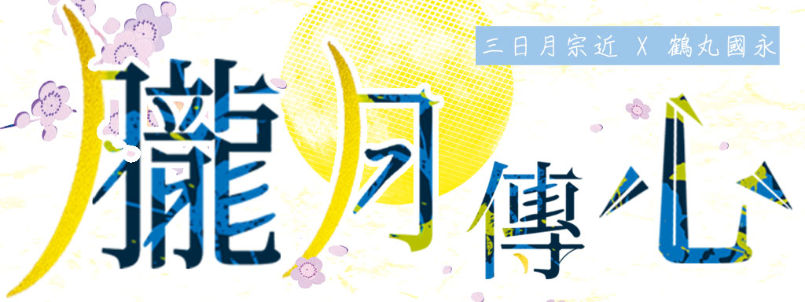

>現PARO 轉生梗(?)  
>審神者、大量歷史捏造注意  
>大概沒有帥氣的刀劍男子(?)  
>原創姓名注意  
>三日月的姓用了三条宗近橘氏說  
>鶴丸用紀念白河天皇誕生說法取名白川  

## 書籍資訊
- 書籍限定收錄番外<<相遇>>與<<相戀>>
- 實體書已絕版／[電子書通路](https://www.doujin.com.tw/books/info/39741)

## 序

### 過去

　　「喚醒此身者乃何許人物？」人類強硬的打擾觸怒了沉睡中的神明。

　　漆黑的神明穿過法陣步下台階，一陣淒厲狂風呼嘯而過，他就地斬了在場陰陽師的式神，而術者非死即傷。

　　就是這個！在那瞬間人類已經認定這位狂神是實現他們大業不可或缺之物。

　　「住手，龍膽丸！」

　　「『龍膽丸』？」言靈阻止了他的暴行，這時候他終於注意到腰際發燙的感覺，「笹龍膽……哎呀，國永老爹發達啦？」吞口上的新飾非俗物，正是源氏一系的家紋，不過這並不會讓他對那些人類感到抱歉，他可是刀神，殺生是天性使然，若持有他的人沒有這點自覺那麼就休怪他無情。

　　人類向龍膽丸解釋為何打擾他修行神性，一切皆與卜卦預見到的災厄有關，凡軀無法與之對抗的死亡行軍逐步逼近，日之本歷史被傾覆的危機已迫在眉睫，他們所能做的，就是把這場戰爭拉至檯面下進行，使敵人無法染指正確的歷史。

　　「時間溯行軍？這還真是有意思，我很好奇敢違抗天命的是怎樣的一群傢伙，他們的膽識與自身力量相符嗎？人類的業與我無關，作為武具我會盡命，但你要我做份外的事就得接受我的條件。」他是被迫召喚來的，人類理虧，被神明討價還價也莫可奈何，「哈哈哈，其實也不是什麼難事，只是有個傢伙我無論如何都想見他，你們讓我偶爾去看看他就行，簡單吧？」

　　交涉成功，高傲的神明終於肯委身於擁有高貴血脈的一族。

　　「那個那個誰？怎麼稱呼？」

　　「村上太郎永守。」

　　「請多指教了，村上太郎。」

　　剛才的氣勢彷彿幻覺，不稱主人而直呼其名的龍膽丸隨性得可以，他笑起來的樣子能讓人怒氣全消，神明心性純粹又喜怒無常這點表露無遺。見識過那神威後村上確信自己的預想沒錯，要給這位放蕩的神明披上菊紋用華布錦盒包裹裝飾還言之過早。

　　他該大展身手的舞台應該在別處。

### 現世

　　戰爭硝煙瀰漫於深夜寺宇中，黑白陣營兩種正義僵持千年，外道眾召喚了常人

　　難以預想的凶神劈裂現世寧靜，面目猙獰、狂骨竄動，飛濺的塵土夾雜斑斑血肉，

　　被譽為萬靈之首的眾生命如細絹，淡泊脆弱得不值一提。

　　刀劍為身、刀劍無情，怨念的產物若沒有同等份量的思念便無法與其比擬。

　　「眾神端坐高天原──」

　　領導白色陣營的覆面少年拔了一個高音後，同伴們聚精會神唱起禱詞，無分男女老幼，著宮司服的亦或便服審神者皆欠身二拜，手執神樂鈴的覆面女眾樂響半邊天。

　　「敬請諸神將逆時禍事罪穢祓除淨化！」

　　眾人二拜二拍又一拜。

　　時間溯行軍試圖破壞儀式，人類雖脆弱但數千意志串連的鎖鏈最令他們恐懼。

　　咒畢，閃藍軌跡劃開空氣，五道人影步出聳立於人類與法外者中間的陰陽陣。

　　「我等奉明立天御影命[^1]，特此前來。」領頭青年的清朗嗓音洋洋盈耳，霎時間令那些騷動靜若止水，手持的一枝御櫻隨他步伐飄著櫻吹雪。

　　『賜予青人草 [^2] 幸福繁榮、益加昌盛。』帶著高神的祝福，五人回拜。

　　人類的樣貌與西裝短暫模糊了他們的身分，五人開眼，外道眾強烈地感受到與他們自身相似的氣息，血液同樣有熾熱的激流，情感糾結著痛得嘶吼，顯然非要一戰才能貫徹自己的正義。

　　那麼就來戰。

　　如巨岩般高聳頑固的身影後一把長兵器化為旋風，銀色閃光之下腥血撲鼻，或許有危機意識的躲過了致死的一擊，不過來者的戰鬥思維更加立體，無防備的上空彷彿降下紫雷，一瞬間取下了一名凶神首級。

　　「有點使不上力呢，到底為什麼啊？」

　　「剛過國界身形還不太穩吧，岩融有我支援什麼都不用擔心。」天狗般輕盈的身段落到岩融肩上，那份無力感不影響他們感受血中傳來的芬芳，再說他們使出全力的話後面的人可就沒戲了。

　　「三条派，石切丸。」

　　「三条派，小狐丸。」

　　漫長的歷史修正戰爭唯有刀劍交錯染上腥紅，才成持續維持神明的熱情與踏實感，政府在他們身上花了多少裝治費也沒有看在眼裡，他們等待著棋逢對手出現，並從那得到的絕美武勳裝飾自己，只是現在還沒有人能滿足他們。

　　「三条派，三日月宗近，參上。」其身融於夜色眼中卻懸著雙月，名列天下五劍的三日月宗近神體出鞘，粼粼閃爍的白輝支配著這黑夜。

　　外道眾從刀身反射中看到的是自己的死相。
　　

　　[^1]:註：明立天御影命，即是天之御影命，鍛冶刀劍之神。
　　[^2]:註：青人草，指蒼生、人民之意。

## 第一章　觸發

　　隱世的戰鬥持續不斷，然而現世的和平慵懶得叫人想打呵欠。

　　打理黑色衣裙是一天的開始，這個人身上的一切──諸如因病變色的白髮和那女僕裝，皆與孕育傳統文化的千年古都格格不入，不過帶著笑容辛勤工作的模樣廣受當地居民歡迎。商店街的活看牌招呼完街坊鄰居後，哼著愉快小調前往附近的寺院，特地起了個大早就是為了看辛苦幾個月的成果。

　　頭上頂著美好晨光，然而眼下卻是一片狼藉。

　　「全沒了。」

　　那菜園是他們的心血結晶，不知何故在一夜之間成了死地，翻遍寸土都沒有任何生機，女僕內心所受到的衝擊不比那些茫然的小朋友們少。

　　「看我不宰了那群王八蛋！」鎮街之寶放下農具抄起一把寺院的竹劍。

　　「白川美鶴，暴力解決不了任何事。」住持一劍刺在女僕後腰，而後收走竹劍把人放著開始訓導：「別在佛門清地說這種大不道的話。」見到菜園被人糟蹋住持心也是疼的，他唸起佛經希望平撫那些草木之靈。

　　「江雪……到底誰才暴力！」女僕美鶴揉著腰一時半刻起不來，內臟好像真被他戳了個洞，所幸粟田口家的兄弟幫忙才勉強站起來。

　　「你就聽大哥的，現在先回去等收拾好後再來重新種東西吧。」左家二哥出面安撫，抓兇手也只是浪費力氣，如果真想看到蔬菜能收成，還是把心思放回來較好。「你們不是還要上學嗎？」

　　「今天先這樣啦，下次種長得快的菜就行了。」齊瀏海雙胞胎拉著美鶴走。無能為力的他們都看開了，不希望美鶴一個人承受這些。

　　「呣……還真是不甘心。」美鶴總算被勸退，因為想到沒有依約照顧好粟田口兄弟，今天恐怕會變得更不好受。「走，回店裡去，你們得吃快點啊，不然等等上學會遲到。」

　　「還不是因為你在那磨磨蹭蹭！」厚差點想戳剛剛美鶴被住持刺的地方。

　　「粟田口是『あ』開頭，點名一下就被點到了，你們座號都在二十以內怎麼能怪我呢。」

　　在粟田口兄弟看來嘴貧的白川美鶴心智跟他們沒兩樣，只是個兒長得比較高的孩子。

　　像母雞帶小雞一樣，美鶴領著粟田口家的小雛鳥來到「明燈堂」，老闆兼朋友的光忠在這古色古香的京都街道做起食堂的小本生意，和式洋式料理都能顧及，小歸小，忠實顧客卻不少，美鶴在那工作胃口也得到過不少好處。

　　頗有重量的深色實木門敞開，開店時間尚早，屋內就已經充滿溫暖與食物香氣，怪的是不見老闆和另一位朋友，倒是有位清新俊逸的客人在靠窗的座位慢條斯理地品嚐和式早餐。

　　他物陳舊腐朽可預見壽終正寢的模樣，那人則像不壞的玉石，有著不遜於明燈堂古物的悠遠氣質。

　　西裝男子儀表堂堂，陽光流瀉在那抹深色身影，他的表情牽動著周遭溫度，若他就這樣不動，那麼眼前便是畫般的優雅美景。

　　不只是美鶴，粟田口兄弟也看傻了，並不是陶醉在難得一見的情景中而是一陣愕然。

　　「你們認識？」被美鶴一問他們都搖頭。

　　彼此視線對上僅點頭致意，男子穩重又是第一次見面，怕是貴客，女僕美鶴這一次不敢在人前胡鬧。

　　老闆已經料理好大部分的早餐，美鶴只需要把它們加熱分盤裝餵飽粟田口兄弟即可。

　　未成年的粟田口兄弟裡有一個美鶴特別喜歡，今天只來了九人，獨缺那個平常會陪自己拌嘴的，聽兄弟們說似乎是有事請假了。

　　「女僕，浩哥又喝醉了。」兄弟中較好動的高中生發現櫃檯末端露出來的長腿。

　　「清潔工，喝醉可以但別千萬吐，替我省點麻煩。」本田浩是眾所皆知的酒鬼，美鶴沒想到酒鬼也會早起，一早要從醉鬼那保護小朋友們的精神衛生也是重勞動，至少美鶴沒有一次輕鬆過。

　　「老子是修五金的，嗝。」

　　「好，意識清楚等等好算帳。」

　　驚嘆大白天就豪飲三升之餘也有讚美意味在，美鶴從沒看過他清醒的狀態，一直認為此人非比尋常。

　　「不許剩下，聽到沒有。」櫃檯的舊式電話大響，美鶴不敢移開視線太久，就擔心他們挑掉討厭的蔬菜，「喂？小夜啊。」電話裡的是左家么弟，知道了一起耕作的菜園得重新來過特地打電話來，「嗯？哪有什麼好抱歉的，人家趁夜搗亂防不了又不是你的錯。」這通電話才讓美鶴真正放下抓兇手的心情，只想著要怎麼撫慰失望的孩子，或許晚點抱著一些柿子樹苗過去找他會是不錯的驚喜。

　　「回來囉。」光忠和廣光在廚房卸貨花了點時間，通常看光忠滿面笑容便知今天批到了不錯的菜，「橘先生，等等放著我來收拾就好。」

　　寡言的橘先生輕輕頷首。

　　「你回來的話就換我出去喔。」

　　「你什麼時候才會乖乖坐在櫃檯？」明明是自家招牌，待在外面的時間似乎比在店裡還多，「拜託這次兩天內回來好不好。」光忠對隨性的女僕已經是睜隻眼閉隻眼，但美鶴跑腿失蹤一禮拜的不良紀錄一直讓光忠他們記憶深刻。

　　「去找桶三秒膠把我黏住比較快。」意思就是沒門，美鶴拍拍光忠，在光忠不注意的時候順手摸走他的錢包，如果是甜柿樹苗應該所費不貲，這是有備無患。

　　本田在地板對光忠打了個手勢，在說如果美鶴一時半刻回不來也是好的。

　　出門前美鶴又瞥了俊美的西裝男子一眼，他做什麼感覺都合宜合理，但只有一點令美鶴惱火。

　　「喂！」美鶴看不下去扯著喉嚨喊人，全部人包括男子在內同時停下動作，「別用那種表情喝我們的仙台味噌！菜都變難吃了。」說完就頭也不回地離開，不想留時間給人反駁。

　　「抱歉哪，那傢伙個性就是這樣……」

　　「沒關係，你的料理很好吃。」

　　好吃嗎？男子突然一陣疑惑。

　　當地人偏好白味噌，吃不慣仙台辣味噌肯定是多數，喜歡這種嗆辣感的就沒話說，愛挑毛病的則是會被女僕用力挑刺，味覺貧乏的嬌貴舌頭吵架也沒什麼層次，結果反而變成部分客群是專門來找美鶴鬥嘴，客人興沖沖地光顧然後清爽地打道回府，對店裡來說似乎也不是件壞事光忠也就放著不管了。

　　光忠聽得出來剛剛客人是在跟自己客套，而且他還知道本人並沒有自覺。

　　繼續品嚐味噌湯時橘宗近覺得奇怪，被女僕狠狠唸了一次後自己竟然說不出第二次「好吃」。

　　／

　　「要命，柿子樹苗這麼貴！」美鶴原本還想種一打來玩玩，誰知道一張福澤諭吉只夠兩株，一個種植生手硬是被老人家留在園藝市場好好重頭做了一遍功課，回過神時太陽已經下山。

　　美鶴在路上有買點廚房的必需品，通常這麼做光忠的處罰就會輕點，「月亮都出來了啊……算了，去左家蹭個齋飯再回去好了，這樣還真的是兩天內回店裡。」自己也是固執，衝動決定好的事也會想堅持到底才常被廣光說是笨蛋。

　　再過兩刻鐘就是零點，走在已經熄燈的登山步道上，心底不免覺得毛毛的，全是因為有明月相伴才能對自己說沒問題、再堅持一下。

　　因為某些原因美鶴遠離的步道，一群殺氣重重的覆面怪人提著燈火在山上巡邏，美鶴想那個不與人爭的左家兄弟應該不會招惹上什麼邪教才對。他加緊腳步趕到寺院正殿，從門縫瞥見好朋友江雪氣定神閒地讀經，那麼其他兩兄弟應該也安然無事。

　　「只是奇怪的登山客嗎？」美鶴不敢大意，搞不好那群人就是破壞菜園的兇手，就這樣擦身而過實在太便宜他們了。

　　回頭看看菜園，爛掉的菜已被清理乾淨，那些蘿蔔、蕃茄、茄子和青椒是大多數小朋友討厭的蔬菜，當時光忠和粟田口大哥正苦惱小鬼們挑食的問題，才想到自耕自食的點子，想到集合眾多心意的小田地全都付諸流水不免讓人再嘆氣一次。

　　「哎呀。」靴尖輕鏟了土壤表面幾下沒想到給美鶴鏟到奇怪東西，「金飾哪。」正確來說是繩飾末端一小段流蘇鏈，無法確認是鍍金還是真金，心中直覺卻告訴美鶴這是真金，「啊，早上那個傢伙！」隱隱約約記得他袖下筋骨分明的手腕掛著某個飾品，當時沒盯著看太久只記得是金色的東西，很難想像那樣的人會跟這破事有所牽連。

　　翻開雜草，底下一個類似腳印痕的東西比自己的腳大上一倍，美鶴並不矮，那麼只能說可能有龐然大物潛伏在附近，可自己又不是酒鬼本田，幻想有將近三米高的人類似乎有點不切實際。

　　藏在雜草堆的訊息不只這些，美鶴用手機燈看到反覆疊加的印痕，支撐菜葉的木條有的斷裂、有的斷面卻異常漂亮俐落，就好像──

　　「這裡發生過械鬥？」

　　聽到由遠漸近的腳步聲，美鶴以為又是剛才那群人，卻看到數道赤色凶光在林中若隱若現，步聲合一，持著長槍的黑影形如足輕，看不清陣笠陰影下他們的表情。

　　夜間拍時代劇……不可能！

　　當長槍指向自己時才驚覺大事不妙。

　　「真是給人添麻煩。」一個人聲彷彿從四面八方傳來，披著夜色潛伏行動，像黑貓一樣敏捷無聲的步伐掠過那群足輕，銀光一閃便令他們消失無形。「敵人的式神而已，不足為懼。」

　　「小藥！」定神一看此人，正是再熟悉不過的粟田口兄弟，裝扮凜然俐落卻飄出陣陣血腥味，直到他收刀露出豪氣笑容時才又恢復成美鶴認識的小藥，「這個甲袖、這個裝扮、還有那些像妖怪的亡靈士兵……難道你是魔法少年？」美鶴自己都不敢相信，不過這是各種不合理中最合理的一個解釋。

　　『怎麼會扯到那裡去！』

　　美鶴前肩和後腦都被打了一下，覆面人其中之一聽到那些胡鬧的俏皮話終於也看不下去現身，且是年紀與小藥相仿的少年，相較之下這個沒有武裝，美鶴輕輕鬆鬆就抓住了他。

　　「松平織物的小老闆？」很快地，美鶴認出了同條街的鄰居，跟吵吵鬧鬧的粟田口兄弟相比這孩子就樸實多了，萬萬沒料到他也有不為人知的秘密。

　　「對，我是竹吉……」

　　「你瀏海那麼長還用布遮看得見嗎？」發生太多奇怪的事情美鶴一直分心不知該專注在什麼才好。

　　「你都已經性命堪憂了還調侃我！」竹吉掙脫後拉著美鶴要離開，「快走！在被『他們』看到前快走！」明明美鶴沒有掙扎他卻一點也動不了，「藥研你在搞什麼！」全是因為另一邊的藥研也拉著美鶴。

　　「女僕，你身上有吃的嗎？」

　　「三個大福，沒冰過不好吃喔。」

　　「給我給我，統統拿出來，我餓死了。」藥研直把竹吉的憂慮當耳邊風就地開吃。儘管明燈堂女僕惹上了大麻煩，不過出現時機倒巧，如果沒有體力他根本沒辦法作戰，他認為靜觀其變或許會變成有意思的發展，「這樣就有力氣護送你們下山了，剩下的之後再談。」

　　藥研說的是脫離戰線，事實上就算恢復體力，他也無法避免事態變得更糟，在浪費時間的同時後來者已經追上，藥研用了全身力氣去接下攻擊，刀身震顫反彈手腕，強勁得令他手麻不止。

　　「是自己人哪，三日月老爺。」

　　美鶴看到藥研口中的三日月有著比那些長槍足輕更深沉的黑暗，視線盡被雙新月吸引而無他，美鶴面對足輕沒有半分恐慌，反而是藥研的同伴讓美鶴全身細胞都感到顫慄。

　　印象裡光忠稱他為「橘先生」，眼前持著太刀的這人周圍散發死亡氣息，寒意冷冽得叫人骨頭直打顫。

　　「這算什麼？」他的身後又出現一人，還未走近美鶴他們就已經感覺到對方的高大，男人白髮赤瞳，彷彿是故事書中出現的神怪，「慢著慢著，深山裡怎麼會有野生的女僕？」

　　你才野生！你全家都野生！

　　被當成奇物被一群莫名其妙的人議論讓美鶴的壓力值快要爆表，竹吉還掐著美鶴的腰肉不斷嚷著「逃」。

　　「看來不是敵人，小狐丸。」三日月用毫無平仄的冰冷語調說著，「但也不是自己人。」他沒有問審神者為何要護著這麼一位人物，不過他們指令中確實有提到發現隱世之密者一律排除。

　　「喔？」

　　美鶴敏銳地捕捉到白髮男人太刀撥顎離鞘的細小聲響。

　　「貓咪奇襲！」等他回頭的瞬間美鶴在小狐丸眼前拍了個響掌，趁小狐丸分心之際腳底抹油開溜。

　　「天殺的，混帳東西！哈嚏──狐狸是他媽的犬科啊！」加工過的相撲佯攻術裡面混了胡椒粉足以讓人淚涕俱下，小狐丸知道追上去一點也不重要，可他就是心裡窩火想一吐為快。「三日月你也別笑！」

　　「我有在笑嗎？」

　　「是我錯覺？」這裡只有他和三日月，直覺剛剛被什麼人取笑了一下，「看來江雪左文字不願出戰，正好可以讓我小狐丸狂舞一番。」

　　傷員都先退下了，他倆等著殿後的同伴把殘兵驅趕至此地，穿越密林時使用長兵器的定會避免對峙，此山開闊的戰場就是這座寺廟，游擊打了兩天一夜，最後敵人部隊還是不得已回到這裡一決雌雄，就算沒有左文字三兄弟把關，他們還得面對名物與神刀備出的三条派。

　　他們手中有什麼王牌？

　　身手快如紫電的長槍兵能傷刀劍男士幾分，血氣卻會激盪出他們非善類的瘋狂。

　　火繩槍固然改變了戰鬥型態，但那規則只適用於人類，刀裝式神中銃兵是最脆弱的，不論敵我的銃兵式神，單單神威就能將他們震個粉碎。

　　殺神斬妖還是非刀劍不可，見血碎骨直至屍首分離，這是優雅地潛伏在世界的另一面，卻又暴戾不已的戰爭。

　　和小狐丸宣洩精力品味戰鬥的想法不同，三日月有個自私的願望不與人道，倘若戰爭太早結束，他懸心之事都將成為一場夢，他希望對手越戰越勇，哪怕狡詰使詐他也來者不懼。

　　只要能堅持到那純白如初雪的神歸位。

　　／

　　逃，能逃到哪裡去。

　　美鶴沒有家人或可靠的身世才寄人籬下，熟悉的世界天地異變還是只能回到明燈堂，剛才看到的東西到現在還讓美鶴心有餘悸，理應驚惶失措，美鶴卻是反常地沉靜下來。

　　「女僕，現在做得出什麼料理嗎？」

　　「炒飯。」

　　「你還要吃啊！」竹吉會努力挺住，因為當場暈倒的話就沒人可以照看這兩個沒危機意識的傻瓜。「你知不知道現在是什麼狀況？」

　　「我大概會被殺。」看了不該看的東西加上竹吉的反應，美鶴多少還是有一點自覺，所以現在沒心情聽那些冗長的故事，而是像藥研一樣先補充體力再來想辦法。

　　「你有可能上樓睡一覺，然後把這一切當成一場夢嗎？」因為太了解美鶴的個性，藥研說話就不拐彎抹角了。

　　「去找一支可以消除記憶的筆來比較快。」說得出俏皮話美鶴感覺好一半了，不急不徐地到習慣的櫃檯裡找做炒飯的食材，「你之前說你的另外一個名字是什麼來著？」

　　「藥研，藥研藤四郎。」

　　「粟田口藥久」只是一個偽裝身分，看似文弱實則豪放的國中生，他不是人類而是刀劍的付喪神，這般性情全是戰爭磨鍊出來的。美鶴煮飯前手機上網一查差點沒中風，不只是侍奉過第六天魔王的精采履歷，還有他一家子都不是人類的這個事實。

　　「有被嚇到嗎？」藥研趴在櫃檯上露齒而笑。

　　「都高血壓了。」

　　這就解釋了為什麼粟田口家兄弟眾多又每個都不太像，他們的人性與外貌是被人類歷史雕琢出來的，至於兄弟們吃飯時偶爾東少一個西少一個，是因為要跟著審神者們四處奔波趕不回來。

　　比起存在被否定，藥研倒還喜歡美鶴對他們不反感這一點，戰爭無處不在，他們日常得屈就於政府安排，面對那些假老百姓與擬似人類的日常比歷史修正更叫人厭煩，他很慶幸至少有個人讓他們生活感覺沒那麼糟。

　　「我們一定會讓你活下來的。」看美鶴能從那不可一世的三条派手下逃過一劫，藥研認為搞不好美鶴真有很強的運氣。

　　「……謝謝喔。」

　　「當然是交給竹吉來想辦法。」

　　「藥研！」竹吉欲哭無淚。

　　付喪神主要負責剷除時間溯行軍的體力活，制定規矩這種麻煩事情的是人類，自然就要順著人類的思維去處理問題。竹吉年紀雖輕，不過也有統領關西一帶審神者的高端實力，若要藥研說的話，竹吉少年的審神者地位媲美戰國大名。

　　「聽起來真可靠。」經藥研提醒，美鶴已經知道該指望誰了。

　　他找齊材料準備去切菜，掀開蓋著流理檯的防塵布卻找不著菜刀。

　　「怎麼了……哇！」假如藥研剛才沒機警後退，美鶴把太刀從桌上拿起來的時候可能會削到他頭髮。

　　那刀的刀拵全卸掉了，徒留赤裸裸的無銘刀身。

　　「光忠該不會晚上拿這玩意兒來切菜吧？」刀上有血跡及大片傷痕，美鶴仔細審視刀身，最後在刃面反射中瞥見了熟悉的影子，「光、光忠！」

　　竹吉見狀，頭與胃都在絞痛，事情果然只會越變越糟。

　　「光忠！」廣光走出廚房也是一身奇裝異服，不管身上傷勢，慌張地想搶下美鶴手中的太刀。

　　「哎呀，光忠兄弟啊……」

　　不敢相信的是酒鬼本田也參了一腳。

　　「統統給我跪好！」本來美鶴想叫他倆跪碎冰的，看在竹吉替他們求情的份上就沒做到這一步，而他現在拿光忠就像家法棒一樣，「搞什麼東西，你們也是嗎！什麼『燭台切光忠』和『大俱利伽羅』？」比起幾張不老實的嘴，搜尋引擎比他們自己招供更靠譜，「本田，你是哪一邊的？審神者還是刀？」

　　「其實算槍……」

　　「太小聲了！沒吃飯是不是！」

　　光忠弱弱地懇求美鶴不要亂揮自己，雖然負傷，他還是相當鋒利。

　　「老子可是被歌謳為擁有正三位的前皇室御物，為戰國大名與武勇之人所傳承的『日本號』，憑什麼要被個乳臭未乾的小鬼說教！」這是本田對女僕美鶴說話最不客氣的一次，總是喝醉賣傻的他挺起胸膛時的深沉漆黑覆蓋在美鶴頂頭。

　　「你，又喝酒了沒錯吧。」被人俯視的美鶴也不甘示弱，貓眼色瞳中的日本號就像被瞄準的獵物般，「你們跟政府在偷偷摸摸搞戰爭的時候，我也是拼了命地在過日子！沒有任何告知與防範，罔顧人命的傢伙還好意思在那裡欺負平民！罷了罷了，神明本來就全都是一群任性的傢伙，但你們當著我的面說謊這一點比普通人還差勁，什麼修五金的？沒修過就根本沒這回事！人與器物不能共存那那個莫名其妙的戰爭又是為何而打的！」

　　「俱利兄弟，你們家女僕真的好刁蠻好可怕啊……」日本號被美鶴的連珠炮轟得滿頭包。

　　「沒有人說得過那傢伙，從來沒有。」槍打出頭鳥，俱利伽羅和光忠毫不反抗是最明智的保身辦法。

　　「我想到了。」在人與刀的騷動中竹吉終於想到一計，「白川，你要不要當當看審神者？」之所以會爭執歸根究底就是信任問題，如果美鶴是個局外人這點觸犯規定，那麼把美鶴拉攏過來就好了，只是竹吉的發言令在場者皆瞠目結舌。

　　「且慢且慢，竹吉老弟，那就表示這暴力女僕會給我們做維護耶？」

　　美鶴抬腳踹了這千百萬身價的名物膝窩一腳。

　　「也不是每個人都能當就是了。」審神者適性的第一關要看氏族資格，白川氏算尋常姓氏或許有入列，但也得看靈能資質。「只是權宜之計，到三条派離開這裡為止就行了。」

　　「贊成。」藥研想沒錯，竹吉確實不愧為關西審神者統領。

　　「只要這傢伙安然無事就行。」交情至深的兩人一定贊同，多年來避免美鶴被捲入下了一番苦工何嘗不能再做一次。

　　「想得太不周全了啦！」日本號就是要給大家潑冷水，「我追敵人追到寺院的時候可是看得很清楚，你被小狐丸和三日月看到了，那兩個傢伙之一有可能就是排除指令的執行人。」

　　他們都是看過生死百態的千年古刀，見過人性之惡後對人類有極大的不信任感，甚至會質疑審神者，日本號才如此確信他們會親自來執行排除指令，他認為如果是親近人類的小狐丸可能還有商量的餘地。

　　「不，那個叫三日月的傢伙比較好處理。」想起那眼神與話語仍會打冷顫，美鶴卻一點也不懷疑自己的判斷，越有原則的人越容易掌握。

　　「或許是真的，我這就去拿符文掩布來。。」竹吉難得贊成美鶴的冒險想法，以三日月的經歷來說他還懷著一絲佛性，比較有可能對無害的美鶴放手。

　　／

　　三条派多快會找上門來沒人有把握，唯獨美鶴猜中了，就是今晚，一點也不拖拉。

　　儘管美鶴常常離開明燈堂的櫃檯，不過對美鶴而言還是站裏側最令人安心，在自己的地盤上自然也有勇氣直視那雙詭麗月瞳，明明先前一點也不怕魁梧體格的日本號，反倒是這個斯文的紳士身上有一股深不見底的黑暗，彷彿會把人拽進深淵。

　　男人有許多響亮的名號，三日月宗近才是他真正的名字，天下五劍之一，目前顯世的刀劍中擁有最高神格的刀劍付喪神，其刃生貫穿千年，最瑰麗的日本之寶。

　　「好眼神。」

　　「對，不是準備赴死的眼神。」在三日月拔刀前美鶴就嵌住了他的手，同時美鶴也感覺到三日月故意放鬆力道在試探自己，「『憑神刀劍，亂舞今宵』。」竹吉交給美鶴的除了符文掩布之外還有審神者的口傳，他們只認這兩樣東西，「我只是在錯誤的時間出現在錯誤的地點而已。」

　　披上符文掩布後美鶴暫時化作審神者的一份子。

　　「你明顯和他們不是同一類人。」

　　「知道嗎？那是因為我討厭你們付喪神。」美鶴揪著紋絲不亂的襯衫衣領，「我討厭你們一副理所當然地裝成人類混入別人的生活，討厭你們打著狗屁大義對人頤指氣使，更討厭──你們打著『為了我好』的藉口用『神明』或『親友』的姿態試圖操控我！」美鶴一字一句地說著要三日月聽個清楚。

　　鬆開美鶴拳頭後三日月頷首致意，「對於打擾你的生活，我向你致歉。」這是三日月心裡也有的共感，由於某些理由他並不喜歡這樣的自己，美鶴直率的部分令他欽佩，歉意是真實的，但對於陌生的兩人來說不會有更多表示。

　　「我接受，因為我不是盡職的審神者，我同樣也欠你一個道歉。」

　　「那藉這個機會我們一起彌補各自的過錯。」三日月放下了神體，倚著桌緣，「請你為我治療。」

　　「欸？」

　　竹吉先前才說三条派的刀討厭審神者的維護，更不可能會向菜鳥審神者提出這麼強人所難的要求，總是一場戰鬥之後就回高天原休養，如今三日月就給美鶴出了個難題。

　　就算出櫃檯看三日月也只有嘴角邊一道淺淺的輕傷，不像光忠那樣被打回原形需要拿出維護工具輔助，審神者的維護到底是怎麼一回事美鶴一點頭緒都沒有。

　　「請。」三日月叉著雙手，閉目養神等待美鶴有所動作。

　　剛才氣焰太盛是自己不好，可是現在拆穿自己好像就真的會丟了小命，美鶴只能拼了命地從三日月的動作尋找提示。

　　美鶴上前一步跨越人刀的界線，那個自己剛剛還切齒痛恨的界線，一點乾澀的暗紅轉印在朱舌之上，美鶴毫不介意將它吞下並把轉化後的絲絲甜蜜分享給三日月。

　　人子有哪點比不上國寶？沒有這回事。

　　審神者與刀劍男士的付出互有關聯，那麼三日月也該聽聽美鶴一言：

　　「這種傷，口水舔一舔就好了。」

　　三日月表面上無動於衷，背後卻浮現了連他自己都不清楚的情緒。

　　「什、要幹什麼？」美鶴被三日月一把拉了過去，而三日月使出的怪力讓人根本就沒得逃。

　　緊緊相依的兩人唇齒相互摩娑，由淺漸深的吻鋪天蓋地地襲上，每分理智都在起火燃燒，失去方向感後一頭栽進地的並不是令美鶴恐懼的暗闇，這個身體所感覺到的只是堅實胸膛傳來的體溫。

　　「高速槍對任何刀種都相當棘手。」

　　「白、白痴！別在接吻的時候說話！」美鶴被三日月的挑逗打亂呼吸，不知羞恥地在軟肉交纏中揉入海量情慾。

　　可恨啊，眼前這男人沒有一絲破綻，渾身帶著戰場氣息的三日月宗近依舊冷靜自持，且自己還覺得這個冷血的神明非常地、非常地勾魂攝魄。

　　「你越矩了，三日月。」美鶴攀上三日月的頸窩輕聲細語，指尖拉扯著他已經痊癒的完美面貌。

　　「不用那麼緊張，我已別無所求。」他從掌心傳來的觸感知道這纖細身軀的骨骼仍在隱隱打顫著，「請放心，我會撤掉在周圍警戒的式神。」原本不抱任何期待，結果卻出乎意料地好，無須再把刀弄髒一次，他感受到這年輕狂躁的生命尚有調教價值，足以讓他放手轉身離去期待下回再會。

　　「對你這人還真是一點也大意不得。」美鶴想他大概已經看透這全是即興表演，但後面那一齣他倆都還摸不清算是什麼。

　　「你似乎對我有些誤會，我並非不信任人類。」半敞的門縫中月光灑落其身，「我只是無法愛上沒有『他』的世界。」

　　僅僅一瞬，三日月宗近在人前卸下了冰冷的偽裝，既然他的思念已無法傳去彼方，那麼吐露一點也無妨，只因為美鶴身上有他所懷念的顏色。

　　／

　　三日月宗近帶著令人匪夷所思的話闖進美鶴的世界，使這夜變得相當漫長，醒來之後美鶴得面對親友身上自己不熟悉的部分，好重新習慣變調的日常，明燈堂隔日依然若無其事地照常開張，沒有人刀歧見，美鶴還是能把他們當親友，只是今天也出現在明燈堂的三日月直讓美鶴發悶。

　　「不是跟你說了別用那種表情吃我家的仙台味噌。」

　　在快用完早餐時，一名青年大剌剌地在三日月對面坐下，皮夾克、睡衣、運動褲，衣著邋遢又無協調感的他脫下木屐翹二郎腿，失眠的痕跡印在蒼白皮膚，起床氣十足哪還管得著有沒有失禮。

　　「美鶴小姐有兄弟？」三日月看光忠苦笑以印證自己的猜測，因為那頭秀麗的銀白髮絲實在過目難忘。

　　「沒有兄弟。」竹吉說。

　　「就是女僕。」藥研說。

　　『是美鶴哥哥。』粟田口兄弟合音。

　　「哈哈哈，當然是帶把的！」帶著醉意的日本號放聲大笑。

　　「名符其實的伊達男。」親友光忠想幫他說點好話。

　　「是笨蛋。」

　　聽到這美鶴忍不住瞪了正在磨咖啡豆的俱利伽羅一眼，不過他也已經習慣了。

　　「是純爺們。」

　　他用著低八度的聲音告訴三日月自己的真實面貌。

　　三日月指骨蹭著下顎，早餐配上不可思議的真相後，他思緒快速在腦海打轉，想起與美鶴的小小摩擦一切突然變得相當有意思，那些舉止不管放在哪個性別對他來說一樣特別，心底的小水花掀起一陣波瀾，沖刷著三日月對世事消極的心理。

　　「呵。」

　　「『呵』什麼鬼啊！應該是要驚訝吧？怎麼反而笑出來了？」桌子被用力一拍，上面餐具不免震了一下，其實美鶴本來是想把桌子掀得底朝天。

　　「抱歉抱歉，可是，哈哈哈──」

　　「三日月笑了。」這是竹吉有生以來初次看見那冷豔的刀劍男士展露笑容，當下他眼中看到的三日月只是個再普通不過的男人。

　　「這樣最好是在道歉啦！你是在笑話我嗎？三日月？三日月！」他已經足夠明白昨晚的事只是無心的誤會，但三日月缺根筋的個性叫他好氣又好笑，不說的話還以為三日月彎著腰顫抖是吃了笑菇。

　　堂堂天下五劍之一被個人類耍得團團轉是頭一遭，不知為何三日月反倒覺得心神舒暢。

　　無論是粗俗無理的女僕還是伶牙俐齒的青年，如萬花筒般的多重面相為他人渲染上了各種色彩。

　　白川美鶴這個人類已經引起了三日月宗近的興趣。

## 第二章　出陣

### 過去

　　白袖輕拂雪月風花，蝙蝠扇來回顯與幽。

　　「若不能問天機，但問芳名何。」

　　白拍子的秀麗容貌令公家子弟為之傾心，甚至在神聖的場合有了些許不敬之心，嫉妒乘在她的扇上與之共舞的神靈。

　　「北条大人，這位是從哪裡請來的？」

　　「那是我的東西。」凌厲眼神一瞥圍著自己的男人們，那些嘰嘰喳喳的聲音令他不悅，而充滿粉紅氣息的騷動全是臺上的白拍子引起的，「陵丸，順了你的任性可不是要你增加仰慕者！」哪怕是幕府掌權的一族也難以駕馭此人。

　　舞樂構成的神域裡只有人與神，快步追逐彷彿嬉戲、慢步回身猶見面影，旋轉再旋轉，甩掉托著長拍的沉悶音樂，那白拍子才感覺與自己所獻舞的神靈拉近了距離。

　　腰上太刀非白拍子慣用的白卷鞘，月輪羅列、高貴承和黃卷加其身，當芳物執起名物時令觀者越陷越深。

　　太刀出鞘，白刃如月輝波光蕩漾夜空，這名白拍子利用至高的權勢，將良辰美景跟敬慕全獻給了太刀裡的神。

　　霎那間靈流波動了一陣僅如水面漣漪，漣漪順平之後便悄然無聲。

　　「也是啦，我想這些表演對你來說太世俗了。」白拍子收刀苦笑，闔扇代表神靈的離開，又或許一開始就沒有到來，一切只是自己的錯覺。

　　陰陽怪氣的覆面者們清空了北条當家的左右席，那明顯的召喚訊息是不容被拒絕的。

　　「國永。」

　　那位白拍子不是推開人群邊客套邊開路，而是使勁踩舞台護欄飛身躍到北条當主跟前。

　　「之後再跟你說有趣的事吧，三日月。」

　　依依不捨地繳回三日月宗近後，白拍子當眾更衣，武裝大露浮筋和筋肉，俊秀的一面讓眾人對他的慕情又更上一層。

　　「太好了呢，大難臨頭的時候給大家都留下了美好回憶，真是功德一件。」

　　「少貧嘴了。」

　　「上戰場我話更多，別身在福中不知福。」

　　別人一句陵丸能回兩三句，再讓對方受一肚子氣，強奪來的東西本來就不好使，除非能承受他業障的重量。

　　盛氣凌人的當家將太刀交予白拍子，也就是那名刀劍付喪神陵丸。

　　此刀輕薄，北条當家卻持刀失衡不小心顯露了不想讓陵丸看到的東西，人類的軟弱。

　　「去把那些肖想北条氏歷史權威的鼠輩斬了。」

　　陵丸隨審神者們而去，行前不忘對他的持有者做了個鬼臉，「才不是為你們家族而戰，所謂歷史可不是你說的算。」

　　是的，他看到了那個膽敢把他人陪葬品帶在身邊的男人眼中充滿死亡氣息，男人的兒子年幼未元服，而他自己也命不久矣，儘管互不承認，但只有此刻人刀心有靈犀。

　　他們同時預見了鎌倉幕府的滅亡。

### 現世

　　「來──諭吉、一葉、英世、稻造、夏目，吃飯囉。」

　　栗田口兄弟偶爾會把家裡寵物寄放在明燈堂，美鶴一早起來餵牠們時感覺和平常沒什麼不一樣，端著飼料牠們就屁顛屁顛地跟在後面，他一度懷疑過這五個小傢伙不是貓，但栗田口兄弟說法和光忠一致，如果真是老虎的話，最後應該也會長得和一般老虎一樣大，看在牠們一直都那麼嬌小可愛，美鶴就不疑有他。

　　他現在才知道原來牠們是貨真價實的老虎。

　　「居然給五虎退的老虎取了個銅臭味這麼重的名字……」

　　這幾天明燈堂來了不少稀奇古怪的客人，俊美得彷彿非世間物的傲慢神明們還曾想要他小命，得搏命接待這樣的人物早超過了女僕的業務範圍。

　　「這些可都是對國家有偉大建樹的人哪，不然怎麼會印在日幣上。」美鶴回那位曾被他貓咪奇襲唬到的小狐丸，「三位大人一進來空氣就突然變清新了呢。」

　　換下女僕裝的白川美鶴也非尋常男人，一身輕裝加牛仔褲與皮靴，貼身的黑衫將那頭白髮襯得更加奪目，區區素色衣服他穿起來氣質卻不一般，黑得更深沉，使髮膚的白顯得更神秘，三位神明一眼便看出圍繞著他的混沌，石切丸評這氛圍實在純粹的不可思議。

　　「真要帶這二貨上戰場？」小狐丸問。白川美鶴的審神者身分是真是假根本無所謂，既然他阻止不了三日月，至少給客觀的石切丸來評評理。

　　「你小看非戰鬥人員啊？要是你找我維護，我就拿水槽底部跟廚餘泡過一夜的菜瓜布刷你刀身，再把你賣給蜂須賀當鋪，到時候看誰是二貨！」美鶴昨天已經教訓過三把名刀，今天再來三把他也沒在怕。

　　「你看啊石切丸！這麼大的污穢在這裡還不快驅除他！」

　　「只有泡廚餘水的菜瓜布我覺得不太衛生……」小孩子程度的鬥嘴只讓石切丸覺得無奈，這個叫白川美鶴的青年確實是他們沒見過的類型，對他們的影響是好是壞他心裡也沒個底，「就照你的意思吧，三日月。」難得有三日月感興趣的事物，他認為值得推一把。

　　今日，三日月打算帶審神者白川美鶴前去會戰。

　　松平竹吉已先前往，他們讓美鶴收拾簡單的行囊後也啟程，小狐丸則是被派去不同戰場，不會跟他們一起過國界。

　　「不用坐新幹線啊，這麼方便。」

　　夢幻任意門可達神之國邊境，在此道內時間流速較緩，來回日本盡頭也只是眨眼功夫。

　　「就跟轉車的概念相同，很方便，可神明的車錢所費不貲。」石切丸提醒這位審神者相對代價的重要性，若要召喚神格越高的神明就得付出大量靈力，光石切丸和三日月兩振平安刀恐怕需要三、四十位審神者才有辦法成功。

　　靈力對美鶴來說都是抽象的概念，一時半刻他也學不起來，眼下急須知道的或許是這之外的事，只是一時間他還想不到。

　　「話說石切丸是哪一種？太刀？大太刀？」

　　「喔？」原本有點介意名諱的部份，當石切丸聽到有趣的話，這件事就變成其次了，「應該是你先猜猜看，我再來解答。」

　　「大太刀？」美鶴盡量裝得像不知世事的新人，但也不想被當傻瓜，「你們跟光忠一樣身體重心偏左，你的左腳步伐拖得特別厲害。」他們誕生自以騎乘戰鬥為主流的平安時代，刀的重量容易使武者氣質顯露於外。

　　「你的觀察力真的很不錯，值得稱讚。」石切丸開始確定三日月並非只是被美鶴身上的異色吸引。

　　「因為我有個『好老師』啊。」他在明燈堂工作可沒有顧著講自己的話，偶爾也會聽別人說有意思的事。

　　「可以的話真想給你個平安御守做獎勵，現在沒帶啊……下回吧。」

　　「原來你還有在神社工作？」

　　神刀有靈，或許表示那神社很靈驗也說不定。

　　石切丸的神社尤其保佑疾病傷痛早癒這類祈願，他的加護在任何時候都很實用。

　　「是的，歡迎多來參拜，年末大祓儀式可是很熱鬧的。」

　　「哎呀，神刀大人真是會做生意啊。」

　　信眾越多對他的生活也越有保障，已經脫離時代潮流的兵器不只單純作為古物，他們同時也需要與人類有所聯繫，否則擁有身軀也僅僅是行屍走肉。

　　「審神者們也有這般活力就好了。」

　　「不能成為戰力的話一切只是枉然。」三日月並不認為看清現實算是澆人冷水。

　　把私情從戰爭中抽離，或許這樣的三日月比石切丸更接近高位神明。

　　「三日月，今劍說這次別再搞砸了。」

　　受人敬重的同時審神者們也心存畏懼，他們古老的三条派難以從中找到平衡點，只有三日月不覺得這是困境。

　　／

　　「探子回報，敵方部隊駐紮屏風岩西北，以逆行陣佈陣，速請松平殿下擬定作戰計畫。」一期一振交上情報後大舒口氣，持續三個月的戰事是否能在今天有個結果全看這一戰。

　　「一期哥。」骨喰扶著意識不清的鯰尾一拐一拐地過去，「兄弟快不行了。」他們熬夜打游擊好不容易取得一點先機，可是續戰力部分卻出了大問題。

　　在一期急忙找審神者來維護前，喊聲反被鯰尾胃中的鼓噪壓過去，聲音在林間回盪，響得驚動蟲鳥。

　　審神者是有為他們備齊食糧的，會落魄至此全是鯰尾自己所致，豪華如過年過節一樣的美食吃久了還是會膩，週週都要打夜戰身心寒冷疲困，不知何時起連一杯甜酒都成了奢侈品，然而審神者已經開始儀式，為了困住時間溯行軍，他們待會兒將會完全與外界阻斷聯繫，短時間內不再有補充物資進來。

　　「咬緊牙關速戰速決吧，除此之外別無他法。」不論是以大哥還是部隊長的立場，一期都傷透了腦筋，他腳邊已經有一個在睡袋裡作美夢的任性混蛋，要是鯰尾也退出戰線，他們兄弟大概就沒機會回家過年了，「都走到這一步了，我們絕對不能退。」

　　「兄弟們有傳話，說女僕等等就會來了。」粟田口兄弟知道的女僕也只有一個，骨喰看一期的表情就知道消息還沒傳到埋首打仗的大哥耳裡，「白川美鶴已經知道我們兄弟的事了。」

　　「松平殿下請讓我退出戰線！」

　　竹吉還以為自己聽錯還探出了軍帳確認，都已經是最後一仗了，刀劍男士與部下們還在浮躁，就算精確情報在手，他也變得不太有把握。

　　「什麼退出戰線？」一期的厚重禮裝能保暖防風，卻阻止不了耳邊寒意爬上背脊，「我才剛來你就要走嗎？一期老師。」

　　「讓你見笑了……美鶴殿下。」

　　歷史助教粟田口一期認識美鶴，美鶴對一期一振吉光則是一無所知，頭頂有一抹晴空的一期一振性格明朗，舉止如浮雲沉靜優雅，不論以何種面貌或身置何處，女孩們和審神者都喜歡談論他，美鶴只知道沒有那套華貴衣裝的一期還是他的好朋友，念在多年交情，那小小失態他就當作沒看見了。

　　「女僕，你手上的東西！」頹靡不振的鯰尾天線探測到了他朝思暮想的東西。

　　明燈堂的三人早已是常客肚裡的蛔蟲，他們需要什麼都準備得妥妥的，美鶴甚至丟下還在更衣的三日月與石切丸過來找粟田口兄弟，就怕難得的飯糰涼掉。

　　「關於我們，背後有太多故事了。」一期和認識美鶴的人一樣清楚，口舌爭辯方面沒人能扳倒美鶴，無法請美鶴退到補給線，那麼至少給他一點時間與空間。

　　「唉，其實我會來這也是說來話長……」他的項上人頭還被別人掌握著，現在對朋友們提起也沒幫助，「也可能沒我想的那麼複雜，光忠常說，所有麻煩都攪和在一起時先問胃口最準。」

　　或許一期一振是玉鋼打的，一旦有了人軀便抵抗不了身體的基本渴望，更別說他還是兄弟中食慾最旺盛的。

　　他們坐下來用早餐，即便是樹林茂盛的戰場，有美鶴在的地方頓時間也會浮現明燈堂的舒適氛圍。

　　美鶴沒來過鳥取縣的船上山，瞭望四周褪盡楓紅的鬱鬱冬林，高山頂已有白雪深積彷彿群山的被褥，蟲鳥走獸早趕在初雪降下前安舒地酣睡其中。

　　美鶴從竹吉那知道了那群想要改變歷史的敵人，強大得能扭曲現代兵器不被傷及分毫，他們在現代收集人心魔障作為穿越時空的能量進而干涉過去，千百年業障只有同等份量的東西能消滅他們，美鶴還無法客觀地評論正道在何方，眼下他的朋友在哪裡他就支持那一方，膚淺得被其他審神者嗤之以鼻，但他有自信把握最基本的原則。

　　政府親授的計畫是圍捕四散的溯行軍，將他們集中一處後請審神者們作法張開結界，召喚能確實埋葬他們的古戰場，雖說會大量消耗審神者並且自斷後路，可是不會波及現代的優點遠勝本身缺陷，不只一位刀劍男士想過……時間溯行軍應該也會想在自己熟悉的時空長眠。

　　「敵軍駐紮在本陣東南，船上山等高線兩百米處，雙方都以步兵與騎兵居多，我們預計辛時會在平地處交戰，明石殿下因疲勞退出戰線，才請了三条的兩位補上空缺，敵軍逃不出古戰場，戰力方面也是我們有利。」一期簡化繁複的資訊讓美鶴能輕易了解現況，「你是我們最有幹勁的審神者，要試試看罵陣[^3]嗎？」

　　「真的假的？我早想試一次看看了！」

　　「當然不行。」一期讓美鶴碰得一臉灰，「他們只是一個執念凝聚起來的集合體，心理戰起不了任何效果。」說真格地，一期有點想看如果溯行軍與美鶴唇槍舌戰會是誰勝出，「你來的時候有看到那些士兵吧？那些都是由審神者操縱的式神，對方的士兵也是式神，他們是沒有心的。」

　　一期曾告訴美鶴戰爭的勝敗公式，出現傷兵的話就必須有運送傷兵的人員，一成死、二成傷、二成運送與救治，剩下五成的人就無法再作戰。

　　所幸這場戰爭不需投入人類士兵就能避免這樣的局勢，但審神者們相對就是在大局中扮演最關鍵的那一成，若失去他們歷史將會傾覆。

　　「所以這是新式的戰爭型態？」美鶴叉著手指靜聽，他喜歡一期講這些事，古怪的歷史助教確實有豐富的戰爭履歷，美鶴現在正需要一期的經驗。

　　「哈哈，我們都還在效仿戰國時期的作戰方式呢，最多也只是千人合戰的規模。」一期自己挖苦自己不過認真跟戰爭面對面時又是另外一回事。

　　修正歷史觸及到了天命，牽一髮而動全身，以現代的學術理論看這場戰爭，一期是越研究越悲觀，凡是有濃厚審神者血脈的家族都得為政府效力，不分男女老少只問有無靈力，他們人手匱乏，終有一天會將越多人牽扯進歷史修正戰爭。

　　「我們『守護』歷史，是屬於被動的那一方，沒有轉守為攻的方法已然付出了龐大犧牲，更別提要戰到完全消滅敵人的那天……」後面一期只是動了動嘴唇沒出聲，他知道這番話已經太過僭越，「所以美鶴殿下，我以粟田口一期的身分懇請你……退出我們的戰爭好嗎？」

　　看不見也摸不著的天命要如何與人生放在同個天秤？

　　一期認為它們並不對等，人類不必也不應該去衡量它們孰輕孰重，刀劍男士阻止不了戰火延燒，但他至少可以勸朋友珍惜自己應得的人生。

　　美鶴將一期勾過來，人刀觸碰起來沒有差別像是作夢一樣，「就是因為有像你這樣的傢伙在，人類才有勝算不是嗎？」他敢答應三日月來參與會戰，也是為了想重新確認自己擁有的羈絆真假與否。

　　「真是說不過你啊。」一期一直希望有人可以駁倒他，不過美鶴讓他反省了一下這個觀點並不適用於拼命活在當下的人們。

　　「要開始軍議了。」

　　三日月前來迎接時，粟田口兄弟們皆向他致意。

　　一襲紺碧如黎明前的夜色，袖上華美紗綾紋蕩漾也無法與那兩輪月牙爭艷，絕美凶器的凌厲氣勢壓制四周生氣，彷彿訴說想投身不見底的永夜瞳中撈月定會斃命。

　　美鶴感覺那光芒不會照亮任何東西，僅僅是引人入深淵的鬼燈，而他下意識地想遠離這個男人。

　　／

　　從他走入本陣開始，自己這頭白髮一如往常吸人眼球，走在三日月身後人們對他更是議論紛紛，從不親近人類的三日月宗近攜著不為人知的異色珍眷，評論細至顎緣、手筋，對他為人也有各種揣測，卻沒一個評價符合白川美鶴這個人。

　　戴上符文掩布後，美鶴成為了無名氏的一員，必須完全遵守松平竹吉與刀劍男士們的號令，除了領袖，審神者間只以顏色互相稱呼對方，他人不敢以低階稱呼喊天下五劍的隨行者，但美鶴也非武藝高強的上位「帶刀」審神者，他們便稱美鶴為「白法師」，其地位僅次於「帶刀」。

　　「眾刀領兵！」竹吉攤開軍令眾人如坐針氈。

　　部隊長與副隊長皆能配得三百騎以上外加六名帶刀，人人稱羨精銳就是如此。

　　美鶴也沒看到其他人抱怨兵力太少，不如說脇差兄弟聽到自己部隊有盾兵反而是鬆了口氣，石切丸也是被配發至少兩百騎，審神者的配置他們完全倚賴竹吉的判斷。

　　「鶴。」三日月喚他，「我將五十重騎交給你。」將特上式神的號令玉攤在美鶴眼前，三日月無視了竹吉的決定照自己意思辦。

　　是任性還是率性？石切丸跟竹吉討論不出個結果，精師帶刀們也不敢違抗，美鶴不免得承受那些嘖聲與睨視。

　　「我不收。」美鶴不擔心斷然拒絕日之本國寶會給自己招致怎樣的怨恨。

　　「別誤會了，這並不是對你有特別照顧。」

　　「你也別誤會了，我有我的戰鬥方式，而你的兵不是我的最佳選擇。」

　　白腦袋左轉右晃，美鶴剛剛一直很在意某支部隊，「我要他們。」

　　美鶴所指是一群兵裝黯淡的式神，甚至比不上特上輕步兵的英姿。

　　普階弓兵六十兵。

　　霎間美鶴看到了，刀劍男士們的愕然、帶刀們的嘲弄。

　　以及一期一振嘴角的笑意。

　　「哇啊……那笑容真讓人不爽。」美鶴擠弄一期的嘴角時又驚動了審神者們一次，這些舉止對神明實在是大不敬。

　　「我的笑容會讓人不爽？」

　　「那是你想給人震撼教育前的表情啊。」一期的確有話藏在笑意背後沒說。

　　一期撥了自己五名輕騎兵給美鶴護身，並請美鶴尾隨著他，驚喜留就在後頭。

　　「讓開。」青帶刀的女子騎馬推開美鶴，「你不夠格侍奉三日月大人。」

　　「是三日月硬要帶著我的，他有刀我只有腦袋，我能怎麼辦？有怨言就去跟他說。」美鶴比她更理直氣壯，堵得人家回不了半句，最後氣急敗壞地轉向入列。

　　他自認自己除了異色外應該是不錯的男人，沒想到這麼快就被女孩子討厭。

　　美鶴的部隊看起來貧弱，但如果一期教得沒錯，要活命就全指望他們了，唯一讓美鶴困惑的是他沒有看到帶領弓兵隊的刀劍男士，徒留坐騎領著他們。

　　不知何時，先前一期拿刀鞘一直戳的睡袋滾到了他的部隊中。

　　「老兄，要睡去其他地方。」

　　美鶴以為自己有好好托著他的頭，所以睡袋挺起半身的時候嚇了他一跳。

　　「注意孤雁。」睡袋丟了一句不明所以的話就又滾去部隊後方。

　　軍議結果：本軍決定同以逆行陣衝出樹林快速追擊。

　　美鶴入列，他的位置介於一期與三日月之間，「這一仗結束後你就不會死纏著我了吧？」

　　「接下來我將前赴鎌倉。」雖然知道他們的特殊移動方式，聽到三日月接下來要去關東，美鶴還是有些小吃驚，「船上山戰役中最有名的便是六波羅攻略，下一站關東即元弘之亂的終點──鎌倉幕府的滅亡之戰。」儘管命運對蒼生無情，歷史仍不能被顛覆，三日月最為在乎的事物也與這段歷史息息相關。

　　與三日月並騎時，美鶴對古戰場的感受也有所不同。

　　「太鼓與法螺貝──」在一期一振的號令下戰鳴大響，凜然刀鋒劃開帶著肅殺之氣的逆風。

　　──全軍前進！

　　前方會是否為地獄所有人早已做好準備，全副精神集中於部隊長的鋒芒上，美鶴也是難抑武者震與心中激昂。

　　……懷念的地方啊，我回來了……

　　「三日月，我們會贏的，而我會活著回來。」彷彿同意了那個從暗處浮現的聲音，美鶴俯身力振韁繩跟上一期騎兵隊最尾。

　　「鶴……！」

　　又一次地，白川美鶴喚起了三日月所剩無幾的情感，他聽到了顯現前的那聲呼喚，被紅痕刮花的記憶好像順平了一點，背後的面容卻依舊模糊不清。

　　……三日月，我們會贏的，而你會活下去……

　　

　　[^3]:註：罵陣，戰前對敵陣叫罵，用來挑釁激怒敵人。

## 第三章　幻覺

　　船上山下起綿綿細雨，軍馬在林間行進速度不快，濕溽的地面適當掩蓋了行軍步聲。美鶴弓兵數少也非特上式神，上手速度就是有那麼點慢，要緊跟大家的騎兵部隊相當吃力，很快就被遠遠拋在最後尾。

　　他到現在都不確定自己跟來是否正確，只是跟三日月賭氣就這麼無厘頭地踏入常人不該接觸的境地。  

　　馭馬也是式神也是，他全都第一次見識卻無師自通，難道他是天生就會幹這活嗎？

　　現在這點雨來得正好，但好也只到好出林子為止，在林外的那塊平地交戰很快就會見血光，這想法不經意從他腦海裡一閃而過。

　　一期和竹吉判斷敵人會利用高地，在遠程戰中猛削他們戰力，才敢選擇行動快速的逆行陣，也是為了讓敵方能明白彼此實力懸殊已經不像初期，不會再有所謂的勢均力敵，絕對會狠狠把他們甩在後頭。

　　行軍途中美鶴的馬匹腳步突然拐了一下，似乎沒大礙但有點不大對勁。

　　「你好。」

　　「搞什……小孩子？」美鶴驚異地發現身後多了一人，從古風打扮便知不尋常，至少普通孩子不可能無聲息地跳上行進中的馬匹身上。

　　「剛剛竹吉分配給我的審神者不是你，你是誰？」無神的紅瞳繞過美鶴手臂打量他，似笑非笑的表面下氣質不一般，「對不起，殺氣太重了嗎？沒事沒事，我只是有點好奇而已，你能好好帶隊就好了。」

　　自顧自地說完之後那孩子瞬間消失，不過隱約還能聽見有東西拍打樹枝的聲響，彷彿他人就在附近。

　　「付喪神都有了，難不成是天狗嗎？」美鶴嘀咕道，殊不知事實和他的猜想相當接近。

　　部隊一出林子就能看見山上的敵軍軍旗，此時美鶴的弓兵隊移至主力部隊側翼。

　　「架盾！拉滿弓──」在一期號令下部隊開始動作。

　　式神沒有恐懼不會遲疑，人類則是全都繃緊了神經，弓箭乍看之下是落後的武器，不過在火繩銃出現之前，它在合戰中決定了七成的勝負。

　　箭雨蔽天，敵我飛箭於細雨中交錯，彷彿與死亡擦身而過。

　　審神者們有能力讀出敵人的攻擊路徑，可以大幅降低死傷在攻擊中馭馬前進，有無戰鬥經驗的差別由此就看得出來。

　　敵人當然不會給刀劍男士喘息機會，就算行動慢個幾拍，他們順坡而下的速度依舊馳騁如風，前列有長槍隊，後有堅盾防守，刀劍男士以騎兵應對，形勢沒有策略看來那麼優勢。

　　美鶴很掙扎，明明沒經歷過戰事，卻覺得這一連串行動有些古怪，可是他的弓兵隊落在後頭，更像是被刻意丟下，遠程戰之後他們就只能充當足輕使用。

　　他不管三七二十一也跟上部隊，只要有戰鬥的念頭，式神就會隨他意志行動，這不如他所想的戰爭，砍了一個大將首級不會影響敵軍士氣，全部領隊的敵刀首領都得拿下。

　　一期和三日月已經帶隊衝鋒，瞄準長槍隊的左翼而去，但那處早已安排了盾兵牽制，假如馬匹想突破防守線，後頭亦還有斬馬大太刀伺機而動，不論如何敵我雙方必會重傷。

　　騎兵隊疾馳如飛箭，觸到防守線之時，那些嚴謹的陣勢像絢爛煙火炸裂，充斥戰場的聲響彷彿火山暴發震耳欲聾，熱度瞬間透進筋骨。

　　時間溯行軍乃死士，只要拿下一役便能扭轉時間，他們至生死於度外無後顧之憂，即便一隊被解體仍能聚眾再戰，死士的執念人類難除，最終還是靠著到刀劍男士斬去他們的魔障。

　　「太好了！」美鶴見到盾兵防線一角崩毀高興極了，也只有殿後部隊才能見到這副光景，「一期和三日月那傢伙其實蠻厲害的嘛。」

　　儘管不諳戰事，至少直覺告訴美鶴全力支援刀劍男士們絕對不會有錯，時空政府為保全時序傾出的力量強大耀眼，可是戰場染血的刀劍卻更加光華奪目。

　　美鶴越是深入敵陣，內心的聲音逐漸平息，視野也隨之開闊。

　　「敵人有船上山這至高點，依山靠水的，明明不用趕著送死也可以用土石計跟我們耗……」本來就是中立立場的美鶴精神踏入敵人思維，「……形勢不利！」

　　最後他毅然決然拋棄所有戰略率隊調頭。

　　不知是否為命運指引，美鶴發現選這普階弓兵真是選對了，攻擊力貧弱，但不用多位審神者操控移動輕便。美鶴折返路程透過望遠鏡看到溪流上的漂流圓木，正好證實了他的預感。

　　首波攻擊根本不是在戰鬥，而是在幫敵軍拆解部隊，他們打算在刀劍男士的眼皮下重整隊勢成克制逆行陣的雁型陣，並掩護脫離戰鬥的小隊前去溪流。雙雁部隊雖小，一旦乘上逆風就難被捉住。

　　「他們的目標果然是本陣……竹吉那邊有危險了！」儘管戰鬥本來就不干他的事，竹吉這朋友他卻不能丟下不管。

　　隨著雨量變大溪水湧漲流速加劇，美鶴已經快馬加鞭仍追不上，誰知道有多少敵人乘著漂流木準備對本陣發動奇襲。

　　「快點夥計！再快點！」被雨水打整臉的美鶴根本沒辦法好好看路，幾乎把生死託付給不熟的馬兒。

　　途中美鶴一直被樹上積水澆頭，身上衣物已經沒有乾的部分。

　　「把弓給我！」他拿弓箭往樹上射，雖說沒有準頭，但他確實有聽到什麼東西掉下來。

　　「敵人！」是個穿著Ｔ恤混搭夾克的紅髮少年，在他有後續動作前就被弓兵們丟上美鶴後座。

　　「政府的做法真的噁心到我了，居然連孩子也扯進來！」顯然公務員到哪都一樣，難免會遇到兩光的，現在就算要抗議也是得以他能活下來為前提。

　　「什麼？你不知道我是──」

　　「閉緊嘴巴！小心咬到舌頭！」一見漂流圓木擱在岸邊，美鶴便不再說半句話，因為大雨有助敵人掩飾蹤跡和聲音，他再不快點想出辦法，這裡就會變成他們的桶狹間。

　　「讓我去偵查……」

　　「噓！」自從帶上這少年後弓兵們也有點焦躁不受控，感覺隨時會大鬧一場，「以這種濕氣沒辦法用火繩銃，而本陣設在密林後就是為了減低遭遇投石的風險……」美鶴一一剔除敵人可能帶上的式神兵種，好推敲出他們的藏匿範圍。

　　「你是……我們的審神者嗎？」只見美鶴嘟嘟嚷嚷沒有搭理他，如果大家都是自己人那他就沒話說。「呃啊！風雨都這麼大，真是糟透了！」

　　「風……是風向！」這下美鶴搞清楚了，他趕緊指揮弓兵去找合適地點就位。

　　一期教過他天候也會影響合戰，讓對手處於逆光、逆風和逆雨狀態也能增加勝率，但是他不能讓他的弓兵逆風射擊，勢必要再更接近敵人一點。

　　「別、別那麼操心本陣！去敵人大本營開殺戒不是更好！」

　　「你在跟我開玩笑嗎？本陣根本沒什麼兵力留守！」就算會唸咒也只是一般老百姓，這幾天徹夜執勤眼周還掛著黑眼圈，絕對保證他們有一個器官正處於衰弱狀態。

　　「有啊，有一個人有武裝。」少年自信地說。

　　「那才是問題！」看得到本陣帳幕後，他們開始在樹叢間低調行動。

　　他們本陣沒有避雨措施，審神者們自有防水裝去克服，他們一直都是這麼戰鬥過來的，早已搭好障礙物以防在惡劣天候中發生的戰鬥。

　　弓兵隊拉滿弓蓄勢待發，美鶴專心施術讓他們維持狀態，這到底會不會有用他也不知道，畢竟他在船上山那裡所見到的敵人彷彿行屍走肉，亦有骸骨和畸形生物。

　　他看見幽暗磷火在樹蔭下若隱若現，跟隨帳後人影修正移動方向，三隻啣刀骨殖開始迅速移行，一點一點破壞防禦工事為後面部隊開路。

　　「就是那個了。」美鶴把少年的頭壓低，以餘下的箭矢數量來算他只有一次機會，不管接下來發生什麼事，他都會照顧好少年。

　　一期常給美鶴講述戰爭故事，偏偏他就是喜歡聽這類東西的奇怪女僕，各種作戰程序和編隊方針他全吸收到腦袋裡，他知道這種低調的奇襲作戰都是強兵做先鋒弱兵殿後，所以他需要耐心等待。

　　三隻人蛛畸形輕緩出林子，輕步兵式神帶著肅殺之氣寂靜進軍。

　　「就是現在！放箭──」

　　眾矢齊發的景象在美鶴眼裡緩速流逝，他當下全身僵直不是因為知道用完箭矢後的慘狀，而是敵人慘敗的模樣他看得太過清楚。

　　不斷對他耳語的聲音說會直接給他看，眨眼間白幽靈竄入美鶴的靜止世界，舞蹈般的步伐穿梭其中，踏碎骨殖、斬飛蛛腳，接著頭顱舞空。

　　劃開血骨，用長刀最好，身心統一的人形刀，有著飛行武器所沒有的殺戮美感。

　　『戰場的氣息很刺鼻的，盡是內臟、排泄物和血臭，不過這很熟悉不是嗎？』

　　美鶴沒有抱怨過一句關於氣味的話，他身體理解的東西早已超乎自己的想像。

　　他很清楚戰鬥的方法，但沒有一樣辦得到，所以他還在原地，眼見削減的敵人不到一半，剩下的則將殺意轉向，張牙舞爪地朝他襲來，霎間身邊的弓兵首級已經不在身上。

　　敵人眼裡只有他們，卻沒有注意到本陣帳幕敞開。

　　人影直衝敵隊宛如紫電，擊下的瞬間只有悲鳴哀號，美鶴又從那人的舉動中隱約看見與剛才似而不同的美麗軌跡。

　　「攸關性命的話我也得拿出點幹勁了。」

　　男子高舉太刀接下審神者們拋給他的火球，將它甩上蜘蛛脇差的臉，雨水沒能讓他們有機會擺脫火焰燒身。

　　「別想了，那可是防水布。」對付敵人當然是先從弱兵下手，主力要員他打算留到最後再收拾。

　　「這真是……」少年見狀不斷在美鶴手下掙扎，他的力氣本來就比較大，不過真正令美鶴鬆手的是他興奮激動的神情，「──讓人想大鬧一場啊！」他踩著馬背一躍而起，只是和敵方一個式神輕輕擦身而過便斷了對方動脈。

　　「國俊，不是說了別讓任何人看見你！」

　　「我知道！我知道可是──」他瞥了一眼美鶴，有種說不上的奇妙感覺。

　　美鶴不用勉強參加戰鬥，敵人漸少處境安全，但他注意到溪流附近密林的鳥兒被東西驚動紛飛離。

　　「國俊小子！又有敵人上岸了。」或許想這麼做，是因為美鶴終於發現打完合戰並不會就此結束。

　　「我原本要跟你說我很擅長偵查行動的。」他在美鶴面前抹掉臉上的血，這是對審神者的基本禮貌，「而且跑得快是我的最大優點。」

　　雖然沒法像他的同伴那樣油嘴滑舌輕巧帶過眼前情況，不過美鶴能讀懂他的表情，表示他們有不少共同點，也許有緣的話可以再向美鶴解釋這一切，所以他現在會離開但不道別。

　　「現在怎麼辦？」美鶴現在剩下的後援只有本陣的審神者，和這個唯一有戰力的男子，但他剛處理完敵人，幹勁已經下線。

　　「別問我，你才是指派我工作的人啊！」他現在眼鏡被雨水弄糊還要打仗很麻煩，只希望有人趕快做決策。

　　「船上山敵人有八支大隊，轉移到這裡的只是一支小分隊，我在戰鬥途中折返回來，不敢保證等等要面對多少人。」

　　「那麼這些連孤雁的片翼都稱不上。」既然美鶴有把他的提醒聽進去也算是完成了自己的工作，「去叫竹吉小弟啟用撤退方案，其他只能相信一期小哥的效率了。」

　　「我要留下來戰鬥。」美鶴抓著他不放。

　　「你根本頭殼壞去了。」不單只是違背軍令，對一個不是帶刀等級的審神者來說，美鶴已經僭越不少規矩，如今美鶴的式神又從本陣帳內把刀拿出來又是罪加一等。

　　「難道腦子清楚事情就會好辦事嗎？我想不會。」

　　男子吹聲口哨把軍馬叫過來後上馬，他跟一期一樣比較擅長在馬背上戰鬥，「我都只想圖個輕鬆而已，你為什麼不行？」

　　「你在開玩笑吧？你根本不是那種人。」

　　「……如果後悔的話，記得那位跟你苦言相勸的智者叫『明石國行』。」再費勁耍嘴皮子就不是明石的風格了，他只要美鶴待在他背後重整本陣防線。

　　殺出樹林的並非剛剛那種輕裝小隊，他們毫不掩飾行蹤，只管斬斷所有障礙。

　　重步兵式神的甲冑黑得發亮，彷彿拖著戰場全部的黑暗面襲捲而來

　　明石僅憑一己之力掃蕩前線，混在風雨裡的血腥連美鶴也聞得到。

　　「我到底被捲入了什麼事情……」美鶴連拔刀的動作都不如他們俐落，這樣的他還能佇立在這個戰場簡直詭異至極，「我為什麼要戰鬥？」

　　差點丟了小命又被政府亂扣帽子，他不服。

　　像三日月那樣的傲慢傢伙對他頤指氣使，他不服。

　　本來就可以安分守己回去過自己的生活，是他自己選擇了戰場，這個簡單的答案直白得他自己都無言以對。

　　明石的攻擊速度是數一屬二的，但力道上就是差了那麼一點，重步兵圍擊傷了他的馬，地面戰鬥又快速消耗他的體力，美鶴派弓兵支援卻是死傷慘重。

　　除了異形之物外，他們最不想看到的就是穿大具足戴面具的敵人，高過常人半身長且能將一列式神攔腰砍半。早知道死得血肉模糊會是何種情況，可是他們不想清楚地看著那些致死的傷。

　　明石能勉強與之一戰，但這讓他無法顧及重步兵對本陣的攻擊。

　　「別戰鬥，快跑！」明石對美鶴喊道。

　　跑，也要有個能去的地方。

　　美鶴衝出重步兵的視線，想逮他的他就拿掩布往臉對方臉丟，他試著砍鎧甲喉部的縫隙，曲弧大的太刀卻出乎意料地難使，做不出像白幽靈那種行雲流水的優美刀藝。

　　它的形狀和重心都如此微妙，形意如新月，美鶴想到如果是三日月就不會用如此粗暴的方式使刀。

　　抽離刀後，他穩住軀幹輕柔地回轉身體，太刀繞到身後──

　　『揮刀全靠手勁的話，對這乾巴巴的身子來說太操勞了，手臂和手肘乃至手腕都有力量，試想鳥兒振翅的模樣就好。』

　　「太慢了！」美鶴揮刀，在重步兵式神反擊前切實斬下對方手臂。

　　『看，像鶴一樣呢。』

　　撲鼻血氣不可思議地助他提神，他直奔明石身邊牽制大太刀，那種可怕的力量把他的手震得發麻，他還是執意要戰。

　　「我們後退！」明石一手把美鶴拉過來。

　　「我已經沒多少力氣逃了！」

　　「不是要逃，我們回守本陣。」他帶美鶴跑向掩蔽物，今天奮戰又救人的他活躍得簡直不像自己，「我聽見他們回來了。」

　　稍微放低身子就能感覺到震動，而後鎧光熠熠的騎兵隊如浪潮沖散成群結隊的重步兵隊，再將其一一擊破，雖然上岸的敵軍沒有停下腳步，他們依然被這邊的主力部隊直接用實力輾平。

　　依然有人在泥濘的死鬥中不被穢血濁土所染，屹立於比他還高大的敵人眼前。

　　「三日月？」美鶴歪頭。總覺得這個三日月跟第一次見到的是不同人，明明那麼顯眼，拔刀動作卻毫無生息，只有大太刀武者注意到他。

　　三日月沒有擺出所謂的武者架勢，只是仰望天空吐息，像是呼出僅存的重量，隨時會消失。

　　敵人使出渾身解數嚎叫揮刀，儘管殺氣輾壓四周戰鬥，三日月則是闔眼不動──神情像是尋死般。

　　『看。』

　　美鶴睜大了眼睛看著那個世界。

　　『看。』腦海的聲音再次低語。

　　三日月看不見所謂的敵人，眼中哀淒磨亮雙新月，邁出步子走了一個半圓，不帶殺意的刀刃對空畫出滿月圓，彷彿神聖的舞踏無人能侵，觸及三日月神域的東西皆成了死物。

　　穩雅而炙烈的亂舞，宛如神樂舞，迷亂得令人想獻出靈魂。

　　「你究竟在哪裡──」

　　月亮的陰影下傳出淒厲嘶吼，有某種東西扼住美鶴喉嚨讓他無法呼吸，體內所感受到的壓迫擠出眼淚和寂寞的心情，他不禁想，如果能分擔這份龐大的悲傷，或許他就這樣被粉碎會比較好……

　　可是這樣就沒有人成為三日月的眼淚了。

　　『三日月就永遠不會了解了……』

　　美鶴回神之際戰鬥業已結束，如果扣除敵人屍體，一切誠如一期所言，時空政府除了爭得一場勝利外，無所失也無所得。

　　審神者們開始收拾行囊拔營時，美鶴沒有加入他們，他待在大太刀武者首級落地的地方等三日月，確切來說是要等三日月完成什麼他也不知道，因為三日月就像耗盡所有力氣一樣杵在那不動，同派的石切丸也沒來叫他，更別說審神者。

　　「……三日月，移動腳步吧……」

　　「……去哪？」

　　「哪裡都好，只要不是這裡。」其實三日月有向他表明過之後的任務地點，他覺得給三日月一個目的似乎不能平撫現在的心緒。

　　三日月的眼神依舊失魂，空虛的新月也悄悄地在美鶴心頭劃上一刀，痛得美鶴緊閉雙眼，像是叫美鶴不要看。

　　「可是、」美鶴壓低了聲音，直到三日月跟他擦肩而過才說出口：「……你受傷了。」

　　平常時候三日月可能會把這句話視為頂撞，他是目前顯現刀劍中神格最高的付喪神，有義務保持最佳狀態，現在的他就是如此。

　　所以那個傷，他不許別人去碰。

## 第四章　請託　　

　　「小伽羅，我們家孩子是不是被壞男人拐了？」

　　明燈堂老闆相當關照他家招牌女僕，船上山一役後美鶴算是平安回歸日常，但他連日都是魂不守舍的狀態，地板被他擦到發亮，整體乾淨服務優的小店格調直接上升一個檔次，這就像是優秀乖順的女僕會做的事。

　　燭台切那句話正考驗著俱利伽羅的邏輯，他不知道該關心的是美鶴跟他們的關係？是否真的有人敢動那個猛禽？看上美鶴的男人的性向還是眼睛？

　　「光忠，麻煩說清楚點。」而且真有人能馴服美鶴的話，那肯定不是他們對付得了的人物。

　　「唉啊，不跟你說了！」削山藥的菜刀往砧板一插直接刺到下面桌子，燭台切有點氣無感的俱利伽羅，但更多是在氣自己。

　　美鶴在流理台專注洗盤子，泡泡已經多到飛店外仍渾然不覺，陶瓷盤子亮潔得能當鏡子。

　　「這裡還歡迎我嗎？」

　　「三日月！」美鶴認出聲音後把那些古董盤子扔一邊，因為忘了關水龍頭又再來回一次。「店是光忠的，我想你不用顧慮我。」

　　「就算沒有帶賠禮也沒關係？」三日月打趣地說。

　　「不要緊，有膽踏進來就值得稱讚了。」老實說他們連朋友都不是，美鶴不需要三日月跟他客套，不過既然來者是客，他還是給三日月上一杯茶。

　　「鶴告訴我你的喜好下次就會有了。」

　　「我不吃這套的，想討好我就給我錢。」這句話美鶴是笑著對三日月說的。

　　到今天為止他們只見過三次面，中間三日月還遠征鎌倉隔了一個多月才回來，兩人卻一見如故。

　　三日月覺得美鶴麻辣的個性很可愛，那很接近他理想的人類姿態，不隨便與人親近，對自己的生活方式很自豪也能體貼他人。

　　「我很快地煮個午餐，陪我吃。」美鶴閒來無事的時候就煮豆皮烏龍麵釣某隻大狐狸，既然今天只有三日月，他就做月見烏龍麵。

　　「後來鶴有被刁難嗎？」

　　「原本有的，不過冰雪聰明的我早留了一手。」掩布蓋臉上很熱，有幾個冒失鬼不小心露臉被美鶴記住，「據說審神者很看資質，得嚴密管理又不能隨意開除，要抓到把柄太容易了……連壞人長怎樣都不懂，一群沒見過世面的土包子，呸！政府就能這麼任性嗎？明明是人民父母官來著，給你抽個稅就想把人家的頭也拿去，這世道神經病真多。」

　　細小的噗嗤聲掠過美鶴耳邊，三日月沒有禮裝寬袖掩口，只能側過身偷笑。

　　「莫非你在擔心我嗎？」

　　三日月回頭見美鶴把魚板貼自己臉上搞怪，再也藏不住笑聲。

　　「讓鶴遭遇可怕的事是我的錯，我必須向你道歉。」

　　雖然美鶴見過三日月笑，但嘴角堆滿欣喜之情又是另外一回事，因為美鶴一直覺得三日月要發自內心高興幾乎是不可能的事。

　　「魚板。」

　　經三日月提醒之後，美鶴轉個頭再回來，魚板什麼的通通看不到，只要別逼他回答問題就好，反正食物的下場就那幾種而已。

　　美鶴相當討厭別人對他出言不遜，更別說是動手動腳，當三日月的手放在他頭上來回撫摸時，他一點也不抗拒。這個人活了將近十個世紀，只是手掌的重量就能讓他感受到誠心，加上三日月是個超級遲鈍男，美鶴可以原諒他用這種表達方式。

　　「我個性本來就容易招人嫌，就當作我們是扯平了吧，不過你也得聽我一言──我不知道這場戰爭對你們有多重要，但我不想跟不懂悲傷和痛苦的人戰鬥。」船上山一役後美鶴也算是略有心得，「你隨時可以過來找我。」

　　三日月微笑頷首，「好的，擇日再拜訪。」

　　烏龍麵三日月幾乎不嚼一口就全飲下，他也有守規矩付帳，他們還是可以當客人和朋友。

　　「明明是刀卻好像人吶。」或許本人根本沒有刻意掩飾也說不定，儘管他身邊一堆刀劍男士都相當融入人類社會。

　　燭台切他們見狀也走出廚房目送，那背影依舊散發一股說不盡的寂寞。

　　「器物都是乘載人類思念誕生的。」燭台切說，「小鶴特別容易被受傷的人吸引，自己要注意點。」

　　「你在說笑吧？」

　　「你有看到我們有笑嗎？」即使用一號表情，俱利伽羅什麼心緒都能傳達。

　　美鶴自知自己被政府全天候監視仍不關心自己的立場，身為朋友難免會擔心，畢竟他倆以前把野貓一樣的美鶴撿回來養，不全是因為店裡需要人手，他們當時受了重傷，也是多虧美鶴才得以平復，他們可受不了同樣慘事再重演。

　　『打擾了──』說到這裡，沒想到跟他們同病相憐的人也找上門來。

　　「紅髮小子跟四眼田雞！」美鶴記憶力過人，一眼就認出來者何人，另外兩名一大一小的客人，他只認得那個像天狗一樣的小個子，至於那個有一口利牙而且影子能蓋過他的男人是初次面對面，見過的話肯定會有深刻印象。

　　「上次有介紹過名字吧。」因為早就提過，明石懶得說第二遍。

　　「我是愛染國俊，是有愛染明王加護的短刀喔！」雖然他上次狼狽脫離戰場，但今天很有精神，「仔細一看原來是漂亮的姐姐啊，戰鬥的時候超帥氣的。」

　　「老子是男人，工作是當明燈堂的女僕才穿成這樣。」看在愛染有誇獎的意思，美鶴就收斂一下自己嘴巴，「各位來明燈堂有何貴事？」美鶴把茶碟茶杯一字排開，早有備好茶水，花式上茶只用眨眼的功夫讓他們大開眼界。

　　「小鶴，想去外頭花花零用錢嗎？」

　　「唔哇，那說法聽起來好變態。」

　　燭台切被眾人鄙視，不過他唯一能支開美鶴的辦法不管用，只能請大家將就一下。

　　「上次未報上名字，就叫我今劍吧。」天狗小孩說話彷彿是一個字一個字唸，語調令美鶴頭皮發麻。「反正會談到女僕的，就讓他待著沒關係，岩融跟我已經把監視的人處理好了，放開心談吧。」

　　燭台切和俱利伽羅互瞥一眼，姑且同意這次的密談成立，「船上山的收穫呢？」

　　「全是壞消息。」明石說著，語氣透露滿滿的無力感，「我們會被伏擊的事情早有散播出去，可是竹吉並沒有制定策略。」

　　所以愛染才會暗中行動去確認和支援，當然如果四處皆有監視眼線就不能讓他行蹤敗露，那時有局外人的美鶴幫助全是僥倖。

　　燭台切面有難色地說：「橫向和縱向的溝通都出問題了。」

　　「等一下，竹吉是大家的朋友，他應該不會出什麼亂子吧！」

　　「不是你想的那樣。」凡事都有前因後果，俱利伽羅要美鶴別太緊張，「不諱言地說，就是部隊和上層都有內鬼。」既然三条派的兩人要他們放開心談，那麼就是這樣了。

　　平成部隊主要任務是切斷時間溯行軍現世與過去的任何輸送行動，設置包圍網將其一舉殲滅，畢竟在現代被喚醒的靈魂離本身活躍的時代太遙遠，怨念無足輕重，整體來說刀劍男士必須進行各種不同層次的戰鬥。

　　「女僕，對你來說『歷史』是什麼東西？」

　　「『什麼東西？』」美鶴沒有傻到一腳踩進今劍的文字陷阱裡，但這也不是好回答的問題，「是世人對過去的普遍認知吧。」

　　在座者皆露出苦笑，大概是太過期望有人能理解他們，而且美鶴本來就不是尋常人，最後只好笑勉強局外人的自己傻，硬要說的話美鶴的答案至少有一半對。

　　「是『權力』！」岩融一把將美鶴舉起，腦袋擦過幾盞吊燈差點讓他撞上天花板，「也就是『歷史的解釋權』，噶哈哈！這樣有比較懂了嗎？」

　　「難道、不能改變歷史全都是人類的自說自話喔？」

　　有些話是不能從刀劍男士嘴裡說出來的，假如突然有人有不同解釋情況就會不一樣。

　　「驅使時間溯行軍的餌並不是改變歷史，而是挽回某些失物，是改變歷史後果波及整個時間軸，時空政府不允許才開戰。」明石捧著他的茶遠離亢奮的岩融，否則一個不注意可能會被捲進去。

　　「前線的戰鬥等於是對改變的一種『辯駁』，當沒有人再為這段歷史戰鬥，解釋權就會落入勝者手裡。」燭台切的意思就是前線人員要戰鬥到無法再戰。

　　只有非人的他們才辦得到，但是代價實在太過龐大，所犧牲的人命和分靈不是數據看來那麼單純。

　　「的確，那種任意妄為的傢伙真的很討厭！」美鶴轉念一想，牽制系統還是存在的，「這就難怪你們必須擁有人格，因為見證過真實歷史也就擁有決策權吧。」

　　刀劍男士與時空政府的最初契約就是要守護現存歷史，任一方意圖修改就會有相應的懲戒，話是這麼說沒錯──

　　「單論這邊的現況，我們的同伴已經越來越少了。」因為岩融喜歡的小傢伙也不多，他就只能弄弄現在的美鶴和愛染解手癢。

　　「有具體人數嗎？」美鶴向他們要個參考數字。

　　「目前顯現刀劍男士全四十七振。」俱利伽羅簡單回答，「登錄數量還會陸續增加。」

　　「你們還真是了不起啊，能這樣活上千百年。」

　　「並不是這樣的，我們也有折損同伴。」明石斟酌使用字彙，否則悲傷情緒一湧上他會克制不住。「我們是分靈，本體遠在２２０５年，只要本體沒事，我們就能依憑神體不斷復活。」

　　美鶴湊近瞧明石特殊瞳色的眼睛，理解到這明明是他不喜歡的話題，他卻忍著痛楚曝露出來。

　　跟三日月一樣，他們看起來有相似的經歷。

　　「折斷是很可怕的事吧？」　　

　　「嗯，很可怕啊。」只有燭台切回答這個難以用人類情感去解釋的問題，「已經損失六名同伴了。」

　　「抱歉……」致上遺憾是出於美鶴良善本性，可是剛才的話卻出現矛盾，「那六位應該靠新神體重新復活了？」

　　「若是那樣我們早就和螢丸重聚了……」

　　燭台切垂下眉梢笑了笑，示意愛染把這部分交給他解釋，「平成以後的分靈太接近本體了，一旦斷刀，本體多少都會受影響，所以我們被折斷的時候所做的──就是消滅自己靈魂。」

　　不曾顯現過、不曾存在於任何人的記憶或可紀錄載體中，時間的力量會把一切改寫成他們不曾死亡，是故不會有人為此悲傷。

　　「所謂消滅是指打散啦！就像飄散在空氣中的粒子一樣，雖然依憑新神體就能找回大部分記憶，難免還是會少幾個個記憶，不過既然大家都忘記一回了，當作新來的比較好融入啊。」燭台切是很感性的刀，看到美鶴一副快哭出來的樣子也開始鼻酸，「不論如何，我都不會忘記明燈堂的一切的。」

　　「不要以會死為前提安慰我啊！」美鶴拿托盤砸他那不爭氣的老闆，敢再有想把他丟下的念頭就用抹布玉露伺候。「可是你們這回居然都知道有同伴被折斷？」

　　「因為三日月的關係。」

　　聽到岩融說出關鍵，霎間一陣顫慄遊走美鶴肩頭，這讓岩融和今劍更加確定美鶴想涉入此事的心意。

　　「三日月在顯現的時候親眼目睹斷刀瞬間。」今劍平靜地說著。

　　那個瞬間彷彿是一位刀劍男士的消亡成就三日月的誕生，又或者是三日月的誕生促成他的消亡，他們只知道靈氣滿溢的櫻吹雪散去時也帶走了真相，始終沒人知道三日月如何保有記憶。

　　『你們都不記得了嗎？』

　　曾經擁有那把刀的你們記得他的模樣、嬉鬧笑語和共患難的時刻嗎？

　　答案為否。

　　『好的，我知道了。』

　　戰後，沒人回憶得起三日月詢問他們時的神情，舉目不見五官，黑暗得宛如深淵，太過靠近彷彿會被他侵蝕心靈。

　　非但如此，經由他的話語，大家也隱約察覺到自己失去了什麼。

　　「我是螢丸的保護者，卻不能做點什麼……」發覺心裡的破洞之後明石也一直擺脫不了這份無助感。

　　「因為時空政府並沒有重新鍛造神體？抑或是不讓他們顯現？」想想三日月的悲憤大概後者最有可能。

　　「三日月掛念的傢伙跟我們也有點關聯，應該之前交情匪淺。」若有所失的空虛感真的差點把俱利伽羅他們折騰至死，但他們拿政府那邊沒辦法。

　　「伊達政宗時期嗎？想必也是個很有個性的傢伙。」

　　「他父親曾在三条手下學藝，算是我們師弟喔！」就算記憶被改過，今劍仍指得出那把刀與他們的交集點，「政府那邊女僕恐怕沒辦法插手，不過我們三条派有事情想拜託你喔。」

　　既然提到三条派，表示說今劍和岩融跟三日月他們就像兄弟一樣，美鶴慢半拍才意會過來。

　　「聽聽無妨。」

　　「三日月記得斷刀對整體造成的影響顯著，政府已經將他視為特異點，但三日月從沒有放棄對上頭表達自己訴求，遲早會觸到他們逆鱗。」

　　今劍說不只是三日月，他們也開始對三条派有所疑慮，等到政府的處置到來就為時已晚，所以今劍和岩融也代表其他兩人意見，他們想問美鶴：

　　「──你願意幫忙讓三日月忘記關於『鶴丸國永』的一切嗎？」

## 第五章　因果　　

　　『把他交予我。』三日月現在人在某個御庫的奉納祠堂前，即便有經過淨身祓穢的程序，他的靈氣仍給此地結界造成極大的負擔。

　　『把鶴丸國永交予我。』

　　一次又一次地，三日月堅若磐石的承諾快變成一種詛咒，不斷縈繞在旁人耳裡，甚至想照他說的做來換取解脫。

　　「在人神的領地裡請注意您的措詞，三日月殿下。」一期領著平野阻擋三日月的去路，儘管沒有刀刃相向，不過也就差那麼一點了。

　　「一期一振。」對於有緣刀，三日月會稍微收斂氣勢，「一期你至始至終都知道最好的選擇。」

　　「我知道，但絕對跟您不同道。」但一期的立場很堅定。

　　「二十年了，二十年來皇室和時空政府都沒有任何作為！」

　　一期搖頭，「未能喚醒的刀不只鶴丸殿下，這是所有人的困境！我們獻上之物與鶴丸殿下的情誼難道就不值一提嗎？」他在漫長沉默中整理自己心緒，「鶴丸殿下是家人，三日月殿下。」

　　「我們不是人。」三日月重視信用和道理，他之所以沒有跟政府鬧翻，是因為他知道鶴丸肯定並不樂見此情，否則他的手段會更激進。

　　「那這份情感就遠超過了家人。」既然說出口了，一期也會以身作則。「您今天先請回吧，三日月殿下。」

　　／

　　燭台切把店裡整理出一個陽光照得到的角落拍賣二手雜貨，給木桌鋪上簡樸典雅的桌巾，上面東西怎麼擺放都看起來相當有氣質。

　　雜貨隨美鶴整理速度增多，燭台切寫價目表差點跟不上。

　　「『讓他忘記鶴丸國永』……說那什麼不近人情的話！」雖然美鶴很感激今劍的誠懇，但被要求做違心的事他就是渾身不舒服。

　　俱利伽羅在樓梯轉角接手雜物，從美鶴的牢騷話聽來，他應該不用跟燭台切轉述樓上是什麼情況。

　　「今劍有他的道理──」既然沒有人想跟美鶴爭論只好由燭台切出馬。

　　「那是感受的問題！誰還去管道理！」美鶴把最後一包垃圾踹下樓幫俱利伽羅省力氣。

　　「這跟情理沒有關係，因為我們是刀。」

　　聞言，美鶴下樓看看燭台切。他的老闆會供他吃住是出於私心，但私心也是心，燭台切會怒會笑絕不可能完全無情。

　　兩個人抱成一團時他們機智地先拉住俱利伽羅，不然只有他們兩個會很怪。

　　「明明大家團聚才是最好的結果，居然只有三日月和來派有這樣的想法。」況且只是讓鶴丸跟三日月相會而已，竟然會有內部政治問題。

　　「相信我，我們真的做過很多嘗試。」燭台切說。

　　美鶴思緒卡住一直撓頭，他對鶴丸國永完全不熟悉，而且皇室御劍的圖片資料需經過允許才能刊載在公共媒體上。

　　「你們以前打過照面的話應該要有印象啊，他會不會有可能跟你們一起住過？」

　　「完全不記得，模樣和個性都不知道。」俱利伽羅很念舊，但不會想念的話就什麼也做不了。

　　這就是美鶴整理閣樓的目的，試著找出鶴丸是否有留下什麼痕跡，一點點安撫總會大過持續的痛苦。

　　「不然你們閣樓原本是做什麼的？」美鶴記得他入住前就很乾淨，明顯是有人在那生活過。

　　「午休和不舒服的時候上去躺一下啊，別忘了還有像日本號那樣會喝醉過夜的客人。」而且燭台切一直期待跟他的好朋友小貞相聚，有備無患。

　　「那我還真的只是打掃房間而已。」確實誰料得到自己會斷掉，而且明明是為歷史奮戰，結果自己曾經存在的事實還被消去是何其哀傷。

　　美鶴翻找燭台切還沒貼標價的東西，有個羊皮紙包裹被燭台切放在可燃垃圾的分類裡，裡頭也只是一堆旅遊簡介和導覽地圖，還有甜點包裝紙。

　　「保存得真好。」俱利伽羅瞥了那些東西一眼，懷念的感覺油然而生。

　　「那些是開店前的考察資料啊，少說也放了十多年有吧，你看這個導覽寫的祭典年份。」既然明燈堂已經開幕許久，這些東西當然就可以回收，只是燭台切一直忘了處理。

　　「妙心寺、賀茂神社、月待、清水寺……全都觀光客會去的點啊，喂。」看來除了戰鬥之外，刀劍男士也會熱衷其他東西。

　　「有了人身當然要懂得享受啊。」順著話頭講下去的是明燈堂熟悉的客人，他這陣子才被美鶴發現身分，「老樣子，平野的話就……」

　　「抹茶拿鐵。」平野和一期今天都是正裝打扮，貌似剛辦完什麼大事，一坐上座位就像大福那樣癱軟下來。

　　「給你們放安眠藥會不會比較有幫助？」美鶴的手掌不大也不小，翻轉一回就變出兩個茶碟。

　　「請別開玩笑了，不過胃藥倒還可以。」一期對這邊的和平氛圍羨慕不已，不過他本性認真，隨口開個玩笑差點被正在煮咖啡的燭台切當真。

　　「今天只有一期和平野……是回去一趟了嗎？」燭台切問。

　　「回哪裡？」美鶴印象中粟田口兄弟是住獨棟樓房，就算是出於弟弟們喜好，一期回自己家也不至於要穿那套禮裝。

　　「說白一點就是御劍寶庫。」考慮到美鶴沒有刀帳，平野還是老實回答，反正也不是什麼秘密。

　　「御劍、御劍……」手機搜尋引擎還沒按下去美鶴就意會過來了，「皇室？」因為彼此都是熟人，美鶴也沒意識到自己手指正指著皇室御劍。

　　「有必要那麼驚訝嗎？」一期乾笑。

　　「廢話，你是會餓昏路邊的大學助教，偶爾還會參加我們店的大胃王比賽。」

　　「那是有難言之隱！」要是因為沒有靈力被打回原形就會變得毫無防備，一期才用自己身體提煉高品質的靈力分給練度未熟的弟弟們，他一天平均得吃十人份的食物才夠。

　　「然後平野常去追貓狗和小鳥。」

　　「小、小動物很可愛！沒什麼不行的吧！」

　　也還好他們是多年朋友，對那些虧人的話才能一笑置之。

　　「看來是你會感興趣的話題。」確實跟美鶴有關係，但是俱利伽羅不太想加入就出去丟不可燃垃圾。

　　「怎麼啦？你們是去晉見嗎？」就算對象可能是天皇，從美鶴嘴裡說出來，就跟搭新幹線回老家探望父母一樣是差不多的事。

　　「我們是去看鶴丸殿下的狀況。」

　　「鶴……」美鶴想說的話卡在喉嚨裡，都快不確定這是否為鶴丸的詛咒，「原來國寶執著的對象是皇室御太刀，這種身分差還真是浪漫。」

　　「越得不到越是如此呢。」一期恢復了平常穩重的口吻，「今天在那見到三日月殿下了。」

　　他和平野受君命跟三日月談，讓三日月專注於戰事上，今天算是非常勉強請他先回。

　　「那麼說斷刀已經修復了嘛，為什麼鶴丸國永沒有顯現呢？你們幾個一起住那麼久應該會知道吧？」美鶴身子幾乎快探出櫃台，他乾脆繞出去跟他們坐。

　　「可能是靈魂損傷太過嚴重了……」可惜一期也不記得是什麼東西把鶴丸傷得這麼重，不過他也聽到了風聲，關於皇室成員和政府的技術部門近日頻繁於簾後商議，他們似乎對鶴丸有其他計畫。

　　「難道鶴丸完全不記得三日月嗎？他應該有話想跟三日月說才對啊。」

　　「美鶴哥。」平野拉著有點走神的美鶴，「為什麼美鶴哥那麼在乎三日月先生和鶴丸先生？」

　　「我？在乎？」美鶴歪著腦袋，目光無神，「這不是、理所當然的事嗎？你們眼裡老是只有溯行軍！也試著去跟痛苦和不公義的事情戰鬥啊！」那份不甘心竟然會讓他久違地感覺鼻酸，因為這些事情他們能做得到而他不能。

　　「小鶴冷靜點。」燭台切給他調一杯紅茶拿鐵，甜味和牛奶有助平撫心情，「多顧慮一下一期他們的立場。」

　　他們平成部隊不像在時間軸前線的人員那樣，大家都住同個屋簷下可以自己決定事情，他們本體各自有固定屬地，有的對國家盡忠、有的效命皇室，一旦共事必然無法和政治脫鉤。

　　「我知道、這我當然知道……」

　　一期想安慰為他們用力生氣用力哭泣的美鶴，考慮到美鶴現在是女僕，紳士不宜隨意觸碰於是伸出小指。

　　「一期一振跟白川美鶴約定，不論如何我都會站在『同伴』這邊。」雖然沒有御璽那樣正式的東西，不過一期的個人意志是不需要授權的。

　　「真想幫你跟天皇討個什麼啊，畢竟你們刀派的佔了總戰力快五分之一。」美鶴知道一期穩重知理，一般人可惹不起，「平野也要來拉勾。」見著平野摩擦手掌也有點期待的樣子，美鶴就幫他說出來了。

　　「我呢？」燭台切就是那種喜歡湊熱鬧的個性。

　　「以我們的交情根本不用吧，我的賣身契都在你那了。」

　　「你去整理你的閣樓吧！」既然談到賣身契，那美鶴最好為自己著想，乖乖把閣樓整理好，不然晚上沒得睡。

　　「扔個可燃垃圾而已，怕你啊。」

　　跟他們聊下來美鶴至少掃去一件煩憂，彼此見面並不會尷尬，就差不知道身邊還有多少熟人其實是刀劍男士。

　　「妙心寺、賀茂神社、月待、清水寺……」美鶴在意起了那些可燃垃圾上面的時序註解，多少還是有點期待是燭台切他們的記憶不正確，「粟田神社、井伊美術館──」突然間，美鶴有股奇妙的感覺。

　　說不定他和所有人都錯估了因果律的力量，而他第一次對自己的錯誤判斷如此雀躍。

　　或許這世界上真有以人類邏輯無法解釋的神秘，即使他的力量微不足道也可以做些嘗試。

　　美鶴踩上垃圾箱把那堆可燃垃圾丟回他閣樓房間，他現在腦袋發熱得靜不下來，乾脆就丟下店子去附近跑跑。雖然他對自己的發現字裡行間有秘密藏頭感到歡喜，同樣也有一點點難以言喻的哀愁。

　　這份感覺一直在心頭揮之不去，只是偶爾分心對那些用話語調戲他的路人比中指。他抓緊裙襬跑得老遠還是不夠，就一鼓作氣直奔附近山上的淨土階梯，情況好點可以把百八煩惱都消滅。

　　「哈啊──嘔、咳！都過正午了怎麼太陽還這麼大？」

　　如果效果好過頭，就是在登頂的時候直接升天。

　　「美鶴哥，午安。」左家的末弟小夜抱著兩顆高麗菜放不下來，見熟人打招呼就一顆滾落。「店裡沒事嗎？」

　　「沒事沒事，反正出來宣傳也是看板娘的工作。」

　　「到這種深山上宣傳？」他們三兄弟住的海拔高能眺望小鎮，平時也沒什麼香客可言。

　　「呣──橫豎都是要工作，就讓可愛能幹的女僕來幫你吧。」因為一想到下山路就覺得累，不如好好幹活討個茶水稍作休息，拔菜施肥翻土什麼的，已經被小夜兄長訓練得很熟了。

　　「有勞了。」小夜領著美鶴去另一塊需要翻土的田，走路時蓬鬆柔軟的束髮會有彈性地晃動。

　　「小夜，有客人嗎？」

　　一聽是不該出現在此的熟悉聲音，美鶴渾身寒毛直豎，「……要死了！」

　　「什麼東西要死了？」比美鶴還早到的來訪者是三日月，因為不熟練鋤頭用法直不起腰，不方便過去打招呼，「沒事吧？」

　　「土死了！」不管是作務服還是保暖內衣都像極了老人家，可是硬要說的話三日月確實也是超高齡老人，「虧你還是五劍最美。」

　　「哈哈哈，是這樣沒錯，鶴穿這樣也可以嗎？」三日月好奇問。

　　「這本來就是一種工作服啊。」

　　「女僕裝，非常厲害。」在美鶴的諄諄教誨下小夜也理解了其中的魅力，「我去倉庫放東西，一會兒回來。」

　　看來美鶴想要小夜留下的心情沒有傳達到，他只好自己先開口打破尷尬的沉默，「鋤頭拿來，看好，翻土要由淺入深，老把鋤頭舉過頭很快就會沒力。」

　　「欸──咻。」

　　「喂，你怎麼就直接給我坐下休息了！你到底是來幹什麼的！」美鶴想了一想，三日月本來就是刀，反而是要他學好農活的自己比較奇怪。

　　「我偶爾會來江雪這裡坐禪。」三日月說這多半是受以前主人薰陶關係，他靜心的時候就算在田埂邊也能舒適地盤腿而坐。

　　「我以為你在別的地方。」既然離鶴丸國永只有幾步之距，美鶴以為他會在那裡待久一點。

　　「爺爺我因為有人身又受領俸祿，不能一直讓自己乾耗在那啊。」

　　原來三日月的明理態度不同於美鶴聽聞到的，這讓他不禁思考說三日月執著又叛逆的謠言從何而來。

　　「那鶴丸怎麼辦？就這麼放在那不管？」

　　「是啊，畢竟裡面沒有靈魂只能先擱著。」三日月一個手勢喚美鶴過來坐，反正讓土壤肥沃的工作可以先交給蚯蚓。「鶴丸是我的半身，不會完全放著不管的。」

　　「明明是不同的刀？你老這樣講會被當成執念太深啦。」

　　「刀基本上沒有生命也不會產出生命，執念是生者才有的東西，說我執念深豈不是很牽強？」付喪神這一形態是靠人的思念所創造，即便高神格仍被列為八百萬神末席也不是沒道理。

　　「這……」這番話有理得讓美鶴啞口無言，「為什麼你會特別強調『半身』？」

　　「我曾顯現過，只是與其他足利寶劍一樣應政府要求長時間沉睡，在那之前已經見過五条和鶴丸。」

　　當時他們都只是未成熟的刀神，生活一如平安京的貴族之子，除了身邊人，他們只知四季與彼此。

　　「那時候的鶴丸是什麼樣子？」

　　「白白的。」三日月不假思索地說，「三歲稚兒的樣貌，像捲起來的冬被那樣軟棉。」

　　「棉被……你的詞彙力去哪了？」但只是回憶當年，三日月氣場也隨之有變，溫和得像暖風。「對喔，你是他的師兄嘛。」

　　「比起照顧人，我似乎更常被人照顧。」

　　即使三日月的懷會令鶴丸懷念，只要三日月本體還在他就滿足，鶴丸始終深信三日月一直都在那裡。

　　鶴丸很掛念他，所以能參加戰爭是他刃生一大幸運之事，他可以將戰功換成和三日月見面的機會。

　　「我一直都在那聽著、感受著無償的溫暖呵護，鶴丸成了我的五感，把世界帶來予我。」

　　失去半身的痛也會對三日月的性情產生影響，他並不是原因而是結果。

　　「原來這就是半身的由來……」明明三日月也經手過不少人，使用「半身」這一詞已經顯示三日月對鶴丸的情感份量並不一般，而鶴丸給予三日月的東西大概不是他所能想像。「對喔，重鑄神體本來就包含蒐集靈魂的工作──」

　　「至少對我而言，政府不讓我見鶴丸完全沒道理。」

　　美鶴彈指。原來這些對三日月來說都是理所當然，可是他的話語卻沒能說服政府。

　　「總覺得、神明眼中的人類原來是這樣眼光淺短的生物啊……」

　　「這結論是怎麼來的？」三日月覺得美鶴這邏輯不可思議，忍不住輕笑，「靈魂之事本來就不是能一語道破，我只是專注於我的需求。」

　　「可是政府總不能永遠扣住他們不放，遲早能見上一面吧。」美鶴本來就決定站在三日月這邊，他會跟其他人一樣，先想盡辦法說服三日月把自己顧好。

　　「那麼這裡就借用鶴的語言，鶴聽聽看這些句子。」新月瞳望著生機蓬勃的土地，在美鶴看來三日月是望向更遠的地方，「──『人類遲早會強大得不需要刀劍男士』。」

　　像是未來。

　　他們都是來自2205年的分靈，卻無法得知在這個時間點後他們處境變得如何。

　　「2205年就是分水嶺，在這之前就是我最後的機會了。」三日月揭露了自己的悲喜，而現在對美鶴吐露的則是他的沮喪，那種心累得想放手的衝動。

　　「可是、可是……鶴丸他還在等你啊。」

　　不會讓人激昂而直接心死的現實更為殘酷，當周圍人卻默許它的存在，三日月就得費盡心神去守護所剩不多的東西，美鶴不忍心看到三日月的內心被消耗殆盡。

　　「這不是鶴需要擔心的事，別放在心上。」

　　「但你還是講給我聽了。」這讓美鶴有點得意，他絕對是個好女僕，人家才會讓人願意放下心防。

　　「哈哈，我也問了自己好幾次為什麼。」即使三日月有某種程度的預知能力也一樣不明白，但他真的一點也不介意美鶴看到他這一面，「鶴，你為什麼會來這裡？」

　　「心情。」後來美鶴才想到這裡是他第一次遇見三日月的地方，自己可能無意識地想在三日月身旁多待一會兒。

　　小夜端著茶過來找他們時，兩個兄長也在廊緣跟他們打招呼，也不知三兄弟在旁邊看了多久。

　　「請用麥茶。」

　　「抱歉，進度只有一點點。」因為只顧著跟三日月聊天，美鶴根本還在原地。

　　「沒關係。」相對地，小夜想要坐他們中間的位置。他還指著天空說種田不是人們說了就算的事，「美鶴哥有和燭台切先生說一聲嗎？」

　　「沒有，所以等等要借你們家電話。」

　　美鶴看三日月目前狀態就跟他自己自我放逐時一個樣，祈求任何一點可能性的時候，好事壞事全都要應付很快就會精疲力竭，突然間他有點理解以前燭台切的擔憂。

　　「對了！三日月你空出點時間給我。」

　　「不是難事，但鶴要做什麼？」三日月什麼不多，偏偏就是時間最多。

　　「我們來約會。」

## 第六章　夢迴　　

　　三日月宗近曾經長時間沉睡，心靈卻能隨著鶴丸的行跡閱遍整個時代，戰場硝煙和計謀的味道盤旋於三日月的夢，生生死死之中亦有微小的光輝慢慢從洪流中綻開。

　　「所謂天下是不可能納入某人手中，畢竟他們都沒有想過天下的定義呢……我這樣跟彈正忠把他氣死了，反正他要把我賞給其他人，不趁現在多虧一下第六天魔王以後就沒機會囉。」

　　刀身迎風的時候，三日月聽著鶴丸說在某個大名的事，口氣就像他老是損鬼丸國綱那樣。

　　鶴丸一如往常把三日月帶出寶物庫讓他吹吹風，這隻鶴輕而易舉地就能飛到人類也到不了的至高點，視線所及之處就是屬於他們的天下，而且沒人能打得下。

　　「他已經知道看不盡世界與歷史變革，是他此生的一大損失。」鶴丸和其他織田刀見著這位威名鎮四方的天下人懊惱焦慮，看上去像個普通人，「可是他有非常純真的靈魂，就像你一樣。」

　　守護人類的純真也是他們的任務，純真之物是不能被人評判的，否則他們就不會有審神者們帶來的未來，時過幾百年鶴丸終於領悟到這點，所以捨身成為歷史的最後一道防線。

　　三日月就是鶴丸的純真，所以鶴丸會一直照看他，哪怕得偷偷摸摸地把三日月從寶物庫偷出來也一樣，現在城內上下到處在找把三日月宗近盜走的賊人，鶴丸從城頂看著暴躁的小人們到處竄覺得很有趣。

　　「不用擔心我，他們能拿我怎麼辦？要讓天下知道名物鶴丸國永盜走了名物三日月宗近嗎？這比源氏重寶的軼聞還有意思呢！」

　　那精神奕奕的颯爽笑聲也傳到了三日月夢裡。

　　『賊人！有賊人！』

　　『有賊人盜走國寶三日月宗近！』

　　即便隔著現實與夢的兩界，三日月持續和鶴丸的靈魂對話著，這份共鳴感使得掩蓋鶴丸全貌的朦朧散去一角，他又能看得見鶴丸的笑容。

　　三日月慢悠悠地睜開眼，待心神歸位之後他注意到自己和美鶴在電車裡睡了好一陣子，行囊簡便又沒有監視者跟隨的兩人就像觀光客。

　　對於已經發生的一切他還是覺得不敢相信，前兩天當他任務剛結束準備返回據點，假扮女性審神者的美鶴直接把他從政府的眼皮下帶走，他的坐騎望月和部隊同伴都挺美鶴，對規矩頑固的一期也只是睜一隻眼閉一隻眼。

　　中途換乘五十西西小綿羊雙載又鑽小巷，美鶴甩開政府的人幾十條街後兩人平安趕上電車，還沒讓政府有機會把罰單扔他臉上。

　　美鶴說要約會的時候三日月只被告知日期，還有說會去接他，一等就是幾個月，誰知道這和他想像的約會差十萬八千里──但起頭方式異常浪漫，他很喜歡。

　　「鶴……鶴，到站了。」雖然三日月寧願美鶴繼續睡，因為美鶴有交代三日月一定要挖他起床。

　　「不要……老子今天又不上班……」昨天把三日月劫走之後他們玩遍嵐山，他需要多睡一點儲存體力。

　　三日月逼不得已只好手提背包，右肩扛著人形行李下車，他去販賣機買罐裝咖啡給美鶴醒神。

　　「看來我們販賣機設計得還不錯，你很快就學起來了。」美鶴一直有三日月缺乏常識的奇怪印象，到目前為止他們都做得還不錯，「別戴口罩了，太陽眼鏡也收起來。」

　　「我們不是要掩人耳目嗎？」

　　「這裡可是花之都中心，單日人流量十萬上下，你只是一個顏值比較高的觀光客而已。」當三日月在他旁邊坐下，他就扯下那口罩扔垃圾筒，「就抬頭挺胸地逛吧。」

　　美鶴的行程表裡只有寫地點，順序什麼的他全放水流，他不是三日月的導遊，一切取決於三日月想怎麼走，回去也是一條路。

　　「我剛才在電車上看到了賀茂川，它現在好美。」以前的賀茂川容易氾濫造成洪災的惡水，三日月第一次注意到有那麼多草木傍它而生，人們無顧忌地在旁邊漫步休憩。

　　「現在改叫鴨川了。」美鶴拿出手機快速整理地圖資料和土產，「那我們從這站慢慢晃過去祇園吧。」

　　三日月不解地從美鶴手上接過手機和錢包，「我們不一道走嗎？」

　　「當然一起走啊，我還怕你丟下我咧，不過你總有想買的土產吧？給你的兄弟帶一些也好。」美鶴想到小狐丸的土產一定最好處理，買個油豆皮壽司就能應付，「這裡可是市中心，說不定到處都有眼線呢，在人少的地方可別跑出我視線。」

　　兩個人一路上做了那麼多粗神經的事情，牽個手都不會害臊了。

　　車站裡的招牌燈老是弄得三日月暈頭轉向，多虧有美鶴帶著他才能平安走出去呼吸新鮮空氣，走出白磚長亭之後，一股京都平地特有的悶熱空氣飄過三日月鼻頭，這是梅季剛過的味道，待花葉吸滿水氣之後很快又會再開花一輪。

　　「不一樣了，全都跟記憶中不一樣了。」

　　美鶴早想到三日月是個念舊的人，卻沒注意今昔差距太大可能會壞了他的心情。

　　「要不我們去別──的──」沒想到竟然是他被三日月的怪力拖著走，新生的京都讓他充滿好奇，「政府未免把你們悶太久了！」

　　「也不完全如此。」三日月也知道要跟著人群走，鴨川水清、街道繁榮又多外國異人，這樣的奇景是以前所見不到的，只是他太過專注戰事和鶴丸，鮮少留意現世的風景。

　　「你看你急成這樣！別忘了在四条通轉個彎，那裡可熱鬧呢。」

　　「甚好甚好，這樣密探就更不容易在大庭廣眾下出手了。」政府一向都把京都要地照顧得周全，溯行軍也難以來犯，可是政府仍不喜歡他們刀劍男士來這，畢竟這裡有太多會觸動他們的歷史痕跡。

　　在天下五劍前班門弄斧讓美鶴不好意思地撓頭，這麼粗糙的計畫果然一下就被看穿。

　　「這只是簡單的觀光行程，雖然你很挑，但我可照顧不了你那嬌貴的身體，要是散架了還是得回去啊。」美鶴自顧自說著，也沒發現三日月鬆手，「欸──人呢？三日月──」

　　他們還在四条通前段，諒那傻瓜也不會在直線路上走歪，而且個子大也不是全沒好處，美鶴可以把他一把從試吃醃醬菜的人群裡揪出來。

　　「絕不道歉。」三日月說著話，嘴裡正嚼著醃醬菜。

　　沒人該為嘴饞本能道歉，否則就是美鶴不講理，而且之前犯事的時候三日月都有好好道歉，說他任性傲慢更沒道理，這樣的三日月讓美鶴又愛又恨。

　　「你、你不夠意思！」

　　「好，大塊的就給鶴嚐嚐。」

　　但三日月那麼我行我素還是讓他頭疼，當真把最大塊的試吃品往他嘴裡塞，殊不知他不像三日月的平安舌頭那樣嗜鹹，小嚐一口就頭皮發麻。

　　「我需要白飯……」

　　「哈哈，是該如此。」

　　三日月捉弄他的時候看起來真像個孩子，美鶴不禁懷疑政府對他的保護管束到底有多嚴。

　　他們也沒做什麼特別事，信步而行罷了，三日月沒有挑剔一句，只是他看上眼的東西就是想拿起來摸拿起來嚐，並不會把以前的風流跟今日硬做比較，美鶴似乎因此安心了些。

　　「綠色是抹茶味的，黃色是黃豆粉味，混合起來究竟是什麼樣的滋味？」三日月一點也不怕曬，站在路邊觀察冰淇淋機的認真程度跟鑑賞茶碗一樣久。

　　「這個時候就要大叫──麻煩兩支雙色的！」美鶴講完一掌摀住三日月的嘴，他們不需要再多兩支，下次想叫比他快一點就行。

　　他跟三日月在大街上吃冰淇淋，乍看之下跟來修學旅行的高中生沒什麼兩樣。

　　「你真的很樂在其中耶？」事情進行得太順利反而讓美鶴有不少疑問。

　　「散心不就是這樣？」器物是為人而生，沒有與人共處的話就會失去存在意義，只是這話有點哀傷惆悵三日月就沒說出口，「能了解自己保護的一景一物，已經是十分美好的體驗。」

　　兩人相視而笑，美鶴尤其高興三日月很快就理解他的用心。

　　「當然啊，不然你就白白浪費那身體了，偏偏你們上層的人在這點上沒有共識……」轉眼間美鶴左右位置被外國觀光客填滿，不到一句話的時間三日月就溜得老遠。

　　三日月不太懂現世所謂的網購，雖然量產技術讓所有物品變得唾手可得，他還是偏愛親自挑選，就算是文具店常見的和紋色紙，當下看上眼了就買，想念鶴丸的時候他可以折紙鶴解憂，明明這麼簡單的事情他之前卻不曾想過。

　　擁有國寶美譽的他，目光被街坊市井的小玩意兒所吸引，忘我地一家一家參觀。

　　「這裡是……二手雜貨店？」三日月當然知道二手的意思，也看得懂那個說明牌，「……大小不拘，底價皆兩千，價格可議。」他咬著八橋餅乾進去看也沒有人來招呼，只是跟顧店的老人家對上眼時互相致意一下。

　　他們所有起居用品都是政府打點從來不缺什麼，但是這些二手瓷器的每個修補痕跡反而比新品看得順眼，表示工匠的修復手亦相當了得。

　　三日月眼角餘光瞥到一只素色藍染豬口杯，眾多藍染瓷器裡就屬它特別用力對三日月招手。

　　「是美濃燒啊。」對他來說美濃燒茶陶都算是後生晚輩，沒有京燒那樣華麗有王朝風範，而且它是因為底部破損而修補，所以杯底才有一層厚厚的金繕痕跡。

　　原本他想放下這破得厲害的豬口杯，卻又反覆拿起來多瞧幾次，因為那圓又亮金粉彷彿滿月，是其他杯所沒有的特徵。

　　三日月另外找到一只有畫千波鳥的豬口杯來湊一對，它杯緣碎了一塊也是用金粉修補，跨越杯子裡外的新月形狀很襯三日月的意象。

　　「好，決定了。」既然他們這麼投緣，他當然要帶兩只豬口杯一起回家。

　　在把它們帶去櫃檯結帳前，美鶴從後揪住三日月後領，「給我等一下！不論大小底價都兩千……你確定這不是黑店？」美鶴喘了好幾口氣還是等不到三日月把東西放下。

　　「這可是網購買不到的。」三日月據理力爭。

　　「現在不適合啊！」美鶴帶出來的現金不多，四千日圓好歹也能讓他們倆多睡一夜。

　　貌似店主的老人家走到他們身邊，伸手比了個五。

　　「什麼！五萬？就算五千我也寧願多摔爛幾個便宜的再賠。」

　　出乎意料老人家最後是收下五百日圓，以厚厚的防衝材料包裝，再用絨布包裹好給三日月帶走，還附送一個美濃燒德利酒瓶。

　　「為什麼啊！是因為你那張臉蛋嗎！」美鶴本來不想承認的，不過他們一路真的靠三日月撈了不少福利。「我們路還長著呢，你買那麼容易碰壞的瓷器，其他東西豈不是都要我提。」

　　「那就先謝謝鶴了。」三日月的回覆包含許多意思，他很清楚遇到一個喜歡的東西得靠多少天時地利人和才能促成。

　　「……哈哈，就當作供養你吧。」美鶴根本沒辦法生三日月的氣，再說，他本來就打定主意要三日月放開心玩，掃人家興就是他不對了。

　　「鶴為什麼要嘆氣呢？」

　　「大概是因為我沒有三日月那樣的修養吧，只要在你身邊的話連空氣都會變清新，我這俗人只有火上加油比較在行。」為了找三日月到處奔波時，他買了一袋老字號的青豆煎餅，他邊走邊跟三日月分著吃。

　　「謬讚了，我覺得鶴對自己不用這麼苛刻。」等紅燈要過馬路的時候三日月注意到某座建築，並朝其方向行禮致意，旁邊美鶴看得一愣一愣的。「三日月宗近一直以來被視作藝術品與收藏品，對於潛心修行的人來說我不也是俗物嗎？」

　　「話是這麼說沒錯……」在清水寺前的大街上人來熙攘，美鶴卻認為自己不是屬於這風景的一部分，心思不斷往內深掘。「我是個來路不明的人，還有那麼點反社會傾向，我知道自己內在很空虛。」

　　三日月不質疑但也不認同，因為那份空虛是用人類視角所見的價值觀，「還有什麼事牽絆著鶴的過去？」

　　「我沒有過去，那才是問題所在。」美鶴不敢相信自己能在三日月面前若無其事說出來，畢竟這事連明燈堂的朋友們都不知道，「我大約在五年前失去記憶，因為找不到相關線索就以白川美鶴的身分活到現在。」

　　這故事說長不長說短不短，美鶴幫自己買了瓶冰涼的礦泉水帶著。

　　「鶴確定要說？」

　　「是時候該讓一個人知道了。」諷刺的是美鶴信任三日月大過人類，「我記得我是從山上某間廢棄神社醒來的──」

　　被穿透紙門的陽光曬醒後，他想不起自己暈倒多久，身穿不知道是哪來的白著灰袴，神社內的燻鼻腥臭讓他一吐醒神，牆上怵目驚心的斑斑血跡也把他所剩不多的東西掏空，腦海裡湧上的千萬個疑問阻住思路讓他原地僵直動彈不得。

　　「我見到的那片血跡有字，可是牆壁潮濕緣故訊息糊去了大半，我把可以辨識的字拼成現在的名字。」儘管失去記憶但美鶴保有常識，能明白自己處境有多糟糕，「幸運的是賽錢箱還有點錢，我把它們全帶走下山討生活，等生活有點餘裕的時候，我曾試著回去還願，但那間神社已經憑空消失。」

　　「白川這個姓是什麼人的？」三日月問。

　　「我自己取的，因為我沒背景可查，所以只能做黑工和靠人介紹，沒有姓氏的話會被人問很多問題，有個姓氏至少能避嫌。」他外貌特徵如此明顯都沒得查了，怕是沒有人想認他，他就過著隨波逐流的生活直到某天他被撿回明燈堂。

　　三日月有意無意地淺淺一笑，一把將美鶴拉近自己的懷，他沒資格做任何評判，這下意識做出的舉動有何含義全讓美鶴去解讀。

　　白川美鶴的遭遇不會是最糟的，卻也不是最好的，三日月相信這不該發生在任何人身上。

　　「我都不知道自己想做什麼了，重提往事到底有什麼意義？」美鶴寧可重返過去改變它，只是這話不適合在三日月面前說。

　　「那就多看看當下吧，這裡就有個因為鶴受惠的爺爺啊。」

　　「爺爺什麼啊。」美鶴拿自己手掌跟三日月胸肌一比覺得各種滑稽，尤其和刀互舔傷口什麼的，足夠讓他捧腹大笑。「是啊！我們像這樣一起逛大街，還真是天時地利人和的傑作，哈哈哈！」

　　「甚好甚好，一笑有福。」三日月似乎明白了自己為何那麼中意美鶴這孩子，雖然他多次回憶悲傷往事，美鶴總是會讓他想起鶴丸最美好的一面。

　　「真是的，明明是我帶你來放鬆結果都是聽我在吐苦水，三日月啊，這趟出門你約會的對象可是──三日月？」三日月的氣息又快速地從旁邊溜走，可是美鶴對走失老人的脾氣還是有個底線。

　　不過這回三日月就在美鶴轉身能見的地方。

　　「你是、三日月先生吧？你怎麼會在這裡？」有著淚痣的束髮青年問道，似乎在這裡相遇並非好事，而三日月之所以止步是因為被他拉住。

　　「糟了！」會叫得出三日月名字的多半是政府的人，這逼得美鶴不得不出手。

　　抓住三日月的青年有種美少年氣質，在街上跟他大打出手太引人注意，就算有辣椒噴罐他也會因為罪惡感而不想拿出來用，所幸手無寸鐵的他倒還有幾片青豆煎餅。

　　「放開三日月！」

　　美鶴把折半的兩片煎餅，然後全部疊起來──一口氣捅進人家的嘴！儘管手段粗暴無厘頭卻有一絲逃跑的空檔，只要能把三日月帶離政府的眼線，他會無所不用其極。

　　「鶴，等等！」他們跑的台階相當顛，三日月沒辦法一次把話說完。

　　「免談！我腿比你短一定第一個被抓啊！」階梯的頂端是通往清水寺的街道，那裡人特別多，只要混到人群裡他們就能想辦法甩開對方。

　　就差那麼一步的時候突然有人在他們面前打開大紅色的和傘阻路，來者也不打算遮遮掩掩，他就在美鶴面前提起和傘。烈陽映著的長髮顏色深如黑檀，衣飾上一點金一點紅，華貴感覺外顯卻不俗，凜厲眼神猶如冰冷刀鋒。

　　「在那裡別動。」

　　「午安啊，和泉守。」三日月腦袋探出美鶴肩膀，他若無其事地向對方打招呼讓美鶴搞不清楚現在狀況。

　　「為什麼要跑啦？哈啊、哈啊……和泉守也在啊？」

　　方才的青年從後追上，他們喚作和泉守的男子俐落收傘，傘頭對著美鶴指了指，示意他剛才說的話還算數。

　　他大步走過美鶴和三日月身旁，拿和傘往三日月後腦敲一下，傘柄再敲一下青年腦門，而後撒手一揮整把扔回土產店傘桶。

　　和泉守一句話把大家叫到附近餐館包廂裡坐，由不得人反對。

　　「沒事就這樣大搖大擺地走在街上未免太沒神經了！」

　　「哈哈哈，爺爺只是出來散步而已。」

　　對三日月訓話確實需要一個包廂的空間，因為他們總是這麼吵鬧，而和泉守在三日月面前就像孫兒一樣只有被摸頭的份。

　　「原來你們也是刀啊，新撰組的土方歲三和沖田總司的愛刀……真是帥呆了！」美鶴被他們倆晾在一旁，他就跟大和守安定在角落吃餡蜜，「那你就是天然理心流劍術天才的真傳了，雖然我對歷史一竅不通，可是我竟然覺得有點感動！」

　　美鶴口中的真傳，他的微笑裡堆滿奶油與砂糖甜，既然刀會和以前的持有者個性相似，說不定他們主人也曾擁有這般純真。

　　「好像很久沒有聽到人這麼說了。」安定只要腦子在考慮戰鬥的事，就會忘記被人疼愛的感覺。「我有點好奇，白川先生和三日月先生是什麼關係？」

　　「我是審神者啦，被停職的，想說沒事帶三日月出來放風。」然後現在大概是政府通緝要犯這件事他還是說不出口。

　　「哈哈，你可真會開玩笑，三日月先生是什麼樣的身分我很清楚喔。」不論是神格還是歷史意義，安定知道政府對三日月宗近的偏執程度有點病態，「我想起來了，你就是之前引起騷動的審神者。」

　　「不……騷動什麼，我可沒聽說啊，一個生活低調的小老百姓能做出什麼脫序事情？肯定是三日月把我帶壞的。」

　　「白川先生是三日月的朋友呢，沒錯吧？」安定笑道，畢竟要三日月做什麼是強迫不來的，所以才會認定美鶴深得他信任。

　　「我們、看起來像朋友啊。」如果其他刀劍男士眼裡是這麼看的話，美鶴倒是覺得十分榮幸，還在桌面下緊握拳頭給自己提振精神，「你們也很擔心三日月不是嗎？」

　　美鶴看看和泉守那邊，完全就是一副職業介護人員的架勢叨唸三日月。

　　「那是當然的，我們不完全了解人類，擁有人身之後反而得面對更多難題。」

　　聽到安定的嘆息，美鶴似乎知道安定背後的無奈，只是有些話得壓低音量討論，「莫非你是在說鶴丸國永的事？」

　　「你知道啊！」安定用氣音低聲喊叫。

　　「我問太多會性命不保嗎？」

　　「不，只有高層的人才覺得這是機密，其實大部分同伴和審神者都知道。」他們新撰組刀和短刀們本來就擅長情報蒐集，安定是驚訝連權限這麼邊緣的審神者都耳聞過這件事。「原來你是想安慰三日月先生才帶他出來散心啊。」

　　「有一部分是。」另一部分理由是美鶴想知道事情的全貌，如果能聽三日月親口說更好。

　　「我不能告訴你事情的經過喔，基本上大家都選擇保持緘默。」安定一句話馬上擊碎美鶴小小的希望，「……其實，我的、沖田總司的另一把佩刀……」

　　之所以不想提，是因為這件慘事不只給三日月留下難以平復的創傷，他們當時失去整整「六名」同伴。

　　「打刀『加州清光』、脇差『堀川國廣』……」光是說出一個熟識的名字就令安定呼吸困難，說出第二個便覺得胸口一陣絞痛，「打刀『壓切長谷部』、長槍『御手杵』、大太刀『螢丸』，最後就是太刀『鶴丸國永』。」

　　「就是這六把刀……」這是美鶴第一次聽到折損部隊的全部成員名字。

　　「清光和我同為沖田總司的佩刀，堀川則是──」安定只用眼神示意一下，畢竟和泉守總是要他不要說太多，「包含我在內，只要聽到這些名字，心裡就會產生前所未有的失落感。」

　　他和清光都是沖田總司的愛刀，沒道理對彼此陌生，但是三日月證實了他們的記憶被因果律修正過，既然自己所記得的一切都不可靠，那他要如何知道自己是否有實踐原本的信念？

　　修復完成的神體是空殼固然讓人難接受，雖然不能將責任全歸咎給政府或其他人，可是他跟三日月有相同的心情，他想見清光一面好補上心中缺口。

　　美鶴看過那樣的表情，他並不會對安定說些空洞的安慰話語，至於三日月，他還有能為三日月做的事情所以不能置之不理。

　　「如果有我能做的事，我會盡力幫你。」美鶴的關心對於安定和燭台切都一樣通用，只要是他有辦法的事他一定幫忙到底。

　　「我知道一些事情。」安定感動之餘趕緊擦掉鼻水、塞一口餡蜜，有意無意地做出吃東西的模樣，「短刀們的消息比我這邊還靈通，目前令人在意的情報都在他們手上。」

　　「說起短刀數量最多的是粟田口派，他們那群孩子都很好說話的。」在美鶴看來街坊的小道消息應該是難不倒安定的，對安定來說難以觸及的情報，美鶴指著裝飾雕花裡的菊花借問，「你是說『這裡』有大家都不知道的新消息？」

　　而說到跟皇室有關的短刀，那就是指平野了。

　　安定沒有明說一切，卻暗指同伴不能歸隊的問題皇室也有份時，美鶴感到一陣顫慄。

　　假如高層對這支部隊有特殊打算才將他們扣留這麼久，這樣一切就說得通，假使政府與皇室連成一氣，他實在猜不到他們接下來得面對什麼。

　　「前田跟我說平野最近都無精打采的，他很擔心，還拜託我帶些平野喜歡的土產回去。」

　　「他是很有原則的孩子。」美鶴一想到平野如果正承受著巨大壓力，他不可能也讓三日月攪和進去。「我可以幫你打聽看看，你就多給自己一點休息時間吧。」

　　「……你真是個好人！哈哈，雖然白白的，但是個好人。」

　　「跟白一點關係都沒有吧！」

　　安定拉著美鶴的手甩來甩去，他並沒有期望別人能幫上忙，只要有人在乎他就會高興得手舞足蹈。

　　和泉守看不出他們兩個在玩什麼，他跟三日月在這耗太久，想混進去也錯過了時機。

　　「你把那傢伙放在身邊沒問題嗎？」

　　「鶴是我見過最堅強也最脆弱的人類。」三日月只能說他很珍惜這份情誼，無意傷害美鶴。

　　「我注意到你對他的稱呼了，不管他和鶴丸先生有多少共同點，別把你的執念強加在他身上。」以輩分來說，和泉守沒資格對三日月說三道四，可是有鑑於保護人類的義務，他還是要提醒三日月：

　　「別再搞砸了，否則政府真的會讓三条派覆滅。」

　　／

　　每每和刀劍男士暢談過後，美鶴腦袋都會變得輕飄飄，看著大街上的觀光客會覺得人們似乎不太真實、這一切似乎不太真實，他們倆跟人流反其道而行，那種像是與世界趨勢逆行的壓力讓他一路牽著三日月的手。

　　「他們都是很好的人，尤其和泉守，居然直接請我們這頓。」美鶴很高興能在白天小酌，這樣才有放假的感覺，還送他一瓶清酒當禮物。「要是大家能一起逛就好了，至少去清水舞台轉一下也好。」

　　「哈哈，沒辦法，他們還得去接歌仙才行。」那是美鶴沒見過的刀劍男士，不過三日月可以肯定就這麼放著不管的話，歌仙會在二手古董市場泡上一整天。「我們呢？我以為鶴會想去清水舞台。」

　　「我改了一下行程，總之先回車站。」途中又經過三日月之前停下來的點，美鶴剛才在餐館裡用手機查過，三日月所敬拜的方向是高台寺，也就是埋葬關白之妻的地方。

　　有一說三日月直到高台院死後才作為遺物贈與德川家。

　　「鶴會覺得我很可怕嗎？」

　　「嗯？」美鶴有點不懂三日月的問題，他總覺得三日月自己早有答案。

　　「我因為藝術價值大過實用性而被人稱為『不殺之刀』，身邊的人卻屢屢遭逢不幸。」三日月用一種無所謂的口吻講述自己的事。

　　「人本來就很容易掛掉，你把那些人的死全覽在自己身上也太傲慢了。」而且美鶴聽說高台院是平靜地度過晚年，絕對跟三日月一點關係也沒有。

　　「藝術，可以殺人不見血。」

　　美鶴不是故意放開三日月，只是他手心發寒，有血液凝結的錯覺，但他也沒有再執起三日月的手。

　　「想必鶴從今劍那裡聽說了什麼。」

　　「是啊，大意就是說政府被你弄得很焦慮，希望你安分點。」在三日月面前裝傻是沒用的，裝傻方面三日月比任何人都技高一籌，所幸美鶴向來都有話直說，免得跟他浪費力氣。

　　「和泉守剛才也警告過我，因我而死的人實在太多。」三日月是想藉著美鶴整理自己，除去那些美好意象的話，他很想知道自己還剩下什麼。

　　在路途和在電車上美鶴都沒有說話，三日月說什麼他就聽什麼，只是一些小故事，而三日月就像壞掉的收音機，不帶感情地訴說過去的片段。

　　不是滿月也不是可缺可盈的半月，他是永遠有缺的三日月，不少人臣服於這股渾然天成的侘寂之美。

　　三日月的執念只有那麼一個，他不曾深藏於心卻也不需言表。

　　『把鶴丸國永交予我。』

　　為了走入他的境界而嘗試實現他執念的人皆越過了某些界線，因而遭受牢獄之災和極刑。

　　這些人並非泛泛之輩，不乏都是訓練有素的精英，三日月沒有要求過他們，所做所為全都是出於他們的意志。

　　大概就是這一類的故事，模式不盡相同，所以三日月沒辦法把它們說得多有戲劇性。

　　他表達訴求的對象從來不是單一位審神者或官員，如果有人在他身上找到令人心神嚮往的特質，即便彼此沒有交集，這些罪過跟他就不是毫無關聯。

　　「到站了。」

　　八站的距離對美鶴來說久得像是環遊全國，他心中最大的困惑是自己對那些故事無感，以人類來說甚是冷血，他認為自己跟故事裡的人都不一樣，三日月恐怕也是為了確認這點，只是三日月用這種從高處俯視一切的姿態看他，又讓他想起了初次見面時的煩躁感。

　　或許三日月眼裡，想要為他補上永恆之缺的自己也是個傲慢的人類。

　　美鶴深深吸氣大口嘆息，「三日月宗近究竟是什麼東西？」

　　「就是三日月宗近。」憑三日月的智慧來說，這是他最完美的答案。

　　「拿我的問題回答，你心眼真壞。」

　　「拿已有答案的問題問人就比較好嗎？」三日月笑道。「鶴想帶我去哪裡呢？」

　　「去看這次約會的最大驚喜。」車站離目的地得走上一段路，美鶴要去的地方並非什麼絕美景點，但聽說那裡現在紫陽花滿開，也別有一番風情。

　　他們在石鳥居下久站，就連三日月也沒有邁出腳步跨過那個寫著「藤森神社」的石碑。

　　美鶴觀察來往神社的人潮，這紫陽花名所應該不會讓人失望才對，不過看三日月的動搖程度，他很懷疑他們還有心情賞花。

　　「……三日月，要進去嗎？」美鶴從未見過三日月如此失神，雖說是他自作主張帶三日月來的，現在卻退縮。

　　三日月也不開口回話，勉強抬眼直視這個石鳥居，而後逕自走進去，都這個節骨眼了不宜再多找藉口迴避自己心情。

　　美鶴跟他在手水舍洗完手，慢悠悠地往花苑過去。

　　兩道的紫陽花滿開，顏色繁複錯落，花瓣反射的光宛如萬華鏡那樣多彩，蟲鳥皆會在上頭留連。

　　「這樣的美景真是百看不膩，想必幫鶴排除了不少憂愁。」

　　被三日月憐愛輕撫的紫陽花各個都變得相當有精神，他在花苑待著的時間遠比參拜久，見景思愁心事湧上，反而想沉浸在自己的心緒裡，此刻現世的紛擾對他已經無關緊要。

　　三日月的反應有點出乎美鶴預料，美鶴無辜地搓著手機，也沒心思去網路上撈話題。

　　「我知道鶴為什麼帶我來這裡，不管鶴在擔心什麼都請放心。」三日月在花苑小徑漫步，偶爾也記得把心神拉回來，「我知道鶴沒有惡意。」

　　美鶴查到鶴丸國永曾被這間祈求勝運與學問的神社所供奉，雖然平安刀的過去難捉摸，至少這段軼聞相較之下是比較清楚的。

　　「你覺得我害你，我就先跟你拼命。」既然三日月還有心情開玩笑，那他就不再擔心。「只是我不確定三日月真的懂。」

　　「鶴所言甚是。」三日月為了一睹純白花瓣上渾圓透明的露珠屈身，上頭宿著朦朧的日月光，對他來說，這微小之物堪比任何有形寶物，「還望鶴能告訴我其中原因。」

　　小而美的花瓣猶如孩童之手掬著的露珠甚是可愛，萬事萬物皆有歸宿的道理，三日月也希望能盡早顯現在自己身上。

　　「……三日月，我知道鶴丸對你的誠心真意。」明知這嘴巴總會說不重聽的話，美鶴在說的時候心卻很平靜，「做為人，內心會有恐懼和悲傷，可是你把自己當成無心物，很難吸引真心。」

　　三日月的身邊空空如也，偶爾有三条兄弟陪，除此之外別無他，這是難以爭辯的事實。

　　「鶴說我所懼為何？」

　　「鶴丸國永。」從目光被三日月緊緊吸引開始，只要用心就能看出些蛛絲馬跡，「你害怕見到活生生的鶴丸國永。」

　　語音剛落，美鶴覺得脖子一陣冷颼，彷彿有人拿刀抵著，只要多說一個字就會被割喉，不過他還是要說──

　　「三日月心中的鶴丸太美好了，你捨不得他。」

　　人非草木誰能無情，這就是為人的本質之一，假如三日月一直緊抓著那個鶴丸，那鶴丸只會永遠存在他心中。

　　「鶴丸國永就是你心中之缺，你對它的執迷讓你遠離現實很久了。」

　　美鶴想讓三日月可以腳踏實地去活出自己的日子，他對三日月有私心也不是一天兩天的事，從何時開始的已經無關緊要，如果可以的話，他希望三日月好好叫他一次「美鶴」，而不是那個曖昧的名字。

　　用力吸了鼻子好幾次還是沒能掩飾自己的情緒起伏，美鶴轉頭看，反而被三日月嚇得鼻水倒灌。

　　「鶴，怎麼了？」

　　美鶴倒抽了一口氣，「三、三日月，你在哭。」

　　儘管只是靜靜地流淚，但足以確定被三日月壓抑的悲傷份量。

　　「我……」三日月越去擦拭就會傾出越多，他使用人身這麼多年從沒這樣不受控過，「我不是、我真的不想……」

　　已經十幾個年頭了，三日月想不通怎麼會發生這種事，關於他對鶴丸的聲音與記憶，全都慢慢地隨著眼淚溶解。

　　或許他真的把甦醒後初次遇見鶴丸的那日過度美化，他在那裡明明有聞到血腥味、看見槍頭穿心──承受痛苦的鶴丸怎麼會帶著笑容赴死？

　　「三日月！」美鶴見三日月身體傾斜趕緊過去攙扶，把那個淚流不止的臉龐保護在懷裡。「三日月，你……」

　　「……我不想為鶴丸哀悼。」三日月寧可執迷也不願面對沒有盡頭的孤獨。

　　「哥們，幫我個忙，再忍耐一下。」美鶴抄起行李和三日月直接離開神社，他叫了計程車去附近最好的溫泉旅館。

　　沒了魂的三日月無所依靠一路緊黏著他，要是知道三日月對鶴丸用情這麼深，他就不會為三日月做這些。

　　現在，他有那麼點討厭鶴丸國永了。

　　「住一晚，刷卡！別送晚飯！」

　　旅館櫃檯人員看到狼狽的兩人登記入住，招呼卡在喉嚨裡說不出來只能照做，拿到房間鑰匙後，美鶴還替他們省了帶路的工作。

　　美鶴一把三日月運到房間，兩個人就一起倒在褟褟米上，他累得只能用腳把門關起來。

　　「三日月，對不起……我真的很抱歉……」現在室內燈光昏暗，沒有別人只剩他們才敢哭出來，這一切讓他感覺很糟。

　　美鶴需要三日月胸膛的時候，三日月確實將他拉了過去輕輕地撫摸。

　　「等等……三日月！」

　　感覺到三日月的呼吸湊近耳邊，美鶴口齒不輕地喊停，他伸手去拿和泉守送的酒，並且拿三日月買的豬口杯給他倆盛酒。

　　三日月看著美鶴飲酒沒有猶豫，反倒是他手上這小小一杯讓他猶豫頗久。

　　想到這是放棄思考的辦法他決定一飲而盡，而後就被美鶴壓制在地。

　　三日月反應不及，只知道美鶴餵了自己一口酒，慌亂中大部分都灑到彼此身上，很快地皮膚就開始有寒意，然而親吻能孕育熱量，他們都不願意輕易放開對方。

　　「三日月……三日月你沒有錯。」美鶴要三日月把一切推託給酒精還有他，「不管發生什麼事，都是我的錯……」雖然摸到三日月的襯衫鈕釦，可是美鶴腦子太茫解不開，乾脆用牙齒咬斷。

　　親暱摩娑三日月脖頸鼓動的同時，美鶴也感覺到下腹在緊張騷動，三日月的大掌滑過他股間，它的溫度和刀繭的觸感都清清楚楚。

　　「……我知道。」三日月翻身換位，將清酒拿來豪飲半升，不可能不醉，且求能在一瞬間忘卻為人的所有煩憂，「我知道了。」他靠近美鶴耳邊輕聲地再說一次。

　　哭泣的兩人前額緊貼，悲傷地相戀相愛。

　　悲働的時間比他們想像中短暫，一切隨著流動的情愫遠去，人刀的隔閡被稀釋，他們在無光的夜裡相依至天明。

　　事情發生得太突然，如果窩在棉被裡能解決問題，他就永遠不會出來了，現在讓他糾結東西多得跟山一樣，他從沒住過這麼好的旅館，出於意外才跟三日月共用一條被褥，以彼此為枕，起床只有渾身痠痛和宿醉的份，所謂美好假期夜晚該有的通通沒享受到。

　　經過昨夜幾乎把想說的話都說盡了，吃早飯的時候彼此無言以對，除了三日月硬把他拖去泡溫泉療養身體之外，兩人大部分時間都會迴避對方視線直到退房。

　　他們都同意假期到此為止，若要美鶴說個結論，至少那個溫泉沒有愧對燭台切的信用卡。

　　回家路上也都是一語不發避免交談，可是他們依舊一路牽手，心裡仍牽掛彼此。

　　三日月沒辦法為美鶴做些什麼，所以總是覺得自己沒道理讓美鶴付出這麼多，美鶴對他亦親亦友，就算生命的長短差距令人痛苦，他也想一直照顧這個惹人憐愛的人子。

　　「三日月。」美鶴在電車上靠著三日月休息時，他突然打破沉默。

　　「什麼？」三日月猜那個藏在背包後面的笑容，肯定又有什麼讓他意想不到的鬼點子。

## 第七章　真實

### 過去

　　「三日月，這個世界果然有很多讓人搞不懂的事啊。」鶴丸如此與三日月道。

　　以人身顯現的時間有多長，鶴丸也會體驗到相當份量的無聊，一路走到了皇室御太

　　刀的階段一切皆變得有所不同，戰爭的本質走向非武力，不再需要拋頭顱灑熱血，儘管保有展翅空間卻仍成了賞玩之物，他閒來沒事只能靠詩書經典打發時間。

　　當然了，一字一句皆出於人類之手，他們眼中的世界他依舊看得不是很明白。

　　他所知道的人生如花葉，在生機蓬勃的春天花開爛漫過後留下惆悵；儘管夏陽奪人氣力，但在此時出頭者往往能高人一丈；不容錯過秋風將所有獲物催肥的時刻，人人放下武力雙手合十心懷感謝──

　　「萬物在冬雪中消長，回歸真正的寧靜……風花雪後終見月，只有在最長最深的夜裡我才更接近你。」鶴丸側臉貼著博物館展示櫃的玻璃，就算貼著太久照明光會讓他很不舒服，卻不如心病令人難受。

　　溯行軍屢屢大敗，戰爭性質由明轉暗之後人類方死傷慘重，不只失去審神者亦有良師精兵，雖然數字上的損失對政府不痛不癢，但在沒有好的決策者的情況下，刀劍男士反而無法施展手腳。

　　能成為審神者之人修為匪淺皆有正氣，不諳暗殺也無可奈何。

　　鶴丸命長得足以了解人類的可愛，不過知心和戰友也會老病死。

　　維護歷史並非改變命運，千年下來，花開葉散的風情慢慢變成折磨人的意境。

　　喉嚨乾了，鶴丸用即溶茶粉給自己泡一杯，然後在三日月面前大啖甜食，自己偷溜去買的就是特別好吃。

　　他有滿腹牢騷和念想的時候都是這樣吞下的，說了會有言靈就乾脆不說，他熟練地隨手拿起這些印刷漂亮的小東西排列成詞成句，還有不能說的思念：

　　──三日月，我好想見你。

　　政府有令，要在秋季為多振刀劍獻祭養神，實則是以他們的本體為餌引誘溯行軍走出暗處的險計，三日月的本體也在其中。

　　鶴丸冥冥覺得不對勁卻又不是很放在心上，他知道三日月絕對不會出事，換作是自己，大不了就是打回原形休養，這個念頭還異常強烈。

　　祥鶴平時本來就是給那些神明踩著飛的，他快活了千年，又踩過一堆人的腦袋，算算應該也該要遇上一次大劫。

　　如果他這次大難不死，接下來的日子乾脆就順心而為，那些把他和三日月拆散的破事就一概不管。

　　『到時我會帶上你，一起走吧，三日月，就我們倆。』

　　在沉睡期間，這是鶴丸少數令三日月印象深刻的話語，儘管人人都說得出口，唯獨鶴丸所言遠超過任何讚美的重量，使他感覺到自己的心跳，興奮愉悅得忘卻其形，所以他在不久後顯現，但沒能實現鶴丸的承諾。

### 現世

　　『三日月，我好想見你。』

　　後來美鶴將險些被燭台切丟掉的紙堆給三日月看，隱藏其中的蛛絲馬跡證明了鶴丸過去的行跡，也是鶴丸對三日月的思念沒有斷過的證據。

　　三日月過目後心情甚是平靜，連他自己也覺得不可思議，若是用之前那頹廢狀態，早就提刀去抄了御劍庫取回鶴丸，非鬧得上下都不安寧，只是憑想像自嘲而已，他自己也真笑了出來。

　　「你來、你過來，我這女僕裝都要穿老半天了，你這老鬼拿更複雜的衣服是要折騰我嗎？」

　　三日月把禮裝塞給美鶴要他幫忙著裝，別的審神者三日月還不願意，理由雖然牽強，卻是讓政府留下美鶴這慣犯的手段。

　　儘管知道不能對特定人類偏心，不過他與美鶴結緣平撫不少創傷，美鶴就像鶴丸安排到他身邊的禮物一樣，他會懇誠地珍惜對待。

　　「哈哈，因為是老爺爺了，就是喜歡給人家照顧。」三日月的衣袖大得足以裹住美鶴，「不過爺爺給鶴照顧就好。」

　　美鶴深吸一口狩衣上的薰香，一鼓作氣把要打結的地方打理好，「滾滾滾，我這平民現在可沒空呢，要撒嬌等忙完再說。」他拍三日月屁股趕人，明燈堂得一如往常由招牌女僕去點燈開張。

　　照理來說那一夜的親密之後早有些私情萌生，此時看來他們更像家人，只是誰長誰幼偶爾還是讓人分不清。

　　竹吉和石切丸前來接人，他們會在另外的地方進行軍議。美鶴已經無權過問戰爭這一塊，如他所言，就是恢復平民身分，只不過如願恢復原樣，他仍對現在處境有所不滿。

　　「白川。」石切丸喚美鶴過去，將迷你神龕和祭儀道具交給他，「有空就學著煉兵裝式神。」

　　「怎麼，這些活還可以發外包啊？」

　　「如果三日月覺得你很重要，就讓自己擁有相應的份量。」石切丸笑道，他心裡的算盤總是為三条家的利益推撥。

　　美鶴汗顏，他不懂陰陽術，但願有個教材給他學習，譬如最佳兵裝配方或是教你簡單煉裝的一百種方法之類的。

　　「不用擔心，工藝部分主要由近侍處理，審神者通常負責看火和下配方。」石切丸還下意識比了個搓糰子的手勢，硬要說的話，煉兵裝跟廚房事務也差不了多少。

　　「懂了。」既然今天燭台切要出陣，美鶴就知道要抓哪位廚房好夥伴幫忙。

　　「白川，資材都給你搬進倉庫了，反正我最近也用不到，不用客氣盡管用。」

　　「是升官了嗎？總大將不用幹這些雜活真好。」

　　燭台切肘擊美鶴腰背提醒他調侃要適度，最近那麼多事怎麼可能會天外飛來喜訊，「別以為你脫得了關係。」

　　近日刀劍管理監督不周和戰術佈置失誤，上頭判斷應該要給竹吉「放個假」，也有些人想要他一直休息不用回去，他的憂慮就像頭上三千煩惱絲，老是順不直又處處打結。

　　「呃……那你要喝杯咖啡嗎？我請、我請。」真說起來竹吉為他說了不少好話，欠竹吉的咖啡可能不止一杯。

　　「沒關係，只是暫時離開指揮崗位，我還是有權監督戰鬥。」竹吉覆上掩布後隨三日月他們而去，就像刀劍男士總是伴他左右一樣，他也不會輕易離開他們。

　　現在大人不在家，美鶴越亢奮俱利伽羅就越害怕，不過知道不少老顧客也是刀劍男士，美鶴的注意不會只鎖定在一個地方。

　　「優秀的女僕可是很能幹的，沒人逃得出女僕的手掌心。」美鶴一眼看穿俱利伽羅在想什麼，事情有先後順序，俱利伽羅還在他的待辦清單上。

　　遠離了戰場之後他竟會覺得有點懷念那裡的氣息，就算是幻視幻聽也一樣，還有三日月在身旁的時刻。

　　這身衣服會提醒他，客人是明燈堂的第一優先事務，慢不得也急不來，他的工作姿態必須能安撫每位客人，當這方面的專家令他心情愉快。

　　「抹茶拿鐵和碳燒烏龍茶來囉。」美鶴送茶給他最喜歡的兩個齊瀏海小朋友。

　　「謝謝。」前田想幫忙拿，可是杯子太燙，只好用推的推給對面一語不發的平野。

　　「小心點，很燙，非──常燙。」等茶放涼的期間他們應該會把話說開。

　　美鶴回到櫃檯內設法搖醒睡著的本田（如今已經改稱他日本號），雖然用平底鍋就能瞬間解決，不過他很在意那兩兄弟的對話。

　　他有把安定的話記在心上，平野背負著某個秘密，皇室的內情關係到鶴丸，他跟三日月還有個約定等著兌現，在這之前鶴丸絕對不能出事。

　　「你可真是急死我們了。」

　　「哪有什麼好著急的。」平野語氣淡然，可就是沒有以往那樣精神。

　　「戰鬥的時候不能心不在焉啊！」前田摸到杯子又被燙一次，對平野來說那慌張樣少了點說服力。「我知道你都有把工作做好，不過有心事，兄弟們難免會坐立不安啊。」

　　「既然我都把事情打點得很好，又為什麼要不安？」被最親的兄弟這麼質問，平野也稍微有點不耐煩，「你們不信任我，只能拜託大家再給我一點時間調整狀態。」

　　不愧是粟田口家的孩子，美鶴想他們各個都像小大人似的，不會輕易透露自己的城府，他也深知前田個性直率單純，誘導技巧不足以讓平野道出心聲。

　　一期和明石這幾天連續出陣，在他們店裡吃飽了就在他房間睡，不然應該讓他們兩個保護者角色來跟平野談。

　　他看著也急了，身子一橫翻出櫃檯，「哈哈，原來前田這麼關心兄弟呢。」講話時就是要緊緊盯著對方眼睛，相信看久了就會從平野身上看出端倪，「看看你的黑眼圈，最近睡得不太好嗎？」

　　「我想那是換季的不適造成的。」

　　「也是啦，體質敏感的孩子尤其如此。」附和平野的時候，美鶴皮笑肉不笑地把變溫的抹茶拿鐵推給平野。

　　「是的，就是這樣。」平野需要的正是這種可以喘口氣的氛圍，飲料雖燙，心情安定時喝起來也不至於無味。

　　「身體管理疏忽的話，上頭會不會追究一期呢？」

　　「那是我自己的事情，所以跟一期哥無關，絕對不會發生這種事的。」他對自己的刀劍男士身分還有點自覺，不會太把自己當人類甚或孩子。

　　平野有些疑惑，對明明早該放下的事情仍耿耿於懷，並且認為沒有解決的方法，追根究底是因為他不相信其他人，事關重大涉及太多同伴，他不知道誰可以相信──事實上有嚴重信任問題的是他自己。

　　但現在他相信美鶴絕對不是出於關心才親切問候。

　　「對不起、對不起……」意識到這點之後他臉色蒼白，越壓抑自己的感覺就越是反胃。

　　「突然道歉是要嚇死我是不是？平野沒有做錯事不是嗎？」之所以沒有人鬥嘴能夠贏過美鶴，其一是臉皮厚度問題，其二是因為就算對方再怎麼放低姿態或示弱，他動口仍一點都不覺得愧疚。「跟其他人聊的時候，都會說你是認真成熟的孩子喔？就算是有可能麻煩到別人的大狀況，你總是有辦法解決。」

　　美鶴有記憶以來一直在跟自己的黑暗面爭論，已經擅長到感覺麻痺，應用在其他地方也是如此，他看著大眼裡滴溜打轉的水珠，並不覺得那和他人的有何差別。

　　「你這是在欺負我弟弟嗎？」一期冷不防地搧了美鶴後腦一巴掌，起床氣讓他不太好控制力道，藥研還不斷在旁提醒別害美鶴頸項不保，「怎麼了嗎？我沒有落枕啊？」

　　「是我脖子差點斷掉！我還借你房間耶，你好意思──」

　　「我們的家務事還勞你操心，的確讓我過意不去。」

　　一期的個性美鶴沒辦法輕鬆應付，這就是所謂的一物剋一物。

　　兩個冒失的大人把弟弟們嚇哭，平野已經不知道到底比較怕哪一個，藥研還要安撫平白無故被嚇壞的前田。

　　「我們從來沒有一個人戰鬥過，因為我們都知道以一己之力承擔全部人的命運有多沉重。」藥研說著，不像是針對平野，這番話對任何人都適用。

　　美鶴和一期搭肩，避免俱利伽羅進入平野的視線範圍而想起他的口頭禪。

　　「我沒事的！」平野虛弱笑道：「……只是看到了一些令人費解的東西。」轉念一想，也許是他弄錯了也說不定，付喪神化身成人本來就不可思議，那麼世間未嘗不乏有其他光怪陸離的事情。

　　說話的氣音斷斷續續，平野不在乎自己音量小得要其他人湊過來聽，現在他抽離了精神彷彿回到當時那個悶熱又隨時會下起雷雨的午後，他躲在樹上用盡全力屏息──

　　平野在御劍庫外打轉追著小鳥跑的時候，偶然發現政府人員來他們這裡簡報下次的出勤計畫，政府方帶上了擬似溯行軍的刀，似乎是投入下次強化演習用的活體樣本，他好奇依附在刀上的青色氣息，於是躲起來聽大人們開會。

　　審神者人手一把刀劍，恭敬地捧著它們走進會議室，鶴丸國永也在其中，平野一眼就認出來，暗忖其他四刀一槍可能也是同伴，經過召喚顯現人形後就更加確定，平野對此原本還有些雀躍。

　　可是到底是哪裡不太對勁他說不上來，他只聽見樹葉摩娑般的細語，背後彷彿潛伏著危險之物。

　　迎接刀劍男士是非常可喜的事情，他們卻一動也不動地杵在原地任人無視。

　　他們被選上的刀劍都擁有神格，必有牽動人心的特質，平野不忍心看他們被當物品一樣對待。

　　『……今天就來……試刀……』

　　聽到關鍵字，平野的神經緊繃如絲弦，一看見屋內就動靜心搏就會暴跳出聲，瞥見已經出鞘的纖細太刀橫在無彩的純白持刀者面前，他擔心自己的心音露餡，挑動到不該撩撥的東西。

　　平野害怕地閉緊眼，始終沒辦法無視房內傳來的熟悉聲音，柔軟的皮質與內臟被剖開、蜻蜓點水般的一個聲響，卻將環境中的生息也一併斬去，頓時間平野也感覺不到自己。

　　『……絕妙……太刀如此……想必其他也……』

　　『……不過邊緣……還帶著一點皮……也罷……』

　　『……「還神計畫」……這樣足矣……』

　　再次睜眼的平野正好與倒下屍首對上眼，就算只是模擬樣本，那副死相彷彿是尚未得到解脫，嘴巴仍一張一合地索求氧氣。

　　平野虛脫地靠上樹幹弄出輕微聲響，因為坐在樹枝，一時間嘎吱搖曳不止，人身固然珍貴，但平野希望此刻能止住心臟跳動。他連想掩飾方法的空檔都沒有，就有殺氣直射過來，貫穿嬌小的肉身，深深刺進樹幹──

　　無辜的小鳥飛過樹頭被飛擲而來的鎧具破片所傷，因此代他送命，他仍藏在樹後並沒有被察覺，直到散會後才埋葬小鳥。

　　「……這些就是我所知道的事了，由於會議全程蒙面，我不清楚他們都是些什麼人。」

　　「這種事情為什麼不早說！」日本號早已清醒聽完平野的經歷，心裡的無明火除了蒸乾酒氣也幾乎把他的理智燒得咕嚕響，只不過一期一手把他整個腦袋掀翻按在桌上。

　　「就說了別欺負我弟弟。」

　　不用說日本號，這一段連明石也沒錯過，「平野小弟，拿審神者的刀帳過來的話，你有辦法認出是哪些刀嗎？」

　　「很遺憾沒辦法，當時我位置太遠，加上他們是以刀的模樣進出會議……」如果是大家所在意的那六振，他們在刀帳上的紀錄早已消失。「不過那種投石力道，打刀確實辦得到。」

　　「加州殿下是政府欽指的五振輔佐刀之一，人形特徵絕對有資料可循。」一期相信平野，只是他們需要更多證據，「你剛剛提到了鶴丸殿下和槍，有記下刀種嗎？」

　　「大太刀的刀長一眼能辨，另外兩把則是鬱金色和深紅的刀鞘。」

　　一期瞇起了眼，和明石與日本號交換眼神。

　　「呿，知道了。」倘若要低調行事，日本號只期望別讓他憋太久，否則後果自負，畢竟長谷部和御手杵在他心裡也有一定的份量。

　　「平野，你──當時看不到他們的臉嗎？」美鶴很在意那些刀的一個眼神一個動作，到底是什麼樣的情景讓他怕成這樣。

　　「沒有……」平野頓了頓，回憶當時仍冷汗直流，「沒有臉啊。」

　　無相的面具覆蓋他們面孔，種種機械式的舉止毫無善惡之別，純粹得讓平野無法看清背後的靈魂。

　　／

　　──人類遲早會強大得不需要刀劍男士。

　　三日月那番話是再實際不過的預言，然而恐怕本人也沒有預料到事情會發生得這麼快。

　　美鶴猜想「還神」的意義應該就是字面意思，擁有「人格」的刀劍男士比人類還不穩定，尤其隨興而為的三日月宗近給他們留下了強烈印象，才因此動念想去除這個不安定要素，好讓刀劍男士作為單純的人形兵器使用。

　　只要稍微留神注意便可察覺這也跟他自己脫不了關係，不用燭台切的當頭棒喝，他自發地跑到佛陀的腳前來反省。

　　從平野口中聽到實情也只有那麼一點點訝異，更多是束手無策的無奈，美鶴都想像得到三日月的反應會比自己冷靜，對他而言這只是必須接受的命運。

　　「美鶴哥今天沒穿女僕裝呢。」左家的天使帶了麥茶和柿種點心來給大朋友，他們在一塊兒的時候最喜歡這麼吃。

　　「啊──小夜現在不行！美鶴哥在打坐沉思啊。」

　　「那要我拿走嗎？」

　　「……哎呀，也不是想什麼嚴肅的事情啦。」人可以不思考，但絕對不能餓肚子，他就招手要小夜過來玩盯著大佛的遊戲。「已經三個多月沒看到三日月了，一點也拿不出幹勁。」

　　「所以沒穿女僕裝真的不是因為三日月先生不在的關係嗎？」小夜注意到美鶴的心聲露餡了，以那個愛捉弄人的個性估算，三日月確實有被他的女僕裝唬到過，他才會特別喜歡在三日月面前穿。

　　美鶴只是用裝傻帶過小夜的各種疑問，不過瞞得過別人始終騙不了自己，「這種應該要做點什麼，可是什麼都做不了的感覺讓美鶴哥很焦慮啊，小夜會嗎？」

　　「當然會。」不如說這是每個人身上都會發生的，若是平時腦筋靈活的美鶴只會把它當小問題，「美鶴哥，是和三日月先生有關的煩惱嗎？」

　　「關係到很多人啦，這樣講好像我對他有什麼……」嘴巴長在臉上，可以有意識地用臉頰肌肉牽動，但美鶴就是沒辦法把自己肌肉管好的典型例子，「是的，就是三日月，小夜大明神。」

　　不管是美鶴的坦承還是亂加稱號都讓小夜嚇了一跳。

　　「原本我跟三日月約好要私奔的。」美鶴自顧自地說，差點沒注意到小夜被柿種嗆到，「是帶著鶴丸國永啦。」

　　「美鶴哥這麼想被殺頭嗎？」

　　「哈哈哈，那是誇飾法吧？是吧？」將鶴丸盜出寶庫的計畫會把粟田口兄弟也脫下水，現在計畫取消只對他們兄弟有好處。「總地來說，現在時間很不夠啊。」

　　「第一次看到美鶴哥這麼喜歡一個人。」旁人看這一段關係就是場苦難，即使如此，它也包含著珍貴的幸福，小夜對此不禁露出苦笑。

　　美鶴記得他們初次見面一點也不和氣，他窺探到政府的秘密，三日月還想要他的命，其實現在看來，當時的三日月相當忠於服從指令，完全是動了真格，那便是鋼心鐵骨之身該有的姿態。

　　他跟任何人都可以自然熟，不過對陌生人不會有任何感覺，然而他會在三日月面前近乎無理取鬧地爭論觀點，拋下顏面有話直說，心中憂愁也因此有了出口。

　　他們特質相反意味著本質接近，曾以為是各自身上的大缺口，原來是契合對方的緣。

　　「……原來這就是大家所說的『喜歡』啊。」美鶴想，如果沒有其他解釋，那麼就是這樣了。「明知道我們絕不會有好結果，我還是喜歡那傢伙喜歡到想哭呢。」

　　「美鶴哥原本有什樣的願景？」那個「絕對」的背後肯定有很多想法，否則也不會如此篤定，小夜不曾看到過，顯然美鶴看到了。

　　「三日月他……可以拯救很多人。」美鶴艱難地開口，「在他眼下，再怎麼罪大惡極的事情也會被寬恕吧。」

　　刀劍關乎生死，他曾在凝視三日月面容的時刻中找到死亡，他越接近三日月，彷彿許多物質面的牽掛都被斬去，動心的事情變得寥寥無幾，但他的精神更為專注，並沒有失去方向這回事。

　　「我們不會有所謂的感情關係，我只是他眼中風景的一部分，願景嘛……那還真不好說，大概就是互相當對方陪葬品的程度吧。」就像三日月之於鶴丸的執著，他從來沒有要求鶴丸必須顯現，卻希望鶴丸能在觸手可及的範圍裡。

　　小夜對白川美鶴本來就深感興趣，將自己的命浪費於使命以外的地方都是種奢侈，美鶴歸根究底不會和他們是同類人，人類不是能承受兩次死亡的生物，但美鶴體驗過一次又看見自己的終末，成為了某種曖昧的東西。

　　實在太少人過問塑造出「白川美鶴」這一存在的人物為何，這一事實令小夜和他的哥哥們驚詫不已。

　　「美鶴哥不想復仇嗎？」

　　「什麼？對三日月嗎？」美鶴對小夜沒有什麼不滿，只是他常把「復仇」掛在嘴上這點和尋常小孩不太一樣。

　　「對鶴丸國永。」

　　美鶴的心臟剛剛確實打顫了一下，「我跟他無冤無仇啊，再說那又不是人。」

　　「可是有心結，如今它已經快成了死結。」小夜起身作勢要把美鶴從地板拉起來，「復仇是沉痛的訣別。」

　　「不不不，我一點也不喜歡痛苦啦！」

　　因為美鶴不想走，小夜連拖帶拉地把美鶴拽出門口他才自己起來。

　　「美鶴哥是沒辦法拿來跟鶴丸國永相提並論的，說到底，美鶴哥完全沒見過鶴丸，鶴丸卻一直影響著美鶴哥，確實有復仇的必要。」小夜一步步把不甘願的美鶴拖去後院，他們兄弟很少讓他過來。

　　「怪了，怎麼有種飼養家畜的味道？」美鶴記得左家三兄弟都不吃葷，可是這邊卻飄出一股特殊的氣味。

　　「那是我們家的馬廄。」

　　「有養馬怎麼不告訴我！唔──一定是宗三的主意！」

　　宗三就是料到美鶴會有這樣的反應才不說，簡言之就是省得麻煩，連美鶴都想像得到宗三提的時候是什麼表情。

　　「我們去找三日月先生。」

　　「騎馬？」美鶴與栗色的馬兒面面相覷時，被馬兒的鼻息噴了一下，牠們似乎沒有想像中那麼特別。「這個方案也太異想天開了……」

　　「三日月先生在戰場。」小夜一聲口哨呼喚的那匹馬不在馬廄，馬在遠處撒蹄子聞聲趕緊躍過圍欄過來，「這孩子叫高楯黑，牠一日來回三次高山也不會有流汗的疲態，是奧州第一駿馬，雖然那是平安末期的事了。」

　　「平安末期？」漆黑名馬的黑色體毛隨著陽光顯露發達的肌肉線條，儘管對小夜順從，他卻感覺得到馬在打量自己的視線。「你們兄弟是審神者嗎？」

　　早在三日月跟他們有接觸時就該懷疑的，只因為這裡是佛門淨地，他才沒把戰爭和三兄弟連上關係。

　　「盲龜值浮木，優曇鉢羅華……」小夜輕聲吟了一句詞，意指現在要復仇還不算晚，而後他袖子裡的藏刀不動聲色地滑至手中，「──短刀小夜左文字所懷抱的黑暗，可以為美鶴哥斬殺任何東西。」

## 第八章　面具　　

　　喧囂寒風吹得綠竹簌簌響，初雪舖滿大地催促萬物休養生息，各種生靈在這個季節最接近覺醒和永眠，尤其折磨兵士鬥志，念頭間的些微之差會在此時放大成生死之距。

　　以步兵組成的部隊在竹林中安靜行軍，動作大的話會到處碰磕，走得急又會引人注目，唯一允許有大動靜的東西只有思緒，這演練場就是為了磨練他們心性而造。

　　即便聽聞了某些消息，三日月也只是與和泉守一塊兒安安靜靜地走在前頭。

　　軍令固然重要，可他是不怎麼把規矩放在心上的刀，水平面下是波濤洶湧還是打算無所作為……身後同伴光憑背影無法察覺他的心思，他幾乎快將自己的存在稀釋，與這片侘寂融為一體。

　　「那傢伙很鎮定呢。」

　　「是這樣嗎？」燭台切壓低音量和日本號說。他沒有見過三日月激動的時候，應該也不想自己人有錯誤的臆測。

　　日本號趕不上前幾次出陣，所以用了一些關係臨時插進部隊演習。

　　他好不容易從一期弟弟那裡得到消息，知道竹林演習可能有長谷部和御手杵的消息不可能坐得住，要顧慮一下平野的立場，所以他沒有跟大家說得很清楚，不過他們並沒有白活千百年，有些事不需要說白也能明瞭。

　　本是刀劍，或許政府的新計畫才是更適合刀劍男士的姿態也說不定，評判對錯本身沒有意義。

　　「他們整個部隊斷刀改變了一次因果律，就算能恢復意志，大概也不是我們之前所認識的刀了，更別提我們已經失去那段記憶。」不管事多微小的期待都會伴隨著失望，他小狐丸可一點都不想再見到頹喪萎靡的三日月，也不能有更多人變得像三日月一樣。

　　「只要有機會見得上一面，我就不會回頭。」不安肯定是有的，安定對於想見加州清光的心情卻相當篤定。「雖然不清楚人類最終需要的強大武器是什麼，我只知道我需要清光。」

　　他們不只是刀，亦是信念的產物，大和守安定之所以能顯現，證明心念的持有主沖田總司的信念在這個時代依然有用武之地，唯獨信念是碎身也不能抹去的東西，憑他一己之力難以守護。

　　「安定，去偵查了。」和泉守叫上安定，兩人各帶一名式神滑下坡路。

　　「絕不回頭嗎……那種直率真好。」日本號感嘆道。

　　「幹什麼，你很老嗎？」燭台切提醒他，隊上可是有兩振平安古刀，露出那副滄桑樣是有把人家放眼裡嗎？

　　「我啊，還得找理由才幹得下去。」他想給蜻蛉切一個交代，還有安撫黑田的小傢伙們，不然這麼複雜的事情他早就撒手不管，「啊啊──想喝酒了。」

　　讓酒變好喝的秘訣可不是一個人悶頭喝，所以他還得加把勁。

　　「是假想敵部隊嗎？」制高點方便觀大局和援護偵查人員，剛才三日月走得有些前面，小狐丸伸手把他拉進陰影，儘管只是演習也必須全神貫注才行。

　　「假想敵部隊是不會互相交戰的。」正因為聽到鋼鐵互擊的顫音，三日月才會想湊近看。

　　彷彿將手中的樂器之弦一一斬斷，戰鬥的音律單調得毫無美感可言，一切在吸吐氣息的瞬間就結束，遇敵即殺確實只要撇除人性留下刀刃，但是溯行軍擁有強大執念，三日月不得不問，他們時空政府何以將「放棄思考」這一步作為對付敵人的手段。

　　「真是讓人不愉快……」假想敵部隊皆屍首分離，和泉守近距離見識了政府的焦慮，否則激進派也不會有放手做的機會。

　　「我們會在演習中交手嗎？」安定大致記下了隊伍配置，不管是兵力還是刀種方面對他們都深感威脅，或許激進派打算給他們一次下馬威。

　　「我們兵力相當，不值得。」還神計畫有違召喚刀劍男士的初衷，倘若第一印象不好，大概就會整個放水流，「還好日本號有帶消息來，這支部隊和我們相比只有機動優勢。」

　　還有一種可能就是心理仗，三日月受到動搖的情景想必會非常引人注目，如果三日月沉得住氣就好說。

　　「那樣有點殘忍。」他倆共事多時，安定多少察覺到了和泉守的心思，這明明不是他們單方面的問題卻得約束自己，拔刀自決都好過不動心，「你有看到清光和堀川嗎？」

　　剛剛統計人數的時候還在的，部隊開始移動後便不見了影，他原本想在回去前好好看他們一眼。

　　「……安定，快離開那裡！」和泉守發現狀況有異已經來不及，於是命令式神把安定推開。

　　果不其然，一個眨眼時間之後式神的額角被飛石砸缺了一塊，雖然還勉強能動，但在拔刀前已被斬下首級打回原形，另一個式神為保護和泉守碎了肋骨，不能動彈的狀態反而拖住了他的行動。

　　不知何時周圍竹子被削出刺，直扎兩人雙腳。

　　陰影中探出來的殺氣如絲弦環繞周圍極難發覺，那是用來佈網干擾知覺扼住兩人的要害後，好拖入深幽的暗處任其宰割，命令之前與刀之下死生一律平等，暗殺的精髓在於使對手喪失求生意志。

　　「別太小看人了！」反正位置都已經被摸透，和泉守用上式神的打刀，一手防禦同時斬斷礙事的竹子讓空間開闊。

　　曝露在陽光下的事實卻緊扼著他們呼吸，眼前兩名刀劍男士戴著無相面具，巴紋蜷曲、四方木瓜花撩亂，以為是對鏡，其實是更貼近自己血肉的某種存在，形意皆充滿肅殺，兩振刀即是如此銳利之物──

　　堀川國廣、加州清光。

　　連名字也能賦予傷害，還神計畫所打造的理想刀劍有著鋒利而完美的雙刃。

　　他們並沒有真的動手，只是老實地原地待機，為了讓兩人看清楚刀劍男士在制約之下展現的秩序美，不會再留下任何慘痛晦暗的體驗，無法讓人不去愛。

　　「偵查結束！」和泉守厲聲提醒自己和安定，就算覺得武力上不相上下，心力卻遠遠不足，對於下馬威的動搖全被看清楚了，不適合再繼續糾纏下去。

　　近處得知了實情，高處俯瞰了全景，他們所熟悉的刀全都在那裡，三日月理智依舊，但不自覺地隨心移步時被小狐丸拉住，他那副容易軟化別人的苦笑如今也破綻百出，說服不了同伴。

　　「不能什麼都不說，就這麼讓我過去嗎？」

　　「你那是明知故問。」

　　小狐丸現在懊悔不已，當初日本號提議要入部隊時，自己應該自請替換的，這下石切丸回去了，他要怎麼拉住三日月？而且燭台切和日本號也只在旁邊看著也不跟他一起勸！

　　「好，就等和泉守他們回來再行動。」三日月退回了瞭望點。

　　只要不越線，小狐丸暫且能喘口氣，他轉身想跟另外兩人嘮叨幾句，事關重大至少今天幫著他一點，不過沒說幾個字，野性的直覺便在腦內作響，見著燭台切和日本號啞然張口皺鼻，肯定是他身後有狀況。

　　三日月幹傻事的次數何其多，那也只發生在日常茶飯事中，認真的時候好歹會看大局，可是遇上鶴丸就會沒了平時的穩重，肉身人命都成了身外之物──

　　小狐丸眼角餘光瞥到躍下山坡的三日月，彷彿飄浮般腳跟垂在邊緣，眨眼瞬間剛才的人影都變成幻覺，三日月會老實全都是幌子，「這好歹也有四層樓高度啊！」三日月屬下的式神部隊也開始行動，還好這是演習，要是帶上審神者豈不是他們也要跟著跳了！「真是的！大家跟上──」

　　一到坡底，三日月正巧碰上和泉守和安定，他們瘋跑到失速差點與三日月擦身而過，就被三日月揪回來轉換方向，目標正是另外那支特殊部隊。

　　「你這老頭在想什麼！」和泉守覺得莫名其妙也只能跟著三日月跑。

　　「什麼也沒想。」人類的考量背後是否有陰謀也不關他的事，他的訴求始終如一。

　　三日月和安定相視而笑，果然不這麼做心裡就是不暢快，擁有人身當然要能靈機應變，否則為何要做刀劍男士。

　　「我們兩個沒帶上兵裝式神，現在是沒有優勢可言的。」雖為隊長，和泉守也不想管了，他至少會全力保住安定和三日月。

　　「優勢？怎麼說得像是要去交手一樣？」三日月從容笑道，他不揣測也沒有自己的想法，「術式大概是寫在面具裡，不動武應該不會在第一時間內被判定為殲滅對象。」

　　殲滅，三日月沒想到自己會用上這個詞，好似回到刀劍衰退的先兆之年，儘管知道還神不是他們的本願，他還是想親眼見證鶴丸肉身底下的信念，是否認同他們該隱沒於歷史潮流。

　　「追上了，怎麼辦？」安定下意識地問出口，耳邊卻彷彿能聽見三日月沒說出口的嘆息。

　　不怎麼辦啊，大大方方走到他們眼前就是了。

　　三人在道中阻路宛如高牆，兵裝式神基於索敵原則不會出手，哪怕要一戰，他們讓式神全軍覆沒也只是瞬間的事。

　　「鶴……」一身白羽織本該顯眼的，三日月卻沒有在第一時間發現鶴丸，只有在御手杵身後瞥見一抹相似的身影，但是他們陣形不變，雙方就這麼僵持在原地。

　　術式是死的，他只要往前一步便可打破這個局面，同時美鶴的肺腑之言也縈繞耳邊，不想讓心中美好記憶逝去的自己，其實相當害怕見到鶴丸。

　　在這個點上裹足不前的話會被美鶴笑話吧，三日月想著。昂首邁步迎面走過去，對面部隊的投石兵也蓄勢待發。

　　「三日月先生！」安定知道就算三日月武藝再好，面對完好的投石部隊也不可能毫髮無傷。

　　如流星氣勢高射的飛石蔽天，軌跡劃開冷凝空氣越過三人頭頂飛向更遠的敵陣。

　　「檢非違使？已經模擬出樣本投入演習了嗎？」曾經讓他們應付不來的敵人就在那裡，青色的雷和焰與記憶中如出一轍，事前沒被告知讓謹慎的和泉守也開始焦慮。

　　三日月對檢非違使一詞記憶猶新，那正是他失去鶴丸的其中一個原因。遠程戰在飛揚的灰與雪中以迅雷不及掩耳之勢開打，四振刀劍帶隊從三日月他們身邊疾行而過，眼中並沒有三人的存在，再者，無相面具本就是為了除去視覺對刀劍男士的影響。

　　顯現刀劍中最神速的大太刀輕盈躍起，推撥刀鍔露出白刃，映著日光彷若雪螢如夢似幻，殺敵染血之時一點微光都不見。

　　螢丸啊，明石和愛染願意看到如此情景嗎？

　　至少三日月是不願意的，如果連呼喚都不能讓他們回眼，現在這副模樣真有比溯行軍好嗎？

　　「恐怕鶴也不會回答我吧。」三日月見著純白筆挺的立影似乎隨時會在飛雪中消逝，便不自覺地垂首，希望自己也能隨他而去。

　　埋葬摯愛這事果然還是非親手來不可啊。

　　太刀三日月宗近在上，三日月謙卑恭敬地高舉神體，之於自己與刀劍，這都是一場不容他人玷汙的神聖儀式，在真正的永眠到來前，他會為了鶴丸做到麻木為止。

　　太刀鶴丸國永在下，鶴丸出鞘的刃面映著三日月模糊的身影，搖晃身子一傾，一個箭步迎上三日月。

　　和泉守想出聲阻止，因為三日月根本沒有注意演習仍在繼續。

　　鶴丸之所以拔刀不是為了與之為敵，他斬殺的對象不過是碰巧出現在三日月身後的假想敵甲式長槍，生殺之間毫無激情，兩樣兵器一個寂然逝去、一個安靜離去。

　　「三日月，已經夠了，回部隊吧。」再過不久這裡大概就會變成展示他們的主場，和泉守寧願回去也不想留下來看。

　　安定親自偵查假想敵部隊兵力數量趨增，似乎就是和泉守說的那樣，應該是打算測試這支部隊的使用極限。

　　三日月太刀未沾半滴血，潔淨明亮得像個美術品。

　　「我會跟上去。」他的事還沒完，至於和泉守和安定想要如何就讓他們自己看著辦，而他也不會在原地讓年輕人為自己費心。

　　兩支部隊對陣氣勢勢如破竹，既然無法入他們的眼，要混進戰陣並非難事，只是對兩人迅速跟上的腳步讓三日月有點意外，所幸都是刀，在戰場最不需要被保護，他們自己會見機行事。

　　對上的剎那隱約有感覺到什麼，可能全都是虛妄幻想，今次要將那些曖昧一刀兩斷是為了自己，也是為了給美鶴一個交代。

　　他擅自給自己立下墓塚，不過在那之前無所作為的話，有人會因為他浪費生命大發脾氣。

　　「兵裝式神的舉動是不是有些古怪？」安定覺得手感不對勁，先不說假想敵式神脆得跟沒有皮肉一樣，雖然沒有審神者帶領只會機械式的行動，刀劍起落間卻有古怪的停頓感，彷彿被肉眼不可視的東西拉扯。

　　前面一批部隊尚還正常，越後來的部隊越能明顯感受到安定所說之事，他們還未辨明這股不協調感，眼看小狐丸快要帶隊追上，沒人能預測接下來會變成什麼樣的混戰。

　　──那是幅令人費解的景象。

　　一部分兵裝式神不受控地憑空飛起，在半空切列成塊，切面之俐落，式神還能短暫維持靈力一段時間後才消散。

　　「神格相當？還是在我們之上？」那種鋒利度並不尋常，和泉守大動作地劃開自己手臂灑濺血液，試著引出藏在暗處的妖異。

　　萬萬沒想到卻揭露一層難以察覺的絲弦屏障，包含己方這支特殊部隊，他們才是身陷其中的一方。

　　「有敵人混進演習了！」和泉守寒毛直豎，必須想辦法知會審神者停止召喚假想敵。「安定！你可以嗎！」

　　「可以！」

　　那是要通知部隊重整陣勢的意思，情況緊急的時候和泉守比三日月還想留在這裡，同伴不走誰也不能趕他。

　　「清光……清光醒醒啊！這裡情況不對勁！」在那之前安定仍不想放棄，清光就在他身旁，他依然想相信清光聽得到他的聲音。

　　清光對安定沒有反應，頂多感覺到衣袖被拉扯將其甩開的程度，目前能觸動他的只有周圍的敵意。

　　不管部隊防備再怎麼嚴密，藏匿林間的敵人早摸透這邊情況佔盡優勢，因為都已經到他們頂頭還沒有被發現。

　　安定斷念放棄勸說，最後再看清光一眼便不在停留，抬腳走沒一步卻又被人踹倒在地。

　　「可惡──剛剛那是鞋跟嗎！」突如其來的那一下腳可踢得不輕，安定還得拿刀撐才站得起來，離他最近的只有清光，所以他才覺得奇怪，按理來說清光應該是沒有自己意識的，「……清光？」

　　才剛有一絲希望，回頭卻見清光被五眼蜘蛛妖束縛慣用手的情景，骨殖蛛腿刺入清光肩膀牽制行動，安定猛然瞥見蜘蛛腹部有異樣人形物在蠕動，對於自己不能理解的事情，他當下無法有所行動。

　　那樣的怪物也是溯行軍？

　　安定吃痛地擺定突刺姿勢邁出步子，「放開他！」

　　誰知道這東西有多少隻潛伏在周圍，不管那怪物要做什麼，他都不允許他們傷害同伴，就算怪物非人形，首級被取下也不可能安然無事。

　　蜘蛛的反應不慢，不如說敏捷和偵查水準略勝安定，一旦察覺便能及時格擋。

　　腹部啣著刀的人形物，形似溯行軍脇差背負的苦怨者，安定清楚地記下他的模樣，以兩次迅疾突刺拿下他的手腳，白刃翻轉，即便在不利的狀態之下，也沒什麼能阻止安定收下兩顆首級。

　　如果清光受傷的話，他是不是能趁亂把人帶走呢？竹吉是關西分部最挺他們的審神者，或許可以拜託他看看是否有辦法解除還神重新召喚。

　　但這個想法錯得離譜，新的敵人不是讓安定最驚訝的東西。

　　還神之後的身軀並無知覺，清光像是沒事一樣站在原地，但蜘蛛留在無相面具上的五道深邃傷痕不斷延展，面具在清光身上生根深植，往空虛的身軀注入負面靈力之後刻痕應聲迸裂。

　　剛甦醒的五隻眼睛有著妖異的綠，猙獰地繞眼眶打轉，最後目光落在安定身上，他提刀斜放腰部──

　　安定沒有看錯，那是佯攻架勢，而且清光打算靠突襲一刀拿下他的首級。

　　他所知的世界在扭曲，如此濃烈的殺意逼近眼前也沒有使這一切恢復正常。

　　「可沒有時間讓你發呆啊！」燭台切的介入阻止了更多慘事發生，「快去撤離非戰鬥人員，現在可是來真的了！」

　　雖然他對自己實力很有自信，但異狀四起，單憑一支部隊沒法支持太久，演習場上的不協調感發酵成一股難以抑制的黑潮，要是不知情的政府源源不絕地把假想敵部隊送進來，到時候他們只會被敵人輾壓到無全屍。

　　其他地方同樣受到蜘蛛侵襲，猛毒擴散不只造成同伴倒戈相向，也將他們的兵裝式神一併染黑。

　　「國廣！」直視五隻妖瞳，和泉守只覺得視覺深處傳來一陣灼燒感，那群妖怪正在用他們同伴身體滋養邪惡的芽。

　　面對妖物，小狐丸也毫不客氣亮出獠牙，「把無關的人安頓下來之前必須牽制住他們！」

　　「這我知道！」即使受到動搖也不得不與之一戰，和泉守也明白這副身軀的制約，不過對於作戰確實有幫助。

　　野性的直覺無法保證他們能否在這裡先擋下螢丸和長谷部，還好這裡有日本號在，否則對上御手杵時情況會很艱難。演習用假想敵的召喚陣尚未停下，特殊部隊兵力不足的部分直接吸收假想敵做後盾，就算他有三隊槍兵撐著依然分身乏術。

　　鶴丸還未被蜘蛛毒所侵染，三日月鍥而不捨地對他發動攻勢，好讓他能避開蜘蛛的追擊，至少要移動到開闊戰場讓他們無所遁形。

　　如今鶴丸認真動武了，然後呢？他有辦法獨自擊退數隊敵人一面保護鶴丸嗎？

　　答案他絕對不會說出口，他就是如此自負的刀，理當要拿出符合自己神格的氣度迎戰。

　　有坡的高地和窄路，他腦海裡轉瞬浮現需要的地勢，只有陣地附近有這般地形。

　　三日月和他人的苦惱被穿梭在戰場的信鴿們啣走，牠們送來的傳音符紙上有竹吉送來的訊息：

　　『命令僅此一個，大家只管放手幹！請堅持下去，我們到來之時你們必將得勝！』

　　全數生還的必要性竹吉不再多提，這已是審神者與刀劍男士之間的默契。

　　「……也是呢。」三日月低語。這不是他一個人的戰爭，而鶴丸並不屬於他個人。

　　沒有懸念的新月斬劈開成群敵人，儘管傷到鶴丸一點，但三日月為自己殺出了一條血路，最後帶著鶴丸站上理想的制高點，要在前後夾擊中死守防線的情景，對他來說還真有點老派。

　　多虧山路的崎嶇，窄路坡明顯減緩敵軍的行進速度，從這高度摔下去不死也傷，這一點對兩邊來說是公平的。

　　有半邊山的屏障多少讓蜘蛛現出原形，三日月在混戰中時不時注意著鶴丸，雖然鶴丸會攻擊三日月，在敵人壓倒性多的情況下，他偶爾也會與自己並肩作戰，刀刀都落在敵人最致命的地方。

　　他該如何說服自己相信鶴丸的靈魂已經不在這副身軀之中？

　　敵人警戒起三日月的實力，便將高速槍眾推至前方削去三日月的地利。

　　三日月試著阻止鶴丸再往前，倘若負傷，他深信蜘蛛肯定不會放過機會。

　　然而那些都不是蜘蛛所考慮的點。

　　人類再怎麼想移除刀劍男士的靈，他們身體仍深植著原本的記憶，只有人類才會天真認為術式可以將所有看不順眼的問題根除，堅毅與柔軟兼具才是人性的美妙之處，能磨利刀尖亦會成為最大弱點──

　　高速槍對三日月出手之時，鶴丸無緣由地替三日月染上血色，不論有無靈魂，背後沒有什麼鶴丸會質疑的理由。

　　「……為什麼，鶴……」

　　抓著這一點，蜘蛛飛快地竄出竹林，將最後一位溫柔可憐的神明強奪過來。

　　待開眼之後便能看到這裡有一顆絕美的首級作為祝賀他誕生的禮物。

　　『──豈能讓你們這麼做！』

　　熟悉的聲音將三日月拉出悲慟的泥淖，他聚精會神地辨認自己所見──漆黑名馬的巨軀飛躍頂頭，美鶴不熟練地操著韁繩保持平衡，同騎的小夜抓到絕妙的瞬間將蜘蛛擊斃。

　　而後兩道猛勁的太刀斬將阻路的敵人逼退，「無論如何……都不能避免戰鬥嗎？」

　　江雪左文字的祈禱是兩面刃，以同伴立場來說絕對可靠，明石和宗三也已前去其他的作戰地點支援。

　　「是助太刀喔，三日月殿下！」雖然一期還累著，率領部隊時絕對不容許自己有半點鬆懈，他會全力以赴並不全是為了解救第一部隊的危機，「請去了結這一切吧，白川美鶴！」

　　刀劍所能做的應該不僅是弒殺，若能成為某人強烈願望的助力，他們是在所不辭。

## 第九章　朧月　　

　　美鶴可不是為了見識新型的雜魚而來的，毫不考慮手會脫臼的風險抓緊鶴丸，不顧一切要將醜態盡出的鶴丸拖出三日月的眼界。

　　馬匹搖晃得非常厲害，就算駕馬的兩人使勁全力也沒把握能控制高楯黑往哪裡跑。

　　「你們千萬別鬆手！」因為有小夜跟著美鶴，藥研才放心去把餘下的蜘蛛剷除，轉眼間高楯黑已經跑到了高聳的坡崖邊。

　　這一墜小夜和高楯黑或許撐得住，可是美鶴是體能尋常的平凡人。

　　藥研抓了一隻蜘蛛墊背躍下坡崖，現在兵裝式神還來不及追上鶴丸，這段空檔是他們最大的機會。

　　一期交代他要保護好美鶴，萬不得已就執行自己作為刀劍的使命──

　　「美鶴哥、美鶴哥！」

　　「我沒事！」美鶴頂著半身擦傷從馬背上撐起自己。想到這是小夜他們一直承受的東西，他也用同樣標準要求自己不能喪氣。

　　剛剛抓著的鶴丸已經不在他的手中，倒下的模樣和常人沒什麼不同，但是混亂之中刀從沒離手過，羽織在他起身瞬間收束腿邊，自己的傷血彷若沾黏上身體的外物，不具思想卻以神明之姿佇立於世。

　　這是他第一次和鶴丸國永面對面，那身純白在美鶴看來虛假得可以。

　　五隻妖瞳半瞇起來，他不必選擇該怎麼看待白川美鶴的出現，即便被當作妖物，手中把持的話語份量都是相同的。

　　「退一邊去，我可不會聽『普通人』的命令。」

　　「藥研才該退下。」小夜左文字的使命感召和藥研不同，他必須手刃阻擋在美鶴與鶴丸間的異物。

　　「你們去解決旁邊那些妖魔鬼怪，鶴丸國永是我的！」

　　美鶴的話語令他們不再遲疑，服從堅毅信念的本能化為利刃，優雅如弦或狂亂如獸的揮刀軌跡，都切切實實地將敵人首身分離。

　　藥研將短刀直刺身後乙式太刀的心窩未拔出，在前方敵人夾擊的情況下刀閃避不及，索性就用拿旁邊這把太刀將對方斬首，隨後將血淋淋的刀扔給美鶴。

　　「白川──拿去！」若是兩手空空的死在戰場也太難看了，藥研可不容美鶴拒絕他的體貼。

　　刀在美鶴觸手可及之觸，他一移步，鶴丸也壓低身勢衝了過來。

　　搶得到太刀，卻無可避免地得在瞬間從鶴丸刀下逃生，當下他大膽地用手臂擋開白刃。

　　人身也可以是武器，對付單面開刃的刀只要角度對就不需要直接接刀，只是無傷的那一側手臂還是被削下指寬的皮肉。

　　和之前拿過的武器手感不同，美鶴覺得自己和大曲弧的太刀很合得來，本身沒有劍術底子，架勢全是自然而然成形。

　　他看著鶴丸還有種像是看著對鏡的奇妙感覺，即使沒有這份親切感，彼此在物理層面上仍會不自覺地拉近關係。

　　一點金屬火花、一點緊迫逼人的黑暗、一點腥血，

　　區區人類能懂隱含其中的話語嗎？妖瞳的殘影彷彿如此嘲諷美鶴。

　　美鶴和鶴丸體格相似，但是以生物角度衡量鶴丸，美鶴的刀就會揮空。

　　肉眼只能見到風花鳥月般的虛幻，常人怎可能輕易碰觸到他的實體。

　　「你這傢伙簡直比三日月還傲慢啊！」三条弟子的傑作若沒有如此野心，的確沒法與三日月並肩而論呢！這麼看著，美鶴到覺得鶴丸像個人了。

　　摸到了點訣竅之後，美鶴在刀鍔卡住鶴丸刀刃的短短一瞬掄起拳頭，一拳打在他臉上，這股怨氣累積已久，全部份量都用上的話，要揍倒他也不成問題。

　　最具威脅的太刀不在手上，這個鶴丸就什麼也不剩了。

　　美鶴膝蓋壓制著鶴丸，將太刀鶴丸直直刺入他頸邊的地面。

　　雖然他不明白面具上的怪眼睛是什麼，他沒有多想，咬緊牙關，兩手拇指將兩隻妖瞳戳刺出血。

　　「竟敢用這副模樣出現在三日月眼前，真是太不知恥了！」就算沒了靈魂可以作為理由，這副肉身也一定是知道，知道自己有多少籌碼可以傷害三日月。

　　鶴丸對三日月的那份珍惜令人絕望，千年的思念份量無以復加，三日月雖古老卻稱不上是聰明人，他至今仍笨拙地想回覆鶴丸對自己的感情，癡癡等待那一天的到來。

　　再刺破兩顆眼珠，鶴丸的淒厲尖叫像是怪物。

　　「如果鶴丸真的已經消逝，為什麼不能給他一個痛快？你們不是刀嗎！明明世界都讓我這種人得到救贖，為何三日月就不行？他明明還有兄弟和為他著想的同伴──」

　　只因為真正的鶴丸不在這裡嗎？

　　他之所以憎恨鶴丸，是因為某些事只有鶴丸才做得到？

　　人類的負面情感裡，唯獨「嫉妒」背後絕不存在善意的藉口。

　　『消失吧，冒牌貨！』

　　美鶴拾刀欲刺穿最後一顆妖瞳，然而鶴丸也摸到了失手掉落的太刀，在如此距離針鋒相對，沒人可以全身而退。

　　面具碎裂之時，美鶴已經看不見鶴丸的真正面容，但感覺得到鶴丸跟他一樣留著溫血，儘管是以復仇名義行發洩之實，還是異常壯大的發牢騷。

　　有機會的話他會告訴小夜，復仇背後還是有值得全力以赴的好東西，前提是如果還有機會──

　　他也心滿意足地接受這一切，口裡含著懷念的氣味微笑，他怎麼可能沒想到鶴丸國永會貫穿自己胸口。

　　「美鶴哥──」

　　藥研見狀跟小夜一樣，奮不顧身趕去兩人身邊。

　　「女僕……這可是很差勁的玩笑啊！」儘管不曾聽美鶴說，藥研多少也有察覺美鶴對三日月的心情，不過他可看不出來同歸於盡會對誰好。

　　美鶴並沒有倒下、鶴丸也沒有起身，在旁人眼裡卻明白兩人都跨越了某條線，會突然駐足是因為不知道該怎麼踏進那個範圍。

　　見著美鶴的銀白髮絲隨風飄揚，他們仍對心中油然而生的哀働沒有實感。

　　美鶴抬手將刀拔出身體證實了他們的直覺。

　　紛飛雪花沾上兩副身體時被莫名的高溫所融，細小水珠在空中開花，圍繞他們而生，宛如猛烈火焰越開越盛，熾熱的暖流捲起風花雪。

　　「……不會吧？這是櫻吹雪！」

　　藥研和小夜靠在一起警戒周圍，目光仍沒法從那移開。

　　羽翼般的白袖劃開櫻吹雪，吸吐人身在世的第一口氣息，櫻瓣後的琥珀華成為深冬竹林最耀眼的光，短暫的眼神交流裡，似乎有無數他們熟悉的言語。

　　刀光一閃劃開神域，斬斷襲向孩子們的甲式長槍首級，鶴丸國永沾染第一滴血化身戰刀，他絕不會讓兩人在自己的羽翼下遭受危險。

　　「鶴……丸？」

　　聽到小夜艱難開口的聲音，初生的鶴丸反常地流露澎派情感，緊緊擁住兩人。

　　「謝謝……還有對不起……」鶴丸明白自己立足世間的理由來自腳下的骨灰，白川美鶴被因果律消滅了，然而他實實在在存在過的痕跡絕不會就此消失。「我們還有不得不做的事。」

　　「復仇。」這話出自藥研的口，「必須讓白川安息。」

　　沒有人有異議，這段日子經歷的磨難他們都牢記在心，刀劍男士對時空政府的心結還可以慢慢解決，但陰影下的三對爍爍目光對敵人表示，他們對趁火打劫的傢伙就沒有以德報怨這回事，屬於他們的必將全數討回。

　　在演習場上的刀劍男士們彼此心思不謀而合，在第二部隊的加入之下，即使沒有審神者的指令，原本鬆散的戰力也重新成形。

　　由宗三和明石率領的重步兵隊防線堅如鋼，行軍一路將竹林輾壓出一條路，遠遠看著像是山河移行，勢不可擋，介入戰場直接將群聚的敵人部隊劃分兩半。

　　「長谷部啊，你這模樣真是太不像話了。」宗三過去所知的壓切長谷部有著一雙銳利眼神，順從與倔強兼具，他的忠心侍奉能可是會令持有主如坐針氈。

　　服從那個面具讓你變成了無聊的傢伙呢。

　　「要聊天的話不能等打醒他再說嗎！」日本號努力護著這個脆皮，就是為了等他拿出平時的氣魄，不然他倆會相親相愛地被長槍捅成馬蜂窩。

　　「啊啊，真是讓人不愉快……」袈裟斬拔擊而出，擋開天降飛石箭雨又接下長谷部的斬擊，顯然長谷部對自己真的是無話可說，「看來只有魔王的銘刻才能撕碎你那無動於衷的表情啊。」

　　木瓜花與蝴蝶在無邊烽火中飛舞，刺眼得令妖瞳眼角抽搐。

　　爐火純青的長槍術彷彿搖曳巴藤，其槍尖下的性命看起來是如此虛幻飄渺。

　　「喲，該換手囉。」明石擱下重步兵隊來與第一部隊攪和。

　　「沒幹勁的傢伙來這裡幹什麼！」

　　不用說和泉守是打死也不會離開堀川，到底誰會被丟到前線去，小狐丸也猜得出個八九成，好不容易手感有些起色，還是不得不為了同伴的任性勞心勞力。

　　「抱歉啦，沒幹勁的保護者還是有不得不做的工作。」他與小狐丸擦身而過，對於彼此已明瞭的事情便不再多問候，「話先說在前頭，我可是比誰都害怕拿出真本事啊。」

　　又是大太刀又是脇差的，連他都知道不能在這個時候偷懶。

　　「慢吞吞的話可是會丟下你喔！」這裡還有個棘手的堀川，和泉守在忽大忽小的風雪中很難盯緊他。

　　「慢？在說什麼呢。」明石腳尖踮踮地面，觸感略滑。

　　他大弧度壓低身段衝刺，一道紫電無聲息地貫穿敵軍，血染飛雪，轉向俐落毫不含糊，電光石火間在螢丸面具的兩隻妖瞳深刻留痕。

　　「喂喂，別跟我說這點程度就受不了了。」一看就知道那個寄生螢丸的東西一點也不懂來派的速度極意。「弱點那麼明顯還不砍，是下不了手嗎？」

　　「不勞你費心！任何戰鬥都全力以赴是我們的武士道！」和泉守不畏傷害，徒手接下一顆飛石，反用它砸爛堀川一隻妖瞳，「哈哈，好戲都還沒上場呢，給我睜大眼睛瞧啊！」

　　而且堀川國廣會的招可不比他少，以為穿了別人的皮囊就能迷惑他們，這非得在溯行軍對付他們的新策略烙上個無法顛覆的失敗評價。

　　「安定！可別再跟清光玩耍了啊！」

　　「笨蛋和泉守……誰在玩耍了！」同樣都是沖田總司的刀，安定和清光性能可都是好到不能再好。

　　他們倆都是任性得不得了，只要有機會重整體勢，絕對不會改變瞄準對方首級的習慣。

　　一旦相中自己的獵物就會把別人屏除在外，不過安定一點也不後悔勸說燭台切回防本陣。

　　跟在其他世界中擁有新主的自己不同，在這為同伴拚上性命可是他求之不得的事，都走到了這一步，安定心裡不存在後退的選項。

　　真實是不討喜的東西，鏡面映照出的影子無虛假，就因為他們是對鏡才會相看兩厭，實在地扎著彼此心頭的感覺是他們活著的證明，身上的傷口再痛也比不過它。

　　「單挑的話你是沒有勝算的！」

　　刀光交錯而過，安定眼角綻出一絲血光，不過被他氣勢所震懾的妖瞳殞落一隻。

　　安定握緊拳頭提振精神，雖然實力差距就擺在那裡，可是不會有人給他褒獎的，畢竟下一步就輪那些式神來圍剷自己。

　　『幹得太好了，大和守！』

　　若把這當作前所未有的危機，對前來助陣同伴未免太失禮了。

　　短刀身影躍出竹林，藏身逆光中叫人看不清，眼珠想要追逐影子之前就已無法動彈。

　　在他們觸手能及的範圍內，只剩安定看著大批式神回歸塵土，隨後馭馬而來的同伴彷彿破風的飛鳥，在高處、遠方、隔著時空不著痕跡地向他完打招呼後長驅至戰場中心。

　　「……啊，剩三隻眼睛！」

　　回頭見到的太刀白得彷彿自帶微光，安定隱約感覺到某些東西的逝去與新生。

　　五眼妖瞳毀了左側兩眼，他見著那訊息，本能地擺出沖田之刀應有的架勢──無明劍三段刺。

　　「這是繼承沖田的、凌厲一擊！」

　　第一擊突刺是為了干擾敵人，但他們自豪的持有主三段皆是奪命之擊，安定深信那份驚世之技仍寄宿於自己身體。

　　交手途中安定沒有閉眼，聚精會神得進入了另一種境界，全力之擊耗盡心神，連回去確認的體力都沒有，聽聞物體碎裂聲的時候他仍在祈禱。

　　「……花瓣……」貼到他眼角傷口的東西熱呼呼的，不該是初冬會出現的花朵，還有著不會被寒意冰封的熱度，「……騙人！這是櫻吹雪？」

　　安定抿緊了嘴不敢叫出聲，他承受不起反覆失望，誰知道櫻花落盡之後會留下什麼，如果是他所認識的加州清光看到現在的情況，大概會歇斯底里，對每個小細節都挑三揀四……

　　這個想法令安定詫異，自己對清光怎麼會有這麼清晰的印象？

　　清光高舉著雙手，視線穿透指尖縫隙不知道在打量著什麼。

　　「這是在搞什麼東西──」

　　滿載怨毒的滔天怒吼嚇得安定把嘴裡那口氣往裡吞，頓時間橫膈膜抽筋，朝他走過來的每一腳都會剷起片片雪土，毫不掩飾顯露在外的憤怒。

　　「這樣一點都不可愛啊！」

　　「醜八怪，我們可以說說正事嗎？」不可愛這話可不是他先開口的，但他很樂意加油添醋。

　　「就不能給我點時間整裝一下嗎！」如果這裡有罐指甲油，清光肯定會仔仔細細地重塗一遍後才肯上工。「迎接同伴前至少要打扮打扮嘛，笨──蛋。」

　　「也不看看是誰害的。」安定看著擺在眼前的纖纖細指皺眉，除了指甲末梢受損外，他一點都不覺得哪裡奇怪，會對儀表的事情斤斤計較，還對他的打扮評頭論足的，大概也只有加州清光。

　　「嗯，我知道啊。」關於魂魄彌留和還神的體驗，清光也難用三言兩語說清，模糊的感覺沒法轉化成語言，只能用其他方式展示他的誠意，「要工作了，你可不能躺平喔。」

　　「一下下都不行嗎？」

　　「誰叫我辦事效率那麼好。」清光一聲口哨喚醒殘存的投石兵式神，沒有審神者帶領動起來會有點遲鈍，不過這些小東西在他的調教之下，依舊能有超乎水平的表現。

　　高楯黑在戰場上還算明顯，不然要找那個從頭白到腳的傢伙可會苦了他，出於一片貼心，他會好好為他們開路。

　　「待過新撰組的，果然都是群上道的好傢伙啊！」不只過往殺敵的手感浮現手心，鶴丸體內的古老意念也被挑動，高楯黑跑過的軌跡隨之揚起陣陣血風。

　　和泉守跟明石聽到了也看到了，那個東西可不是幽靈或其他幻覺。

　　「哈哈哈，就算來晚了也要好好期待我的驚喜啊！」

　　「那下次就早點來，臭老頭！」和泉守也不想沒事對老人家這麼苛刻，但是隱隱約約記得鶴丸就是個欠抽的傢伙。

　　這活兒對鶴丸來說可一點也不簡單，畢竟「儀式」需要他親手來，幸好他們有留幾顆妖瞳，他當然就恭敬不如從命，妥妥地收下那些綠眼珠。

　　明石無言地和鶴丸四目相對，要是有了千年歲數之後，就會像鶴丸和三日月那樣活得那麼辛苦，那麼果然得把握時間忙裡偷閒，當然那是指跟愛染還有螢丸一起。

　　以螢丸那身段揮起大太刀特別難找空隙，腳邊最危險，不只是明石自豪的雙腳，他殺意涵蓋的範圍包括和泉守，瀕臨死亡的掙扎之下還貪婪地擴大著。

　　和泉守見狀反而覺得這是機會，堀川總是如影隨形地跟著自己，他將計就計滑進揮斬範圍，趁勢擺脫這種不會把握分寸的黏膩感，就算追擊技術再好，仍會被大太刀的斬擊一刀兩斷。

　　和泉守和堀川之間隔著螢丸刀刃，而明石接下了失速的大太刀斬，如此一來，在這相對位置上明石怎樣都不會失手。

　　白刃相疊順勢擦滑迸出火花，嬌小身軀被他灌注全力一斬衝擊得後傾，面具背後的櫻瓣叢生，欲將裂痕撐破──

　　而寄生堀川的邪物也知道自己下場跟螢丸相去不遠，和泉守的怒氣才是真正讓人難以招架的東西，又或許是鬼之副長的意志在背後推了他一把。

　　不必急不求快，想傳達的話語，絕對要能刻骨銘心。

　　「第一，絕對不能違反武士道！」

　　鬼之副長制定的法度都是平等齊一，拿得起刀，就要知道刀劍之下沒有無所謂的事。

　　當頭一斬將面具劈成兩半，力道亦拿捏得合宜，甚至沒有傷及任何從這身軀傾出的櫻瓣。

　　兩股交織的櫻吹雪絢爛如瀑，洗刷蜘蛛留在他們身上的毒。

　　櫻花本是無特別意義的植物，受到自然感召而短暫盛開，命盡之時亦不留戀世間，他們刀劍男士也是一樣，不去思索而是仔細感覺腳踏實地活著的自己的時候，一切就像櫻花如是美好。

　　「……國廣，聽得到我嗎？」

　　附身應該是打破了，為什麼堀川和螢丸沒有給他們一點回應？

　　陰影下的淡然一笑算不上是回答，重拾武器飛快奔走的身姿似乎透露出了一點線索，殺氣針對方向錯位，所以和泉守和明石沒有反應過來，兩人斬殺的是他們背後壯碩高大的甲式大太刀。

　　「嘿嘿嘿，打倒大傢伙了。」螢丸不太習慣看到明石那麼有幹勁，明石是廢材保護者，而他是廢材保護者的保護者，不說出來是怕會變成明石不想動的藉口。

　　「兼先生請放心，我現在手正癢呢，得把之前的部分努力補回來才行。」堀川一直以和泉守的助手自居，這段時間以來太勞和泉守費心不免有點自責。

　　戰場就是他們的主場，狀態良好沒有理由再失手。　　

　　「喔！加把勁把那些傢伙的風采壓下去吧！」

　　召喚陣數量變少與敵人本身兇性無關，加上天氣逐漸惡劣，堀川快速評估了一下部隊手上殘存兵力，哪怕是將清光和安定拉過來整併成一支部隊，他們去防守本陣的效率會比上前線來得高，只是這樣就無法去支援鶴丸。

　　「大家好不容易拿回身軀，應該一起並肩作戰才是。」雖然自己的重騎兵在竹林地形行動不力，但螢丸對內心的真實想法毫不避諱。

　　說是這麼說，另外兩人一鬆懈下來就破綻百出，他們可不想就這樣把人丟下不管。

　　螢丸感覺到有微妙的重量壓上他的頭，通常堀川是不會沒事摸他的頭。

　　飛來的信鴿扭身在螢丸帽子上幫自己弄出舒適的位子，因為審神者有令，要好好跟在他們身邊，牠只是小小的保險，只在迫不得已的時候會啟動術式將刀劍男士送走，有其他厲害的人前來支援，基本上牠沒什麼表現機會。

　　「螢丸──」「兄弟！」

　　螢丸反射性地對坡上的部隊揮揮手，有愛染在的話，他們果然比較方便照顧彼此。

　　「原來前面砍伐竹子是為了給其他部隊開路。」剛恢復身邊就有和泉守，現在還有兩位兄弟來接風，堀川也大力地朝他們揮手。

　　石切丸一點也不喜歡落於人後的感覺，和日本號替換的時候已先想好備案，早早將第三部隊組織起來，精銳兵軍備精良，也有優秀的審神者指揮式神。

　　「堀川殿下和螢丸殿下都安然無事……這樣的話御守杵是否也平安？」

　　「親眼去確認就知道了。」俱利伽羅不會在這時潑蜻蛉切冷水，要是知道某個傢伙還好好的，他大概也會同樣激動。「竹吉，我們接下來該做什麼？掃蕩這區嗎？」

　　「不，去前線。」老讓新召喚的假想敵部隊欺負他們的人一點也不公平，而且這區早做了其他安排，「各位，之字型動線，準備上了──強襲魚鱗攻勢！敵人一個也不留！」

　　高響的法螺震盪空氣是為第一鳴，齊策韁繩的響聲是為第二鳴，而後山洪般的行軍之勢吞沒戰場上所有聲音。

　　第三部隊就這麼從眼前呼嘯而過，和泉守見著想和堀川討論時，壓根聽不到自己的說話，即便部隊遠離，聲音卻持續著，滔滔雪浪夾雜灰燼，和他們身上的血跡有著相似味道，卻富有一股直沁心脾的穿透力。

　　四隊輕騎兵來自本陣方向，遇上他們自動分成兩股，部隊馭馬馳騁戰場的聲勢將風雪與熱度轉向。

　　燭台切領著四匹馬過來，他剛才已經順利接到安定和清光，全軍總攻擊果然還是帥氣地上比較好。

　　掛念的同伴一個接一個甦醒，他們伊達刀也很快就會重逢，燭台切有說不出的欣慰，俱利伽羅肯定也有同感才會在第三部隊裡，可是高興之餘還有一份苦悶──燭台切記起了鶴丸的容貌，他和美鶴長得完全是一個模子刻出來的。

　　他擔心這其中發生了什麼他們無力挽回的事情。

　　不用說三日月也記起來了，他所率領的那一支兵隊疾馳前頭，為了趕去鶴丸身邊，他再怎麼無法接受如此荒謬的結果，也不能放任鶴丸獨自承受這些。

　　他們遠遠地看見白鶴從天而降的身姿劃破裊裊長煙，為他們指明去處。

　　在人身的極限知覺裡風景流逝延滯，能看見周圍的微塵中也有一個世界，心靈平靜得像是死去般，鶴丸久違地看著自己內心世界的風景，似乎和千百年來相差無幾，不同的是，他感覺得到三日月在附近。

　　「這副身軀是用你的心跳所打造。」

　　多年來鶴丸像是天體一樣繞著三日月打轉，即便觸碰不到彼此的距離最美，他也欣然將三日月放在自己的世界中心。　　

　　「人生需要各種驚奇，管他生死苦樂，最好可不要讓我無聊啊！」

　　踩在御手杵槍桿的身體彷彿沒有重量，長腿一滑讓槍桿下沉時，他出其不意地拿下一隻妖瞳。

　　「未免太慢了！」日本號忍不住對鶴丸發牢騷。

　　「幹嘛？想要我早點來搶風頭嗎？」看在他倆都忙著他也收斂些，藉著御手杵舉槍的力量一舉躍到長谷部身邊，再劃傷那顆妖瞳，回歸事宜便準備就緒。

　　只不過煞風景的傢伙不會就此住手，鶴丸見著假想敵部隊裡的檢非違使，穿戴大具足的長柄槍武者氣勢依舊那麼磨人心神，他那一支大隊放著不管可不行，至於長谷部和御手杵，他倒一點也不擔心，畢竟小傢伙們比他更靠得住。。

　　「宗三哥哥。」

　　「只是個長谷部而已，哥哥處理得來。」

　　「『只是個長谷部』，哈哈！好！等會兒他醒來看他怎麼教訓人。」日本號把肩膀借給小夜立足，只有刺擊別具威脅的御手杵，遇到機敏的短刀也會頭疼。

　　他何時畏懼過見血？見紅的眼敏銳地看穿每道突刺軌跡，欣然受下出手最重的一擊。

　　御手杵想收回槍桿，卻被日本號左手牢牢嵌緊，「我沒有喝酒也一樣強得不得了啊！」儘管只是一招半式斷刀術，他的勁道可是從不嚇唬人，「小夜！」

　　小夜在槍桿上輕盈地起落，白刃一出，便讓妖瞳無法再開眼，順利地替日本號和御手杵復仇，緊接著日本號的大身槍槍刃一挑，在不傷御手杵分毫的情況下將面具割半。

　　乍見櫻吹雪揚天，他以為自己還沒清醒，花盡殘雪的背後，竟然有一張熟悉的傻臉對他這邊笑，似乎不用喝酒也有股幸福感將他迷醉。

　　「我是……第一名嗎？」御手杵剛醒就說著些摸不著邊際的話，「不對，不是第一名，長谷部在那啊，還好不是最後一名。」久違歸位，感覺還是有那麼點遲鈍，唯獨面對戰鬥會本能地擺定架勢。

　　「幹啥啊，不能先歇會兒嗎？」他費了大把勁喚醒御手杵，這裡沒得喝慶祝酒，好歹也給他休息一下。

　　「欸？我只記得突刺的手感啊，連怎麼休息都忘了。」

　　而且檢非違使的火光那麼刺眼，理當趁勢斬去殘留在心中的不快，幸好身邊就有小夜可以幫忙偵查，雖然還不上手，但可以一點一點復健手感。

　　「宗三那傢伙還沒放倒長谷部嗎？」再不快一點他可會按耐不住出手。

　　「放倒？那是在說笑嗎？」藥研帶著一身濃烈血腥味躍過日本號上頭，他這個在戰場上長大的刀要顧及方方面面才來晚了，畢竟他跟宗三一樣不想在熱血沸騰的時刻被打擾。

　　要搶下高潮，他可是不會顧慮宗三的。

　　藥研在奔跑途中改反手持刀，蹬步加速筆直地衝向打刀刀刃，乍看之下不可避的死傷卻被藥研改寫命運，好幾次地迴身與旋轉越過死線，將短刀刺入妖瞳。

　　如果使出全力把刀柄也刺進去會出人命，因為藥研收斂後勁，殘餘一眼的長谷部抬腿踹開他保全自己。

　　「何等滑稽啊。」事已至此，竟然還覺得自己可以全身而退，差點被敵人逗得拿不穩刀，宗三便反其道而行，一拳重重打在長谷部面具上，蜘蛛網紋之擴及半面，「啊啊，舒爽極了。」

　　藥研汗顏，「你打從一開始就打算揍人吧？」

　　「噓，你不說就沒人知道。」

　　當然，這一拳也沒能揍趴長谷部，不愧為經歷過織田與黑田洗禮的刀，而他們也記起來了，這個工作狂只要有使命在身就絕對不可能倒下。

　　宗三和藥研看見櫻吹雪沒有特別感動，這對他們來說是理所當然的結果，只是要問候老朋友時，兩人反而互相推託起來。

　　「做什麼？跟我打聲招呼會讓你們覺得尷尬嗎！」

　　只是覺得麻煩，尷尬倒不會……他們不約而同地想。

　　不過能再聽到這個讓人頭皮發麻的吼聲，還是掩飾不了臉上的欣喜之情。

　　「需要斬除的敵人還在那裡，可沒時間讓你們休息！」報告就免了，現在蜘蛛毒已除盡，已經不會有什麼能難倒他們，而且一個好同伴堪比千軍萬馬，長谷部根本沒法找藉口殿後。

　　「你們部隊是怎麼回事？大家一上來都先開幹？」日本號感嘆宗三的拳頭太軟，剛剛應該讓他來。

　　「這有什麼，不過是演習程度而已。」長谷部望著從他們身旁經過的部隊，之前斷刀的同伴都被喚醒，大家精神奕奕地馳騁戰場，而他這邊只有收拾殘局的份，怎麼可能會覺得愉快，「就以現有的部隊編制上了，眾刀佈陣──以飛衝雁行攻勢去推線！」

　　兩短刀、兩打刀、雙槍──至少他手邊全是優秀的戰友。

　　「不能用橫隊陣扎實前進嗎？」他們這些徒步的行軍又不比騎馬快，不過御手杵被長谷部瞪一眼後乖乖閉嘴。

　　告知所有人他們歸隊好消息是義務，他們已經耽誤了少說二十年，長谷部不容許再拖延。

　　不用說大家都是這麼想的，重拾刀劍，盡快成為同伴的助力，沒有一個人甘願退居後線，即使心上有傷口也只從戰鬥中找尋療癒的辦法，他們都是如此堅毅鋒利卻又笨拙的刀，問問衝在前頭的那人就知道。

　　／

　　長槍大槍身乍看之下有分散持有者力量的風險，檢非違使的部隊長卻能壓制式神，不動如山，揮槍掀疾風，青炎槍刃直貫鶴丸的強勢也將式神焚盡。

　　「很不錯嘛──要有這點程度才有互相殘殺的價值啊！」

　　鶴丸從沒把矜持放在心裡，儘管太刀形式優美，細薄得像是隨時會折損，癡迷戰鬥的癲狂才是人世與他最強烈的共鳴。

　　散髮在風中兩側分，不重不輕的刀弧出乎意料地在兜鎧刻下一痕，令長柄槍部隊長詫異，他不得不後退把戰線拉長，在假想敵的評估機能裡，已經有對付鶴丸的其他方針。

　　「消耗戰嗎？可真是會算。」體力限制確實是他的罩門，而且長柄槍部隊長還大手筆地讓兩名大太刀來對付他。

　　剛才太過專注於擊斃部隊長，他不知道時間究竟過了多久，其他同伴很可能走到了他前頭，除了殘破的兵裝式神外，一時間想不到還能依賴誰，所幸孤軍奮戰對他們來說也是家常便飯。

　　決定好了攻擊策略便感覺一陣風從後吹來，眨眼間他的敵人頭顱滾地，而另外一人則是直立被劈成兩半。

　　「來派的神速可不是蓋的喔！」

　　「國俊小子！」來派三人湊在一起的畫面連鶴丸都覺得賞心悅目，小個子的螢丸在他腰際打轉，叫人忍不住伸手過去摸頭，「剛醒來而已，別這麼亢奮啦。」

　　敵人陣線崩壞後，前線傳達給他們的新作戰方針改為分組狙殺，鶴丸才有榮幸目睹來派刀的英姿。

　　在明石的指示下，他們領著鶴丸一起往前移動，螢丸在這他們便無所懼，認真幹活到讓審神者們心有虧欠，大家就有藉口悠悠哉哉地放個長假，這便是明石的懶人哲學。

　　四人行經下一區，審神者調派的人手正好到達，以赫赫有名的天下三名槍替他們擋下殘兵，是相當奢侈的調度，槍身一齊由上而下的揮打，彷彿見著物理的高牆壓下。

　　「太棒啦，有人可以幫忙幹體力活。」明石的聲調沒有平仄起伏，接下來看見御手杵的串刺差點犯暈血症，「不用那麼賣力也行啦。」

　　「既然都上了戰場，還是想要創造自己的逸聞啊。」長槍御手杵太重，本來就難使出華麗武技，簡單的突刺反而對殺敵有益。

　　「三名槍齊聚一堂就是了！」

　　「對喔！」

　　知道這次的歸還並不容易，但他不想像以前的持有主一樣被埋沒。御手杵經蜻蛉切提醒有稍微釋懷，雖然想去送鶴丸，目前看來是沒法抽身，這裡還有人需要他，揮揮手告別之後重新提槍，三槍合一的豪氣演武宛如旋風襲捲戰場。

　　以前的部隊還有機會再組成嗎？鶴丸不禁這麼想，會不會以後他們幾個人聚在一起就會想起斷刀的往事？

　　「瞧你那副哭喪著臉的樣子！」長谷部脾氣未改，即使在戰鬥中，一點梢枝末節都逃不過他的眼。

　　「小鶴──太好了，你看起來很精神，小伽羅也很高興喔！」對燭台切來說，鶴丸是朋友也是家人，他太刀斬除掉擋路的敵人，還能讓鶴丸清楚看見在旁低調殺敵的俱利伽羅。

　　「我一個人戰鬥就好。」橫豎都想不透究竟要怎麼表現喜悅之情才不會被他們折騰，俱利伽羅寧可專心工作。

　　「說那什麼話，太不像樣了！」長谷部喝斥俱利伽羅，部隊單位的戰鬥系統可不是為了讓他們獨自面對敵人，「你也是，不想被我給斬了就拿出骨氣來！」

　　「哈哈，那我就大展身手給你們瞧個仔細吧！」

　　鶴丸接受長谷部彆扭的邀請，為他們華麗的陣容再多添光彩，體內被喚醒的熱度猶如燒卻各個強權的烈火，即便智勇雙全，也要有披靡戰國大名的氣度才能承受這份歷史的重量，然而很明顯的，這個戰場的敵人只有粉身碎骨的份。

　　不料，溯行軍亦隨著他們改變策略，不再只是援助假想敵部隊攻打，進而暗中操作將他們吸收到自己手下，不斷往上疊加的數字暴力猶如洪水，就看時空政府的刀劍男士要如何阻擋浪潮逆襲。

　　「那有什麼難的。」他們有整整四支部隊可以調度，長谷部對敵人的思維感到不屑，「加上來派刀就能整併成一隊了。」就算明石擺出鬼臉，他也容不下除此之外的意見。

　　「可是我們要把鶴丸送到前線。」螢丸多少希望長谷部能通融一下，磨蹭了這麼久，先前那一批騎兵部隊已經不知道跑多遠了。

　　「交給我們吧。」燭台切就是從那邊折返過來的，他和俱利伽羅能領著鶴丸走一段，事不宜遲，三人趕緊上路。

　　鶴丸在途中並沒有想的那麼多話，或許是因為他們對鶴丸來說是難以面對的人，懷念的老友回來了，最親愛的小朋友卻不在了，以三人的交情來說，早就察覺到其中的尷尬。

　　「回去之後小鶴要好好繼續做明燈堂的女僕喔。」

　　「你到底是多想看我穿女僕裝！」燭台切一開口就提這個嚇到了鶴丸，特意斟酌用詞的貼心他也有所感覺。

　　「不是啊，明燈堂和那套女僕裝本來就是──」

　　「好好好，你快閉嘴！」鶴丸和人類美鶴的觀點有些不同，他現在看這些東西的緣由其實是一件令人害臊的事。

　　俱利伽羅很慶幸不用跟他們一起笑鬧，他在一旁聽就很滿足，也能做好偵查的工作，他指出前方橫隊陣佈陣的假想敵部隊堅守防線。

　　如今以檢非違使構成的部隊數明顯減少，就派出強悍壯碩的大刀守關，既然納入溯行軍之下，危險程度就是比照平時戰鬥。

　　「我可不會和你們成群結夥。」戰鬥是孤獨的藝術，俱利伽羅不喜歡和自己人要好，但對溯行軍結黨連群同樣看不順眼。

　　燭台切當然沒有退讓的意思，同樣都繼承獨眼龍的意志，他哪有不能和俱利伽羅龍王比肩齊驅的道理。

　　一口氣深入敵人部隊，只見四面八方的銳利刀刃都朝著自己，一陣緊繃感遊走體膚，卻能從容優雅地回身應對，背後有依靠比任何時候都來得強，雙刀交輝猶見雙龍翔天，血肉之外，寄宿於刀鋒的智慧亦斬斷敵人的貪瞋痴。

　　「這樣還不夠快啊！」敵人的攻勢沒有間斷，所謂的強將會互相吸引大概就是這個意思。

　　「國永，過來！」

　　終於不再被擱著，鶴丸伸伸懶腰小跑步到兩人身邊，一見俱利伽羅與燭台切手指交扣，似乎是要做什麼有趣的事他便加快腳步。

　　「小鶴，來玩傳球遊戲！」

　　「好啊，球在哪？」

　　「就是你。」鶴球、鶴球，羽織裹起來就像個球，大家都這麼叫的，「快去快回。」俱利伽羅最後還是難為情地表達自己的關心，就像美鶴一直有他們做後盾，鶴丸也是。

　　鶴丸踩上他們的手，藉著兩人臂力被送上天空，身輕如燕的他，踩著高大的溯行軍向前，腳底下的敵人活死皆有，而且不見同伴的屍首，對他來說簡直是天堂般美妙的地獄，同一條路上有許多可靠的朋友──還有可愛的孩子。

　　「鶴丸哥。」

　　「喔！小夜跟哥哥們在一起啊。」

　　「是的。」小夜和鶴丸的血腳印一路延伸，如果是人類，恐怕裡面就會混雜自己的血，「三日月先生就在不遠處的地方，請不要臨陣退縮。」他指出一個方向，從那邊走沿路都會有人願意照看鶴丸。

　　心思敏銳的左文字兄弟都明白鶴丸的個性，他們與美鶴相處的時日可不比伊達刀少。

　　「你竟然害小夜流淚，真是差勁的男人。」宗三一接手，打刀對準敵人，而刀子口對著鶴丸，「我不想浪費力氣揍你，到時候就直接跟江雪大哥告狀。」

　　「哎──手下留情、手下留情。」照理來說愛戲弄人的鶴丸天不怕地不怕，其中一個怕的偏偏是江雪左文字。

　　「我、已經都知道了，包括宗三打了長谷部的事也是。」江雪一句話幫他倆加速行程，他正好不希望他們看著自己破戒弒殺的模樣。

　　心中的道向佛，身在戰場不得已隻手持刀，幾乎沒有能讓他合掌的時候，貼在手心的刀柄是活下去的唯一機會。

　　這樣也好，知道物質身的煩惱在佛法前是渺小之物，意味著終有一日能開拓出自己的和睦之道，即便現在白刃所指的方向充滿血腥，也夠鶴丸平順地走他的路，只是物理層面的和睦仍嚇得鶴丸裹緊羽織瑟瑟發抖。

　　不過三兄弟不愧為修行之人，對於他的失敗都頗寬容，他只有想著自己的難處，並沒有考慮到三日月的心情，小夜還鍥而不捨地叮囑他不要停下腳步。

　　「兄弟──不是嗎？喔喔喔！鶴丸殿下，許久不見啊！」山伏一掌扣住鶴丸腦袋來回搓揉，一時間不小心把他和山姥切弄錯。

　　「別把我跟他相提並論。」山姥切聽得到，他並不喜歡覆上戰爭餘燼的自己仍被人說漂亮，可是眼角餘光似乎瞥到兩人用奇怪的眼神盯著他看。

　　確實看不出山姥切有把堀川兄弟重相聚的喜悅表露出來，他們只是好奇他帽裡的櫻花瓣是哪裡來的。

　　「咔咔咔！大家都還亢奮著，是氛圍使然啊。」

　　他們從這邊就看得見堀川和新撰組刀的活躍，雖然回歸的成員是主角，只要是刀，會想在這樣激烈的戰場大放異彩也沒什麼不好的。

　　山姥切輕哼一聲不再議論，「兄弟受你照顧了。」

　　說完，身體一傾便直衝敵人最密集之處讓他們全成為刀下的亡魂，作為部隊長，他必須跟竹吉密切配合指揮全軍，他們陣勢所碰撞出的斷面，即是促成溯行軍死亡的斷片。

　　鶴丸不在的期間，其他的刀已經找出自己的統率風格，審神者對於近侍的選擇變得多元，年歲和神格不再是絕對基準，堀川刀總是讓他有這種感覺，曾和他同部隊的堀川也是。

　　新撰組刀共同戰鬥，直視戰爭的那幾對眼睛炯炯有神，看得出在戰爭史末期還會完全放肆的血再度沸騰，壬生狼之刀彷彿金屬的野獸，被他們撕碎的敵人不計其數。

　　沐浴血腥與硝煙的四人見著鶴丸經過，昂首回頭對他露齒而笑，緞帶和飾品齊飛舞，渾沌場面裡唯獨他們閃閃發光，年輕人的心性就是如此純粹可愛，誰想得到他們都是用玉鋼鍛造出來的。

　　「表情那麼滄桑，我們才一個時辰不見而已吧？」藥研騎著中途被鶴丸換下的高楯黑，要不注意到鶴丸很難，而且馬兒對他也有點小怨言。

　　「這是年長者的特權啊。」

　　刀劍是透過戰鬥審視自己，然而美鶴是能言善辯的人類，光憑話語就能傳達無形的東西，他對於自己是否有好好繼承到美鶴的智慧感到不安，倘若沒有，那麼他就無法停止傷害身旁的人。

　　藥研加快速度，利用衝力將短刀深深刺入敵人的喉，凡是享受人身便利的人都會有血花四濺的風險，他刀上的一點血順勢滴到鶴丸瀏海。

　　「像鶴呢，老爺你這樣也不會亢奮嗎？」藥研問。

　　而後被藥研挑撥的殺意不著痕跡地現行，不像短刀針對弱點攻擊，比起殺敵，以細長的太刀斬讓敵人看見自己的死相才是其中精髓之一。

　　他不是壓抑自己，而是把自己染得全身紅通就不像鶴了，「與其要講我，怎麼不說說你那自持過頭的哥哥？」

　　披肩上的刀徽大得無法掩飾，與血紅交織的金線桐葵比刀光更為刺眼，為了不讓它被紅色吞沒，一期特意側身迎敵，表示他根本還未動真格。

　　「鶴丸殿下，歡迎回來。」一如往常對人溫柔謙恭的太刀向鶴丸伸手。

　　儘管多年不見，一期並不需要鶴丸慰問寂寞，他的索求只有那麼一點。

　　他將指尖搭上一期手心，從腳尖至手腕，他們以彼此為中心旋轉，銀白圓舞無人能介入，越界者皆成為點綴刀口的顏色，猶如白瓣紅邊的麝香撫子花[^4]盛開，對於鶴丸歸來的感動之意已飽含其中。

　　「你不會想聽女僕說『主人歡迎回來』嗎？」鶴丸和一期背靠背，不讓他看見自己的臉。

　　「粟田口一期確實對白川美鶴有很多話還沒說，但是我從不認為我們緣分已盡。」瀟灑坦承對一期來說是必要的修養，他並不會因有所得失而改變，只是提醒鶴丸需要重新和世界做連結。

　　為了推鶴丸一把，一期還特地脫下手套。

　　鶴丸腳步遲疑仍會回頭望，轉頭向前他便不再感到沉重，一見三個鮮豔的身影便飛快地追上，另一方面卻因為敵人數量壓倒性地多而暫緩腳步。

　　「先前跟我們錯過還是追來了啊？」石切丸沒有離開原地，反而招呼鶴丸過來，他旁邊還算安全，敵人會自己跑來，然後被大太刀揮斬一分為二，鶴丸剛好在他的袖下避過天降下雨，「長這麼大了還要追著三日月跑真是辛苦你了。」

　　把鶴丸當孩子的話會被他嫌棄，不過家人就是會這樣，本性難移，所以他還是會把鶴丸推出他的庇護，畢竟就差那麼幾步而已。

　　「知不知道保留實力比用盡全力更麻煩？你應該要慶幸岩融不在部隊。」小狐丸聽到鶴丸的腳步聲靠近忍不住想發個牢騷，誰叫敵人重量不重質，害他操勞得亂髮毛躁。

　　「那就退下去保養你的毛皮如何？」

　　「要受人讚賞才會有光啊，那可是保養做不來的。」

　　鶴丸追著的長柄槍部隊長已經退無可退，彼此視線一對上就是了結的時刻，他在面對刺擊時橫舉太刀，小面積的刀鍔接下了那針對他右眼的精準一擊。

　　「太慢了！」大幅度的抬手，羽織飛揚如鶴舞，部隊長脖頸在完美俐落的圓成形之際綻出血花。

　　真正的戰場容不下半吊子的傢伙，這樣的結束方式對他們也好。

　　「別以為這樣就結束了！］小狐丸喝道。

　　危機潛伏在在硝煙之中，野性的直覺靈敏捕捉到扳機聲及火藥味，正好幫助鶴丸躲過這一劫。

　　隨著冒牌貨的退場，時空政府所褻瀆的真傢伙們也出來露臉。

　　雷光撕裂延長的山影，青雷纏身的秩序守護者腳踏雷雲降臨，精銳行動整齊劃一，踐踏屍體將它們踩入大地，人工青焰的火光在他們面前顯得黯然失色，擁有和他們同樣面孔的假想敵，其震懾人心的程度遠比不上真正的檢非違使。

　　銃兵部隊從兩側無差別地將他們包圍起來，層次分明的隊伍能邊移動邊開火，雙車輪陣式的交叉射擊瞬間將場上式神全數清理乾淨。

　　「這填裝速度也太恐怖了！」恐怖且彈無虛發，鶴丸想不到其他更高級的詞彙可以形容這個場面。

　　「快去把人集結起來！」他們明顯人手不足，小狐丸也把石切丸叫上，現在必須移動戰線盡快讓審神者察覺，「是因果律改變了才被判定出局嗎？」

　　恐怕記憶歸位是不被允許的，擁有人身的神明也不能將生死法則置之度外。

　　以往見到的組合通常有兩振放免太刀，如今其中一個換上一振薙刀代替，情況就變得相當棘手，而且高速槍之稱也不是浪得虛名，短刀未必能跑贏他們，更何況是他們這些太刀。

　　太刀被雙槍演武壓制，這次他們衣袖確實被自己的血染紅，來自兩面的最後一擊準備串刺兩顆心臟，結果卻事與願違，鏗鏘響聲之後，檢非違使只見到令他們失望的結果。

　　「還挺行的。」一支槍頭被抓著，另一支則是被太刀中途截斷，三日月宗近正把它踩在自己腳下，「太刀的極意可不是你們所想的那麼膚淺。」

　　完美的圓可攻可防，毫無死角可言，他被授名三日月，永遠不變之月在他人眼裡卻每分每刻都在變化著，太過依賴眼睛與武器的人，絕對無法如願觸碰他。

　　他所帶來的變化給了小狐丸和鶴丸機會，一舉拿下兩名放免高速槍首級，四對四的話，形勢可不是檢非違使說了算，他現在心情很好，或許二對四也游刃有餘。

　　像烙印那般火熱地，三日月與鶴丸的模樣實實在在映在彼此眼底，頓時間人神刀的曖昧界線劇烈顫動著，千年苦痛彷彿就是為了成就這滑稽的喜劇，若不學著利用短暫的感動，再多的幸福也會很快就逝去。

　　他們的相對位置距離不足以靠緊，不過兩人也不打算兩背相依，舉刀對準敵人所劃立出的範圍，是他們準備起舞的神域，以鋼鐵的震顫為樂，熱烈地為人類的歷史正義奉納血肉。

　　「甚好甚好，刀劍亂舞，要開始了。」

　　不是戰鬥而是舞蹈，揮灑於三日月刀刃上的血絲成線譜，無法跟上他節奏的放免薙刀，只能成為他下一舞步的立足點。

　　要搶三日月的鋒頭並不簡單，鶴丸挑了最大的傢伙，不用怕找不到破綻，替他省了點麻煩。

　　放免大太刀以肩袖為盾朝鶴丸衝撞，畢竟那麼纖細的身軀一下便可折斷，在那之前鶴丸將太刀刺進他手臂，暗讚不愧為以蠻力為最大武器的大太刀，肌肉之結實，他還是被離心力甩出去才把刀拔出來。

　　身在天上，一眼望盡白日之月與太刀新月，此等雙月奇景大概也就只有他們懂得欣賞了，他輕盈地落地瞬間舞出三迴旋，以敵人首級獻上敬意仍覺得不夠。

　　放免太刀與部隊長長柄槍比肩向前疾躍，孤注一擊收割神血。

　　雖然鶴丸以前倒下了，不過他並不是為了再被斷刀而回來。

　　雙太刀甩拭刀上殘血，一致的納鞘動作裡已經醞釀超越言語的默契，心神合一，臉上的喜悅猶如出鞘之刀弧，無阻地游走敵人血肉中，所有的戰鬥與感慨就在一次呼吸間了結，他們雙人舞所交織出的樂音為許多懸念畫下漂亮的句點。

　　風雪漸弱，軍旗垂落，兩陣營相互廝殺的聲音漸漸平靜下來。

　　「部隊長在吹法螺了。」這意味著演習結束，豎起耳朵仔細聽，石切丸還聽得見山伏高笑鼓勵山姥切。

　　「我們回去吧，鶴。」

　　鶴丸看到三日月對自己伸手的瞬間淚意衝鼻，似哭非哭，似笑非笑，累積千年的情緒沒辦法轉換成一個正確的表情──

　　反而化作一記重拳狠狠打在三日月肋骨。

　　聽到一聲脆響的三条兄弟深深倒抽一口氣，也下意識地伸手護住自己骨頭。

　　鶴丸轉身離開並沒有給三日月正面回覆，他要去哪裡也沒人知道。

　　「天啊！這兩個人到底在做什麼？」石切丸扶住自己沉重的腦袋，他已經搞不懂該拿他們怎麼辦。

　　「鶴丸終於知道三日月是渾球了。」小狐丸有些幸災樂禍也是野性使然，思念千年不成眷根本沒道理，要嘛就是不想在一起。

　　鶴丸與部隊反其道而行很難不被其他人注意到。

　　「哎呀，莫非是覺得不好意思了？」燭台切不介意被鶴丸無視，他能從鶴丸的表情猜出個大概，就一路招呼其他人不用去鶴丸那邊湊熱鬧，事情應該在兩餐時間內就能解決。

　　「那傢伙以為自己是織羽鶴嗎？」都已經被看透了才害羞跑掉。俱利伽羅說過很多次，鶴丸的煩人程度早就從童話昇華成神話等級。

　　他還要幫燭台切籌備慶功宴的事宜人可忙著，也不會讓那些為他們擔心的審神者們被拖下水，反正三日月和鶴丸都在這裡了，能出什麼大事？

　　[^4]:註：麝香撫子，康乃馨的別名。

## 第十章　傳心　　

　　鶴丸不清楚自己離開部隊多久，只想著離人群和三日月越遠越好，在風雪中走著走著直到失去意識，不過像是有人細心照顧他似的，他在一切歸無黑暗中睡得很好，一點也不覺得冷，小時候在河原邊睡著也是如此，不必考慮過去和明天，能讓他簡單圖個開心的日子都是好日子。

　　感到安心之後鶴丸慢慢睜開眼，一抹紺色身影在黃橙橙的背景中看起來特別顯眼，他以為這股暖烘烘的感覺和食物香味是自己在作夢。

　　看起來不太像軍帳，加上臉頰貼著的毛絨觸感太過舒服，所以鶴丸的腦子一直轉不過來，不過眼前人的背影……

　　「三日月──」

　　帳外的丹頂鶴群注意到帳篷內的震天吶喊不由得抬起頭來瞧，不過覆蓋這一帶的舒服靈氣並沒什麼異樣，牠們就回頭繼續做自己的事。

　　「嗯，在這呢。」從久睡中突然起身對身體很不好，三日月在鶴丸起來前把他按回被褥中。

　　「這是怎麼回事？我在哪裡？」

　　「哪裡啊……爺爺是跟著鶴的腳步一路過來的，也不清楚這是哪兒。」三日月不得不說，怕會被人追上，而中途用雪把足跡填起來的鶴丸簡直像極了忍者。

　　他揭開帳篷給鶴丸看外邊的林景，還有一群丹頂鶴在未凍結的濕地旁歇息覓食，不久前牠們以為倒地的鶴丸是受傷的同伴而群聚圍觀，他便是這樣找到了鶴丸。

　　「所以我不是被帶回軍營……這個帳篷是哪來的？」鶴丸努力重建記憶途中，三日月還把熱水袋塞到他腳下給他保暖。

　　「是爺爺的。」三日月指著放旁邊的八十公升登山背包，「鶴說要私奔，所以爺爺一直把東西放在身邊。」為了完全學會使用露營用具，兄弟和審神者們被他大大折騰一番，有了興趣之後他就上手得很快。

　　「你這人可真不得了……」有行動力的三日月根本無人能敵，鶴丸以為三日月是點個露營燈就會引發森林大火的類型，「私奔的事並不是我說的。」

　　「是鶴喔。」

　　「那是白川美鶴。」也許以前真有說過一次，不過在他重新歸還後那個約定也作廢了，自己並不是當年的鶴丸，如今他也不懂過去的自己腦袋在想什麼。

　　「對爺爺來說都是鶴。」

　　白川美鶴這個偶然創造出來的肉身就像鶴丸的孩子，鶴丸無法停止對美鶴的哀悼，他知道三日月沒有見到美鶴的最後一面，所以他無意跟三日月比較悲傷，只是在這個話題上沉默以對。

　　「我是美鶴的憤怒、嫉妒、憎恨以及遺憾的化身，可不是三日月你所期望的鶴丸。」

　　「爺爺從來沒有期望過鶴該是什麼模樣啊。」之前美鶴才幫三日月梳理過思緒，現在看來鶴丸的思維就像當時的自己那樣不合邏輯，「就算明白自己會背負何種情感，鶴依然實現了那願望不是嗎？」

　　而且那也是鶴丸自己內心的期望，三日月輕輕安撫鶴丸內心的負罪感，同時也從中拉出許多他前所未知感情。

　　鶴丸會說那只是人類感情太過強烈，作為白川美鶴的父親兼神明，他會回應是出於本能，原本他希望白川美鶴能用短暫的人生為三日月帶來些許慰藉，但鶴丸徹底失敗了，根本沒臉見朋友們和三日月。

　　「那是因為我很擅長……逃避問題。」

　　繼續走下去是解決所有問題的最好辦法，他先是吸引混亂、加入戰鬥然後逃跑，他用此道如願遠離了黑暗深土和大名強權。

　　眼看就要斷刀的時刻，他害怕自己面目全非還有忘記一切，於是提早把自己靈魂稀釋，拼上最後一口氣抓住部隊同伴的記憶碎片，找個安全的時空縫隙製作保存容器，若是有朝一日能回歸，或許就不會被人嚴厲指責他的膽怯。

　　白川美鶴擁有過人悟性在他的意料之外，接觸三日月之後更是快要碰觸到鶴丸的神性，假使他們融為一體，鶴丸國永恐怕就會變成某種非人非刀的異形存在，所以他在人刀的靈魂交涉中阻止美鶴昇華，將鶴丸國永和白川美鶴永遠分開，如此一來就沒人會承受同時失去兩者的痛。

　　「鶴真的是──比爺爺想像中還傻呢。」三日月伸手去摸摸裹成球的鶴丸，他掀開棉被只看到一個哭泣的孩子，「簡單、實用、暴力、優雅，我們就是這麼矛盾的造物，如果人類夠聰明就不會選擇打造兵器，而是創造解決問題的方法。」

　　即使刀刃必然會製造出的無解矛盾，鶴丸仍選擇降低傷害，在多次痛苦的選擇裡，他都以自己會被責難為前提去實行。

　　多麼溫柔。

　　三日月躺在鶴丸旁邊為他倆蓋好被，乾脆等肚子餓的時候再做晚餐。

　　結論一開始就說了，三日月不會和鶴丸做無意義的爭論。

　　「我想，這顆心臟是用鶴的心跳鍛造而成的。」不知為何這句話閃過三日月的腦海，「我們不顯現就不會發生這些事情，總有一天，它們都會變成美好的回憶吧。」

　　鶴丸脖子被三日月微冷的指尖觸碰縮了一下，雖然想逃開，但是自己會滾出溫暖的被子。

　　果不其然那裡少了東西，三日月很慶幸他能把漂亮的金鏈物歸原主，照理來說這是不可能實現的願望，多虧美鶴才得以實現。

　　鶴丸放下自己的鑽牛角尖，心情似乎平復了些，他想要走近三日月本來就不是為了自尋煩惱，不過這份輕飄飄的舒適感讓他快闔上眼，卻又因為三日月突如其來的輕吻清醒。

　　「……你這是腳踏兩條船！」鶴丸忍無可忍地揪住風流老頭的領子搖，不管美鶴是自己的半身還是孩子，他就是覺得哪裡不太對勁。

　　「哈哈，跟鶴丸有關的事爺爺沒辦法不愛啊。」眉眼嘴都笑彎彎的三日月覺得鶴丸的撒嬌方式挺新鮮的。「甚好甚好，任性一點也沒關係，畢竟讓鶴寂寞了那麼久。」

　　鶴丸把臉埋在三日月的胸口吶喊：「你少臭美了！」

　　而後三日月被鶴丸緊抱的力道著實嚇了一跳。

　　他跟伊達好朋友們可是有個同伴和審神者都讚不絕口的美妙小天地，就是要讓那些早睡晚起的傢伙含著手指羨慕的。

　　可是好不容易理解了自己對三日月的感情，他怎麼可能願意看到這一切變得不明不白，或是忽略自己對三日月流露真誠的時刻。

　　「摒除刀劍和戰鬥的部分，鶴願意跟一個任性的老人家共享刃生嗎？」

　　「啊？我不要。」

　　三日月顯現這麼久以來，第一次聽見身體傳出破碎的聲音，肋骨被鶴丸打那一下延遲到現在才發作，痛得他眼角掛著一滴生理淚。

　　鶴丸很清楚扣除使命的話，他就只是個彆扭又情緒化的男人，一點小事都會讓他大聲哭笑，哪怕有千百年情誼的朋友都會嫌他麻煩。

　　「倘若要像這樣，每天都戰戰兢兢地活在名為『人世』的黑暗中，必須是在三日月預見的終末來臨前都不再分開才行。」

　　世上比死還可怕的事不勝枚舉，知道三日月記得他的每個約定，對他來說這樣的刃生就不存在後悔，每天都是赴死的好日子。

　　欲望在揭露彼此衣下體肌時沸騰，相疊的唇融化堆積心頭的千年雪，心意相通的那一刻如夢似幻，彷彿腦髓融化般無法控制自己持續攝取彼此口中的暖意，朦朧之中兩人都緊緊抓住了自己尋求已久的事物，相依相戀中撕裂膚淺的黑暗讓宇宙曝露出來，真正的心情歸位，和諧得像天體運行那樣能無止盡地持續，在他們情感的創世裡不需要語言，朧月自能傳之彼心。

## 後日談　　

　　燭台切算得剛剛好，所有事情都在兩餐時間內解決，女僕一如往常去點亮明燈堂招牌開張，熱鬧情景比往時更盛，一大清早他就被那些我行我素的客人呼來喚去好不忙碌，好像大家只有這個地方可去。

　　演習後不久，明燈堂便收到了政府捎來的公文，新回歸的成員都重新申辦了人類身分所需的相關證件，鶴丸拿到那張寫著「白川美鶴」的住民票時，他的懊悔也隨之煙消雲散。

　　以為已經失去的東西，其實用了另一種方式延續下去。

　　「如果那時候寫『橘美鶴』不是也很好嗎？」雖然他們戀刀的名與實兼具，三日月覺得有些形式上的親密也不壞。

　　「夢話請睡覺的時候再說。」可惜上工的女僕不能隨便毆打來光顧的主人。

　　「不過還是讓人難以接受啊。」處理著公文山的長谷部突然感嘆，「演習作戰的評價竟然如此普通……」

　　明明他們回歸部隊表現亮眼殺敵無數，誰知道審神者們把武勇的美譽頒給了第二部隊和部隊長。

　　小夜當時滿腦子想著復仇，得到如此評價受寵若驚，來明燈堂送祝賀花束時受到大家注目，又變回那個內向寡言的孩子，拼命把自己藏在女僕身後。

　　「別想了，沒有第二部隊哪撐得住。」山姥切也替小夜說幾句，當時調度做最好的就是小夜和石切丸，要保全回歸部隊簡直操碎了大家的心，哪有心情注意他們的活躍。

　　「鶴丸殿下到底是怎麼辦到的？」一期探究背後的可能性很久了，他對鶴丸的作法好奇不已。

　　「指什麼啊？」想了一想，只有他們消失那段時間的事情沒有跟大家提過，他是從死亡深淵爬出來的刀，的確有辦法把自己的存在稀釋到足以鑽進時空縫隙，「這次僥倖到簡直是奇蹟的程度了，你不要輕易嘗試啦。」

　　鶴丸與一期的輩分對調，他對一期的關心不減反增，要是一期偏愛年輕可愛的女僕，他可是會很失望的。

　　「好了好了，看你們那麼熱衷工作……可是慶祝的事情還沒完呢。」燭台切的眼神像是什麼都算計好了，大家對他的計劃感到坐立不安，「我們店裡可是有烤肉爐喔。」

　　雖然他們是主打輕食和咖啡的小本食堂，不過燭台切想大展身手的時候沒什麼能難倒他的。

　　想要在一個和牛和啤酒吃到飽的派對拜見燭台切的精湛的烤肉技術非掏腰包贊助不可，大家的荷包因此紛紛失守。

　　「跑腿時間到了，看到竹吉的話也記得邀請人家，他應該在青江那邊理髮。」

　　鶴丸接過大鈔納悶，直接叫一卡車的肉過來比較乾脆，不過三日月似乎有跟他去散步的意願，而小夜要先做完寺院內務，他們三人一道走。

　　「燭台切先生，有把新人的份也算上嗎？」

　　「什麼？」

　　清光閒來無事先看了長谷部的公文，最底下有一張是即將入列的新刀資料，儘管激進派因為還神計畫失敗而沉寂，政府可沒有因此亂了步調。

　　「一個人身弄那麼久啊，該不會是什麼難搞的傢伙吧？」日本號把那份公文拿過來看了一眼又往一期那邊傳閱，新刀可是不少人的老相識。

　　「不是交涉成功就能顯現嗎？」堀川忍不住問。

　　「那是因為你們第一批使用的是２２０５年的時空政府準備好的身體，自然少了一道麻煩的工序，不過製作科技程度再好，能成功送到過去的也就四十多具而已。」那便是第一批成員的由來，日本號並不在其中，只是在他顯現後並不記得自己跟政府的交涉過程。

　　能轉化成神明容器的人身要根據他們的相容性去培養，有就是有，沒有就是沒有，中間涉及因果律的部分就是人類專屬的機密，他們無權過問非純粹血肉之身的製造方法。

　　他不禁想鶴丸能創造白川美鶴，過程中可能無意識地接觸到了冰山一角，有這麼恐怖的傢伙在身邊，他還是不要太常保持清醒比較好。

　　此刻大家最需要享樂的時間，他們會好好扮演好自己的身分隱藏於人類社會。

　　女僕、紳士和寺院的孩子和和氣氣地走在街上，除了吸引到一些貪戀美色的目光外，並沒有人會注意他們的本質。

　　「竹吉。」小夜發現剛從理容店出來的竹吉，因為瀏海剪短與以前大不相同，當下只有他注意到。

　　「恭喜你終於可以好好看路了。」

　　「我一直都有好好看路啊。」

　　鶴丸不得不說讚美一下青江的好手藝，剪刀也是刀，他們大概相性很好，不只把那頭毛躁處理乾淨了，還把那頭自然捲變得賞心悅目，讓他久違感受到竹吉這年紀該有的清新氣質。

　　「你們是在準備慶功宴吧？」

　　「你是否願意與我們共襄盛舉？」三日月擔心自己講話會有些京都習氣，所幸鶴丸和小夜也表示大大歡迎審神者們一起來慶祝。

　　竹吉就在這條街經營織品生意，跟他們可說是相當親近當然不會拒絕，他很樂意幫忙拿東西，從容自然地跟他們走在一起，小夜因為短刀本能習慣性地跟在他旁邊。

　　這回介入演習他沒被上頭嚴厲檢討，現在無事一身輕，大家也為他鬆了口氣。

　　時空政府所支配的大街上一起薄霧，管狐們也會大膽地在人類的眼皮下出沒。

　　小夜左看右看，發現信鴿停在他們附近的電線桿卻沒有要傳信的意思。

　　「是要找碴嗎？」

　　「非也，鶴丸大人。」政府的代理者狐之助愜意地甩著尾巴走到他們眼下，「實有好消息相告。」

　　管狐們不尋常地群聚，霧中突然閃現的燈火，整齊劃一地羅列兩側猶如神明小徑，即使在這麼近的距離，剛才他們也沒有察覺到周圍有一大群人，看起來這些人才是政府訓練出來的真傢伙。

　　「陰陽術部門嗎？找我們有何貴幹？現在並不適合打擾大人們休生養息。」刀劍男士畢竟為神，竹吉在應付公事時仍需慎選措辭。

　　──非也。

　　應該是迎面而來的兩名審神者在對他們說話，但聲音彷彿直傳腦中無處不在。

　　一人恭謹地揭開葵紋布包，將內容物展示給竹吉看。

　　「這是御神體！」依長度推斷可能是短刀或脇差。

　　刀劍男士的本體是必須另外安置，戰鬥使用的神體是複製出來的消耗品，那把刀竹吉沒有見過，但他瞥見放置新刀旁的符文中寫著新神的契約詞與名諱──

　　無銘者，相州貞宗作，德川之守護龍目特此前來，賜予青人草松鶴之年、盲龜浮木之幸。

　　契約符文到了審神者手中便捲曲如劍，刺入竹吉身體的瞬間胸口涔涔流血，他並不覺得痛，只是他和目睹一切的三人一樣不知做何反應。

　　瞬息間符文的術式在他腦海裡延展宇宙之景，微塵中有世界，萬事萬物即是長宙廣宇中的微塵，靈魂直視偉大因果律的瞬間即被燒熔，循著契約重鑄成他物，雜質下沉之後留下鋼鐵的堅毅之相，其中並不存在所謂的失喪，反而從自己名字想起了古老的誓約。

　　鶴丸他們與緩緩回頭的朋友四目相對時，他已經將那把刀拿在手裡。

　　淬鍊過的靈魂已經變色，反映著刀劍凜冽的光，審神者齊跪獻上禮裝，恭賀新神顯現的情景他們也體驗過。

　　「我是──『物吉貞宗』，守護德川家的幸運之刀，必將在歷史修正戰爭中為人類帶來勝利。」

　　因果律，時空政府的神，儘管祂有許多名字仍無法將其完整定義，他們的目的是成為唯一的佈道者，讓萬事萬物臣服在他們信仰的威光下即是使命所在，不論刀劍男士和時間溯行軍，檢非違使亦然如是。

　　三日月看著這群人與物吉，見證新舊東西來去的速度極快，這個悲喜交集的一刻沒人心情是平靜的，還下意識地想起了自己的預言。

　　他一手摸著小夜的頭安撫，另一邊輕輕執起鶴丸的手。

　　或許這場戰爭是永無止盡的，他們的極限很快就會被看清，不過鶴丸讓他明白的事情對他永遠受用，也能從容地跟他們一起應對城府深不可測的時空政府。

　　開創未來的第一步，是去向新同伴打招呼。

　　
　　(完)

>當初計畫寫這篇的時間點是物吉初次實裝（夭壽考古  
>但是朧月是自己相當喜歡的一篇
