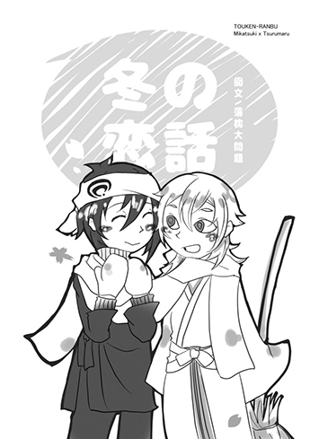

<figure>

</figure>

## 冬之戀話

　　說到冬天的話刀劍男士們會想到什麼？

　　雪人之類可愛的玩意兒清光很喜歡，本想做一個雪人給它穿上新撰組隊服，不過安定拿雪球丟他腦袋之後似乎就忘了這件事改玩打雪仗了。

　　物吉貞宗做了幾隻雪兔排在門邊，希望在天氣變暖前圓滾滾的它們可以給來去者有一點幸福的感覺。

　　冬天自有冬天的美味，負責廚務的刀往市集跑的次數變得頻繁，甜酒和火鍋的材料總是消耗得很快，他們都還不知道冬天比秋天更容易讓人胃口大開。

　　鳥太刀二人組從倉庫拖出來東西令大家眼睛為之一亮。

　　「我們的本丸有暖桌！」

　　今古刀劍都對抗寒利器這佩服不已，它溫柔地呵護皮寒骨凍的刀劍男士們，若暖桌裡的付喪神有感大概也會感到欣慰，暖桌可以在帶人上天堂亦能使人懶洋洋，除了用餐時間之外鮮能看到廣間擠滿刀劍男士，冬毛豐厚的小動物們也會對暖桌戀戀不捨。

　　「爺爺你可別在這睡到感冒啊！」堀川領令要跟和泉守一起出陣，雖然其他刀離開前叮嚀過鶴丸了，最年輕的後生晚輩還是忍不住想再提醒這滿腦鬼點子的老人家一次。

　　「知道、知道。」

　　冬天並不全是因為有這些小東西才感覺溫暖，當短刀們開始京都出陣、其他刀遠征開始後這個空無一人的暖桌似乎就沒有那麼暖了，大半身體被厚襖深深埋住的感覺讓鶴丸想起了一些事，在悄然無聲的室內悠悠地作了個白日夢。

　　這個夢沒有鶴丸想的那麼冷，明媚陽光照入大宅，鶴丸父親和還沒擁有名號的自己在這個地方受人善待。

　　鍛冶聲響不絕於耳讓他初入此地時不會怯生生地躲在父親身後，雖然眾刀劍高尚靈氣圍繞之下他顯得有些渺小，不過降生不久的他純真無畏反而在這裡結得善緣。

　　與眼中有月弓尊的那把刀並膝而坐，體溫相互傳遞的最後溫差消失彷彿融為一體忘卻寒苦，兩個刀神一起瞭望未被戰事染指的平安京，這幾乎是鶴丸所能憶起的刃生最溫暖之處。

　　「醒了嗎？」語調靜如止水的聲音平靜問道。

　　「醒了。」鶴丸睡再沉也認得出那個聲音，好夢被打擾鶴丸並不生氣只是他仍離不開地板，想到再往暖桌裡面縮可能會跟三日月的腳揪在一塊兒他只好把頭放到桌上去，「活都幹完了？」見三日月內務服未卻下，他猜想這老人家是不是又放下工作來偷懶了。

　　「完了完了，托鶴的福。」未有半分心虛之意，三日月氣定神閒地嚼著橘瓣。

　　「少來，我可是一直睡著啊。」

　　三日月不會解釋，他從庭院的小田地看到了這紙門沒掩緊的房間，走過來，一隻鶴正鬆羽歇息甚是可愛，放鬆無防備的模樣鮮少能見，陋室裡有幾樣三日月寐求已久的東西，只好勤勞點定心耕耘他才得以坐在這裡享用片刻寧靜不被外務打擾。

　　「似乎做了個好夢可能是因為三日月的關係吧。」鶴丸看不到三日月後腦飄落的五瓣櫻，倒是感覺得到桌面下厚實腳掌覆在鶴丸腳側親暱地來回磨蹭，跟剛才喚醒他的觸感有幾分相似之處。

　　「這橘子好甜，鶴吃不吃？」

　　吃了睡睡醒又吃，對老人家來說實在有違養生之道。

　　如果天下五劍要餵他當然吃，管它什麼養生。

　　甘甜果香在鼻前，酸味刺激著嗅覺，鶴丸咬上時略搔到了癢處，那橘瓣汁囊滿盈鼓脹、手感軟綿，鶴丸迷迷糊糊的沒咬好，齒尖不慎劃開了半透明的柔嫩囊壁。

　　「抱歉！三日……月……」汁液噴濺鶴丸自己一臉，視線有點模糊難辨他擔心把三日月也弄髒了。

　　「哈哈，不要緊，鶴才是臉上都黏乎乎的。」三月日幫鶴丸擦臉時取笑了他一下，鶴丸才心不甘情不願地挺腰坐好。

　　剛剛嚥下這一辦時舌尖也嚐到了三日月濕黏的指尖，果酸與人體的鹹味在鶴丸喉嚨深處轉化成叫人口乾舌燥的苦。

　　「要不吃點甜的？」一旁有點心籃給休息的大家自由取用，三日月沒見過那酒瓶型的洋菓子，剝開後依然拿來餵鶴丸，他就是想做到自己滿意為止。

　　「難得有酒心巧克力耶。」不管是美味點心還是三日月的笑容都讓鶴丸拒絕不了。

　　只是鶴丸的舌頭無法再更近，等身下的異樣感再次湧起時他才確定是三日月在作怪。

　　那隻不安份的腳緊沿著鶴丸小腿線條攀上、隔布摩挲，讓本來就很溫暖的半身驟熱起。

　　鶴丸想用另一隻腳把三日月撥開，抬腿一下結果害膝蓋撞到桌底還被三日月用腳趾扣。可恨三日月什麼都大他一點、力氣也是大他一截，到現在他都還沒嚐到酒心巧克力半口，控制不了涎液露出嘴角的狼狽樣就這麼被三日月看笑話。

　　而後桌底的雙腳開始放肆起來，粗壯拇指硬鑽入縫隙擠壓鶴丸的趾間處，腳趾並不像手指那樣靈活，鶴丸越掙脫反而交纏得越緊密，就算鬆腳三日月也沒有放棄在他處尋找樂趣，三日月別有用意地用指骨推壓鶴丸掌底湧泉穴，一陣酥麻電流疾走鶴丸下腹──

　　「老傢伙……你好像太得寸進尺了！」

　　「好，就不玩你了。」他承認那些都是玩心所致，要賠罪就如鶴丸所願，給就是。

　　一顆糖就能把吵鬧的鶴丸馴得服服貼貼也算是三日月的奇技。

　　指腹吸收著鶴丸口腔中的熱量，搔刮腔肉三日月覺得舒服，那個對誰都敢吐露狂言的舌，柔軟觸感每每皆能令三日月感到驚奇，巧克力融化後迷醉人心的味道絲絲繾綣附上唇齒隨著鶴丸的溫熱呼吸擴散，他的腳在下頭探到了鼓囊的兩瓣甚為愉悅，腳背順上所感受到的一弧與三日月微笑同樣顯彰。

　　見鶴丸肩膀後縮三日月機警地收手。

　　下一秒，無辜的暖桌被鶴丸掀得腳朝天，撞歪紙門、風雪入室。

　　「哀哉……」三日月反應不及，感嘆好好的暖桌和點心就這麼被糟蹋。

　　鶴丸拾起了滾落的酒心巧克力，包裝拆了往自己嘴裡塞為了要以牙還牙，鶴丸豈能忍受三日月把他搞得一蹋糊塗自己還一臉春風滿面、體面地坐在原處。

　　他們倆都慣吃和菓子，這種會隨體溫入口即化的點心對他們來說實為不可思議。

　　本來鶴丸被耍應該惱火的，大腦在甜氣的催化下被快樂因子佔滿思緒，滿腔砂糖甜鶴丸差點錯把撩動自己的舌也吞下，天下五劍的執刀之手尋求歡愉探下敏感的谷線時令鶴丸全身打顫，有別戰場給予敵人恐懼鶴丸感受到的是──安心。

　　被三日月勾了一腳他們的立場便上下顛倒。

　　「風光旖旎，甚好甚好。」俯視著櫻色簇擁滿月之景，三日月嘖嘖稱奇。

　　三条的石切丸常說三日月看起來沒那麼深思熟慮，常人無法摸透他的心思，一身神力鎮壓千軍萬馬在本丸卻是能為而不為，讓鶴丸不禁想問：

　　「滿足了嗎？」

　　「你說呢？」不論是指廣義還是眼下三日月都不明說，喜歡鶴丸來猜他心思，唯一確定的就是只要沒有鶴丸允諾他便不會恣意妄為。

　　鶴丸看這樣的三日月也頗為困擾，與其說是戀人調情，鶴丸反而聯想到了五虎退那幾隻想找人使盡玩耍的小白虎。

　　此刻颼颼冷風都把他的肩膀吹冷了，側過臉去，寒氣積凝諸如鎖骨的谷處需要一點溫暖。

　　「現在不抱就讓你後悔到春天。」

　　下弦月弧漸消弭，永夜瞳中顯新月。

　　「那鶴可別先啞了，不聞鶴啼春爺爺可是會寂寞的。」

　　終身刀劍，一夕成人，長生千年的他們都笨拙得不善言語，但可知互映身影的日月瞳中有情，熱能融指的體溫且有意。

　　人軀中心音驟響猶如四季如夏的鍛冶工房，錘鋼鏗鏘孕育新生，鶴丸讓三日月在凜冬裡想起的是刀劍淬火纏身的原初情熱。

　　(完)

## 一點也不像你啊(R)

　　戰場歸來的部隊成員身心俱疲，不管輕中重傷，溫暖的本丸總是能讓他們綻開一點笑容。

　　「橫陣、方陣……不選擇用有利陣形，鶴難道是舒適慣了變得不太會使刀了嗎？」

　　三日月說完，房紐被鶴丸從後硬扯，反正那秀髮濃密又能遮醜他才不管三日月腦袋會不會留印子。

　　「我、才、要、說──老頭子好好聽人指揮別亂飆車啊，你看你好好的三隊式神被甩到不知道哪條街是搞什麼東西！愛打結果還不是提早收隊！」力道沒有克制反被三日月腦袋後仰撞到流鼻血。

　　不過有兩人滿身都是硝煙臭，表情舉止都有火藥味，在同伴眼裡就是兩個老頑童在鬧脾氣，年紀大就會像那兩人那樣任性的話他們還真不敢想像自己活到千年的模樣。

　　「維護室在這……」小夜想把他們叫回來，可是他們胡鬧得太忘我就拐彎走了。

　　「就別管他們了，想維護就會自己過來的。」不用維護，大人還是有大人的治癒方法，只是燭台切他們不適用而已。

　　「媽──的！」

　　鶴丸的咒罵聲還是嚇到了準備進維護室的他們，不論是發生什麼事，燭台切盡力阻止大家好奇。

　　三日月硬生生將插在鶴丸身上的箭折斷，那一箭刺得很深，被這樣一用力直把他周圍皮膚絞爛，差一點連問候師祖的咒罵都要出來了，但他才不會因為疼痛示弱，手伸過去扯開三日月破爛的狩衣，肋骨下那高速槍造成的傷也好不到哪去。

　　「唔……！」鶴丸的手指直直戳進傷口來回撫，滲血又更劇。

　　「看吧？會痛吧？天下五劍最美一劍的漂亮臉蛋都崩了喔。」這點傷折不斷他們，鶴丸在近距離看他自己親手給三日月帶來的痛苦。

　　越痛越清醒，輕醒之後三日月收起了鶴丸賞玩的表情，帶慍怒的手力扯鶴丸的衣上金鍊給他一個頭錘，用力過猛金鍊斷裂跟刀徽一起落地。

　　「去你的，三日月！」接著那些咒罵被三日月一口堵回鶴丸喉嚨深處，「什麼、國寶嘛……嗯……就是個老流氓啊……唔嗯──」不甘心在唇分的時候多罵三日月幾句，不過他好像平常就這麼叫了，老流氓。

　　三日月沒聽進耳裡，一手撕了鶴丸的衣袖，專注地摸索著他的肩胛骨找那個箭傷，挖出箭頭的時候鶴丸很安分，因為被綿密的吻麻醉只有輕輕咬了三日月舌頭一下，喘息雖急促仍沒放開三日月的唇。

　　出血還好，三日月像用全身力量幫他止血似的，把他緊扣在懷裡。

　　老人家總是讓人費煞心思又不給他說，基礎治療學去哪了？

　　乖一點，三日月，鶴丸心裡唸著，邊動手卸掉自己的帶當繃帶給三日月用，做法不及格至少還是比三日月強。

　　額角的汗留下，鶴丸幾乎沒法睜開眼睛，剛剛那陣胡鬧之後身體漸漸綿軟無力，連口腔裡都變成三日月單方面在肆虐，肩膀以上都被三日月的吻所提懸，搖搖晃晃的腦袋落入他掌心，理智之地被指尖撩弄到頸椎發顫。

　　在心搏頻率最快的時候三日月停下吮吻卻下狩衣把鶴丸裹住，鶴丸舔掉自己鼻血也將三日月的涎液一併嚥進喉，見著對面欲求不滿的表情又忍不住湊上去。

　　鶴丸知道自己皮肉單薄容易敏感，所以當三日月在舔吮他眼皮，痠楚和快感同時朝他心窩揮鞭，下股被一條腿強行頂入，三日月輕易地把他整個人提起，但開門入房第一件事就是把他摔在地方，若要起身還會被按回地上，三日月擅長刺激他情慾，跟挑動他的怒氣一樣擅長。

　　「不滿嗎？」背光之中只見兩輪新月高掛，支配長久支配暗闇的威壓感在三日月傾身時全壓在鶴丸身上。

　　「廢話！」稍微使勁鶴丸才蜷起單膝擋住三日月，「累死了、痛死了，你他媽的根本就是要殺了我，去年的溫柔穩重和珍惜是餵狗了嗎？這可一點都不像你啊，小心我把你揍回爐裡重鍛一次。」能抱他的只有三日月宗近，用他弱點威逼自己的傢伙才不是他心愛的戀刀。

　　那些謾罵不足以阻止他但是有點吵耳，手指往鶴丸的嘴伸馬上就被咬了一口，剛好證實鶴兇起來堪比猛禽，不過鶴丸的兇性他總是有辦法一一馴服，至於憑什麼？

　　他們手邊可沒有緩解交合的潤滑劑，待會兒會痛得四分五裂的可不是他。

　　「王八蛋……！」鶴丸不滿地深含三日月帶有腥血的手指直到他滿意。

　　「毫無能耐又滿口穢語的鶴真是不像話。」

　　收回手後三日月的擴展也沒特別手下留情，抽動猛烈令鶴丸直打哆嗦，他的袴已經濕潤得擰出水血。

　　鶴丸側翻甩手把三日月的頸子壓下來，「我本來就是這樣，你甚至可以邊說我下流放蕩，然後繼續執著這淫亂的身體啊。」他在三日月耳畔邊的宣言確實有一點用，下腹的痛苦有稍微舒緩──

　　一下下。

　　霎間下半身就被三日月單手提起，猝不及防地叫出聲後全身在硬火下淪陷。

　　「傻瓜，都有人身那麼久了要照顧後生晚輩啊……貞坊才剛來，新人就是要疼，你想害我被光坊和伽羅坊怨恨嗎？」心臟還沒吐出嘴前鶴丸得澄清，雖然先前說了點大話他還是希望三日月眼裡得自己沒有失去光彩。

　　那感情名為嫉妒，總是在三日月的心中來來去去。

　　他們兩振千年的經驗相差甚遠塑造出兩極的性格，鶴丸同伴意識強烈，能周旋於人類與任何刀之間，三日月擔心鶴丸太像人類的話遲早會走到他觸手不及的地方。

　　「鶴……你在笑嗎？」躺在他臂彎裡的鶴丸露出個似笑非笑的表情，他不解其中意思。

　　「你該看看自己的臉。」鶴丸勉強撐起身子坐起，儘管會弄疼自己股間他還是想靠近點，與三日月唇谷點點廝磨，「不用道歉沒關係，但是千萬別內疚啊。」

　　彼此額頭相依，除了體肌之外他們的心應該也是相映相輝。偶爾吵一次固然有那麼點意思，不過他們擁有人身意非在使性子時互相傷害，直到回歸本體的那日前，他們是為了不讓刃生帶著任何遺憾而活的。

　　「抱歉啊，鶴。」

　　「我話才說完耶，非要這樣嗎？」天下五劍開金口了，他不收下這道歉好像也有失禮數。

　　「爺爺帶鶴去維護吧。」三日月拉拉墊在鶴丸下方的狩衣，大小剛好可以把鶴丸打包起來。

　　「慢慢慢慢……等一下！」退出寸前騷得鶴丸裡頭一陣酥麻感亂竄，「做完吧，我想做完。」三日月又恢復成那個天然的三日月他反而有點難為情，可是負傷還體貼他的三日月讓他心癢癢的。

　　「鶴剛才不是才喊累跟痛？」很明顯鶴丸已經虛脫，如果鶴丸是想被弄得站不起來，那也是要等有力氣站了三日月才有辦法把他再弄到站不起來。

　　鶴丸湊近親吻，三日月覺得奇怪還摸了一下自己唇上是否有沾到什麼，否則不長也不短的吸吻怎麼會讓鶴丸飄出櫻吹雪。

　　若要問為何，鶴丸要是不疼三日月的話就一點也不像他啊。

　　（完）

## 未卜先知
>占卜巧克力還挺好玩的（在京都買過

　　「三日月，吃過甜點了嗎？」

　　「沒。」三日月說完也給鶴丸上了一杯熱茶。通常下午就會見到三日月在房前曬曬太陽品茶點，難得一反常態倒讓鶴丸覺得稀奇，「因為不是吃甜的，今天從光忠那拿到的小雞燒……是鹹的。」

　　賣了點關子想給鶴丸驚喜，小雞燒包裝紙才拆了一點就被霸道的鶴整個搶去祭五臟廟，三日月嘆鳥類何苦為難鳥類。

　　「今天換吃點洋菓子吧。」鶴丸扔了一紙鋁片給三日月，上頭包著繽紛小糖球看似人類服用的藥錠，說明文字卻叫三日月困惑，「占卜巧克力，物吉和主上去萬屋帶回來的。」

　　每顆巧克力糖球代表一個占卜問題，糖球擠出來後面有圈叉三角的小記號表示運勢，雖然作為點心可能稍嫌不夠意思，不過能品嚐到不同趣味何樂不為。

　　「金運、友誼、戀人、結婚……原來這些小字是這意思。」三日月笑道，「設計如此高妙，到底是出自哪位陰陽師之手呢？」

　　「陰陽寮不做食玩啦！」要是每次都要吐槽三日月鶴丸只靠一張嘴恐怕嫌少。見到三日月發覺另外註解的小字時鶴丸露出詭笑，「我稍微把它改良了一下。」

　　小至五官大至胸與手足等等，油性筆的字跡寫著身體各部位的名稱把原本的字蓋了過去，尚有幾個敏感的詞彙勾起三日月其他心思，他好像能猜到是什麼用意只是還是得等鶴丸親口說才算數。

　　「叉叉的話就是今天都不能碰的意思。」

　　三日月掩袖而笑，乍聽之下確實是大賭注，但天下五劍之名之於三日月宗近，有什麼挑戰他會怕的。

　　一擠就是兩三粒入口，糖球雖豔三日月感覺味道確實也不壞。

　　袖下手動作甚快鶴丸根本沒看到鋁紙上的記號，或者說三日月根本沒有注意上面寫了什麼，樂趣被不解風情的老人家破壞鶴丸當下是有些失望。

　　當三日月扭頭過來舔咬鶴丸耳朵時完全出乎鶴丸的意料。

　　溫熱又帶著甜味的氣息襲上，甜得鶴丸也像是吃了巧克力，耳畔被黏膩水音填滿，現在他感覺自己倒成了融化在三日月舌尖的那顆糖，裡外全被三日月的舌蕾舔透，在融化其中前臉頰上一個生澀的親吻把他喚回現實，銀白髮尾纏著三日月指頭，那金弦月、墨長睫，與三日月的一笑齊彎揚之時鶴丸的心神又開始游離。

　　「這可有趣了，爺爺沒怎麼碰過鶴的神體呢，給我點時間想想。」

　　原本只是寫來充數的項目被三日月點出來，鶴丸不知為何有難為情的感覺，越想否認看起來越像是欲求不滿，鶴丸只承認最近沒有有點寂寞有點無聊想要三日月陪他遊戲，現在反倒是他被三日月耍得團團轉。

　　「怎麼了？」三日月看那似笑非笑的表情好像有心事暫時停了下手。

　　「不是……三日月，我們不能每次都這樣。」他們有多麼在乎對方已經無須言明但有個小小的後遺症一直困擾著鶴丸，「我喜歡跟你在一起，就算跟你一起發呆不做任何事也喜歡，可是我們不能每次最後變成滾床單，這樣的話我……我會不知道還能跟你做什麼。」

　　三日月笑了，來不及以袖掩口，嘴角歪歪扭扭的靦腆可能不太符合日之本國寶應有的高尚儀態。

　　有個一直想著自己的戀人對三日來說就是最大的幸福。

　　他最想做的就是盡情觸碰不再拿捏分寸，將國寶與御物名號拋到九霄雲外一貪絕美快感。

　　「非也，是鶴誤會了。」吃掉了最後一顆糖球後三日月將鋁片遞給鶴丸，他相信鶴丸會懂自然就不會安安份份地坐在原處，三日月把鶴丸放倒在木廊上，只是在一旁看著鶴丸什麼都不做。

　　鶴丸確認了一下鋁紙上的記號發現三日月真的沒唬他，十八個項目裡只有三個是圈圈剩下十五個都是雙圈。每次有一點點不安的時候他就會變得敏感反而是三日月都保持沉著，不會讓他的問題得不到答案，事實上那個食玩他一顆都沒有嚐，雖然知道這只是無關要緊的小玩意兒他還是希望運氣和三日月都站在他這邊。

　　「……去他的，給我過來。」

　　用力扯了三日月的房紐，鶴丸舔舌潤唇親吮三日月口中的餘甜，攪入涎液翻拌成蜜佐白身，最後橫豎都會變成三日月的紅燒鶴點心他傾向先餵飽自己再被三日月吃掉。

　　(完！)

## 特效藥
>原稿找半天，原來這邊的檔案標題是老老介護XDD  
>確實是萬聖節短篇喔

　　「繼舞草鍛冶之後我等登上平安舞台，山城三条小鍛冶刀工名震四方，幾重玉鋼堪比華族金銀，豪腕日鍛月鍛火花飛散，千錘萬煉奔流鐵水飛濺……」

　　「很吵啊，鶴。」

　　三日月僅僅用四個字打斷鶴丸一大串絮絮叨叨，天下五劍正聚精會神地用放大鏡檢視藥瓶上的小字。

　　「人身好麻煩啊──咳咳咳咳！」明明三日月的老人病也不少反而是鶴丸先染上了風寒，「三日月、三日月你聽外面！咳嗯！都是小鬼們和樂融融的笑聲，今天是可以奇裝異服、揮灑稀奇古怪主意的大好日子，老子是『刀』耶！怎麼會栽在感冒手上然後枯坐……咳！」

　　他就是放不下別具心裁的南瓜雕刻活動，不僅自己沒留下半件大作，喉嚨更是痛得不能放縱品嚐那些甜鹹油炸，臉上生理淚替他訴說自己的傷心欲絕。

　　「都是鶴平常在做的事啊。」三日月不以為意，抵抗鶴丸扳他脖子的雙手不成用了頭巾金蟬脫殼他才能接著看服藥方法，「日語好難哪。」

　　「咳，日之本國寶說出這種話我想國家也快完了……」拿藥瓶過來看，鶴丸一下就看清上面寫了什麼，「飯後十西西，就這小杯一個刻度的量吧。」鶴丸對現代的感冒藥不抱什麼期待，不如直接昏睡到天明把萬聖節忘了比較痛快。

　　「有股怪味。」因為鶴丸鼻塞只有三日月有感覺，不似漢方藥的甘苦透進人軀時三日月有種氣管與肺腑皺成一團的古怪錯覺。「試試味道？」

　　「就直接喝了還試──唔！」

　　三日月將沾了藥水的指頭抹在鶴丸唇谷，鶴丸舌尖也不經意地碰到了一點，點點褐色液體在味覺掀起驚濤駭浪令鶴丸顫慄，所知的世界為之變色鶴丸愕然地含著三日月指尖呆坐原地，久久沒有其他反應。

　　「要喝十西西。」

　　聽到關鍵字鶴丸面有難色地退到了角落。

　　「以前可從來沒有這麼恐怖的東西也能痊癒啊！人類只要有嚼草根的力氣就活得下去啦！所以、所以──咳咳！」

　　所以快把那東西扔了，三日月！

　　「你必須快點好起來。」現在三日月只要有一點動靜都會讓鶴丸炸毛。

　　「不要──我不要啦，求你了三日月！」

　　聲聲哀求之下三日月確實停下了手。

　　彷彿看到往昔情感豐富的小白鶴，紅撲撲的面頰上掛著斗大淚珠，每一次的分離都叫人提心吊膽，他們緊緊牽著彼此，不管三条師傅如何斥責自己傲慢固執三日月都陪著鶴丸直到他滿意為止。

　　三日月只是懷念，千年之後他們早就不一樣了，個性的稜稜角角經歷歲月打磨後也會變得圓滑。

　　「你想被我傳染啊？」鶴丸被三日月抱上大腿，明明需要看照的人是自己三日月反而向他撒嬌了起來，「咳，嗯哼……其實你可以用其他滾燙的東西代替那玩意兒。」不忍說那老氣便服下的寬闊身板總是能讓自己安心和放下脾氣，更甚就是心神會游移至他處。

　　「鶴還在咳嗽。」弦月月鋒的悄然隱於眼下不為人知，「子胤的話應該放進你的腹中而非弄得到處都是。」三日月的意思被鶴丸當作欲拒還迎，鶴丸因此使盡全身力氣擠弄三日月的大腿根部。「看來我應該拿坐藥來會比較好。」

　　「原來你是認真的啊，真沒意思。」

　　那嘆氣只是一瞬。

　　鶴丸看清楚了三日月的一切動作，如沐春風的微笑下，三日月扯鶴丸的力道之大全現於手上浮筋，仰頭望月、小杯一傾，比劣酒還要不得的飲物灌進了鶴丸喉嚨深處猶如飲蠟般難受，濃臭的氣味在他腦中引爆，氣力流失、眼淚潰堤，像是要將全身體液榨得一點也不剩。

　　這是另一種鶴丸無法理解的暴力，隨之而來接觸卻又溫柔不已，味覺被蹂躪後任何液體皆可為甘露，滿腔愛慾融入滋滋水聲，三日月對必須有所保留深感惋惜最後只留一絲憐惜於鶴丸側臉。

　　「審神者說我們得學會互相照顧。」三日月給鶴丸拭去淚涕，「如果我哪天也有病痛，我想給鶴照顧。」

　　「哎啊，一千年後你肯定還是一尾活龍。」嗜睡成分起效於是鶴丸爬進棉被裡，「再說黏著三日月可是我的特權，怎麼可能拱手讓人。」比起自己感冒，看到三日月小喘小咳他會更難受。

　　三日月拍拍棉被大福時早沒了動靜，裡頭隱約傳出了舒適的呼嚕聲。

　　鶴丸已經沒有機會在派對上大肆熱鬧一番，為了讓鶴丸不會全沒收穫，三日月把自己的微薄心意放在床頭，不懂洋人習俗的三日月聽說糖果和南瓜雕刻是這個節日的重要象徵，便在萬屋買的丹頂鶴造型和菓子。

　　放下親手雕的小型大日如來像，三日月對它合掌一拜。

　　「不知道鶴明天起來會不會嚇一跳？」

　　如果可以，他想告訴他高貴的女主人自己現在很幸福。

　　(完)

>- 三日月接著就去廁所了(?)
>- 想到鶴丸隔天起床會大叫覺得很可愛♡

## 幕後獻吻勝幕前掌聲(架空世界觀)
>- 參加LOF企劃時寫的
>- 這是[@椒为](http://www.lofter.com/mentionredirect.do?blogId=491482504)太太主催的[Gorgeous Feathers ——三日鹤中心同人文色彩十五题](http://liuliuliutiao.lofter.com/post/1d46da8a_bb2b501)  
>- 選定題目是「綿延的朱紅色」  
>- 魔法師三日月x 魔術師?鶴丸  
>- 戰後背景 是HE!

　　三日月宗近這人嚮往心靈上的寧靜，戰後決定遠離兄弟低調地生活，長期受人照顧忽略了物質的需求讓他在離家初期吃了不小的苦頭，對家人發豪語時義正嚴詞後來有一段時間覺得自己很不明智，然而看看他現在，每日皆會梳理打扮和正裝出門，順著人潮方向走去那些世俗氣息濃重的地方。

　　「你變得真多啊。」岩融找到三日月為他留的位置，顧慮到他的身高選了劇場的最後排，表示三日月的心思還有在他們兄弟身上。

　　「家族有事要傳話？」

　　「沒有，只是過來看看你好不好，還是你比較想念石切丸？」

　　「看到你我也很高興。」聽到石切丸的名字三日月一時嚐不出嘴裡的爆米花味道。

　　視線往下一看，三日月把爆米花盒遞到他眼前要他自己拿一把，而岩融一掌就是拿半盒，「真是奇了怪了，你居然對這些玩意兒有興趣？」

　　這個劇場是自由表演的場所，只要交易場地租金跟少許門票抽成便能擁有自己的舞台，每次的日程皆大不相同，不過一定都會包含音樂、戲劇和雜技演出，並不只會招待華族人士，三日月和岩融的四周也有來自貧民窟的孩子，場場表演皆有不錯的反響，夢幻如童話的氛圍在戰爭之後慢慢發芽撫慰人心，連岩融也很訝異有這麼樣個地方。

　　由於三日月只等一場魔術表演，他就沒有特別去記其他的，而他等待的那一場開場也擁有最多的歡聲，一整天下來看著紅色帷幕一次又一次地被揭開，表演的聲勢如無盡的波瀾般絕對不會有起伏一致的浪頭。

　　沒有任何安全裝置，黑色獨眼的紳士與純白的紳士自二十米圓形舞台躍下，本來就不小的掌聲又再更大了些。

　　「看起來很樸素啊。」岩融第一眼只注意到他們的優異體能和打扮，和前幾場耍戲的相比黑白襯衫真的一點也不華麗。

　　三日月食指抵在唇間示意他繼續看下去。

　　黑色紳士因為沒有好看的配件感到困擾，他倆走下台給數十名觀眾發了紙筆，希望有人設計黑帽白帽各五頂，岩融也拿到紙畫了一頂禮帽，黑白紳士兩人到台上展示回收的帽子圖畫。

　　軟紙張在黑紳士手裡翻轉一圈，憑空變出一頂設計一模一樣的。

　　白紳士也不甘示弱把紙折了又折，再攤開後竟是一頂女仕用的寬緣帽笑壞觀眾。把帽子圖畫全部實體化，他挑了岩融畫的軟帽披，因為旁邊有繩子可以讓他閒得發慌的手指打發時間。

　　「這還真是厲害！莫非他們跟我們同族？」岩融剛剛看表演專心得嘴久久沒闔上不自知。

　　「他們是很普通的人類喔。」三日月說。

　　白紳士的軟帽下面有東西在鼓躁，他伸手往裡頭掏了好一會兒，把搜出來的東西全丟給他家黑紳士，鴿子、兔子、彩旗、小瓷盤、桌巾、空砂糖罐、茶罐……好像帽子底下是個無底洞似的。終於掏到沒東西了，他摸摸軟帽拉出一對白長的兔耳朵令女性觀眾們大讚可愛。

　　舞台上方落下一張木桌嚇了黑白紳士一跳卻又覺得時機正好，桌巾可以用得上，瓷盤擲上桌上頭正掉下一個茶壺搭一組，放著砂糖罐自然就有幾顆妥妥地從上掉進去，配上點心看起來會是個快樂的茶會，遠看很小，拿近卻突然變很大的茶杯裡面有另一個孩子竄出來打招呼。

　　「是瘋帽匠、三月兔和睡鼠啊。」看了這麼多場現在這一齣三日月也沒見過，不過他看得很高興。無聲的表演依然能讓全場有笑聲，即使是外地人不須費心也看得懂，茶會請了小觀眾上台互動還讓岩融很羨慕。

　　他們確實沒有其他表演者華麗，可是這樣無縫隙又靈活的魔術已然是無可挑剔的演出。

　　「噶哈哈哈──有趣有趣！下次我也帶今劍來看。」

　　「他一定會很喜歡的。」

　　俗話說高浪能打出美麗浪花，憑著這一場的熱烈氣氛，謝幕時紅幕只是半降激起歡聲雷動，三日月認為不只是表演有意思，那些帶著些許笑意的嘴又笑得更開不為是一種令人激賞的魔術。

　　「已經散場了，你不走嗎？」要走的時候岩融看三日月還坐在原位。

　　「我與人有約，你先回去吧。」

　　兩人就此別過，三日月一直看到燈光暗下劇場回歸寧靜，劇場的管理人也就是最後一組表演者們出來清場跟整備，他們都認得三日月，眼神交會時也會點頭致意一下。

　　三日月前排座位探出一對兔耳朵來回折了折，方才表演的兔子蹦上那個有較大兔耳的白腦袋，嘴巴動個不停的模樣可愛得三日月也想伸手去摸，原本還伏著的頭突然升起來攔截三日月的撫摸，童心十足的笑顏跟那團毛茸茸的小動物一樣療癒，指尖彷彿在那份觸感中融化。

  
　　＊

  
　　「魔術只是比較有品的詐欺手法而已。」

　　「看來你對魔術有偏見呢。」

　　繼岩融之後石切丸也來探望三日月，聽說三日月每天都來就一樣在劇場裡見，雖然岩融對三日月的我行我素很寬容石切丸可不會。他配合觀眾一同鼓掌，說話毫不客氣卻還是知道要給人家一點面子。

　　「他們會掛著我們的名號把我們的信仰名聲拉低。」

　　三日月拿起傳單左看右看，上面沒有寫道半個關於「魔法」的字眼，「我想他們在正名這方面做得到是不錯，不過魔法是『神秘』，為什麼需要名聲呢？」

　　石切丸說一句三日月就回一句，儘管兩人個性大不相同，兄弟都好惡分明這點倒是挺像的。

　　「你是看上了哪一個孩子嗎？」石切丸瞥了一眼三日月擱在腿上的薰衣草花束，就他對三日月的印象他根本不懂浪漫，如果是要獻花花束的選擇也很怪。

　　「這是跟賣花的孩子買的。」

　　懶得去猜三日月是什麼心思，石切丸把注意力放回舞台，「是那個獨眼的高個子還是生澀沉默的青年？」

　　「不是燭台切也不是俱利伽羅。」

　　「那個活潑有朝氣的孩子？」

　　「也不是貞宗，你是知道才故意最後說吧？」在紅幕下最吸引人群眼光的那抹白便是三日月在意的人，「那就是鶴丸。」

　　他們今天跟動物助手表演，四個人一起養了不少白色動物，乍看之下普通的飼料讓牠們吃下，動物的白色毛髮就會不可思議地染上色彩，觀眾親手餵食也一樣，眼睛再尖也找不出魔術機關在哪裡。

　　鶴丸和他養的白孔雀搭檔很久了，白孔雀的脾氣有點頑皮喜歡跑給人追，三個人都告了段落鶴丸還被牠耍著玩，就算抓到了也不想吃，鶴丸吃給牠看反而是自己一撮頭髮染了金色。

　　石切丸嘆氣。三日月確實會喜歡這種傻里傻氣沒心機的個性，難道這就是所謂的同類相吸？

　　「總覺得那孩子給我很不好的感覺。」他對鶴丸的方向身手感知，說不上是哪裡古怪，但家族中不會有人懷疑石切丸的感應力。

　　「我看他表演一年，認識一年多，目前都沒有什麼異狀。」三日月用報告似的口吻回石切丸，他差點被自己的無趣噎到窒息。

　　「你啊，與其把時間花在這不如回家裡看看，父親為你繼承的事急死了，難道家族對你一點都不重要嗎？」

　　來了來了，又是這家族一檔事。三日月就是因為不想聽大家對他嘮叨才一個人生活，如果只是靠長幼繼承順序的話今劍就能擔下族長之職，這年頭大家倒突然重視起了法力的內涵。

　　「我們將獵魔勢力打得潰不成軍又簽了和平協議，大家順心過日子也快活啊。」

　　「跟紙一樣脆弱的和平。」石切丸對那樣的東西不予置評，「我們貴為首席家族卻因為戰爭損失最多，後面序列的家族察覺此事已經在躁動分派了。」是故他們需要與強大家族聯姻，而三日月將是他們家族所釋出的最高誠意。

　　「如果我是族長的話……」三日月拾起一粒沒爆開的玉米，試著指間加熱想爆開卻把它燒成灰，「我會殺雞儆猴不留一丁點情份，族長的命令應是絕對的，和平這事當然不能只靠協議，但聲稱自己有多無害隱世的魔法師心存惡意去挑釁他人，受到迫害時再裝無辜又是為了和平努力了多少？就這一點來看我們族人和人類劣根性是沒有區別的。」

　　對於三日月的話石切丸也無法反駁。

　　「我們為了家族付出在我看來犧牲卻不曾減少，所謂的家族利益也與我們無關，鬥爭時皆為彼此的絆腳石，危難之際才搬出家族道義，既然個體意志一點都不重要，我想自然也沒有所謂的重視與尊重了。」

　　三日月的能力絕對是頂尖的，魔法師們力有未逮的事太多，而他是辦得到的事太多，可想而知有求於三日月的情況絕非因為他的為人，就連石切丸走這一趟也是為了說服三日月能者應該要多勞。

　　「戰後才短短幾年你變得還真多。」看來三日月不想繼承的事心意已決，石切丸只有苦笑的份。

　　「你把它看作是好的變化就更好了。」

　　「那麼討厭變化的傢伙都穿起了西裝懂得打扮，說高興只有這點我比較高興。」以前石切丸回想光是要洗三日月的破爛袍子都會發生家庭革命，不知怎地被其他家族誤以為是兄弟爭奪繼承權，還得在大家面前舉行一個握手言和儀式，因為太糗了至今一直都是秘密。

　　「這套是鶴送我的。」

　　「……也是，你一直給他捧場嘛。」有閒錢和時間的三日月對劇場來說算是貴客了，石切丸認為這合情合理。

　　「不，他常給我免費的招待票啊。」三日月困惑的表情彷彿頭頂頂著一個大問號，「主要是因為鶴喜歡我吧。」

　　「喜歡這麼沒神經的你嗎！」忽略對象本身喜好，石切丸更質疑社交能力近乎零的弟弟到底是哪來的自信。

　　紅幕再一次落下，三日月可惜沒能好好欣賞每個精采瞬間，而石切丸在談話後只感到一陣疲憊。三日月一樣對石切丸說自己後面還有約會請他先回。

　　「三日月！」

　　只是三日月從來沒對兩個兄弟說是跟鶴丸約會。

　　鶴丸迫不及待地跨越一排又一排的座位，顯然他的動物助手們都知道走樓梯比費事爬椅子快。他氣喘吁吁地來到三日月面前，三日月要他先別急著說話。

　　「辛苦你了。」三日月將鑲著蕾絲邊牛皮紙的薰衣草花束遞到鶴丸眼前。

　　金瞳眨了眨，鶴丸嘴角漾開的笑容都快到了側臉，「謝了三日月，看起來好好吃的樣子！」

　　「哈哈哈，鶴的想法真是與眾不同。」

　　「因為光忠做過薰衣草點心啊，全都好吃極了！」從泡茶到蛋糕讓鶴丸難以抉擇，不管哪個他都喜歡，「所以、跟門口的孩子買花的大哥哥就是三日月吧。」

　　鶴丸認識賣花的孩子，因為這種叫賣生意很難做不太能看到那孩子進來，表演完後他們小聊了一會兒，聽說有一個俊美的先生買了全部的薰衣草，他還用表演的招待票支付包裝費，如此一來今天就有進帳還可以讓自己歇口氣。

　　三日月神祕地笑了笑，覺得這般美事不要說出全部真相也挺好的。

　　「站著別動喔。」鶴丸十指靈活地動了動，結果他不是要變魔術只是輕輕地抱上去，「有你真好，你一直都在我身邊真好。」

　　那種青澀感有時也會讓三日月感到害臊，不過還是覺得鶴丸可愛居多。他伸手摸摸鶴丸的頭，鶴丸身後猛地炸出一把孔雀羽毛叫他吃驚，孔雀開屏這一手在他們兩初相識時他也見過，鶴丸在清理劇場，拿著掃把盯著他看然後炸羽毛。

　　鶴丸像隻求愛的鳥兒不斷送小禮物、用各種小花招讓他驚喜，那時鶴丸只是摸了幾下他的身體就變出一套合身西裝，之後他一定都會在見面他們時穿。

　　「你等我一下。」鶴丸將藏在身後的白孔雀拎出來放椅子上，雙手搓著搓著就憑空搓出一條繩子，把它在三日月脖子纏幾圈打結突然變成跟三日月瞳色合襯的領帶。

　　「你每次都有驚喜給我呢。」禮物可以用很普通的方式送，鶴丸卻老是喜歡變魔術，但三日月摸摸領帶緞面，看起來不像是商店貨，上頭有一小顆星星的設計又不會太俗氣。

　　「我自己做的還不賴吧。」手巧得製作魔術的所有道具，鶴丸就是有這樣的能耐，「月亮要有星星配啊。」他指著三日月那雙漂亮得想寫首長詩讚美的好眼睛。

　　除了這身衣服之外，三日月大概領帶也暫時不會換下了。

　　「今天要做什麼呢？去把舞台的布幕拉下來放電影？還是要看看我做的星象儀？」

　　「不，就什麼都不做吧。」果不其然，原本還興致高昂的鶴丸露出了被澆了冷水的表情，「這也是不錯的嘗試。」

　　不管是哪一個都會把那片紅幕遮住，現在鶴丸就在自己眼前，大得以埋沒視界的紅色襯著純粹之白，一舉手投足皆有美妙言語，如同三日月學習與魔法對話那樣，理解自己對鶴丸的感覺和參透宇宙奧祕同樣令他興奮。

　　「是這麼說沒錯……」鶴丸自知每次表演完體力很快就見底，看個電影會倒在三日月身上流口水，吃東西容易分心到處掉屑，他不禁在想是不是被三日月嫌棄。

　　三日月幫忙把隔壁幾個座位扶手收起來，空出鶴丸可以躺的位置，拍拍自己大腿催他。

　　鶴丸戰戰兢兢地放平身體，上半身斜了一半他家一窩貓狗鴿兔全踩了上來，趕了好久才讓牠們統統下去。

　　「哈哈哈，牠們想照顧你啊，你被動物愛著呢。」

　　「是甜蜜的負荷啊，雖然我覺得牠們比較親近伽羅坊。」躺平瞬間白孔雀重重壓在鶴丸身上，他差點沒把內臟給吐出來，白孔雀還在他踩了幾腳喬個好位置舒適坐定，「三日月，你唬我……」

　　鶴丸想發個牢騷，不過三日月也沒見他把白孔雀趕下去。

　　他們養育的動物助手皆是成雙成對，只有牠是一隻孤鳥。

　　「好孩子。」三日月摸摸牠。他認為牠識人也有靈性，魔法師都喜歡這樣動物做使魔。

　　「我呢？我呢？」

　　「乖。」

　　儘管跟動物的待遇差不多，鶴丸討到了一個摸摸心情很好。

　　「好像偶爾這樣真的也不錯呢。」脫下手套和背心時鶴丸悠悠地想著，不用顧慮室外陰晴抬頭依然能見著雙新月，今晚沒有娛樂好像也沒什麼損失，只需安心地枕在三日月腿上待舒服的睏意慢浸每吋神經。

　　闔上眼皮，不稍一會兒鶴丸就在三日月有節奏的撫摸下睡去。

　　三日月不會因為有哪個魔法特別強大就推崇它，他所知道的魔法師大多都是施放出效果超群的魔法就會沾沾自喜，然後把它當成了不起的事蹟對此大宣特宣。

　　只有釋放能量卻不能收束的魔法絲毫沒有細膩的美感，除了浪費星球的資源外連誦咒也在浪費空氣。

　　仗著它之名的暴力卻把一切染紅，魔法的美在戰爭之時蕩然無存。

　　魔法本身自有一套循環規則，猶如美麗的歐拉恆等式，所有虛幻之物加上魔法師這一存在後完美地展現魔法之美接著仍能收斂回歸靈流，不著痕跡地繼續徘徊在每個人身邊。

　　這便是魔法師的信仰，真正的魔法中有和諧與平靜，三日月在鶴丸身邊時不可思議地有這般感受，在表演的帷幕落下與掌聲之後一切紛紛擾擾皆會歸於祥和，放下批判的心回到自己該回去的地方，即使和平只是虛像的事實眾所皆知，這份感覺也會一點一點讓它變得充實。

　　鶴丸在睡夢中嘴角下陷揚起可愛的弧度，他待在三日月一點也不會覺得哪裡不安。

　　三日月從鶴丸身上感受到的絲絲悸動累積下來，已經是其他東西難以取代的份量，他們之間也有某種特別的東西在彼此間流動，讓三日月一直想告訴鶴丸他珍惜鶴丸遠勝過鶴丸對他的喜歡。

  
　　＊

  
　　自從戰事結束之後三日月就離開故鄉自己租了一個小套房過著簡樸的生活。

　　從不需煩惱存款問題的他還是找了個可以在家辦公的寫稿工作，雖然前一晚只睡了四個小時頭髮亂得像是被轟炸過一樣慘烈他依然逼自己起床盥洗，將那套寶貝的西裝燙得挺直，因為是珍貴的東西自然就學會了怎麼善待它。

　　早餐時間讀報之後就翻一下魔法典籍，如果把它們當作興趣偶爾翻翻其實還算有趣。

　　「我出門了。」

　　他著裝出門要去寄稿子，握著門把時想了一下回身跟無人的房間如是說。

　　物品震動、燈火自燃明滅，好像真有什麼東西在回應似的，普通人看不見但確實充滿整房間。

　　扭開門把走出一步，三日月後腦瞬間被其他東西猛地衝撞了一下，裝著稿件的牛皮紙袋落地，他則是眼冒金星後腦生煙，根本想不到這麼生猛的玩意兒只是枚戒指。

　　「哀哉……」三日月吃痛地摸摸腦袋，見戒指自己豎起要滾走他趕緊拾起那個鬧彆扭的小東西，「可以可以，就一起出門吧，記住要低調點。」把它戴在手上後當真乖得跟普通戒指一樣，大概是因為太久沒到外面去，它今天把自己的孔雀藍寶石光弄得特別亮眼。

　　三日月一路與鄰居打招呼走去郵局寄件，找電話亭通知一下出版社，這個月份的工作就暫時告個段落，剩下都是他自己的時間，他買了三明治去公園坐下獨佔一處風景優美的座位配午餐，放空心思計畫接下來的行程，有時候他很羨慕懂得消磨時間的人們，三日月目前也把它作為小小目標努力中。

　　接下來他就移步去劇場窗口買票劃位。

　　「午安，貞宗。」三日月向窗口的孩子打招呼，彼此都不是生面孔對方也禮貌回應，「一樣買今晚表演的票。」

　　「關於那個啊……真的很抱歉呢三日月先生，票已經賣完了。」太鼓鐘攤手表示無能為力，總是很精神的眉尾沉沉下垂。

　　「你們的表演真的令人激賞，不過，你們都很不擅長說謊呢。」原本他心情很好的，現在仍舊掛著笑容但明顯失去笑意，他不知道有什麼理由要被這樣對待。

　　太鼓鐘把窗口打開，半身探出外頭，「今晚鶴丸不會表演只有我們三人，就算票還沒賣完我也不可能會賣給你。」他眼睛沒有看著三日月，說話低沉冰冷得感覺不到童音。

　　眼球翻上視線與三日月相對時，三日月覺得自己像是看著沒有靈魂的機械，彷彿下個瞬間什麼事都有可能發生。

　　「鶴還好嗎？」太鼓鐘的古怪狀況固然令他擔心，可是他最在意鶴丸那邊。

　　「三日月先生不用操心。」金燦燦的眼瞳眨了眨，太鼓鐘才恢復平時的神情，「今天你先請回吧。」

　　「……我改日再訪。」

　　他很堅持，好好地堅持到三日月願意退一步離開後整個人攤在售票窗口不想動。

　　買日用品的俱利伽羅回來看到癱軟的太鼓鐘先是給他摸摸頭安慰一下再把他塞回窗口裡面，「辛苦了。」他撈出紙袋裡一瓶牛奶當慰勞品，手伸進窗口裡再摸頭一次，「國永有光忠照顧不會有事的。」

　　「我知道……我當然知道。」太鼓鐘喝起牛奶像買醉的人豪飲似的，「鶴丸太喜歡那傢伙了，害我沒辦法華麗地大鬧一場啊！」他對吵架幹架都很有自信，只不過三日月是個明理人，明明可以強硬點卻會為了鶴丸退讓，這種處境讓他更為難。

　　「我認為你做得很好。」鶴丸突然倒下已經夠麻煩的了，與其鬧得一發不可收拾還是審慎處理比較好。

　　畢竟除了鶴丸之外他們都知道三日月是什麼樣的人。

　　「……唔！」俱利伽羅老把他小孩子看他反而更萎靡不振，「別再摸啦，讓我揉揉小光的胸部就會有精神了。」

　　為了劇場和鶴丸他們都收起了自己的性子，但只有這點讓俱利伽羅忍不住揍了太鼓鐘腦袋一拳。

  
　　＊

  
　　「三日月。」

　　三日月在劇場和自己家路上來往折返，焦慮得拿不定主意該往哪邊時有人叫住了他，來者紳士地結束和女孩們的談話理理套裝褶皺走到三日月身邊。

　　「小狐丸……這真是、今天輪到你來勸我嗎？」一個禮拜內兩個兄弟頻繁來探望，他也該猜到事情不會只有表面那麼簡單，「讓我猜猜，你來找我之前是不是去哪裡胡鬧了？」

　　「野性的直覺可是我的特權呢。」三日月的胞弟可不會像兩位哥哥輕易打退堂鼓，「你可真好啊，什麼好東西都留給你，道具、藥草、魔法書……高貴新娘，聽說還是名門的獨身女。」手叉口袋湊近三日月的小狐丸壞笑道。

　　「怎麼？你喜歡那些嗎？」因為小狐丸最清楚他的狀況所以他不喜歡花力氣解釋那麼明顯的事情，「憑你的資格也有權向父親索求啊。」

　　「那些都是大家花大把的心血換得的，你不領情就算了還將它們棄如敝屣這點真是讓人看不下去。」不可否認小狐丸尊重三日月，因為是同年兄弟比別人知道更多三日月所做的努力，最近鬧僵兩邊都委屈，但是小狐丸認為家族不需要處處顧慮三日月對他這麼低聲下氣，否則他也無法尊敬自己的血統了。

　　「我並沒有這麼看待家傳寶物，全都被謹慎地收藏著，我深信會有適合他們的人。」譬如小狐丸，三日月只是覺得現在說這個還為之過早。

　　「意思是說要打包的行李很多嗎？」小狐丸的接話讓三日月覺得有些無厘頭，「你的朋友不歡迎你的話，這個小鎮就沒什麼值得留戀了吧？」

　　當小狐丸露出右手的符文時三日月確信心底不好的預感成真，上頭還嗅得到一點血腥味。

　　「你對鶴的記憶出手嗎？」

　　面具般的微笑下傳出惡意的靈流，小狐丸差點被它淹沒。

　　「你被鬼遮眼了是不是？仔細看這個版本筆劃不一樣，只有探看的效果而已。」可想而知三日月不會把新朋友介紹給他，那麼他只好自己去確認到底是什麼樣的人物讓三日月如此著迷。

　　「我知道，我就是不喜歡你這麼做。」入侵心靈會給對方造成極大的身心負擔，他想太鼓鐘口裡的事出有因就是這麼來的，從太鼓鐘的態度看來小狐丸登門拜訪恐怕沒客氣到哪去。

　　「……三日月，問個奇怪的問題，你從小就帶著的髮飾不是之前掉了？你說是什麼時候掉的來著？是破壞軍方研究設施那次嗎？」對魔法師來說貼身飾品會存入他們的靈魂，待留到大場合使用，其存在幾乎同等血肉那樣重要。

　　「我不記得了，這很重要嗎？」

　　小狐丸觀察三日月下意識地伸手去摸頭髮，好像是真的不記得的樣子，野性直覺卻告訴他似乎不是如此，三日月是別有隱瞞。

　　「沒事的話我先走了，得去藥草行抓個藥才行。」

　　「喂！那我呢？我還沒找住的地方啊！」想說兄弟一場三日月應該會幫忙，不過正因為是兄弟，三日月一個表情小狐丸就知道三日月叫他自己想辦法。

　　「給你一點忠告，全心全意為家族付出是偉大的愛，父親無疑是那樣的人。但人與人的邂逅是平等的，為利所求還是自然吸引都一樣，我所珍惜的緣沒有比較高尚，為家族求榮也不該被偏見評判，你也該試著找出自己想走的路了。」

　　跟三日月爭論非常費勁，小狐丸決定在這裡打住讓他走，不然時間一久他就會認同三日月。

　　說實在的，他在劇場一點收穫也沒有。

　　他逕自跑去劇場的後台，在那裡他遇到了鶴丸，鶴丸對他全無警戒以為是好奇想參觀的客人還想著如何招待他，兩人還小聊了一會兒，鶴丸甚至毫不避諱地跟小狐丸聊到自己沒有戰前的記憶，大概是事故造成的，最快半年最久一年就會發生記憶重置，但是有三個家人般的朋友在所以生活並不會覺得哪裡辛苦。

　　鶴丸的個性不必什麼野性直覺也能一眼明白。

　　就算他先表明了身分鶴丸也不為所動，不過提到他準備怎麼處理他跟三日月的事鶴丸神情就變得大為不同。

　　因為不想給三日月看到左手的傷剛剛才一直叉在口袋裡，上面的齒痕在隱隱作痛。

　　『想要我跟三日月斷絕關係就必須他親口跟我說，否則我不可能停止喜歡他！誰知道我還剩多少時間！世界上絕對沒有比三日月更好的人了──別妨礙我！』

　　鶴丸掙扎得很厲害，探入他心臟的右手也有股難以抹滅的灼熱感，生火燒了符文還是甩不掉。

　　「絕對不想讓他知道這件事！」

  
　　＊

  
　　「為什麼我們座位比較遠啊？」

　　三天之後鶴丸又恢復演出，這回三日月家兄弟五人都有到場，可是石切丸對座位的安排有意見，他和小狐丸被排到另外三人後面隔一排，只能在那看他們歡快聊天。

　　「每次兄弟有事都是我倆揹鍋啊。」小狐丸喀滋喀滋地嗑著爆米花，吃相和三日月一個樣，想說看戲就是要配點什麼才隨手挑了一個，不知道劇場小販是怎麼調出他喜歡的大豆口味他吃得很香，「想幹什麼還是算了吧，你看今劍和岩融可高興的呢。」

　　只有五人都聚在一起的時候氣氛就會變得安定，這點連小狐丸都覺得不可思議。

　　「要說最高興的話果然還是三日月吧。」

　　三日月明顯比誰都還開心，一個盡傻笑嘴巴都笑成了U字形，他掏腰包買了全部人的票，不光是鶴丸黑高個兒朋友願意讓他進場還有其他原因。

　　「三日月昨晚睡覺時家裡被闖空門。」

　　「也太不小心了吧！」石切丸提高了分貝就是要讓三日月也聽到，他擔心的時候還是會把三日月當成以前那個冒失的孩子。

　　「說是有人從樓頂垂降到他的房間，不過窗戶是三日月的使魔開的，沒事。」要說為什麼小狐丸知道，都是三日月親口告訴他的啊！

　　三日月花時間熬給鶴丸的藥全沒了，煉藥的桌上一疊剩半年份的劇場招待票，還附上絕對要來的親筆簽名……那麼三日月會心花怒放的理由就很好解釋啦，夜訪的十之八九就是鶴丸，八成是被同伴阻止過才獨斷行事，然後知情的使魔就順便把藥交給鶴丸，兩個願望一次滿足。

　　「這到底是什麼讓人渾身雞皮疙瘩掉滿地的童話段子！」再回想一次時小狐丸自豪的毛髮炸成大花。

　　這兩個笨蛋是在炫耀吧！

　　是在向全人類前宣示自己有多幸福之前把他當踏腳石吧！

　　「三日月果然有遵守約定呢！」鶴丸的白腦袋時不時探出紅幕，因為太顯眼了俱利伽羅費好大的勁才把他拉回來。

　　「真是的，機警點啊。」

　　「我知道，等等就要上台啦。」

　　或許是記憶被動了手腳鶴丸不記得幾天前發生的事，要是鶴丸的白孔雀沒有去叫他們來誰知道事情肯定會更糟，老惦記表演和三日月也不想一下別人有多擔心他，燭台切沒被煩到把稀飯捅進他的嘴是人家脾氣好。

　　「不過好奇怪，今天的觀眾好像不是很熱烈？」

　　「經你這麼一說……」燭台切原本還在看太鼓鐘幫人家客串有沒有出包，現在聽鶴丸講才注意到觀眾席的氣氛比之前凝重，在謝幕鼓掌時前排好幾個人的體態都像模子刻出來似的，隱約能靠燈光看到衣服下又什麼厚重的東西墊著，「不好，我們趕快離開！」

　　「為什麼！」

　　「是啊，何必呢？」陌生的聲音自三人身後傳出，燭台切和俱利伽羅皆繃緊了神經，來者軍服上肩章級位非比尋常，「可不能讓觀眾失望，畢竟這可能是諸位的最後一場演出了。」

　　鶴丸原本就夠訝異了，看到後台被淨空、身旁兩人從魔術道具中摸出兩把真刀更是錯愕到難言語。

　　「光忠，為什麼軍方的獵魔部隊會找我們？」兩邊都有殺意，鶴丸有刀但他盡可不要動武。

　　「您還把女巫之鎚的隊徽放在心上啊，真是榮幸之至，聽說了您身體抱恙之事還以為事情會不好說。」在後台一次排開的隊伍隨領頭軍官禮貌行禮，他謙卑的舉止之下嘴角輕咧而笑，「我們是來迎接諸位同志的，尤其是您啊，國永博士。」

　　「什麼……博士？」鶴丸比對了自己的刀和對方軍刀，白鞘和鎖飾的風格真的很眼熟。

　　「你們讓開！」太鼓鐘下台時見狀，飛膝擊倒了一個士兵自己也拿上武器，「不用怕，我們四個人有勝算。」

　　「我們這邊有籌碼。」軍官睜開隻眼看了對面後台其他以被俘虜的表演團以及觀眾席。

　　「……我們準備上台。」

　　『鶴丸！』『國永！』

　　「明智之舉。」軍官笑道。

　　鶴丸沒辦法解釋他的考量只求三人能相信他，這個決定非常困難，所以他必須像以往一樣全神貫注——用爆炸性的表演牽動觀眾。

　　「氣氛不對。」小狐丸把前面座位兩個客人揪起來換位，他有好好下點咒讓他們安靜點不破壞現場氣氛，「喂！你們都沒感覺到嗎？」

　　今劍抓下小狐丸頭髮，害他下巴被今劍的頭狠狠撞了一記。

　　「有啦。」今劍停下咯咯笑聲，取而代之的是另一種嗓啞口吻，「就是因為注意到了才更不能亂來啊。」停戰協議還擺在檯面上，對他們來說這是很大的行動束縛，「既然什麼也不能做，小狐丸你就安安靜靜看戲吧。」

　　熟悉四人魔術組合的觀眾看見他們登台依舊熱情，三日月也在其中。

　　四人站成一線讓觀眾都看得到，他們肩披金線披風，鶴、鷹、龍、馬，四種栩栩如生的動物紋樣啣著日本刀。燭台切肩披一展，黑駒馳騁黑布之上，在畫面上遠近奔馳最後把刀甩出布外落到他手上，驚奇戲法讓觀眾大聲叫好。

　　太鼓鐘和俱利伽羅的披肩同時往前方拋，在滯空期間兩個披肩糾纏在一起，布紋還伸出了爪子相互攻擊，最後也是將兩把刀拋到兩人手上。

　　和前三個動物紋相比鶴紋的氣勢稍嫌不足，全場只見丹頂鶴飛舞消失在披肩中心，而後鶴丸捲起披肩抓穩一端，另一手抓住布用力慢慢橫順，原本柔軟的布漸漸挺立有形，被手掌虎口掃過竟出現刀鍔與金鎖飾，怕觀眾不相信這是真的鶴丸拔刀，他無須去證明什麼，這把好刀的鋒利白刃自有話說。

　　鏗鏘一聲刀鋒入鞘為第一段表演畫下絕妙的句點。

　　「那不是、那不是獵魔部隊的軍刀嗎？」小狐丸絕對不會認錯鶴丸手上那把刀，因為優異的對魔能力讓魔法師這邊吃足了苦頭。

　　「裝飾不一樣。」石切丸說，「那一把是『原型』。」常規的對魔刀能和已經施放的魔法對抗，容易大量生產因此成為獵魔部隊的標準裝備，「據說原型刀能讓使魔憑依，屆時人類也能靠使魔施展魔法。」

　　「所以才要把研究所打下……」小狐丸試著想起最後那次行動存在所謂的秘密任務以及高層的衝突。

　　以魔法為教條向世人佈道，當有人真能和他們站上同一水平時卻將其誅之，也難怪他們魔法師內部決裂，雖然勝利在及卻緊急簽署協議。

　　「可是原型僅此一把，為什麼會在一個魔術師手上？那應該是原作者持有吧？」

　　「所——以——說——啊——」在兩個兄弟說話期間岩融已經好好享受了幾段精彩表演，掌聲停不下來，「那傢伙八成就是原作者。」

　　『什麼！』只有石切丸和小狐丸感到訝異。

　　「三日月！你知道這件事了嗎？」小狐丸揪著三日月頂上兩撮頭髮，肯定會痛的，三日月只是把小狐丸的手拍拍掉，目不轉睛地追隨著舞台上的鶴丸，看他用雙手創造小小的幻夢。

　　之前探索鶴丸記憶時小狐丸有發現其他事情，譬如三日月的髮飾卡在鶴丸記憶斷層卡得牢牢的，硬生生把過去跟現在分成兩界造成他的記憶障礙；譬如他對三日月的種種感覺。

　　鶴丸憩息在三日月身上時那新月為他撐起夢裡的夜幕，他們的情感投射成星，所謂魔法的浩瀚在微不足道的夢裡編成小夜曲，裡頭仍不失任何一分偉大，存在鶴丸國永的一日之始又再一日之末幫助他忘卻渺小的煩憂，那是鶴丸見過最美的明晰夢，只有在三日月身邊才會見到的夢中夢，絕對不想忘記它。

　　在旁人眼裡三日月與鶴丸有實無名關係根本毫無道理，理由是旁觀者需要的而不是由他們來解釋，畢竟他們擁有彼此的時間只有在反覆揭幕與落幕之間、一夜、在這裡、在隨時消散的記憶裡。

　　跨越那斷層，小狐丸在鶴丸國永博士的眼裡見著廝殺的兩人，雙方都渾身染血，最後卻有不明究裡的歡暢笑聲，三日月呆然看著鶴丸，彷彿初生孩童睜眼般對所見一切感到驚嘆，因為那是鶴丸的視角小狐丸不知道三日月看到了什麼。

　　在摧毀研究所的行動之後三日月有一陣子精神不太穩定，容易健忘恍惚，他們兄弟都猜不出三日月遇上了什麼高手中了什麼道。

　　——原來只是把心放在了另一個地方。

　　三日月對研究所的記憶確實有缺口，不過他現在的表情早表明了說他˙已經想起大部分事情，但他一點也不在乎。

　　在虛偽的和平下成為更好的人，沒什麼比這更無聊的事了，三日月和鶴丸正做著這件事，不忘本質地做著，日日夜夜累積讓他們的夢待它變成現實。

　　然後再更美好的世界相遇。

　　「混帳……」小狐丸沉沉地把肩膀埋進椅墊，看著魔術戲法放出的蝴蝶滿遍大廳，有股難以言喻的挫折感。

　　沉浸在思考之際小狐丸錯過了蠟燭魔術，被他們的刀切成不規則形狀的蠟燭塊，在不用手碰只以刀拼接的情況下又恢復成完整無縫隙的個體，對著特調的粉色燭火一呼氣，櫻瓣便從歪曲的火光傾瀉而出。

　　「哈哈哈！真是漂亮！」

　　今劍伸手去抓一片櫻瓣玩味地打量它，他們貴為古老魔法師世家，但也難不倚賴魔法去創造。

　　花瓣全往天花板飄去，鮮少視線放在舞台那邊。

　　鶴丸收起了笑容，響指一彈，騰空飛起的花瓣全炸成火花並啟動了火警和灑水裝置，這是他唯一一次人們的罵聲中結束表演，不過他自己倒是很滿意看到大家這麼迅速離席，因為與出口方向逆行的便衣軍人似乎比想像還多。

　　鶴丸對著三日月這邊揮揮手不如之前那樣熱情，只是有氣無力地彎曲幾下手指。

　　『拜拜，三日月。』

　　「鶴……」三日月看到鶴丸的口型，對此感到不解。

　　「別任性了！」石切丸使勁全力拉住想衝到鶴丸身邊的三日月，「你這個時候不走就會枉費了他的好意！」恐怕他們兄弟的一舉一動也被軍方注意到了，除了取原型之外只要這裡有任何一個平民受到傷害對方就有把事情嫁禍給他們的口實。

　　三日月從沒跟鶴丸提過自己的事，可就是能感覺到鶴丸在顧慮他們。

　　「博士，可以請你準備動身了。」

　　鶴丸下台時有兩名士兵迎接，他們沒收大家的武器又有人質，這些條件足以讓鶴丸屈服。他一言不發，袖裡滑出一根魔術短棒，敲敲自己腦袋兩下令短棒伸長，底端再敲地板長棒變出鐵槌頭。

　　「我有答應過你們什麼嗎？」一鎚就是往兩人的腹部痛擊。鶴丸非要擺出營業笑容的時候代表他心情很差，「嚇壞我的工作夥伴和客人又砸我場子，真是沒水準！」他請其他表演團趕緊離開，還好這情況不用人催他們也走得很快。

　　接下來就是他們四個人的事了，畢竟買下劇場時散盡家產，對他們而言所謂的家除了這劇場已經沒有其他的地方，真的硬要帶他們走，沒准其中一邊一定要受傷。

　　事態一發不可收拾，在包圍戰裡大舞台頓時變得狹小，鶴丸他們能戰可是沒有半點逆轉的機會，獵魔部隊精英的對人戰術比對魔法師更高明，從四面八方封鎖去路，遠程武器已經上膛，只要一聲令下就會開始交叉射擊，他們倒要看看這些大魔術師有什麼驚人的逃脫術。

　　太鼓鐘打量著如何用自己僅有的優勢破壞佈陣，他找到看起來近距離中最貧弱的士兵對他拋擲繩鏢。

　　刀尖還沒刺到任何東西就已經被領頭的軍官抓住了。

　　因為他們受過同樣的訓練，精英最理解精英的想法為何。

　　思　路　全　都　被　抓　住　了

　　「小貞！」

　　太鼓鐘放不開繩鏢被拽到地上，接下來就如他們預料的一樣，燭台切會去搶救他的小朋友，單手抱起太鼓鐘行動力大減，長槍隊四人上前刀刃從四方架在燭台切的脖頸，接著化學兵祭出麻醉針弄昏最為棘手的兩人，光憑鶴丸和俱利伽羅要帶著他們逃走的成功率變得微乎其微。

　　「別移開視線，專心看著光忠那邊。」鶴丸在等待，只要時機到了俱利伽羅看得懂他的意思就好。

　　包圍網慢慢縮小，守門的士兵因此遠離了出口。在所有人的視覺死角裡，支撐紅幕的沙袋冷不防地掉下來，不偏不倚打中看守人質的弱兵，多虧白孔雀和他們動物助手，俱利伽羅勉強突破這關救下燭台切和太鼓鐘。

　　之所以沒有人追他，是因為鶴丸開了舞台的火焰裝置，讓兩米火牆妨礙他們衝下舞台。

　　機敏的動物助手們也趕緊逃生，只有鶴丸的白孔雀緩降在他頭上，「抱歉，老讓你陪我做白癡事。」

　　舞台的火焰裝置根本沒在用，殘餘的瓦斯只夠嚇唬他們幾分鐘，鶴丸決定就在此舉手投降。這場對峙怎樣都是對他們不利，那麼至少要讓交易合算一點。

　　「那傢伙在搞什麼東西！」在離場途中小狐丸一直注意著他們。用一個人去換全部人的想法他實在看不下去，那個能和三日月針鋒相對的傢伙就這點程度？

　　「不能讓你過去啊。」岩融負責阻止小狐丸發飆。

　　「聽岩融的，這個時候不能意氣用事！」石切丸用魔法束縛三日月已經耗了不少力，兄弟兩人同時抓狂他可吃不消。

　　「不是，岩融是說——過去很危險，因為三日月過去了。」

　　「什麼！」因為一路都沒有親手抓著，石切丸回神才發現自己的魔法綁住的是一張椅子。

　　俱利伽羅還在猶豫時有人拍拍他的肩膀，聽到一聲響指後便當場失去意識。

　　鶴丸是不清楚瓦斯殘量到底剩多少，不過火焰突然炸成煙花是連他也沒想到的，只剩點點火花飄揚的舞台上三日月就站在他的對面，手裡捧著他最後一個魔術用的一小撮櫻花瓣。

　　獵魔部隊收起對人兵器立刻拉開距離切換成軍刀作戰，儘管背對敵人，不過三日月根本沒看那邊一眼。

　　「如果我要鶴哪裡也別去，鶴會聽嗎？」

　　「我都留不住自己了，別強人所難吶。」

　　三日月輕笑了幾聲像是鶴丸說了什麼有趣的事，手中櫻瓣沒緣由地發芽，他一合掌，未開花的櫻枝從手中縫隙伸出展枝。

　　還未有任何施法的跡象前軍官率先拔刀，打算先牽制三日月後再讓部下從旁敲擊。

　　舞台的人造火已滅，三日月卻點燃了另一股熱度。

　　被火焰包圍的鳥型使魔被喚出戒指站上三日月的肩膀，鳴聲如簫，長尾羽僅僅隨風搖曳就把高溫傳給了牠的敵人，令他們無法穩穩握住金屬武器，卻不會傷害到主人想保護的對象。

　　還是有人不死心搶攻，軍官把機會賭在這一瞬三日月就無聲息地轉身過來，揮舞在火燄中綻放的櫻枝散出一團粉塵，但不管魔法與否都被軍官砍散，所以三日月抱著鶴丸後跳閃躲。

　　「魔法不是這樣給你砍的。」三日月臉上也綻開諷刺的微笑。戒指的使魔是不死鳥，他們的魔法連結能將東西重賦生機。「聽說櫻花吸食人類血肉之後會開得更美，就讓我見識一下吧。」

　　吸到粉塵的士兵先是感到一陣呼吸困難，而後多處皮肉出芽，那是活物在體內下竄動糾纏骨頭並牽扯每一神經的痛，掙不破皮膚則生枝刺出，若要與鑽孔比或許後者還較為痛快些。

　　「撤！撤退！」人類士兵跟魔法師一樣都是寶貴的資源，儘管計畫不盡人意，不過這並非作戰，勝負就留到戰場上再見。

　　部隊撤離程序比進攻更精準慎重，這也是一種強大的生存本事，而且他們也該已經用身體記住這個地方碰不得，只是有件事三日月忘了提，劇場的地板也是木造的，越是古老的東西越容易被這種滿溢的魔力吸引——

　　木質地板開始扭曲變形，整齊劃一的座椅宛如遭遇大浪的細沙，在天搖地動中翻覆好幾圈，剛才施法到出芽的時間地板已經長出了十幾具樹木軀幹，像披著樹木外皮的魔物末梢張牙舞爪地攫住腳程慢的獵物衝破天花板直入天際。

　　三日月放出口袋的一疊符紙紙神，命其築屏障保護鶴丸的朋友和他們。滿是木灰泥灰、災難一般的濁色霧霾吞沒了劇場與其四周。

　　鶴丸下一個甦醒的時刻和大多時候一樣是在三日月腿上，他先打量周圍逃避一下現實。

　　他在整體還算完整的舞台睡了幾個小時，朋友們也好好地睡在他後方，三日月貼心地給他們裹著毛毯以三日月自己的西裝外套當枕頭；難得覺得睡醒身體很輕盈，他的白孔雀沒有壓在他身上，因為三日月給牠找了個伴，牠跟另一隻藍孔雀窩在一起睡，藍孔雀羽尾不小心點著火焰時白孔雀的長羽尾會伸過去把它拍熄，安心得一切一如平日那樣。

　　劇場裡有許多精怪在搬石運木整理環境，兄弟們好心把自己使魔借給三日月一用。

　　鶴丸回神看看頂頭的現實，晴空之下參天的櫻瓣飄滿天，從沒在舞台上見過這麼大的花束、美得難以言喻的彩花，就算精疲力盡他也忍不住抬手鼓掌。

　　「你到時候可得一起跟我修屋頂。」

　　「嗯，全聽鶴的吩咐。」三日月平靜地說。

　　「乾脆趁這機會給劇場蓋二樓。」雖然不確定自己是否清醒，鶴丸想這樣他就有藉口叫三日月搬來一起住心裡還是有點興奮，「這到底該從哪下手啊……哈哈哈，從來沒有建築師傅遇過吧，你可真是厲害。」鶴丸的拍手停不下來，總覺得三日月應該得到的掌聲不止這些，「真好，你至少還收到了掌聲。」比起沒辦法追究的事件他更介意表演搞砸的事情。

　　三日月認為鶴丸有時對自己沒自信這點也是他的可愛之處，鶴丸就是因此常找他撒嬌。

　　為了證明鶴丸說的是錯的，三日月彎下頸子與鶴丸唇谷相貼親暱廝磨，對他倆來說這是最乾澀的古怪初吻，待舌舔濕潤彼此嘴唇後才真正感受詩歌與經典中恆久讚美的感情。

　　「鶴覺得獻吻沒有掌聲好嗎？」

　　鶴丸一時回答不出來，雙手嵌著三日月的頭再來一次。

　　「三、三日月覺得呢？」剛剛三日月有拿捏一下分寸，輪到自己的時候不知怎地就吻到忘了呼吸，意識到自己現在喘著大氣嘴角垂著涎液，再羞恥還是把交換來溫度全數嚥下。

　　三日月認為現在他大概露出了自己也不知道的表情。

　　「當然是——」

　　**幕　後　獻　吻　勝　幕　前　掌　聲**

　　
　　
　　
　　(完)

>- 自己在LOF打的原音原話都保存下來了！
>- 感謝耐心看完的好太太們其實我是趕死線啊ヾ(;ﾟ;Д;ﾟ;)ﾉﾞ企劃裡的文都超棒的 現在腦袋空空詞窮的我大推喜愛三日鶴的太太們去看！
>- 這篇原本是一個長篇故事 動手把它縮到這個長度
>- 其實很想看三日月吃爆米花是打這篇的動力之一 (੭ु´ ᐜ `)੭ु⁾⁾繼吃東西之後發現自己第二喜歡寫的是睡覺…
>- 鶴丸是當代的機工天才也擅長微型機械 因為從軍有一定的戰鬥實力。失憶之後就做起魔術道具 心智有點幼兒化：D白孔雀就是原型刀的依憑使魔 但是就像當年皮卡丘死都不進寶貝球那樣悲劇 跟動物們認為鶴丸太廢需要照顧叼食物給他跟壓他(按摩促進血循的意思)買劇場的錢是用鶴丸的存款買的
>- 燭台切伊達組是的大家長媽媽管吃住管帳、小貞負責派傳單跟售票、伽羅醬管理動物 三人都是軍人 燭台切的軍階貌似比較高
>- 三日月只用初級魔法跟人家打 其實獵魔部隊也沒面子上報。藍孔雀的原形是不死鳥 平時看起來跟孔雀差不多 變成密不可分的好朋友(\ *´艸 \ `\ *)
>- 鶴丸的原型刀是失敗作 雖然使魔能憑依但還是得靠人施法 契約簽下來只是多了個使魔跟你談人生
> 其他設定大概忘光光了 不過第一次寫小貞超級開心

## 玩具醫生(醫生趴囉)
　　三日月實在不太可能認錯門柱的顯眼的山雀戲竹圖，他帶著疑慮走進防火巷裡都市水泥格格不入的雕刻鋁門，目的地是有著柔和鵝黃光源的小廳一角成堆玩具圍成一圈，它們有派對帽子和蛋糕，中心的黃色小鴨子掛著「慶祝出院」的錦帶，旁邊則是放了個「欲參加派對請告知」和「請自行取用飲料」的立牌而非「請勿觸摸」。

　　墊鋪的桌巾可以換白色的，拍照光會好看許多，帶點蕾絲就不會太單調，如果放上點花朵正好，不過對這個開心的氛圍來說，壁鐘規律的滴答聲似乎比較破壞氣氛。

　　三日月原以為櫃台沒人，卻有個羽毛飾在那裡晃來晃去。

　　『午安！是預約掛號的三日月先生嗎？』

　　名牌別著「小貞」的布偶趴在櫃台上，他隔著玻璃打招呼的舉止像極了人類。

　　玻璃窗後面沒有人，極狹宰的空間沒法看清楚布偶的下半身，但有聽得到些許機械聲。

　　『好的，第一次看診麻煩幫我填初診資料喔。』小貞把單子從迷你窗口遞給心不在焉的三日月，雖然是個布偶卻能知道三日月的是現在看著櫃台後面另外一隻肥滿的丹頂鶴布偶，『那位是小紅所長──所長，別老瞅著人家瞧啦。』

　　小貞把小紅所長轉到別的方向。

　　初診資料煞有其事地要人填名字和親屬關係，註解之詳細讓三日月不禁猜想可能還有醫病保密協定。

　　今天只有他一位預約，所以小貞要他直接進去。

　　主治的鶴丸醫生出乎意料相當年輕，穿著醫生服卻沒有苦澀藥味，反倒一身柔軟精的香氣。見他一驚一乍的模樣比他這陪診者還不沉穩，或許這間診所很少有人會西裝筆挺地的社會人士上門也說不定。

　　醫生指示三日月將患者放到桌上的小床。

　　「好的，我看看……無重大病史，摸幾宗近的……爺爺？摸幾宗近臉色有點差，頭疼嗎？」

　　「右邊額頭。」頭髮下面的縫線斷開，還有類似小蛀洞的破損痕跡，「怎麼看出來的？」

　　鶴丸醫生拿起摸幾宗近跟三日月比，他們親屬關係所言不虛差點讓他笑出來，「因為這孩子原本的模樣肯定更可愛。」

　　一邊說著好乖好乖一邊用指尖給他順毛，連三日月都有看見摸幾宗近在微笑的錯覺。

　　雖然是肉眼看不到的小問題，醫生依然慎重地給摸幾宗近動了個小手術，抽出些許棉花重整臉形就不需要另外用布補丁，最後拍上腮紅，整隻摸幾看起來煥然一新，原本摸幾似笑非笑的表情也不像之前那樣曖昧不明。

　　鶴丸是網路風評絕佳的玩具醫生，罕見的職業名字聽來幼稚，整個看診流程卻讓人勾起童心，著實是醫生也是個惜物的好青年，三日月抱持著姑且一試的心情前來，如果鶴丸是為人看診的醫生，說不定他會想給鶴丸診治。

　　(完)

## 愛合傘
>此為CWT42 三日鶴結婚企劃無料《月鶴齊譜金縷曲》內容  

　　鶴丸愛開玩笑但至少他知道玩笑不要開過頭。

　　隨性的塗鴉加兩個名字與一段玩笑話造成了一個難以收拾的局面。

　　鶴丸顯世時間不長、習字又怠慢，怎知一張愛合傘的塗鴉他隨口說是三日月和自己喜帖，短刀們加油添醋了一下就真給它變成了喜帖，甚至三日月本人也過目了，改掉了蚯蚓文，他在幼稚的塗鴉旁信手添個幾筆灑脫的書法字宛如空海大師墨寶再現，散發國寶級氣勢的文書被審神者拿去大量印製與寄送，連熊都受不了的寒冬裡本丸門前卻是賓客盈門，人類之外也擠滿大小神明，政府還送了祝酒給他們，過程跟稻草富翁一樣不可思議。

　　鶴丸還沒有心理準備要穿白無垢，可次郎太刀會不會把它「綁」在他身上又是另外一回事，在上妝時不小心鼻子癢噴了清光和次郎一臉白粉後鶴丸藉機開溜，拎著單薄禮裝躲到冬季迎風的後山上。

　　「你們這兒看起來好溫暖啊，介意我擠一擠嗎？」壁穴裡供養山上神靈的無名小祠堂不足以收留他，鶴丸還是跟祂們客套了幾句。

　　關於婚禮的事他很困惑但不是沒問過，只是越問越糾結。

　　『你一直希望有個容身之處，三条派本來就有這意思，緣分至深乾脆就結了吧。』光忠如是說。

　　單論緣分的話他們伊達刀豈不是更有理由三人行。

　　問了俱利伽羅，他的建議也好不到哪去：

　　『你只是在害怕罷了。』

　　能．不．怕．嗎？

　　曾為藤森神刀，鶴丸也祝福過數對愛侶，諷刺的是他被眾人執著反而一生漂泊，讓他安定下來的還是至高的皇室權威，他都不清楚自己是否夠格談論終生之緣，然而對其他人而言這只是漫漫戰爭中的難得喜事，他很難相信那些是真心的祝福。

　　把期望和妄想相提並論是他太傻，更何況三日月早拒絕此事了。

　　他縮在小祠堂前思考，就一如往常一樣跟大家說是他的驚嚇然後一笑置之應該就行了，可是石階下緩緩升起的朱傘又讓他慌了手腳，看到三日月拿著他白羽織來接他時的心情頗微妙，三日月還穿著的作務服好像今天依舊去當值沒把婚禮當成一回事。

　　「鶴。」喚了鶴丸一聲後三日月就在最後幾階前停住不動了。

　　「……你沒力了對不對？」鶴丸扶他過來坐，害天下五劍這麼狼狽他也有點不好意思，「來啦，小凳子給你。」三日月不喜歡有特殊待遇也拉著鶴丸坐他腿上，「你應該叫其他人來接我的，一起回去給大家看到又要尷尬了。」

　　「有什麼好尷尬的？」

　　「想想幾天前我問你的事吧，如果我們結婚的話你覺得如何？」

　　就算三日月忘了，鶴丸和當時在場的人也忘不掉他的回答：

　　『爺爺我啊，已經上年紀啦，沒辦法大魚大肉的也不擅長面對那麼多賓客，我們已經在一起了還缺這婚禮嗎？』

　　說這話的前一個時辰三日月才帶隊擊退了時間溯行軍的千軍萬馬，然後回本丸坐在廊上大啖不太容易消化的三色糰子。

　　「還有你看看。」鶴丸拿出墨跡優美的帖子給三日月，愛合傘下有他倆的名字，鶴丸的「鶴」字往左邊撇出去撐著塗鴉傘，就像現在一樣、就像一直以來的那樣，他倆交往的事又讓帖子看起來太有說服力，「回去跟大家說我們沒有要結婚實在太尷尬了。」所以他正努力想辦法矇混過去。

　　三日月淺淺地「嗯」了一聲吐露不出什麼有重量的話語，他和鶴丸想保持這樣的關係已經是兩人的默契無須說明。

　　「記得嗎？我常說有形之物終有壞滅之時。」婚禮對三日月算是有形的，一旦這段契約結束可能也會賠上他們之前的感情，但僅僅是表示害怕與困惑也無法傳達三日月的全部意思，「天下五劍名譽於我，終其一生受人敬愛和悉心保護，跨越了無數大難也非已力所為，所以我相信命運。」

　　如果有一天鶴丸離他而去他會相信這是命運的安排，痛得深沉但不至於無法承受，締結契約最終定是他們其中之一銷毀契約作結，不管何種理由或是誰所為光想像就令他痛不欲生。

　　三日月每次都堅持要鶴丸為他撐傘的理由正好與這想法相呼應，他不介意風雪浸溼自己衣衫，只要鶴丸走遠的時候他能從茫茫白雪中找到鶴丸頭頂那抹紅就行了，哪怕是鶴丸不再回頭他也能寬心目送。

　　「你這老頭子真是……」鶴丸的臉上已渲染一層天然紅化妝，「跟我在一起有這麼沉重嗎？我們本體加起來不到五斤吧？既然那麼煩惱……我就回去說一聲『憑老子的愛婚禮根本是多餘的！』這樣，然後送客，然後你跟我一起挨罵就行啦。」

　　「鶴啊，這樣就會有一個問題。」三日月為鶴丸披上白羽織，咬破手指以血給鶴丸畫上跟自己一樣的隈取，人形之姿凜然如刃，千年神威不可犯，這即是三日月眼底所見，「我還是想讓所有人都知道鶴丸國永是我的伴侶。」

　　祠堂周圍的神靈們一直在看著，現在祂們比本人還歡欣躍雀，如繁星的爍爍光點漫溢出壁縫，刺眼得鶴丸彈指了好幾次才喚祂們回神。  

　　「嘿！晚點會請你們吃糖，別那麼興奮好嗎？」撩起銀白髮梢扎耳後，鶴丸彎下了脖子感受三日月的溫暖吐息，朦朧水氣在彼此的肌上凝結成珠，「我們需要清靜一下……」

　　神靈們嬉笑不斷爭相湊近點瞧，儘管被那把傘擋住了祂們也知道朱傘下的神域裡正孕育愛。

  
　　(完)

  
>雖然主題是由鶴丸發喜帖，看到全員下筆都是鶴丸做死發帖時在螢幕前笑到廢XDD
## 幸運有你
>今天情人節一起吃個糖吧！！！  
>這是以前參加[合本](http://mikatsurucwt46.weebly.com/)的文  
>可以從合本網站去看看其他作者，大家的圖文都是一級棒

　　「三日月先生，您在煩惱什麼嗎？」

　　物吉貞宗放一天假，不過傳遞幸運的使命不能停，總是閒不下來的他在本丸尋找需要幫助的人，沒想到撞見三日月在廊上來回踱步。備受同伴們崇敬的天下五劍，能讓他煩惱至此的事對物吉來說恐怕也不太簡單。

　　「哎呀，物吉貞宗。」三日月自然出聲招呼，接著突然對物吉合掌一拜。

　　「請、請不要這樣！到底是怎麼回事！」

　　「抱歉抱歉，讓你受驚了……」三日月有個小小的困擾，雖然是一句話可以說完的小事，卻令他一夜難眠，美瞳下還掛著黑眼圈，「我找不到我的頸飾。」

　　「頸飾？啊，真的不在。」物吉就奇怪三日月為何一直摸著頸子，原來是那枚新月頸飾不見了，就算內務之餘不穿戴鎧具，三日月也一定會戴著它，畢竟飾品始終是他們的一部分。「利用維護室行得通嗎？」

　　「除非頸飾損壞，才能靠維護回收靈力重製。」頸項上少個重量三日月也放鬆不了，「哀哉……試過把打七個結的紅繩掛在房裡，也把水壺五花大綁起來威脅過它……」

　　「……三日月先生居然相信那種找東西的偏方嗎？」原來在水壺上綁繩子的是三日月，這麼說來早上歌仙錯罵他兄長龜甲了。「我知道了！那麼請讓我幫忙吧。」雖然近日無戰事，仍希望盡一份力守護同伴的笑容。

　　「甚好甚好，爺爺對物吉的幸運之力有很高的期待喔。」

　　物吉汗顏，他的幸運之力是指戰事必勝，然而他實在不忍潑三日月冷水。「好，今天我也會努力傳遞幸運的！就先從頸飾遺失的時間著手吧。」

　　三日月回想，由於整日都在做內務並沒有換上正裝，不知頸飾是否遺失，不過他確定前天都還好好戴著。

　　「三日月先生前天有什麼特別的活動嗎？」

　　「放了一天假，都跟鶴在一起呢。」

　　按跡循蹤是基本中的基本，不過說到鶴丸，沒給他安排工作時他便會想辦法壯大驚嚇事業，若三日月在參與其中時遺落頸飾，物吉認為自己貧乏的想像和推理可能幫不上忙。

　　物吉對尋物之行忐忑不安，此時三日月帶他到了圖書館。

　　「鶴很好學也學得快，他什麼書都看，雖然我們是屬於舊時代的兵器，至少要讓心智能跟上現代，鶴總能把艱澀的東西講得很有趣呢。」以前都是他抱著鶴丸讀詩書，現在立場交換，鶴丸吸收新知的速度比他還快，於是換鶴丸來告訴三日月古今之別，用輕鬆有趣的方式幫他這老古董一口氣補齊千年新知。

　　「真好啊……」用功念書本來就不太容易，更何況還要像兩人那樣開心。

　　「喲，三日月老爺、物吉。」今天剛好輪藥研值班，他聽到聲音便從滑輪架探出頭，「來幫鶴丸老爺拿書嗎？都幫他備齊了。」

　　「好啊。」

　　「三日月先生答太順了啦！」好像忘了原本目的一樣，物吉不得不提醒他，「藥研，你有沒有看到三日月先生的頸飾落在這裡？」

　　這週藥研在圖書館值班沒有撿到失物，失物招領盒亦空空如也，他說去取書的時候再去前天三日月和鶴丸閱讀的角落幫他們看看。

　　「抱歉呢老爺，都沒有看到。」多繞了幾排書櫃也一樣，但若是前天，他印象中他們離開圖書館時三日月的頸飾沒有離身。「來，這些是鶴丸老爺指定的書。」

　　物吉瞥見老舊的黑書風有充血大眼，《怪談大全》幾個字下的蒼白手掌像是要伸出封面似的，嚇得他忍不住伸手護住自己脖子。

　　「本丸的夏日企劃基本上都是鶴準備的，他尤其期待百物語大會呢。」那時三日月和鶴丸在幽暗的角落聊著詭譎離奇的故事，鶴丸總是能讓他心跳不已又不失浪漫。

　　「不要啦……」物吉不喜歡鬼故事，先前的感動全沒了。

　　「會不會是三日月老爺你們興頭上來時不小心弄丟了？」按理來說三日月的頸飾很牢固，藥研覺得只有特殊事件才有可能讓它不經意地從三日月脖子消失。

　　「興頭？」物吉滿腦子疑問，藥研就湊過去跟他說，他雙頰刷紅，藥研就說得更起勁。

　　夏日的炎熱蠻不講理地挑動男人們體內騷躁，在深邃的肌肉線條交接處凝積薄汗和體腥，兇性被喚醒只想弄痛對方……

　　「哈哈哈，白日宣淫可不好喔。」三日月把《怪談大全》按在藥研頭上磨幾圈，欺負物吉的事交給藥研兄長教訓就好。

　　因為鶴丸隔天要早起遠征，所以他們那晚提早就寢，不過他不否認以前行事時曾被鶴丸扯掉頸飾過，而且那樣挑逗他的鶴丸也很迷人。

　　「圖、圖書館之後還有去了哪裡呢？」明明才去一個地方物吉已經略感疲憊，接著三日月領著他來到太刀屋敷。

　　「之後就跟鶴去鶯丸那用茶點，物吉也不用客氣喔。」

　　「三日月先生……找東西要緊吧？」從三日月口氣聽起來是去要鶯丸那蹭點心一樣，明明發現頸飾不見時還很緊張，可是茶點……他也想吃。

　　「三日月殿下。」不見鶯丸或大包平蹤影，但他們遇到坐在房前走廊的一期，「來看貓咪的嗎？」

　　「對啊，順道來看茶友是否感到寂寞了。」

　　三日月的厚臉皮讓物吉震撼不已，剛才明明就說是以茶點這目的優先來著，馬上就改成謙遜不失禮的說法。

　　「不過……貓咪？」物吉墊腳看，在一期的身後有一隻白毛和銀藍毛色的野貓窩在一塊兒曬暖陽，「……好可愛──」兩條尾巴叉成愛心形，他非常努力才收斂自己的驚叫。

　　「鶯丸殿下應該快做完內務了，他留了茶點給大家。」點心盆裡有各式懷古糖果，另外還有一盒蜂蜜蛋糕，一期和三日月完全把這當自己的地方一樣，「這裡日照良好、花草豐美，物吉殿下也該常過來走走。」

　　「我、」物吉一時間想不起平常休假在做什麼，似乎總是去找事情給自己做，「如果大家不介意的話……」

　　「哈哈哈，沒有人會介意的，爺爺也常跟鶴在這打發一整天啊。」

　　貓兒們見熟悉的朋友來了，不客氣地在三日月身上找舒服的地方打滾。

　　「一整天……對了，一期先生！」跟三日月待在一起真的很容易忘記原本要做的事情，「我們在找三日月先生遺失的頸飾，請問有在附近見過嗎？」

　　「什麼時候掉的？」

　　「前天吧。」三日月邊摸白毛球下巴邊說。

　　「沒有呢，三日月殿下前天在這待很久，確定不是昨天遺失的嗎？」一期沒有確切的根據能推理，可是目擊證言能幫他們縮短時間範圍。「三日月殿下和鶴丸殿下在這廊上睡了一個下午啊。」最初是來拜託鶯丸跟他為夏日企劃出點主意，鶴丸很快就膩了，丟下企劃跑去跟玩貓，然後倒頭就睡。

　　「是啊，爺爺也跟鶴一起睡著了。」怕鶴丸著涼三日月為他蓋被，看鶴丸睡那麼香他也鑽進被裡跟鶴丸睡。

　　「夏日企劃呢？」認真點啊爺爺們，不能把所有人夏天的回憶全留在夢裡啊！

　　「咳嗯！大部分由我做完了。」企劃太過盛大會讓一期的弟弟博多不願意撥預算，有鑑於鶴丸只想做百物語大會，一期乾脆自己動手完成其他企劃書，「可以確定在三日月殿下離開時頸飾都還在喔。」

　　後來一期有把他們叫醒，既然一期代寫其他企劃，他也催鶴丸去跑腿，跑腿的內容是去鴿舍寄召回遠征部隊的指令，而閒來沒事的三日月就跟鶴丸一道走。

　　這一段三日月有印象，離開鶯丸房間後，他想起來當時和鶴丸在走廊上還笑說一期比鶴丸更熱衷夏日企劃，居然把審神者交代的事情擱一旁。

　　物吉陪三日月在本丸兜了大半圈，下一個地點是否能順利尋回失物他已經不抱期待，或許直接向審神者報備一聲，然後等追蹤的結果出來會更好。

　　「別那麼消沉嘛，笑容、笑容。」

　　反被三日月鼓勵物吉真的忍不住苦笑，「有點意外呢，跟鶴丸先生在一起居然沒做什麼特別的事情。」三日月那麼喜歡鶴丸，難得假日重疊他們也沒有出去街上找樂子，儘管如此他還是沒能找到頸飾掉在哪裡。

　　「不需要什麼特別的事也可以過得很愉快啊。」三日月笑道，「在鶴身邊便是如此。」

　　不在乎莊重優雅的淺薄一笑依舊美得令人動心，物吉似乎更喜歡這樣的三日月，沒有那些神格差異和歷史舊業的話，他大概也會去尋找一個能讓心靈自由的角落，跟他所愛的人們待在一塊兒。

　　「笑容是最重要的，物吉不是常這麼說？頸飾遲早會找到，不過可不能害物吉丟了重要的東西。」物吉為他煩惱成這樣他都不好意思了，鶴丸也疼這後輩，他可不能讓人家太困擾。

　　「好！我會打起精神的！」

　　「甚好甚好，那正是能帶來好運的笑容呢。」三日月轉頭看路，只見一張氣惱得快冒火的大臉貼在他眼前。

　　「老狐狸，沒事來鴿舍幹嘛！」打掃鴿舍的工作被鶯丸丟下大包平已經很不爽，他不想要看不順眼的傢伙來打擾他。

　　「我們是來找東西的！請問有看到三日月先生的頸飾掉在這裡嗎！」決定好要打起精神的物吉也提高音量不輸大包平。

　　「啥？頸飾？」說完，大包平注意到三日月空蕩蕩的脖子，「連自己的一部分都會弄丟啊！日子過太安逸變癡呆了嗎？」

　　「多虧物吉幫我看過情況，東西似乎就掉在這裡呢。」三日月知道物吉有點不高興，溫柔地伸手安撫他，「日子太平豈不甚好？多揮刀練手就能防止武藝鈍掉了。」

　　眼下執著練度和美貌是無意義的，更何況是在這種不像樣的地方較真。大包平不悅扁嘴，想吵也頓時沒了興致，「都快打掃完了別弄亂就好。」

　　「怎麼找啊？」鴿子窩的數量之多物吉需要仰頭，總不能一個個掀過來瞧。

　　三日月上前一步，霎間吸引了所有信鴿目光，「各位，午安啊。」

　　一句招呼使得整座鴿舍動搖，躁動的信鴿們齊展翅撲向三日月，一個眨眼時間三日月就被大量麻糬胸埋沒。

　　「你們這群臭鳥在搞什麼！想變烤乳鴿嗎？滾──」大包平吼完之後信鴿們乖乖回巢，但牠們之後看大包平的眼神相當嫌棄他。

　　對物吉來說眼前的奇景跟大包平的嗓門同樣驚人。

　　「三、三日月先生！」

　　「哈哈哈，大家都很精神呢，甚好甚好。」儘管全身黏著羽毛三日月依舊歡快大笑，「就像鶴說的，常打招呼的話就能跟牠們變好朋友，不過太黏會讓人有點困擾就是了。」

　　「三日月先生真的是什麼狀況都笑得出來……」物吉抓起還對三日月胸膛戀戀不捨的白信鴿，他突然注意到鈴響以外的金屬音，「信鴿的腳好像被什麼纏住了。」

　　「這不是……」三日月認出了那熟悉的東西趕緊幫牠取下，「鶴丸的金鍊？」

　　「咦──為什麼！」

　　「拜託你們快去補充銀杏跟核桃吧……」看老人家落東落西的，大包平的競爭意識都快變成了同情。

　　「對了，當時也是這樣的情況。」三日月一如往常跟信鴿們打招呼而後被熱情簇擁，大概是鶴丸在幫他解危的時候不小心掉了。

　　他們被出乎意料的結果弄得一頭霧水，物吉對於沒能幫上忙感到內疚，但三日月並不在乎，重要的是兩人都過了一個平靜的假日，還順便找到鶴丸的失物，需要勞煩審神者協尋的只有他的頸飾，從結果看來不全是壞事。

　　「三日月──三日月──」

　　時已黃昏，走出鴿舍外後他們聽到奇怪的鳴聲蓋過烏鴉叫，抬頭看屋頂是鶴丸國永在那裡，等不及三日月回應招呼，他就從屋頂一躍而下直撲三日月，在地上滾了一圈折騰腰骨，鶴丸仍舊一臉滿足。

　　喜歡三日月的動物們總是不放過親近三日月的機會，最最喜歡三日月的鶴丸向他撒嬌時更是竭盡全力──

　　「我回來了！」

　　「哈哈，歡迎回來……啊呀。」親暱的肌膚交流中三日月不經意地瞥見鶴丸的脖子。

　　物吉也注意到三日月在驚嘆什麼，「鶴丸先生……怎麼戴著三日月的頸飾？」

　　「三日月！」補充完三日月能量後鶴丸發現三日月拿著的東西，原本開懷的笑容更加燦爛，「就知道你會遵守約定幫我找到它！那可是鶴丸國永最貴重又英氣十足的華麗賣點──」

　　三日月隱隱約約想起來了，類似的話他好像在哪裡聽過。

　　『不見了──不見了！鶴丸國永最貴重又英氣十足的華麗賣點！要命啊，馬上就要出發去遠征怎麼在這時候找不到！這樣根本拿不出幹勁……』

　　『爺爺幫鶴找找金鍊掉在哪，鶴先戴爺爺的吧，每一件任務都很重要，好好做好嗎？』

　　他的新月頸飾甚至是他親手為鶴丸戴上的，後來鶴丸按時清晨出發，而他為了保持體力做整天內務就繼續睡。

　　「多虧有你，三日月，謝謝你。」鶴丸也幫三日月戴上他的金鍊，讓三日月體驗一下他的感覺，彷彿時時刻刻都在對方身邊的安心感，所以他比平常還精神百倍。

　　「不，還有物……」

　　物吉食指抵在唇上請三日月不要提他，順利找到所有東西對他來說比什麼都好，三日月一個微笑好過任何回報，真要說的話，物吉慶幸自己先遇到了三日月，才能在他們怡然度日的角落有段閒適愉快的時光。

　　即便日子平淡無奇，只要三日月和鶴丸相依相靠，他們嘴角就會堆滿溫暖笑意，如果受幸運所眷，便能從他們那分享到一點幸福。

　　(完)

## 三日月不會寫交換日記所以今天來寫情書

　　將三日月宗近拆解成文字  
　　肯定是一首短歌  
　　沉穩的五七、五七、七  
　　說得不多卻藏得很深  
　　與風花雪同樣不朽  
　　侘寂之美永世傳頌  
　　你體貼別人的美麗心地  
　　在周圍的留白之處  
　　即便是各種絮絮叨叨  
　　你也一字不漏聽進耳裡  
　　與你走得越遠越深  
　　久久才能意會過來  
　　自己也變得跟月亮一樣  
　　到處都有戳心的坑

　　／

　　將鶴拆解成文字會是一句吶喊  
　　以特大筆寫就、無視紙張大小  
　　字畫力透紙背、走勢凌厲  
　　只願把真心放在筆觸裡  
　　卻不厭其煩地將一切傾吐其中  
　　連水火也難以浸破燒毀  
　　與我的文字合寫一起  
　　就會變成我們的遺書  
　　「為什麼啊？」  
　　因為明白了  
　　此生悲喜遺憾何去何從  
　　句點寫在鶴的無名指指根  
　　然後請收下這封情書

　　／

　　「鶴，點評吧。」  
　　寫在肉上心上還要點評多沒情調  
　　「光說不練，零分。」  
　　分數打在三日月的無名指指根  
　　情書這玩意，質跟量一樣重要

>- 是看完舂子本本後的心得文（？  
>- 記得是[虛浮](https://www.plurk.com/p/lsf4cg)（三日鶴海中撈本  
>- 2020還記得暖手手恩情  
>- 公車上打的，真的很快  
>- 這是收集三日月墨寶的好方法hhhhh

## 秘密交換、交換秘密
>之前實驗寫的短文，有兩組三日鶴  
>Ａ本丸鶴：爽朗、愛三日月、有點肉肉的膝枕很舒服  
>Ｂ本丸鶴：吊眼角、喜歡咖啡牛奶、常跟自家三日月鹽對應  

### A本丸鶴視角

　　『政府設計的刀劍男士系統其實就是把我們的本靈切成千百萬塊，再投入各時間線戰場所用吧？』

　　鶴丸國永在演練結束後與別的本丸同振分靈在祠堂角落喝咖啡牛奶聊是非，垂著眼角的鶴丸露出興味索然的表情，打個飽嗝之後懶洋洋地躺在另一個鶴丸腿上。

　　「假使我們不幸在戰鬥中折斷，分靈會回歸先靈界清理執念，再尋找新的神體依附，重新來過後就不會有之前本丸的記憶。」

　　「應該是執念太深所以徘徊在原本的時空不想走。」上面的鶴丸擺弄著下面同張頹廢的臉，他覺得這個鶴丸很有趣，在放鬆的時候真的什麼表情都沒有，「你從哪聽來的？」

　　「有很多傳言啊，研究一下就分析得出模式了，沒啥好吃驚的吧？」同為分靈他知道鶴丸會有什麼疑問，「你難道不好奇嗎？分靈怎麼會有百百種個性？誰會在乎每個分靈的差異？」

　　「我還以為我們已經受夠被人執著這件事了。」躺他腿上那個鶴丸再怎麼一本正經也是自己，跟他這段聊天讓鶴丸受益匪淺還助他打發無聊。

　　「可是你喜歡看他們驚訝的表情吧？」

　　「當然，沒有驚喜的刃生多無聊啊。」

　　小小的惡作劇固然可愛，但鶴丸國永永遠不會因此得到滿足。

　　他們的驚嚇興趣與交際圈很相似，習慣相處的刀差不多就那些，儘管眾多分靈記憶不同造成個性差異，這兩人共同點仍多，而且不會對彼此感到厭膩，可以漫天閒聊無止盡。

　　「主上在叫了。」鶴丸雖然願意讓腿上身下這隻鶴再發懶一下，但時間一到還是不得不回去執行各自本丸的任務。

　　各自本丸於演練後另有安排出陣，兩個鶴丸還有想聊的就約定保持聯絡，他們錯身往不是原本的來路而去，兩人道別時臉上的詭笑似而不同。

　　與時間溯行軍交手兩年，刀劍男士被歷經大小戰事還要被政府任務折騰。

　　在落日下的江戶城與撤退調查部隊在市井中追趕廝殺，飛濺顏面的紅彷彿比夕陽熾熱，這麼說是有些過譽了，不過刀劍男士生於淬火魂寄玉鋼，性烈善戰理所應當。

　　「這次的戰功我就不客氣收下囉。」染上一點紅完整體現鶴丸名字意象。

　　「凡事都要有個限度，過頭就變鄙俗了。」刀已納鞘，不過三日月宗近眼角銳利的月勾似乎沒有收斂。

　　「少囉嗦老爺子，戰場的騷躁還在老子指尖遊走呢。」

　　不管別人信不信，兩人有意無意地準備拔刀是他們獨有的打情罵俏方式，儘管三日月不曾為此展笑顏、鶴丸也皮笑肉不笑的，思忖要給對方身上刻下一道熱辣辣的刀痕，但他們不會對其他刀態度如此不遜，某方面來說這是種特別的親密感。

　　沒想到最後是小貞肚子華麗的打鼓聲打散肅殺之氣，整隊和樂地大手牽小手回本丸。

　　鶴丸的心七上八下的，揹著秋田進大門都還未安心。

　　「去整裝一下後就可以開飯囉！」燭台切抱著大桶白米飯和部隊擦身而過，順手餵小貞一口飯墊墊胃，只要小心不要被歌仙發現就好，「鶴丸，有你的信喔。」

　　「知道了，回應粉絲優先，我一會兒再來吃晚餐。」他會說別看他戰時狂顛不知分寸，在人前還是重情義的。

　　與大家分道走前三日月的冷冽眼神沒放過他，可是回房後三日月又耐他何。

　　拐個彎確定四下無人，鶴丸手刀跑回寢室，身上負傷帶血的嚇著停在他桌上的兩隻信鴿，牠們留下大疊信件撲撲翅膀飛走。

　　「我還以為我們說好兩天寫一次信的。」鶴丸迫不及待用刀拆繩，不小心讓信封沾了點血漬，他趕緊去打水邊清理邊讀信，「哎呀，好險沒有被發現，緊張死我了。」

　　鮮少有如此顆粒分明的疙瘩浮現全身，鶴丸環抱著自己久久止不步過激的心搏。

　　他，並不是這個本丸的鶴丸，他是大腿枕頭廣受好評的那位。

　　交換角色是那個吊眼角的鶴丸提議的，哪怕好奇心會殺死鶴他也想品嘗一次驚心動魄的惡作劇。

　　和三日月宗近關係緊密是他們的共同點，然而今天閒聊時吊眼角鶴丸用明石的招牌懶躺姿勢偶然提到一件有趣的事──三日月跟他並沒有特別喜歡對方。

　　他們肯定彼此是可敬的戰友，只是並沒有太多交心，不過心血來潮時就地處理性慾不囉嗦，甚至粗暴得不太顧慮對方。

　　基本上兩人算是同伴以上的關係，所以他很好奇另一個被三日月所珍惜的鶴丸過著怎麼樣的生活，而一直被自家三日月疼愛的鶴丸大多被這本丸的三日月冷眼看待和冷嘲熱諷，沒有一絲惜愛之情，這只讓鶴丸覺得──

　　「快、感、絕、頂！」  

　　亢奮得他眼角嘴角都積了點水液。

　　他同吊眼角鶴丸一樣有研究精神，身為一個深深傾心三日月的鶴丸分靈，他也想透過這次實驗細細解剖自己對三日月的感覺，補完他們戀刀所欠缺的東西。

　　現在來看看那個提議者迫不及待寫了什麼給他，令他驚訝的是每張白紙只有短短隻字片語，譬如第一封寫道：

　　『演練完回去後三日月幫我刷背』

　　結尾沒有任何標點符號，可能有點困惑有點意外，但那也沒啥好驚訝的，他所了解的三日月本來就喜歡肌膚交流，甚至想像得到三日月接著請鶴丸刷背的情景。

　　『三日月將審神者打賞的點心分一半給我』

　　『三日月做農活時拉我偷閒一會兒』

　　『三日月……摸了我的頭』

　　「這就是三日月啊。」畢竟與他們相反的兩人只專注磨利自己刀鋒，人軀的奇妙何止食衣住行。吊眼角鶴丸每發生一件驚奇小事就寫一張紙，信才看起來那麼多，「等你發現晚上會跟三日月同寢豈不是都嚇得下巴脫臼了？」

　　其實這傢伙意外純情呢。

　　熱愛遊戲刃生的他得出了這樣的結論，那個吊眼角鶴丸是這兩年保有付喪神矜持的鶴丸，只是對於自己有心察覺得太慢。

　　「不過這邊的你是一個人睡啊……」僅此一組被褥與刀架，可讓換宿過來的他感到無趣了，跟三日月一起睡的時候三日月腳還會悄悄伸到他被窩呢。  
　　  
　　鶴丸最後忘了去晚餐，心情穩定下來馬上倒頭就睡。這才第一天，沒有三日月疼愛的日子是不是真那麼寂不可耐也是實驗之一。

  
　　＊

  
　　兩個鶴丸連日保持通信，廢寢忘食地跟自己寫交換日記。來到這本丸的第四天天氣正好，他就在屋頂上和太陽公公一起看吊眼角鶴丸怎麼跟他家三日月大放閃光。

　　『一開始有些疑惑，不過我在這邊過得不錯。』

　　因為鶴丸是和三日月同寢，什麼都有可能發生，當然也可以選擇不發生，三日月始終是紳士，絕不會讓鶴丸感覺不舒服

　　一旦他意識到自己被人在乎，他也會不知不覺做同樣的事。

　　『三日月跟貓咪用同個姿勢一起在廊下午睡真可愛』

　　「想看！」鶴丸不敢相信自己錯過了什麼，同時覺得信裡的鶴丸也很可愛。

　　信中累積下來的一字一句都顯示他的目光難以從三日月身上移開，像看著冷冰冰的兵器漸有血肉，那邊充實的本丸生活和三日月正幫他補足他缺失已久的情感。

　　『不過但總覺得有點抱歉啊。』其中一封信上不是寫著簡短的感言，『三日月突然吻了我。』

　　被幸福淹沒到想給自己立個墓碑的鶴丸一如平常在本丸院子挖了深坑，誰知道三日月也跑下去跟他湊熱鬧，在深土的黑暗裡、曾經死去的那處，他不小心對三日月敞開心房。

　　「這樣啊……」鶴丸腦裡所有思緒突然被清空，現在怎樣也笑不出來。

　　這些不都是是想像得到的事情嗎？因為三日月終究有部分分靈喜歡著鶴丸國永，哪怕是個性有點缺陷的，也會不厭其煩地傾注愛意，只是鶴丸很清楚他跟哪個三日月會互相刷背整裝、一起內務偷懶貪戀暖陽、飄著櫻吹雪同飲共寢和並肩作戰。

　　靈魂飄渺不如一紙重，刃生短暫縱逝惆悵如花謝，習慣以自然來比喻自己的話，就能明白他們與人沒有太大差別，尤其是適應環境這部份，而感情也不會恆久不變。

　　付喪神乃八百萬神末列而他又為分靈，儘管是這麼微不足道的自己，依然想要轟轟烈烈地解放衝動、展現關於鶴丸國永的一切，紅白之意雖吉祥，他更喜歡靠這身軀大展異彩，全心全意地對一件事傾盡所有，留做他曾存在過的證明。

　　原來他仍舊希望他的三日月能認出他。

　　鶴丸多打賞信鴿小米粟，要牠好好把信送到那個鶴丸手上，「我知道我的三日月英俊瀟灑又可愛，不過給我忍著下半身別上他。」

　　還要熬兩天他們才能在演練場交換回來，他在屋頂散散步讓自己想像力豐富的腦子冷靜冷靜。

　　來這個本丸之後鶴丸才明白這裡的三日月並不是和鶴丸相看兩厭，他自持且平等對待每一位同伴，總是展現與身分相應的寬大胸懷，只是偶爾會發現三日月若有所思地盯著他瞧，或許是刀的本質相近，心性卻是兩極才引起他關注。

　　「看看誰今天在當好爺爺啊。」鶴丸望著庭院，短刀們正與三日月遊戲，笑聲宏亮得彷彿像在確保能讓每個人都能感染快樂，「看來該有人需要一點驚嚇，不然一直那樣臉頰也會生鏽。」

　　他順著屋簷下滑，飛身躍起的影子嚇得短刀們機敏閃避，獨留三日月在原地等著用臉接他的腳。

　　「有空隙！」

　　鶴丸還未落下三日月便轉身，一舉一動在鶴丸眼裡雖沉著緩慢，事實上三日月的應對速度快過他的詭計。

　　「鶴，咬緊牙根。」三日月以最小動作側身閃過，一手抓住鶴丸的腳將他拋摔進池裡。

　　「天啊，鶴丸先生！」前田想去幫忙打撈的時候被拉回，比起那隻落湯鶴，三日月優先安撫驚魂未定的小朋友們。

　　「甚好甚好，淨身完的話就換上道服去道場練手吧。」

　　在絕對強大的神格前鶴丸常常栽跟斗，無與倫比的月瞳睨視著，三日月絲毫不打算在人前掩藏自己禮貌的挑釁。

　　「……真是好樣的，三日月！」越強大的東西越有挑戰價值，太過亢奮鶴丸就不自覺嘴角延展到頰側。

　　之後的道場對練算是被三日月狠狠修理了一番，但不會有人覺得鶴丸是輸的一方，假使沒有大刀在場控制形勢，整個本丸可能都會變成兩人的戰場，只要興頭起來老人家們是不計一切後果的，這回只是給道場地板開了幾個洞，長谷部的訓話應該也有機會縮減幾小時。

　　「算爺爺輸也可以喔。」三日月一臉無所謂地托著下巴蹲在深陷牆壁凹洞的鶴丸面前，手無寸鐵的他如是宣言。

　　「開什麼……玩笑！」已經痛到鶴丸懶得去數斷了幾根骨頭，再多受點傷似乎也沒啥差別，所以絕對沒有施捨勝負這回事。

　　「因為鶴太弱了。」對練只用木刀確實手無寸鐵，不過他不想太欺負鶴丸。

　　「弱又怎樣？就是要留著之後變強讓你嚇一跳啊，弱沒有錯、我沒有錯。」臉上的肌肉還動得了，鶴丸笑容仍張揚，「別忘了我的使命之一是替國永報恩，我還會纏著你很久呢，現在就嫌煩的話你很快就會被我超越！」

　　弟子對師傅的報恩便是超越師傅，他們同樣背負鍛匠傑作的榮耀，他的刀刃還有待研磨，不過嘴上這把刀可是時刻都保持鋒利。

　　「我永遠都不會那樣說……」

　　鶴丸耳朵卡水泥塊沒聽清，不過三日月突然靠近嚇得他脖子洞裡陷，那是三日月常說的新月成為滿月的距離，彼此虹膜皆有一抹金色素，如金鎖又如蜜，同時有強韌剛性和黏稠感，意識游離其中時，羈絆隱約在越多次的凝視後加深一個層次──

　　「老色狼，你想對鶴丸國永寶貴的上下唇做什麼？」雙唇相觸之前鶴丸木刀刺了三日月下顎，「看吧，還不是被我拿下一勝了。」

　　「鶴只是逞口舌之快啊。」

　　「誰管你啊，一勝就是一勝。」他累慘了，不自我感覺良好一下可划不來。

　　翻出牆壁凹洞和三日月懷下，鶴丸速速離開道場，等到兩天後的演練，他非跟另一個鶴丸好好抱怨一番。

  
　　＊

　　  
　　『那天之後每個傢伙都在背後說老子像紅鶴一樣──混帳東西！』

　　另一個鶴丸聽他抱怨，憋笑到眼角擠出多摺笑紋，他滿腦子是一群鶴丸愣愣地昂首轉頭求偶的粉紅畫面，忍不住把頭埋在鶴丸腿間咳嗽，「看來我那邊的三日月讓你受委屈了。」

　　「不，整體來說這禮拜我玩得還蠻愉快的。」幾乎一刻都沒閒下，感覺他們昨天才見面，暫別三日月的寂寞也沒有因此干擾他心緒，「你也是吧？」

　　「嗯，跟大家去了祭典。」他帶著打靶贏來的丹頂鶴布偶，作為紀念當然要帶回自己本丸，「很開心啊。」

　　原本鶴丸想大叫自己忘了祭典覺得可惜，不過另一個鶴丸閉眼沉浸回憶時他彷彿想像得到神社祭典的喧囂，遊戲攤、蘋果糖和絢爛煙花湧上眼前，還有悠閒享受夏日風情的三日月，有味道跟畫面感覺他什麼都沒有錯過。

　　雖然口頭說是為了實驗，目前看來在乎分靈是否特別的只有他們自己，心的歸屬他們自己最清楚，畢竟同為鶴丸國永。

　　「不過啊、」吊眼角鶴丸起身，揭開那鶴丸羽織到處瞧，看看鶴丸在他本丸過得有多精彩，「這些，我來幫你討回來吧。」

　　「噢！拜託你了。」  

　　他們果然為同振分靈，不服輸這點也是同個模子刻出來的，儘管有些是方才演練所留的傷。

　　「哎呀，原來兩隻小山雀躲在祠堂裡呢。」

　　「鶴，差不多該回去了。」

　　兩個本丸的三日月同時來迎接，行止穩雅聲清澄，不得不說笑容颯爽與高傲姿態各有風情，但兩振最美五劍在一起的情景仍眩目得鶴丸們也難睜眼。

　　「總是會再見面的，還有政府任務在後，休養身體優先吧。」嚴肅的三日月領走他認為是自己的鶴丸，因為鶴丸抗拒著他得半拖半拉的，索性把整個人橫抱起來。

　　「貪玩的話會讓大家擔心的。」三日月捧著咖啡牛奶，以慰問品和溫文笑意勸誘不捨回家的鶴丸。

　　「不是，不……三日月啊！那個鶴丸才是你本丸的……」吊眼角鶴丸原本想伸手去拿咖啡牛奶，待他意識到了事情不對勁時眉眼緊鎖冷汗直流，「被擺了一道嗎！」

　　「啥？」那聲音聽起來不妙，鶴丸再看看自己這個三日月笑得春風滿面，一下就湊了過來貼著他臉蹭，「咖啡牛奶是那傢伙最愛的飲料，為什麼我這邊的三日月知道……？」

　　「因為你是我所愛的鶴，這是千真萬確的。」久違能這樣肌膚交流讓三日月緊繃的臉部肌肉舒緩了不少。

　　「這麼說的話──」鶴丸越過三日月的肩膀看另外一組人正殺氣騰騰，另一個鶴丸對自己愛喝的咖啡牛奶戒慎恐懼。

　　「殺了你殺了你殺了你──絕對要殺了你這老狐狸！」  

　　「看啊，這是鶴喜歡的咖啡牛奶，鶴每次戰鬥之後都要來一罐的，爺爺特地帶來給鶴別不賞臉啊。」說著，三日月逕自拉開鐵罐拉環豪飲咖啡牛奶，他是說到做到的，就算方法會粗暴一點也會把咖啡牛奶送到鶴丸嘴裡。

　　蠻不講理的吻將氣息和咖啡牛奶交織成亂流，輕而易舉把他的意識捲到不知所蹤，一開始鶴丸還能奮力掙扎，最後依舊栽在三日月手裡一動也不會動了。

　　「原來我們交換身份的時候你們也跟著我們換了。」也就是說即便本丸不同，那強勢霸道的三日月還是他的三日月。

　　「抱歉呢鶴，打擾了你們的興致。」三日月並不認為自己是演技派，儘管另一位三日月個性和他大相逕庭，但演繹自己真的不是什麼難事。

　　「其實也沒有啦，不過也就是說那個三日月──」

　　「他是很鍾情鶴的，這一點三日月宗近絕對保證。」

　　那兩人重視刀劍矜持個性都不是那麼直率，一直否定自己想找個情感寄託，鶴丸想到他們的書信內容心裡不禁偷笑，這是何等傻氣純情戀愛段子！

　　「不過啊，鶴……對練……」有件事情三日月欲言又止。

　　「我才想要說，測試戀刀的你們真的很壞心眼啊。」另一個鶴丸在不知情的情況下因為親吻那事有了罪惡感，對他使心眼的三日月如今跟自己吃醋鶴丸會說是他活該，「我知道的喔，你說的對練那件事。」

　　假使他希望三日月認出自己，那麼反過來也是一樣的，在凝視三日月雙眸時隱隱察覺到他們某些特別的連繫，不太確定是否為真，但他當時很不爽照樣要給三日月嚐點苦頭。

　　「不愧是鶴。」三日月苦笑。

　　其實三日月相當坐立難安，鶴丸比在原本本丸還精神，不禁質疑是否有與鶴丸更加班配的三日月存在於某時空，只是他們沒有相遇他卻私心地先佔有這個鶴丸。

　　「別再看著其他的鶴丸，他們的際遇與刃生觀也無關你我，你心裡只要有我這鶴丸就夠了，把所有煩惱都推給本靈吧。」那個被扣留的吻他現在還給三日月，一個擦邊的情意香烈如陳年佳釀，若非他們倆便不會有如此明確的感覺。

　　月眸上的心弦為鶴丸觸動漾波光。

　　「真的是，鶴總是有辦法讓爺爺不斷戀上鶴呢。」

　　在多重世界、不連續時間中，以分靈形式來到人間，始至死亡終至分捨遺忘是歡愉關係中必然的殘酷現實，接受殘酷現實的他們卻更早從中尋到珍貴之物。

### B本丸鶴視角

　　鶴丸國永的分靈有千萬種，他常被說眼神不太好看，有點駝背還有喜歡的食物口味，這些習慣也不是年歲造成的，只是碰巧在有身軀後很快發現了自己的偏好。

　　所以在交換身分生活的前幾天，他要挺直腰桿和鍛鍊快死掉的臉部肌肉，好幾次覺得不能適應，但他也很快就掌握到訣竅。

　　這個本丸的三日月和鶴丸的戀愛關係是公開的，只要跟三日月一起就會影響他的步調，不太需要刻意而為能輕易隱藏舊習慣，讓他可以更自在地在這本丸生活卻也帶來苦惱。

　　陌生的三日月總是對他投以各種關愛，顰笑間就能融化他的心防，不經意地意識到他的習慣是否只是不安所產生的膚淺產物，矛盾油然而生拉扯內心，不知道這邊的鶴丸是如何，他則是會在變得不能動彈前，將它們埋進自己的黑暗面。

　　即使如此，三日月的溫暖也探進了他的黑暗，明明是把刀卻像太陽般總是有光、不朽無垢如月白。

　　『分享點心是希望你在他旁邊待久點。』

　　『輕輕的觸碰撫摸對消除不安很有幫助。』

　　『如果在廊緣睡著，就這樣消磨一天也無所謂。』　

　　『三日月敞開胸口就去給他佔好佔滿，這樣就不用勉強自己說些害臊的話。』

　　這邊的兩振有著只有他們才懂得交流方式，鶴丸會把另一個鶴丸的信拿出來反覆瞧，確定演繹有沒有疏漏，果不其然有件事被他忽略了，但是裡頭並沒有提到應對方法，只好默默將信塞回從祭典小攤贏回來的鶴娃娃口袋裡，自己靜觀其變。

　　『晚上用對杯飲酒，那是一個暗示。』

　　他手上那杯酒杯底清明，月光隔著薄博一層酒水照映新月紋，酒斟得再滿依舊清晰可見，只有醉意能令它模糊，要保持什麼程度的清醒取決於他自己。

　　微醺的三日月臉蛋泛著粉色，好可愛，他捨不得就這樣喝得爛醉。  

　　三日月一直看著鶴丸的視線一直在他與月亮間游移，已經讓他夠吃醋的了，將月亮摒除在紙門外是眼下他所能展現的最大風度。  

　　「幹嘛關門？」

　　「怕鶴著涼。」三日月的手心沿著鶴丸頸子摸上頰側，「這不是冰涼涼的？」

　　他們體溫本來就差很多，要他相信是三日月記性差也不是不行。

　　祭典時候的吻他還可以當成事故，現在見著三日月毫無顧忌地靠過來讓他有些罪惡感，直把臉往三日月的頸窩埋，藏得住表情，身體卻是破綻百出任那燒燙掌心往裡鑽，不死心地要將肌肉間的谷壑也填滿溫度。

　　鶴丸知道這樣的自己很不像樣，但他不想欺騙三日月，準備用溜上床把自己裹成大福，三日月卻把兩張棉被扔到房尾。

　　三日月一臉無辜地笑著，還把這當成情趣似的，輕而易舉地把鶴丸放上床褥。

　　「是心事嗎？」

　　「姑且是。」不停被關心，三日月要卸下他防備的動作也沒停，鶴丸太習慣疼痛了，被三日月這麼摸索耳朵對他都是種拷問。

　　「心裡有爺爺之外的人嗎？」三日月的質問一針見血。

　　「是也不是。」上頭陰影的份量厚重得快將光線完全遮蔽，所幸他早就習慣了三日月的威壓，那個不把他放在眼裡的三日月可不只如此。

　　三日月曾不眨一眼將他重傷的殘肢砍下；順著本能尋求發洩的當下彼此都不會顧忌暴力，扯髮、撕咬皮膚，還有喉嚨被肉楔蹂躪強灌熱液。

　　他並沒有把這些事放在心上，反倒希望自己不要像三日月，彼此的傳世意義本來就有所不同，他用這樣的三日月錨定自己，在探索伸手不及的遠方時不會迷失方向，所以儘管他那裡的三日月都是用那種方式待他，他也欣然接受。

　　能知道三日月也有這一面他已經很滿足，他不會去糟蹋這位三日月對鶴丸的感情。

　　「只有殺了我才能隨你的意，不然我會反抗到底。」

　　三日月一臉不可置信，鶴丸的挑釁像是簡單又有深意的謎題，他甚至跳過回答直接奪走鶴丸呼吸，既然溫軟的接觸被拒絕，那麼不會讓鶴丸太痛就是他最大的妥協。

　　雙唇猝不及防被三日月撬開，強健的舌頭迅速竄過齒緣，緊揪著鶴丸的舌頭，蠻橫得沒法將它與眼前的三日月做聯想。  
　　  
　　接下來的時間裡，鶴丸理智墮入三日月眼中的月面──呼吸困難、喪失時間感，彷彿被勾走魂魄般漸漸失去重量感覺不到自己。

　　隔著一層黏膩濕糊的視野，鶴丸彷彿勉強意識得到景象在變化，眼睛能聚焦的當下大吁一口氣。

　　「唔──呣唔！咳……咳！」好幾次張口唇齒邊牽著涎絲，透明的監欄將多餘的言語關在鶴丸喉嚨裡。

　　熱液淋漓的肌膚摸起來不像自己身體，胸口和下半身的紅腫痕跡一時半刻退不掉，他不記得有痛過，光是摸著下腹就一陣酥癢遊走全身，輕輕移身還感覺得到有東西在腹中晃漾。

　　「來，喝水。」見鶴丸沒有反應，三日月便給鶴丸坐腿上當他的依靠，確實讓他有好好補充水分。

　　鶴丸腦袋依然迷迷糊糊的，提到水他直覺想到三日月身上的薄汗和被水濕潤過的嘴角，被那樣強迫應該是會讓他不悅的，感覺到自己被照顧著一點也沒辦法生三日月的氣。

　　因為先欺騙三日月的是他，見異思遷的也是他。

　　他本丸的三日月會討厭他也是理所當然。

　　「……饒了我吧，別那樣盯著我看……」被蒙在甜蜜謊言裡的三日月溫柔得令他無法直視，閃哪也不是，最順的逃跑方向就是滾進三日月臂彎中。

　　三日月收下杯子的動作遲疑了一下，「我改變主意了。」

　　正好只有釋放一次並不會感到滿足，剛才念在鶴丸倔強，三日月滿腦子只想著如何安撫鶴丸的不安，如今露出了那樣惹人憐愛無防備的模樣──

　　「三日月？三日月！」

　　三日月兩指順著塗滿精華的腸壁侵入腔內，被擴張與緊覆指尖的矛盾間，鶴丸見著混合兩人味道的絲絲水液從秘門洩出。

　　下一刻趴伏在他身上淫亂喘息或是痛苦絕叫都操之在他手裡，善良的鶴丸給他這般優越感，豈能叫他再繼續抑制衝動。

　　三日月貼著那發白的唇摩娑，「雖然鶴會抵抗，但我們始終是心有靈犀的。」

　　顯然鶴丸已經知道他接下來會做什麼，畢竟他有鶴丸的允諾，接下來就不需要什麼增進情趣的小技巧了。

　　躺下來會讓這一切舒服點，鶴丸緊勾著三日月的頸子。

　　「也罷。」

　　淡淡一句話後，伴隨著龐大熱量擠入甬道，鶴丸深藏的情感融解進淚涕裡。

　　三日月從容地將自己分身推得比之前深入，扳開雙腿、兩人體驗股裂痛苦才能到達的深處只有滿是苦澀，拱起身子搖搖欲墜的鶴丸，甚至將指尖刺入結實渾厚的背肌，使著自己指甲也會斷裂的勁道，在三日月肩胛骨上刮出血痕。

　　鶴丸了解要怎麼享受疼痛，他清楚看見三日月蹙眉，回報在他身上的激情不管是憤恨或鄙視，就算是互相廝殺也會變得相當甜美。

　　「我不是你的鶴丸。」絕對不是那個像小山雀一樣充滿朝氣又可愛的鶴丸。

　　想到不用繼續隱瞞心裡總算是舒爽些，他還等著三日月跟自己互相傷害。

　　「果然是心裡有其他人的意思嗎？鶴的確成功地讓爺爺嫉妒了。」如果鶴丸真就是那樣，那麼三日月被他的甜蜜滋養多年之後也有跟鶴丸有幾分相似，天真得不覺得自己有任何惡意。

　　輕易地拿下鶴丸雙手，頗有玩味地看著自己的皮肉垂落鶴丸指尖。

　　三日月挺身放倒鶴丸但也沒讓他躺平，拘束著他的手腕。

　　「三、三日月──不行！我真的不行──」

　　充血的凶器在鶴丸體內肆虐，切割謊言挑開真心，大進大出的那把刀割鋸從鶴丸身上擠榨出的呻吟成破碎的喘息。

　　順著鶴丸背脊而下至臀丘，每寸肌膚無不顫抖，彷彿在像三日月懇求，但是懇求原諒還是解放，還未想出個結果就被最後被強勁的律動帶走意識。

　　儘管費盡心力溫柔地殺死偽裝自己的鶴丸，三日月也就到此為止了，他不打算將鶴丸當成自己的愛偶，天下五劍不需要用這種鄙俗方式來得到自己想要的，但不過不善言辭的他還是有樣學樣使了點心眼。

　　「之後只好用鶴最喜歡的咖啡牛奶來賠罪了。」

　　(完)

## 雛鶴觀察
>- 三日鶴沒什麼戲分  
>- 只是想寫雛鶴跟摸幾

　　「什麼？小雛會挑食？］

　　燭台切整天光忙著煮飯都快沒時間出陣，只要盤子都是清空的，他根本不會去注意到大家的飲食習慣，是聽歌仙說才知道。

　　「大家時不時在飯錢給他點心啦，或者會偷偷幫他吃掉討厭的蔬菜。」歌仙發現了小雛喜歡的菜會吃特別多，訓斥一下結果還被大家當壞人。

　　不只是小雛鬧脾氣，還會助長那些古刀們從偷塞零食得到優越感的歪風，這樣下去可不行。

　　「奇怪，鶴丸倒是沒這個問題啊……」

　　「既然短刀們都可以教了，那也試著改掉小雛的挑食習慣吧。」

　　「就算歌仙這樣說……」小雛會聽哪些人的話，燭台切想來想去都是群溺愛孩子的糟糕大人，「鶴丸跟三日月先生也跟部隊去大阪城了。」不然歌仙至少可以找他們發個牢騷。

　　「燭台切先生。」鯰尾一做完內番就跑到廚房來，看到氣氛正嚴肅差點卻步，「我想拿些棉花餵摸幾，可以吧？可以吧？」他不是嘴饞來偷吃的，只是趁兄弟不在想多體驗這小小的樂趣。

　　「摸幾……對了，有鶴丸摸幾啊！」

　　歌仙原本一臉困惑，越聽燭台切解說幹勁也跟著上來了，事不宜遲，兩人強行抓著鯰尾和大把棉花和點心去鶴丸房間找小雛。

　　「小雛，有乖乖的嗎？」

　　「有。」因為大家都忙著出陣他有點無聊，看到燭台切和總是笑著的鶴丸摸幾就格外開心。

　　「我們還忙著弄晚餐，小雛可以幫我們餵摸幾吃飯嗎？這裡有棉花和今天的銅鑼燒喔。」

　　「洩洩。」

　　等燭台切走出房間，雛鶴便放下手邊的玩具，慢條斯理地把大棉花撕成適合餵食的大小，他看過大家餵之後也學起來了。

　　小臉靠著桌邊，觀察摸幾把臉湊上棉花好像很愉快的樣子。

　　「好吃好吃。」

　　「嚇！」驚嚇使得小雛的水汪大眼睜得比平常還大，怔在原地一動也不敢動。

　　摸幾雖然有意識，但本身不會說話，小雛聽到的聲音來自鶴丸摸幾羽織下的迷你麥克風，三人正在對面房裡監看狀況，由鯰尾給摸幾配音。

　　「棉花好好吃，我還可以再吃一點嗎？」鶴丸摸幾吃完了前一團棉花，親暱地貼著小雛的手指撒嬌。

　　反應不過來的小雛也不知道該怎麼辦，摸摸摸幾後配合地再撕一團棉花。

　　「小雛對我真好，給我好多喔。」

　　小雛意識到銅鑼燒的餅皮也是鬆鬆軟軟的東西，不由自主地撕成小小塊給摸幾配棉花。

　　『唔……小雛真是乖孩子！』

　　『光忠安靜點。』

　　有紙門擋著固然安全，不過還是會被孩子純真的模樣動搖到，如果燭台切切不能忍，歌仙真會把他趕回廚房去。

　　「謝謝，我也喜歡甜甜的點心。」鯰尾哄弟弟也習慣了，和小雛說起話來也不會不自然。

　　「如果摸幾喜歡，這片都給摸幾。」鶴丸摸幾的笑臉很快就融化了小雛的戒心，小腦袋很快就聯想到可能是審神者那裡有突發狀況，可是又捨不得這段跟摸幾的相處時間，「歌仙的點心很好吃，摸幾也喜歡歌仙的點心的話，歌仙一定會很高興的。」

　　一旁守望著他們的歌仙頓時間覺得呼吸困難，燭台切差點要衝出門去把藥研叫來。

　　「沒關係，我吃一點點就好了，不然肚子鼓鼓的就不能放棉花了，要是形狀跑掉會變得不好看，摸幾宗近可能就不跟我玩了，摸幾。」

　　「才不會呢，摸幾宗近最喜歡鶴丸摸幾了！」

　　鶴丸摸幾吃完了鬆餅皮，回頭吃棉花一樣吃得很香。

　　「跟小雛邊吃飯邊聊天好開心。」

　　「我也很開心，下次點心時間的時候也多跟我說說話啊。」

　　「摸幾……」鶴丸摸幾吃飽一副想睡的樣子讓配音很緊張，還好摸幾有多看小雛一下，「我等等可能就沒辦法再說話了，審神者的靈力好像只撐得到鶴丸他們回來的樣子。」

　　「欸？」這段寶貴的時間是留給自己的，小雛有點感動，可是一想到摸幾不再講話，寂寞得眼淚泫然欲滴。

　　「跟小雛說喔，摸幾知道，比棉花好吃的東西有好多好多。」

　　「摸幾最喜歡吃什麼，我去給摸幾弄來。」

　　鶴丸摸幾翻了個圈像是在做運動消化。

　　「摸幾想吃咖哩烏龍麵。」

　　「那個不可以呀！」連小雛都知道這身純白的原罪，會讓衣服黏答答又不好洗的食物他也很少碰。

　　摸幾是愛乾淨的生物，但被刀劍男士夾在曬衣夾上無法動彈、偶爾被鳥攻擊的時候，內心只有說不盡的無奈。

　　「小雛有不喜歡的食物嗎？」似乎是察覺到小雛的心情，摸幾擺弄短腿移步到小雛身邊，「摸幾不像小雛，能吃的東西本來就不多，摸幾。」  
　　  
　　「有。」雖然知道是大家用心做的，還是沒辦法喜歡。

　　明明覺得好好處理掉不喜歡的菜就好了，發覺摸幾的選擇沒有他那麼多，罪惡感不禁油然而生。

　　「小雛以後想當什麼樣的刀？」

　　「像三日月那樣的刀。」小雛把紅撲撲的臉蛋藏在袖子後面。

　　他是鶴丸國永的仿作，當然沒辦法變成三日月，卻覺得待在三日月身邊的時候沒有什麼討厭的東西，世上有如此寬大心胸的刀實在很不可思議。

　　「好好玩耍、好好睡覺、好好吃飯就行了呢。」

　　「三日月好像也這麼說過。」

　　小雛對摸幾的信任跟三日月差不多，可能還更聽摸幾的話，飾演鶴丸摸幾的鯰尾都覺得有點不好意思了。

　　「摸幾也會好好吃棉花，等變成了不起的付喪神就能再和小雛說話了。」

　　「嗯！」聽到了部隊歸來的鐘聲，小雛依依不捨地為摸幾擦嘴，「我不會挑食了，以後也要跟摸幾一樣當了不起的付喪神。」

　　「約好了喔，摸幾！」

　　旁觀者的望遠鏡鏡片已經糊得跟塗了油一樣，鯰尾還要忍住哽咽才能讓整件事有個善終，等關掉了麥克風，他們完全不敢看小雛心碎的表情。

　　「我們回來了，小雛有乖乖看家嗎？」鶴丸回來時情緒正高昂，沒想到被房間衝出來的白色砲彈撞得四腳朝天，嚇壞了同部隊的夥伴們。

　　小雛抱著摸幾哭，讓他睡三日月懷裡窩著心情才平復了些。鶴丸還以為小雛是被誰欺負了，正要拎刀去找兇手，燭台切他們趕緊出來跟監護人說明前後因果。

　　摸幾都不介意被人這樣用了，他也沒啥好說的，又能改掉小雛的挑食何樂而不為，整個過程他只對一個細節有意見。

　　「有錄影吧？檔案交出來。」這位怪獸家長的蠻力高漲得能把燭台切舉起來。最好有個好理由讓他知道自己出陣沒有錯過太多東西。

  
　　(完)

  
>- 真的好喜歡人類觀察這個節目，尤其是小朋友跟動物有關的單元，就算是整人的部分也有好好注意尺度，不太會有讓人反感的感覺(怎麼變成推節目了...)
