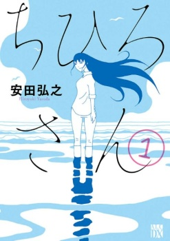
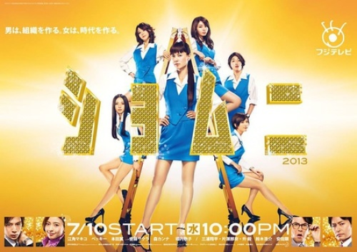

<figure>

</figure>

圖源[Amazon](https://m.media-amazon.com/images/I/61gW2m323QL._SL1037_.jpg)  
自己選書都是用封面在對電波，剛好這部漫畫封面是喜歡的工作室擔當，試閱瞥到的畫風簡單俐落，就是退役的風俗姐在便當店工作的故事，雖然是在還沒看前傳的情況下也不會有劇情斷層的小品，不懂電子書原始人終於學會用火之後，馬上就買爆整套。

我看的順序是二部->一部，非常晚才發現作者最出名的作品台灣有播過啊！！！　

<figure>

</figure>

江角姐姐……Becky……當年的青春……(咳出一口老血)

為了打字方便人名是我自行翻譯的，其實漫畫裡一直都只出現ちひろ沒有漢字。ちひろ就是女主角源氏名(就像花名一樣)。

圖源[Amazon](https://www.amazon.co.jp/%E3%81%A1%E3%81%B2%E3%82%8D-%E4%B8%8A-%E5%AE%89%E7%94%B0-%E5%BC%98%E4%B9%8B/dp/425310276X)
第一部《千尋》的時空背景是女主角還在風俗業打滾的故事，因為先看二部的《千尋小姐》再看第一部被作者早期的粗曠畫風嚇到，有點畫報風格，人物輪廓線條隨性很多不像二部那麼注重比例，2007年出版的書還有泡冒經濟時期的味道，《庶務二課》1998年開始播，漫畫在之前連載差不多就是泡沫經濟泡泡破掉的時間(1990)，以作者的年紀來說大概是初中到剛出社會的期間經歷那一段。

風俗小姐到二部轉賣便當？

翻到第二頁看到笑得很甜又有點大咧咧的女主角，腦子馬上浮現5W1H。在便當店工作的前風俗小姐的傳言很快就傳遍整個小鎮，喜歡八卦的人們不管買不買便當都想湊上去了解一下，而把這件事傳出去的正是千尋小姐本人

反正好奇心是擋不住的，有人問她就老實說了。她並不否認酒家女的過去，而且非常不意外的她還曾是No.1的酒店之花，過著自在生活的她認為每個小鎮居民都是可愛的，還會跟混熟的小鎮居民花式玩耍，比玩耍沒人贏得過她，故事很大一部分都在展現千尋小姐的性格和人生觀。

## 關於書名

千尋是源氏名，一部的千尋不斷提到自己內在崩壞，理所當然接受被各種男人的愛玩對象，雖然不讓人糟蹋自己的生活方式，但是用吃皮肉痛讓自己堅強，以常人眼光來看也不算是愛惜自己表現；二部標題有さん兩個字，把自己當成破碎物件的感覺就沒像第一步那麼重。

千尋這個名字來自於她小時候遇見的一個熟年風俗小姐，她形容的感覺是待在這個人身邊體驗到出身以來未曾有過的安心感，從什麼都不問、打屁閒聊、回家、親吻告別，十分平淡無奇的陪伴過程。

_「阿姨妳叫什麼名字？」_  
_「千尋，如果來店請指名。」_

大概是想把以前得到的治癒感也分享給人，這段相遇成為女主角成為風俗小姐的契機。

作者的用詞都是有精挑細選的，譬如「私のいた世界」和「私のいる世界」之類，小小細節差了整個世界的這種感覺。

## 畫風

一部在做風俗業，夜生活居多作者的塗黑很多時候延伸到框外，比二部氣氛沉重很多，角色多圍繞著風俗業和買春的客人，二部則是接觸的人群多，加上比一部更常用水彩暈染風格，整體很明亮，相反二部女主角的黑暗面跑出來時，威壓和厭世感不比在做風俗小姐時差，全身赤裸通透的畫法多在一部收尾跟二部。

## 表面

以職人的心情在幹風俗業(？)不知道為什麼有不想讓人瞧不起這一行的不服輸心態(姐姐你自尊心怎麼都用在奇怪的地方)。

二部曾經恢復過本名。

兩部都有人跟千尋求婚，一部是用比較輕描淡寫的方式結束關係，二部是有一篇的篇幅，但是看不到千尋是怎麼結束關係。

外觀上女主角一部沒怎麼綁頭髮，二部日常就常束馬尾，變成快言快語的率性大姐。

兩部唯一不變的共通點，就是作者對女主角的心境表現還是著重在眼睛吧。黑眼光點、沒有光點、失色無光點、純白，一開始還猜失色無光點的眼神是盛怒或厭世，補完一部才感覺是抽離情感，千尋做出反社會行為時大多也處於這種狀態，純白是沉浸在自我的世界，如果有跟人對話，話語會特別冷酷。

千尋偶爾會做出像是要自殺的事情，站在高樓、攀著圍欄、買了把鋒利的刀、雨天開車到海邊等等等。文章標題寫「何時才可以孓然一身」是千尋在第二部的內心獨白，她內心有部分並不排斥用自殺的方式達到目的。

## 愛為何物

看完後覺得難說明，反正不吐不快，有記憶點的橋段有三個。

第一部千尋的房間養了一大堆植物。某位客人認真想追求千尋送花，最後被千尋用非常委婉的方式拒絕了，她是承認有這樣純真心情的人類很可愛，就像小花一樣令她想好好疼愛，但最終也會快速逝去，而風俗小姐的她就像人造花一樣，用最誠實的謊言為每一位客人綻放。

二是，某篇她拉著風俗店店長出去約會，真的就是壓馬路的那種，送店長自己親手織的圍巾(店長：這他媽太沉重了吧)，然後在約會遊戲結束的時候扔掉圍巾。

雖然不介意被人暴力相對或被拋棄，她反而會先拋棄自己投入真感情的東西，風俗店、恩客、朋友，說謊久了會成真，突然斷捨離就像是背叛她所愛的一切一樣令她痛苦不堪。

_「但是好像很好玩。」_

一部第一集最後離開了工作的店家，快活了一陣子，可是房間的植物在她悉心照料下全死光了。看過一部的感覺後，回想千尋的達觀應該是一種對愛扭曲的執著。

千尋小姐曾為交際花，二部時她真的為了某位男性痛哭，人家是登場數很少的工地小哥，還不是跟她求婚的那位，只是非常偶然被小朋友牽線，一開始對方還怒氣沖沖要找千尋小姐理論，變成聊得來的朋友，打過炮，還被教要怎麼跟女朋友相處，然後千尋不得不為對方的幸福著想放手。

她一點也不會輕視愛情，或對愛情有不甚了解的感覺，正因為太明白自己的感受所以需要親自了斷。

## 歸屬

二部第二集跟便當店老闆娘雨天相遇的回想，被老闆娘在雨天顧店時的愜意吸引，千尋在獨白中第一次出現了「一見鍾情」的字眼，後來老闆娘病倒失明，不得已再徵人就是故事開頭千尋去應徵便當店的原因。

該篇篇名為「雨蛙」，青蛙的日語發音跟回家一樣，看到那篇就感覺得出來千尋的歸所在何處，確實老闆娘並沒有因為千尋的經歷用自以為是的方式對待她，兩個人在一起就是兩個女孩子或兩個女人，千尋心底悄悄地希望能有這樣的媽媽後，老闆娘自然而然地也對千尋投入了家族愛。

一直以來對愛的恐懼全都是她自找的。

不過老闆娘不是斷根後就快速枯萎的小花，是她真正喜愛的、貨真價實的人。

作品結局就是千尋和她身邊的人都找到歸屬。在爬書評也有人表示，這是男人眼中太過理想的賣娼聖母，衍生出的女性議題不少，不過大部分人看完後都是不吐不快，而且配角年齡幅度廣，每篇人生故事都很值得細細品味，不用依戀依賴依靠特定的事物，不是社會的小螺絲釘也不是人造花，努力成為渾然天成的「人」的苦樂，濃縮在短短幾本單行本裡面。這部確定是我2019最喜歡的漫畫，不過它的分級應該是成人向跑不掉，沒辦法對出版社代理有期待呀……
