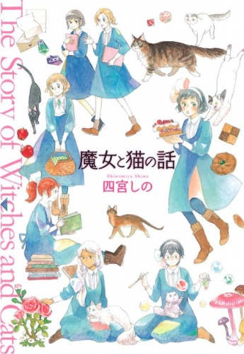

<figure>

</figure>

圖源[Amazon](https://www.amazon.co.jp/%E9%AD%94%E5%A5%B3%E3%81%A8%E7%8C%AB%E3%81%AE%E8%A9%B1-%E3%81%AD%E3%81%93%E3%81%B1%E3%82%93%E3%81%A1%E3%82%B3%E3%83%9F%E3%83%83%E3%82%AF%E3%82%B9-%E5%9B%9B%E5%AE%AE-%E3%81%97%E3%81%AE/dp/4785950072)

會隨心所欲地吃睡的是普通的貓、會用甜膩的聲音喵喵叫的是普通的貓、會看心情蹭你或賞你貓拳的是普通的貓；全天候打量夥伴一言一型，甚至講一些不中聽的話的是魔女的貓、會幫助夥伴循著真心找到未來方向的是魔女的貓、魔女的貓會用全部陪伴此生唯一的魔女一輩子、魔女的貓以身為魔女的守護靈為傲。

這部作品的內容就是跟它書名一樣直白，內容是從魔女見習生和自己守護靈相處的短篇集，有香香的女孩子還可以吸貓，這本書的存在就是正義。
  
## 魔女的貓
世界觀裡還是有普通貓的設定(魔女的貓跟牠們可以語言相通)，只有魔女的貓有人類的心智與貓的邏輯，故事出現的貓的人類型態無一例外都是男性，每隻都香，告白鴛鴦眼紳士爺爺。

在有意願成為魔女的孩子13歲時，以守護靈身分在配對儀式中被召喚出來，磨合一段時間後就帶魔女去接受精靈的指引。通常會和魔女夥伴是相反個性，貓的威嚴裡會有專門針對自己魔女的獨特溫柔。

**_「所有的貓都知道也相信自己的魔女是最好的魔女。」_**

因為不是期待的黑貓，而是讓小魔女失望的斑點貓這麼跟哭成淚人的她說。

在貓的眼裡和魔女相遇都有種命運感，任何奇蹟都是由小小良善意圖構成的，牠們就是這樣既柔軟又可以偏心任性的生物。
  
## 魔女
故事中的魔女絕大多數從事與普通人無異的工作，製香製藥啦、老師、醫生或服務自己社區，除了魔法教師外，他們的世界觀似乎沒有專屬於魔女的工作，在某段時期天災人害最為嚴重時，人們就將這些問題怪罪給魔法使們，所以迫害魔法使跟魔女的狀況層出不窮，現代要看地方人文風情，當然也有魔女與常人和諧相處的社會。

少女既不是女孩也不是女人，被允許天真的期限只剩一點點卻為了摸索未來煩惱不已，守護靈就是來照料這群纖細又看不到自己脆弱點的小魔女，慢慢修補受傷的內心，因為守護靈壽命很長，牠們會很有耐心地調整小魔女的成長步調陪伴終生。
  
## 心得
一樣可惜在沒有代理，2015年成冊初版的耶！怎麼會！之前有瞥過作者的《好學國度》和《手掌怪談》，畫風和劇情都是走樸實路線(一陣子沒看會忘記的那種)，這部用溫暖的筆觸、大量花花草草、想模仿人類動作就會有點笨笨的貓，不會有張揚的華麗感，像是為別人的幸福祈禱似地創作的故事，短短七篇有點看得不太過癮，不過隨時讀、放置一段時間再讀都覺得舒服，並不是針對大人或魔女，有貓無貓的人都值得被療癒。
