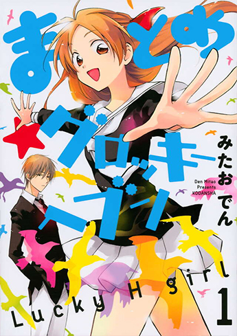
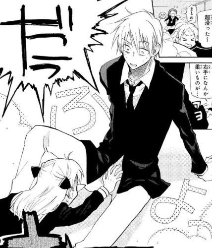
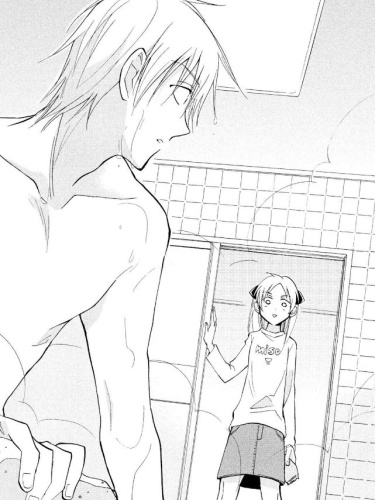
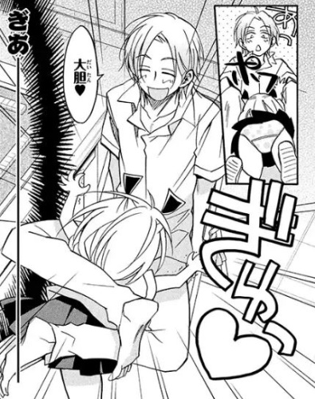
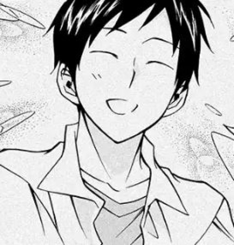

<figure>

<figcaption>

</figcaption>

</figure>

圖源[Amazon](https://www.amazon.co.jp/%E3%81%BE%E3%81%A8%E3%82%81%E2%98%85%E3%82%B0%E3%83%AD%E3%83%83%E3%82%AD%E3%83%BC%E3%83%98%E3%83%96%E3%83%B3-1-KCx-%E3%81%BF%E3%81%9F%E3%81%8A-%E3%81%A7%E3%82%93/dp/4063807835)

套路之後會出現反套路，反套路盛行後反反套路就會悄悄在小地方發芽，如果膩了就在套路中穿插反套路或再反向操作。如果人類是神明的話一定是最喜歡折騰別人的神，故意把世界變成一個倒楣集合體，路上有香蕉皮就一定得踩上去，打完這場戰想回鄉結婚就得死──

這部漫畫就是角色們意識得到自己帶著某種屬性，必然會發動約定成俗橋段，男女主角超級失敗的高中出道就注定接下來的日子不得安寧。圖源[Pixivコミック](https://comic.pixiv.net/works/1340)

</figcaption>

</figure>

男主角屬性：暴力**女主**  
女主角屬性：幸運色狼

目前看到比較有親近感的翻譯是《真乙女★迷糊天堂》，グロッキー好像是拳擊術語(Groggy)，頭昏眼花的意思。

  
## 幸運色狼
女主角開學在大庭廣眾下襲擊了校園王子的第三條腿差點被滅口，後來得知父母分別有幸運色狼和暴力女主屬性，自己繼承到強烈的幸運色狼血統，會無差別地對男同學發動，一個腳滑能把人家剝光，手上有水或奶油就會全方位自動攻擊，只要手裡有媒介(EX：蒲公英)連距離都不成問題。圖源[Pixivコミック](https://comic.pixiv.net/works/1340)

<figure>

<figcaption>

</figcaption>

</figure>

## 暴力女主
只是想認真練柔道又溫柔坦率的好孩子，全校前三名的學霸，血統發動時可以打碎牆壁，也會考慮到殺傷力不願意對女主角使用暴力。

因為租屋處房東某天挖到溫泉，為了蓋溫泉旅館就把租屋的學生們趕出去，男主角不得已只好投靠住附近的阿姨，才知道自己是女主角的**表親**和屬性血統的事情，但後來發現自己的父親並不是幸運色狼而是**抖M**，心靈受創的男主角又回去跟女主角住在同一屋簷下。同居梗中不可免的春光外洩，圖源[Pixivコミック](https://comic.pixiv.net/works/1340)

<figure>

<figcaption>

</figcaption>

</figure>

## 開放性感 
通常幸運色狼一定會遇上一名開放性感角色(Byまとめ父親)，男主角的朋友也是性別屬性錯置，但本人並不怎麼在意，為了兩個人的關係操壞心的情況還比較多。圖源[Pixivコミック](https://comic.pixiv.net/works/1340)

<figure>

<figcaption>

</figcaption>

</figure>

## 青梅竹馬
在約定成俗橋段下，必然會在男女主角關係有進展時殺出黑馬，**有堪比德魯伊的馴獸能力**，跟女主角在一起時常發生奶油犬事故。過了好幾話自己跟女主角才想起來兩人小時候常一起玩，反射弧有點長的青梅竹馬。青梅竹馬是個性爽朗的瞇瞇眼少年，圖源[Pixivコミック](https://comic.pixiv.net/works/1340)

<figure>

<figcaption>

</figcaption>

</figure>

## 屬性血統之謎
屬性血統是圍繞著戀愛喜劇誕生的，只要**兩人相愛的話就不會輕易發動**，但是反射弧太長的男女主角最終意識到，**幸運色狼和暴力女主只是相性合得來，並沒有他們真的會中成眷屬的根據**(EX：男主角父母)。

男主角有一名堂兄弟，自帶BGM的神祕角色，在男主角需要做重大決定時會出現，原以為因為是堂兄弟可能會帶著父系的抖M屬性，事實上意外腹黑。在釋出的繼承設定線索還不夠多的情況下，**只能猜女兒會遺傳父方屬性，兒子會繼承母系血統。**

## 小結
作者看起來是鐵了心大玩特玩幸運色狼的梗，人類神明是最喜歡看人帶衰的，想反抗標籤命運最後還是樂見男女主角快樂地手牽手一起踏進婚姻的墳墓，在這之前享受一下青春期少年們被女主角的禽獸力嚇得花容失色拼命遮羞的樣子很趣味(X，在王道少女戀愛漫裡用少年漫套路和逆后宮，整體有90年代歡喜冤家復古喜劇的味道，雖然是帶有致敬時代意味的漫畫，不過目前為止的劇情跟分鏡節奏流暢跨頁唯美，甚至會有點小小期待它可以動畫化。
