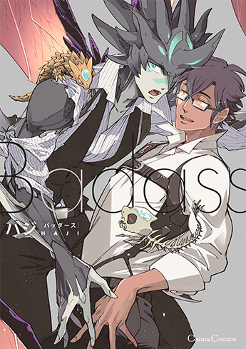

<figure>

</figure>

## 快速簡介！(含我流翻譯)

圖源：[Cannaコミックス](https://www.c-canna.jp/comic/597)

主角之一稀有龍人的「阿爾馮斯」在降職後遇到了奔放的人類上司「但丁」，看似個性輕浮的但丁工作能力強且不可思議地心胸寬大，這是兩人成為搭檔後互相理解日久生情的故事。

(單行本發售後各大網站分冊試閱也收起來了，[單行本試閱走這](https://www.c-canna.jp/viewer/comicview/api/v2/clipstudioreader_hybrid/standard/index.php?cgi=https://www.c-canna.jp/viewer/comicview/api/v2/diazepam_hybrid.php&url=close&file=face.xml&colophon=https%3A%2F%2Fwww.c-canna.jp%2Fcolophon%2F82960029086540000000%3Fclientid%3Dcanna%26productkbn%3D2&colophon_size=320_350&continue=1&v_change=https%3A%2F%2Fwww.c-canna.jp%2Fviewer%2Fcomicview%2Fapi%2Fv2v_change&param=yfgG3j94i7afLw2XSG16bl2f02M6gx7sU8aunDPMsXAilTueMoiUss%2BT1sQ2mDN1Gol%2BbtnmeLe3BtcAw%2FcIQjZD7UYQjrKxk6ryucG2Q5mWK4L%2BeaNnuNaJotfx4Zrz))

## 內容概要

兩人在一間相當於民間保全公司一類的營利組織工作，特殊害獸對策室是裡面比較下階一點的部門，阿爾原本在好的部門位列幹部後補，但休假期間遇上搶劫順手逮捕的強盜裡頭有高官的孩子，加上理念不合就被貶到特殊害獸對策室。

普遍人類並不待見亞人，阿爾的情況特別尷尬，獸類亞人覺得龍人不該跟他們混、龍人也覺得他太溫和沒有稀有種該有的自尊心、人類更不知道跟怎麼相處，到哪裡都覺得自己格格不入。因為但丁個性開放也接受他做為亞人的生活習性才慢慢敞開心房。

但丁則是有高度聽覺的人類，故事看來是空間感和記憶力也相當了得的類型，但是敏感聽覺帶來精神疲勞在生活上也給他造成不小的困擾。對阿爾一開始算是當後輩疼愛，個性奔放就會開放親親抱抱的福利，個性認真的阿爾是會認真看待這些就慢慢寵起來，差不多第三章左右就到處閃瞎人用粉紅泡泡荼毒同事。

故事大部分都圍繞在職場生活，沒有什麼很大的摩擦衝突，正劇只提到但丁的過去，為什麼聽覺敏銳？那是做什麼用的？兩人消化了自己過去的不自信和黑暗面後就在一起了，前前後後都在用力互寵對方。

## 人外Check

．阿爾的龍人設定偏爬蟲類  
．尾巴很長，坐折疊椅時尾巴會穿過椅背  
．能用分岔的舌頭感知氣味  
．本人下面沒有兩根但好像滿持久的  
．在有翅膀的型態是眼盲狀態  
．通訊的小動物是蜥蜴型，會跟但丁的通訊機一起玩。  
．單行本篇幅一時也講不全世界觀，人外描寫還是集中在阿爾本身比較多，不過還是有些只寫在後記裡。

## 吃肉

兩人都是在關鍵時候表現得很溫和，顧慮對方感受沒有太激烈的運動，前戲也比較多。重要部位都是白光沒辦法靠畫面了解上面的顆粒感和異形感，**不過那個能分泌潤滑液的龍尾真的好方便喔喔喔，色色的尾巴和肉肢不會有白光真是太好了！！！**  
親密同居兩星期夜夜笙歌什麼的，有些刺激的地方是用文字帶過沒有高潮，可是但丁寬容接受阿爾會把自己當成雌性親暱這點也是很甜的描寫。

## 坐等代理

雖然台灣有代理幾部作品，但之前真的沒看過ハジ老師的書，第一次看到《Badass》試閱的時候還以為是短篇，一直蹲分冊版又蹲單行本蹲一年半，10/7部分電子書書店優先發行又蹲到10/21……還好被其他人外本雷得不成人形後等到這本是值得的，預期是有點少年漫畫味道的雙人冒險，第一輪看完才發覺是職場戀愛的調性。

原文常強調但丁尻が軽い的形象，故事裡頂多八面玲瓏不至於輕浮，後記才看到作者寫Badass是用雙關語考慮(狠角色與Bad+ass拆解)，尻が軽い可能也是多重意思。

分鏡跟網點整體很舒服，大背景教堂到咖啡杯都沒有含糊，特別喜歡擊掌碰拳、吃螃蟹和某個親額頭的分鏡。有幾個大量文字講說的地方，如果日文吃力就不太推啃原文版，ハジ老師還會發發兩人的圖，不知道有沒有講阿爾背景的續篇，等代理(強烈希望這部能去掉聖光)……或者複習已經出版的，前幾作的角色還在裡面客串感覺這本在企劃出就花了很多心思，自己回頭也要收《地獄邊境的金盞花》。

  
東立《地獄邊境的金盞花》全兩冊  
東立《猿與桃》  
東立《DOUBLE HOUND 獵犬》  
東販《Red Hood》

  
有點意外《和尚與蜘蛛》沒有代理，粗略翻一下常用的[Readmoo](https://readmoo.com/book/210184019000101)和[Bookwalker](https://www.bookwalker.com.tw/search?series=15830)有《地獄邊境的金盞花》，《Badass》會不會代理和電子書現在也說不準了。
